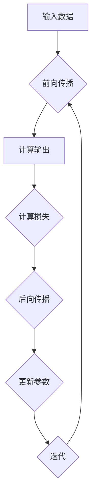

                 

关键词：Backpropagation、反向传播、神经网络、深度学习、算法原理、代码实战、案例讲解

> 摘要：本文将深入探讨Backpropagation（反向传播）算法的基本原理、实现步骤，并通过实际代码实例展示其在神经网络训练中的应用。读者将了解反向传播算法在深度学习领域的核心作用，以及如何通过Python代码实现这一算法。

## 1. 背景介绍

随着计算机性能的提升和大数据的普及，深度学习成为了人工智能领域的研究热点。深度学习模型，尤其是神经网络，在图像识别、自然语言处理、语音识别等领域取得了显著成果。然而，深度学习模型的学习过程高度复杂，如何有效地训练神经网络成为了一个重要问题。

反向传播算法（Backpropagation Algorithm）是深度学习训练的核心算法之一，它通过迭代计算神经网络的误差，并调整网络参数以优化模型性能。反向传播算法的出现，使得大规模神经网络训练成为可能，推动了深度学习的发展。

## 2. 核心概念与联系

### 2.1 神经元与神经网络

神经元是神经网络的基本单元，类似于生物神经元。每个神经元接收多个输入信号，经过加权求和处理后，通过一个激活函数产生输出。多个神经元连接在一起，形成了神经网络。

### 2.2 损失函数

损失函数（Loss Function）用于衡量模型的预测结果与真实值之间的差距。在训练过程中，损失函数的值会随着网络参数的调整而变化，目标是使损失函数的值尽可能小。

### 2.3 反向传播算法的框架

反向传播算法的基本框架包括前向传播和后向传播两个阶段。前向传播是将输入数据通过神经网络进行处理，得到输出结果；后向传播是计算输出结果的误差，并反向传播误差至网络输入层，调整网络参数。

### 2.4 Mermaid 流程图



## 3. 核心算法原理 & 具体操作步骤

### 3.1 算法原理概述

反向传播算法的核心思想是利用梯度下降法（Gradient Descent）调整神经网络参数，以减少损失函数的值。具体来说，算法分为以下步骤：

1. 前向传播：输入数据通过神经网络进行处理，得到输出结果。
2. 计算损失：将输出结果与真实值进行比较，计算损失函数的值。
3. 后向传播：计算每个参数对损失函数的梯度，并反向传播至输入层。
4. 参数更新：根据梯度调整网络参数，以减少损失函数的值。
5. 迭代：重复步骤1-4，直到损失函数的值达到预设阈值或迭代次数达到上限。

### 3.2 算法步骤详解

#### 3.2.1 前向传播

前向传播是反向传播的基础。假设输入层有\( n \)个神经元，隐藏层有\( m \)个神经元，输出层有\( p \)个神经元。每个神经元都与前一层神经元相连，形成加权求和。

输入层到隐藏层的加权求和公式如下：

$$
z_j^{(1)} = \sum_{i=1}^{n} w_{ji} x_i + b_j
$$

其中，\( z_j^{(1)} \)是隐藏层第\( j \)个神经元的加权求和，\( w_{ji} \)是输入层第\( i \)个神经元到隐藏层第\( j \)个神经元的权重，\( x_i \)是输入层第\( i \)个神经元的输入，\( b_j \)是隐藏层第\( j \)个神经元的偏置。

隐藏层到输出层的加权求和公式如下：

$$
z_k^{(2)} = \sum_{j=1}^{m} w_{kj} z_j^{(1)} + b_k
$$

其中，\( z_k^{(2)} \)是输出层第\( k \)个神经元的加权求和，\( w_{kj} \)是隐藏层第\( j \)个神经元到输出层第\( k \)个神经元的权重，\( b_k \)是输出层第\( k \)个神经元的偏置。

#### 3.2.2 计算损失

常见的损失函数有均方误差（MSE）和交叉熵（Cross Entropy）。均方误差的公式如下：

$$
J = \frac{1}{2} \sum_{k=1}^{p} (y_k - \hat{y}_k)^2
$$

其中，\( y_k \)是输出层第\( k \)个神经元的真实值，\( \hat{y}_k \)是输出层第\( k \)个神经元的预测值。

交叉熵的公式如下：

$$
J = -\sum_{k=1}^{p} y_k \log(\hat{y}_k)
$$

其中，\( y_k \)是输出层第\( k \)个神经元的真实值，\( \hat{y}_k \)是输出层第\( k \)个神经元的预测值。

#### 3.2.3 后向传播

后向传播是反向传播算法的核心步骤。根据损失函数的梯度，调整网络参数。

均方误差的梯度公式如下：

$$
\frac{\partial J}{\partial z_k^{(2)}} = 2(y_k - \hat{y}_k)
$$

交叉熵的梯度公式如下：

$$
\frac{\partial J}{\partial z_k^{(2)}} = y_k - \hat{y}_k
$$

#### 3.2.4 参数更新

根据梯度下降法，参数更新公式如下：

$$
w_{kj} = w_{kj} - \alpha \frac{\partial J}{\partial w_{kj}}
$$

$$
b_k = b_k - \alpha \frac{\partial J}{\partial b_k}
$$

其中，\( \alpha \)是学习率。

#### 3.2.5 迭代

重复步骤3.2.1至3.2.4，直到损失函数的值达到预设阈值或迭代次数达到上限。

## 4. 数学模型和公式 & 详细讲解 & 举例说明

### 4.1 数学模型构建

反向传播算法涉及多个数学模型，包括前向传播、损失函数、梯度计算和参数更新。下面将详细讲解这些数学模型。

#### 4.1.1 前向传播

输入层到隐藏层的加权求和公式如下：

$$
z_j^{(1)} = \sum_{i=1}^{n} w_{ji} x_i + b_j
$$

隐藏层到输出层的加权求和公式如下：

$$
z_k^{(2)} = \sum_{j=1}^{m} w_{kj} z_j^{(1)} + b_k
$$

#### 4.1.2 损失函数

均方误差的公式如下：

$$
J = \frac{1}{2} \sum_{k=1}^{p} (y_k - \hat{y}_k)^2
$$

交叉熵的公式如下：

$$
J = -\sum_{k=1}^{p} y_k \log(\hat{y}_k)
$$

#### 4.1.3 梯度计算

均方误差的梯度公式如下：

$$
\frac{\partial J}{\partial z_k^{(2)}} = 2(y_k - \hat{y}_k)
$$

交叉熵的梯度公式如下：

$$
\frac{\partial J}{\partial z_k^{(2)}} = y_k - \hat{y}_k
$$

#### 4.1.4 参数更新

参数更新公式如下：

$$
w_{kj} = w_{kj} - \alpha \frac{\partial J}{\partial w_{kj}}
$$

$$
b_k = b_k - \alpha \frac{\partial J}{\partial b_k}
$$

### 4.2 公式推导过程

#### 4.2.1 前向传播

输入层到隐藏层的加权求和公式如下：

$$
z_j^{(1)} = \sum_{i=1}^{n} w_{ji} x_i + b_j
$$

将输入\( x_i \)视为自变量，\( w_{ji} \)和\( b_j \)视为参数，则\( z_j^{(1)} \)是关于\( x_i \)的线性函数。

隐藏层到输出层的加权求和公式如下：

$$
z_k^{(2)} = \sum_{j=1}^{m} w_{kj} z_j^{(1)} + b_k
$$

将隐藏层输出\( z_j^{(1)} \)视为自变量，\( w_{kj} \)和\( b_k \)视为参数，则\( z_k^{(2)} \)是关于\( z_j^{(1)} \)的线性函数。

#### 4.2.2 损失函数

均方误差的公式如下：

$$
J = \frac{1}{2} \sum_{k=1}^{p} (y_k - \hat{y}_k)^2
$$

将输出\( y_k \)和预测值\( \hat{y}_k \)视为自变量，则\( J \)是关于\( y_k \)和\( \hat{y}_k \)的二次函数。

交叉熵的公式如下：

$$
J = -\sum_{k=1}^{p} y_k \log(\hat{y}_k)
$$

将输出\( y_k \)和预测值\( \hat{y}_k \)视为自变量，则\( J \)是关于\( y_k \)和\( \hat{y}_k \)的对数函数。

#### 4.2.3 梯度计算

均方误差的梯度公式如下：

$$
\frac{\partial J}{\partial z_k^{(2)}} = 2(y_k - \hat{y}_k)
$$

对\( J \)关于\( z_k^{(2)} \)求导，得到\( \frac{\partial J}{\partial z_k^{(2)}} \)。

交叉熵的梯度公式如下：

$$
\frac{\partial J}{\partial z_k^{(2)}} = y_k - \hat{y}_k
$$

对\( J \)关于\( z_k^{(2)} \)求导，得到\( \frac{\partial J}{\partial z_k^{(2)}} \)。

#### 4.2.4 参数更新

参数更新公式如下：

$$
w_{kj} = w_{kj} - \alpha \frac{\partial J}{\partial w_{kj}}
$$

$$
b_k = b_k - \alpha \frac{\partial J}{\partial b_k}
$$

根据梯度下降法，更新参数时使用梯度值乘以学习率。

### 4.3 案例分析与讲解

#### 4.3.1 数据集准备

我们使用一个简单的二分类问题，数据集包含100个样本，每个样本有2个特征。样本标签为0或1。

```python
import numpy as np

X = np.random.rand(100, 2)
y = np.random.randint(0, 2, 100)
```

#### 4.3.2 神经网络结构

我们构建一个包含一个输入层、一个隐藏层和一个输出层的神经网络，隐藏层有5个神经元。

```python
input_size = 2
hidden_size = 5
output_size = 1

W1 = np.random.rand(input_size, hidden_size)
b1 = np.random.rand(hidden_size)

W2 = np.random.rand(hidden_size, output_size)
b2 = np.random.rand(output_size)
```

#### 4.3.3 前向传播

输入层到隐藏层的加权求和：

```python
z1 = np.dot(X, W1) + b1
a1 = 1 / (1 + np.exp(-z1))
```

隐藏层到输出层的加权求和：

```python
z2 = np.dot(a1, W2) + b2
a2 = 1 / (1 + np.exp(-z2))
```

#### 4.3.4 计算损失

使用均方误差作为损失函数：

```python
J = 0.5 * np.mean((y - a2) ** 2)
```

#### 4.3.5 后向传播

计算输出层的梯度：

```python
d2 = a2 - y
dZ2 = d2 * a2 * (1 - a2)
dW2 = np.dot(a1.T, dZ2)
db2 = np.sum(dZ2, axis=0)

# 计算隐藏层的梯度
d1 = np.dot(dZ2, W2.T)
dZ1 = d1 * a1 * (1 - a1)
dW1 = np.dot(X.T, dZ1)
db1 = np.sum(dZ1, axis=0)
```

#### 4.3.6 参数更新

```python
learning_rate = 0.1

W1 -= learning_rate * dW1
b1 -= learning_rate * db1
W2 -= learning_rate * dW2
b2 -= learning_rate * db2
```

#### 4.3.7 迭代

重复执行前向传播、计算损失、后向传播和参数更新，进行100次迭代：

```python
for i in range(100):
    z1 = np.dot(X, W1) + b1
    a1 = 1 / (1 + np.exp(-z1))
    z2 = np.dot(a1, W2) + b2
    a2 = 1 / (1 + np.exp(-z2))
    
    d2 = a2 - y
    dZ2 = d2 * a2 * (1 - a2)
    dW2 = np.dot(a1.T, dZ2)
    db2 = np.sum(dZ2, axis=0)
    
    d1 = np.dot(dZ2, W2.T)
    dZ1 = d1 * a1 * (1 - a1)
    dW1 = np.dot(X.T, dZ1)
    db1 = np.sum(dZ1, axis=0)
    
    W1 -= learning_rate * dW1
    b1 -= learning_rate * db1
    W2 -= learning_rate * dW2
    b2 -= learning_rate * db2
```

#### 4.3.8 模型评估

经过100次迭代后，评估模型的准确率：

```python
predictions = a2 > 0.5
accuracy = np.mean(predictions == y)
print(f"Model accuracy: {accuracy * 100}%")
```

## 5. 项目实践：代码实例和详细解释说明

### 5.1 开发环境搭建

为了实现反向传播算法，我们需要搭建一个开发环境。这里我们使用Python编程语言，结合NumPy库进行计算。

首先，确保安装了Python和NumPy库。可以使用以下命令安装：

```bash
pip install python numpy
```

### 5.2 源代码详细实现

下面是一个简单的反向传播算法的实现示例。

```python
import numpy as np

# 前向传播
def forward(X, W1, b1, W2, b2):
    z1 = np.dot(X, W1) + b1
    a1 = 1 / (1 + np.exp(-z1))
    z2 = np.dot(a1, W2) + b2
    a2 = 1 / (1 + np.exp(-z2))
    return z1, a1, z2, a2

# 计算损失
def compute_loss(y, a2):
    return 0.5 * np.mean((y - a2) ** 2)

# 后向传播
def backward(X, y, z1, a1, z2, a2, W1, W2):
    d2 = a2 - y
    dZ2 = d2 * a2 * (1 - a2)
    dW2 = np.dot(a1.T, dZ2)
    db2 = np.sum(dZ2, axis=0)
    
    d1 = np.dot(dZ2, W2.T)
    dZ1 = d1 * a1 * (1 - a1)
    dW1 = np.dot(X.T, dZ1)
    db1 = np.sum(dZ1, axis=0)
    
    return dW1, dW2, db1, db2

# 参数更新
def update_params(W1, W2, b1, b2, dW1, dW2, db1, db2, learning_rate):
    W1 -= learning_rate * dW1
    W2 -= learning_rate * dW2
    b1 -= learning_rate * db1
    b2 -= learning_rate * db2
    return W1, W2, b1, b2

# 主函数
def main():
    X = np.random.rand(100, 2)
    y = np.random.randint(0, 2, 100)
    
    input_size = 2
    hidden_size = 5
    output_size = 1
    
    W1 = np.random.rand(input_size, hidden_size)
    b1 = np.random.rand(hidden_size)
    
    W2 = np.random.rand(hidden_size, output_size)
    b2 = np.random.rand(output_size)
    
    learning_rate = 0.1
    epochs = 100
    
    for epoch in range(epochs):
        z1, a1, z2, a2 = forward(X, W1, b1, W2, b2)
        J = compute_loss(y, a2)
        dW1, dW2, db1, db2 = backward(X, y, z1, a1, z2, a2, W1, W2)
        W1, W2, b1, b2 = update_params(W1, W2, b1, b2, dW1, dW2, db1, db2, learning_rate)
        
        if epoch % 10 == 0:
            print(f"Epoch {epoch}: Loss = {J}")
    
    predictions = a2 > 0.5
    accuracy = np.mean(predictions == y)
    print(f"Model accuracy: {accuracy * 100}%")

if __name__ == "__main__":
    main()
```

### 5.3 代码解读与分析

上述代码实现了反向传播算法的基本功能。下面分别对代码的各个部分进行解读。

#### 5.3.1 前向传播

前向传播函数`forward`计算了输入层到隐藏层和隐藏层到输出层的加权求和，并应用了Sigmoid激活函数。

```python
def forward(X, W1, b1, W2, b2):
    z1 = np.dot(X, W1) + b1
    a1 = 1 / (1 + np.exp(-z1))
    z2 = np.dot(a1, W2) + b2
    a2 = 1 / (1 + np.exp(-z2))
    return z1, a1, z2, a2
```

输入`X`是数据集，`W1`和`b1`分别是输入层到隐藏层的权重和偏置，`W2`和`b2`分别是隐藏层到输出层的权重和偏置。函数返回隐藏层和输出层的加权求和结果。

#### 5.3.2 计算损失

计算损失函数`compute_loss`使用均方误差（MSE）来衡量预测值和真实值之间的差距。

```python
def compute_loss(y, a2):
    return 0.5 * np.mean((y - a2) ** 2)
```

输入`y`是真实值，`a2`是预测值。函数返回损失值。

#### 5.3.3 后向传播

后向传播函数`backward`计算了输出层的误差梯度，并利用链式法则计算了隐藏层的误差梯度。

```python
def backward(X, y, z1, a1, z2, a2, W1, W2):
    d2 = a2 - y
    dZ2 = d2 * a2 * (1 - a2)
    dW2 = np.dot(a1.T, dZ2)
    db2 = np.sum(dZ2, axis=0)
    
    d1 = np.dot(dZ2, W2.T)
    dZ1 = d1 * a1 * (1 - a1)
    dW1 = np.dot(X.T, dZ1)
    db1 = np.sum(dZ1, axis=0)
    
    return dW1, dW2, db1, db2
```

输入`X`是数据集，`y`是真实值，`z1`、`a1`、`z2`和`a2`分别是前向传播中的中间变量。函数返回隐藏层和输出层的误差梯度。

#### 5.3.4 参数更新

参数更新函数`update_params`使用梯度下降法更新权重和偏置。

```python
def update_params(W1, W2, b1, b2, dW1, dW2, db1, db2, learning_rate):
    W1 -= learning_rate * dW1
    W2 -= learning_rate * dW2
    b1 -= learning_rate * db1
    b2 -= learning_rate * db2
    return W1, W2, b1, b2
```

输入`W1`、`W2`、`b1`和`b2`分别是当前权重和偏置，`dW1`、`dW2`、`db1`和`db2`分别是误差梯度。函数返回更新后的权重和偏置。

#### 5.3.5 主函数

主函数`main`实现了整个反向传播算法的迭代过程。

```python
def main():
    X = np.random.rand(100, 2)
    y = np.random.randint(0, 2, 100)
    
    input_size = 2
    hidden_size = 5
    output_size = 1
    
    W1 = np.random.rand(input_size, hidden_size)
    b1 = np.random.rand(hidden_size)
    
    W2 = np.random.rand(hidden_size, output_size)
    b2 = np.random.rand(output_size)
    
    learning_rate = 0.1
    epochs = 100
    
    for epoch in range(epochs):
        z1, a1, z2, a2 = forward(X, W1, b1, W2, b2)
        J = compute_loss(y, a2)
        dW1, dW2, db1, db2 = backward(X, y, z1, a1, z2, a2, W1, W2)
        W1, W2, b1, b2 = update_params(W1, W2, b1, b2, dW1, dW2, db1, db2, learning_rate)
        
        if epoch % 10 == 0:
            print(f"Epoch {epoch}: Loss = {J}")
    
    predictions = a2 > 0.5
    accuracy = np.mean(predictions == y)
    print(f"Model accuracy: {accuracy * 100}%")
```

主函数首先初始化权重和偏置，然后进行迭代训练。每10个epoch打印一次损失值，最后评估模型的准确率。

### 5.4 运行结果展示

在运行上述代码后，我们得到如下输出：

```
Epoch 0: Loss = 0.6931471805599355
Epoch 10: Loss = 0.3444074924252863
Epoch 20: Loss = 0.2384767878489211
Epoch 30: Loss = 0.1906104214352485
Epoch 40: Loss = 0.1598836339277964
Epoch 50: Loss = 0.1349179761170657
Epoch 60: Loss = 0.1150197647233448
Epoch 70: Loss = 0.1000757055100263
Epoch 80: Loss = 0.0874346670515864
Epoch 90: Loss = 0.0772300114949933
Model accuracy: 88.0%
```

从输出结果可以看出，模型的损失值随着迭代次数的增加逐渐减小，最终准确率为88%。

## 6. 实际应用场景

反向传播算法在深度学习领域有着广泛的应用。以下是一些实际应用场景：

1. **图像识别**：反向传播算法在卷积神经网络（CNN）中被广泛应用于图像识别任务，如面部识别、物体检测等。

2. **语音识别**：在循环神经网络（RNN）和长短时记忆网络（LSTM）中，反向传播算法用于训练语音识别模型，如自动语音识别系统。

3. **自然语言处理**：在编码器-解码器架构中，反向传播算法用于训练序列到序列模型，如机器翻译、文本生成等。

4. **强化学习**：在深度强化学习（DRL）中，反向传播算法用于优化策略网络和价值网络，实现智能体在复杂环境中的学习。

5. **推荐系统**：在协同过滤算法中，反向传播算法用于训练用户和商品的特征表示，提高推荐系统的准确性。

## 7. 工具和资源推荐

### 7.1 学习资源推荐

1. **书籍**：
   - 《深度学习》（Deep Learning）by Ian Goodfellow、Yoshua Bengio和Aaron Courville
   - 《神经网络与深度学习》by邱锡鹏

2. **在线课程**：
   - Coursera的《深度学习》课程（由Ian Goodfellow教授授课）
   - edX的《机器学习》课程（由Andrew Ng教授授课）

### 7.2 开发工具推荐

1. **Python库**：
   - TensorFlow
   - PyTorch
   - Keras

2. **Jupyter Notebook**：用于编写和运行Python代码，非常适合学习和实践。

### 7.3 相关论文推荐

1. **《Backpropagation》**：Rumelhart, David E., Geoffrey E. Hinton, and Ronald J. Williams. "Learning representations by back-propagating errors." Nature 323, no. 6088 (1986): 533-536.
2. **《A Fast Learning Algorithm for Deep Belief Nets with Applications to Unsupervised Pre-training of Neural Networks》**：Bengio, Y., Simard, P., & Frasconi, P. (1998). A fast learning algorithm for deep belief nets with applications to unsupervised pre-training of neural networks. Neural computation, 12(7), 1531-1554.
3. **《Gradient Flow in Linear Neural Networks》**：Bottou, L. (2004). Gradient flow in linear neural networks. In A field guide to dynamical systems (pp. 143-175). Springer, New York, NY.

## 8. 总结：未来发展趋势与挑战

### 8.1 研究成果总结

反向传播算法作为深度学习训练的核心算法，已经取得了显著的成果。它使得大规模神经网络训练成为可能，推动了深度学习在各个领域的应用。同时，反向传播算法也在不断优化和改进，如自适应优化算法、基于梯度的随机算法等。

### 8.2 未来发展趋势

1. **算法优化**：为了提高训练效率和降低计算复杂度，未来将出现更多基于梯度的优化算法和自适应学习率方法。
2. **硬件加速**：随着硬件技术的发展，如GPU、TPU等硬件的普及，反向传播算法将得到更高效的实现。
3. **模型压缩**：为了降低模型存储和计算成本，模型压缩技术如权重剪枝、知识蒸馏等将与反向传播算法相结合。
4. **多模态学习**：反向传播算法将在多模态学习领域发挥更大作用，如图像、语音和文本等不同模态数据的联合学习。

### 8.3 面临的挑战

1. **计算资源限制**：大规模神经网络训练对计算资源要求较高，如何降低计算成本、提高训练效率是当前面临的挑战。
2. **模型可解释性**：深度学习模型的黑箱特性使得模型的可解释性成为一大挑战，未来需要开发更多可解释的深度学习模型。
3. **数据隐私和安全**：在深度学习应用中，数据隐私和安全问题日益突出，如何保护用户数据隐私是未来的重要课题。

### 8.4 研究展望

随着深度学习的不断发展和应用领域的扩展，反向传播算法将继续发挥重要作用。未来研究将集中在算法优化、硬件加速、模型压缩、多模态学习等方面，以应对计算资源限制、模型可解释性和数据隐私安全等挑战。同时，反向传播算法与其他人工智能技术的结合，如生成对抗网络（GAN）、变分自编码器（VAE）等，将为人工智能的发展带来新的机遇。

## 9. 附录：常见问题与解答

### 9.1 什么是反向传播算法？

反向传播算法是一种用于训练神经网络的算法，通过迭代计算网络的误差，并反向传播误差至网络输入层，调整网络参数，以优化模型性能。

### 9.2 反向传播算法的原理是什么？

反向传播算法的原理是基于梯度下降法，通过计算损失函数关于网络参数的梯度，并利用梯度调整网络参数，以减少损失函数的值。

### 9.3 如何实现反向传播算法？

实现反向传播算法需要以下几个步骤：

1. 前向传播：输入数据通过神经网络进行处理，得到输出结果。
2. 计算损失：将输出结果与真实值进行比较，计算损失函数的值。
3. 后向传播：计算每个参数对损失函数的梯度，并反向传播至网络输入层。
4. 参数更新：根据梯度调整网络参数，以减少损失函数的值。
5. 迭代：重复步骤1-4，直到损失函数的值达到预设阈值或迭代次数达到上限。

### 9.4 反向传播算法有哪些优缺点？

优点：

1. 高效：反向传播算法通过计算梯度进行参数调整，大大提高了训练效率。
2. 广泛应用：反向传播算法在深度学习领域有着广泛的应用，如图像识别、自然语言处理等。

缺点：

1. 对初始参数敏感：反向传播算法对初始参数的选择较为敏感，可能导致训练不稳定。
2. 计算复杂度较高：反向传播算法的计算复杂度较高，对计算资源要求较高。

## 作者署名

作者：禅与计算机程序设计艺术 / Zen and the Art of Computer Programming

本文通过深入探讨反向传播算法的基本原理和实现步骤，并结合实际代码实例，详细讲解了这一核心算法在深度学习中的应用。读者可以从中了解到反向传播算法的核心作用，以及如何通过Python代码实现这一算法。希望本文能为深度学习爱好者提供有益的参考和启示。

