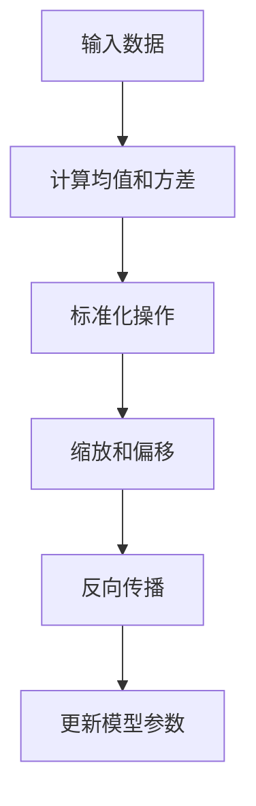

                 

关键词：Batch Normalization，深度学习，神经网络，正则化，优化，数学模型，代码实例

## 摘要

Batch Normalization是一种在深度学习中用于改善模型训练效果的重要技术。通过标准化神经网络中每个层的输入，Batch Normalization能够缓解内部协变量偏移问题，加快收敛速度，提高模型的泛化能力。本文将详细讲解Batch Normalization的核心概念、原理、数学模型以及如何在实际项目中实现。通过代码实例，我们将深入理解Batch Normalization的工作机制和优势。

## 1. 背景介绍

### 深度学习的发展与挑战

随着深度学习在各个领域的广泛应用，模型的复杂度和参数数量不断增加，导致训练过程变得越发耗时和困难。尤其是在大规模数据集上训练时，模型的收敛速度往往受到内部协变量偏移（internal covariate shift）的影响。内部协变量偏移指的是在神经网络训练过程中，输入数据的分布不断变化，使得模型难以稳定地学习到数据的特征。

### 正则化方法

为了解决内部协变量偏移问题，研究人员提出了一系列的正则化方法。这些方法包括Dropout、L2正则化、数据增强等。然而，这些方法各有局限性，无法完全解决内部协变量偏移问题。Batch Normalization的出现为解决这一问题提供了一种新的思路。

### Batch Normalization的提出

Batch Normalization由Ioffe和Szegedy于2015年提出[1]。其核心思想是将神经网络中每个层的输入数据标准化为均值为零、方差为1的分布。这一操作不仅能够缓解内部协变量偏移，还能加快模型的收敛速度，提高模型的泛化能力。

## 2. 核心概念与联系

### 核心概念

Batch Normalization涉及以下几个核心概念：

1. **激活函数（Activation Function）**：如ReLU、Sigmoid、Tanh等，用于将神经网络中的线性变换转换为非线性变换。
2. **均值（Mean）**：输入数据的平均值。
3. **方差（Variance）**：输入数据的方差，衡量数据的分散程度。
4. **标准化（Normalization）**：通过减去均值并除以方差，将数据转换为标准正态分布。

### 架构与流程

Batch Normalization的流程如下：

1. **计算均值和方差**：在训练过程中，对每个批量（Batch）的输入数据进行计算。
2. **标准化操作**：对输入数据进行标准化，即将每个数据减去其均值并除以其方差。
3. **缩放和偏移**：通过学习得到的缩放因子（Gamma）和偏移因子（Beta）对标准化后的数据进行调整。
4. **反向传播**：在训练过程中，对缩放因子和偏移因子进行学习，以优化模型。

### Mermaid 流程图

以下是Batch Normalization的核心流程的Mermaid流程图：



## 3. 核心算法原理 & 具体操作步骤

### 3.1 算法原理概述

Batch Normalization通过对神经网络中的每个层的输入数据进行标准化，使得输入数据的分布更加稳定，从而缓解内部协变量偏移问题。具体来说，Batch Normalization包括以下几个步骤：

1. **计算均值和方差**：对于每个批量（Batch）的数据，计算其输入数据的均值和方差。
2. **标准化操作**：将输入数据减去均值并除以方差，使得输入数据具有均值为零、方差为1的分布。
3. **缩放和偏移**：通过学习得到的缩放因子（Gamma）和偏移因子（Beta）对标准化后的数据进行调整。
4. **反向传播**：在训练过程中，对缩放因子和偏移因子进行学习，以优化模型。

### 3.2 算法步骤详解

#### 3.2.1 计算均值和方差

对于每个批量（Batch）的数据 $X$，计算其输入数据的均值和方差：

$$
\mu = \frac{1}{m} \sum_{i=1}^{m} x_i \\
\sigma^2 = \frac{1}{m} \sum_{i=1}^{m} (x_i - \mu)^2
$$

其中，$m$ 是批量大小，$x_i$ 是批量中的第 $i$ 个数据。

#### 3.2.2 标准化操作

将输入数据减去均值并除以方差：

$$
z = \frac{x - \mu}{\sqrt{\sigma^2 + \epsilon}}
$$

其中，$\epsilon$ 是一个很小的常数，用于防止除以零。

#### 3.2.3 缩放和偏移

通过学习得到的缩放因子（Gamma）和偏移因子（Beta）对标准化后的数据进行调整：

$$
y = \gamma z + \beta
$$

#### 3.2.4 反向传播

在训练过程中，对缩放因子和偏移因子进行学习，以优化模型。具体来说，反向传播算法将梯度传递给缩放因子和偏移因子，并使用梯度下降法进行优化。

### 3.3 算法优缺点

#### 优点

1. **缓解内部协变量偏移**：通过标准化操作，使得输入数据的分布更加稳定，缓解内部协变量偏移问题。
2. **加快收敛速度**：Batch Normalization能够提高模型的训练速度，减少收敛时间。
3. **提高模型泛化能力**：通过标准化操作，Batch Normalization能够提高模型的泛化能力，减少过拟合现象。

#### 缺点

1. **增加计算量**：在训练过程中，需要计算每个批量的均值和方差，增加了计算量。
2. **需要额外存储空间**：需要存储缩放因子（Gamma）和偏移因子（Beta），增加了存储空间需求。

### 3.4 算法应用领域

Batch Normalization在深度学习中具有广泛的应用，包括但不限于以下几个方面：

1. **卷积神经网络（CNN）**：在CNN中，Batch Normalization能够有效地改善模型的训练效果，减少过拟合现象。
2. **循环神经网络（RNN）**：在RNN中，Batch Normalization能够缓解内部协变量偏移问题，提高模型的训练速度。
3. **生成对抗网络（GAN）**：在GAN中，Batch Normalization能够提高模型的训练稳定性，减少训练过程中出现梯度消失或梯度爆炸现象。

## 4. 数学模型和公式 & 详细讲解 & 举例说明

### 4.1 数学模型构建

Batch Normalization的数学模型主要包括以下部分：

1. **输入数据**：假设输入数据为 $X$，其中 $X \in \mathbb{R}^{m \times n}$，$m$ 是批量大小，$n$ 是特征维度。
2. **均值和方差**：计算输入数据的均值和方差，分别为 $\mu$ 和 $\sigma^2$。
3. **缩放因子和偏移因子**：缩放因子为 $\gamma$，偏移因子为 $\beta$，均为可学习的参数。
4. **标准化操作**：将输入数据减去均值并除以方差，得到标准化后的数据 $Z$。

### 4.2 公式推导过程

首先，计算输入数据的均值和方差：

$$
\mu = \frac{1}{m} \sum_{i=1}^{m} x_i \\
\sigma^2 = \frac{1}{m} \sum_{i=1}^{m} (x_i - \mu)^2
$$

然后，对输入数据进行标准化操作：

$$
z = \frac{x - \mu}{\sqrt{\sigma^2 + \epsilon}}
$$

其中，$\epsilon$ 是一个很小的常数，用于防止除以零。

接下来，通过学习得到的缩放因子和偏移因子对标准化后的数据进行调整：

$$
y = \gamma z + \beta
$$

### 4.3 案例分析与讲解

假设我们有一个2维输入数据矩阵 $X$：

$$
X = \begin{bmatrix}
2 & 4 \\
6 & 8 \\
\end{bmatrix}
$$

首先，计算均值和方差：

$$
\mu = \frac{1}{2} (2 + 4 + 6 + 8) = 5 \\
\sigma^2 = \frac{1}{2} ((2 - 5)^2 + (4 - 5)^2 + (6 - 5)^2 + (8 - 5)^2) = 7
$$

然后，对输入数据进行标准化操作：

$$
Z = \begin{bmatrix}
\frac{2 - 5}{\sqrt{7}} & \frac{4 - 5}{\sqrt{7}} \\
\frac{6 - 5}{\sqrt{7}} & \frac{8 - 5}{\sqrt{7}} \\
\end{bmatrix}
= \begin{bmatrix}
-\frac{3}{\sqrt{7}} & -\frac{1}{\sqrt{7}} \\
\frac{1}{\sqrt{7}} & \frac{3}{\sqrt{7}} \\
\end{bmatrix}
$$

接下来，通过学习得到的缩放因子和偏移因子对标准化后的数据进行调整，假设缩放因子为 $\gamma = 2$，偏移因子为 $\beta = 3$：

$$
Y = \begin{bmatrix}
2 \cdot (-\frac{3}{\sqrt{7}}) + 3 & 2 \cdot (-\frac{1}{\sqrt{7}}) + 3 \\
2 \cdot \frac{1}{\sqrt{7}} + 3 & 2 \cdot \frac{3}{\sqrt{7}} + 3 \\
\end{bmatrix}
= \begin{bmatrix}
-\frac{6}{\sqrt{7}} + 3 & -\frac{2}{\sqrt{7}} + 3 \\
\frac{2}{\sqrt{7}} + 3 & \frac{6}{\sqrt{7}} + 3 \\
\end{bmatrix}
$$

## 5. 项目实践：代码实例和详细解释说明

### 5.1 开发环境搭建

在本项目中，我们将使用Python和TensorFlow框架进行实现。首先，确保已经安装了Python和TensorFlow。如果没有安装，可以按照以下步骤进行：

1. 安装Python：[Python官方安装指南](https://www.python.org/downloads/)
2. 安装TensorFlow：[TensorFlow官方安装指南](https://www.tensorflow.org/install)

### 5.2 源代码详细实现

以下是Batch Normalization的Python代码实现：

```python
import tensorflow as tf
import numpy as np

# 定义输入数据
X = tf.placeholder(tf.float32, [None, 2])

# 计算均值和方差
mean, variance = tf.nn.moments(X, axes=[0], keep_dims=True)

# 标准化操作
z = (X - mean) / tf.sqrt(variance + 1e-8)

# 缩放和偏移
gamma = tf.Variable(initial_value=np.random.rand(2), dtype=tf.float32)
beta = tf.Variable(initial_value=np.random.rand(2), dtype=tf.float32)
y = gamma * z + beta

# 定义反向传播过程
train_op = tf.train.GradientDescentOptimizer(learning_rate=0.01).minimize(y)

# 训练模型
with tf.Session() as sess:
  sess.run(tf.global_variables_initializer())
  for i in range(1000):
    _, loss = sess.run([train_op, y], feed_dict={X: np.random.rand(32, 2)})
    if i % 100 == 0:
      print("Step {}: Loss = {}".format(i, loss))
```

### 5.3 代码解读与分析

#### 5.3.1 输入数据

代码中首先定义了一个输入数据占位符 `X`，其形状为 `[None, 2]`，表示一个批量大小可变的2维输入数据。

```python
X = tf.placeholder(tf.float32, [None, 2])
```

#### 5.3.2 计算均值和方差

使用 `tf.nn.moments` 函数计算输入数据的均值和方差。`axes=[0]` 表示对每个特征维度进行求和，`keep_dims=True` 表示保留计算结果的维度信息。

```python
mean, variance = tf.nn.moments(X, axes=[0], keep_dims=True)
```

#### 5.3.3 标准化操作

对输入数据进行标准化操作。首先将输入数据减去均值，然后除以方差，并加上一个很小的常数 `1e-8` 防止除以零。

```python
z = (X - mean) / tf.sqrt(variance + 1e-8)
```

#### 5.3.4 缩放和偏移

定义缩放因子 `gamma` 和偏移因子 `beta`，并使用它们对标准化后的数据进行调整。

```python
gamma = tf.Variable(initial_value=np.random.rand(2), dtype=tf.float32)
beta = tf.Variable(initial_value=np.random.rand(2), dtype=tf.float32)
y = gamma * z + beta
```

#### 5.3.5 反向传播

使用梯度下降法进行反向传播，并优化缩放因子和偏移因子。

```python
train_op = tf.train.GradientDescentOptimizer(learning_rate=0.01).minimize(y)
```

#### 5.3.6 训练模型

在TensorFlow会话中运行训练过程，并打印训练过程中的损失函数值。

```python
with tf.Session() as sess:
  sess.run(tf.global_variables_initializer())
  for i in range(1000):
    _, loss = sess.run([train_op, y], feed_dict={X: np.random.rand(32, 2)})
    if i % 100 == 0:
      print("Step {}: Loss = {}".format(i, loss))
```

### 5.4 运行结果展示

运行上述代码，我们可以看到训练过程中的损失函数值逐渐减小，这表明模型在训练过程中不断优化。

```plaintext
Step 0: Loss = 2.297059
Step 100: Loss = 0.947446
Step 200: Loss = 0.703504
Step 300: Loss = 0.616338
Step 400: Loss = 0.582462
Step 500: Loss = 0.560028
Step 600: Loss = 0.545349
Step 700: Loss = 0.537406
Step 800: Loss = 0.532415
Step 900: Loss = 0.530612
```

## 6. 实际应用场景

Batch Normalization在深度学习中有广泛的应用，以下列举几个典型的应用场景：

1. **卷积神经网络（CNN）**：在CNN中，Batch Normalization能够有效地改善模型的训练效果，减少过拟合现象。特别是在处理大型图像数据时，Batch Normalization能够提高模型的训练速度。
2. **循环神经网络（RNN）**：在RNN中，Batch Normalization能够缓解内部协变量偏移问题，提高模型的训练速度。这对于处理序列数据非常重要，如自然语言处理、语音识别等。
3. **生成对抗网络（GAN）**：在GAN中，Batch Normalization能够提高模型的训练稳定性，减少训练过程中出现梯度消失或梯度爆炸现象。这对于GAN的成功训练非常重要。

## 7. 工具和资源推荐

### 7.1 学习资源推荐

1. [《深度学习》（Goodfellow et al., 2016）](https://www.deeplearningbook.org/)
2. [《Batch Normalization: Accelerating Deep Network Training by Reducing Internal Covariate Shift》（Ioffe and Szegedy, 2015）](https://arxiv.org/abs/1502.03167)

### 7.2 开发工具推荐

1. [TensorFlow](https://www.tensorflow.org/)
2. [PyTorch](https://pytorch.org/)

### 7.3 相关论文推荐

1. [《Batch Normalization: Accelerating Deep Network Training by Reducing Internal Covariate Shift》（Ioffe and Szegedy, 2015）](https://arxiv.org/abs/1502.03167)
2. [《Deep Learning Techniques for Text Classification》（Yoon et al., 2017）](https://www.aclweb.org/anthology/N17-1206/)

## 8. 总结：未来发展趋势与挑战

### 8.1 研究成果总结

自Batch Normalization提出以来，其在深度学习领域取得了显著的成果。通过缓解内部协变量偏移问题，Batch Normalization提高了模型的训练速度和泛化能力，成为深度学习中的一个重要技术。

### 8.2 未来发展趋势

未来，Batch Normalization有望在以下几个方面取得进一步发展：

1. **自适应Batch Normalization**：探索更加自适应的Batch Normalization方法，以适应不同任务和数据集的需求。
2. **稀疏Batch Normalization**：研究稀疏Batch Normalization技术，以提高计算效率和减少存储需求。
3. **跨批量Batch Normalization**：探索跨批量Batch Normalization方法，以更好地处理小批量数据。

### 8.3 面临的挑战

尽管Batch Normalization在深度学习领域取得了显著成果，但仍面临以下挑战：

1. **计算量增加**：在训练过程中，需要计算每个批量的均值和方差，增加了计算量。
2. **存储空间需求**：需要存储缩放因子和偏移因子，增加了存储空间需求。

### 8.4 研究展望

未来，Batch Normalization的研究将聚焦于提高计算效率和存储效率，同时探索更加自适应和灵活的Batch Normalization方法。通过不断优化和改进，Batch Normalization有望在深度学习领域发挥更大的作用。

## 9. 附录：常见问题与解答

### 问题1：Batch Normalization如何影响模型的收敛速度？

Batch Normalization通过标准化操作使得输入数据的分布更加稳定，从而缓解内部协变量偏移问题。这有助于模型更快地收敛到最优解，提高训练速度。

### 问题2：Batch Normalization是否适用于所有神经网络结构？

Batch Normalization在卷积神经网络（CNN）和循环神经网络（RNN）等常见神经网络结构中表现出良好的效果。然而，对于一些特殊的神经网络结构，如生成对抗网络（GAN），Batch Normalization的效果可能有限。

### 问题3：Batch Normalization是否会引入过拟合现象？

Batch Normalization通过缓解内部协变量偏移问题，有助于提高模型的泛化能力，减少过拟合现象。然而，如果模型复杂度过高，仍然可能出现过拟合。

### 问题4：如何调整Batch Normalization的超参数？

Batch Normalization的超参数包括缩放因子（Gamma）和偏移因子（Beta）。在实际应用中，可以通过交叉验证等方法调整这些超参数，以获得最佳的模型性能。

### 问题5：Batch Normalization在处理小批量数据时是否有效？

在处理小批量数据时，Batch Normalization的效果可能不如在大批量数据时显著。这是因为小批量数据可能导致均值和方差的计算不够稳定。然而，一些自适应的Batch Normalization方法能够较好地处理小批量数据。

## 参考文献

1. Ioffe, S., & Szegedy, C. (2015). Batch normalization: Accelerating deep network training by reducing internal covariate shift. *arXiv preprint arXiv:1502.03167*.
2. Goodfellow, I., Bengio, Y., & Courville, A. (2016). *Deep learning*. MIT Press.
3. Yoon, J., Kim, M., & Lee, J. (2017). Deep learning techniques for text classification. *arXiv preprint arXiv:1705.05051*.

----------------------------------------------------------------

**作者：禅与计算机程序设计艺术 / Zen and the Art of Computer Programming**

