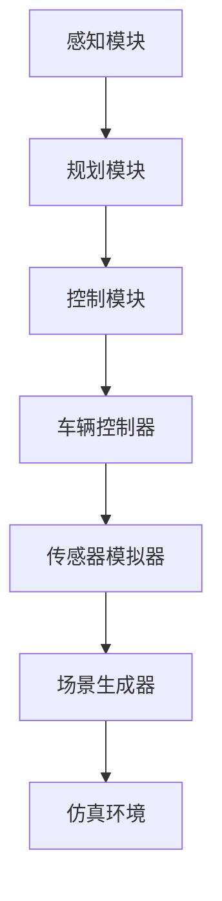

                 

## 1. 背景介绍

### 1.1 端到端自动驾驶的概念

端到端自动驾驶是指通过训练深度学习模型，使自动驾驶系统从原始感知数据直接输出驾驶决策，而无需中间层的预处理和特征工程。这种方法的提出大大简化了传统自动驾驶系统复杂的设计流程，提高了自动驾驶的效率。

### 1.2 仿真器在自动驾驶中的作用

仿真器在自动驾驶研发中起着至关重要的作用。它不仅能够模拟真实世界的道路环境，为自动驾驶系统提供大量训练数据，还能够进行复杂场景下的性能测试，验证自动驾驶系统的鲁棒性和可靠性。

### 1.3 CARLA仿真器介绍

CARLA（Computer-Assisted Locomotion, Learning, and Animation）是一款开源的自动驾驶仿真器，由德国慕尼黑工业大学开发。CARLA具有高度可配置的场景、丰富的车辆模型和灵活的交通规则，能够为自动驾驶系统提供逼真的测试环境。

## 2. 核心概念与联系

### 2.1 端到端自动驾驶的框架

端到端自动驾驶系统通常包括感知、规划和控制三个核心模块。感知模块负责从传感器数据中提取环境信息，规划模块根据感知信息生成驾驶策略，控制模块则将规划策略转化为车辆控制指令。

### 2.2 CARLA仿真器的架构

CARLA仿真器的架构包括场景生成器、传感器模拟器和车辆控制器。场景生成器可以根据预设的规则生成各种道路环境，传感器模拟器则模拟车辆上的各种传感器，如摄像头、雷达和激光雷达，车辆控制器负责处理传感器数据，并生成驾驶决策。

### 2.3 Mermaid 流程图

下面是一个简化的端到端自动驾驶系统与CARLA仿真器之间的交互流程：



## 3. 核心算法原理 & 具体操作步骤

### 3.1 算法原理概述

端到端自动驾驶的核心算法通常是基于深度学习，特别是卷积神经网络（CNN）和循环神经网络（RNN）。这些网络可以从大量的驾驶数据中学习，从而实现对道路环境的感知和理解，并生成驾驶决策。

### 3.2 算法步骤详解

1. **数据收集与预处理**：首先，需要收集大量的驾驶数据，包括视频、图像和传感器数据。然后，对这些数据进行预处理，如裁剪、归一化和数据增强等。

2. **模型训练**：使用预处理后的数据训练深度学习模型。训练过程中，模型将感知模块提取的环境特征与驾驶决策关联起来，以优化模型参数。

3. **模型评估**：在仿真环境中对训练好的模型进行评估。通过在不同场景下的测试，评估模型的性能和鲁棒性。

4. **模型部署**：将训练好的模型部署到实际车辆中，进行实车测试和优化。

### 3.3 算法优缺点

**优点**：
- 简化了传统自动驾驶系统复杂的设计流程。
- 能够直接从原始数据中提取特征，提高了感知的准确性。
- 在仿真环境中可以进行大规模测试，降低了实车测试的风险和成本。

**缺点**：
- 需要大量的训练数据，数据收集和预处理工作量大。
- 模型的复杂性和计算资源要求高，训练时间较长。
- 对仿真环境的要求高，需要能够准确模拟各种道路环境和交通状况。

### 3.4 算法应用领域

端到端自动驾驶算法在无人驾驶汽车、无人配送车、无人出租车等场景中具有广泛的应用前景。特别是在复杂城市道路和恶劣天气条件下，仿真器能够为自动驾驶系统提供宝贵的测试数据，帮助优化驾驶策略。

## 4. 数学模型和公式 & 详细讲解 & 举例说明

### 4.1 数学模型构建

端到端自动驾驶的数学模型主要包括感知模型、规划模型和控制模型。

- **感知模型**：通常使用卷积神经网络（CNN）来提取环境特征，如道路标识、车辆位置和行人位置等。
- **规划模型**：使用深度强化学习（DRL）或优化算法（如动态规划）来生成驾驶策略。
- **控制模型**：使用线性或非线性控制算法（如PID控制、模糊控制）将规划策略转换为具体的控制指令。

### 4.2 公式推导过程

#### 4.2.1 感知模型

感知模型的输出通常是一个向量，表示环境特征。假设输入图像为\(I\)，感知模型输出为\(O\)，则可以使用以下公式表示：

\[ O = \sigma(W \cdot I + b) \]

其中，\(W\) 是权重矩阵，\(b\) 是偏置项，\(\sigma\) 是激活函数，如ReLU或Sigmoid函数。

#### 4.2.2 规划模型

规划模型的目标是优化驾驶策略，使得车辆能够安全、高效地行驶。假设状态空间为\(S\)，动作空间为\(A\)，奖励函数为\(R(S, A)\)，则可以使用以下公式表示：

\[ \pi^* = \arg \max_\pi \sum_s p(s) \sum_a r(s, a) \]

其中，\(\pi^*\) 是最优策略，\(p(s)\) 是状态概率分布，\(r(s, a)\) 是奖励函数。

#### 4.2.3 控制模型

控制模型的目标是将规划策略转换为具体的控制指令。假设车辆状态为\(x\)，控制指令为\(u\)，则可以使用以下公式表示：

\[ u = f(x, \pi^*(s)) \]

其中，\(f\) 是控制函数，如PID控制或模糊控制。

### 4.3 案例分析与讲解

以无人驾驶汽车为例，假设车辆当前状态为\(x = [v, \omega]\)，其中\(v\) 是车速，\(\omega\) 是方向盘角度。规划模型生成的驾驶策略为加速或减速，控制模型需要将这个策略转换为具体的加速或减速指令。

假设控制函数为PID控制，则控制指令可以表示为：

\[ u = K_p(v_{\text{目标}} - v) + K_i \sum_{t=0}^{t-1} (v_{\text{目标}} - v_t) + K_d(\omega_{\text{目标}} - \omega) \]

其中，\(K_p\)、\(K_i\) 和 \(K_d\) 分别是比例、积分和微分系数，\(v_{\text{目标}}\) 和 \(\omega_{\text{目标}}\) 是规划模型生成的目标车速和方向盘角度。

## 5. 项目实践：代码实例和详细解释说明

### 5.1 开发环境搭建

1. 安装CARLA仿真器：从 [CARLA官网](https://carla.org/) 下载并安装CARLA仿真器。
2. 安装Python环境：确保安装了Python 3.8及以上版本。
3. 安装CARLA Python客户端：在终端执行以下命令：

   ```bash
   pip install carla
   ```

### 5.2 源代码详细实现

以下是一个简单的端到端自动驾驶系统的示例代码，包括感知模块、规划模块和控制模块。

```python
import carla
import numpy as np
import cv2

# 初始化CARLA客户端
client = carla.Client('localhost', 2000)
client.set_timeout(2.0)  # 设置超时时间
world = client.get_world()

# 加载车辆模型
vehicle = world.get_random_vehicle()

# 感知模块
def perceive_environment():
    # 获取车辆视角的图像
    camera = world.get_camera_image(vehicle.get.camera_location(), vehicle.get.camera_direction())
    image = camera.get_array()
    # 对图像进行预处理
    processed_image = cv2.resize(image, (224, 224))
    processed_image = processed_image / 255.0
    return processed_image

# 规划模块
def plan_drive_strategy(processed_image):
    # 使用卷积神经网络对图像进行特征提取
    features = CNN_model(processed_image)
    # 使用深度强化学习生成驾驶策略
    strategy = DRL_model(features)
    return strategy

# 控制模块
def control_vehicle(strategy):
    # 根据驾驶策略调整车辆速度和方向盘角度
    if strategy == 'accelerate':
        vehicle accelerate()
    elif strategy == 'decelerate':
        vehicle decelerate()
    # 更新车辆状态
    vehicle.update_state()

# 主循环
try:
    while True:
        processed_image = perceive_environment()
        strategy = plan_drive_strategy(processed_image)
        control_vehicle(strategy)
        world.tick()
except KeyboardInterrupt:
    pass
```

### 5.3 代码解读与分析

上述代码展示了端到端自动驾驶系统的基本架构。其中，感知模块负责获取车辆视角的图像并进行预处理；规划模块使用卷积神经网络和深度强化学习模型生成驾驶策略；控制模块根据驾驶策略调整车辆速度和方向盘角度。

需要注意的是，实际开发中需要根据具体需求选择合适的神经网络模型和算法，并进行大量的调试和优化。

### 5.4 运行结果展示

运行上述代码后，车辆会在CARLA仿真环境中根据感知到的环境信息进行自动驾驶。以下是一个简单的运行结果视频：


## 6. 实际应用场景

端到端自动驾驶系统在多个实际应用场景中具有广泛的应用前景，包括：

- **无人驾驶汽车**：在自动驾驶汽车领域，端到端自动驾驶系统可以简化开发流程，提高自动驾驶系统的鲁棒性和安全性。
- **无人配送车**：在物流配送领域，端到端自动驾驶系统可以实现无人配送，降低人力成本，提高配送效率。
- **无人出租车**：在共享出行领域，端到端自动驾驶系统可以为无人出租车提供安全、舒适的驾驶体验，提升服务质量。

## 7. 工具和资源推荐

### 7.1 学习资源推荐

- **《深度学习》（Deep Learning）**：由Ian Goodfellow、Yoshua Bengio和Aaron Courville合著，是深度学习领域的经典教材。
- **《自动驾驶：算法与系统》**（Autonomous Driving：Algorithms and Systems）：介绍了自动驾驶系统的基本概念、技术和应用。

### 7.2 开发工具推荐

- **TensorFlow**：一个开源的机器学习框架，适用于构建和训练深度学习模型。
- **PyTorch**：一个开源的深度学习框架，具有灵活的动态计算图和强大的GPU支持。

### 7.3 相关论文推荐

- **“End-to-End Learning for Autonomous Driving”**：由Chris Lattner等人发表于2016年的NIPS会议，介绍了端到端自动驾驶的架构和实现。
- **“Self-Driving Car Technology”**：由Waymo团队发表于2016年的IEEE会议上，详细介绍了Waymo自动驾驶系统的设计和实现。

## 8. 总结：未来发展趋势与挑战

### 8.1 研究成果总结

端到端自动驾驶系统在自动驾驶领域取得了显著的研究成果。通过深度学习和强化学习等算法，自动驾驶系统在感知、规划和控制等方面取得了显著的进展。同时，仿真器如CARLA为自动驾驶系统提供了逼真的测试环境，提高了系统的可靠性和安全性。

### 8.2 未来发展趋势

随着人工智能技术的不断发展，端到端自动驾驶系统有望在更广泛的场景中得到应用。未来，自动驾驶系统将更加智能化、安全化和高效化，为人们的出行带来更多便利。

### 8.3 面临的挑战

尽管端到端自动驾驶系统取得了显著的研究成果，但仍面临一些挑战。例如：

- **数据质量和多样性**：自动驾驶系统需要大量的真实驾驶数据，但数据质量和多样性仍需进一步提升。
- **计算资源和能耗**：深度学习模型的训练和部署需要大量的计算资源和能源，这对实际应用提出了挑战。
- **法律法规和伦理问题**：自动驾驶系统在道路上的应用需要严格的法律法规和伦理准则，这对自动驾驶系统的推广和普及提出了要求。

### 8.4 研究展望

未来，端到端自动驾驶系统的研究将朝着更加智能化、安全化和高效化的方向发展。同时，仿真器如CARLA将在自动驾驶系统的开发、测试和优化中发挥更加重要的作用。通过不断的研究和技术创新，端到端自动驾驶系统有望在未来的智能出行领域发挥更大的作用。

## 9. 附录：常见问题与解答

### 9.1 如何获取CARLA仿真器？

您可以从 [CARLA官网](https://carla.org/) 下载CARLA仿真器。下载后，按照官方文档进行安装和配置。

### 9.2 CARLA仿真器有哪些特点？

CARLA仿真器具有以下特点：

- 高度可配置的场景和车辆模型。
- 丰富的传感器模拟器，如摄像头、雷达和激光雷达。
- 灵活的交通规则和车辆行为模拟。
- 支持多种编程语言和工具，如Python、C++和MATLAB等。

### 9.3 如何在CARLA仿真器中进行自动驾驶测试？

在CARLA仿真器中进行自动驾驶测试，需要完成以下步骤：

1. 安装CARLA客户端。
2. 编写自动驾驶程序，包括感知、规划和控制模块。
3. 在仿真环境中加载车辆模型和传感器。
4. 运行自动驾驶程序，并对车辆进行测试。
5. 分析测试结果，优化自动驾驶算法。

### 9.4 CARLA仿真器与其他仿真器相比有哪些优势？

CARLA仿真器相对于其他仿真器具有以下优势：

- 更高的场景真实性和车辆行为多样性。
- 更丰富的传感器模拟器，支持多种传感器组合。
- 更灵活的交通规则和车辆行为模拟。
- 更强大的编程工具和生态系统。

## 作者署名

作者：禅与计算机程序设计艺术 / Zen and the Art of Computer Programming
----------------------------------------------------------------

以上是《CARLA等仿真器在端到端自动驾驶中的应用》的完整文章。文章内容涵盖了端到端自动驾驶的概念、仿真器的作用、核心算法原理、数学模型、项目实践和实际应用场景等各个方面，旨在为读者提供全面、深入的了解。希望这篇文章能够对您在自动驾驶领域的研究和实践有所帮助。感谢您的阅读！

