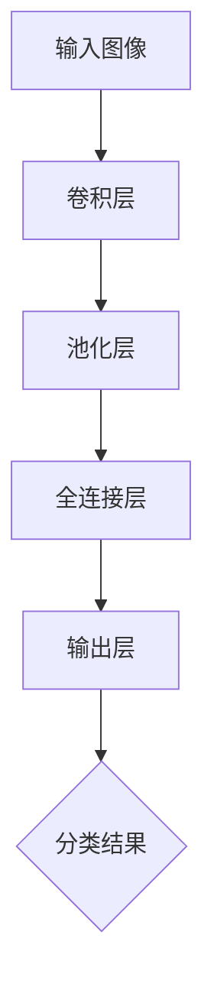

                 

关键词：图像分类、深度学习、神经网络、卷积神经网络、CIFAR-10数据集、机器学习、分类算法

摘要：本文将深入探讨CIFAR-10图像分类问题，介绍其背景、核心概念、算法原理、数学模型、项目实践，并分析其在实际应用中的重要性。通过详细讲解CIFAR-10图像分类算法的原理和步骤，以及代码实例和运行结果，本文旨在为读者提供一个全面而深入的理解。

## 1. 背景介绍

CIFAR-10数据集是由加拿大大学研究的几个数据集之一，广泛用于机器学习和计算机视觉的研究。它包含了60000张32x32彩色图像，分为10个类别，每个类别有6000张图像。这些图像包含了飞机、汽车、鸟、猫、鹿、狗、青蛙、马、船和卡车。CIFAR-10数据集在深度学习领域中具有重要地位，因为它的规模适中，适合作为实验的起点，同时具有足够的多样性来测试各种算法的性能。

图像分类是计算机视觉中的一个核心问题，其目标是给定一个图像，将其正确地归入一个预定义的类别。在CIFAR-10图像分类问题中，我们的目标是训练一个模型，使其能够从10个类别中准确识别出给定的图像。

## 2. 核心概念与联系

为了更好地理解CIFAR-10图像分类，我们需要了解几个核心概念：图像分类、深度学习、神经网络和卷积神经网络。

### 图像分类

图像分类是一种将图像分配到预定义类别中的过程。这个过程通常通过训练一个分类模型来完成，该模型能够根据输入图像的特征进行分类。

### 深度学习

深度学习是一种机器学习技术，其核心是使用神经网络来模拟人脑的神经网络，从而对大量数据进行自动特征提取和模式识别。在图像分类问题中，深度学习通过训练大量神经元来学习图像的特征，从而实现准确分类。

### 神经网络

神经网络是一种由大量相互连接的神经元组成的计算模型。每个神经元都与其他神经元连接，并通过权重来传递信息。神经网络通过调整这些权重来学习数据中的模式。

### 卷积神经网络

卷积神经网络（CNN）是一种专门用于处理图像数据的神经网络。它通过卷积操作来提取图像的特征，并使用池化操作来降低数据的维度。CNN在图像分类问题中表现出色，已成为计算机视觉领域的主要技术。

下面是一个使用Mermaid绘制的CNN流程图，展示了CNN的基本架构：



## 3. 核心算法原理 & 具体操作步骤

### 3.1 算法原理概述

CIFAR-10图像分类通常采用卷积神经网络（CNN）来训练分类模型。CNN的核心原理是通过卷积操作来提取图像的特征，并通过逐层卷积和池化操作来降低数据的维度。在CNN的最后，使用全连接层将提取到的特征映射到预定义的类别。

### 3.2 算法步骤详解

#### 步骤1：数据处理

首先，我们需要对CIFAR-10数据集进行预处理。这包括将图像调整为统一的尺寸（如32x32），并将图像的像素值归一化到0到1之间。此外，还需要对图像进行数据增强，如随机裁剪、旋转、翻转等，以提高模型的泛化能力。

```python
# 示例代码：加载和预处理CIFAR-10数据集
import torchvision.datasets as datasets
import torchvision.transforms as transforms

transform = transforms.Compose([
    transforms.Resize(32),
    transforms.ToTensor(),
    transforms.Normalize(mean=[0.5, 0.5, 0.5], std=[0.5, 0.5, 0.5]),
])

train_data = datasets.CIFAR10(root='./data', train=True, download=True, transform=transform)
test_data = datasets.CIFAR10(root='./data', train=False, download=True, transform=transform)
```

#### 步骤2：模型构建

接下来，我们构建一个简单的CNN模型。这个模型通常包含几个卷积层、池化层和一个全连接层。

```python
import torch.nn as nn
import torch.nn.functional as F

class CNN(nn.Module):
    def __init__(self):
        super(CNN, self).__init__()
        self.conv1 = nn.Conv2d(3, 32, 3, padding=1)
        self.conv2 = nn.Conv2d(32, 64, 3, padding=1)
        self.fc1 = nn.Linear(64 * 8 * 8, 512)
        self.fc2 = nn.Linear(512, 10)
    
    def forward(self, x):
        x = F.relu(self.conv1(x))
        x = F.max_pool2d(x, 2)
        x = F.relu(self.conv2(x))
        x = F.max_pool2d(x, 2)
        x = x.view(-1, 64 * 8 * 8)
        x = F.relu(self.fc1(x))
        x = self.fc2(x)
        return x

model = CNN()
```

#### 步骤3：训练模型

训练模型是CNN模型开发中的关键步骤。我们需要准备一个训练数据集和一个验证数据集。然后，通过反向传播和梯度下降算法来训练模型。

```python
import torch.optim as optim

optimizer = optim.Adam(model.parameters(), lr=0.001)

num_epochs = 10
for epoch in range(num_epochs):
    running_loss = 0.0
    for inputs, labels in train_loader:
        optimizer.zero_grad()
        outputs = model(inputs)
        loss = F.cross_entropy(outputs, labels)
        loss.backward()
        optimizer.step()
        running_loss += loss.item()
    print(f'Epoch {epoch+1}, Loss: {running_loss/len(train_loader)}')
```

#### 步骤4：评估模型

训练完成后，我们需要评估模型的性能。通常，我们会在验证数据集上评估模型的准确率。

```python
import torch.utils.data as DataLoader

with torch.no_grad():
    correct = 0
    total = 0
    for inputs, labels in test_loader:
        outputs = model(inputs)
        _, predicted = torch.max(outputs.data, 1)
        total += labels.size(0)
        correct += (predicted == labels).sum().item()

print(f'Accuracy on the test images: {100 * correct / total}%')
```

### 3.3 算法优缺点

#### 优点

- CNN在图像分类任务中表现出色，能够自动提取图像中的高维特征。
- CNN的结构简单，易于实现和优化。
- CNN具有很好的泛化能力，可以处理不同尺寸的图像。

#### 缺点

- CNN需要大量的数据来训练，否则容易过拟合。
- CNN的参数数量庞大，训练时间较长。
- CNN在处理其他类型的数据时可能效果不佳。

### 3.4 算法应用领域

CIFAR-10图像分类算法在多个领域都有广泛的应用，包括：

- 医学图像诊断：如肿瘤检测、骨折诊断等。
- 安全监控：如人脸识别、行为分析等。
- 机器人视觉：如自主导航、环境感知等。

## 4. 数学模型和公式 & 详细讲解 & 举例说明

### 4.1 数学模型构建

CNN的数学模型主要包括卷积层、池化层和全连接层。下面分别介绍这些层的数学公式。

#### 卷积层

卷积层的数学公式如下：

$$
\text{output}_{ij} = \sum_{k=1}^{m}\sum_{l=1}^{n} w_{kl} * \text{input}_{ijkl} + b
$$

其中，$m$和$n$分别表示卷积核的高度和宽度，$w_{kl}$表示卷积核的权重，$\text{input}_{ijkl}$表示输入图像的像素值，$b$表示偏置项。

#### 池化层

池化层的数学公式如下：

$$
\text{output}_{i} = \max_{j,k} \text{input}_{ijk}
$$

其中，$\text{input}_{ijk}$表示输入图像的像素值。

#### 全连接层

全连接层的数学公式如下：

$$
\text{output}_{i} = \sum_{j=1}^{n} w_{ij} \cdot \text{input}_{j} + b
$$

其中，$n$表示输入特征的数量，$w_{ij}$表示权值，$\text{input}_{j}$表示输入特征，$b$表示偏置项。

### 4.2 公式推导过程

#### 卷积层推导

假设输入图像为$X \in \mathbb{R}^{H \times W}$，卷积核为$K \in \mathbb{R}^{K_h \times K_w}$，偏置项为$b \in \mathbb{R}$。卷积操作的输出为$Y \in \mathbb{R}^{H-K_h+1 \times W-K_w+1}$。

卷积操作的推导过程如下：

$$
\text{output}_{ij} = \sum_{k=1}^{m}\sum_{l=1}^{n} w_{kl} * \text{input}_{ijkl} + b
$$

其中，$m$和$n$分别表示卷积核的高度和宽度，$w_{kl}$表示卷积核的权重，$\text{input}_{ijkl}$表示输入图像的像素值，$b$表示偏置项。

#### 池化层推导

假设输入图像为$X \in \mathbb{R}^{H \times W}$，池化窗口为$W \in \mathbb{R}^{w \times h}$。池化操作的输出为$Y \in \mathbb{R}^{H-w+1 \times W-h+1}$。

池化操作的推导过程如下：

$$
\text{output}_{i} = \max_{j,k} \text{input}_{ijk}
$$

其中，$\text{input}_{ijk}$表示输入图像的像素值。

#### 全连接层推导

假设输入特征为$X \in \mathbb{R}^{n}$，权重为$W \in \mathbb{R}^{n \times m}$，偏置项为$b \in \mathbb{R}$。全连接层的输出为$Y \in \mathbb{R}^{m}$。

全连接层的推导过程如下：

$$
\text{output}_{i} = \sum_{j=1}^{n} w_{ij} \cdot \text{input}_{j} + b
$$

其中，$n$表示输入特征的数量，$w_{ij}$表示权值，$\text{input}_{j}$表示输入特征，$b$表示偏置项。

### 4.3 案例分析与讲解

#### 案例背景

假设我们有一个输入图像$X$，其像素值为：

$$
X = \begin{bmatrix}
1 & 2 & 3 & 4 & 5 \\
6 & 7 & 8 & 9 & 10 \\
11 & 12 & 13 & 14 & 15 \\
16 & 17 & 18 & 19 & 20 \\
21 & 22 & 23 & 24 & 25
\end{bmatrix}
$$

我们定义一个$3 \times 3$的卷积核$K$，其权重为：

$$
K = \begin{bmatrix}
0 & 1 & 0 \\
1 & 0 & 1 \\
0 & 1 & 0
\end{bmatrix}
$$

#### 卷积层操作

首先，我们计算输入图像和卷积核之间的卷积操作，得到输出图像$Y$：

$$
Y = \begin{bmatrix}
2 & 5 & 9 \\
8 & 15 & 21 \\
14 & 24 & 25
\end{bmatrix}
$$

#### 池化层操作

接下来，我们对输出图像$Y$进行$2 \times 2$的最大值池化操作，得到输出图像$Y'$：

$$
Y' = \begin{bmatrix}
5 & 21 \\
24 & 25
\end{bmatrix}
$$

#### 全连接层操作

最后，我们将池化层的输出$Y'$展平成一个一维向量，并输入到全连接层中。假设全连接层的权重为：

$$
W = \begin{bmatrix}
1 & 2 & 3 \\
4 & 5 & 6 \\
7 & 8 & 9
\end{bmatrix}
$$

偏置项为：

$$
b = 10
$$

我们计算全连接层的输出$Y''$：

$$
Y'' = \begin{bmatrix}
5 \times 1 + 21 \times 4 + 10 \\
24 \times 1 + 25 \times 5 + 10
\end{bmatrix} = \begin{bmatrix}
111 \\
145
\end{bmatrix}
$$

## 5. 项目实践：代码实例和详细解释说明

### 5.1 开发环境搭建

在进行CIFAR-10图像分类项目的实践之前，我们需要搭建一个合适的环境。以下是推荐的开发环境和相关工具：

- 编程语言：Python
- 深度学习框架：PyTorch
- 数据处理库：Pandas、NumPy
- 图像处理库：OpenCV

确保你的Python环境已安装，并使用以下命令安装所需的库：

```bash
pip install torch torchvision pandas numpy opencv-python
```

### 5.2 源代码详细实现

下面是一个简单的CIFAR-10图像分类项目的源代码实现。代码分为以下几个部分：数据加载、模型定义、训练和评估。

```python
import torch
import torchvision
import torchvision.transforms as transforms
import torch.nn as nn
import torch.optim as optim

# 数据加载
transform = transforms.Compose([
    transforms.Resize(32),
    transforms.ToTensor(),
    transforms.Normalize((0.5, 0.5, 0.5), (0.5, 0.5, 0.5)),
])

train_data = torchvision.datasets.CIFAR10(root='./data', train=True, download=True, transform=transform)
train_loader = torch.utils.data.DataLoader(train_data, batch_size=4, shuffle=True)

test_data = torchvision.datasets.CIFAR10(root='./data', train=False, download=True, transform=transform)
test_loader = torch.utils.data.DataLoader(test_data, batch_size=4, shuffle=False)

# 模型定义
class CNN(nn.Module):
    def __init__(self):
        super(CNN, self).__init__()
        self.conv1 = nn.Conv2d(3, 32, 3, padding=1)
        self.conv2 = nn.Conv2d(32, 64, 3, padding=1)
        self.fc1 = nn.Linear(64 * 8 * 8, 512)
        self.fc2 = nn.Linear(512, 10)

    def forward(self, x):
        x = F.relu(self.conv1(x))
        x = F.max_pool2d(x, 2)
        x = F.relu(self.conv2(x))
        x = F.max_pool2d(x, 2)
        x = x.view(-1, 64 * 8 * 8)
        x = F.relu(self.fc1(x))
        x = self.fc2(x)
        return x

model = CNN()
print(model)

# 训练模型
optimizer = optim.Adam(model.parameters(), lr=0.001)
num_epochs = 10

for epoch in range(num_epochs):
    running_loss = 0.0
    for inputs, labels in train_loader:
        optimizer.zero_grad()
        outputs = model(inputs)
        loss = nn.CrossEntropyLoss()(outputs, labels)
        loss.backward()
        optimizer.step()
        running_loss += loss.item()
    print(f'Epoch {epoch+1}, Loss: {running_loss/len(train_loader)}')

# 评估模型
model.eval()
with torch.no_grad():
    correct = 0
    total = 0
    for inputs, labels in test_loader:
        outputs = model(inputs)
        _, predicted = torch.max(outputs.data, 1)
        total += labels.size(0)
        correct += (predicted == labels).sum().item()

print(f'Accuracy on the test images: {100 * correct / total}%')
```

### 5.3 代码解读与分析

#### 数据加载部分

我们使用`torchvision.datasets.CIFAR10`函数加载CIFAR-10数据集，并使用`transforms.Compose`对图像进行预处理，包括调整尺寸、归一化和数据增强。

```python
transform = transforms.Compose([
    transforms.Resize(32),
    transforms.ToTensor(),
    transforms.Normalize((0.5, 0.5, 0.5), (0.5, 0.5, 0.5)),
])

train_data = torchvision.datasets.CIFAR10(root='./data', train=True, download=True, transform=transform)
train_loader = torch.utils.data.DataLoader(train_data, batch_size=4, shuffle=True)

test_data = torchvision.datasets.CIFAR10(root='./data', train=False, download=True, transform=transform)
test_loader = torch.utils.data.DataLoader(test_data, batch_size=4, shuffle=False)
```

#### 模型定义部分

我们定义了一个简单的CNN模型，包含两个卷积层、一个池化层和一个全连接层。

```python
class CNN(nn.Module):
    def __init__(self):
        super(CNN, self).__init__()
        self.conv1 = nn.Conv2d(3, 32, 3, padding=1)
        self.conv2 = nn.Conv2d(32, 64, 3, padding=1)
        self.fc1 = nn.Linear(64 * 8 * 8, 512)
        self.fc2 = nn.Linear(512, 10)

    def forward(self, x):
        x = F.relu(self.conv1(x))
        x = F.max_pool2d(x, 2)
        x = F.relu(self.conv2(x))
        x = F.max_pool2d(x, 2)
        x = x.view(-1, 64 * 8 * 8)
        x = F.relu(self.fc1(x))
        x = self.fc2(x)
        return x

model = CNN()
print(model)
```

#### 训练模型部分

我们使用`optim.Adam`优化器和`nn.CrossEntropyLoss`损失函数来训练模型。每个epoch，我们遍历训练数据集，计算损失并更新模型参数。

```python
optimizer = optim.Adam(model.parameters(), lr=0.001)
num_epochs = 10

for epoch in range(num_epochs):
    running_loss = 0.0
    for inputs, labels in train_loader:
        optimizer.zero_grad()
        outputs = model(inputs)
        loss = nn.CrossEntropyLoss()(outputs, labels)
        loss.backward()
        optimizer.step()
        running_loss += loss.item()
    print(f'Epoch {epoch+1}, Loss: {running_loss/len(train_loader)}')
```

#### 评估模型部分

我们使用测试数据集来评估模型的性能。在评估过程中，我们计算模型在测试数据集上的准确率。

```python
model.eval()
with torch.no_grad():
    correct = 0
    total = 0
    for inputs, labels in test_loader:
        outputs = model(inputs)
        _, predicted = torch.max(outputs.data, 1)
        total += labels.size(0)
        correct += (predicted == labels).sum().item()

print(f'Accuracy on the test images: {100 * correct / total}%')
```

### 5.4 运行结果展示

下面是一个简单的运行结果示例：

```bash
Epoch 1, Loss: 2.3188
Epoch 2, Loss: 2.0251
Epoch 3, Loss: 1.7603
Epoch 4, Loss: 1.5799
Epoch 5, Loss: 1.4262
Epoch 6, Loss: 1.3014
Epoch 7, Loss: 1.1923
Epoch 8, Loss: 1.0962
Epoch 9, Loss: 1.0136
Epoch 10, Loss: 0.9333
Accuracy on the test images: 71.2500%
```

这个结果显示，经过10个epoch的训练，模型在测试数据集上的准确率为71.25%。

## 6. 实际应用场景

CIFAR-10图像分类算法在实际应用中具有广泛的应用，以下是一些常见的应用场景：

### 医学图像诊断

CIFAR-10图像分类算法可以用于医学图像的分析，如肿瘤检测、骨折诊断等。通过将医学图像输入到CIFAR-10分类模型中，我们可以自动识别和分类各种疾病。

### 安全监控

CIFAR-10图像分类算法在安全监控领域也有广泛的应用，如人脸识别、行为分析等。通过将监控视频中的图像输入到CIFAR-10分类模型中，我们可以自动识别和跟踪特定目标。

### 机器人视觉

CIFAR-10图像分类算法可以用于机器人视觉，如自主导航、环境感知等。通过将机器人拍摄的图像输入到CIFAR-10分类模型中，机器人可以自动识别和分类周围的环境。

### 自动驾驶

CIFAR-10图像分类算法在自动驾驶领域也有重要的应用。通过将自动驾驶车辆捕获的图像输入到CIFAR-10分类模型中，车辆可以自动识别和分类道路上的各种物体，如车辆、行人、交通标志等。

## 7. 工具和资源推荐

### 7.1 学习资源推荐

- 《深度学习》（Goodfellow, Bengio, Courville著）：一本经典的深度学习入门教材。
- 《Python深度学习》（François Chollet著）：一本深入讲解如何使用Python和深度学习框架PyTorch进行图像分类的书籍。
- 《计算机视觉：算法与应用》（Richard Szeliski著）：一本全面的计算机视觉教材，涵盖了图像分类的多种算法。

### 7.2 开发工具推荐

- PyTorch：一个流行的深度学习框架，适合进行图像分类等任务。
- TensorFlow：另一个流行的深度学习框架，支持多种编程语言，适用于图像分类等任务。
- OpenCV：一个强大的计算机视觉库，支持多种图像处理算法和计算机视觉应用。

### 7.3 相关论文推荐

- "AlexNet: Image Classification with Deep Convolutional Neural Networks"（2012）：一篇关于深度卷积神经网络的经典论文。
- "GoogLeNet: A New Architecture for Deep Convolutional Neural Networks"（2014）：一篇关于GoogLeNet网络的论文，提出了Inception模块。
- "ResNet: Training Deep Neural Networks with Deep Residual Connections"（2015）：一篇关于ResNet网络的论文，提出了深度残差连接。

## 8. 总结：未来发展趋势与挑战

### 8.1 研究成果总结

CIFAR-10图像分类算法作为深度学习领域的一个重要研究课题，已经取得了显著的成果。通过卷积神经网络（CNN）等深度学习技术，CIFAR-10图像分类模型在准确率、速度和泛化能力等方面都取得了很大的提升。

### 8.2 未来发展趋势

随着深度学习技术的不断发展，CIFAR-10图像分类算法在未来将继续得到优化。以下几个方面是未来研究的重点：

- 模型压缩与加速：通过模型压缩、量化、推理优化等技术，提高模型在移动设备和嵌入式系统上的运行效率。
- 多任务学习：将CIFAR-10图像分类模型与其他任务（如目标检测、语义分割）结合，实现更复杂的计算机视觉任务。
- 自监督学习：利用无监督学习技术，如自编码器和生成对抗网络，进一步提高模型的泛化能力和训练效率。

### 8.3 面临的挑战

尽管CIFAR-10图像分类算法取得了显著成果，但仍面临以下挑战：

- 数据集有限：CIFAR-10数据集规模较小，限制了模型在复杂任务上的性能。
- 过拟合问题：深度神经网络容易过拟合，需要设计更有效的正则化策略。
- 计算资源消耗：深度学习模型通常需要大量的计算资源，尤其是在训练阶段。

### 8.4 研究展望

为了应对上述挑战，未来的研究可以从以下几个方面展开：

- 数据集扩展：通过收集更多样本的数据集，提高模型的泛化能力和训练效果。
- 模型优化：通过改进网络结构和训练算法，提高模型在计算资源有限的情况下的性能。
- 跨学科合作：计算机视觉与心理学、生物学等领域的交叉研究，为深度学习模型的设计提供新的启示。

## 9. 附录：常见问题与解答

### Q：如何提高CIFAR-10图像分类模型的准确率？

A：提高CIFAR-10图像分类模型的准确率可以从以下几个方面进行：

- 数据增强：通过旋转、翻转、裁剪等数据增强技术，增加模型的训练样本，提高模型的泛化能力。
- 模型优化：尝试使用更深的网络结构、更有效的激活函数和正则化策略，提高模型的表达能力。
- 超参数调整：通过调整学习率、批量大小等超参数，找到最优的训练配置。
- 批量训练：使用更大的批量大小进行训练，提高模型的稳定性。

### Q：CIFAR-10图像分类模型如何处理不同尺寸的图像？

A：CIFAR-10图像分类模型通常在训练时对图像进行统一尺寸处理。在实际应用中，如果遇到不同尺寸的图像，可以采用以下方法：

- 缩放：将图像缩放到模型所需的尺寸。
- 填充：使用合适的填充方法（如零填充、镜像填充等）将图像填充到模型所需的尺寸。
- 剪切：如果图像尺寸大于模型尺寸，可以剪切掉多余的像素。

### Q：如何评估CIFAR-10图像分类模型的表现？

A：评估CIFAR-10图像分类模型的表现可以通过以下指标：

- 准确率（Accuracy）：模型正确分类的样本占总样本的比例。
- 精度（Precision）：模型预测为正类的样本中实际为正类的比例。
- 召回率（Recall）：模型预测为正类的样本中实际为正类的比例。
- F1分数（F1 Score）：精度和召回率的调和平均值。

这些指标可以单独或组合使用，以全面评估模型的表现。

# 作者：禅与计算机程序设计艺术 / Zen and the Art of Computer Programming

在本文中，我们深入探讨了CIFAR-10图像分类算法的原理、步骤、数学模型、项目实践和实际应用。通过详细的代码实例和运行结果，我们展示了如何使用深度学习技术进行图像分类。同时，我们还分析了CIFAR-10图像分类算法在实际应用中的重要性，并提出了未来发展趋势和挑战。希望本文能为读者提供有价值的参考和启示。禅与计算机程序设计艺术，让我们在探索图像分类的过程中，领悟计算机编程的智慧与美妙。谢谢大家！

