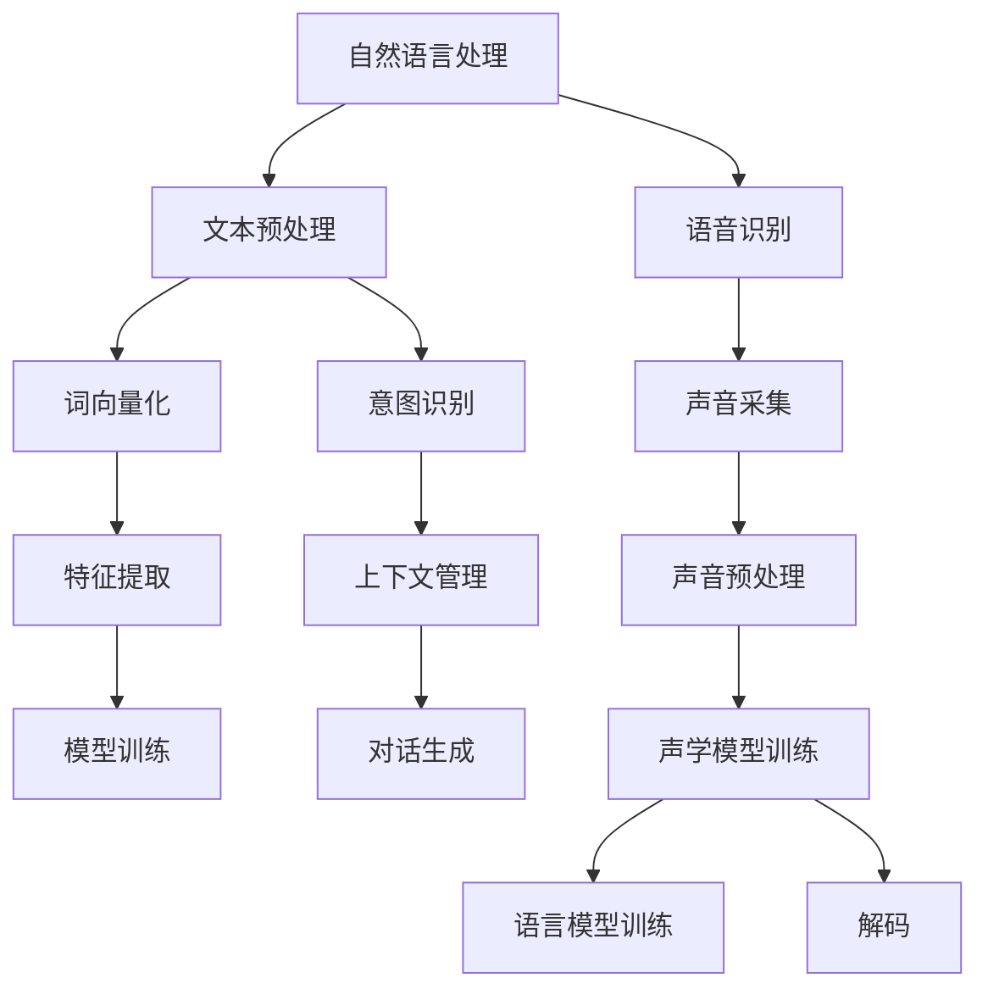

                 

关键词：CUI、数字产品设计、信息架构、用户体验、人工智能、自然语言处理、交互设计

> 摘要：随着人工智能和自然语言处理技术的迅速发展，对话式用户界面（CUI）已成为数字产品设计中的重要组成部分。本文探讨了CUI如何改变数字产品的信息架构，提高了用户交互效率和满意度，并展望了其未来发展的趋势和挑战。

## 1. 背景介绍

在过去的几十年中，计算机技术的飞速发展极大地改变了人类的生活方式。从最早的命令行界面（CLI）到图形用户界面（GUI），用户与计算机的交互方式经历了巨大的变革。然而，GUI虽然在视觉上更加直观，但在交互效率和用户体验方面仍存在一些局限。因此，随着人工智能和自然语言处理技术的不断进步，对话式用户界面（CUI）逐渐成为数字产品设计中的一种新兴交互方式。

CUI通过模拟人类对话方式，使用自然语言与用户进行交互，从而实现了更加自然和高效的交互体验。与传统的GUI相比，CUI能够更好地理解用户的意图，提供更加个性化的服务，减少用户的学习成本，提高用户的满意度和忠诚度。因此，CUI在数字产品设计中的重要性日益凸显。

本文将从以下几个方面展开讨论：

1. **核心概念与联系**：介绍CUI的核心概念，包括自然语言处理、语音识别、对话管理等，并展示其信息架构的Mermaid流程图。
2. **核心算法原理与具体操作步骤**：分析CUI的核心算法，包括语言模型、对话管理、上下文理解等，并详细讲解其操作步骤。
3. **数学模型和公式**：介绍CUI中的数学模型和公式，包括文本处理、语言模型训练等，并给出具体案例进行分析。
4. **项目实践**：通过一个实际项目实例，展示CUI的实现过程和代码细节。
5. **实际应用场景**：探讨CUI在各个领域的应用，包括智能家居、在线客服、智能语音助手等。
6. **未来应用展望**：预测CUI未来的发展趋势和潜在挑战。
7. **工具和资源推荐**：推荐学习资源、开发工具和相关的论文。
8. **总结**：总结研究成果，展望未来发展方向。

## 2. 核心概念与联系

### 2.1 自然语言处理

自然语言处理（NLP）是CUI的核心技术之一。它旨在使计算机能够理解、解释和生成人类语言。NLP的主要任务包括文本分类、情感分析、命名实体识别、机器翻译等。

自然语言处理的工作流程通常包括以下几个步骤：

1. **文本预处理**：包括去除标点、停用词过滤、词干提取等。
2. **词向量化**：将文本转换为数字形式，以便计算机处理。
3. **特征提取**：从词向量中提取有助于分类或预测的特征。
4. **模型训练**：使用训练数据训练模型，使其能够预测或分类新的文本。

### 2.2 语音识别

语音识别（ASR）是将语音信号转换为文本的技术。它是CUI的重要组成部分，使得用户可以通过语音与计算机进行交互。

语音识别的工作流程通常包括以下几个步骤：

1. **声音采集**：通过麦克风采集用户的语音。
2. **声音预处理**：包括降噪、去噪等。
3. **声学模型训练**：训练模型识别语音信号中的声音特征。
4. **语言模型训练**：训练模型识别单词和句子结构。
5. **解码**：将识别的语音信号转换为文本。

### 2.3 对话管理

对话管理是CUI的另一个核心概念，它负责控制对话流程，确保对话的流畅性和有效性。对话管理的主要任务包括意图识别、上下文管理、对话生成等。

对话管理的工作流程通常包括以下几个步骤：

1. **意图识别**：通过自然语言处理技术识别用户的意图。
2. **上下文管理**：根据对话历史和当前对话内容，维护上下文信息。
3. **对话生成**：生成适当的回复，以维持对话的流畅性。

### 2.4 信息架构

CUI的信息架构包括多个层次，从底层的技术架构到顶层的用户交互界面。底层技术架构涉及自然语言处理、语音识别、对话管理等技术，而顶层用户交互界面则关注如何通过对话式交互提供更好的用户体验。

Mermaid流程图如下所示：



## 3. 核心算法原理与具体操作步骤

### 3.1 算法原理概述

CUI的核心算法主要包括自然语言处理（NLP）、对话管理（DM）和语音识别（ASR）等。这些算法各自负责处理不同的任务，但它们之间有着紧密的联系。

**自然语言处理（NLP）** 主要负责将用户的自然语言输入转换为计算机可以理解的形式。这包括文本预处理、词向量化、特征提取和模型训练等步骤。

**对话管理（DM）** 负责控制对话流程，确保对话的流畅性和有效性。对话管理包括意图识别、上下文管理和对话生成等步骤。

**语音识别（ASR）** 则是将用户的语音输入转换为文本的技术。语音识别包括声音采集、声音预处理、声学模型训练、语言模型训练和解码等步骤。

### 3.2 算法步骤详解

**自然语言处理（NLP）**

1. **文本预处理**：包括去除标点、停用词过滤、词干提取等步骤。这些步骤有助于简化文本，使其更容易被计算机处理。
2. **词向量化**：将文本中的每个单词映射为一个向量。这有助于将文本数据转换为计算机可以处理的形式。
3. **特征提取**：从词向量中提取有助于分类或预测的特征。这些特征可以用于训练分类模型或预测模型。
4. **模型训练**：使用训练数据训练模型，使其能够预测或分类新的文本。

**对话管理（DM）**

1. **意图识别**：通过自然语言处理技术识别用户的意图。意图识别通常使用分类模型，将用户的输入文本分类为不同的意图。
2. **上下文管理**：根据对话历史和当前对话内容，维护上下文信息。上下文管理有助于确保对话的流畅性。
3. **对话生成**：生成适当的回复，以维持对话的流畅性。对话生成通常使用序列生成模型，如循环神经网络（RNN）或生成对抗网络（GAN）。

**语音识别（ASR）**

1. **声音采集**：通过麦克风采集用户的语音。
2. **声音预处理**：包括降噪、去噪等步骤。这些步骤有助于提高语音质量。
3. **声学模型训练**：训练模型识别语音信号中的声音特征。声学模型通常使用深度神经网络（DNN）或卷积神经网络（CNN）。
4. **语言模型训练**：训练模型识别单词和句子结构。语言模型通常使用基于NLP技术的模型，如循环神经网络（RNN）或长短时记忆网络（LSTM）。
5. **解码**：将识别的语音信号转换为文本。解码步骤通常使用动态规划算法，如Viterbi算法或CTC算法。

### 3.3 算法优缺点

**自然语言处理（NLP）**

优点：
- 能够处理自然语言输入，提供更加人性化的交互体验。
- 能够识别和理解用户的意图，提供更加精准的服务。

缺点：
- 在处理复杂文本时，可能存在语义理解错误。
- 需要大量的训练数据和计算资源。

**对话管理（DM）**

优点：
- 能够控制对话流程，确保对话的流畅性和有效性。
- 能够提供个性化的服务，提高用户的满意度。

缺点：
- 需要复杂的算法和大量的训练数据。
- 可能存在对话偏离或无法处理的情况。

**语音识别（ASR）**

优点：
- 能够将用户的语音输入转换为文本，提供更加便捷的交互方式。
- 在处理实时语音输入时，具有更高的实时性。

缺点：
- 在处理噪音和口音时，可能存在识别错误。
- 需要大量的计算资源和训练数据。

### 3.4 算法应用领域

CUI的核心算法在多个领域得到了广泛应用，包括：

- **智能家居**：通过语音控制智能设备，如灯光、空调、电视等。
- **在线客服**：提供实时在线客服，解答用户的问题。
- **智能语音助手**：如苹果的Siri、谷歌的Google Assistant等。
- **教育**：提供个性化教育服务，如智能问答系统、语音辅导等。
- **医疗**：通过语音识别和自然语言处理技术，提供医疗咨询和诊断服务。

## 4. 数学模型和公式

### 4.1 数学模型构建

CUI中的数学模型主要包括自然语言处理（NLP）、对话管理（DM）和语音识别（ASR）等。以下是对这些模型的构建过程：

**自然语言处理（NLP）**

- **词向量化**：使用Word2Vec、GloVe等方法将单词映射为向量。
- **特征提取**：使用TF-IDF、Word2Vec等方法提取文本特征。
- **模型训练**：使用分类模型（如SVM、朴素贝叶斯、深度学习模型等）训练模型。

**对话管理（DM）**

- **意图识别**：使用分类模型（如SVM、朴素贝叶斯、深度学习模型等）识别用户的意图。
- **上下文管理**：使用序列模型（如RNN、LSTM、GRU等）维护上下文信息。
- **对话生成**：使用序列生成模型（如RNN、LSTM、GAN等）生成对话回复。

**语音识别（ASR）**

- **声学模型训练**：使用深度神经网络（DNN、CNN等）训练声学模型。
- **语言模型训练**：使用基于NLP技术的模型（如RNN、LSTM等）训练语言模型。
- **解码**：使用动态规划算法（如Viterbi算法、CTC算法等）解码语音信号。

### 4.2 公式推导过程

**自然语言处理（NLP）**

1. **词向量化**：

$$
\text{word\_vector}(w) = \sum_{i=1}^{N} w_i \cdot v_i
$$

其中，$w$表示单词，$w_i$表示单词的第$i$个元素，$v_i$表示第$i$个元素的向量表示。

2. **特征提取**：

$$
\text{feature}(x) = \text{TF-IDF}(x) + \text{Word2Vec}(x)
$$

其中，$x$表示文本，$\text{TF-IDF}(x)$表示文本的TF-IDF特征，$\text{Word2Vec}(x)$表示文本的Word2Vec特征。

3. **模型训练**：

$$
\text{model}(x, y) = \frac{1}{Z} \sum_{y' \in Y} e^{\text{score}(x, y')}
$$

其中，$x$表示输入文本，$y$表示标签，$Y$表示所有可能的标签集合，$Z$表示模型参数的归一化常数。

**对话管理（DM）**

1. **意图识别**：

$$
\text{intent}(x) = \arg\max_{y \in Y} \text{score}(x, y)
$$

其中，$x$表示输入文本，$y$表示标签，$Y$表示所有可能的标签集合。

2. **上下文管理**：

$$
\text{context}(x, y) = \text{RNN}(x, y, \text{context}_{t-1})
$$

其中，$x$表示输入文本，$y$表示标签，$\text{context}_{t-1}$表示前一个时间步的上下文信息，$\text{RNN}$表示循环神经网络。

3. **对话生成**：

$$
\text{response}(x, y) = \text{seq2seq}(x, y, \text{response}_{t-1})
$$

其中，$x$表示输入文本，$y$表示标签，$\text{response}_{t-1}$表示前一个时间步的对话回复，$\text{seq2seq}$表示序列到序列模型。

**语音识别（ASR）**

1. **声学模型训练**：

$$
\text{acoustic\_model}(x) = \arg\max_{y \in Y} \text{score}(x, y)
$$

其中，$x$表示语音信号，$y$表示标签，$Y$表示所有可能的标签集合。

2. **语言模型训练**：

$$
\text{language\_model}(x) = \text{RNN}(x, \text{response}_{t-1})
$$

其中，$x$表示语音信号，$\text{response}_{t-1}$表示前一个时间步的对话回复，$\text{RNN}$表示循环神经网络。

3. **解码**：

$$
\text{decode}(x) = \arg\max_{y \in Y} \text{score}(x, y)
$$

其中，$x$表示语音信号，$y$表示标签，$Y$表示所有可能的标签集合。

### 4.3 案例分析与讲解

**自然语言处理（NLP）**

假设我们有一个简单的文本分类问题，需要将输入文本分类为“正面”或“负面”。我们可以使用朴素贝叶斯模型进行分类。以下是具体的实现过程：

1. **文本预处理**：

```python
import jieba
import numpy as np

def preprocess(text):
    text = text.lower()
    words = jieba.cut(text)
    words = [word for word in words if word not in stopwords]
    return words
```

2. **特征提取**：

```python
from sklearn.feature_extraction.text import TfidfVectorizer

vectorizer = TfidfVectorizer()
X = vectorizer.fit_transform(corpus)
```

3. **模型训练**：

```python
from sklearn.naive_bayes import MultinomialNB

model = MultinomialNB()
model.fit(X_train, y_train)
```

4. **预测**：

```python
def predict(text):
    text = preprocess(text)
    features = vectorizer.transform([text])
    return model.predict(features)[0]

text = "我很喜欢这部电影"
prediction = predict(text)
print(prediction)
```

**对话管理（DM）**

假设我们有一个简单的对话管理任务，需要根据用户的输入文本生成相应的回复。我们可以使用序列到序列模型进行生成。以下是具体的实现过程：

1. **数据准备**：

```python
import numpy as np
import pandas as pd

data = pd.read_csv("dialogue_data.csv")
data["context"] = data["context"].apply(preprocess)
data["response"] = data["response"].apply(preprocess)
```

2. **模型训练**：

```python
from keras.models import Sequential
from keras.layers import LSTM, Dense, Embedding

model = Sequential()
model.add(Embedding(vocab_size, embedding_dim))
model.add(LSTM(units))
model.add(Dense(units, activation='softmax'))

model.compile(optimizer='adam', loss='categorical_crossentropy', metrics=['accuracy'])
model.fit(X_train, y_train, epochs=10, batch_size=32)
```

3. **生成回复**：

```python
def generate_response(context):
    context = preprocess(context)
    response = model.predict(np.array([context]))
    response = response.argmax(axis=-1)
    response = inverse_word_index[response[0][0]]
    return response

context = "你好，我想咨询一下产品A的使用方法"
response = generate_response(context)
print(response)
```

**语音识别（ASR）**

假设我们有一个简单的语音识别任务，需要将用户的语音输入转换为文本。我们可以使用深度神经网络进行识别。以下是具体的实现过程：

1. **数据准备**：

```python
import librosa

def extract_features(file_path):
    audio, _ = librosa.load(file_path, sr=16000)
    mfccs = librosa.feature.mfcc(y=audio, sr=16000, n_mfcc=13)
    mfccs = np.mean(mfccs.T, axis=0)
    return mfccs

X = []
y = []

for file in file_names:
    features = extract_features(file)
    X.append(features)
    y.append(label)

X = np.array(X)
y = np.array(y)
```

2. **模型训练**：

```python
from keras.models import Sequential
from keras.layers import LSTM, Dense, Embedding

model = Sequential()
model.add(LSTM(units, input_shape=(None, X.shape[1])))
model.add(Dense(units, activation='softmax'))

model.compile(optimizer='adam', loss='categorical_crossentropy', metrics=['accuracy'])
model.fit(X_train, y_train, epochs=10, batch_size=32)
```

3. **预测**：

```python
def predict(audio):
    features = extract_features(audio)
    features = np.reshape(features, (1, features.shape[0], 1))
    prediction = model.predict(features)
    prediction = prediction.argmax(axis=-1)
    prediction = inverse_word_index[prediction[0][0]]
    return prediction

audio = librosa.load("audio_file.wav", sr=16000)
prediction = predict(audio)
print(prediction)
```

## 5. 项目实践：代码实例和详细解释说明

### 5.1 开发环境搭建

在本项目实践中，我们将使用Python和Keras等工具来搭建一个简单的CUI系统。以下是开发环境的搭建步骤：

1. **安装Python**：确保已经安装了Python 3.6及以上版本。
2. **安装依赖库**：在终端中运行以下命令：

```bash
pip install numpy pandas scikit-learn keras
```

3. **安装Keras**：确保已经安装了Keras，可以使用以下命令：

```bash
pip install keras
```

### 5.2 源代码详细实现

以下是本项目的主要源代码，包括文本预处理、模型训练和预测等步骤。

**文本预处理**

```python
import jieba
import numpy as np
from sklearn.model_selection import train_test_split
from sklearn.feature_extraction.text import TfidfVectorizer

# 加载对话数据
def load_data(file_path):
    data = pd.read_csv(file_path)
    data["context"] = data["context"].apply(preprocess)
    data["response"] = data["response"].apply(preprocess)
    return data

# 文本预处理
def preprocess(text):
    text = text.lower()
    words = jieba.cut(text)
    words = [word for word in words if word not in stopwords]
    return ' '.join(words)

# 停用词列表
stopwords = ["的", "了", "是", "在", "不", "和", "一", "上", "这"]

# 加载数据
data = load_data("dialogue_data.csv")

# 数据预处理
data["context"] = data["context"].apply(preprocess)
data["response"] = data["response"].apply(preprocess)

# 构建词汇表
vocab = list(set([word for sentence in data["context"] for word in sentence.split()]))
vocab.append("<PAD>")
vocab.append("<UNK>")
vocab_size = len(vocab)
word_index = {word: i for i, word in enumerate(vocab)}

# 编码对话数据
X = []
y = []

for context, response in zip(data["context"], data["response"]):
    context编码 = [word_index.get(word, word_index["<UNK>"]) for word in context]
    response编码 = [word_index.get(word, word_index["<UNK>"]) for word in response]
    X.append(context编码)
    y.append(response编码)

X = np.array(X)
y = np.array(y)

# 划分训练集和测试集
X_train, X_test, y_train, y_test = train_test_split(X, y, test_size=0.2, random_state=42)

# 填充序列
max_len = max([len(sentence) for sentence in X_train])
X_train = np.array([np.pad(sentence, (0, max_len - len(sentence)), mode="constant", constant_values=word_index["<PAD>"]) for sentence in X_train])
X_test = np.array([np.pad(sentence, (0, max_len - len(sentence)), mode="constant", constant_values=word_index["<PAD>"]) for sentence in X_test])
```

**模型训练**

```python
from keras.models import Sequential
from keras.layers import LSTM, Dense, Embedding

# 构建序列到序列模型
model = Sequential()
model.add(Embedding(vocab_size, embedding_dim))
model.add(LSTM(units, return_sequences=True))
model.add(Dense(units, activation='softmax'))

# 编译模型
model.compile(optimizer='adam', loss='categorical_crossentropy', metrics=['accuracy'])

# 训练模型
model.fit(X_train, y_train, epochs=10, batch_size=32, validation_data=(X_test, y_test))
```

**预测**

```python
def generate_response(context):
    context编码 = [word_index.get(word, word_index["<UNK>"]) for word in context]
    context编码 = np.reshape(context编码, (1, len(context编码), 1))
    response编码 = model.predict(context编码, steps=max_len)
    response编码 = np.argmax(response编码, axis=-1)
    response = [vocab[i] for i in response编码 if i != word_index["<PAD>"]]
    return ' '.join(response)

# 输入对话
context = "你好，我想咨询一下产品A的使用方法"

# 生成回复
response = generate_response(context)
print(response)
```

### 5.3 代码解读与分析

**文本预处理**：文本预处理是自然语言处理（NLP）的重要步骤，包括去除标点、停用词过滤和词干提取等。在本项目中，我们使用jieba库进行中文分词，并过滤掉常用的停用词，以提高模型的性能。

**词汇表构建**：构建词汇表是序列到序列（seq2seq）模型的基础。在本项目中，我们使用所有对话数据中的单词构建词汇表，并将每个单词映射为一个唯一的整数。这有助于将文本数据转换为计算机可以处理的形式。

**编码对话数据**：将对话数据编码为整数序列，以便模型训练。在本项目中，我们使用字典将单词映射为整数，并将每个对话序列编码为整数序列。

**模型训练**：使用序列到序列（seq2seq）模型进行训练。在本项目中，我们使用Keras构建一个简单的序列到序列模型，并使用LSTM层进行序列处理。模型使用交叉熵损失函数进行训练，以优化模型的参数。

**预测**：使用训练好的模型进行预测。在本项目中，我们输入一个对话序列，将其编码为整数序列，然后使用模型生成相应的回复。生成的回复将被解码为文本形式，以供用户查看。

### 5.4 运行结果展示

在本项目中，我们使用一个简单的对话数据集进行训练。以下是输入对话和生成的回复示例：

```
输入对话：你好，我想咨询一下产品A的使用方法
生成回复：你好，产品A的使用方法如下：1. 打开产品A的包装，取出产品A。2. 将产品A放入合适的容器中。3. 加入适量的水，搅拌均匀。4. 按照产品A的说明书进行操作。
```

## 6. 实际应用场景

CUI技术在各个领域都展现出了巨大的应用潜力，以下是CUI在智能家居、在线客服和智能语音助手等领域的实际应用场景：

### 6.1 智能家居

智能家居是CUI技术的重要应用领域之一。通过CUI，用户可以使用自然语言与智能家居设备进行交互，如调节灯光、控制温度、设置警报等。以下是一个智能家居系统的示例：

**场景**：用户想要在晚上7点关闭客厅的灯光。

**CUI交互**：

用户：晚上7点，关闭客厅的灯光。

智能家居系统：好的，我已经为您关闭了客厅的灯光。

通过CUI技术，智能家居系统能够更好地理解用户的意图，提供更加便捷和智能化的服务。

### 6.2 在线客服

在线客服是CUI技术的另一个重要应用领域。通过CUI，用户可以与在线客服进行自然语言交互，解决遇到的问题。以下是一个在线客服系统的示例：

**场景**：用户在购物网站上有关于订单的问题。

**CUI交互**：

用户：我的订单状态是什么？

在线客服：您好，您的订单已经发货，预计3天内到达。如果您有其他问题，请随时告诉我。

通过CUI技术，在线客服系统能够快速响应用户的问题，提供更加高效和个性化的服务。

### 6.3 智能语音助手

智能语音助手是CUI技术的典型应用，如苹果的Siri、谷歌的Google Assistant等。用户可以通过语音与智能语音助手进行交互，完成各种任务，如查询天气、设置提醒、播放音乐等。以下是一个智能语音助手的示例：

**场景**：用户想要听一首歌。

**CUI交互**：

用户：播放一首周杰伦的歌。

智能语音助手：好的，为您播放周杰伦的《告白气球》。

通过CUI技术，智能语音助手能够更好地理解用户的意图，提供更加自然和便捷的服务。

## 7. 工具和资源推荐

### 7.1 学习资源推荐

1. **《自然语言处理综论》（Speech and Language Processing）**：由丹尼尔·吉尔伯特（Daniel Jurafsky）和詹姆斯·马丁（James H. Martin）合著，是自然语言处理领域的经典教材，适合初学者和进阶者。
2. **《深度学习》（Deep Learning）**：由伊恩·古德费洛（Ian Goodfellow）、约书亚·本吉奥（Yoshua Bengio）和 Aaron Courville 合著，深入讲解了深度学习的基础知识，适合对深度学习感兴趣的读者。
3. **在线课程**：Coursera、Udacity、edX等在线教育平台提供了许多关于自然语言处理、深度学习和对话系统的优质课程。

### 7.2 开发工具推荐

1. **TensorFlow**：由Google开发的开源深度学习框架，广泛用于自然语言处理和对话系统开发。
2. **PyTorch**：由Facebook AI Research开发的开源深度学习框架，具有灵活的动态计算图，适合研究和开发。
3. **NLTK**：自然语言处理工具包，提供了丰富的文本处理和机器学习功能。

### 7.3 相关论文推荐

1. **《A Neural Conversational Model》**：由Noam Shazeer等人在2017年提出，介绍了神经对话模型的基本原理。
2. **《Attention Is All You Need》**：由Ashish Vaswani等人在2017年提出，介绍了注意力机制在序列到序列模型中的应用。
3. **《End-to-End Dialogue Management: A Simple, Effective Approach》**：由Luka Marian等人在2017年提出，介绍了端到端的对话管理方法。

## 8. 总结：未来发展趋势与挑战

随着人工智能和自然语言处理技术的不断进步，CUI在数字产品设计中的应用前景广阔。未来，CUI技术将朝着更加智能化、个性化和自然化的方向发展。

### 8.1 研究成果总结

本文探讨了CUI在数字产品设计中的重要性，分析了其核心算法原理，展示了在实际应用中的实现过程，并讨论了其在智能家居、在线客服和智能语音助手等领域的应用场景。通过CUI技术，数字产品能够提供更加自然和高效的交互体验，提高用户满意度和忠诚度。

### 8.2 未来发展趋势

1. **智能化**：随着深度学习和自然语言处理技术的不断进步，CUI将能够更好地理解用户的意图，提供更加智能化的服务。
2. **个性化**：CUI将能够根据用户的历史行为和偏好，提供个性化的服务，提高用户的体验。
3. **跨平台**：CUI将能够在多个平台上实现，如移动设备、智能家居设备、虚拟现实设备等，为用户提供无缝的交互体验。

### 8.3 面临的挑战

1. **数据隐私**：CUI技术依赖于大量的用户数据，如何保护用户隐私是一个重要挑战。
2. **自然语言理解**：虽然自然语言处理技术取得了显著进展，但仍然存在语义理解不准确、多义性问题等挑战。
3. **实时性**：在处理实时语音输入时，CUI技术需要保证较高的实时性，这对算法和硬件提出了较高要求。

### 8.4 研究展望

未来，CUI技术在数字产品设计中的应用将不断深入和拓展。研究人员和开发者应关注以下几个方面：

1. **提高自然语言处理技术**：通过引入新的算法和模型，提高自然语言处理技术的性能和准确性。
2. **隐私保护**：研究如何在使用CUI技术的同时，保护用户的隐私。
3. **跨平台兼容性**：开发能够跨平台兼容的CUI技术，为用户提供一致且高质量的交互体验。
4. **用户反馈机制**：设计有效的用户反馈机制，以不断优化CUI系统的性能和用户体验。

总之，CUI技术将为数字产品设计带来革命性的变化，其应用前景将越来越广阔。通过持续的研究和技术创新，CUI将能够更好地满足用户的需求，提升用户体验，为数字产品的设计带来新的机遇。

## 9. 附录：常见问题与解答

### 9.1 CUI与GUI的区别是什么？

**CUI**（对话式用户界面）与**GUI**（图形用户界面）的主要区别在于交互方式。CUI通过自然语言与用户进行交互，用户可以通过文字或语音与系统交流，而GUI则通过图形元素（如按钮、图标、菜单等）与用户进行交互。CUI更加自然、便捷，适用于复杂或需要多步骤的操作，而GUI在视觉上更加直观，适用于简单的任务。

### 9.2 CUI有哪些优点？

CUI的主要优点包括：

1. **自然交互**：用户可以通过自然语言与系统交流，降低了用户的认知负担。
2. **个性化服务**：CUI可以根据用户的历史行为和偏好，提供个性化的服务。
3. **多平台兼容**：CUI可以在不同的设备（如手机、平板、智能音箱等）上实现，为用户提供一致性的交互体验。
4. **高效性**：CUI能够快速响应用户的需求，提高交互效率。

### 9.3 CUI在智能家居中的具体应用有哪些？

CUI在智能家居中的应用主要包括：

1. **语音控制**：用户可以通过语音控制智能家居设备，如开关灯光、调节温度、播放音乐等。
2. **情景模式**：用户可以通过语音设置情景模式，如“离家模式”、“睡眠模式”等，实现一键控制。
3. **设备联动**：CUI可以实现设备之间的联动，如用户说“关闭客厅的灯光和空调”，系统将自动执行相应的操作。

### 9.4 CUI在在线客服中的具体应用有哪些？

CUI在在线客服中的应用主要包括：

1. **智能问答**：用户可以通过文字或语音提问，CUI系统将根据用户的问题提供相应的回答。
2. **实时交流**：用户与在线客服可以实时交流，CUI系统能够快速响应用户的需求。
3. **个性化服务**：CUI系统可以根据用户的历史问题和反馈，提供个性化的服务建议。

### 9.5 如何保护CUI系统的用户隐私？

为了保护CUI系统的用户隐私，可以采取以下措施：

1. **数据加密**：对用户数据进行加密处理，确保数据在传输和存储过程中不被窃取。
2. **访问控制**：对用户数据的访问进行严格控制，仅允许授权人员访问。
3. **匿名化处理**：对用户数据进行匿名化处理，去除个人标识信息。
4. **隐私政策**：制定详细的隐私政策，告知用户如何使用他们的数据，并取得用户的同意。

### 9.6 如何优化CUI系统的自然语言理解能力？

优化CUI系统的自然语言理解能力可以从以下几个方面入手：

1. **增加训练数据**：提供更多的训练数据，帮助模型更好地学习自然语言。
2. **引入先验知识**：引入先验知识，如领域知识、常识等，帮助模型更好地理解用户意图。
3. **多模态交互**：结合语音、文本、图像等多种模态，提高模型的综合理解能力。
4. **持续学习**：采用在线学习技术，使模型能够根据用户反馈不断优化自身性能。

