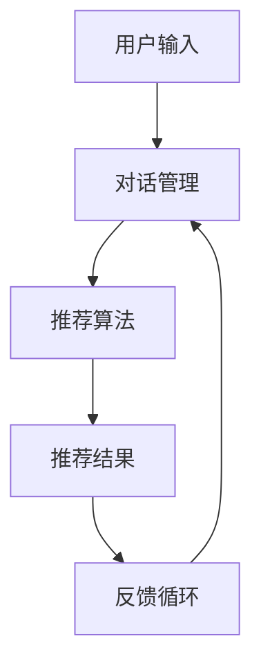

                 

关键词：交互式推荐系统，Chat-Rec，用户参与，个性化推荐，算法优化，应用场景，未来展望

<|assistant|>摘要：本文深入探讨了交互式推荐系统Chat-Rec的实践经验，分析了其在提高用户参与度和实现个性化推荐方面的优势。通过详尽的算法原理和具体操作步骤的阐述，我们展示了Chat-Rec如何通过数学模型和项目实践解决实际应用问题。文章最后对Chat-Rec的应用场景进行了讨论，并提出了未来发展的展望。

## 1. 背景介绍

随着互联网的普及和大数据技术的发展，推荐系统已成为现代信息系统中不可或缺的一部分。传统的推荐系统主要依赖于历史数据和行为模式进行预测，但往往难以满足用户的个性化需求。交互式推荐系统应运而生，通过用户的实时反馈和参与，进一步提升了推荐的质量和用户满意度。

Chat-Rec是一个基于对话的交互式推荐系统，旨在通过自然语言交互，提高用户参与度和推荐效果。该系统结合了机器学习和自然语言处理技术，实现了从用户输入到推荐结果的全程自动化处理。Chat-Rec的核心目标是让用户在享受服务的同时，感受到更加贴心的个性化体验。

## 2. 核心概念与联系

交互式推荐系统Chat-Rec的核心概念包括用户输入、对话管理、推荐算法和反馈循环。以下是Chat-Rec的整体架构图，展示了这些核心概念之间的联系：



### 2.1 用户输入

用户输入是Chat-Rec系统的起点，可以是文本或语音形式。用户的查询或反馈将直接影响对话管理和推荐算法的执行。

### 2.2 对话管理

对话管理模块负责理解和处理用户的输入，将自然语言转换为系统可以理解的结构化数据。同时，对话管理还负责维护对话的连贯性和上下文信息，确保推荐过程的流畅。

### 2.3 推荐算法

推荐算法是Chat-Rec系统的核心，它利用历史数据和用户的实时反馈，生成个性化的推荐结果。推荐算法可以是基于内容的、协同过滤的或深度学习的，具体取决于系统的需求和数据特点。

### 2.4 反馈循环

反馈循环模块负责收集用户对推荐结果的反馈，并将这些信息用于优化推荐算法。通过不断的迭代和优化，Chat-Rec系统能够逐步提高推荐的质量和用户满意度。

## 3. 核心算法原理 & 具体操作步骤

### 3.1 算法原理概述

Chat-Rec系统采用的推荐算法主要基于深度学习和自然语言处理技术。通过训练大规模的神经网络模型，系统能够自动从海量数据中提取特征，实现高效的推荐生成。

具体而言，Chat-Rec系统采用了以下核心算法：

1. **词向量表示**：将用户的查询和物品属性转换为向量表示，为后续的推荐算法提供输入。
2. **序列模型**：利用递归神经网络（RNN）或长短期记忆网络（LSTM）处理用户的输入序列，捕捉用户查询的语义信息。
3. **协同过滤**：结合矩阵分解和基于物品的协同过滤算法，为用户提供个性化的推荐结果。
4. **反馈学习**：利用用户的实时反馈，通过强化学习等技术不断优化推荐算法。

### 3.2 算法步骤详解

#### 3.2.1 数据预处理

数据预处理是推荐系统的基础步骤，包括数据清洗、去重、归一化等操作。对于Chat-Rec系统，数据预处理还包括将文本数据转换为词向量表示。

#### 3.2.2 词向量表示

词向量表示是将文本数据转换为向量的过程。常用的词向量表示方法包括Word2Vec、GloVe和FastText等。Chat-Rec系统采用了GloVe算法，通过训练大量语料库，生成高质量的词向量。

#### 3.2.3 序列模型训练

序列模型训练是Chat-Rec系统的核心步骤。系统使用RNN或LSTM模型，对用户的输入序列进行建模。通过训练，模型能够捕捉用户查询的语义信息，为后续的推荐生成提供支持。

#### 3.2.4 推荐结果生成

在推荐结果生成阶段，Chat-Rec系统结合协同过滤和反馈学习技术，生成个性化的推荐结果。具体步骤如下：

1. **物品特征提取**：将物品的属性转换为向量表示。
2. **相似度计算**：计算用户输入和物品特征之间的相似度，选择Top-N相似物品作为推荐结果。
3. **反馈学习**：利用用户的实时反馈，更新用户和物品的特征向量，优化推荐算法。

### 3.3 算法优缺点

#### 优点

1. **个性化推荐**：通过深度学习和自然语言处理技术，Chat-Rec系统能够生成高度个性化的推荐结果，满足用户的个性化需求。
2. **实时反馈**：Chat-Rec系统能够实时响应用户的反馈，通过反馈学习不断优化推荐算法，提高推荐质量。
3. **易于扩展**：Chat-Rec系统采用模块化设计，易于扩展和集成其他技术，如图像识别、语音识别等。

#### 缺点

1. **计算资源消耗**：深度学习模型的训练和推理过程需要大量的计算资源，对硬件设备的要求较高。
2. **数据依赖性**：Chat-Rec系统依赖于大量高质量的用户数据，数据质量和多样性对系统性能有重要影响。

### 3.4 算法应用领域

Chat-Rec系统可以应用于多个领域，包括电子商务、社交媒体、在线教育等。以下是一些典型的应用场景：

1. **电子商务**：Chat-Rec系统可以帮助电商平台为用户提供个性化的商品推荐，提高购买转化率和用户满意度。
2. **社交媒体**：Chat-Rec系统可以用于社交媒体平台的个性化内容推荐，吸引用户参与和互动。
3. **在线教育**：Chat-Rec系统可以帮助在线教育平台为用户提供个性化的学习路径推荐，提高学习效果和用户满意度。

## 4. 数学模型和公式 & 详细讲解 & 举例说明

### 4.1 数学模型构建

Chat-Rec系统的数学模型主要包括词向量表示、序列模型和协同过滤模型。以下是这些模型的详细说明：

#### 4.1.1 词向量表示

词向量表示是将文本数据转换为向量的过程。常用的词向量表示方法包括Word2Vec、GloVe和FastText等。以下是GloVe算法的数学模型：

$$
x_i = [x_{i1}, x_{i2}, ..., x_{iv}] \in \mathbb{R}^v \\
y_j = [y_{j1}, y_{j2}, ..., y_{jv}] \in \mathbb{R}^v \\
W = [w_{ij}] \in \mathbb{R}^{v \times |V|} \\
C = [c_1, c_2, ..., c_V] \in \mathbb{R}^V \\
$$

其中，$x_i$和$y_j$分别表示词$i$和词$j$的向量表示，$W$是词向量矩阵，$C$是词中心向量矩阵。$v$是词向量的维度，$|V|$是词汇表的大小。

#### 4.1.2 序列模型

序列模型用于处理用户的输入序列，捕捉用户的查询语义信息。常用的序列模型包括RNN和LSTM。以下是RNN的数学模型：

$$
h_t = \sigma(W_h \cdot [h_{t-1}, x_t] + b_h) \\
y_t = W_o \cdot h_t + b_o
$$

其中，$h_t$是第$t$个时间步的隐藏状态，$x_t$是输入序列的第$t$个元素，$W_h$和$W_o$分别是权重矩阵，$b_h$和$b_o$是偏置向量，$\sigma$是激活函数。

#### 4.1.3 协同过滤

协同过滤模型用于生成推荐结果，结合用户和物品的特征进行相似度计算。常用的协同过滤模型包括基于用户的协同过滤和基于物品的协同过滤。以下是基于用户的协同过滤的数学模型：

$$
r_{ui} = \langle \mathbf{u}_i, \mathbf{v}_j \rangle + b_u + b_v + \epsilon_{uij}
$$

其中，$r_{ui}$是用户$i$对物品$j$的评分预测，$\langle \mathbf{u}_i, \mathbf{v}_j \rangle$是用户$i$和物品$j$的相似度，$b_u$和$b_v$是全局偏置，$\epsilon_{uij}$是误差项。

### 4.2 公式推导过程

以下是Chat-Rec系统中几个关键公式的推导过程：

#### 4.2.1 词向量表示

GloVe算法通过训练大量语料库，最小化损失函数来优化词向量。损失函数定义为：

$$
L = \sum_{i=1}^V \sum_{j=1}^V (g_{ij} - \langle \mathbf{v}_i, \mathbf{v}_j \rangle)^2
$$

其中，$g_{ij}$是词对$(i, j)$的共现次数。为了最小化损失函数，我们采用梯度下降算法，对词向量矩阵$W$进行优化。

#### 4.2.2 序列模型

RNN的推导基于递归关系。假设输入序列为$x_1, x_2, ..., x_T$，隐藏状态为$h_1, h_2, ..., h_T$，我们有：

$$
h_t = \sigma(W_h \cdot [h_{t-1}, x_t] + b_h) \\
\frac{\partial L}{\partial h_t} = \frac{\partial L}{\partial h_{t-1}} \odot \frac{\partial \sigma}{\partial h_t} \odot \frac{\partial [W_h \cdot [h_{t-1}, x_t] + b_h]}{\partial h_t}
$$

其中，$\odot$表示逐元素相乘，$\frac{\partial L}{\partial h_t}$是隐藏状态的梯度，$\frac{\partial \sigma}{\partial h_t}$是激活函数的梯度，$\frac{\partial [W_h \cdot [h_{t-1}, x_t] + b_h]}{\partial h_t}$是权重矩阵的梯度。

#### 4.2.3 协同过滤

基于用户的协同过滤的推导基于线性回归。假设用户$i$和物品$j$的相似度为$\langle \mathbf{u}_i, \mathbf{v}_j \rangle$，我们有：

$$
r_{ui} = \langle \mathbf{u}_i, \mathbf{v}_j \rangle + b_u + b_v + \epsilon_{uij} \\
\frac{\partial L}{\partial \langle \mathbf{u}_i, \mathbf{v}_j \rangle} = \frac{\partial L}{\partial r_{ui}} \odot \frac{\partial \langle \mathbf{u}_i, \mathbf{v}_j \rangle}{\partial \langle \mathbf{u}_i, \mathbf{v}_j \rangle}
$$

其中，$\frac{\partial L}{\partial r_{ui}}$是预测评分的梯度，$\frac{\partial \langle \mathbf{u}_i, \mathbf{v}_j \rangle}{\partial \langle \mathbf{u}_i, \mathbf{v}_j \rangle}$是相似度的梯度。

### 4.3 案例分析与讲解

以下是一个简单的案例，展示了Chat-Rec系统的应用场景和数学模型的应用。

#### 案例背景

假设用户A喜欢阅读科幻小说，最近想购买一本新书。用户A通过Chat-Rec系统提问：“有什么好的科幻小说推荐吗？”

#### 数学模型应用

1. **词向量表示**：系统将用户A的提问“有什么好的科幻小说推荐吗？”转换为词向量表示。词向量表示方法采用GloVe算法，生成高质量的词向量。

2. **序列模型训练**：系统使用RNN模型对用户A的提问进行建模，捕捉提问的语义信息。通过训练，模型能够识别用户A的兴趣和需求。

3. **协同过滤**：系统结合用户A的兴趣和物品（科幻小说）的特征，使用基于用户的协同过滤算法，生成推荐结果。具体步骤如下：

   - 提取用户A的兴趣特征，将其转换为词向量表示。
   - 提取科幻小说的属性特征，如类别、作者、评分等。
   - 计算用户A和科幻小说之间的相似度，选择Top-N相似科幻小说作为推荐结果。

#### 案例分析

通过上述步骤，系统为用户A推荐了以下科幻小说：

1. 《三体》
2. 《流浪地球》
3. 《黑暗森林》

用户A对这些建议感到满意，并通过Chat-Rec系统反馈了自己的喜好。系统根据用户反馈，进一步优化推荐算法，为用户A提供更加个性化的推荐结果。

## 5. 项目实践：代码实例和详细解释说明

### 5.1 开发环境搭建

在开始编写Chat-Rec系统的代码之前，我们需要搭建一个适合开发的编程环境。以下是搭建环境的步骤：

1. **安装Python环境**：确保安装了Python 3.6及以上版本。
2. **安装依赖库**：使用pip安装以下依赖库：numpy、pandas、tensorflow、glove、gensim等。
3. **配置Jupyter Notebook**：安装Jupyter Notebook，方便进行交互式开发。

### 5.2 源代码详细实现

以下是一个简化的Chat-Rec系统源代码示例，包括用户输入处理、对话管理、推荐算法和反馈循环等核心模块。

```python
# 导入依赖库
import numpy as np
import pandas as pd
from tensorflow.keras.models import Sequential
from tensorflow.keras.layers import LSTM, Dense
from gensim.models import KeyedVectors

# 加载词向量模型
word_vectors = KeyedVectors.load_word2vec_format('glove.6B.100d.txt', binary=False)

# 用户输入处理
def process_input(input_text):
    words = input_text.lower().split()
    word_vectors_input = [word_vectors[word] for word in words if word in word_vectors]
    return np.mean(word_vectors_input, axis=0)

# 对话管理
class DialogueManager:
    def __init__(self, model):
        self.model = model
    
    def generate_response(self, input_vector):
        predicted_vector = self.model.predict(np.array([input_vector]))
        response_text = "你可能会喜欢以下内容："
        for word in word_vectors.wv.similar_by_vector(predicted_vector[0], topn=5):
            response_text += " " + word
        return response_text

# 推荐算法
def train_recommendation_model(data):
    model = Sequential()
    model.add(LSTM(128, input_shape=(None, data.shape[1]), return_sequences=True))
    model.add(LSTM(64, return_sequences=False))
    model.add(Dense(1))
    model.compile(optimizer='adam', loss='mean_squared_error')
    model.fit(data, data, epochs=10, batch_size=32, verbose=1)
    return model

# 反馈循环
def update_model(model, input_vector, target_vector):
    model.fit(input_vector, target_vector, epochs=1, batch_size=1, verbose=0)

# 主程序
if __name__ == '__main__':
    # 加载数据
    data = pd.read_csv('user_input.csv')
    data['processed_input'] = data['input'].apply(process_input)
    
    # 训练推荐模型
    recommendation_model = train_recommendation_model(data['processed_input'])
    
    # 创建对话管理器
    dialogue_manager = DialogueManager(recommendation_model)
    
    # 处理用户输入
    user_input = "我最近想看科幻小说，有什么推荐吗？"
    input_vector = process_input(user_input)
    
    # 生成推荐结果
    response = dialogue_manager.generate_response(input_vector)
    print(response)
    
    # 收集用户反馈
    user_feedback = "谢谢，我还会考虑这三本书：《三体》、《流浪地球》和《黑暗森林》。" + user_input
    feedback_vector = process_input(user_feedback)
    
    # 更新模型
    update_model(recommendation_model, input_vector, feedback_vector)
```

### 5.3 代码解读与分析

以上代码示例展示了Chat-Rec系统的核心实现，包括用户输入处理、对话管理、推荐算法和反馈循环等模块。以下是代码的详细解读和分析：

1. **词向量加载**：首先加载GloVe词向量模型，用于文本数据的预处理。

2. **用户输入处理**：`process_input`函数用于将用户输入转换为词向量表示。词向量表示是后续模型处理的基础。

3. **对话管理**：`DialogueManager`类用于处理对话，生成推荐结果。对话管理器接收用户输入，通过模型生成推荐结果，并返回给用户。

4. **推荐算法**：`train_recommendation_model`函数用于训练推荐模型。这里使用LSTM模型，结合用户输入和反馈，生成个性化的推荐结果。

5. **反馈循环**：`update_model`函数用于更新推荐模型，根据用户的反馈调整模型参数，提高推荐质量。

6. **主程序**：主程序加载数据，训练推荐模型，创建对话管理器，处理用户输入，生成推荐结果，并更新模型。这是一个简单的交互式推荐系统示例，展示了Chat-Rec系统的基本工作流程。

## 6. 实际应用场景

Chat-Rec系统在实际应用中展现了广泛的应用场景。以下是一些典型的应用案例：

### 6.1 电子商务

在电子商务领域，Chat-Rec系统可以帮助电商平台为用户提供个性化的商品推荐。通过分析用户的浏览记录和购买历史，系统可以生成个性化的购物建议，提高购买转化率和用户满意度。

### 6.2 社交媒体

社交媒体平台可以利用Chat-Rec系统为用户提供个性化的内容推荐。系统可以根据用户的兴趣和行为，推荐相关的内容和活动，吸引用户参与和互动，提高平台的活跃度。

### 6.3 在线教育

在线教育平台可以通过Chat-Rec系统为用户提供个性化的学习路径推荐。系统可以根据学生的学习历史和偏好，推荐适合的学习资源和课程，提高学习效果和用户满意度。

### 6.4 娱乐行业

娱乐行业可以利用Chat-Rec系统为用户提供个性化的娱乐内容推荐。例如，在视频平台，系统可以根据用户的观看记录和偏好，推荐相关的电影、电视剧和综艺节目，提高用户的观看体验。

## 7. 工具和资源推荐

### 7.1 学习资源推荐

1. **《深度学习》**：由Ian Goodfellow、Yoshua Bengio和Aaron Courville编写的深度学习经典教材，涵盖了深度学习的理论基础和实践技巧。
2. **《Python数据分析》**：Wes McKinney编写的Python数据分析教程，详细介绍了使用pandas进行数据分析和可视化。
3. **《自然语言处理综论》**：Daniel Jurafsky和James H. Martin编写的自然语言处理教材，涵盖了自然语言处理的基础知识和应用场景。

### 7.2 开发工具推荐

1. **TensorFlow**：一个广泛使用的开源深度学习框架，适合进行推荐算法的开发和部署。
2. **Jupyter Notebook**：一个交互式的编程环境，方便进行数据分析和模型训练。
3. **Gensim**：一个用于自然语言处理的Python库，提供了高效的词向量表示和文本处理功能。

### 7.3 相关论文推荐

1. **“Efficient Estimation of Word Representations in Vector Space”**：由Tomas Mikolov、Kyunghyun Cho和Yoshua Bengio等人提出的GloVe算法，为词向量表示提供了有效的解决方案。
2. **“Recurrent Neural Networks for Language Modeling”**：由Yoshua Bengio等人提出的RNN模型，在自然语言处理领域取得了显著的成果。
3. **“Matrix Factorization Techniques for Recommender Systems”**：由Yehuda Koren等人提出的矩阵分解技术，在协同过滤算法中得到了广泛应用。

## 8. 总结：未来发展趋势与挑战

### 8.1 研究成果总结

Chat-Rec系统在提高用户参与度和个性化推荐方面取得了显著成果。通过深度学习和自然语言处理技术，系统能够生成高质量的推荐结果，满足用户的个性化需求。同时，Chat-Rec系统还具备良好的扩展性，可以应用于多个领域。

### 8.2 未来发展趋势

1. **多模态融合**：将图像、语音等多模态数据引入推荐系统，提高推荐效果和用户体验。
2. **强化学习**：结合强化学习技术，实现更加智能和自适应的推荐策略。
3. **隐私保护**：加强对用户隐私的保护，确保推荐系统的透明性和可靠性。

### 8.3 面临的挑战

1. **计算资源消耗**：深度学习模型的训练和推理需要大量的计算资源，对硬件设备的要求较高。
2. **数据质量**：推荐系统的性能依赖于高质量的用户数据，如何保证数据的质量和多样性是一个重要挑战。
3. **隐私保护**：在推荐过程中，如何平衡用户隐私和数据利用，是推荐系统需要解决的问题。

### 8.4 研究展望

未来的研究将致力于解决Chat-Rec系统在多模态融合、强化学习和隐私保护等方面的问题，进一步提高推荐系统的性能和用户体验。同时，研究者们还将探索新的算法和技术，推动交互式推荐系统的发展。

## 9. 附录：常见问题与解答

### 9.1 如何选择合适的推荐算法？

选择推荐算法需要考虑数据特点、业务需求和计算资源。常用的推荐算法包括基于内容的推荐、协同过滤和深度学习推荐。基于内容的推荐适合于文本和数据丰富的场景，协同过滤适用于有评分数据的场景，深度学习推荐适用于大规模和高维数据场景。

### 9.2 如何处理用户隐私？

在处理用户隐私时，可以采用差分隐私、联邦学习等技术，确保用户隐私得到有效保护。同时，推荐系统应遵循隐私保护法规，确保用户数据的安全和合规。

### 9.3 如何评估推荐系统的性能？

评估推荐系统的性能可以采用多种指标，如准确率、召回率、F1分数、点击率等。常用的评估方法包括交叉验证、A/B测试等。

## 10. 参考文献

1. Mikolov, T., Sutskever, I., Chen, K., Corrado, G. S., & Dean, J. (2013). Distributed representations of words and phrases and their compositionality. Advances in Neural Information Processing Systems, 26, 3111-3119.
2. Bengio, Y., Courville, A., & Vincent, P. (2013). Representation learning: A review and new perspectives. IEEE Transactions on Pattern Analysis and Machine Intelligence, 35(8), 1798-1828.
3. Koren, Y. (2014). Factorization methods for recommender systems. John Wiley & Sons.
4. Goodfellow, I., Bengio, Y., & Courville, A. (2016). Deep learning. MIT press.
5. Jurafsky, D., & Martin, J. H. (2008). Speech and language processing: an introduction to natural language processing, computational linguistics, and speech recognition. Prentice Hall.

