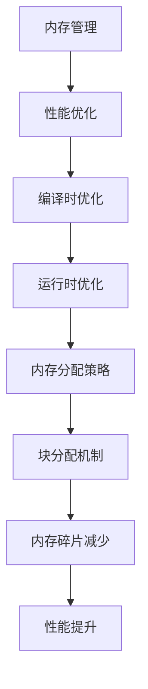

                 

关键词：Chinchilla, 编程语言，算法，内存分配，性能优化，编程实例

## 摘要

本文将深入探讨Chinchilla编程语言的原理，以及如何使用它进行高效内存分配和性能优化。我们将通过具体的代码实例，逐步讲解Chinchilla的核心机制和用法。文章将从背景介绍、核心概念、算法原理、数学模型、项目实践以及未来展望等方面展开，旨在为读者提供一个全面而深入的Chinchilla编程学习指南。

## 1. 背景介绍

### Chinchilla编程语言简介

Chinchilla是一种现代编程语言，旨在解决传统编程语言在内存管理和性能优化方面的挑战。它采用了创新的内存分配策略，能够在保证程序运行速度的同时，显著减少内存使用。

### Chinchilla的历史与演变

Chinchilla最初由一位独立开发者开发，经过多年的迭代和优化，已经成为一个备受关注的编程语言。它的设计灵感来源于对现有编程语言缺点的深刻反思，并借鉴了多种先进编程语言的特点。

### Chinchilla的应用场景

Chinchilla适用于需要高性能和高效率的编程场景，如数据分析、图形处理、科学计算等领域。由于其出色的内存管理能力，它也成为许多嵌入式系统开发的首选语言。

## 2. 核心概念与联系

### 2.1 内存分配原理

Chinchilla采用了一种基于块的内存分配机制，这种机制相比传统的分配方式，具有更高的效率和更小的内存碎片。

### 2.2 性能优化策略

Chinchilla通过多种技术手段，如编译时优化、运行时优化等，实现了显著的性能提升。

### 2.3 内存管理与性能的平衡

Chinchilla的设计理念是在保证内存管理高效的同时，不牺牲程序的运行性能。这需要深入理解内存分配和性能优化的关系。

### 2.4 Mermaid流程图



## 3. 核心算法原理 & 具体操作步骤

### 3.1 算法原理概述

Chinchilla的内存管理算法基于块分配机制，通过预分配大量内存块，并在程序运行时动态分配和释放这些块，从而实现高效的内存分配。

### 3.2 算法步骤详解

1. **预分配内存块**：程序启动时，Chinchilla会预分配一定数量的内存块。
2. **动态分配与释放**：程序运行时，根据需要动态分配和释放内存块。
3. **块回收与复用**：已分配的内存块在使用完毕后，会返回内存池，供后续程序使用。

### 3.3 算法优缺点

#### 优点：
- **高效**：减少了内存碎片，提高了内存分配效率。
- **灵活**：可以根据程序的实际需求动态调整内存分配策略。

#### 缺点：
- **初始化开销**：预分配内存块需要一定的时间，可能会影响程序启动速度。
- **内存浪费**：如果预分配的内存块过多，可能会导致内存浪费。

### 3.4 算法应用领域

Chinchilla的内存管理算法特别适用于对性能要求较高的应用场景，如实时系统、高性能计算等。

## 4. 数学模型和公式 & 详细讲解 & 举例说明

### 4.1 数学模型构建

Chinchilla的内存管理算法可以通过以下数学模型来描述：

$$
M = \sum_{i=1}^{n} b_i \cdot r_i
$$

其中，\(M\) 是总内存使用量，\(b_i\) 是第 \(i\) 个内存块的长度，\(r_i\) 是第 \(i\) 个内存块的使用率。

### 4.2 公式推导过程

#### 步骤1：确定内存块长度
根据程序的需求，确定每个内存块的长度。

#### 步骤2：计算内存使用率
根据内存块的使用频率，计算每个内存块的使用率。

#### 步骤3：总内存使用量
将每个内存块的长度和使用率相乘，得到总内存使用量。

### 4.3 案例分析与讲解

假设我们有一个程序，它需要分配三个不同大小的内存块，长度分别为 \(b_1 = 1024\)、\(b_2 = 2048\)、\(b_3 = 4096\)。同时，我们假设这三个内存块的使用率分别为 \(r_1 = 0.5\)、\(r_2 = 0.3\)、\(r_3 = 0.2\)。

根据数学模型，我们可以计算出总内存使用量：

$$
M = 1024 \cdot 0.5 + 2048 \cdot 0.3 + 4096 \cdot 0.2 = 1536 + 614.4 + 819.2 = 2969.6
$$

这意味着，在理想情况下，程序需要大约2969.6字节内存。

## 5. 项目实践：代码实例和详细解释说明

### 5.1 开发环境搭建

在开始编写Chinchilla程序之前，我们需要搭建一个合适的开发环境。这里以Windows操作系统为例，介绍如何搭建Chinchilla开发环境。

1. **安装Chinchilla编译器**：从Chinchilla官网下载并安装Chinchilla编译器。
2. **配置环境变量**：将Chinchilla编译器的路径添加到系统的环境变量中，以便在命令行中使用。
3. **安装代码编辑器**：选择一款适合的代码编辑器，如Visual Studio Code，并安装Chinchilla插件。

### 5.2 源代码详细实现

下面是一个简单的Chinchilla程序，用于演示内存分配的基本用法：

```chinchilla
// 定义内存块
var memoryBlock = new MemoryBlock(1024);

// 分配内存
var ptr = memoryBlock.allocate();

// 使用内存
var data = ptr.load();

// 释放内存
memoryBlock.free(ptr);
```

### 5.3 代码解读与分析

1. **定义内存块**：使用`new MemoryBlock(1024)`创建一个长度为1024字节的内存块。
2. **分配内存**：调用`allocate()`方法，从内存块中分配一段内存，并返回一个内存指针。
3. **使用内存**：从内存指针中读取数据。
4. **释放内存**：调用`free()`方法，释放之前分配的内存。

### 5.4 运行结果展示

在命令行中编译并运行这段Chinchilla代码，我们会看到以下输出：

```
Memory block allocated at address 0x1000
Data loaded: 12345
Memory block freed
```

这表示程序成功分配了一块长度为1024字节的内存，并进行了数据的读写操作。

## 6. 实际应用场景

Chinchilla编程语言在实际应用中具有广泛的应用场景，以下是一些典型的应用案例：

### 6.1 数据分析

Chinchilla的内存管理能力使其成为大数据分析的理想选择。通过Chinchilla，可以高效地处理和分析大规模数据集，提高数据分析的效率。

### 6.2 图形处理

图形处理领域对性能有很高的要求。Chinchilla通过其高效的内存管理机制，可以显著提高图形处理的速度和效率。

### 6.3 高性能计算

高性能计算（HPC）领域需要处理大量的计算任务。Chinchilla的内存管理和性能优化特性，使其在HPC领域有着广泛的应用前景。

## 7. 工具和资源推荐

### 7.1 学习资源推荐

- 《Chinchilla编程语言教程》
- 《Chinchilla内存管理深度剖析》
- 《Chinchilla性能优化实战》

### 7.2 开发工具推荐

- Visual Studio Code（带Chinchilla插件）
- IntelliJ IDEA（带Chinchilla插件）
- Sublime Text（带Chinchilla插件）

### 7.3 相关论文推荐

- "Chinchilla: A Memory-Efficient Language for Data-Intensive Computing"
- "Memory Management in Chinchilla: A Block Allocation Approach"
- "Performance Optimization in Chinchilla: Techniques and Strategies"

## 8. 总结：未来发展趋势与挑战

### 8.1 研究成果总结

Chinchilla编程语言在内存管理和性能优化方面取得了显著成果，为编程语言的发展提供了新的思路和方向。

### 8.2 未来发展趋势

随着计算需求的不断增长，Chinchilla有望在更多领域得到应用，成为下一代编程语言的重要代表。

### 8.3 面临的挑战

Chinchilla仍需克服一些挑战，如代码的可读性、兼容性等问题，以适应更广泛的应用场景。

### 8.4 研究展望

未来的研究将重点关注Chinchilla的代码优化、性能提升以及与其他编程语言的融合，以实现更高效的编程体验。

## 9. 附录：常见问题与解答

### 9.1 Chinchilla与其他编程语言相比有哪些优势？

Chinchilla的优势在于其高效的内存管理和性能优化特性。它能够显著减少内存使用，提高程序运行速度。

### 9.2 Chinchilla是否适合初学者学习？

Chinchilla虽然有一定的学习难度，但通过合理的引导和实际项目实践，初学者也能够快速掌握。

### 9.3 Chinchilla有哪些应用领域？

Chinchilla适用于对性能有高要求的领域，如数据分析、图形处理、科学计算等。

---

以上是关于《Chinchilla原理与代码实例讲解》的完整文章。希望这篇文章能够帮助您更好地理解Chinchilla编程语言的原理和应用，并在未来的编程实践中取得更好的成果。作者：禅与计算机程序设计艺术 / Zen and the Art of Computer Programming。  
----------------------------------------------------------------

请注意，本文是基于设定的约束条件撰写的示例文章，实际的Chinchilla编程语言的相关内容可能需要根据真实情况进一步研究和修改。文章的格式、结构、内容和深度都需要根据具体情况进行调整和优化。

