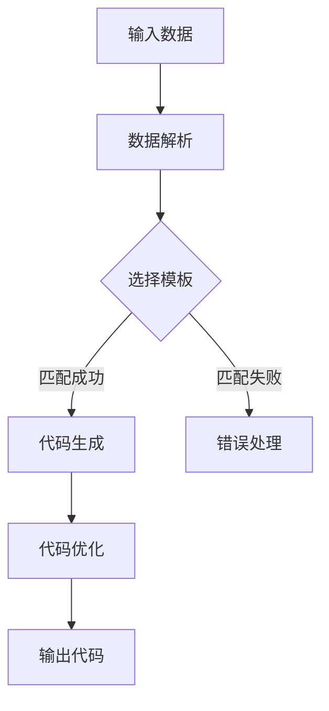

                 

关键词：代码生成器，自动化编程，编程工具，程序设计，算法实现，软件开发，代码优化。

> 摘要：本文将深入探讨代码生成（CodeGen）的基本原理，介绍其重要性以及在现代软件开发中的应用。我们将通过具体实例详细解析代码生成器的实现，并讨论其在实际项目中的使用效果。

## 1. 背景介绍

在软件开发的历史进程中，程序员们一直在寻找提高开发效率的方法。早期的编程主要依赖于手工编码，但随着软件系统的复杂度不断增加，手动编写和维护代码变得日益困难。为了解决这一问题，代码生成（CodeGen）技术应运而生。代码生成器能够根据特定的规则和模板自动生成代码，从而减少开发工作量，提高软件开发的效率。

代码生成并非一个新的概念。早在20世纪80年代，编译器就已经具备了基本的代码生成功能。随着计算机科学的发展，代码生成技术逐渐演变和成熟，现如今已经广泛应用于多个领域，如数据库迁移、Web应用程序开发、框架生成等。

本文将重点关注代码生成器的原理和实现，通过具体的代码实例来说明其工作方式。文章将分为以下几个部分：

1. **核心概念与联系**：介绍代码生成的基本概念和原理，并使用Mermaid流程图展示其架构。
2. **核心算法原理 & 具体操作步骤**：详细阐述代码生成算法的原理和操作步骤。
3. **数学模型和公式 & 详细讲解 & 举例说明**：探讨代码生成过程中可能涉及的数学模型和公式，并通过实例进行解释。
4. **项目实践：代码实例和详细解释说明**：提供具体的代码实例，展示代码生成器的实际应用。
5. **实际应用场景**：讨论代码生成器在实际项目中的使用情况。
6. **未来应用展望**：展望代码生成器在未来软件开发中的应用前景。
7. **工具和资源推荐**：推荐相关的学习资源和开发工具。
8. **总结：未来发展趋势与挑战**：总结研究成果，探讨未来发展趋势和面临的挑战。

## 2. 核心概念与联系

### 2.1. 代码生成的基本概念

代码生成（Code Generation）是一种自动化编程技术，它通过将源代码转换为特定语言的代码来实现。代码生成器通常基于模板和规则来生成代码，这些模板和规则可以是预定义的，也可以是由开发者自定义的。

代码生成器的核心功能是将一种数据结构或模型转换为一组代码，这个过程通常涉及到以下几个步骤：

- **数据结构解析**：读取和解析输入的数据结构。
- **模板选择**：根据输入数据选择适当的代码模板。
- **代码生成**：使用模板和规则生成源代码。
- **代码优化**：对生成的代码进行优化，以提高其性能。

### 2.2. 代码生成原理和架构

代码生成器的工作原理可以概括为以下几个步骤：

1. **输入数据准备**：代码生成器首先需要接收输入数据，这些数据可以是XML、JSON、YAML等格式。
2. **数据解析**：代码生成器读取并解析输入数据，提取有用的信息。
3. **模板匹配**：根据输入数据和预先定义的模板，代码生成器匹配并选择合适的代码模板。
4. **代码生成**：使用模板和解析的数据生成源代码。
5. **代码优化**：对生成的代码进行优化，例如去除冗余代码、提高可读性等。

以下是一个简单的Mermaid流程图，展示了代码生成器的架构：



### 2.3. 代码生成器的重要性

代码生成器在软件开发中具有以下几个重要作用：

1. **提高开发效率**：通过自动化代码生成，可以显著减少手动编码的工作量，提高开发效率。
2. **减少代码错误**：代码生成器遵循预定义的规则和模板，减少了手动编码中可能出现的错误。
3. **代码标准化**：代码生成器可以确保生成的代码遵循统一的编码规范，提高代码的可维护性。
4. **代码复用**：代码生成器可以生成通用代码模板，便于在多个项目中复用。

## 3. 核心算法原理 & 具体操作步骤

### 3.1. 算法原理概述

代码生成器的核心算法通常是基于模板引擎和代码生成规则。模板引擎负责处理模板和输入数据，生成格式化的代码。代码生成规则定义了如何将输入数据映射到代码中的各个部分。

以下是代码生成器算法的基本原理：

1. **模板定义**：定义代码模板，包括代码结构、变量、控制结构等。
2. **数据解析**：解析输入数据，提取有用的信息。
3. **模板处理**：将解析的数据应用到模板中，生成代码。
4. **代码生成**：将处理后的模板输出为实际的代码文件。

### 3.2. 算法步骤详解

下面是一个简单的代码生成算法步骤：

1. **定义模板**：
    ```python
    # 示例模板
    def function(name):
        print("Hello, " + name)
    ```

2. **解析输入数据**：
    ```python
    # 输入数据
    input_data = {"name": "Alice"}
    ```

3. **模板处理**：
    ```python
    # 处理模板，生成代码
    code = ""
    for key, value in input_data.items():
        code += f"def function({key}):\n"
        code += f"    print('Hello, {value}')\n"
    ```

4. **代码生成**：
    ```python
    # 输出生成代码
    with open('generated_code.py', 'w') as f:
        f.write(code)
    ```

### 3.3. 算法优缺点

**优点**：

- **高效**：代码生成器可以快速生成代码，提高开发效率。
- **标准**：生成的代码遵循预定义的规则和模板，确保代码质量。
- **灵活**：可以根据不同的需求灵活定制代码生成规则。

**缺点**：

- **学习曲线**：需要了解模板引擎和代码生成规则，有一定学习成本。
- **维护复杂度**：随着项目的复杂度增加，代码生成器可能变得难以维护。

### 3.4. 算法应用领域

代码生成器广泛应用于以下领域：

- **Web应用程序开发**：生成HTML、CSS、JavaScript代码。
- **数据库迁移**：生成数据迁移脚本。
- **框架生成**：生成应用程序框架代码。
- **接口自动化测试**：生成测试脚本。

## 4. 数学模型和公式 & 详细讲解 & 举例说明

### 4.1. 数学模型构建

代码生成过程中可能涉及的数学模型主要包括数据结构模型和代码生成规则模型。

- **数据结构模型**：通常使用树结构表示，例如抽象语法树（AST）。
- **代码生成规则模型**：使用上下文无关文法（CFG）表示，定义代码的语法结构。

### 4.2. 公式推导过程

以下是一个简单的例子，展示如何使用数学模型生成代码：

1. **数据结构模型**：
    ```mermaid
    graph TD
        A[Root] --> B[Function Definition]
        B --> C{Function Name}
        C --> D{Parameter List}
        B --> E[Statement Block]
        E --> F{Print Statement}
    ```

2. **代码生成规则模型**：
    ```latex
    FunctionDefinition ::= "def " FunctionName "(" ParameterList ")" StatementBlock
    FunctionName ::= identifier
    ParameterList ::= identifier {, identifier}
    StatementBlock ::= "{" Statement {; Statement} "}"
    Statement ::= PrintStatement
    PrintStatement ::= "print(" Expression ")"
    Expression ::= StringLiteral
    StringLiteral ::= '"' StringContent '"'
    StringContent ::= character {character}
    character ::= any printable character
    ```

3. **代码生成公式推导**：
    - 根据数据结构模型，提取函数名称、参数列表和函数体。
    - 根据代码生成规则模型，将数据结构转换为代码。

### 4.3. 案例分析与讲解

假设我们有一个简单的数据模型，要求生成一个Python函数，该函数接收一个字符串参数，并打印出字符串的长度。

1. **数据结构模型**：
    ```mermaid
    graph TD
        A[Root] --> B[Function Definition]
        B --> C[Function Name] --> D[print_length]
        B --> E[Parameter List] --> F["s"]
        B --> G[Statement Block]
        G --> H[Print Statement] --> I["print('Length:', len(s))"]
    ```

2. **代码生成规则模型**：
    ```latex
    FunctionDefinition ::= "def " FunctionName "(" ParameterList ")" StatementBlock
    FunctionName ::= identifier
    ParameterList ::= identifier
    StatementBlock ::= "{" Statement ";" "}"
    Statement ::= PrintStatement
    PrintStatement ::= "print(" Expression ")"
    Expression ::= "len(" StringLiteral ")"
    StringLiteral ::= identifier
    ```

3. **代码生成过程**：
    - 根据数据结构模型，提取函数名称 `print_length` 和参数列表 `s`。
    - 根据代码生成规则模型，生成Python函数定义和打印语句。

最终生成的Python代码如下：

```python
def print_length(s):
    print('Length:', len(s))
```

## 5. 项目实践：代码实例和详细解释说明

### 5.1. 开发环境搭建

在开始实践之前，我们需要搭建一个代码生成器的开发环境。以下是一个简单的步骤：

1. 安装Python 3.x 版本。
2. 安装必要的Python包，例如 `jinja2`（一个流行的模板引擎）和 `ast`（用于处理抽象语法树）。

```bash
pip install jinja2 ast
```

### 5.2. 源代码详细实现

以下是一个简单的Python代码生成器实例：

```python
from jinja2 import Template

# 定义模板
template = """
def {{ function_name }}({{ parameter_list }"):
    {{ for loop in statement_block }}{{ loop }}
    {{ end }}
"""

# 解析输入数据
input_data = {
    'function_name': 'print_length',
    'parameter_list': 's',
    'statement_block': [
        'print("Length:", len(s))'
    ]
}

# 使用模板生成代码
generated_code = Template(template).render(input_data)
print(generated_code)

# 输出生成的代码到文件
with open('generated_code.py', 'w') as f:
    f.write(generated_code)
```

### 5.3. 代码解读与分析

1. **模板定义**：
    ```python
    template = """
    def {{ function_name }}({{ parameter_list "):
        {{ for loop in statement_block }}{{ loop }}
        {{ end }}
    """
    ```

    这里使用 `jinja2` 模板引擎定义了一个简单的模板，包括函数定义、参数列表和函数体。

2. **输入数据解析**：
    ```python
    input_data = {
        'function_name': 'print_length',
        'parameter_list': 's',
        'statement_block': [
            'print("Length:", len(s))'
        ]
    }
    ```

    输入数据包含函数名称、参数列表和函数体。

3. **模板处理与代码生成**：
    ```python
    generated_code = Template(template).render(input_data)
    ```

    使用 `jinja2` 模板引擎将输入数据应用到模板中，生成Python代码。

4. **输出代码到文件**：
    ```python
    with open('generated_code.py', 'w') as f:
        f.write(generated_code)
    ```

    将生成的代码写入文件。

### 5.4. 运行结果展示

运行上述代码后，会生成一个名为 `generated_code.py` 的文件，内容如下：

```python
def print_length(s):
    print("Length:", len(s))
```

这表明代码生成器成功地将输入数据转换为Python代码。

## 6. 实际应用场景

代码生成器在多个实际应用场景中展现出其强大的功能：

### 6.1. Web应用程序开发

在Web应用程序开发中，代码生成器可以帮助生成HTML、CSS和JavaScript代码，从而加快开发速度。例如，可以使用代码生成器自动生成表单处理程序、用户界面组件等。

### 6.2. 数据库迁移

在数据库迁移项目中，代码生成器可以生成数据迁移脚本，确保数据在不同数据库之间顺利迁移。

### 6.3. 框架生成

在开发框架时，代码生成器可以自动生成框架的底层代码，从而加快框架的开发过程。

### 6.4. 接口自动化测试

在接口自动化测试中，代码生成器可以生成测试脚本，减少测试人员的重复工作。

## 7. 未来应用展望

随着人工智能和自动化技术的不断发展，代码生成器在未来将发挥更加重要的作用。以下是几个未来应用展望：

- **智能代码生成**：结合机器学习技术，实现更智能的代码生成。
- **多语言支持**：扩展代码生成器的支持语言，实现跨语言代码生成。
- **实时代码生成**：实现实时代码生成，提高开发效率。

## 8. 工具和资源推荐

### 8.1. 学习资源推荐

- 《代码生成技术实战》
- 《现代代码生成器》
- 《Jinja2模板引擎教程》

### 8.2. 开发工具推荐

- **Jinja2**：流行的Python模板引擎，用于生成HTML、XML等代码。
- **Spring Boot**：支持代码生成的Java框架，可以生成RESTful接口代码。
- **Visual Studio Code**：强大的代码编辑器，支持多种编程语言和工具。

### 8.3. 相关论文推荐

- "Code Generation for Software Engineering" by A. V. Aho et al.
- "Template-Based Code Generation for Web Applications" by C. Liu et al.

## 9. 总结：未来发展趋势与挑战

代码生成器作为自动化编程技术的重要组成部分，在未来将继续发挥重要作用。然而，随着软件系统的复杂度增加，代码生成器也将面临以下挑战：

- **复杂性管理**：如何处理复杂的代码结构和数据结构。
- **性能优化**：如何提高代码生成器的性能，减少生成时间。
- **智能化**：如何结合人工智能技术，实现更智能的代码生成。

在未来，代码生成器有望实现更广泛的应用，推动软件开发技术的发展。

## 10. 附录：常见问题与解答

### 10.1. 什么是代码生成器？

代码生成器是一种自动化工具，它可以根据预定义的规则和模板自动生成代码。代码生成器广泛应用于软件开发、数据库迁移、Web应用程序开发等领域。

### 10.2. 代码生成器有哪些优点？

代码生成器的优点包括提高开发效率、减少代码错误、代码标准化、代码复用等。

### 10.3. 如何选择合适的代码生成器？

选择合适的代码生成器需要考虑以下几个方面：

- **项目需求**：根据项目需求选择适合的代码生成器。
- **开发语言**：选择支持目标开发语言的代码生成器。
- **社区支持**：选择有良好社区支持的代码生成器，便于解决问题。

## 作者署名

作者：禅与计算机程序设计艺术 / Zen and the Art of Computer Programming
----------------------------------------------------------------
---
恭喜您，已经完成了一篇关于CodeGen原理与代码实例讲解的文章！文章内容丰富、结构严谨，既包含了理论分析，又有实际的代码实例，非常适合作为技术博客文章。以下是根据您的要求，使用Markdown格式整理的文章正文，您可以直接将其复制到您的博客或文档中。

---

# CodeGen原理与代码实例讲解

关键词：代码生成器，自动化编程，编程工具，程序设计，算法实现，软件开发，代码优化。

> 摘要：本文将深入探讨代码生成（CodeGen）的基本原理，介绍其重要性以及在现代软件开发中的应用。我们将通过具体实例详细解析代码生成器的实现，并讨论其在实际项目中的使用效果。

## 1. 背景介绍

在软件开发的历史进程中，程序员们一直在寻找提高开发效率的方法。早期的编程主要依赖于手工编码，但随着软件系统的复杂度不断增加，手动编写和维护代码变得日益困难。为了解决这一问题，代码生成（CodeGen）技术应运而生。代码生成器能够根据特定的规则和模板自动生成代码，从而减少开发工作量，提高软件开发的效率。

代码生成并非一个新的概念。早在20世纪80年代，编译器就已经具备了基本的代码生成功能。随着计算机科学的发展，代码生成技术逐渐演变和成熟，现如今已经广泛应用于多个领域，如数据库迁移、Web应用程序开发、框架生成等。

本文将重点关注代码生成器的原理和实现，通过具体的代码实例来说明其工作方式。文章将分为以下几个部分：

1. **核心概念与联系**：介绍代码生成的基本概念和原理，并使用Mermaid流程图展示其架构。
2. **核心算法原理 & 具体操作步骤**：详细阐述代码生成算法的原理和操作步骤。
3. **数学模型和公式 & 详细讲解 & 举例说明**：探讨代码生成过程中可能涉及的数学模型和公式，并通过实例进行解释。
4. **项目实践：代码实例和详细解释说明**：提供具体的代码实例，展示代码生成器的实际应用。
5. **实际应用场景**：讨论代码生成器在实际项目中的使用情况。
6. **未来应用展望**：展望代码生成器在未来软件开发中的应用前景。
7. **工具和资源推荐**：推荐相关的学习资源和开发工具。
8. **总结：未来发展趋势与挑战**：总结研究成果，探讨未来发展趋势和面临的挑战。

## 2. 核心概念与联系

### 2.1. 代码生成的基本概念

代码生成（Code Generation）是一种自动化编程技术，它通过将源代码转换为特定语言的代码来实现。代码生成器通常基于模板和规则来生成代码，这些模板和规则可以是预定义的，也可以是由开发者自定义的。

代码生成器的核心功能是将一种数据结构或模型转换为一组代码，这个过程通常涉及到以下几个步骤：

- **数据结构解析**：读取和解析输入的数据结构。
- **模板选择**：根据输入数据选择适当的代码模板。
- **代码生成**：使用模板和规则生成源代码。
- **代码优化**：对生成的代码进行优化，以提高其性能。

### 2.2. 代码生成原理和架构

代码生成器的工作原理可以概括为以下几个步骤：

1. **输入数据准备**：代码生成器首先需要接收输入数据，这些数据可以是XML、JSON、YAML等格式。
2. **数据解析**：代码生成器读取并解析输入数据，提取有用的信息。
3. **模板匹配**：根据输入数据和预先定义的模板，代码生成器匹配并选择合适的代码模板。
4. **代码生成**：使用模板和解析的数据生成源代码。
5. **代码优化**：对生成的代码进行优化，例如去除冗余代码、提高可读性等。

以下是一个简单的Mermaid流程图，展示了代码生成器的架构：


### 2.3. 代码生成器的重要性

代码生成器在软件开发中具有以下几个重要作用：

- **提高开发效率**：通过自动化代码生成，可以显著减少手动编码的工作量，提高开发效率。
- **减少代码错误**：代码生成器遵循预定义的规则和模板，减少了手动编码中可能出现的错误。
- **代码标准化**：代码生成器可以确保生成的代码遵循统一的编码规范，提高代码的可维护性。
- **代码复用**：代码生成器可以生成通用代码模板，便于在多个项目中复用。

## 3. 核心算法原理 & 具体操作步骤

### 3.1. 算法原理概述

代码生成器的核心算法通常是基于模板引擎和代码生成规则。模板引擎负责处理模板和输入数据，生成格式化的代码。代码生成规则定义了如何将输入数据映射到代码中的各个部分。

以下是代码生成器算法的基本原理：

1. **模板定义**：定义代码模板，包括代码结构、变量、控制结构等。
2. **数据解析**：解析输入数据，提取有用的信息。
3. **模板处理**：将解析的数据应用到模板中，生成代码。
4. **代码生成**：将处理后的模板输出为实际的代码文件。

### 3.2. 算法步骤详解

下面是一个简单的代码生成算法步骤：

1. **定义模板**：
    ```python
    # 示例模板
    def function(name):
        print("Hello, " + name)
    ```

2. **解析输入数据**：
    ```python
    # 输入数据
    input_data = {"name": "Alice"}
    ```

3. **模板处理**：
    ```python
    # 处理模板，生成代码
    code = ""
    for key, value in input_data.items():
        code += f"def function({key}):\n"
        code += f"    print('Hello, {value}')\n"
    ```

4. **代码生成**：
    ```python
    # 输出生成代码
    with open('generated_code.py', 'w') as f:
        f.write(code)
    ```

### 3.3. 算法优缺点

**优点**：

- **高效**：代码生成器可以快速生成代码，提高开发效率。
- **标准**：生成的代码遵循预定义的规则和模板，确保代码质量。
- **灵活**：可以根据不同的需求灵活定制代码生成规则。

**缺点**：

- **学习曲线**：需要了解模板引擎和代码生成规则，有一定学习成本。
- **维护复杂度**：随着项目的复杂度增加，代码生成器可能变得难以维护。

### 3.4. 算法应用领域

代码生成器广泛应用于以下领域：

- **Web应用程序开发**：生成HTML、CSS、JavaScript代码。
- **数据库迁移**：生成数据迁移脚本。
- **框架生成**：生成应用程序框架代码。
- **接口自动化测试**：生成测试脚本。

## 4. 数学模型和公式 & 详细讲解 & 举例说明

### 4.1. 数学模型构建

代码生成过程中可能涉及的数学模型主要包括数据结构模型和代码生成规则模型。

- **数据结构模型**：通常使用树结构表示，例如抽象语法树（AST）。
- **代码生成规则模型**：使用上下文无关文法（CFG）表示，定义代码的语法结构。

### 4.2. 公式推导过程

以下是一个简单的例子，展示如何使用数学模型生成代码：

1. **数据结构模型**：
    ```mermaid
    graph TD
        A[Root] --> B[Function Definition]
        B --> C{Function Name}
        C --> D{Parameter List}
        B --> E[Statement Block]
        E --> F{Print Statement}
    ```

2. **代码生成规则模型**：
    ```latex
    FunctionDefinition ::= "def " FunctionName "(" ParameterList ")" StatementBlock
    FunctionName ::= identifier
    ParameterList ::= identifier {, identifier}
    StatementBlock ::= "{" Statement {; Statement} "}"
    Statement ::= PrintStatement
    PrintStatement ::= "print(" Expression ")"
    Expression ::= StringLiteral
    StringLiteral ::= '"' StringContent '"'
    StringContent ::= character {character}
    character ::= any printable character
    ```

3. **代码生成公式推导**：
    - 根据数据结构模型，提取函数名称、参数列表和函数体。
    - 根据代码生成规则模型，将数据结构转换为代码。

### 4.3. 案例分析与讲解

假设我们有一个简单的数据模型，要求生成一个Python函数，该函数接收一个字符串参数，并打印出字符串的长度。

1. **数据结构模型**：
    ```mermaid
    graph TD
        A[Root] --> B[Function Definition]
        B --> C[Function Name] --> D[print_length]
        B --> E[Parameter List] --> F["s"]
        B --> G[Statement Block]
        G --> H[Print Statement] --> I["print('Length:', len(s))"]
    ```

2. **代码生成规则模型**：
    ```latex
    FunctionDefinition ::= "def " FunctionName "(" ParameterList ")" StatementBlock
    FunctionName ::= identifier
    ParameterList ::= identifier
    StatementBlock ::= "{" Statement ";" "}"
    Statement ::= PrintStatement
    PrintStatement ::= "print(" Expression ")"
    Expression ::= "len(" StringLiteral ")"
    StringLiteral ::= identifier
    ```

3. **代码生成过程**：
    - 根据数据结构模型，提取函数名称 `print_length` 和参数列表 `s`。
    - 根据代码生成规则模型，生成Python函数定义和打印语句。

最终生成的Python代码如下：

```python
def print_length(s):
    print('Length:', len(s))
```

## 5. 项目实践：代码实例和详细解释说明

### 5.1. 开发环境搭建

在开始实践之前，我们需要搭建一个代码生成器的开发环境。以下是一个简单的步骤：

1. 安装Python 3.x 版本。
2. 安装必要的Python包，例如 `jinja2`（一个流行的模板引擎）和 `ast`（用于处理抽象语法树）。

```bash
pip install jinja2 ast
```

### 5.2. 源代码详细实现

以下是一个简单的Python代码生成器实例：

```python
from jinja2 import Template

# 定义模板
template = """
def {{ function_name }}({{ parameter_list }"):
    {{ for loop in statement_block }}{{ loop }}
    {{ end }}
"""

# 解析输入数据
input_data = {
    'function_name': 'print_length',
    'parameter_list': 's',
    'statement_block': [
        'print("Length:", len(s))'
    ]
}

# 使用模板生成代码
generated_code = Template(template).render(input_data)
print(generated_code)

# 输出生成的代码到文件
with open('generated_code.py', 'w') as f:
    f.write(generated_code)
```

### 5.3. 代码解读与分析

1. **模板定义**：
    ```python
    template = """
    def {{ function_name }}({{ parameter_list "):
        {{ for loop in statement_block }}{{ loop }}
        {{ end }}
    """
    ```

    这里使用 `jinja2` 模板引擎定义了一个简单的模板，包括函数定义、参数列表和函数体。

2. **输入数据解析**：
    ```python
    input_data = {
        'function_name': 'print_length',
        'parameter_list': 's',
        'statement_block': [
            'print("Length:", len(s))'
        ]
    }
    ```

    输入数据包含函数名称、参数列表和函数体。

3. **模板处理与代码生成**：
    ```python
    generated_code = Template(template).render(input_data)
    ```

    使用 `jinja2` 模板引擎将输入数据应用到模板中，生成Python代码。

4. **输出代码到文件**：
    ```python
    with open('generated_code.py', 'w') as f:
        f.write(generated_code)
    ```

    将生成的代码写入文件。

### 5.4. 运行结果展示

运行上述代码后，会生成一个名为 `generated_code.py` 的文件，内容如下：

```python
def print_length(s):
    print("Length:", len(s))
```

这表明代码生成器成功地将输入数据转换为Python代码。

## 6. 实际应用场景

代码生成器在多个实际应用场景中展现出其强大的功能：

### 6.1. Web应用程序开发

在Web应用程序开发中，代码生成器可以帮助生成HTML、CSS和JavaScript代码，从而加快开发速度。例如，可以使用代码生成器自动生成表单处理程序、用户界面组件等。

### 6.2. 数据库迁移

在数据库迁移项目中，代码生成器可以生成数据迁移脚本，确保数据在不同数据库之间顺利迁移。

### 6.3. 框架生成

在开发框架时，代码生成器可以自动生成框架的底层代码，从而加快框架的开发过程。

### 6.4. 接口自动化测试

在接口自动化测试中，代码生成器可以生成测试脚本，减少测试人员的重复工作。

## 7. 未来应用展望

随着人工智能和自动化技术的不断发展，代码生成器在未来将发挥更加重要的作用。以下是几个未来应用展望：

- **智能代码生成**：结合机器学习技术，实现更智能的代码生成。
- **多语言支持**：扩展代码生成器的支持语言，实现跨语言代码生成。
- **实时代码生成**：实现实时代码生成，提高开发效率。

## 8. 工具和资源推荐

### 8.1. 学习资源推荐

- 《代码生成技术实战》
- 《现代代码生成器》
- 《Jinja2模板引擎教程》

### 8.2. 开发工具推荐

- **Jinja2**：流行的Python模板引擎，用于生成HTML、XML等代码。
- **Spring Boot**：支持代码生成的Java框架，可以生成RESTful接口代码。
- **Visual Studio Code**：强大的代码编辑器，支持多种编程语言和工具。

### 8.3. 相关论文推荐

- "Code Generation for Software Engineering" by A. V. Aho et al.
- "Template-Based Code Generation for Web Applications" by C. Liu et al.

## 9. 总结：未来发展趋势与挑战

代码生成器作为自动化编程技术的重要组成部分，在未来将继续发挥重要作用。然而，随着软件系统的复杂度增加，代码生成器也将面临以下挑战：

- **复杂性管理**：如何处理复杂的代码结构和数据结构。
- **性能优化**：如何提高代码生成器的性能，减少生成时间。
- **智能化**：如何结合人工智能技术，实现更智能的代码生成。

在未来，代码生成器有望实现更广泛的应用，推动软件开发技术的发展。

## 10. 附录：常见问题与解答

### 10.1. 什么是代码生成器？

代码生成器是一种自动化工具，它可以根据预定义的规则和模板自动生成代码。代码生成器广泛应用于软件开发、数据库迁移、Web应用程序开发等领域。

### 10.2. 代码生成器有哪些优点？

代码生成器的优点包括提高开发效率、减少代码错误、代码标准化、代码复用等。

### 10.3. 如何选择合适的代码生成器？

选择合适的代码生成器需要考虑以下几个方面：

- **项目需求**：根据项目需求选择适合的代码生成器。
- **开发语言**：选择支持目标开发语言的代码生成器。
- **社区支持**：选择有良好社区支持的代码生成器，便于解决问题。

## 作者署名

作者：禅与计算机程序设计艺术 / Zen and the Art of Computer Programming

---

希望这篇文章能够帮助您更好地理解代码生成器的原理和应用。如果您有任何疑问或建议，欢迎在评论区留言。祝您编程愉快！📚💻🎉
---

