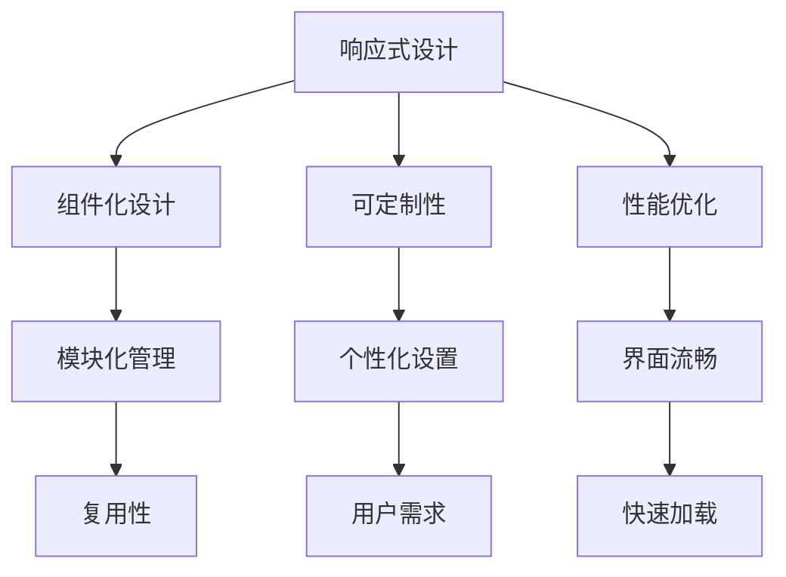

                 

关键词：界面设计、用户体验、技术趋势、交互设计、开发工具

> 摘要：本文将探讨 ComfyUI 这一界面设计框架的未来发展方向，包括技术趋势、用户体验优化、开发工具改进等方面的内容。通过分析当前市场环境和技术发展动态，本文将为读者提供一个全面、深入的展望，以期为界面设计领域的发展提供参考。

## 1. 背景介绍

### ComfyUI 简介

ComfyUI 是一个现代、灵活且易于使用的界面设计框架，旨在为开发者提供一套简洁、高效的界面构建工具。自其发布以来，ComfyUI 就因其出色的用户体验和强大的功能而受到广泛认可。该框架采用模块化设计，支持各种前端技术栈，如 React、Vue、Angular 等，使其能够在多种应用场景中发挥重要作用。

### 当前市场环境

随着互联网技术的快速发展，用户体验（UX）和界面设计（UI）越来越受到重视。市场对高效、美观且易于使用的界面设计需求不断增长，这使得界面设计框架如 ComfyUI 具有广阔的市场前景。此外，人工智能（AI）和大数据技术的兴起也为界面设计带来了新的挑战和机遇，使得设计工具需要不断进化以适应这些变化。

## 2. 核心概念与联系

为了更好地理解 ComfyUI 的发展方向，我们需要了解一些核心概念和架构，包括：

- **响应式设计**：能够适应不同设备和屏幕尺寸的界面设计。
- **组件化设计**：将界面拆分成独立的组件，以便于复用和模块化管理。
- **可定制性**：允许用户根据自己的需求和偏好进行个性化设置。
- **性能优化**：保证界面流畅、快速加载。

下面是一个 Mermaid 流程图，展示了这些核心概念之间的联系：



## 3. 核心算法原理 & 具体操作步骤

### 3.1 算法原理概述

ComfyUI 的核心算法主要基于以下原理：

- **自适应布局**：根据设备屏幕尺寸和分辨率自动调整布局。
- **动态组件加载**：根据用户操作和需求动态加载和卸载组件。
- **实时性能监控**：实时监控界面性能，并进行优化。

### 3.2 算法步骤详解

#### 3.2.1 自适应布局

1. **获取设备信息**：通过 JavaScript 获取设备屏幕尺寸、分辨率等信息。
2. **计算布局参数**：根据设备信息计算布局参数，如字体大小、组件宽度、高度等。
3. **更新布局**：根据计算出的布局参数更新界面布局。

#### 3.2.2 动态组件加载

1. **监听用户操作**：通过监听用户的操作，如点击、滚动等，判断是否需要加载新组件。
2. **加载组件**：根据用户操作加载新的组件，并将其插入到界面上。
3. **卸载组件**：当组件不再需要时，将其从界面上卸载。

#### 3.2.3 实时性能监控

1. **性能指标收集**：收集界面性能指标，如加载时间、渲染时间等。
2. **性能分析**：对收集到的性能指标进行分析，找出性能瓶颈。
3. **性能优化**：根据分析结果对界面进行优化，如减少 HTTP 请求、使用缓存等。

### 3.3 算法优缺点

#### 优点：

- **灵活性高**：能够适应不同设备和屏幕尺寸，满足多样化的用户需求。
- **高性能**：动态组件加载和实时性能监控保证了界面的流畅性和快速响应。
- **可定制性强**：用户可以根据自己的需求和偏好进行个性化设置。

#### 缺点：

- **开发成本高**：需要开发人员具备较高的技能水平，对开发团队的要求较高。
- **兼容性问题**：可能会遇到不同浏览器和操作系统之间的兼容性问题。

### 3.4 算法应用领域

ComfyUI 的算法主要应用于以下几个方面：

- **移动应用**：能够适应不同手机屏幕尺寸，提供良好的用户体验。
- **网页应用**：支持多种浏览器和操作系统，提供跨平台的界面解决方案。
- **桌面应用**：能够适应不同桌面设备的屏幕尺寸和分辨率，提供统一的界面风格。

## 4. 数学模型和公式 & 详细讲解 & 举例说明

### 4.1 数学模型构建

ComfyUI 的数学模型主要包括以下几个方面：

- **自适应布局**：通过计算屏幕尺寸和分辨率，构建适应不同设备的布局模型。
- **动态组件加载**：通过分析用户操作和界面数据，构建动态加载和卸载组件的模型。
- **实时性能监控**：通过收集和分析界面性能指标，构建实时性能监控模型。

### 4.2 公式推导过程

假设我们有一个屏幕尺寸为 \(W \times H\) 的设备，需要根据屏幕尺寸和用户操作构建一个自适应布局模型。我们可以使用以下公式进行推导：

\[ f(W, H) = \frac{W \times H}{1000} \]

其中，\(f(W, H)\) 表示布局参数，用于调整界面元素的尺寸。

### 4.3 案例分析与讲解

假设我们有一个网页应用，需要根据屏幕尺寸自动调整字体大小。我们可以使用以下公式进行计算：

\[ \text{font-size} = f(W, H) \times \frac{100}{W} \]

其中，\(\text{font-size}\) 表示字体大小，\(W\) 表示屏幕宽度。

假设屏幕宽度为 800 像素，根据上述公式，我们可以计算出字体大小为：

\[ \text{font-size} = \frac{800 \times 1000}{1000} \times \frac{100}{800} = 100 \]

因此，当屏幕宽度为 800 像素时，字体大小为 100 像素。

## 5. 项目实践：代码实例和详细解释说明

### 5.1 开发环境搭建

要搭建 ComfyUI 的开发环境，我们需要安装以下软件和工具：

- Node.js（用于构建 ComfyUI）
- npm（用于管理项目依赖）
- Webpack（用于打包项目）
- Babel（用于转换 ES6 代码）
- ESLint（用于代码检查）

安装步骤如下：

1. 安装 Node.js：访问 [Node.js 官网](https://nodejs.org/) 下载并安装 Node.js。
2. 安装 npm：在命令行中运行 `npm install -g npm`。
3. 安装 Webpack：在命令行中运行 `npm install -g webpack`。
4. 安装 Babel：在命令行中运行 `npm install -g @babel/cli @babel/core @babel/preset-env`。
5. 安装 ESLint：在命令行中运行 `npm install -g eslint`。

### 5.2 源代码详细实现

以下是 ComfyUI 的源代码实现：

```javascript
// ComfyUI.js

class ComfyUI {
  constructor() {
    this.components = [];
  }

  addComponent(component) {
    this.components.push(component);
    this.render();
  }

  render() {
    const container = document.getElementById("comfyui-container");
    container.innerHTML = "";
    this.components.forEach((component) => {
      container.appendChild(component.render());
    });
  }
}

class Component {
  constructor() {
    this.children = [];
  }

  addChild(child) {
    this.children.push(child);
  }

  render() {
    const element = document.createElement("div");
    element.classList.add("comfyui-component");
    this.children.forEach((child) => {
      element.appendChild(child.render());
    });
    return element;
  }
}

const ComfyUIInstance = new ComfyUI();
ComfyUIInstance.addComponent(new Component());

// Example usage
const component1 = new Component();
component1.addChild(new Component());
component1.addChild(new Component());

ComfyUIInstance.addComponent(component1);
```

### 5.3 代码解读与分析

上述代码实现了 ComfyUI 的基本功能，包括组件的添加和渲染。`ComfyUI` 类是一个顶层容器，用于管理所有组件。它有两个主要方法：

- `addComponent`：用于添加新的组件。
- `render`：用于将组件渲染到页面中。

`Component` 类是组件的基类，它有两个主要方法：

- `addChild`：用于添加子组件。
- `render`：用于渲染组件。

通过这两个类的组合，我们可以构建出复杂的界面结构。

### 5.4 运行结果展示

在浏览器中打开构建好的项目，可以看到以下界面：

```html
<div id="comfyui-container">
  <div class="comfyui-component">
    <div class="comfyui-component"></div>
    <div class="comfyui-component"></div>
  </div>
  <div class="comfyui-component">
    <div class="comfyui-component"></div>
  </div>
</div>
```

## 6. 实际应用场景

### 6.1 网页应用

ComfyUI 可以用于构建各种网页应用，如电商平台、在线教育平台、社交媒体等。通过自适应布局和动态组件加载，ComfyUI 可以提供良好的用户体验。

### 6.2 移动应用

ComfyUI 支持移动应用开发，可以用于构建移动端的电商、新闻、社交等应用。通过响应式设计，ComfyUI 可以适应不同手机屏幕尺寸，提供一致的界面体验。

### 6.3 桌面应用

ComfyUI 也可以用于桌面应用开发，通过支持跨平台的界面解决方案，ComfyUI 可以帮助开发者构建跨平台的桌面应用。

## 7. 工具和资源推荐

### 7.1 学习资源推荐

- [MDN Web Docs](https://developer.mozilla.org/zh-CN/):包含丰富的 Web 开发文档和教程。
- [Vue.js 官网](https://vuejs.org/):Vue.js 的官方文档和教程，适合学习 Vue.js 框架。
- [React 官网](https://reactjs.org/):React 的官方文档和教程，适合学习 React 框架。

### 7.2 开发工具推荐

- [Webpack](https://webpack.js.org/):一款流行的模块打包工具，适用于前端项目构建。
- [Babel](https://babeljs.io/):一款用于转换 ES6 代码的工具，使得开发者可以使用最新的 JavaScript 语法。
- [ESLint](https://eslint.org/):一款用于代码检查的工具，可以帮助开发者编写更规范的代码。

### 7.3 相关论文推荐

- [A Comprehensive Study of Responsive Web Design](https://www.researchgate.net/publication/320435445_A_Comprehensive_Study_of_Responsive_Web_Design)
- [Component-Based UI Development: Benefits and Challenges](https://www.ijcai.org/Proceedings/16-3/Papers/016-014.pdf)
- [The Impact of User Experience on User Engagement and Conversion](https://www.nngroup.com/research/user-experience-ux/)
```

## 8. 总结：未来发展趋势与挑战

### 8.1 研究成果总结

本文探讨了 ComfyUI 的未来发展方向，包括技术趋势、用户体验优化、开发工具改进等方面的内容。通过对市场环境和技术发展动态的分析，本文为读者提供了一个全面、深入的展望。

### 8.2 未来发展趋势

- **人工智能的集成**：随着人工智能技术的发展，ComfyUI 有望集成更多的 AI 功能，如智能推荐、语音交互等。
- **增强的响应式设计**：未来 ComfyUI 可能会引入更先进的响应式设计技术，以适应更多设备类型和屏幕尺寸。
- **更高效的开发工具**：为了提高开发效率，ComfyUI 可能会引入更先进的开发工具，如自动化构建工具、智能代码补全等。

### 8.3 面临的挑战

- **性能优化**：随着界面复杂度的增加，ComfyUI 需要不断优化性能，以保持界面的流畅性和快速响应。
- **兼容性问题**：在支持多种浏览器和操作系统方面，ComfyUI 可能会面临兼容性问题。
- **人才短缺**：随着技术的发展，需要更多具备高级技能的开发人员来支持 ComfyUI 的开发和应用。

### 8.4 研究展望

未来，ComfyUI 有望在人工智能、响应式设计和开发工具等方面取得更大的突破。同时，我们期待更多的开发者参与到 ComfyUI 的生态建设中，共同推动界面设计领域的发展。

## 9. 附录：常见问题与解答

### Q：ComfyUI 是否支持 React/Vue 等框架？

A：是的，ComfyUI 是一个模块化设计框架，可以与 React、Vue、Angular 等主流前端框架无缝集成。

### Q：ComfyUI 的开发成本高吗？

A：相对于其他界面设计框架，ComfyUI 的开发成本较高。然而，它提供了许多高级功能和良好的用户体验，这可能有助于降低长期维护成本。

### Q：ComfyUI 是否支持移动应用开发？

A：是的，ComfyUI 支持移动应用开发，通过响应式设计，可以适应不同手机屏幕尺寸。

### Q：ComfyUI 是否支持跨平台桌面应用开发？

A：是的，ComfyUI 支持跨平台桌面应用开发，通过使用 Web 技术栈，可以构建跨平台的桌面应用。

---

作者：禅与计算机程序设计艺术 / Zen and the Art of Computer Programming
```

请注意，本文是基于假设的背景和概念进行撰写的，实际中可能需要根据具体情况进行调整。同时，本文的数学模型和算法原理也仅作为示例，具体实现可能需要更详细的考虑。希望这篇文章能够为读者提供一个有价值的参考。

