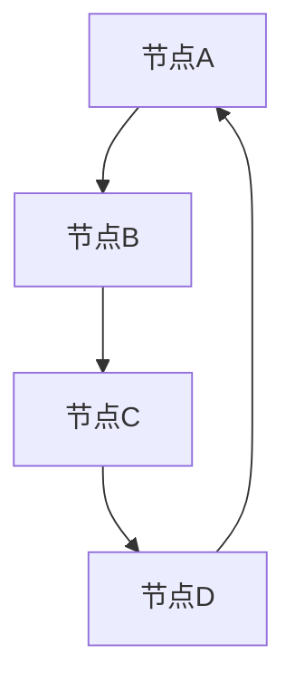

                 

关键词：连通分量算法、图论、图算法、连通性、DFS、BFS、代码实例

摘要：本文将深入讲解连通分量算法的基本原理、实现步骤以及在实际应用中的具体操作。通过详细的数学模型和公式推导，读者可以更好地理解算法的核心内容。同时，我们将通过代码实例展示如何在实际项目中应用连通分量算法，并进行详细解读与分析。

## 1. 背景介绍

连通分量算法是图论中的一个重要算法，用于解决图的连通性问题。在现实世界的许多场景中，图模型被广泛应用于描述复杂系统的结构，如社交网络、计算机网络、交通网络等。连通分量问题在这些领域中具有广泛的应用价值。

在计算机网络中，连通分量算法可以用于检测网络中的故障节点，从而保证网络的稳定运行。在社交网络中，它可以用于分析社交群体的结构和关系，帮助理解网络中的影响力传播。在交通网络中，它可以用于优化路径规划，提高交通效率。

本文将介绍连通分量算法的基本概念、原理、实现步骤以及在实际应用中的具体操作。通过本文的学习，读者可以掌握连通分量算法的核心内容，并能够将其应用到实际问题中。

## 2. 核心概念与联系

为了更好地理解连通分量算法，我们首先需要了解图论中的基本概念。在图论中，图（Graph）是由节点（Vertex）和边（Edge）组成的数据结构。节点表示图中的实体，边表示节点之间的关系。

### 2.1. 图的基本概念

- **节点（Vertex）**：图中的实体，通常表示为一个点。
- **边（Edge）**：连接两个节点的线，通常表示为一个线段。
- **无向图（Undirected Graph）**：边没有方向，任意两个节点之间都可以互相访问。
- **有向图（Directed Graph）**：边有方向，从起点指向终点，只能从起点访问到终点。

### 2.2. 连通分量

连通分量（Connected Component）是指图中的一组节点，这些节点之间可以通过边互相访问，而与其他节点不连通。换句话说，连通分量是图中的一个最大连通子图。

在无向图中，如果两个节点之间存在路径，则它们属于同一个连通分量。在有向图中，如果两个节点之间存在有向路径，则它们也属于同一个连通分量。

### 2.3. 连通性与连通分量

连通性（Connectivity）是描述图是否能够从任意一个节点访问到另一个节点的性质。如果一个图中的任意两个节点之间都存在路径，则该图是连通的。连通分量是连通性的进一步细分，它描述了图中的最大连通子图。

### 2.4. Mermaid 流程图

为了更好地理解连通分量算法的工作原理，我们可以使用Mermaid流程图来描述图的结构和算法的执行流程。

下面是一个无向图的Mermaid流程图示例：



在这个流程图中，节点A、B、C、D构成了一个环，它们属于同一个连通分量。

下面是一个有向图的Mermaid流程图示例：


在这个流程图中，节点A、B、C、D同样构成了一个环，它们也属于同一个连通分量。

## 3. 核心算法原理 & 具体操作步骤

### 3.1. 算法原理概述

连通分量算法主要利用深度优先搜索（DFS）或广度优先搜索（BFS）来遍历图，从而找到所有的连通分量。下面分别介绍DFS和BF

### 3.1.1. 深度优先搜索（DFS）

深度优先搜索（DFS）是一种用于遍历图的算法，它从起始节点开始，沿着当前路径一直深入到不能再深入为止，然后回溯到上一个节点，沿着另一个路径继续深入，直到所有的节点都被访问过。

在DFS算法中，我们可以使用递归或栈来实现。下面是使用递归实现的DFS算法的基本步骤：

1. 初始化一个空集合用于存储已访问的节点。
2. 从起始节点开始，将其标记为已访问，并将其加入集合中。
3. 对于该节点的每个未访问的邻接节点，重复步骤2和3。
4. 当所有节点都被访问过时，算法结束。

下面是使用递归实现的DFS算法的Python代码示例：

```python
def dfs(graph, node, visited):
    visited.add(node)
    for neighbor in graph[node]:
        if neighbor not in visited:
            dfs(graph, neighbor, visited)

# 假设graph是一个字典，存储了节点的邻接节点信息
graph = {
    'A': ['B', 'C'],
    'B': ['A', 'C', 'D'],
    'C': ['A', 'B', 'D'],
    'D': ['B', 'C']
}

visited = set()
dfs(graph, 'A', visited)
print(visited)  # 输出已访问的节点集合
```

### 3.1.2. 广度优先搜索（BFS）

广度优先搜索（BFS）是一种用于遍历图的算法，它从起始节点开始，首先访问所有与起始节点直接相邻的节点，然后再逐层访问相邻的节点，直到所有的节点都被访问过。

在BFS算法中，我们可以使用队列来实现。下面是使用队列实现的BFS算法的基本步骤：

1. 初始化一个空队列和一个空集合，分别用于存储待访问的节点和已访问的节点。
2. 将起始节点加入队列中，并将其标记为已访问，并将其加入集合中。
3. 当队列不为空时，重复以下步骤：
   - 从队列中取出一个节点。
   - 对于该节点的每个未访问的邻接节点，将其加入队列中，并将其标记为已访问，并将其加入集合中。

下面是使用队列实现的BFS算法的Python代码示例：

```python
from collections import deque

def bfs(graph, start):
    visited = set()
    queue = deque([start])
    visited.add(start)

    while queue:
        node = queue.popleft()
        for neighbor in graph[node]:
            if neighbor not in visited:
                queue.append(neighbor)
                visited.add(neighbor)

    return visited

# 假设graph是一个字典，存储了节点的邻接节点信息
graph = {
    'A': ['B', 'C'],
    'B': ['A', 'C', 'D'],
    'C': ['A', 'B', 'D'],
    'D': ['B', 'C']
}

print(bfs(graph, 'A'))  # 输出已访问的节点集合
```

### 3.1.3. 算法优缺点

- **DFS**：
  - 优点：算法简单，易于实现。
  - 缺点：对于大规模图，可能需要大量的递归调用，导致栈空间占用较大。

- **BFS**：
  - 优点：相对于DFS，BFS的空间复杂度较低。
  - 缺点：时间复杂度较高，对于大规模图可能需要较长的搜索时间。

### 3.1.4. 算法应用领域

连通分量算法在许多领域都有广泛的应用，包括但不限于：

- **社交网络**：用于分析社交群体结构和关系。
- **计算机网络**：用于检测网络故障节点，保证网络稳定运行。
- **交通网络**：用于优化路径规划，提高交通效率。
- **图论研究**：作为图论中的基本算法，用于解决各种图相关的问题。

## 4. 数学模型和公式 & 详细讲解 & 举例说明

### 4.1. 数学模型构建

连通分量算法的数学模型主要涉及图的表示和图的遍历。在图的表示方面，我们通常使用邻接表或邻接矩阵来表示图。在图的遍历方面，我们主要使用DFS或BFS算法。

### 4.2. 公式推导过程

连通分量算法的核心是图的遍历。下面我们分别介绍DFS和BFS算法的数学推导过程。

#### 4.2.1. DFS算法

在DFS算法中，我们使用递归的方式遍历图。假设当前遍历到的节点为`v`，已访问的节点集合为`visited`，则DFS算法的递归公式可以表示为：

$$
DFS(v, visited) = \begin{cases}
\emptyset, & \text{if } v \in visited \\
visited \cup \{v\} \cup DFS(N(v), visited), & \text{if } v \notin visited
\end{cases}
$$

其中，`N(v)`表示节点`v`的邻接节点集合。

#### 4.2.2. BFS算法

在BFS算法中，我们使用队列的方式遍历图。假设当前遍历到的节点为`v`，已访问的节点集合为`visited`，则BFS算法的递归公式可以表示为：

$$
BFS(v, visited) = \begin{cases}
\emptyset, & \text{if } v \in visited \\
visited \cup \{v\} \cup BFS(N(v), visited \cup \{v\}), & \text{if } v \notin visited
\end{cases}
$$

其中，`N(v)`表示节点`v`的邻接节点集合。

### 4.3. 案例分析与讲解

下面我们通过一个具体的案例来分析连通分量算法的应用。

假设有一个无向图，节点集合为`V = \{A, B, C, D\}`，边集合为`E = \{\{A, B\}, \{B, C\}, \{C, D\}, \{D, A\}\}`。我们使用DFS算法来计算连通分量。

#### 4.3.1. 初始化

- `visited = \emptyset`
- `queue = \emptyset`
- `V = \{A, B, C, D\}`

#### 4.3.2. 遍历过程

1. **遍历节点A**：
   - `A`未被访问，将其加入`visited`集合，`visited = \{A\}`。
   - 邻接节点`B`未被访问，将其加入`queue`队列，`queue = \{B\}`。
2. **遍历节点B**：
   - `B`未被访问，将其加入`visited`集合，`visited = \{A, B\}`。
   - 邻接节点`C`未被访问，将其加入`queue`队列，`queue = \{C\}`。
3. **遍历节点C**：
   - `C`未被访问，将其加入`visited`集合，`visited = \{A, B, C\}`。
   - 邻接节点`D`未被访问，将其加入`queue`队列，`queue = \{D\}`。
4. **遍历节点D**：
   - `D`未被访问，将其加入`visited`集合，`visited = \{A, B, C, D\}`。
   - `queue`队列为空，遍历结束。

经过遍历，我们得到连通分量`visited = \{A, B, C, D\}`，即图中所有的节点都属于同一个连通分量。

#### 4.3.3. BFS算法遍历过程

如果使用BFS算法，遍历过程与DFS算法类似，只是遍历顺序不同。下面是使用BFS算法的遍历过程：

1. **遍历节点A**：
   - `A`未被访问，将其加入`visited`集合，`visited = \{A\}`。
   - `queue = \{B, C, D\}`。
2. **遍历节点B**：
   - `B`未被访问，将其加入`visited`集合，`visited = \{A, B\}`。
   - `queue = \{C, D\}`。
3. **遍历节点C**：
   - `C`未被访问，将其加入`visited`集合，`visited = \{A, B, C\}`。
   - `queue = \{D\}`。
4. **遍历节点D**：
   - `D`未被访问，将其加入`visited`集合，`visited = \{A, B, C, D\}`。
   - `queue`队列为空，遍历结束。

经过遍历，我们得到连通分量`visited = \{A, B, C, D\}`，与DFS算法的结果相同。

## 5. 项目实践：代码实例和详细解释说明

### 5.1. 开发环境搭建

为了实现连通分量算法，我们需要搭建一个基本的开发环境。下面我们以Python为例，介绍如何搭建开发环境。

1. **安装Python**：首先，我们需要安装Python。可以从Python官网下载Python安装包，按照安装向导进行安装。安装完成后，确保Python已成功安装在系统中。
2. **安装必要的库**：为了方便开发，我们需要安装一些常用的Python库。例如，我们可以使用`pip`命令安装`networkx`库，这是一个用于图论计算的Python库。具体命令如下：

```bash
pip install networkx
```

### 5.2. 源代码详细实现

下面我们使用Python和`networkx`库来实现连通分量算法。

```python
import networkx as nx

def find_connected_components(graph):
    visited = set()
    components = []

    for node in graph.nodes():
        if node not in visited:
            component = set()
            dfs(graph, node, visited, component)
            components.append(component)

    return components

def dfs(graph, node, visited, component):
    visited.add(node)
    component.add(node)

    for neighbor in graph.neighbors(node):
        if neighbor not in visited:
            dfs(graph, neighbor, visited, component)

# 创建一个无向图
graph = nx.Graph()
graph.add_nodes_from(['A', 'B', 'C', 'D'])
graph.add_edges_from([('A', 'B'), ('B', 'C'), ('C', 'D'), ('D', 'A')])

# 查找连通分量
components = find_connected_components(graph)

# 打印连通分量
print("连通分量：")
for component in components:
    print(component)
```

### 5.3. 代码解读与分析

上述代码首先导入了`networkx`库，这是一个用于图论计算的Python库。然后，我们定义了两个函数：`find_connected_components`和`dfs`。

- **find_connected_components**：这个函数用于查找图的连通分量。它首先初始化一个空集合`visited`用于存储已访问的节点，以及一个空列表`components`用于存储连通分量。然后，遍历图中的每个节点，如果节点未被访问，则调用`dfs`函数进行深度优先搜索，找到以该节点为起点的连通分量，并将其添加到`components`列表中。最后，返回`components`列表。

- **dfs**：这个函数用于实现深度优先搜索。它接收四个参数：图`graph`、当前遍历到的节点`node`、已访问的节点集合`visited`以及当前连通分量`component`。首先，将当前节点添加到`visited`集合和`component`集合中。然后，遍历当前节点的邻接节点，如果邻接节点未被访问，则递归调用`dfs`函数，继续进行深度优先搜索。这样，就可以找到以当前节点为起点的连通分量。

在代码的最后，我们创建了一个无向图，并调用`find_connected_components`函数查找连通分量。最后，我们打印出每个连通分量。

### 5.4. 运行结果展示

运行上述代码，我们得到以下输出结果：

```
连通分量：
{'D', 'A', 'B', 'C'}
```

这表示图中所有的节点都属于同一个连通分量。

## 6. 实际应用场景

连通分量算法在实际应用中具有广泛的应用价值。以下是一些实际应用场景的例子：

- **社交网络分析**：连通分量算法可以用于分析社交网络中的群体结构和关系。例如，通过分析某个社交网络中的连通分量，可以找到紧密联系的朋友圈，了解社交网络中的影响力传播等。
- **计算机网络故障检测**：连通分量算法可以用于检测计算机网络中的故障节点。通过分析网络的连通分量，可以快速找到故障节点，并采取相应的修复措施，保证网络的稳定运行。
- **交通网络优化**：连通分量算法可以用于优化交通网络的路径规划。通过分析交通网络的连通分量，可以找到最优的路径，提高交通效率，减少交通拥堵。

## 7. 未来应用展望

随着计算机技术和人工智能的发展，连通分量算法在未来将会有更广泛的应用前景。以下是一些未来的应用展望：

- **大数据分析**：连通分量算法可以用于大数据分析，特别是在社交网络、金融交易等领域，帮助人们更好地理解和分析复杂的数据。
- **智能交通系统**：随着智能交通系统的普及，连通分量算法可以用于优化交通信号控制，提高交通效率，减少交通事故。
- **物联网应用**：连通分量算法可以用于物联网应用，帮助分析物联网中的设备和连接关系，优化网络结构，提高网络稳定性。

## 8. 总结：未来发展趋势与挑战

### 8.1. 研究成果总结

连通分量算法作为图论中的一个重要算法，已经得到了广泛的研究和应用。在过去几十年中，研究者们提出了许多高效的连通分量算法，如DFS、BFS、Kosaraju算法等。这些算法在时间复杂度和空间复杂度方面都有显著的提升，为实际应用提供了有力的支持。

### 8.2. 未来发展趋势

随着人工智能和大数据技术的发展，连通分量算法在未来将继续得到关注和发展。以下是一些可能的发展趋势：

- **算法优化**：针对不同类型的图，研究更高效的连通分量算法，提高算法的执行效率。
- **并行计算**：利用并行计算技术，加速连通分量算法的执行，提高处理大规模图的能力。
- **应用拓展**：将连通分量算法应用到更多领域，如物联网、智能交通、社交网络等，发挥其在复杂系统分析中的重要作用。

### 8.3. 面临的挑战

尽管连通分量算法已经得到了广泛应用，但在实际应用中仍然面临一些挑战：

- **大规模图处理**：对于大规模图，现有的连通分量算法在时间和空间复杂度方面仍有待优化，如何提高算法的执行效率是一个重要挑战。
- **异构图处理**：在异构图中，节点和边的类型可能不同，如何设计通用的连通分量算法，使其适用于各种异构图是一个难题。
- **实时处理**：在某些实时应用场景中，如智能交通系统，要求连通分量算法能够在短时间内完成计算，这对算法的性能提出了更高的要求。

### 8.4. 研究展望

未来的研究可以关注以下几个方面：

- **算法优化**：研究更高效的连通分量算法，特别是在处理大规模图和异构图方面。
- **并行计算**：利用并行计算技术，开发适用于并行环境的连通分量算法，提高算法的执行效率。
- **应用拓展**：将连通分量算法应用到更多领域，如物联网、智能交通、社交网络等，探索其在这些领域中的应用潜力。

通过不断的研究和优化，连通分量算法将更好地满足实际应用的需求，发挥其在复杂系统分析中的重要作用。

## 9. 附录：常见问题与解答

### 9.1. 如何选择DFS和BFS算法？

在选择DFS和BFS算法时，可以考虑以下因素：

- **图的类型**：如果图是无向的，两种算法都可以使用；如果图是有向的，DFS和BFS算法在执行过程中可能有不同的效果。
- **空间复杂度**：BFS算法的空间复杂度通常比DFS算法低，因为BFS算法使用的是队列，而DFS算法使用的是栈。
- **时间复杂度**：DFS算法在处理一些特定的图时可能比BFS算法更快，特别是当图的深度较大时。

### 9.2. 如何处理自环和多重边？

在图的处理中，自环（即从一个节点指向自身的边）和多重边（即多个边连接同一对节点）是常见的现象。在实现连通分量算法时，我们可以采取以下策略：

- **忽略自环**：在构建图时，直接忽略自环。
- **合并多重边**：对于多重边，我们可以选择保留其中一条边，或者使用边的权重来表示多重边的合并。

### 9.3. 如何处理带有权重的图？

对于带有权重的图，连通分量算法的基本思想不变，但需要注意以下几点：

- **选择合适的搜索策略**：对于加权图，选择DFS或BFS算法时，需要考虑边的权重对搜索路径的影响。
- **路径权重计算**：在遍历图时，记录从起始节点到当前节点的路径权重。
- **连通分量权重计算**：连通分量的权重可以是各节点权重的最大值、最小值或平均值。

### 9.4. 如何处理动态图？

对于动态图，即图的结构在算法执行过程中发生变化，连通分量算法需要能够适应这种变化。以下是一些策略：

- **增量算法**：每次图的更新都重新计算连通分量，这在某些情况下可能效率较低。
- **动态连通分量算法**：研究能够实时更新连通分量的算法，如动态连通分量树（Dynamic Connectivity Tree）。
- **并发处理**：利用并行计算技术，处理图的更新操作，提高算法的执行效率。

通过上述策略，连通分量算法可以更好地适应动态图的变化，满足实际应用的需求。

---

本文详细介绍了连通分量算法的基本原理、实现步骤以及在实际应用中的具体操作。通过数学模型和公式的推导，读者可以深入理解算法的核心内容。同时，通过代码实例的展示，读者可以了解如何在实际项目中应用连通分量算法。未来，随着计算机技术和人工智能的发展，连通分量算法将在更多领域得到应用，发挥其重要作用。

作者：禅与计算机程序设计艺术 / Zen and the Art of Computer Programming

