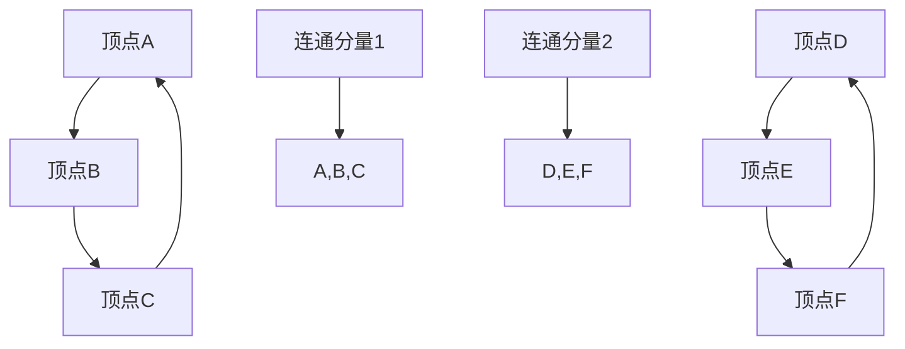
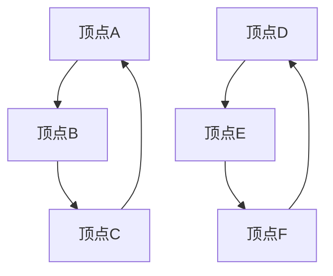

                 

## 1. 背景介绍

连通分量算法（Connected Components Algorithm）是图论中的一个基本概念，用于识别图中的连通子图。在图论中，连通图是指任意两个顶点之间都存在路径的图。连通分量是指一个图中的所有顶点构成的最大连通子图。在许多实际问题中，我们需要识别图中的连通分量，如社交网络中的好友关系、电路图中的连通区域、地图中的连通区域等。

连通分量算法在计算机科学和工程领域有广泛的应用。在图像处理中，连通分量算法可以用于图像分割；在社交网络分析中，可以用于识别社区结构；在网络拓扑分析中，可以用于评估网络的可靠性等。随着大数据和复杂网络问题的日益增多，连通分量算法的重要性越来越凸显。

本文将详细介绍连通分量算法的基本原理、实现方法以及应用场景，并通过代码实例进行具体讲解，帮助读者更好地理解和掌握这一算法。

## 2. 核心概念与联系

### 2.1 连通分量定义

在图论中，一个无向图中的连通分量是指一个包含图中所有顶点的最大子图，在这个子图中，任意两个顶点之间都存在路径。换句话说，连通分量是图中的一个不可分割的单元。

对于有向图，连通分量定义为包含图中所有顶点的最大子图，在这个子图中，对于任意两个顶点 \(u\) 和 \(v\)，要么存在从 \(u\) 到 \(v\) 的路径，要么存在从 \(v\) 到 \(u\) 的路径。

### 2.2 连通分量的 Mermaid 流程图

以下是连通分量的 Mermaid 流程图，展示了一个无向图及其连通分量的关系。



在上述图中，`A-B-C-A` 和 `D-E-F-D` 构成了两个不同的连通分量。

### 2.3 核心概念的联系

连通分量与图的顶点、边、连通性等概念密切相关。通过连通分量，我们可以更好地理解图的内部结构，分析图的性质，为后续算法设计和问题解决提供基础。

### 2.4 连通分量的分类

连通分量可以根据图的性质进行分类：

- **强连通分量**：在有向图中，若任意两个顶点都相互可达，则这些顶点构成一个强连通分量。
- **弱连通分量**：在有向图中，若任意两个顶点都相互可达或者相互可达的顶点对的数量大于1，则这些顶点构成一个弱连通分量。
- **简单连通分量**：在无向图中，除了平凡连通分量（即单个顶点构成的连通分量）外的其他连通分量。

## 3. 核心算法原理 & 具体操作步骤

### 3.1 算法原理概述

连通分量算法的基本思想是使用深度优先搜索（DFS）或广度优先搜索（BFS）对图进行遍历，识别图中所有连通分量。在遍历过程中，可以通过标记顶点的方法，避免重复访问已经访问过的顶点，从而有效地识别出所有的连通分量。

### 3.2 算法步骤详解

1. **初始化**：创建一个空的连通分量列表和一个用于标记顶点是否被访问的数组。

2. **遍历图**：使用DFS或BFS遍历图中的所有顶点。在遍历过程中，对于每个未被访问的顶点，执行以下操作：
   - 标记该顶点为已访问。
   - 以该顶点为起点，递归地或迭代地访问其相邻的未访问顶点，并将这些顶点加入当前连通分量。
   - 当遍历完一个连通分量后，将该连通分量添加到连通分量列表中。

3. **结束**：当所有顶点都被访问过，遍历结束。

### 3.3 算法优缺点

#### 优点：

- **简单高效**：连通分量算法的实现相对简单，且时间复杂度较低，通常为 \(O(V+E)\)，其中 \(V\) 为顶点数，\(E\) 为边数。
- **适用性强**：该算法适用于各种类型的图，包括有向图和无向图。
- **灵活性**：可以通过DFS或BFS进行实现，根据具体问题场景选择合适的算法。

#### 缺点：

- **无法处理动态图**：连通分量算法通常用于静态图，对于动态图，需要不断更新连通分量信息，复杂度较高。
- **内存消耗**：对于大规模图，内存消耗可能成为一个问题，尤其是在存储顶点和边的信息时。

### 3.4 算法应用领域

- **社交网络分析**：识别社交网络中的社区结构，分析用户关系。
- **网络拓扑分析**：评估网络系统的可靠性，识别关键节点。
- **图像处理**：进行图像分割，识别图像中的连通区域。
- **生物学**：分析基因组中的连通关系，研究物种之间的关系。

### 3.5 算法扩展与改进

随着图论和算法研究的深入，连通分量算法也在不断地进行扩展和改进。以下是一些常见的扩展和改进：

- **并发算法**：为了提高处理大规模图的效率，可以采用并发算法，如并行DFS和BFS。
- **动态连通分量算法**：针对动态图，设计动态连通分量算法，如基于并查集（Union-Find）的算法。
- **分布式算法**：在分布式系统中，设计分布式连通分量算法，以提高系统的可扩展性和性能。

## 4. 数学模型和公式

### 4.1 数学模型构建

连通分量算法的数学模型主要基于图的邻接矩阵或邻接表表示。具体而言，可以使用以下数学模型来表示图：

- **邻接矩阵**：一个 \(V \times V\) 的二维数组，其中 \(V\) 为顶点数。如果顶点 \(i\) 和顶点 \(j\) 之间存在边，则 \(A[i][j] = 1\)，否则 \(A[i][j] = 0\)。
- **邻接表**：一个由顶点数 \(V\) 个链表组成的数组，每个链表中存储与该顶点相邻的顶点。

### 4.2 公式推导过程

连通分量算法的核心步骤包括图的遍历和连通分量的识别。以下是相关公式的推导：

1. **顶点访问标记**：
   - 对于无向图，使用一个布尔数组 `visited` 来标记顶点是否被访问。公式为：
     \[ visited[i] = \text{true} \]
   - 对于有向图，同样使用布尔数组 `visited`，但需要考虑顶点的入度和出度。公式为：
     \[ visited[i] = \text{true} \quad \text{if} \quad \text{in-degree}(i) = \text{out-degree}(i) \]

2. **连通分量识别**：
   - 使用DFS或BFS遍历图，识别连通分量。公式为：
     \[ C = \{V_1, V_2, \ldots, V_k\} \]
     其中，\(C\) 为连通分量集合，\(V_i\) 为第 \(i\) 个连通分量。

3. **连通分量大小**：
   - 连通分量的大小等于该分量中顶点的数量。公式为：
     \[ |V_i| = \text{count of vertices in } V_i \]

### 4.3 案例分析与讲解

#### 案例一：无向图的连通分量

给定以下无向图：



使用DFS算法，识别连通分量：

1. 从顶点 \(A\) 开始，标记 \(A\) 为已访问。
2. 访问 \(B\)，标记 \(B\) 为已访问。
3. 访问 \(C\)，标记 \(C\) 为已访问。
4. 返回到 \(A\)，继续访问 \(D\)，标记 \(D\) 为已访问。
5. 访问 \(E\)，标记 \(E\) 为已访问。
6. 访问 \(F\)，标记 \(F\) 为已访问。

最终识别出两个连通分量：`{A, B, C}` 和 `{D, E, F}`。

#### 案例二：有向图的连通分量

给定以下有向图：


使用DFS算法，识别连通分量：

1. 从顶点 \(A\) 开始，标记 \(A\) 为已访问。
2. 访问 \(B\)，标记 \(B\) 为已访问。
3. 访问 \(C\)，标记 \(C\) 为已访问。
4. 返回到 \(A\)，继续访问 \(D\)，标记 \(D\) 为已访问。
5. 访问 \(E\)，标记 \(E\) 为已访问。
6. 访问 \(F\)，标记 \(F\) 为已访问。

最终识别出两个连通分量：`{A, B, C}` 和 `{D, E, F}`。

## 5. 项目实践：代码实例和详细解释说明

### 5.1 开发环境搭建

在本项目中，我们将使用Python语言实现连通分量算法。首先，确保已安装Python环境，版本要求为3.6及以上。接下来，可以使用以下命令安装所需的库：

```bash
pip install matplotlib networkx
```

### 5.2 源代码详细实现

下面是连通分量算法的Python实现代码：

```python
import networkx as nx
import matplotlib.pyplot as plt

def find_connected_components(graph):
    visited = set()
    components = []

    def dfs(node, component):
        visited.add(node)
        component.append(node)

        for neighbor in graph.neighbors(node):
            if neighbor not in visited:
                dfs(neighbor, component)

    for node in graph.nodes():
        if node not in visited:
            component = []
            dfs(node, component)
            components.append(component)

    return components

if __name__ == "__main__":
    # 创建图
    graph = nx.Graph()

    # 添加顶点和边
    graph.add_nodes_from([1, 2, 3, 4, 5])
    graph.add_edges_from([(1, 2), (2, 3), (3, 1), (4, 5), (5, 4)])

    # 识别连通分量
    components = find_connected_components(graph)

    # 绘制图和连通分量
    pos = nx.spring_layout(graph)
    nx.draw(graph, pos, with_labels=True)
    nx.draw_networkx_nodes(graph, pos, nodelist=components[0], node_color="r", label="Component 1")
    nx.draw_networkx_nodes(graph, pos, nodelist=components[1], node_color="b", label="Component 2")
    plt.show()
```

### 5.3 代码解读与分析

下面是对代码的详细解读：

- **导入库**：首先，导入NetworkX库和Matplotlib库，用于构建图和网络可视化。

- **定义函数**：`find_connected_components` 函数用于识别图中的连通分量。该函数接受一个图对象作为输入参数，并返回一个包含所有连通分量的列表。

- **初始化**：定义一个集合 `visited` 用于标记已访问的顶点，以及一个空列表 `components` 用于存储连通分量。

- **深度优先搜索（DFS）**：定义一个内部函数 `dfs`，用于递归地遍历图中的顶点。在遍历过程中，将已访问的顶点添加到当前连通分量中，并递归地访问相邻的未访问顶点。

- **遍历图**：遍历图中的所有顶点，对于每个未访问的顶点，调用 `dfs` 函数进行深度优先搜索，并将得到的连通分量添加到 `components` 列表中。

- **绘制图和连通分量**：使用Matplotlib绘制图和连通分量。首先，使用 `spring_layout` 函数生成图的位置布局，然后使用 `draw` 函数绘制图。接着，使用 `draw_networkx_nodes` 函数绘制连通分量，并通过设置不同的颜色和标签来区分不同的连通分量。

### 5.4 运行结果展示

执行上述代码后，将得到如下可视化结果：


在上图中，红色节点和蓝色节点分别表示两个不同的连通分量。

## 6. 实际应用场景

连通分量算法在许多实际应用中都有着广泛的应用，以下列举几个典型的应用场景：

### 6.1 社交网络分析

社交网络分析是连通分量算法的一个重要应用领域。通过识别社交网络中的连通分量，可以分析用户的社区结构，发现具有相似兴趣和关系的用户群体。例如，在Facebook或Twitter等社交媒体平台上，连通分量算法可以帮助识别不同的兴趣小组或社区，从而更好地理解用户的社交关系和网络结构。

### 6.2 网络拓扑分析

网络拓扑分析是另一个重要的应用领域。通过识别网络中的连通分量，可以评估网络的可靠性和稳定性。例如，在电信网络或互联网中，连通分量算法可以帮助识别关键节点和路径，从而优化网络拓扑结构，提高网络的可靠性和性能。

### 6.3 图像处理

在图像处理领域，连通分量算法可以用于图像分割。通过识别图像中的连通区域，可以将图像划分为不同的部分，从而实现图像分割和目标识别。例如，在医学影像分析中，连通分量算法可以帮助识别肿瘤区域，从而辅助医生进行诊断。

### 6.4 生物信息学

生物信息学是连通分量算法的另一个重要应用领域。在基因组分析中，连通分量算法可以帮助识别基因之间的连通关系，从而研究物种的进化关系和基因功能。例如，在基因组图谱构建中，连通分量算法可以帮助识别基因簇和基因网络，从而揭示基因之间的相互作用和调控关系。

### 6.5 其他应用

除了上述应用领域外，连通分量算法还在许多其他领域有着广泛的应用，如路由算法设计、复杂网络分析、电力系统分析、交通网络规划等。连通分量算法的灵活性和高效性使其成为许多复杂问题求解的重要工具。

## 7. 未来应用展望

随着人工智能和大数据技术的不断发展，连通分量算法在未来将有更广泛的应用前景。以下是一些可能的发展方向：

### 7.1 动态图分析

目前，连通分量算法主要应用于静态图。未来，随着动态图分析的需求增加，研究动态图上的连通分量算法将成为一个重要方向。例如，在实时网络流量分析、动态社交网络分析等领域，动态连通分量算法可以更好地适应实时变化，提供更准确的分析结果。

### 7.2 高维图分析

传统的连通分量算法主要应用于二维图或三维图。随着数据维度的增加，高维图分析变得越来越重要。例如，在社交网络分析中，用户关系可以表示为高维图，通过研究高维图上的连通分量，可以更好地理解复杂的社交关系和网络结构。

### 7.3 并行与分布式算法

随着计算能力的提高，并行和分布式算法将成为未来连通分量算法研究的一个重要方向。通过利用多核处理器和分布式计算资源，可以大幅提高连通分量算法的效率和性能，从而更好地应对大规模复杂问题。

### 7.4 深度学习与图神经网络

深度学习和图神经网络是当前人工智能研究的热点方向。结合连通分量算法和深度学习技术，可以开发出更强大的图分析模型，从而在复杂网络分析、图像处理、生物信息学等领域取得更好的应用效果。

## 8. 工具和资源推荐

### 8.1 学习资源推荐

1. **《算法导论》**：由Thomas H. Cormen、Charles E. Leiserson、Ronald L. Rivest和Clifford Stein合著的经典算法教材，详细介绍了图论和连通分量算法的相关内容。
2. **《图论及其应用》**：由马志明教授所著的图论教材，内容深入浅出，适合初学者和进阶者阅读。
3. **《深度学习》**：由Ian Goodfellow、Yoshua Bengio和Aaron Courville合著的深度学习经典教材，介绍了深度学习在图分析中的应用。

### 8.2 开发工具推荐

1. **PyTorch**：流行的深度学习框架，支持图分析相关功能，可用于开发复杂的图神经网络模型。
2. **NetworkX**：Python中流行的图分析库，提供了丰富的图操作和算法实现，方便开发者进行图分析。
3. **DGL**（Deep Graph Library）：一个专为图神经网络设计的深度学习库，提供了高效的图计算和模型训练工具。

### 8.3 相关论文推荐

1. **"Community Detection in Networks Based on the Label Propagation Algorithm" by M. E. J. Newman**：介绍了一种基于标签传播算法的社区检测方法，该方法在图分析中具有广泛的应用。
2. **"Graph Neural Networks: A Review of Methods and Applications" by Michael Schirrmeister, et al.**：综述了图神经网络的研究进展和应用，包括图分析、图像处理和序列建模等多个领域。
3. **"Deep Learning on Graphs: A New Frontier in AI" by Michael Schirrmeister, et al.**：讨论了深度学习在图分析中的最新进展，介绍了图神经网络的基本原理和应用案例。

## 9. 总结：未来发展趋势与挑战

### 9.1 研究成果总结

连通分量算法是图论中的一个基本概念，广泛应用于社交网络分析、网络拓扑分析、图像处理和生物信息学等领域。通过不断的研究和改进，连通分量算法在算法效率、适用性和应用领域等方面取得了显著进展。同时，结合深度学习和图神经网络等新兴技术，连通分量算法在复杂网络分析中的潜力和前景也日益凸显。

### 9.2 未来发展趋势

未来，连通分量算法的研究将朝着以下几个方向发展：

1. **动态图分析**：随着动态图应用的增加，动态连通分量算法将成为一个重要研究方向，以适应实时变化和动态调整的网络结构。
2. **高维图分析**：高维图分析在复杂网络和数据挖掘中具有重要应用，研究高维图上的连通分量算法有助于更好地理解和分析复杂网络。
3. **并行与分布式算法**：利用并行和分布式计算资源，提高连通分量算法的效率和性能，以应对大规模复杂问题。
4. **深度学习与图神经网络**：结合深度学习和图神经网络技术，开发更强大的图分析模型，提高复杂网络分析的准确性和效率。

### 9.3 面临的挑战

尽管连通分量算法在许多领域取得了显著成果，但仍然面临以下挑战：

1. **算法效率**：对于大规模复杂图，现有的连通分量算法在计算效率和内存消耗方面仍有待优化，以提高算法的实时性和可靠性。
2. **可扩展性**：如何将连通分量算法应用于分布式和并行计算环境中，实现高效的可扩展性，是当前研究的一个重要方向。
3. **算法解释性**：许多复杂的图分析算法具有高度的非线性特性，如何提高算法的可解释性，使其能够被领域专家和普通用户理解和使用，是一个亟待解决的问题。
4. **应用场景多样性**：随着应用领域的不断扩展，如何针对不同场景设计高效的连通分量算法，是一个具有挑战性的问题。

### 9.4 研究展望

在未来，连通分量算法的研究将继续深入和拓展，以应对复杂网络分析中的各种挑战。通过结合深度学习、图神经网络和其他新兴技术，连通分量算法将在更多领域发挥重要作用，推动图论和计算机科学的发展。

## 附录：常见问题与解答

### 1. 连通分量算法与深度优先搜索（DFS）有什么关系？

连通分量算法通常使用深度优先搜索（DFS）或广度优先搜索（BFS）作为基本算法。DFS和BFS是两种常用的图遍历算法，通过遍历图中的顶点和边，识别出图中的连通分量。连通分量算法利用DFS或BFS的遍历过程，将图中的顶点划分为不同的连通分量，从而实现对图的分割和理解。

### 2. 如何判断一个连通分量是否为强连通分量？

对于有向图，一个连通分量是强连通分量的条件是：该连通分量中的任意两个顶点都相互可达。换句话说，如果从一个顶点 \(u\) 可以到达另一个顶点 \(v\)，同时从 \(v\) 也可以到达 \(u\)，则这两个顶点位于同一个强连通分量中。

### 3. 连通分量算法适用于动态图吗？

传统的连通分量算法主要适用于静态图。对于动态图，由于顶点和边的更新频繁，传统的连通分量算法在计算效率上可能无法满足要求。因此，研究动态图上的连通分量算法是一个重要的研究方向。目前，已经有一些针对动态图的连通分量算法，如基于并查集的动态连通分量算法，可以在一定程度上处理动态图。

### 4. 如何在图像处理中应用连通分量算法？

在图像处理中，连通分量算法可以用于图像分割。具体步骤如下：

1. 将图像转换为图的表示，其中每个像素点作为一个顶点，相邻像素点之间如果有边缘强度值较高，则视为存在边。
2. 使用连通分量算法对图像图进行分割，识别出不同的连通区域。
3. 根据分割结果，对图像进行后续处理，如目标识别、图像增强等。

### 5. 如何选择合适的连通分量算法？

选择合适的连通分量算法取决于具体的应用场景和需求。以下是一些考虑因素：

- **图的类型**：有向图或无向图。
- **图的规模**：顶点数和边数的大小。
- **实时性要求**：算法是否需要实时计算。
- **计算资源**：可用的计算资源和内存限制。

根据以上因素，可以选择适合的连通分量算法，如DFS、BFS、基于并查集的算法等。在不同场景下，可能需要结合多种算法，以达到最佳效果。

### 6. 连通分量算法在社交网络分析中的应用有哪些？

在社交网络分析中，连通分量算法可以用于：

- **社区检测**：识别社交网络中的不同社区，分析用户之间的社交关系。
- **影响力分析**：识别社交网络中的关键节点和影响力人物，评估其对社会网络的影响。
- **网络稳定性分析**：评估社交网络在面对节点删除或故障时的稳定性，找出关键节点和路径。

通过这些应用，连通分量算法可以帮助更好地理解和分析社交网络的结构和特性，为网络管理和优化提供科学依据。

---

本文详细介绍了连通分量算法的基本原理、实现方法、数学模型、代码实例以及实际应用场景。通过本文的讲解，读者可以全面了解连通分量算法的各个方面，为在实际项目中应用该算法打下坚实的基础。在未来的研究和实践中，连通分量算法将继续发挥重要作用，推动计算机科学和相关领域的发展。作者：禅与计算机程序设计艺术 / Zen and the Art of Computer Programming。
----------------------------------------------------------------

