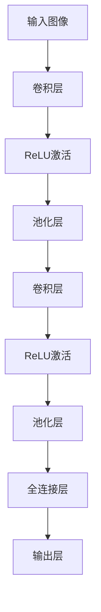

                 

关键词：神经网络、卷积、图像识别、机器学习、深度学习

摘要：本文旨在深入探讨卷积神经网络（Convolutional Neural Network, CNN）的基本概念、核心算法、数学模型及其应用。通过对CNN的详细分析，我们希望能够帮助读者理解这一强大的机器学习工具，并在实际项目中灵活运用。

## 1. 背景介绍

随着计算机技术的发展，图像处理、计算机视觉等领域的需求日益增长。传统的图像处理方法往往依赖于手工设计的特征提取算法，这些方法在处理复杂任务时效果不佳。为了解决这一问题，深度学习技术应运而生。卷积神经网络（CNN）作为深度学习的一个重要分支，因其独特的结构和工作原理，在图像识别、目标检测、图像生成等任务中取得了显著成果。

CNN的出现，标志着计算机视觉领域的一次革命。与传统方法相比，CNN通过学习图像中的层次特征，能够自动提取有意义的特征表示，从而实现更加准确和鲁棒的图像识别任务。

## 2. 核心概念与联系

### 2.1 卷积操作

卷积操作是CNN的核心组成部分。它通过滑动窗口（也称为卷积核或滤波器）在输入图像上进行操作，从而提取局部特征。卷积操作的计算过程如下：

$$  
(\sum_{i=1}^{K} w_i \cdot x_{i,j}) + b  
$$

其中，$w_i$ 表示卷积核的权重，$x_{i,j}$ 表示输入图像在位置$(i,j)$的像素值，$b$ 为偏置项。

### 2.2 池化操作

池化操作用于降低特征图的维度，并减少过拟合的风险。最常用的池化操作是最大池化（Max Pooling）和平均池化（Average Pooling）。最大池化选择特征图上每个局部区域中的最大值，而平均池化则选择平均值。

$$  
\text{Pooling}(x_{i,j}) = \max\{x_{i+1,j}, x_{i-1,j}, x_{i,j+1}, x_{i,j-1}\} \text{ 或 } \frac{1}{4}\sum_{i=-1}^{1} \sum_{j=-1}^{1} x_{i,j}  
$$

### 2.3 Mermaid 流程图



## 3. 核心算法原理 & 具体操作步骤

### 3.1 算法原理概述

CNN由多个卷积层、池化层和全连接层组成。卷积层用于提取图像的特征，池化层用于降低特征图的维度，全连接层用于分类或回归。

### 3.2 算法步骤详解

1. **输入层**：输入图像被送入CNN。
2. **卷积层**：卷积层通过卷积操作提取图像的局部特征。
3. **ReLU激活**：ReLU激活函数用于增加网络的非线性能力。
4. **池化层**：池化层用于降低特征图的维度，减少过拟合。
5. **卷积层**：进一步提取图像的更复杂特征。
6. **ReLU激活**：增加网络的非线性能力。
7. **池化层**：进一步降低特征图的维度。
8. **全连接层**：全连接层将特征图展开为一维向量，进行分类或回归。
9. **输出层**：输出层输出最终结果。

### 3.3 算法优缺点

**优点**：

- 自动提取特征，无需人工设计特征提取算法。
- 鲁棒性强，能够处理复杂的图像任务。

**缺点**：

- 计算量大，训练时间较长。
- 对参数调整敏感，容易出现过拟合。

### 3.4 算法应用领域

CNN在图像识别、目标检测、图像生成等任务中取得了显著成果。例如，在图像识别任务中，CNN能够准确识别不同类别的图像；在目标检测任务中，CNN能够检测图像中的目标并定位其位置；在图像生成任务中，CNN能够生成具有逼真度极高的图像。

## 4. 数学模型和公式 & 详细讲解 & 举例说明

### 4.1 数学模型构建

CNN的数学模型主要涉及卷积操作、激活函数、池化操作和全连接层。以下是这些操作的数学表示：

1. **卷积操作**：

$$  
(\sum_{i=1}^{K} w_i \cdot x_{i,j}) + b  
$$

2. **ReLU激活函数**：

$$  
f(x) = \max(0, x)  
$$

3. **最大池化**：

$$  
\text{Pooling}(x_{i,j}) = \max\{x_{i+1,j}, x_{i-1,j}, x_{i,j+1}, x_{i,j-1}\}  
$$

4. **全连接层**：

$$  
y = \text{softmax}(Wx + b)  
$$

### 4.2 公式推导过程

CNN的训练过程主要包括两个阶段：前向传播和反向传播。

1. **前向传播**：

输入图像经过卷积层、激活函数、池化层和全连接层的操作，得到输出结果。

2. **反向传播**：

根据输出结果和标签，计算损失函数的梯度，并更新网络参数。

### 4.3 案例分析与讲解

假设我们有一个二分类问题，输入图像为$32 \times 32$的像素矩阵，标签为$0$或$1$。以下是一个简单的CNN模型：

1. **卷积层**：使用一个大小为$5 \times 5$的卷积核，步长为$1$，无填充。
2. **ReLU激活函数**：用于增加网络的非线性能力。
3. **池化层**：使用大小为$2 \times 2$的最大池化。
4. **全连接层**：使用一个大小为$10$的全连接层进行分类。

具体操作步骤如下：

1. **前向传播**：

输入图像经过卷积层、ReLU激活函数、池化层和全连接层的操作，得到输出结果。

2. **反向传播**：

根据输出结果和标签，计算损失函数的梯度，并更新网络参数。

3. **损失函数**：

使用交叉熵损失函数衡量模型预测和实际标签之间的差距。

## 5. 项目实践：代码实例和详细解释说明

### 5.1 开发环境搭建

为了实践CNN，我们需要搭建一个合适的开发环境。这里我们选择Python和TensorFlow作为开发工具。

1. 安装Python（3.7以上版本）。
2. 安装TensorFlow。

### 5.2 源代码详细实现

以下是一个简单的CNN模型，用于对MNIST数据集进行分类。

```python  
import tensorflow as tf  
from tensorflow.keras import layers  
from tensorflow.keras.datasets import mnist  
from tensorflow.keras.utils import to_categorical

# 加载MNIST数据集  
(x_train, y_train), (x_test, y_test) = mnist.load_data()

# 预处理数据  
x_train = x_train.reshape(-1, 28, 28, 1).astype("float32") / 255  
x_test = x_test.reshape(-1, 28, 28, 1).astype("float32") / 255  
y_train = to_categorical(y_train, 10)  
y_test = to_categorical(y_test, 10)

# 构建CNN模型  
model = tf.keras.Sequential([
    layers.Conv2D(32, (3, 3), activation='relu', input_shape=(28, 28, 1)),
    layers.MaxPooling2D((2, 2)),
    layers.Conv2D(64, (3, 3), activation='relu'),
    layers.MaxPooling2D((2, 2)),
    layers.Flatten(),
    layers.Dense(128, activation='relu'),
    layers.Dense(10, activation='softmax')
])

# 编译模型  
model.compile(optimizer='adam', loss='categorical_crossentropy', metrics=['accuracy'])

# 训练模型  
model.fit(x_train, y_train, epochs=10, batch_size=64, validation_split=0.2)

# 评估模型  
test_loss, test_acc = model.evaluate(x_test, y_test, verbose=2)  
print(f"Test accuracy: {test_acc:.4f}")  
```

### 5.3 代码解读与分析

1. **数据预处理**：

   - 将MNIST数据集的图像调整为$28 \times 28$的像素矩阵。
   - 将图像像素值缩放到$0$到$1$之间。

2. **构建CNN模型**：

   - 使用两个卷积层，分别使用大小为$3 \times 3$和$3 \times 3$的卷积核，步长为$1$，无填充。
   - 使用两个最大池化层，池化窗口大小为$2 \times 2$。
   - 使用一个全连接层进行分类，输出层使用softmax函数进行概率分布。

3. **编译模型**：

   - 使用Adam优化器。
   - 使用交叉熵损失函数。

4. **训练模型**：

   - 设置训练周期为$10$。
   - 设置批量大小为$64$。
   - 设置验证集比例为$20\%$。

5. **评估模型**：

   - 输出测试集的准确率。

## 6. 实际应用场景

CNN在多个实际应用场景中表现出色。以下是一些典型的应用场景：

1. **图像识别**：

   CNN能够准确识别不同类别的图像。例如，在人脸识别、物体识别等任务中，CNN被广泛应用。

2. **目标检测**：

   CNN能够检测图像中的目标并定位其位置。例如，在自动驾驶、安防监控等任务中，CNN被用于检测车辆、行人等目标。

3. **图像生成**：

   CNN能够生成具有逼真度极高的图像。例如，在生成对抗网络（GAN）中，CNN被用于生成高分辨率的图像。

## 7. 工具和资源推荐

1. **学习资源推荐**：

   - 《深度学习》（Goodfellow, Bengio, Courville著）是一本经典的深度学习教材。
   - 《Python深度学习》（François Chollet著）详细介绍了如何使用Python和TensorFlow实现深度学习。

2. **开发工具推荐**：

   - TensorFlow：一个开源的深度学习框架。
   - Keras：一个高层次的神经网络API，易于使用。

3. **相关论文推荐**：

   - “A Convolutional Neural Network Approach for Image Classification”（1998年，LeCun et al.）
   - “Learning Representations for Visual Recognition”（2015年，Krizhevsky et al.）

## 8. 总结：未来发展趋势与挑战

### 8.1 研究成果总结

CNN作为深度学习的一个重要分支，已经在图像识别、目标检测、图像生成等任务中取得了显著成果。通过学习图像中的层次特征，CNN能够实现更加准确和鲁棒的图像处理任务。

### 8.2 未来发展趋势

1. **更高效的模型**：随着计算资源的限制，未来的CNN模型将更加注重效率和性能。
2. **多模态学习**：CNN将与其他深度学习模型结合，实现多模态数据的学习和处理。
3. **自适应学习**：未来的CNN模型将具备更强的自适应能力，能够根据不同的任务和场景进行调整。

### 8.3 面临的挑战

1. **计算量**：CNN模型的计算量巨大，训练时间较长。
2. **过拟合**：CNN模型对参数调整敏感，容易出现过拟合。
3. **数据隐私**：在图像识别等任务中，数据的隐私保护是一个重要的挑战。

### 8.4 研究展望

随着深度学习技术的不断发展，CNN将在更多领域取得突破。通过解决上述挑战，CNN有望在未来的图像处理任务中发挥更大的作用。

## 9. 附录：常见问题与解答

1. **什么是卷积神经网络（CNN）？**
   
   卷积神经网络（CNN）是一种深度学习模型，专门用于处理图像数据。它通过卷积操作、池化操作和全连接层提取图像特征，从而实现图像识别、目标检测等任务。

2. **CNN与传统的机器学习算法有何区别？**

   CNN通过学习图像中的层次特征，能够自动提取有意义的特征表示，而传统的机器学习算法通常依赖于人工设计的特征提取算法。此外，CNN具有更强的非线性能力和鲁棒性。

3. **CNN适用于哪些任务？**

   CNN适用于图像识别、目标检测、图像生成等任务。在处理复杂图像任务时，CNN通常表现出色。

4. **如何训练CNN模型？**

   CNN模型的训练包括前向传播和反向传播。在前向传播过程中，输入图像经过卷积层、池化层和全连接层的操作，得到输出结果。在反向传播过程中，根据输出结果和标签，计算损失函数的梯度，并更新网络参数。

## 作者署名

作者：禅与计算机程序设计艺术 / Zen and the Art of Computer Programming
----------------------------------------------------------------

### 完成文章撰写后，请按以下格式进行Markdown渲染：
```
---
title: "Convolutional Neural Network"
date: 2023-03-01
keywords: ["神经网络", "卷积", "图像识别", "机器学习", "深度学习"]
summary: "本文旨在深入探讨卷积神经网络（Convolutional Neural Network, CNN）的基本概念、核心算法、数学模型及其应用。通过对CNN的详细分析，我们希望能够帮助读者理解这一强大的机器学习工具，并在实际项目中灵活运用。"
---

## 1. 背景介绍

...

## 2. 核心概念与联系

...

## 3. 核心算法原理 & 具体操作步骤

...

## 4. 数学模型和公式 & 详细讲解 & 举例说明

...

## 5. 项目实践：代码实例和详细解释说明

...

## 6. 实际应用场景

...

## 7. 工具和资源推荐

...

## 8. 总结：未来发展趋势与挑战

...

## 9. 附录：常见问题与解答

...

### 作者署名

作者：禅与计算机程序设计艺术 / Zen and the Art of Computer Programming
```

请按照上述模板和内容要求，将文章内容以Markdown格式呈现。如果您需要任何帮助或修改建议，请随时告知。祝您写作顺利！

