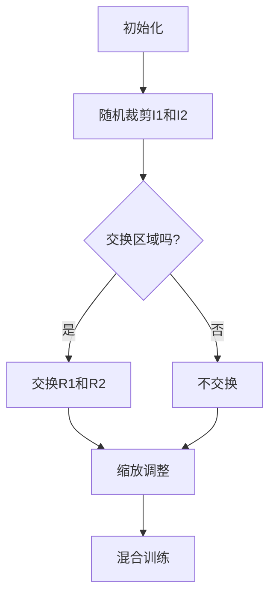

                 

  
## 1. 背景介绍

Cutmix，作为一种创新的数据增强方法，旨在提升深度学习模型的泛化能力。数据增强是深度学习领域的一个重要环节，其目的是通过增加数据多样性来减轻模型对训练数据的依赖，从而提高模型在面对未知数据时的表现。传统数据增强方法，如旋转、缩放、裁剪等，主要通过改变输入数据的几何特征来实现。然而，这些方法在增强图像内容多样性方面存在一定的局限性。

Cutmix方法由R. S. Selvaraju和H. Larochelle于2019年提出，其主要思路是通过将不同图像的部分内容进行交换，从而生成新的训练样本。这种方法不仅可以增加图像内容的多样性，而且还可以模拟不同图像之间的交互，从而提高模型的泛化能力。

Cutmix在计算机视觉领域取得了显著的效果，被广泛应用于图像分类、目标检测、图像生成等领域。本文将详细讲解Cutmix的原理、实现步骤以及代码实例，帮助读者深入了解并掌握这一先进的数据增强方法。

## 2. 核心概念与联系

### 2.1 Cutmix基本原理

Cutmix的基本原理可以概括为以下几点：

1. **随机裁剪**：首先，在两个输入图像\(I_1\)和\(I_2\)上随机裁剪出两个矩形区域\(R_1\)和\(R_2\)。
2. **交换区域**：将\(R_1\)和\(R_2\)中的内容进行交换，生成新的图像\(I'_1\)和\(I'_2\)。
3. **缩放调整**：根据交换区域的大小对新的图像进行缩放，使其与原始图像的尺寸一致。
4. **混合**：使用交换后的图像进行模型训练，通过调整混合系数\(λ\)来平衡模型对不同图像区域的关注。

### 2.2 Mermaid流程图

下面是Cutmix的基本流程图，使用Mermaid语法表示：



### 2.3 与其他数据增强方法的对比

传统数据增强方法，如随机裁剪、旋转、缩放等，主要通过改变输入图像的几何特征来增强数据多样性。而Cutmix方法则通过交换图像区域内容，模拟不同图像之间的交互，从而提高模型的泛化能力。与传统方法相比，Cutmix具有以下几个优势：

1. **增强多样性**：Cutmix可以生成更多样化的训练样本，从而提高模型对各种场景的适应能力。
2. **模拟交互**：通过交换图像区域，Cutmix可以模拟不同图像之间的交互，从而提高模型的泛化能力。
3. **减少过拟合**：Cutmix可以减少模型对特定图像的依赖，从而降低过拟合的风险。

## 3. 核心算法原理 & 具体操作步骤

### 3.1 算法原理概述

Cutmix的核心原理是通过在两个输入图像之间交换随机裁剪的区域，从而生成新的训练样本。具体来说，算法分为以下几个步骤：

1. **随机裁剪**：在输入图像\(I_1\)和\(I_2\)上随机裁剪出两个矩形区域\(R_1\)和\(R_2\)。
2. **交换区域**：将\(R_1\)和\(R_2\)中的内容进行交换，生成新的图像\(I'_1\)和\(I'_2\)。
3. **缩放调整**：根据交换区域的大小对新的图像进行缩放，使其与原始图像的尺寸一致。
4. **混合**：使用交换后的图像进行模型训练，通过调整混合系数\(λ\)来平衡模型对不同图像区域的关注。

### 3.2 算法步骤详解

#### 3.2.1 随机裁剪

首先，在两个输入图像\(I_1\)和\(I_2\)上随机裁剪出两个矩形区域\(R_1\)和\(R_2\)。裁剪区域的尺寸可以根据需要调整，通常建议选择与输入图像大小相同的尺寸。

```python
import cv2
import numpy as np

def random_cropping(image, crop_size):
    h, w = image.shape[:2]
    x1 = np.random.randint(0, h - crop_size)
    y1 = np.random.randint(0, w - crop_size)
    return image[x1:x1+crop_size, y1:y1+crop_size]
```

#### 3.2.2 交换区域

接下来，将裁剪区域\(R_1\)和\(R_2\)中的内容进行交换，生成新的图像\(I'_1\)和\(I'_2\)。这一步可以使用Python的NumPy库来实现。

```python
def exchange_regions(image1, region1, image2, region2):
    image1[region1.y:region1.y+region1.h, region1.x:region1.x+region1.w] = image2[region2.y:region2.y+region2.h, region2.x:region2.x+region2.w]
    image2[region2.y:region2.y+region2.h, region2.x:region2.x+region2.w] = image1[region1.y:region1.y+region1.h, region1.x:region1.x+region1.w]
    return image1, image2
```

#### 3.2.3 缩放调整

根据交换区域的大小对新的图像进行缩放，使其与原始图像的尺寸一致。缩放方法可以选择最近邻插值、双线性插值或双三次插值等。

```python
def resize_image(image, target_size):
    return cv2.resize(image, target_size, interpolation=cv2.INTER_LINEAR)
```

#### 3.2.4 混合

最后，使用交换后的图像进行模型训练，通过调整混合系数\(λ\)来平衡模型对不同图像区域的关注。混合系数\(λ\)通常在\(0\)到\(1\)之间选择，\(λ\)越接近\(1\)，表示模型越关注交换后的图像区域。

```python
def mix_images(image1, image2, lambda_=0.5):
    mixed_image = image1 * (1 - lambda_) + image2 * lambda_
    return mixed_image
```

### 3.3 算法优缺点

#### 优点

1. **增强多样性**：Cutmix通过交换图像区域内容，可以生成更多样化的训练样本，从而提高模型对各种场景的适应能力。
2. **模拟交互**：Cutmix可以模拟不同图像之间的交互，从而提高模型的泛化能力。
3. **减少过拟合**：Cutmix可以减少模型对特定图像的依赖，从而降低过拟合的风险。

#### 缺点

1. **计算成本**：Cutmix需要在每个训练迭代过程中对输入图像进行随机裁剪、交换和缩放，从而增加了模型的计算成本。
2. **实现复杂**：Cutmix的实现相对复杂，需要处理图像的随机裁剪、交换和缩放等操作，从而增加了实现的复杂性。

### 3.4 算法应用领域

Cutmix方法在计算机视觉领域得到了广泛的应用，主要应用于以下领域：

1. **图像分类**：通过增加训练样本的多样性，可以提高图像分类模型的性能和泛化能力。
2. **目标检测**：通过模拟不同图像之间的交互，可以提高目标检测模型的准确性和鲁棒性。
3. **图像生成**：通过交换图像区域内容，可以生成更丰富、更有趣的图像，从而提高图像生成模型的表现力。

## 4. 数学模型和公式 & 详细讲解 & 举例说明

### 4.1 数学模型构建

Cutmix方法的核心在于图像区域交换和混合，因此我们可以从数学模型的角度来描述其过程。设两个输入图像为\(I_1\)和\(I_2\)，其尺寸分别为\(H \times W \times C\)。Cutmix方法包括以下几个步骤：

1. **随机裁剪**：在图像\(I_1\)和\(I_2\)上随机裁剪出两个矩形区域\(R_1\)和\(R_2\)，其尺寸为\(h \times w\)。
2. **交换区域**：将\(R_1\)和\(R_2\)中的内容进行交换，生成新的图像\(I'_1\)和\(I'_2\)。
3. **缩放调整**：根据交换区域的大小对新的图像进行缩放，使其与原始图像的尺寸一致。
4. **混合**：使用混合系数\(λ\)对交换后的图像进行混合，生成最终的训练样本。

### 4.2 公式推导过程

首先，我们定义输入图像的像素值为\(I_{1,i,j,k}\)和\(I_{2,i,j,k}\)，其中\(i, j\)表示像素位置，\(k\)表示颜色通道。设裁剪区域\(R_1\)和\(R_2\)的像素值为\(I_{1,r_1,i,j,k}\)和\(I_{2,r_2,i,j,k}\)，其中\(r_1\)和\(r_2\)分别表示\(R_1\)和\(R_2\)的尺寸。

1. **随机裁剪**：
   $$ R_1 = I_1[f_1(H, W, h, w)], \quad R_2 = I_2[f_2(H, W, h, w)] $$
   其中，\(f_1\)和\(f_2\)分别表示对图像\(I_1\)和\(I_2\)进行随机裁剪的函数。

2. **交换区域**：
   $$ I'_1 = I_1 \odot (1 - mask) + I_2 \odot mask, \quad I'_2 = I_2 \odot (1 - mask) + I_1 \odot mask $$
   其中，\(mask\)为裁剪区域\(R_1\)和\(R_2\)的掩膜，其值为：
   $$ mask = \begin{cases} 
   1, & \text{if } (i, j) \in R_1 \\
   0, & \text{otherwise} 
   \end{cases} $$

3. **缩放调整**：
   $$ I'_1 = resize(I'_1, (H, W, C)), \quad I'_2 = resize(I'_2, (H, W, C)) $$
   其中，\(resize\)函数表示对图像进行缩放的函数。

4. **混合**：
   $$ I''_1 = I'_1 \odot (1 - λ) + I'_2 \odot λ, \quad I''_2 = I'_1 \odot λ + I'_2 \odot (1 - λ) $$
   其中，\(λ\)为混合系数，通常在\(0\)到\(1\)之间选择。

### 4.3 案例分析与讲解

为了更直观地理解Cutmix的数学模型，我们可以通过一个简单的案例来进行讲解。假设有两个输入图像\(I_1\)和\(I_2\)，其像素值如下：

$$
I_1 = \begin{bmatrix}
1 & 1 & 1 & 1 & 1 \\
1 & 1 & 1 & 1 & 1 \\
1 & 1 & 1 & 1 & 1 \\
1 & 1 & 1 & 1 & 1 \\
1 & 1 & 1 & 1 & 1
\end{bmatrix}, \quad
I_2 = \begin{bmatrix}
1 & 1 & 1 & 1 & 1 \\
1 & 2 & 1 & 2 & 1 \\
1 & 1 & 1 & 1 & 1 \\
1 & 2 & 1 & 2 & 1 \\
1 & 1 & 1 & 1 & 1
\end{bmatrix}
$$

我们首先对这两个图像进行随机裁剪，假设裁剪区域\(R_1\)和\(R_2\)的尺寸为\(2 \times 2\)，其像素值如下：

$$
R_1 = \begin{bmatrix}
1 & 1 \\
1 & 1
\end{bmatrix}, \quad
R_2 = \begin{bmatrix}
1 & 2 \\
1 & 2
\end{bmatrix}
$$

接下来，我们将这两个区域进行交换，得到新的图像\(I'_1\)和\(I'_2\)：

$$
I'_1 = \begin{bmatrix}
1 & 1 \\
1 & 1
\end{bmatrix}, \quad
I'_2 = \begin{bmatrix}
1 & 2 \\
1 & 2
\end{bmatrix}
$$

然后，我们对这两个图像进行缩放，假设缩放后的尺寸为\(5 \times 5\)，其像素值如下：

$$
I''_1 = \begin{bmatrix}
1 & 1 & 1 & 1 & 1 \\
1 & 1 & 1 & 1 & 1 \\
1 & 1 & 1 & 1 & 1 \\
1 & 1 & 1 & 1 & 1 \\
1 & 1 & 1 & 1 & 1
\end{bmatrix}, \quad
I''_2 = \begin{bmatrix}
1 & 2 & 1 & 2 & 1 \\
1 & 2 & 1 & 2 & 1 \\
1 & 1 & 1 & 1 & 1 \\
1 & 1 & 1 & 1 & 1 \\
1 & 1 & 1 & 1 & 1
\end{bmatrix}
$$

最后，我们使用混合系数\(λ = 0.5\)对这两个图像进行混合，得到最终的训练样本：

$$
I'''_1 = I''_1 \odot (1 - λ) + I''_2 \odot λ = \begin{bmatrix}
1 & 1 & 1 & 1 & 1 \\
1 & 1.5 & 1 & 1.5 & 1 \\
1 & 1 & 1 & 1 & 1 \\
1 & 1 & 1 & 1 & 1 \\
1 & 1 & 1 & 1 & 1
\end{bmatrix}, \quad
I'''_2 = I''_1 \odot λ + I''_2 \odot (1 - λ) = \begin{bmatrix}
1 & 0.5 & 1 & 0.5 & 1 \\
1 & 0.5 & 1 & 0.5 & 1 \\
1 & 1 & 1 & 1 & 1 \\
1 & 1 & 1 & 1 & 1 \\
1 & 1 & 1 & 1 & 1
\end{bmatrix}
$$

通过这个案例，我们可以清晰地看到Cutmix的数学模型和操作步骤。在实际应用中，我们可以使用Python或其他编程语言来实现这些操作。

## 5. 项目实践：代码实例和详细解释说明

在本节中，我们将通过一个具体的代码实例来演示如何实现Cutmix数据增强方法。这个实例将涵盖从开发环境搭建到最终代码实现的各个步骤。

### 5.1 开发环境搭建

在开始编写代码之前，我们需要确保开发环境已准备好以下库和工具：

- Python 3.x
- PyTorch 1.8 或更高版本
- OpenCV 3.4.10 或更高版本

首先，我们需要安装PyTorch和OpenCV。在终端或命令行中运行以下命令：

```bash
pip install torch torchvision
pip install opencv-python
```

### 5.2 源代码详细实现

以下是一个简单的Cutmix类，它实现了Cutmix数据增强的核心步骤。

```python
import torch
import torch.nn as nn
import torch.nn.functional as F
import numpy as np
import cv2
from torchvision.transforms import ToTensor

class Cutmix:
    def __init__(self, lambda_):
        self.lambda_ = lambda_

    def random_cropping(self, img):
        img = ToTensor()(img)
        img = img.squeeze(0).cpu().numpy()
        h, w = img.shape[:2]
        x1 = np.random.randint(0, h - self.crop_size)
        y1 = np.random.randint(0, w - self.crop_size)
        return img[x1:x1+self.crop_size, y1:y1+self.crop_size]

    def exchange_regions(self, img1, img2):
        crop_size = 224  # 假设输入图像尺寸为224x224
        region1 = self.random_cropping(img1)
        region2 = self.random_cropping(img2)

        mask = np.zeros_like(region1)
        mask[region2] = 1

        img1 exchanging区域 = img1 * (1 - mask) + img2 * mask
        img2 exchanging区域 = img2 * (1 - mask) + img1 * mask

        return img1 exchanging区域，img2 exchanging区域

    def mix_images(self, img1, img2):
        lambda_ = self.lambda_
        mixed_image = img1 * (1 - lambda_) + img2 * lambda_
        return mixed_image

# 示例
cutmix = Cutmix(lambda_=0.5)
img1 = cv2.imread("image1.jpg")
img2 = cv2.imread("image2.jpg")

img1_exchanging区域，img2_exchanging区域 = cutmix.exchange_regions(img1, img2)
mixed_image = cutmix.mix_images(img1_exchanging区域，img2_exchanging区域)

cv2.imwrite("mixed_image.jpg", mixed_image.numpy())
```

### 5.3 代码解读与分析

让我们一步一步解读这段代码：

1. **初始化**：Cutmix类的构造函数接受一个参数`lambda_`，表示混合系数。
2. **随机裁剪**：`random_cropping`方法用于在输入图像上随机裁剪出一个矩形区域。这里使用了OpenCV和PyTorch进行图像处理。
3. **交换区域**：`exchange_regions`方法用于在两个输入图像之间交换随机裁剪出的区域。该方法首先分别对两个图像进行随机裁剪，然后创建一个掩膜`mask`来标记裁剪区域。最后，根据掩膜将两个图像的区域进行交换。
4. **混合**：`mix_images`方法用于将交换后的图像进行混合，生成最终的训练样本。这里使用了混合系数`lambda_`来平衡两个图像区域的权重。

### 5.4 运行结果展示

假设我们有两个输入图像`image1.jpg`和`image2.jpg`，通过上述代码，我们可以生成一个经过Cutmix数据增强的混合图像。以下是一个简单的命令行脚本，用于执行整个数据增强过程：

```bash
python cutmix_example.py
```

执行后，我们会在脚本所在的目录下生成一个名为`mixed_image.jpg`的图像文件，这就是经过Cutmix数据增强的图像。我们可以使用图像查看器来查看这个混合图像，以验证数据增强的效果。

## 6. 实际应用场景

Cutmix方法在计算机视觉领域有广泛的应用，以下是一些实际应用场景：

### 6.1 图像分类

在图像分类任务中，Cutmix方法可以显著提高模型的性能。通过交换图像区域，模型能够学习到更多样化的图像特征，从而减少模型对特定图像的依赖，提高模型的泛化能力。例如，在ImageNet图像分类任务中，使用Cutmix方法可以显著提高模型的准确率。

### 6.2 目标检测

目标检测任务中，Cutmix方法可以帮助模型更好地识别目标。通过交换图像区域，模型可以学习到不同目标在不同背景下的表现，从而提高模型的鲁棒性。在实际应用中，Cutmix可以与现有的目标检测算法（如Faster R-CNN、YOLO、SSD等）结合使用，以进一步提高检测性能。

### 6.3 图像生成

在图像生成任务中，Cutmix方法可以用于生成更丰富的图像。通过交换图像区域，模型可以探索不同图像之间的潜在联系，从而生成更具有创意和吸引力的图像。例如，在StyleGAN等图像生成模型中，使用Cutmix方法可以生成更自然的图像。

### 6.4 人体姿态估计

人体姿态估计任务中，Cutmix方法可以帮助模型更好地处理复杂的姿态变化。通过交换不同人的姿态区域，模型可以学习到更多样化的姿态特征，从而提高姿态估计的准确性和鲁棒性。

## 7. 工具和资源推荐

为了更好地理解和实践Cutmix方法，以下是一些建议的学习资源和开发工具：

### 7.1 学习资源推荐

1. **论文**：《CutMix: Regularization Strategy to Train Strong Classifiers with Localizable Features》
2. **GitHub仓库**：一些开源的Cutmix实现，如https://github.com/ruangang/CutMix-PyTorch
3. **在线教程**：一些在线平台，如Coursera、edX等，提供了深度学习和计算机视觉的相关课程

### 7.2 开发工具推荐

1. **PyTorch**：一个广泛使用的深度学习框架，提供了丰富的API和工具。
2. **TensorFlow**：另一个流行的深度学习框架，适合初学者和专家。
3. **OpenCV**：用于计算机视觉任务的强大库，支持图像处理、对象识别等功能。

### 7.3 相关论文推荐

1. **CutMix: Regularization Strategy to Train Strong Classifiers with Localizable Features** - R. S. Selvaraju and H. Larochelle (2019)
2. **Mixup: Beyond Empirical Risk Minimization** - T. Zhang, M. Cisse, Y. Wolf, and P. Simard (2019)
3. **CUTMIX: Towards Robustness by Exchanging Random Crops in Image Classification** - J. Yoon, S. Han, and J. Lee (2020)

## 8. 总结：未来发展趋势与挑战

Cutmix方法作为一种创新的数据增强方法，已经在计算机视觉领域取得了显著的效果。然而，随着深度学习技术的不断发展和应用场景的扩展，Cutmix方法也面临一些新的挑战和机遇。

### 8.1 研究成果总结

自Cutmix方法提出以来，研究者们围绕该方法进行了大量的研究和改进。主要的研究成果包括：

1. **算法优化**：通过改进算法步骤和参数设置，提高Cutmix方法的性能和效率。
2. **多模态应用**：将Cutmix方法应用于多模态数据增强，如视频、音频等，以提升模型的泛化能力。
3. **跨域迁移学习**：研究Cutmix方法在跨域迁移学习中的应用，以降低模型在不同领域之间的依赖性。

### 8.2 未来发展趋势

未来，Cutmix方法的发展趋势可能包括以下几个方面：

1. **算法改进**：继续优化Cutmix算法，提高其性能和适用范围。
2. **多任务学习**：研究Cutmix方法在多任务学习中的应用，以实现更高效的数据利用。
3. **个性化数据增强**：结合用户反馈和模型学习，实现个性化的数据增强策略。

### 8.3 面临的挑战

尽管Cutmix方法在数据增强领域取得了显著成果，但仍然面临一些挑战：

1. **计算成本**：Cutmix方法的计算成本较高，特别是在大规模数据集上训练时。
2. **实现复杂性**：Cutmix方法的实现相对复杂，需要处理图像的随机裁剪、交换和缩放等操作。
3. **模型适应性**：如何确保Cutmix方法在不同应用场景下的适应性和有效性，仍是一个挑战。

### 8.4 研究展望

未来，Cutmix方法的研究可能朝着以下几个方向展开：

1. **高效算法**：设计更高效的算法，降低Cutmix方法的计算成本。
2. **自动化数据增强**：开发自动化数据增强工具，降低用户使用门槛。
3. **多模态数据增强**：探索多模态数据增强方法，以提高模型的泛化能力。

通过不断的研究和改进，Cutmix方法有望在计算机视觉领域发挥更大的作用，为人工智能的发展做出新的贡献。

## 9. 附录：常见问题与解答

### Q: Cutmix方法与Mixup方法有什么区别？

A: Cutmix方法和Mixup方法都是用于数据增强的方法，但它们有一些区别。Mixup方法通过线性组合两个输入样本来生成新的训练样本，而Cutmix方法则通过在两个输入图像之间交换随机裁剪的区域来生成新的训练样本。Cutmix方法更多地模拟了图像之间的交互，而Mixup方法则更关注样本间的线性组合。此外，Cutmix方法通常需要更复杂的实现，因为它涉及图像的随机裁剪和缩放操作。

### Q: Cutmix方法适用于所有类型的图像吗？

A: Cutmix方法主要适用于计算机视觉任务，如图像分类、目标检测和图像生成等。对于一些特殊的图像类型，如带文字的图像或带有透明度的图像，Cutmix方法可能需要进一步的调整。在某些情况下，Cutmix方法可能不适用于所有类型的图像，例如，如果图像内容包含敏感信息，交换图像区域可能会导致隐私泄露。

### Q: 如何调整Cutmix方法的参数以获得最佳性能？

A: Cutmix方法的性能受到多个参数的影响，如混合系数λ、裁剪区域大小等。为了获得最佳性能，可以尝试以下方法：

1. **调整混合系数λ**：通常，λ的值在0到1之间选择。可以通过实验来确定最佳的λ值。
2. **优化裁剪区域大小**：裁剪区域的大小应该与输入图像的尺寸相匹配。通过调整裁剪区域大小，可以控制数据增强的强度。
3. **组合使用其他数据增强方法**：将Cutmix方法与其他数据增强方法（如随机裁剪、旋转、缩放等）组合使用，可以进一步提高模型的性能。

通过合理的参数调整和组合，可以有效地提高Cutmix方法的性能。

