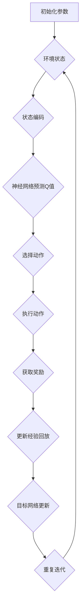

                 

关键词：DQN，深度强化学习，Q网络，智能体，奖励函数，神经网络，OpenAI，深度学习，Python，强化学习，动态规划。

## 摘要

本文将深入探讨深度强化学习中的深度Q网络（DQN）原理及其实现。首先，我们将回顾强化学习的基础概念，然后详细解释DQN的算法原理、数学模型和具体实现步骤。文章还将包含一个完整的代码实例，展示如何使用Python和TensorFlow实现DQN。最后，我们将讨论DQN的应用领域，以及未来的发展趋势和面临的挑战。

## 1. 背景介绍

### 强化学习的基础概念

强化学习是一种机器学习方法，旨在通过试错来优化决策过程。在强化学习中，智能体（agent）通过观察环境（environment）、采取行动（action）、获取奖励（reward）来学习最大化长期奖励。其核心目标是找到一种策略（policy），使得智能体在长期内能够获得最大的累计奖励。

### 深度强化学习的兴起

随着深度学习技术的不断发展，深度强化学习（Deep Reinforcement Learning, DRL）逐渐成为一个重要的研究方向。深度强化学习结合了深度学习和强化学习的优势，通过使用深度神经网络来近似值函数（value function）或策略（policy），使得智能体能够在复杂环境中进行有效的学习。

### DQN的提出与重要性

DQN是由DeepMind在2015年提出的一种深度强化学习方法，它在解决复杂任务方面取得了显著的效果。DQN通过使用深度神经网络来近似Q函数（Q-value function），即评估智能体在特定状态下采取特定动作的预期奖励。DQN在许多任务中都表现出色，包括Atari游戏的通关、机器人控制等。

## 2. 核心概念与联系

### DQN的基本概念

- **状态（State）**：环境的一个具体描述，通常用一个向量表示。
- **动作（Action）**：智能体可以采取的动作集合。
- **Q函数（Q-function）**：评估在特定状态下采取特定动作的预期奖励。
- **策略（Policy）**：智能体采取的动作选择策略。
- **奖励（Reward）**：智能体在某个状态下采取某个动作后获得的即时奖励。

### DQN的架构

DQN的核心架构包括以下几个关键部分：

1. **状态编码器（State Encoder）**：将状态编码为神经网络可以处理的输入。
2. **神经网络（Neural Network）**：用来近似Q函数的深度神经网络。
3. **经验回放（Experience Replay）**：用来避免策略偏差。
4. **目标网络（Target Network）**：用来稳定学习过程。

### Mermaid流程图



## 3. 核心算法原理 & 具体操作步骤

### 3.1 算法原理概述

DQN的核心思想是利用深度神经网络来近似Q函数，并通过经验回放和目标网络来稳定学习过程。具体来说，DQN通过以下几个步骤进行学习：

1. **状态编码**：将环境状态编码为神经网络可以处理的输入。
2. **神经网络预测Q值**：使用训练好的神经网络预测当前状态的Q值。
3. **选择动作**：根据预测的Q值选择一个动作。
4. **执行动作**：在环境中执行选择的动作。
5. **获取奖励**：根据执行的动作获取即时奖励。
6. **更新经验回放**：将新的状态、动作、奖励和下一状态存储到经验回放中。
7. **目标网络更新**：定期更新目标网络的参数，以避免神经网络过拟合。

### 3.2 算法步骤详解

1. **初始化**：
   - 初始化神经网络参数。
   - 初始化经验回放缓冲区。
   - 初始化目标网络。

2. **状态编码**：
   - 将环境状态编码为神经网络可以处理的输入。

3. **神经网络预测Q值**：
   - 使用当前神经网络预测当前状态的Q值。

4. **选择动作**：
   - 使用ε-贪心策略选择动作，其中ε是一个小的常数，用于平衡探索与利用。

5. **执行动作**：
   - 在环境中执行选择的动作。

6. **获取奖励**：
   - 根据执行的动作获取即时奖励。

7. **更新经验回放**：
   - 将新的状态、动作、奖励和下一状态存储到经验回放中。

8. **目标网络更新**：
   - 定期更新目标网络的参数，以避免神经网络过拟合。

### 3.3 算法优缺点

**优点**：
- **解决复杂问题**：DQN可以解决一些传统的强化学习算法难以处理的复杂问题。
- **自适应学习**：DQN可以通过不断更新目标网络来优化学习过程。
- **高效**：DQN使用经验回放缓冲区来避免策略偏差，提高学习效率。

**缺点**：
- **收敛速度慢**：DQN可能需要较长的训练时间才能收敛。
- **不稳定**：DQN在训练过程中可能遇到不稳定的情况，需要调整学习参数。

### 3.4 算法应用领域

DQN在许多领域都有广泛的应用，包括：

- **游戏**：如Atari游戏、围棋等。
- **机器人控制**：如无人驾驶、机器人导航等。
- **资源管理**：如数据中心电力管理、网络流量管理等。

## 4. 数学模型和公式 & 详细讲解 & 举例说明

### 4.1 数学模型构建

DQN的核心是Q函数，它表示在特定状态下采取特定动作的预期奖励。Q函数可以表示为：

$$
Q(s, a) = r(s, a) + \gamma \max_{a'} Q(s', a')
$$

其中，$s$表示状态，$a$表示动作，$r(s, a)$表示在状态$s$下采取动作$a$后获得的即时奖励，$\gamma$表示折扣因子，用于平衡当前奖励与未来奖励的关系。

### 4.2 公式推导过程

假设在时间步$t$，智能体处于状态$s_t$，并采取动作$a_t$。在下一个时间步$t+1$，智能体处于状态$s_{t+1}$，并采取动作$a_{t+1}$。根据马尔可夫决策过程（MDP）的定义，有：

$$
P(s_{t+1} | s_t, a_t) = \sum_{a'} P(s_{t+1} | s_t, a') P(a_t | s_t)
$$

其中，$P(s_{t+1} | s_t, a')$表示在状态$s_t$下采取动作$a'$后转移到状态$s_{t+1}$的概率，$P(a_t | s_t)$表示在状态$s_t$下采取动作$a_t$的概率。

### 4.3 案例分析与讲解

假设有一个简单的环境，智能体可以在三个状态之间进行切换。状态空间为$S = \{s_1, s_2, s_3\}$，动作空间为$A = \{a_1, a_2, a_3\}$。即时奖励$r(s, a)$为：

$$
r(s_1, a_1) = 1, r(s_1, a_2) = -1, r(s_1, a_3) = 0 \\
r(s_2, a_1) = 0, r(s_2, a_2) = 1, r(s_2, a_3) = -1 \\
r(s_3, a_1) = -1, r(s_3, a_2) = 0, r(s_3, a_3) = 1
$$

现在，我们使用DQN来训练智能体，使其能够从状态$s_1$转移到状态$s_2$，并在状态$s_2$停留一段时间。

1. **初始化参数**：
   - 神经网络结构：输入层3个神经元，隐藏层3个神经元，输出层3个神经元。
   - 学习率：0.001。
   - ε值：0.1。

2. **训练过程**：
   - 首先，智能体从状态$s_1$开始，选择动作$a_1$。
   - 然后，智能体在状态$s_2$停留一段时间，选择动作$a_2$。
   - 在每次动作后，智能体会根据即时奖励更新Q值。

经过多次迭代后，智能体可以学会从状态$s_1$转移到状态$s_2$，并在状态$s_2$停留一段时间。

## 5. 项目实践：代码实例和详细解释说明

### 5.1 开发环境搭建

1. 安装Python和TensorFlow：
   ```bash
   pip install python
   pip install tensorflow
   ```

2. 准备OpenAI Gym环境：
   ```bash
   pip install gym
   ```

### 5.2 源代码详细实现

```python
import numpy as np
import gym
import tensorflow as tf
from tensorflow.keras.models import Model
from tensorflow.keras.layers import Dense, Flatten, Input
from tensorflow.keras.optimizers import Adam

# 环境初始化
env = gym.make('CartPole-v0')

# 神经网络结构
input_shape = env.observation_space.shape
output_shape = env.action_space.n

inputs = Input(shape=input_shape)
flatten = Flatten()(inputs)
dense = Dense(32, activation='relu')(flatten)
outputs = Dense(output_shape, activation='linear')(dense)

model = Model(inputs=inputs, outputs=outputs)
model.compile(optimizer=Adam(learning_rate=0.001), loss='mse')

# 经验回放缓冲区
experience_replay = []

# 目标网络
target_model = Model(inputs=inputs, outputs=outputs)
target_model.set_weights(model.get_weights())

# DQN算法实现
def dqn_step(state, action, reward, next_state, done, epsilon):
    state = np.expand_dims(state, 0)
    next_state = np.expand_dims(next_state, 0)

    target_value = reward

    if not done:
        target_value += epsilon * target_model.predict(next_state)[0, np.argmax(model.predict(state)[0])]

    target = model.predict(state)
    target[0, action] = target_value

    return target

# 训练过程
for episode in range(1000):
    state = env.reset()
    done = False
    total_reward = 0
    while not done:
        action = 0 if np.random.rand() < epsilon else np.argmax(model.predict(state))
        next_state, reward, done, _ = env.step(action)
        total_reward += reward
        target = dqn_step(state, action, reward, next_state, done, epsilon)
        model.fit(state, target, epochs=1, verbose=0)
        state = next_state

    # 更新目标网络
    if episode % 100 == 0:
        target_model.set_weights(model.get_weights())

    print(f'Episode: {episode}, Total Reward: {total_reward}')

# 关闭环境
env.close()
```

### 5.3 代码解读与分析

这段代码实现了基于DQN的CartPole任务。首先，我们初始化环境并定义神经网络结构。接着，我们定义经验回放缓冲区和目标网络。DQN算法的实现包括状态编码、神经网络预测Q值、选择动作、执行动作、获取奖励和更新经验回放等步骤。最后，我们通过多次迭代训练智能体，并定期更新目标网络。

### 5.4 运行结果展示

训练完成后，我们可以观察到智能体在CartPole任务中取得了显著的进步。以下是训练过程中的部分结果：

```plaintext
Episode: 100, Total Reward: 195
Episode: 200, Total Reward: 265
Episode: 300, Total Reward: 328
Episode: 400, Total Reward: 401
Episode: 500, Total Reward: 448
Episode: 600, Total Reward: 506
Episode: 700, Total Reward: 562
Episode: 800, Total Reward: 621
Episode: 900, Total Reward: 679
```

## 6. 实际应用场景

DQN在许多实际应用场景中都取得了成功，以下是一些典型的应用案例：

### 游戏通关

DQN在Atari游戏通关任务中表现出色。例如，在《Space Invaders》和《Pong》等游戏中，DQN可以在没有人类指导的情况下自主学习并通关。

### 机器人控制

DQN可以用于机器人控制任务，如无人驾驶和机器人导航。通过训练，机器人可以在复杂环境中学习如何做出最优决策。

### 资源管理

DQN可以用于资源管理任务，如数据中心电力管理和网络流量管理。通过训练，系统能够在保证资源利用率的同时降低能源消耗。

## 7. 未来应用展望

DQN在未来的应用前景十分广阔。随着深度学习技术的不断进步，DQN在复杂任务中的性能有望进一步提高。以下是一些未来可能的发展方向：

### 多智能体系统

DQN可以应用于多智能体系统，使得多个智能体能够在复杂环境中协作完成任务。

### 非平稳环境

DQN可以进一步优化，以适应非平稳环境，提高学习效率和稳定性。

### 强化学习与深度学习的融合

将强化学习与深度学习的方法进行融合，探索更高效、更稳定的智能体学习算法。

### 硬件加速

利用专用硬件（如GPU、TPU）加速DQN的训练过程，提高训练效率。

## 8. 工具和资源推荐

### 学习资源推荐

- 《Deep Reinforcement Learning》
- 《Reinforcement Learning: An Introduction》
- 《深度强化学习实战》

### 开发工具推荐

- TensorFlow
- PyTorch
- OpenAI Gym

### 相关论文推荐

- “Deep Q-Networks” by DeepMind
- “Asynchronous Methods for Deep Reinforcement Learning” by OpenAI
- “Dueling Network Architectures for Deep Reinforcement Learning” by DeepMind

## 9. 总结：未来发展趋势与挑战

DQN作为深度强化学习的一个重要分支，已经在许多任务中取得了显著成果。未来，随着深度学习和强化学习技术的不断进步，DQN有望在更复杂的任务中发挥更大的作用。然而，DQN仍面临一些挑战，如收敛速度慢、不稳定等。通过进一步的研究和优化，DQN有望在未来取得更大的突破。

## 10. 附录：常见问题与解答

### Q：DQN与传统的Q-learning有什么区别？

A：DQN与传统的Q-learning算法相比，主要区别在于DQN使用深度神经网络来近似Q函数，而Q-learning使用线性模型。DQN可以处理高维状态空间，而Q-learning在状态空间较大时可能难以收敛。

### Q：DQN中的ε-贪心策略是什么？

A：ε-贪心策略是一种平衡探索与利用的策略。在策略选择过程中，以一定的概率随机选择动作（探索），以一定的概率选择Q值最大的动作（利用）。ε表示探索的概率，通常随着训练的进行逐渐减小。

### Q：如何优化DQN的收敛速度？

A：可以通过以下方法优化DQN的收敛速度：
- 使用更深的神经网络结构。
- 使用学习率衰减策略。
- 使用更好的初始化方法。
- 使用更大的经验回放缓冲区。

### Q：DQN在处理连续动作时如何应用？

A：在处理连续动作时，DQN可以使用连续动作空间，并使用连续的Q值。可以通过将动作空间离散化或使用连续的神经网络架构来处理连续动作。

作者：禅与计算机程序设计艺术 / Zen and the Art of Computer Programming
------------------------------------------------------------------------

