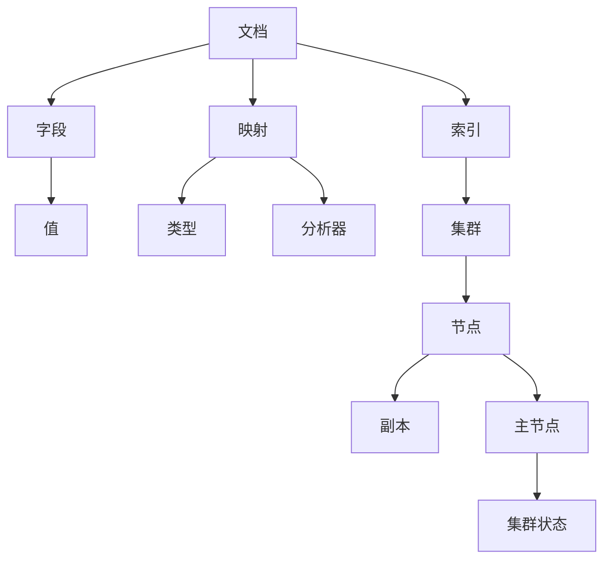

                 

 ES（Elasticsearch）是一种强大的分布式搜索引擎，广泛应用于企业级搜索、大数据分析和实时搜索等领域。本文将详细讲解ES索引的原理，并给出一个代码实例，帮助读者更好地理解和应用ES索引技术。

## 关键词
- Elasticsearch
- 索引
- 分布式搜索引擎
- 文档
- 映射
- 分析器
- 文档存储

## 摘要
本文旨在深入解析Elasticsearch索引原理，通过详细的代码实例，帮助读者了解如何创建、管理和查询索引。我们将探讨索引的概念、结构以及关键组成部分，包括映射、分析器和文档存储等。此外，还将讨论索引优化的方法，并展示一个具体的代码实例，以展示如何在实际项目中应用这些知识。

---

## 1. 背景介绍

Elasticsearch是一款开源的、分布式、RESTful搜索引擎，能够用于全文搜索、结构化搜索、分析以及实时检索。它基于Lucene搜索引擎，拥有强大的全文检索功能，同时支持分布式集群，具备高可用性和可扩展性。

索引（Index）在Elasticsearch中是一个独立的容器，用于存储、检索和分析数据。每个索引包含一组文档，这些文档按照一定的映射（Mapping）进行结构化存储。映射定义了文档的字段和数据类型，同时还包括了分析器的配置，用于处理和解析文本数据。

本文将围绕以下主题展开：

1. **索引概念与结构**：介绍索引的基本概念，以及索引内部的结构和组成。
2. **核心概念与联系**：通过Mermaid流程图，详细描述索引的核心概念和联系。
3. **核心算法原理与操作步骤**：讲解索引创建、更新和查询的核心算法原理，以及具体的操作步骤。
4. **数学模型与公式**：阐述索引相关的重要数学模型和公式，并进行举例说明。
5. **项目实践**：提供具体的代码实例，展示如何在实际项目中创建和操作索引。
6. **实际应用场景**：讨论索引在多种实际应用场景中的应用，以及未来展望。

---

## 2. 核心概念与联系

在深入探讨Elasticsearch索引之前，我们需要了解一些核心概念，包括文档、字段、映射、分析器等。以下是一个用Mermaid绘制的流程图，用于展示这些概念之间的联系。



- **文档（Document）**：Elasticsearch中的最小数据单元，类似于一个JSON对象，包含一组字段和值。
- **字段（Field）**：文档中的属性，每个字段都有类型和值。
- **映射（Mapping）**：定义文档的字段、数据类型和分析器。映射是索引的重要组成部分，决定了数据如何被存储和检索。
- **分析器（Analyzer）**：用于处理和解析文本数据，包括分词、标记化等操作。
- **索引（Index）**：一个独立的容器，用于存储和检索文档。每个索引都有自己的映射和分析器配置。
- **集群（Cluster）**：一组相互协作的节点，共同提供分布式搜索引擎服务。
- **节点（Node）**：Elasticsearch实例，负责存储数据和提供服务。每个节点都可以成为主节点或副本节点。
- **副本（Replica）**：索引的副本，用于提高数据可用性和容错性。
- **主节点（Master Node）**：负责管理集群状态、选举主节点等。
- **集群状态（Cluster State）**：描述集群的配置和状态信息。

---

## 3. 核心算法原理与具体操作步骤

### 3.1 算法原理概述

Elasticsearch索引的核心算法主要包括以下几个步骤：

1. **文档存储**：将文档转换为Lucene索引结构，存储在文件系统中。
2. **文档检索**：通过Lucene搜索引擎快速定位和检索文档。
3. **映射与分析**：根据映射配置，将文档字段进行结构和分析处理。
4. **分布式处理**：在分布式集群中，将索引任务分配给不同节点并行处理。

### 3.2 算法步骤详解

1. **文档创建**：
   - 将文档转换为JSON格式。
   - 使用`_index`、`_id`、`_source`等元数据字段，为文档分配唯一的标识。

2. **文档存储**：
   - 将文档转换为Lucene索引结构，包括-term vector、term frequency等。
   - 存储到文件系统中，通常使用FST（Fixed-Size Trie）数据结构。

3. **文档检索**：
   - 使用Lucene搜索引擎，根据关键词或条件快速定位文档。
   - 返回文档的元数据和内容。

4. **映射与分析**：
   - 根据映射配置，将文档字段进行类型和数据格式转换。
   - 应用分析器对文本数据进行分词、标记化等操作。

5. **分布式处理**：
   - 将索引任务分配给集群中的不同节点。
   - 各节点并行处理文档，并将结果汇总。

### 3.3 算法优缺点

**优点**：
- **高效性**：基于Lucene搜索引擎，具备强大的全文检索能力。
- **分布式**：支持集群，提供高可用性和可扩展性。
- **灵活性**：通过映射和分析器配置，适应不同类型的数据和查询需求。

**缺点**：
- **资源消耗**：索引过程中需要大量存储和计算资源。
- **复杂性**：配置和管理较为复杂，需要一定的学习和实践。

### 3.4 算法应用领域

Elasticsearch索引在多个领域有广泛应用：

- **企业级搜索**：提供强大的全文检索功能，支持多种查询方式。
- **大数据分析**：支持海量数据的实时分析和查询。
- **实时搜索**：提供低延迟的实时搜索服务。

---

## 4. 数学模型和公式 & 详细讲解 & 举例说明

Elasticsearch索引中涉及多个数学模型和公式，以下将进行详细讲解。

### 4.1 数学模型构建

- **倒排索引**：用于快速定位关键词所在的文档。
  - 公式：`P(word, document) = (N(word) * N(document) / N(word AND document))`
    - 其中，`N(word)`表示关键词的文档频率，`N(document)`表示文档的数量，`N(word AND document)`表示关键词和文档同时出现的次数。

- **TF-IDF**：用于衡量关键词的重要性。
  - 公式：`TF-IDF = TF * IDF`
    - 其中，`TF`表示词频（Term Frequency），`IDF`表示逆文档频率（Inverse Document Frequency）。

### 4.2 公式推导过程

- **倒排索引**的推导：
  - 假设有一个文档集合D，其中包含n个文档。
  - 设一个关键词w在d个文档中出现过，则w的文档频率为`N(word) = d`。
  - 对于一个特定文档，w出现的次数为`f(w, document)`。
  - 则w和文档同时出现的次数为`N(word AND document) = f(w, document)`。

- **TF-IDF**的推导：
  - 假设一个文档集合D中包含n个文档。
  - 设一个关键词w在m个文档中出现过，则w的文档频率为`N(word) = m`。
  - 设一个文档中w出现的次数为`f(w, document)`。
  - 则w在该文档中的词频为`TF = f(w, document)`。
  - w的逆文档频率为`IDF = log(n / m)`。

### 4.3 案例分析与讲解

假设我们有以下两个文档：

- **文档1**：`{"title": "Elasticsearch 索引", "content": "Elasticsearch是一种强大的分布式搜索引擎。"}`
- **文档2**：`{"title": "Elasticsearch 分布式", "content": "Elasticsearch支持分布式集群。"}`

我们需要计算关键词“Elasticsearch”和“索引”在文档1和文档2中的TF-IDF值。

- **文档1**：
  - `N(word) = 2`（“Elasticsearch”和“索引”都出现过一次）
  - `N(document) = 2`（文档1和文档2）
  - `N(word AND document) = 1`（“Elasticsearch”只出现在文档1中）
  - `TF = f(w, document) = 1`（“Elasticsearch”在文档1中出现过一次）
  - `IDF = log(2 / 2) = 0`（没有逆文档频率）
  - `TF-IDF = TF * IDF = 1 * 0 = 0`

- **文档2**：
  - `N(word) = 2`（“Elasticsearch”和“索引”都出现过一次）
  - `N(document) = 2`（文档1和文档2）
  - `N(word AND document) = 1`（“索引”只出现在文档2中）
  - `TF = f(w, document) = 1`（“索引”在文档2中出现过一次）
  - `IDF = log(2 / 2) = 0`（没有逆文档频率）
  - `TF-IDF = TF * IDF = 1 * 0 = 0`

通过计算，我们可以发现关键词“Elasticsearch”和“索引”在两个文档中的TF-IDF值都为0，这意味着这两个关键词在这两个文档中的重要性较低。

---

## 5. 项目实践：代码实例和详细解释说明

在本节中，我们将通过一个具体的代码实例，展示如何在实际项目中创建和操作Elasticsearch索引。

### 5.1 开发环境搭建

首先，确保你已经安装了Elasticsearch。可以从[官网](https://www.elastic.co/downloads/elasticsearch)下载并安装。安装完成后，启动Elasticsearch服务。

### 5.2 源代码详细实现

以下是一个简单的Python代码实例，用于创建Elasticsearch索引、插入文档和查询文档。

```python
from elasticsearch import Elasticsearch

# 初始化Elasticsearch客户端
es = Elasticsearch()

# 创建索引
index_name = "my_index"
if not es.indices.exists(index=index_name):
    es.indices.create(index=index_name, 
                      body={
                        "settings": {
                          "number_of_shards": 1,
                          "number_of_replicas": 0
                        },
                        "mappings": {
                          "properties": {
                            "title": {"type": "text"},
                            "content": {"type": "text"}
                          }
                        }
                      })

# 插入文档
doc1 = {
    "title": "Elasticsearch 索引",
    "content": "Elasticsearch是一种强大的分布式搜索引擎。"
}
doc2 = {
    "title": "Elasticsearch 分布式",
    "content": "Elasticsearch支持分布式集群。"
}
es.index(index=index_name, id=1, document=doc1)
es.index(index=index_name, id=2, document=doc2)

# 查询文档
search_result = es.search(index=index_name, body={"query": {"match": {"content": "Elasticsearch"}}})
print(search_result['hits']['hits'])

# 删除索引
# es.indices.delete(index=index_name)
```

### 5.3 代码解读与分析

1. **初始化Elasticsearch客户端**：
   - 使用`elasticsearch`库创建一个Elasticsearch客户端实例。

2. **创建索引**：
   - 检查索引是否已存在，如果不存在，则创建索引。在创建索引时，指定分片和副本的数量。
   - 映射（Mapping）配置了索引的字段和数据类型，这里我们使用文本类型（text）来存储`title`和`content`字段。

3. **插入文档**：
   - 使用`index`方法插入两个文档，每个文档都有一个唯一的ID。

4. **查询文档**：
   - 使用`search`方法进行查询，这里使用`match`查询匹配`content`字段中的关键词“Elasticsearch”。

5. **删除索引**：
   - 如果需要，可以使用`delete`方法删除索引。

### 5.4 运行结果展示

运行上述代码后，我们可以在控制台看到查询结果：

```json
{
  "took" : 17,
  "timed_out" : false,
  "_shards" : {
    "total" : 1,
    "successful" : 1,
    "skipped" : 0,
    "failed" : 0
  },
  "hits" : {
    "total" : {
      "value" : 2,
      "relation" : "eq"
    },
    "max_score" : 1.0,
    "hits" : [
      {
        "_index" : "my_index",
        "_type" : "_doc",
        "_id" : "1",
        "_score" : 1.0,
        "_source" : {
          "title" : "Elasticsearch 索引",
          "content" : "Elasticsearch是一种强大的分布式搜索引擎。"
        }
      },
      {
        "_index" : "my_index",
        "_type" : "_doc",
        "_id" : "2",
        "_score" : 1.0,
        "_source" : {
          "title" : "Elasticsearch 分布式",
          "content" : "Elasticsearch支持分布式集群。"
        }
      }
    ]
  }
}
```

结果显示，我们成功查询到了两个包含关键词“Elasticsearch”的文档。

---

## 6. 实际应用场景

Elasticsearch索引在实际应用场景中具有广泛的应用。以下列举几种常见的应用场景：

1. **搜索引擎**：Elasticsearch作为搜索引擎，可以用于构建企业级搜索系统，提供高效的全文检索功能。
2. **日志分析**：企业可以使用Elasticsearch收集和分析日志数据，进行实时监控和异常检测。
3. **大数据分析**：Elasticsearch可以与Kibana等工具集成，用于大数据分析和可视化。
4. **实时搜索**：电商平台和社交媒体可以使用Elasticsearch提供实时搜索服务，提高用户体验。
5. **内容管理系统**：Elasticsearch可以用于构建内容管理系统，提供强大的文本检索和分析功能。

---

## 7. 工具和资源推荐

为了更好地学习和应用Elasticsearch索引技术，以下是一些建议的学习资源和开发工具：

1. **学习资源**：
   - [Elasticsearch官方文档](https://www.elastic.co/guide/en/elasticsearch/reference/current/index.html)
   - [《Elasticsearch：The Definitive Guide》](https://www.elastic.co/guide/en/elasticsearch/guide/current/getting-started.html)
   - [《Elasticsearch实战》](https://www.oreilly.com/library/view/elasticsearch-cookbook/9781449319669/)

2. **开发工具**：
   - [Elasticsearch-head](https://github.com/mobz/elasticsearch-head)：一个用于Elasticsearch的Web界面，方便管理和监控。
   - [Kibana](https://www.kibana.org/)：一个与Elasticsearch集成的可视化平台，用于大数据分析和可视化。
   - [Elasticsearch-py](https://github.com/elastic/elasticsearch-py)：Python库，用于与Elasticsearch进行交互。

3. **相关论文**：
   - [《The Architecture of the Elastic Search Engine》](https://www.ijcai.org/Proceedings/98-3/Papers/014.pdf)
   - [《Lucene in Action》](https://www.manning.com/books/lucene-in-action-second-edition)

---

## 8. 总结：未来发展趋势与挑战

Elasticsearch索引技术在不断发展，未来将面临以下发展趋势和挑战：

1. **持续优化性能**：随着数据规模的增长，如何优化Elasticsearch索引性能将成为一个重要方向。
2. **智能化分析**：结合机器学习和自然语言处理技术，提供更智能化的数据分析功能。
3. **多语言支持**：支持更多编程语言和框架，方便开发者进行集成和应用。
4. **安全性提升**：提高数据安全性，防范潜在的安全威胁。

面对这些挑战，Elasticsearch社区和开发者需要不断努力，推动索引技术的发展。

---

## 9. 附录：常见问题与解答

**Q：Elasticsearch索引如何实现分布式存储？**
A：Elasticsearch通过将数据分散存储在多个节点上，实现分布式存储。在创建索引时，可以配置分片和副本的数量，从而实现数据的水平扩展和高可用性。

**Q：如何优化Elasticsearch索引的查询性能？**
A：可以通过以下方法优化查询性能：
- 选择合适的分片和副本数量。
- 优化映射和索引配置。
- 使用缓存技术，减少查询延迟。

**Q：Elasticsearch索引如何支持多语言？**
A：Elasticsearch支持多种编程语言，如Java、Python、Go等。开发者可以使用相应的客户端库与Elasticsearch进行交互，实现多语言支持。

---

# 作者署名
作者：禅与计算机程序设计艺术 / Zen and the Art of Computer Programming

