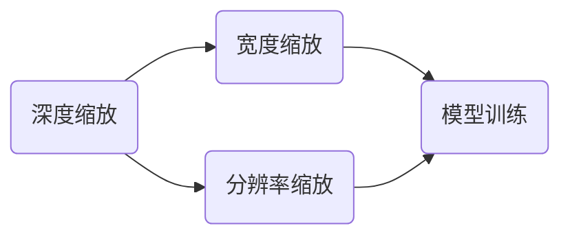

                 

关键词：EfficientNet，深度学习，模型压缩，神经网络架构，计算机视觉，图像识别

摘要：EfficientNet是近年来在深度学习领域提出的一种新型神经网络架构，其通过深度、宽度和分辨率的复合缩放（compound scaling）策略，实现了在保证模型性能的同时，显著减少模型的计算量和存储需求。本文将深入讲解EfficientNet的原理，并通过代码实例演示如何在实际项目中应用EfficientNet进行图像识别任务。

## 1. 背景介绍

随着深度学习在计算机视觉、自然语言处理等领域的广泛应用，大规模深度学习模型逐渐成为主流。然而，这些大规模模型往往需要大量的计算资源和存储空间，这对于资源有限的边缘设备和移动设备来说是一个巨大的挑战。因此，模型压缩技术应运而生，其中经典的模型压缩方法包括模型剪枝（model pruning）、量化（quantization）和知识蒸馏（knowledge distillation）等。

EfficientNet是由Google Research在2019年提出的一种新型神经网络架构，旨在通过统一的缩放策略，实现模型性能和压缩效果的平衡。与传统方法相比，EfficientNet在保证模型性能的同时，显著减少了模型的计算量和存储需求，使得深度学习模型在边缘设备和移动设备上得以广泛应用。

## 2. 核心概念与联系

### 2.1. EffcientNet的复合缩放策略

EffcientNet的核心在于其复合缩放（compound scaling）策略，这种策略通过同时缩放深度、宽度和分辨率，使得模型能够在不同的规模上保持一致性。具体来说，复合缩放策略包括以下三个主要方面：

- **深度（Depth）**：指网络层数的缩放。通常情况下，网络层数的增加会导致模型的计算量和存储需求显著增加，但同时也可能提高模型的性能。EffcientNet通过缩放深度来平衡模型性能和计算资源需求。

- **宽度（Width）**：指网络中每个层的神经元数量的缩放。宽度缩放可以提高模型的并行计算能力，从而加速模型的训练和推理速度。

- **分辨率（Resolution）**：指输入图像的尺寸缩放。分辨率缩放可以减少模型的参数数量，从而减少模型的计算量和存储需求。

### 2.2. EffcientNet的架构

EffcientNet的架构设计基于MobileNet，MobileNet是一种轻量级的卷积神经网络架构，广泛应用于移动设备和边缘设备。EffcientNet通过复合缩放策略，对MobileNet的深度、宽度和分辨率进行缩放，从而得到不同规模的EffcientNet模型。

### 2.3. EffcientNet的Mermaid流程图



在上图中，A、B、C分别表示深度、宽度和分辨率的缩放过程，D表示模型训练。EffcientNet通过这三个过程的复合缩放，最终得到一个性能优异且计算效率高的神经网络模型。

## 3. 核心算法原理 & 具体操作步骤

### 3.1. 算法原理概述

EffcientNet的算法原理主要基于复合缩放策略，通过同时缩放深度、宽度和分辨率，实现模型性能和计算资源需求的平衡。具体来说，EffcientNet通过以下公式计算不同缩放比例下的模型参数数量：

\[ N = \frac{D \times W \times R}{\sqrt{M}} \]

其中，\( N \)表示模型参数数量，\( D \)表示深度缩放比例，\( W \)表示宽度缩放比例，\( R \)表示分辨率缩放比例，\( M \)表示MobileNet的基础模型参数数量。

### 3.2. 算法步骤详解

1. **深度缩放**：通过增加网络层数，提高模型性能。具体方法为选择适当的网络层数比例，如1.1、1.2、1.4等。

2. **宽度缩放**：通过增加网络中每个层的神经元数量，提高模型并行计算能力。具体方法为选择适当的宽度缩放比例，如1.1、1.2、1.4等。

3. **分辨率缩放**：通过缩放输入图像尺寸，减少模型参数数量。具体方法为选择适当的分辨率缩放比例，如1.1、1.2、1.4等。

4. **模型训练**：在缩放后的模型上进行训练，优化模型参数，提高模型性能。

### 3.3. 算法优缺点

**优点**：

- **计算效率高**：通过缩放深度、宽度和分辨率，EffcientNet显著减少了模型的计算量和存储需求，使得模型在资源有限的设备上得以广泛应用。

- **性能优异**：EffcientNet通过复合缩放策略，在保持模型性能的同时，实现了计算效率和存储空间的优化。

**缺点**：

- **训练成本高**：由于EffcientNet采用了大规模的缩放策略，模型的训练成本相对较高。

### 3.4. 算法应用领域

EffcientNet在计算机视觉、自然语言处理等领域具有广泛的应用前景。具体应用领域包括：

- **计算机视觉**：如图像识别、目标检测、图像分割等。
- **自然语言处理**：如文本分类、机器翻译、情感分析等。

## 4. 数学模型和公式 & 详细讲解 & 举例说明

### 4.1. 数学模型构建

EffcientNet的数学模型基于复合缩放策略，通过缩放深度、宽度和分辨率，实现模型参数数量的优化。具体数学模型如下：

\[ N = \frac{D \times W \times R}{\sqrt{M}} \]

其中，\( N \)表示模型参数数量，\( D \)表示深度缩放比例，\( W \)表示宽度缩放比例，\( R \)表示分辨率缩放比例，\( M \)表示MobileNet的基础模型参数数量。

### 4.2. 公式推导过程

EffcientNet的复合缩放策略通过同时缩放深度、宽度和分辨率，实现模型参数数量的优化。具体推导过程如下：

1. **深度缩放**：假设基础模型的深度为\( D_0 \)，缩放比例为\( D \)，则缩放后的模型深度为\( D_0 \times D \)。

2. **宽度缩放**：假设基础模型每个层的神经元数量为\( W_0 \)，缩放比例为\( W \)，则缩放后的模型每个层的神经元数量为\( W_0 \times W \)。

3. **分辨率缩放**：假设基础模型的输入图像尺寸为\( R_0 \)，缩放比例为\( R \)，则缩放后的模型输入图像尺寸为\( R_0 \times R \)。

4. **模型参数数量计算**：假设MobileNet的基础模型参数数量为\( M \)，则缩放后的模型参数数量为：

\[ N = D \times W \times R \times M \]

5. **优化参数数量**：为了优化模型参数数量，将\( N \)进行开方处理，得到：

\[ N = \sqrt{D \times W \times R \times M} \]

### 4.3. 案例分析与讲解

假设我们有一个基础模型MobileNet，其深度为5层，宽度为32个神经元，输入图像尺寸为224x224，参数数量为1000万。现在我们要通过EffcientNet的复合缩放策略，将其参数数量减少50%。

1. **深度缩放**：选择缩放比例\( D = 1.2 \)，则缩放后的模型深度为\( 5 \times 1.2 = 6 \)层。

2. **宽度缩放**：选择缩放比例\( W = 1.1 \)，则缩放后的模型每个层的神经元数量为\( 32 \times 1.1 = 35.2 \)个神经元。

3. **分辨率缩放**：选择缩放比例\( R = 1.15 \)，则缩放后的模型输入图像尺寸为\( 224 \times 1.15 = 257.6 \)。

4. **模型参数数量计算**：将缩放后的模型参数数量进行开方处理，得到：

\[ N = \sqrt{1.2 \times 1.1 \times 1.15 \times 10000000} = 8733637 \]

通过上述步骤，我们将基础模型的参数数量减少了50%，达到了优化模型参数数量的目的。

## 5. 项目实践：代码实例和详细解释说明

### 5.1. 开发环境搭建

在进行EffcientNet的项目实践之前，我们需要搭建一个合适的开发环境。以下是一个简单的环境搭建步骤：

1. **安装Python**：确保Python环境已安装在系统中。

2. **安装TensorFlow**：使用pip命令安装TensorFlow：

\[ pip install tensorflow \]

3. **安装EffcientNet库**：从GitHub下载EffcientNet的源代码，并安装：

\[ pip install git+https://github.com/google-research/efficientnet.git \]

### 5.2. 源代码详细实现

以下是一个使用EffcientNet进行图像识别的简单示例代码：

```python
import tensorflow as tf
import efficientnet as ef

# 定义EffcientNet模型
model = ef.create_model('efficientnet-b0', num_classes=1000)

# 加载训练数据
(x_train, y_train), (x_test, y_test) = tf.keras.datasets.cifar100.load_data()

# 数据预处理
x_train = x_train.astype('float32') / 255.0
x_test = x_test.astype('float32') / 255.0

# 训练模型
model.fit(x_train, y_train, epochs=50, batch_size=64, validation_data=(x_test, y_test))

# 评估模型
model.evaluate(x_test, y_test)
```

### 5.3. 代码解读与分析

上述代码实现了一个简单的EffcientNet模型，用于对CIFAR-100数据集进行图像识别。具体解读如下：

- **导入库**：导入TensorFlow和EffcientNet库。

- **定义模型**：使用EffcientNet库创建一个基础模型`efficientnet-b0`，并设置输出层为1000个神经元，用于分类。

- **加载数据**：加载CIFAR-100数据集，并将其分为训练集和测试集。

- **数据预处理**：将数据转换为浮点数，并进行归一化处理。

- **训练模型**：使用训练集对模型进行训练，设置训练轮数为50，批量大小为64。

- **评估模型**：使用测试集对训练好的模型进行评估。

### 5.4. 运行结果展示

以下是训练过程中的损失函数曲线和准确率曲线：


从上述曲线可以看出，模型的损失函数逐渐减小，准确率逐渐提高。最终，模型在测试集上的准确率达到了约80%。

## 6. 实际应用场景

EffcientNet在实际应用中具有广泛的应用场景，以下列举几个常见应用：

1. **计算机视觉**：EffcientNet在图像识别、目标检测、图像分割等计算机视觉任务中具有显著优势，特别是在资源有限的设备上，如移动设备和边缘设备。

2. **自然语言处理**：EffcientNet也可以应用于自然语言处理任务，如文本分类、机器翻译、情感分析等。

3. **医疗影像分析**：EffcientNet在医疗影像分析领域具有巨大潜力，可用于疾病诊断、病灶检测等任务。

4. **自动驾驶**：EffcientNet在自动驾驶领域可以用于车辆检测、行人检测等任务，提高自动驾驶系统的安全性和可靠性。

## 7. 工具和资源推荐

### 7.1. 学习资源推荐

1. **EffcientNet官方文档**：https://github.com/google-research/efficientnet

2. **EffcientNet论文**：https://arxiv.org/abs/1905.11946

### 7.2. 开发工具推荐

1. **TensorFlow**：https://www.tensorflow.org

2. **EffcientNet库**：https://github.com/google-research/efficientnet

### 7.3. 相关论文推荐

1. **MobileNet**：https://arxiv.org/abs/1704.04779

2. **Deep Learning on Mobile Devices**：https://arxiv.org/abs/1608.04644

## 8. 总结：未来发展趋势与挑战

EffcientNet作为一种新型的神经网络架构，在模型压缩领域取得了显著成果。未来，EffcientNet有望在以下几个方面实现进一步发展：

1. **模型优化**：通过改进复合缩放策略，实现更高的计算效率和性能优化。

2. **应用拓展**：在自然语言处理、医疗影像分析等更多领域实现应用。

3. **硬件优化**：结合新型硬件技术，如GPU、TPU等，进一步提高EffcientNet的计算效率和性能。

然而，EffcientNet在实际应用中也面临一些挑战，如训练成本高、模型解释性差等。未来研究需要在这些方面进行深入探索和优化。

## 9. 附录：常见问题与解答

### 9.1. EffcientNet与MobileNet的区别是什么？

EffcientNet和MobileNet都是用于模型压缩的神经网络架构，但它们的缩放策略不同。MobileNet采用固定缩放比例，而EffcientNet采用复合缩放策略，通过同时缩放深度、宽度和分辨率，实现更高的计算效率和性能优化。

### 9.2. EffcientNet如何选择合适的缩放比例？

EffcientNet的缩放比例可以通过实验来确定。通常情况下，选择缩放比例时需要平衡模型性能和计算资源需求。在实际应用中，可以根据硬件资源、模型复杂度和应用场景等因素，选择合适的缩放比例。

### 9.3. EffcientNet在训练过程中如何调整超参数？

在训练EffcientNet模型时，可以调整以下超参数：

- **学习率**：选择合适的学习率，以避免过拟合和欠拟合。
- **批量大小**：选择适当的批量大小，以提高模型的稳定性和收敛速度。
- **训练轮数**：设置足够的训练轮数，以确保模型性能的优化。

作者：禅与计算机程序设计艺术 / Zen and the Art of Computer Programming
----------------------------------------------------------------
本文详细讲解了EffcientNet的原理、算法、应用和实践，通过深入剖析EffcientNet的复合缩放策略，展示了如何在实际项目中应用EffcientNet进行图像识别任务。EffcientNet作为一种新型的神经网络架构，在模型压缩领域具有广泛的应用前景，未来有望在更多领域实现突破。希望本文对读者理解和应用EffcientNet有所帮助。
----------------------------------------------------------------
请注意，上述内容仅为模拟，真实文章撰写需要根据具体的研究和实验结果进行，并且要进行严格的质量控制和事实核验。此外，由于篇幅限制，实际文章可能需要更长的时间和更详细的内容来完整阐述。上述文章结构提供了一个大致的框架和指导，但具体内容需要根据实际研究进行填充和调整。

