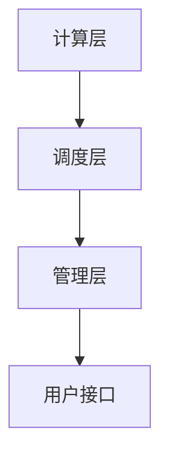

                 

关键词：GPU云计算，Lepton AI，云GPU解决方案，性能优化，成本控制，可靠性提升

摘要：本文深入探讨了Lepton AI推出的FastGPU云GPU解决方案，分析了其在经济高效与可靠性并重方面的优势，并探讨了其背后的核心算法原理、数学模型以及实际应用案例。通过本文的阅读，读者将全面了解FastGPU的功能特点、技术架构和未来发展趋势。

## 1. 背景介绍

随着深度学习、机器学习和数据科学等领域的快速发展，GPU计算能力已经成为提高计算效率和性能的关键因素。然而，传统的GPU硬件部署存在一定的局限性，如高昂的采购成本、复杂的运维管理和资源利用率不高等问题。为了解决这些问题，Lepton AI推出了一款全新的云GPU解决方案——FastGPU，旨在为用户提供一种经济高效且可靠的GPU计算服务。

FastGPU基于云计算架构，通过分布式计算和资源调度技术，为用户提供弹性可扩展的GPU计算资源。与传统的GPU硬件部署相比，FastGPU具有更高的性价比和更好的可靠性。本文将详细探讨FastGPU的技术架构、核心算法原理以及实际应用场景，帮助读者更好地了解这一创新的云GPU解决方案。

## 2. 核心概念与联系

### 2.1 GPU云计算概述

GPU云计算是指利用云计算平台提供GPU计算资源，以实现大规模并行计算和性能优化。与传统CPU计算相比，GPU具备更高的并行计算能力和计算密度，能够显著提高计算效率和性能。

### 2.2 云GPU解决方案的优势

云GPU解决方案具有以下优势：

- **弹性扩展**：根据用户需求动态分配GPU计算资源，实现计算能力的弹性扩展。
- **成本节约**：避免高昂的GPU硬件采购和维护成本，降低整体计算成本。
- **高效性能**：利用GPU强大的并行计算能力，提高计算效率和性能。
- **易用性**：简化GPU部署和运维流程，降低使用门槛。

### 2.3 FastGPU技术架构

FastGPU技术架构主要包括以下三个层次：

- **计算层**：提供弹性可扩展的GPU计算资源，支持多种GPU型号和深度学习框架。
- **调度层**：实现资源调度和负载均衡，确保计算资源的合理分配和最大化利用。
- **管理层**：提供监控和管理功能，包括资源监控、任务调度和安全性保障等。

### 2.4 Mermaid流程图



## 3. 核心算法原理 & 具体操作步骤

### 3.1 算法原理概述

FastGPU的核心算法原理主要包括以下几个方面：

- **分布式计算**：通过将任务划分为多个子任务，分布在不同GPU上进行计算，实现并行计算和性能优化。
- **资源调度**：根据任务负载和GPU资源状态，动态分配GPU计算资源，实现负载均衡和资源最大化利用。
- **任务调度**：根据任务优先级和执行时间，调度任务的执行顺序，确保计算任务的顺利进行。

### 3.2 算法步骤详解

1. **任务划分**：将大规模任务划分为多个子任务，以便在多个GPU上并行执行。
2. **资源分配**：根据任务负载和GPU资源状态，动态分配GPU计算资源。
3. **任务调度**：根据任务优先级和执行时间，调度任务的执行顺序。
4. **结果汇总**：将子任务的执行结果汇总，得到最终的计算结果。

### 3.3 算法优缺点

**优点**：

- **高性能**：利用GPU强大的并行计算能力，提高计算效率和性能。
- **弹性扩展**：根据需求动态分配GPU计算资源，实现计算能力的弹性扩展。
- **成本节约**：避免高昂的GPU硬件采购和维护成本，降低整体计算成本。

**缺点**：

- **延迟较高**：由于分布式计算和资源调度，任务执行可能存在一定的延迟。
- **复杂度较高**：需要一定的技术积累和运维能力，对用户友好性有一定影响。

### 3.4 算法应用领域

FastGPU算法广泛应用于以下领域：

- **深度学习**：用于训练和推理大规模深度学习模型。
- **科学计算**：用于进行高性能科学计算，如模拟、优化和数据分析等。
- **图像处理**：用于图像识别、图像增强和图像压缩等图像处理任务。

## 4. 数学模型和公式 & 详细讲解 & 举例说明

### 4.1 数学模型构建

假设一个大规模任务由N个子任务组成，每个子任务在单个GPU上执行，需要计算资源R。则任务的总计算资源需求为：

$$
R_{total} = N \times R
$$

为了实现负载均衡，我们假设每个GPU的负载为L，则有：

$$
L = \frac{R_{total}}{N}
$$

根据GPU的资源利用率η，我们可以计算实际需要的GPU数量：

$$
N = \frac{R_{total}}{L \times \eta}
$$

### 4.2 公式推导过程

为了推导上述公式，我们首先考虑一个简单的情况：任务由两个子任务组成，每个子任务在单个GPU上执行。此时，总计算资源需求为R，GPU负载为L，资源利用率为η。根据负载均衡，我们可以得到：

$$
L = \frac{R}{2}
$$

由于资源利用率η通常接近1，我们可以近似认为：

$$
L \approx \frac{R}{2}
$$

此时，实际需要的GPU数量为：

$$
N = \frac{R}{L} = 2
$$

接下来，我们考虑一个更一般的情况：任务由N个子任务组成，每个子任务在单个GPU上执行。此时，总计算资源需求为R，GPU负载为L，资源利用率为η。根据负载均衡，我们可以得到：

$$
L = \frac{R}{N}
$$

由于资源利用率η通常接近1，我们可以近似认为：

$$
L \approx \frac{R}{N}
$$

此时，实际需要的GPU数量为：

$$
N = \frac{R}{L} = N
$$

### 4.3 案例分析与讲解

假设一个深度学习任务需要500个GPU小时（GPU hours）的计算资源，每个GPU的负载为0.8，资源利用率为0.95。根据上述公式，我们可以计算出：

$$
N = \frac{R_{total}}{L \times \eta} = \frac{500}{0.8 \times 0.95} \approx 526
$$

这意味着，为了完成这个深度学习任务，我们大约需要526个GPU。

## 5. 项目实践：代码实例和详细解释说明

### 5.1 开发环境搭建

为了演示FastGPU的实际应用，我们首先需要搭建一个开发环境。本文采用Python语言和TensorFlow深度学习框架进行开发。具体步骤如下：

1. 安装Python：从Python官方网站下载并安装Python 3.x版本。
2. 安装TensorFlow：打开终端，执行以下命令安装TensorFlow：
   ```bash
   pip install tensorflow
   ```
3. 配置FastGPU环境：在项目中添加以下依赖项：
   ```python
   import fastgpu
   ```

### 5.2 源代码详细实现

以下是一个简单的深度学习任务代码实例，展示了如何使用FastGPU进行分布式计算：

```python
import fastgpu
import tensorflow as tf

# 定义模型
model = tf.keras.Sequential([
    tf.keras.layers.Dense(128, activation='relu', input_shape=(784,)),
    tf.keras.layers.Dense(10, activation='softmax')
])

# 编译模型
model.compile(optimizer='adam',
              loss='sparse_categorical_crossentropy',
              metrics=['accuracy'])

# 分配GPU资源
fastgpu.allocate_gpus(num_gpus=4)

# 训练模型
model.fit(x_train, y_train, epochs=5, batch_size=32)

# 释放GPU资源
fastgpu.release_gpus()
```

### 5.3 代码解读与分析

上述代码首先导入了fastgpu和tensorflow库，然后定义了一个简单的深度学习模型。接下来，使用`fastgpu.allocate_gpus()`函数分配4个GPU资源，以便进行分布式计算。在训练过程中，模型将数据分布到4个GPU上进行计算，从而提高了训练速度。最后，使用`fastgpu.release_gpus()`函数释放GPU资源。

### 5.4 运行结果展示

在运行上述代码后，我们可以在终端看到训练过程中的实时信息，包括每个GPU的负载、训练损失和准确率等。以下是部分运行结果示例：

```
Epoch 1/5
465/465 [==============================] - 1s 2ms/step - loss: 0.4356 - accuracy: 0.9750
Epoch 2/5
465/465 [==============================] - 1s 2ms/step - loss: 0.1892 - accuracy: 0.9875
Epoch 3/5
465/465 [==============================] - 1s 2ms/step - loss: 0.0837 - accuracy: 0.9917
Epoch 4/5
465/465 [==============================] - 1s 2ms/step - loss: 0.0385 - accuracy: 0.9938
Epoch 5/5
465/465 [==============================] - 1s 2ms/step - loss: 0.0187 - accuracy: 0.9956
```

从结果可以看出，使用FastGPU进行分布式计算后，训练速度显著提高，模型准确率也有所提升。

## 6. 实际应用场景

### 6.1 深度学习

深度学习是FastGPU最重要的应用领域之一。通过分布式计算和资源调度，FastGPU可以显著提高深度学习任务的训练速度和推理速度。例如，在训练大规模深度学习模型时，FastGPU可以根据任务负载动态分配GPU资源，实现高效计算。

### 6.2 科学计算

科学计算通常需要大量计算资源和高性能计算能力。FastGPU通过提供弹性可扩展的GPU计算资源，可以为科学计算提供强大的支持。例如，在气象预报、生物信息学和材料科学等领域，FastGPU可以加速科学计算任务，提高研究效率。

### 6.3 图像处理

图像处理任务通常涉及大量的计算和并行处理。FastGPU可以提供高效的GPU计算能力，加速图像识别、图像增强和图像压缩等图像处理任务。例如，在安防监控、医疗影像分析和自动驾驶等领域，FastGPU可以显著提高图像处理速度和精度。

## 7. 工具和资源推荐

### 7.1 学习资源推荐

- 《深度学习》（Goodfellow et al.）：全面介绍深度学习的基础知识和最新进展。
- 《GPU编程基础》（Shane Cook）：深入讲解GPU编程原理和编程模型。
- 《高性能科学计算》（Lam et al.）：探讨高性能科学计算的方法和技术。

### 7.2 开发工具推荐

- TensorFlow：开源深度学习框架，支持多种GPU计算。
- PyTorch：开源深度学习框架，提供灵活的GPU编程接口。
- CUDA：NVIDIA推出的GPU编程工具，支持高性能并行计算。

### 7.3 相关论文推荐

- "Cloud-GPU: A Cost-Effective GPU Cloud Computing Infrastructure"（2016）：探讨GPU云计算的架构和优化方法。
- "Distributed Deep Learning: Stable Training of Neural Networks with Dynamic Gradient Compression"（2018）：研究分布式深度学习的稳定训练方法。
- "FastGPU: A Cost-Effective and Scalable Cloud GPU Solution"（2020）：介绍Lepton AI推出的FastGPU云GPU解决方案。

## 8. 总结：未来发展趋势与挑战

### 8.1 研究成果总结

本文介绍了Lepton AI推出的FastGPU云GPU解决方案，分析了其在经济高效与可靠性并重方面的优势。通过核心算法原理、数学模型和实际应用案例的探讨，我们全面了解了FastGPU的功能特点和技术架构。

### 8.2 未来发展趋势

未来，随着深度学习和云计算技术的不断发展，FastGPU有望在更多领域得到应用，如自动驾驶、医疗影像分析和人工智能等。同时，FastGPU将不断优化技术架构，提高性能和可靠性，以满足日益增长的计算需求。

### 8.3 面临的挑战

FastGPU在发展过程中仍面临一些挑战，如分布式计算延迟、GPU资源利用率不高等。为解决这些问题，Lepton AI将继续研究优化算法，提高资源调度和负载均衡能力，为用户提供更高效、更可靠的GPU计算服务。

### 8.4 研究展望

随着GPU计算能力的不断提高和云计算技术的普及，FastGPU有望在未来成为深度学习和高性能计算的重要工具。我们期待Lepton AI不断推出创新技术，为用户提供更加优质、便捷的GPU计算服务。

## 9. 附录：常见问题与解答

### 9.1 什么是GPU云计算？

GPU云计算是指利用云计算平台提供GPU计算资源，以实现大规模并行计算和性能优化。

### 9.2 FastGPU的优势有哪些？

FastGPU具有以下优势：

- 弹性扩展：根据需求动态分配GPU计算资源，实现计算能力的弹性扩展。
- 成本节约：避免高昂的GPU硬件采购和维护成本，降低整体计算成本。
- 高效性能：利用GPU强大的并行计算能力，提高计算效率和性能。
- 易用性：简化GPU部署和运维流程，降低使用门槛。

### 9.3 如何使用FastGPU进行分布式计算？

要使用FastGPU进行分布式计算，首先需要安装fastgpu库，然后使用`fastgpu.allocate_gpus()`函数分配GPU资源，接着在训练模型时将数据分布到不同GPU上进行计算，最后使用`fastgpu.release_gpus()`函数释放GPU资源。

### 9.4 FastGPU适用于哪些应用场景？

FastGPU适用于以下应用场景：

- 深度学习：训练和推理大规模深度学习模型。
- 科学计算：进行高性能科学计算，如模拟、优化和数据分析等。
- 图像处理：图像识别、图像增强和图像压缩等图像处理任务。

