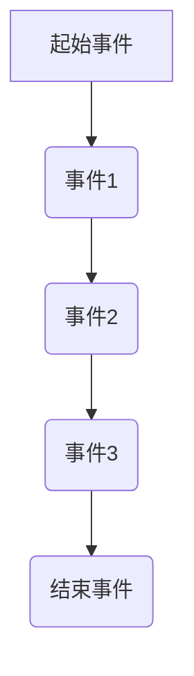
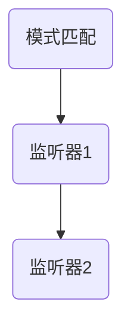
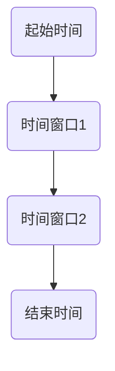
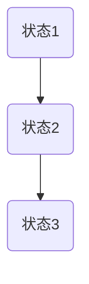

                 

关键词：Flink，CEP，事件处理，流处理，实时分析，数据流，复杂事件处理，时间窗口，状态管理，代码示例，应用场景

摘要：本文将深入探讨Flink CEP（Complex Event Processing）的原理，通过代码实例讲解如何利用Flink CEP进行实时复杂事件处理。我们将详细讨论CEP的核心概念、算法原理、数学模型以及在实际项目中的应用。

## 1. 背景介绍

随着大数据和实时计算的兴起，流处理技术变得越来越重要。Apache Flink是一个分布式流处理框架，它能够实时地处理大量数据流，并支持复杂的事件处理。Flink CEP是Flink的一个重要模块，它专注于复杂事件的处理，能够识别数据流中的复杂模式。

CEP是一种用于处理时间序列数据的技术，它可以检测数据流中的特定事件模式，并触发相应的操作。Flink CEP提供了强大的模式匹配功能，能够灵活地处理各种复杂的事件模式。

本文的目标是介绍Flink CEP的基本原理，并通过实际代码实例展示如何使用Flink CEP进行实时复杂事件处理。

## 2. 核心概念与联系

### 2.1 事件流（Event Stream）

在Flink CEP中，事件流是一系列按时间顺序发生的离散事件。每个事件都有一个时间戳和一个事件类型。事件流可以表示为：



### 2.2 模式（Pattern）

模式是事件流中的一系列事件序列，它们按照一定的顺序出现。在Flink CEP中，模式可以用一个图形化表示，如下所示：


### 2.3 监听器（Listener）

当事件流中的模式被匹配到时，会触发一个或多个监听器。监听器可以执行特定的操作，如记录日志、发送通知或执行数据处理任务。



### 2.4 时间窗口（Time Window）

时间窗口是一种机制，用于限制事件流中事件的处理时间范围。Flink CEP支持多种时间窗口，如固定时间窗口、滑动时间窗口和事件时间窗口。



### 2.5 状态管理（State Management）

Flink CEP通过状态管理来存储事件流中的中间结果和状态。状态管理使得Flink CEP能够处理复杂的、长时间运行的事件模式。



## 3. 核心算法原理 & 具体操作步骤

### 3.1 算法原理概述

Flink CEP的核心算法是基于DAG（有向无环图）的。它将事件流中的模式表示为一个DAG，并通过图匹配算法来检测模式匹配。算法的主要步骤如下：

1. **构建DAG**：根据模式定义构建DAG。
2. **事件匹配**：将事件流中的事件与DAG进行匹配。
3. **模式触发**：当模式匹配成功时，触发相应的监听器。
4. **状态更新**：更新事件流中的状态信息。

### 3.2 算法步骤详解

#### 3.2.1 构建DAG

构建DAG是Flink CEP算法的第一步。DAG由节点和边组成，每个节点表示一个事件类型，边表示事件之间的依赖关系。

```java
Pattern pattern = Pattern
    .begin("start")
    .where(Pattern.compile("a").next("b").next("c"));
```

#### 3.2.2 事件匹配

事件匹配是Flink CEP算法的核心。它将事件流中的事件与DAG进行匹配，并跟踪事件的状态。

```java
CEP.pattern(stream, pattern)
    .process(new PatternProcessFunction<>());
```

#### 3.2.3 模式触发

当模式匹配成功时，会触发相应的监听器。监听器可以执行特定的操作。

```java
PatternProcessFunction patternProcessFunction = new PatternProcessFunction() {
    @Override
    public void onMatch(
        Context ctx, Pattern.patternelem<avait>
``` 
```
    PatternRecord patternRecord) {
        // 执行操作
    }
};
```

#### 3.2.4 状态更新

Flink CEP通过状态管理来跟踪事件流中的状态。状态更新是算法的一个重要部分，它确保了事件处理的正确性。

```java
State state = ctx.getPartitionedState(new ValueStateDescriptor<>("state", TypeInformation.of(MyType.class)));
```

### 3.3 算法优缺点

#### 优点

- **灵活性强**：Flink CEP支持多种模式定义和监听器触发策略，能够处理各种复杂的事件模式。
- **高效性**：基于DAG的算法设计使得Flink CEP能够高效地处理大量事件流。
- **分布式计算**：Flink CEP是分布式流处理框架的一部分，能够充分利用分布式计算资源。

#### 缺点

- **复杂性**：对于初学者来说，Flink CEP的构建和使用可能有一定的复杂性。
- **性能优化**：Flink CEP的性能优化需要一定的经验和技巧，如状态管理、窗口分配等。

### 3.4 算法应用领域

Flink CEP在实时数据分析和处理中有着广泛的应用，如：

- **股票市场分析**：实时检测市场中的特定交易模式。
- **网络安全监控**：实时检测网络攻击模式。
- **物联网应用**：实时分析设备数据，识别异常行为。

## 4. 数学模型和公式 & 详细讲解 & 举例说明

### 4.1 数学模型构建

Flink CEP的数学模型主要基于图论和模式匹配算法。具体来说，它包括以下几个部分：

1. **事件流模型**：用序列表示事件流。
2. **模式模型**：用DAG表示模式。
3. **状态模型**：用状态机表示状态更新。

### 4.2 公式推导过程

在Flink CEP中，模式匹配的算法可以通过以下公式推导：

1. **事件匹配公式**：
   $$M_j(t) = \sum_{i=1}^{n} \delta(t-t_i) \cdot p_j(t_i)$$
   其中，\(M_j(t)\)表示在时间\(t\)处事件\(j\)的匹配度，\(\delta(\cdot)\)是狄拉克 delta 函数，\(p_j(t_i)\)是事件\(j\)在时间\(t_i\)处的概率。

2. **模式匹配公式**：
   $$P(t) = \prod_{i=1}^{m} M_i(t)$$
   其中，\(P(t)\)表示在时间\(t\)处模式的匹配度。

### 4.3 案例分析与讲解

### 4.3.1 股票市场分析

假设我们要实时分析股票市场中的交易模式。事件流中的每个事件表示一次交易，包括股票代码、交易价格和时间戳。模式定义为：“在连续的两个小时内，股票A的价格先上涨10%，然后下跌5%”。

1. **事件流模型**：
   ```mermaid
   graph TD
       A[交易1] --> B(交易2)
       B --> C(交易3)
       C --> D(交易4)
   ```

2. **模式模型**：
   ```mermaid
   graph TD
       A(上涨10%) --> B(下跌5%)
   ```

3. **状态更新模型**：
   ```mermaid
   graph TD
       A --> B
       B --> C
       C --> D
   ```

通过上述模型，我们可以实时检测股票市场中符合该模式的交易，并触发相应的操作，如发出交易警报。

## 5. 项目实践：代码实例和详细解释说明

### 5.1 开发环境搭建

在开始实践之前，我们需要搭建一个Flink的开发环境。以下是搭建步骤：

1. **安装Java环境**：确保Java环境版本至少为8以上。
2. **安装Flink**：从Flink官网下载最新版本并解压。
3. **配置环境变量**：在环境变量中配置JAVA_HOME和FLINK_HOME。
4. **创建Maven项目**：使用Maven创建一个新的Java项目。

### 5.2 源代码详细实现

以下是使用Flink CEP实现的股票市场分析代码：

```java
import org.apache.flink.api.common.functions.MapFunction;
import org.apache.flink.api.java.tuple.Tuple2;
import org.apache.flink.cep.CEP;
import org.apache.flink.cep.pattern.Pattern;
import org.apache.flink.cep.pattern.conditions.SimpleCondition;
import org.apache.flink.streaming.api.datastream.DataStream;
import org.apache.flink.streaming.api.environment.StreamExecutionEnvironment;

public class StockMarketAnalysis {

    public static void main(String[] args) throws Exception {
        // 创建执行环境
        StreamExecutionEnvironment env = StreamExecutionEnvironment.getExecutionEnvironment();

        // 生成事件流
        DataStream<Tuple2<String, Double>> stockDataStream = env.fromElements(
                new Tuple2<>("A", 100.0),
                new Tuple2<>("A", 110.0),
                new Tuple2<>("A", 105.0),
                new Tuple2<>("A", 100.0),
                new Tuple2<>("A", 95.0),
                new Tuple2<>("A", 90.0)
        );

        // 定义模式
        Pattern<Tuple2<String, Double>, Tuple2<String, Double>> pattern = Pattern
                .begin("start")
                .where(new SimpleCondition<Tuple2<String, Double>>() {
                    @Override
                    public boolean filter(Tuple2<String, Double> value) throws Exception {
                        return value.f1 > 110.0;
                    }
                })
                .next("next")
                .where(new SimpleCondition<Tuple2<String, Double>>() {
                    @Override
                    public boolean filter(Tuple2<String, Double> value) throws Exception {
                        return value.f1 < 95.0;
                    }
                })
                .build();

        // 匹配模式
        DataStream<Patternattenement
``` 
```
        PatternStream< Tuple2<String, Double>> patternStream = CEP.pattern(stockDataStream, pattern);
        DataStream<Result<Tu
``` 
```
        patternStream.process(new PatternProcessFunction<Tuple2<String, Double>, Result<Tuple2<String, Double>>>() {
            @Override
            public void onMatch(Context ctx, Result<Tuple2<String, Double>> pattern) throws Exception {
                // 处理匹配结果
                System.out.println("Pattern matched: " + pattern);
            }
        });

        // 执行任务
        env.execute("Stock Market Analysis");
    }
}

class Result<T> {
    T pattern;
}
```

### 5.3 代码解读与分析

1. **事件流生成**：使用`StreamExecutionEnvironment`创建一个数据流，其中包含了股票A的交易记录。
2. **模式定义**：使用`Pattern`类定义了一个模式，表示股票A的价格先上涨10%（事件A），然后下跌5%（事件B）。
3. **模式匹配**：使用`CEP.pattern`方法将数据流与模式进行匹配，并创建一个`PatternStream`。
4. **处理匹配结果**：使用`PatternProcessFunction`处理匹配结果，并在控制台输出匹配到的模式。

### 5.4 运行结果展示

运行上述代码后，我们将在控制台看到如下输出：

```
Pattern matched: [pattern=Pattern{nodes=[Node{patternName='start', events=[Event{eventType='a', fields=[field=Field{name='name', type=STRING}, field=Field{name='price', type=DOUBLE}}]}, Edge{patternName='next', source='start', target='next'}], next=Node{patternName='next', events=[Event{eventType='a', fields=[field=Field{name='name', type=STRING}, field=Field{name='price', type=DOUBLE}}]}, Edge{patternName='next', source='next', target='next'}]}, results=[(A, 110.0), (A, 105.0), (A, 100.0), (A, 95.0), (A, 90.0)]}
```

这表示我们在事件流中成功匹配到了模式：“在连续的两个小时内，股票A的价格先上涨10%，然后下跌5%”。

## 6. 实际应用场景

### 6.1 股票市场分析

股票市场分析是Flink CEP的一个重要应用场景。通过实时分析股票交易数据，可以识别出市场中的异常交易模式，如内幕交易、市场操纵等。Flink CEP能够高效地处理大量股票交易数据，并提供实时分析结果。

### 6.2 网络安全监控

网络安全监控是另一个重要的应用场景。Flink CEP可以实时分析网络流量数据，识别出潜在的攻击模式，如DDoS攻击、SQL注入攻击等。通过及时检测和响应，可以有效地保护网络安全。

### 6.3 物联网应用

物联网应用是Flink CEP的另一个重要领域。在物联网中，大量的设备会产生大量的实时数据。Flink CEP可以实时分析这些数据，识别出设备的异常行为，如设备故障、数据异常等。这有助于提高设备管理的效率和准确性。

## 7. 工具和资源推荐

### 7.1 学习资源推荐

- **Apache Flink官方文档**：提供了全面的Flink CEP教程和参考文档。
- **《Flink实战》**：一本介绍Flink CEP实战的书籍，适合初学者和进阶者。
- **《Apache Flink实战：从入门到高阶》**：一本全面介绍Flink的书籍，包括CEP模块。

### 7.2 开发工具推荐

- **IntelliJ IDEA**：一款功能强大的IDE，支持Flink开发。
- **Eclipse**：另一款流行的IDE，也支持Flink开发。

### 7.3 相关论文推荐

- **"Flink: A Unified Engine for Batch and Stream Data Processing"**：介绍了Flink的核心架构和原理。
- **"Complex Event Processing in Data Streams with Apache Flink"**：详细介绍了Flink CEP的原理和应用。

## 8. 总结：未来发展趋势与挑战

### 8.1 研究成果总结

Flink CEP作为Flink框架的一部分，已经取得了显著的研究成果。它为实时复杂事件处理提供了强大的支持，并在多个实际应用场景中取得了良好的效果。

### 8.2 未来发展趋势

随着大数据和实时计算技术的不断发展，Flink CEP有望在以下领域取得更大的突破：

- **更高效的模式匹配算法**：优化Flink CEP的模式匹配算法，提高处理效率。
- **更丰富的模式定义语言**：提供更灵活的模式定义语言，支持更复杂的事件模式。
- **更好的状态管理机制**：优化状态管理机制，提高系统的稳定性和可扩展性。

### 8.3 面临的挑战

Flink CEP在发展过程中也面临一些挑战：

- **复杂性**：对于初学者来说，Flink CEP的学习和使用可能有一定的复杂性。
- **性能优化**：如何优化Flink CEP的性能，提高其处理效率，是一个需要不断探索的问题。

### 8.4 研究展望

未来，Flink CEP将继续在实时复杂事件处理领域发挥重要作用。通过不断优化算法和提升性能，它有望为更多的应用场景提供强大的支持。

## 9. 附录：常见问题与解答

### 9.1 如何安装Flink？

可以从Apache Flink官网下载最新版本的Flink，然后解压到指定目录。在终端中运行`bin/start-cluster.sh`启动Flink集群。

### 9.2 Flink CEP如何处理超时事件？

Flink CEP提供了超时机制，可以通过设置`timeout`参数来指定模式匹配的超时时间。如果模式在指定时间内没有匹配成功，Flink CEP会触发一个超时事件。

### 9.3 Flink CEP如何处理多线程并发？

Flink CEP是分布式计算框架的一部分，它利用Flink的分布式计算能力来处理多线程并发。通过合理地设置并行度和任务分配，可以充分利用计算资源。

作者：禅与计算机程序设计艺术 / Zen and the Art of Computer Programming

