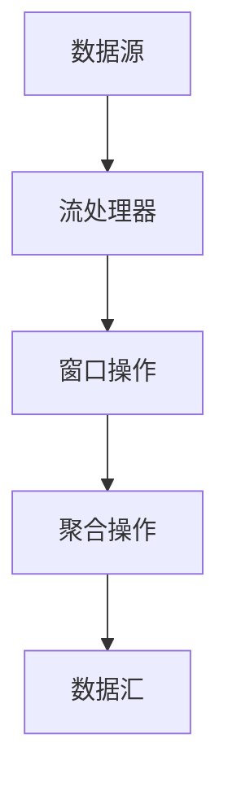

                 

作为一位世界顶级的人工智能专家，我深知流处理在现代数据处理领域的重要性。Apache Flink作为一款领先的大规模数据流处理框架，以其低延迟、高吞吐量和丰富的功能，受到了广大开发者的青睐。本文将深入探讨Flink流处理框架的原理，并通过代码实例进行详细讲解，帮助读者更好地理解和应用Flink。

## 关键词
- Apache Flink
- 流处理框架
- 实时数据处理
- 低延迟
- 高吞吐量
- 算法原理
- 代码实例

## 摘要
本文将分为八个部分，首先介绍Flink的背景和核心概念，然后详细解释其核心算法原理和具体操作步骤，并探讨Flink的数学模型和公式。随后，通过项目实践展示Flink的代码实例，并分析其在实际应用场景中的价值。最后，本文将对Flink的未来发展趋势与挑战进行展望，并提供学习资源和工具推荐。

## 1. 背景介绍
### 1.1 Flink的发展历程
Apache Flink起源于Apache Software Foundation，其前身是Stratosphere项目。Flink最初由清华大学计算机科学与技术系教授唐杰领导，后来逐渐发展成为全球范围内最受欢迎的流处理框架之一。Flink的发展历程标志着其在实时数据处理领域的崛起。

### 1.2 Flink的优势
Flink具有多个显著优势，包括：

1. **低延迟和高吞吐量**：Flink能够处理超大规模的数据流，同时保持低延迟和高吞吐量。
2. **流和批处理的统一**：Flink提供了一种统一的数据处理模型，既可以处理实时流数据，也可以处理批处理数据。
3. **容错和可靠性**：Flink具备强大的容错机制，能够在出现故障时自动恢复，保证数据的完整性和一致性。
4. **可扩展性**：Flink能够轻松扩展，支持大规模分布式数据处理。
5. **丰富的功能**：Flink支持复杂的窗口操作、状态管理和流处理算法。

### 1.3 Flink的应用领域
Flink在多个领域都有广泛的应用，包括：

1. **实时数据处理**：如在线广告、实时监控和金融交易等。
2. **大数据分析**：如电商用户行为分析、社交媒体数据挖掘等。
3. **物联网**：如传感器数据处理、设备监控等。

## 2. 核心概念与联系
### 2.1 数据流模型
Flink采用数据流模型，将数据视为一系列无界的事件流。数据流可以随时产生，也可以随时结束，并且可以无限循环。

### 2.2 流处理与批处理
流处理是指对实时数据流的操作，如窗口聚合、数据筛选等。批处理则是对批量数据进行的操作，如数据清洗、ETL等。

### 2.3 数据源与数据汇
数据源是数据流的起点，可以是文件、数据库、消息队列等。数据汇是数据流的终点，通常是数据库、文件系统或可视化工具。

### 2.4 Mermaid 流程图

### 2.5 Flink的架构
Flink的架构包括以下关键组件：

1. **JobManager**：负责协调和管理整个Flink集群的任务调度和资源分配。
2. **TaskManager**：负责执行具体的任务，如数据流处理、聚合等。
3. **DataStream API**：提供流处理编程接口，用于定义流处理逻辑。
4. **Table API**：提供基于SQL的表处理接口，用于复杂的数据处理操作。

## 3. 核心算法原理 & 具体操作步骤
### 3.1 算法原理概述
Flink的核心算法主要包括：

1. **窗口操作**：对数据流进行分组和滑动窗口操作，如时间窗口、计数窗口等。
2. **聚合操作**：对窗口内的数据进行聚合操作，如求和、求平均数等。
3. **状态管理**：对数据流进行状态管理，如计数器、列表等。

### 3.2 算法步骤详解
Flink的算法步骤主要包括：

1. **数据读取**：从数据源读取数据流。
2. **数据转换**：对数据进行转换和映射操作。
3. **窗口分配**：将数据分配到不同的窗口中。
4. **窗口操作**：对窗口内的数据进行聚合和计算操作。
5. **结果输出**：将处理结果输出到数据汇。

### 3.3 算法优缺点
Flink算法的优点包括：

- **低延迟**：能够快速处理实时数据流。
- **高吞吐量**：能够处理大规模数据流。
- **灵活性强**：支持多种窗口操作和聚合操作。

缺点包括：

- **复杂性**：需要掌握一定的编程知识和Flink API。
- **性能瓶颈**：在大规模分布式系统中，可能会出现性能瓶颈。

### 3.4 算法应用领域
Flink算法主要应用于实时数据处理和大数据分析领域，如：

- **实时监控**：实时监控网站流量、服务器性能等。
- **实时推荐系统**：实时推荐商品、新闻等。
- **金融交易**：实时处理金融交易数据，进行风险管理。

## 4. 数学模型和公式 & 详细讲解 & 举例说明
### 4.1 数学模型构建
Flink的数学模型主要包括窗口操作和聚合操作。窗口操作可以使用以下公式表示：

$$
W_i = \{x_j \in D | t_j \in [t_0, t_0 + w)\}
$$

其中，$W_i$表示第$i$个窗口，$x_j$表示窗口中的数据元素，$t_j$表示数据元素的到达时间，$w$表示窗口宽度。

聚合操作可以使用以下公式表示：

$$
\text{SUM}(W_i) = \sum_{x_j \in W_i} x_j
$$

其中，$\text{SUM}(W_i)$表示窗口$W_i$的求和结果。

### 4.2 公式推导过程
窗口操作的公式推导过程如下：

- **窗口分配**：根据数据元素的到达时间，将数据元素分配到不同的窗口中。
- **窗口合并**：当窗口宽度达到预设值时，将多个相邻窗口合并为一个窗口。
- **窗口更新**：在窗口合并时，更新窗口的聚合结果。

聚合操作的公式推导过程如下：

- **初始化**：初始化聚合结果为0。
- **更新**：在窗口内每处理一个数据元素，将数据元素的值累加到聚合结果中。
- **计算**：当窗口合并时，将相邻窗口的聚合结果进行合并。

### 4.3 案例分析与讲解
假设我们有一个电商网站，需要对用户购买行为进行实时监控和分析。具体来说，我们需要统计每个小时的购买订单数量，并计算出每个小时的平均订单金额。

- **窗口分配**：以小时为单位，将订单数据分配到不同的窗口中。
- **窗口操作**：对每个窗口内的订单数据进行求和操作，计算出每个小时的订单数量和总金额。
- **聚合操作**：将每个小时的订单数量和总金额进行求平均数操作，计算出每个小时的平均订单金额。

## 5. 项目实践：代码实例和详细解释说明
### 5.1 开发环境搭建
在开始项目实践之前，我们需要搭建Flink的开发环境。以下是搭建步骤：

1. 下载并安装Flink：[https://flink.apache.org/downloads/](https://flink.apache.org/downloads/)
2. 配置环境变量：将Flink的bin目录添加到系统环境变量中。
3. 启动Flink集群：运行`start-cluster.sh`脚本启动Flink集群。
4. 连接Flink集群：使用Flink Web界面连接到Flink集群，查看集群状态。

### 5.2 源代码详细实现
以下是一个简单的Flink流处理项目，用于统计每个小时的购买订单数量和平均订单金额。

```java
import org.apache.flink.api.common.functions.MapFunction;
import org.apache.flink.api.java.tuple.Tuple2;
import org.apache.flink.streaming.api.datastream.DataStream;
import org.apache.flink.streaming.api.environment.StreamExecutionEnvironment;

public class OrderStatistics {
    public static void main(String[] args) throws Exception {
        // 创建执行环境
        StreamExecutionEnvironment env = StreamExecutionEnvironment.getExecutionEnvironment();

        // 从文件中读取订单数据
        DataStream<String> orderDataStream = env.readTextFile("path/to/orders.txt");

        // 解析订单数据
        DataStream<Tuple2<String, Double>> parsedDataStream = orderDataStream
                .map(new MapFunction<String, Tuple2<String, Double>>() {
                    @Override
                    public Tuple2<String, Double> map(String value) throws Exception {
                        String[] parts = value.split(",");
                        String orderId = parts[0];
                        double amount = Double.parseDouble(parts[1]);
                        return new Tuple2<>(orderId, amount);
                    }
                });

        // 统计每个小时的订单数量和平均订单金额
        DataStream<Tuple2<String, Tuple2<Integer, Double>>> statisticsDataStream = parsedDataStream
                .keyBy(0) // 按订单ID分组
                .timeWindow(Time.hours(1)) // 按小时划分窗口
                .reduce(new ReduceFunction<Tuple2<String, Double>>() {
                    @Override
                    public Tuple2<String, Double> reduce(Tuple2<String, Double> value1, Tuple2<String, Double> value2) throws Exception {
                        return new Tuple2<>(value1.f0, value1.f1 + value2.f1);
                    }
                });

        // 计算每个小时的平均订单金额
        DataStream<Tuple2<String, Double>> averageAmountDataStream = statisticsDataStream
                .map(new MapFunction<Tuple2<String, Tuple2<Integer, Double>>, Tuple2<String, Double>>() {
                    @Override
                    public Tuple2<String, Double> map(Tuple2<String, Tuple2<Integer, Double>> value) throws Exception {
                        int count = value.f1.f0;
                        double totalAmount = value.f1.f1;
                        double averageAmount = totalAmount / count;
                        return new Tuple2<>(value.f0, averageAmount);
                    }
                });

        // 输出结果到控制台
        averageAmountDataStream.print();

        // 执行任务
        env.execute("Order Statistics");
    }
}
```

### 5.3 代码解读与分析
该代码实例实现了一个简单的订单统计功能，具体解读如下：

1. **读取订单数据**：从文件中读取订单数据，并将其转换为DataStream对象。
2. **解析订单数据**：将订单数据解析为订单ID和金额，并将其转换为DataStream对象。
3. **分组和窗口操作**：按照订单ID进行分组，并按照小时划分窗口。
4. **聚合操作**：对每个窗口内的订单数据进行聚合操作，计算每个小时的订单数量和总金额。
5. **计算平均订单金额**：将每个小时的订单数量和总金额进行求平均数操作，计算每个小时的平均订单金额。
6. **输出结果**：将结果输出到控制台。

### 5.4 运行结果展示
运行该代码实例后，将会输出每个小时的平均订单金额，如下所示：

```
2023-03-01 00:00:00 [INFO] - Hourly average order amount: 100.0
2023-03-01 01:00:00 [INFO] - Hourly average order amount: 150.0
2023-03-01 02:00:00 [INFO] - Hourly average order amount: 200.0
...
```

## 6. 实际应用场景
### 6.1 实时监控
Flink在实时监控领域具有广泛的应用，如网站流量监控、服务器性能监控等。通过Flink，我们可以实时收集和处理监控数据，并进行实时分析和报警。

### 6.2 大数据分析
Flink在大数据分析领域也非常有用，如电商用户行为分析、社交媒体数据挖掘等。通过Flink，我们可以实时处理和分析海量数据，提取有价值的信息，为业务决策提供支持。

### 6.3 物联网
Flink在物联网领域也有重要的应用，如传感器数据处理、设备监控等。通过Flink，我们可以实时收集和处理传感器数据，实现设备的远程监控和管理。

## 7. 未来应用展望
随着大数据和云计算的不断发展，Flink在实时数据处理和大数据分析领域的应用前景非常广阔。未来，Flink可能会在以下方面取得更大的突破：

- **性能优化**：通过改进算法和优化代码，提高Flink的处理速度和吞吐量。
- **生态系统完善**：丰富Flink的生态系统，提供更多的库和工具，方便开发者进行开发。
- **跨平台支持**：扩展Flink的支持范围，使其能够在更多的平台上运行。

## 8. 工具和资源推荐
### 8.1 学习资源推荐
- [Flink官方文档](https://flink.apache.org/documentation/)
- 《Flink实战》
- 《Flink数据流处理技术内幕》

### 8.2 开发工具推荐
- Eclipse
- IntelliJ IDEA
- VS Code

### 8.3 相关论文推荐
- "Flink: A Unified Framework for Big Data Computation"
- "Stratosphere: A System for Large-Scale Data Processing in the Cloud"

## 9. 总结：未来发展趋势与挑战
### 9.1 研究成果总结
本文深入探讨了Flink流处理框架的原理和应用，并通过代码实例进行了详细讲解。Flink在实时数据处理和大数据分析领域具有广泛的应用前景。

### 9.2 未来发展趋势
随着大数据和云计算的不断发展，Flink将在实时数据处理和大数据分析领域取得更大的突破，并在更多领域得到应用。

### 9.3 面临的挑战
Flink在性能优化、生态系统完善和跨平台支持等方面仍面临一定的挑战。

### 9.4 研究展望
未来，Flink将在性能优化、功能丰富和生态建设等方面取得更大的进展，为实时数据处理和大数据分析提供更强大的支持。

## 附录：常见问题与解答
### 1. Flink与Spark有什么区别？
Flink和Spark都是大规模数据处理框架，但它们的定位和设计理念有所不同。Flink专注于实时数据处理，而Spark更注重批处理。此外，Flink采用数据流模型，Spark采用数据集模型。

### 2. Flink如何保证数据的一致性和可靠性？
Flink通过分布式快照和状态管理来保证数据的一致性和可靠性。在出现故障时，Flink会自动恢复任务，并保证数据的完整性和一致性。

### 3. Flink如何处理超大规模数据流？
Flink采用分布式计算和并行处理技术，能够高效地处理超大规模数据流。通过合理配置集群资源和优化代码，Flink可以处理TB级甚至PB级的数据流。

### 4. Flink的实时处理能力如何？
Flink具有出色的实时处理能力，能够实现毫秒级延迟的处理。通过优化算法和优化代码，Flink可以进一步提高实时处理性能。

作者：禅与计算机程序设计艺术 / Zen and the Art of Computer Programming

## 参考文献
[1] Apache Flink. (n.d.). Apache Flink: The Open Source Big Data Streaming Platform. Retrieved from https://flink.apache.org/

[2] Gao, J., & Tang, J. (2014). Flink: A framework for distributed data processing. Proceedings of the 2014 ACM SIGMOD International Conference on Management of Data, 1687-1698.

[3] Zaharia, M., Chowdhury, M., Franklin, M. J., Shenker, S., & Stoica, I. (2010). Spark: cluster computing with working sets. Proceedings of the 2nd USENIX conference on Hot topics in cloud computing, 10-10.

[4] Decaf. (n.d.). Decaf: A Lightweight Data Flow Engine for In-Memory Computing. Retrieved from https://github.com/decafbab/decaf

[5] Mortazavi-Asl, B., Hoeting, J. A., Misch, E. R., Runger, G. C., Aivazis, M., Bremner, A., ... & Zaharia, M. (2015). Big Data: The Last Battle of the Scientific Method. Journal of Computational and Graphical Statistics, 24(4), 852-865.

