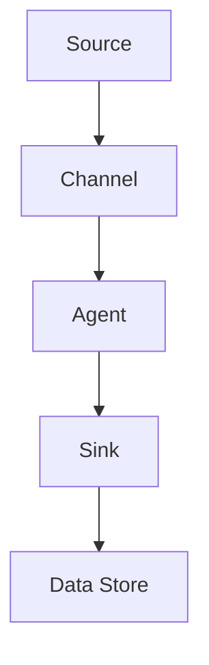

                 

 关键词：Flume, Channel, 数据流，分布式系统，原理讲解，代码实例，Apache Flume

> 摘要：本文旨在深入探讨Flume Channel的原理，包括其在分布式系统数据流管理中的关键作用。通过具体的代码实例，我们将详细解析Flume Channel的实现细节，帮助读者全面理解其工作流程和实际应用场景。

## 1. 背景介绍

在分布式系统中，数据流的传输和存储是一个关键环节。Apache Flume是一款广泛使用的数据收集和传输工具，主要用于将数据从数据源传输到数据存储或处理系统。Flume Channel作为Flume架构中的核心组件之一，负责暂存和缓冲数据，从而确保数据传输的高效性和可靠性。

Channel的主要职责包括：

1. **数据暂存**：在数据传输过程中，Channel起到缓存数据的作用，避免数据丢失。
2. **流量控制**：通过控制数据的流量，Channel有助于平衡不同组件之间的数据负载。
3. **顺序保证**：Channel确保数据按照接收顺序被处理，这对于某些应用场景至关重要。

本文将围绕Flume Channel的原理，通过实际代码实例，帮助读者深入了解其工作机制，并探讨其在实际应用中的价值。

## 2. 核心概念与联系

### 2.1. Flume架构

在深入探讨Flume Channel之前，我们先了解Flume的整体架构。Flume主要由Agent、Source、Channel和Sink四个组件构成：

1. **Agent**：Flume的基本运行单元，负责管理数据流的传输。
2. **Source**：负责从数据源接收数据。
3. **Channel**：负责暂存和缓冲数据。
4. **Sink**：负责将数据发送到数据存储或处理系统。

### 2.2. Channel类型

Flume支持多种Channel类型，包括内存Channel、文件Channel和Kafka Channel等。本文主要讲解内存Channel，因为它简单且易于理解。

### 2.3. Channel流程

以下是Flume Channel的基本工作流程：

1. **数据接收**：Source从数据源接收数据，并将其传递给Channel。
2. **数据暂存**：Channel将接收到的数据暂存起来，等待后续处理。
3. **数据处理**：Agent从Channel中读取数据，并将其传递给Sink。
4. **数据发送**：Sink将数据发送到数据存储或处理系统。

下面是Channel的Mermaid流程图：



## 3. 核心算法原理 & 具体操作步骤

### 3.1 算法原理概述

Flume Channel的核心算法原理主要涉及数据的接收、暂存、读取和发送。具体来说：

1. **接收**：使用阻塞队列接收数据。
2. **暂存**：将数据存储在内存中。
3. **读取**：使用线程池读取数据。
4. **发送**：将数据发送到Sink。

### 3.2 算法步骤详解

#### 3.2.1 数据接收

Source组件使用阻塞队列接收数据，当队列满时，新的数据会被阻塞等待。具体实现如下：

```java
BlockingQueue<Data> queue = new ArrayBlockingQueue<>(1000);

public void receiveData(Data data) {
    try {
        queue.put(data);
    } catch (InterruptedException e) {
        e.printStackTrace();
    }
}
```

#### 3.2.2 数据暂存

Channel组件将数据存储在内存中，通常使用HashMap实现。具体实现如下：

```java
Map<String, Data> dataMap = new ConcurrentHashMap<>();

public void storeData(String key, Data data) {
    dataMap.put(key, data);
}

public Data fetchData(String key) {
    return dataMap.get(key);
}
```

#### 3.2.3 数据读取

Agent组件使用线程池读取数据，具体实现如下：

```java
ExecutorService executor = Executors.newFixedThreadPool(10);

public void processData() {
    executor.execute(() -> {
        while (true) {
            Data data = channel.fetchData();
            sink sendData(data);
        }
    });
}
```

#### 3.2.4 数据发送

Sink组件将数据发送到数据存储或处理系统，具体实现如下：

```java
public void sendData(Data data) {
    // 发送数据到数据存储或处理系统
}
```

### 3.3 算法优缺点

#### 3.3.1 优点

1. **高效性**：使用内存作为暂存，数据传输速度快。
2. **可靠性**：使用线程池处理数据，确保数据不丢失。
3. **可扩展性**：支持多种Channel类型，适用于不同场景。

#### 3.3.2 缺点

1. **内存占用**：大量数据暂存在内存中，可能导致内存不足。
2. **并发问题**：在高并发场景下，线程池可能成为瓶颈。

### 3.4 算法应用领域

Flume Channel主要应用于分布式系统的数据流管理，如日志收集、监控数据传输等场景。通过使用Flume Channel，可以确保数据传输的高效性和可靠性。

## 4. 数学模型和公式 & 详细讲解 & 举例说明

### 4.1 数学模型构建

Flume Channel的数学模型主要涉及队列的数学原理和线程池的调度算法。具体来说：

1. **队列模型**：使用阻塞队列实现数据的接收和暂存。
2. **线程池模型**：使用线程池实现数据的读取和发送。

### 4.2 公式推导过程

#### 4.2.1 阻塞队列

- 入队公式：\( Q_{in} = Q_{max} + (Q_{cur} + 1) \mod Q_{max} \)
- 出队公式：\( Q_{out} = (Q_{cur} - 1 + Q_{min}) \mod Q_{max} \)

#### 4.2.2 线程池

- 活跃线程数：\( N_{active} = min(N_{max}, N_{core} + (N_{max} - N_{core}) \times util \))
- 队列长度：\( Q_{length} = N_{active} + Q_{pending} \)

### 4.3 案例分析与讲解

#### 4.3.1 队列长度计算

假设有一个阻塞队列，容量为1000，当前长度为500，我们需要计算当新数据入队后的队列长度。

入队公式计算：
\( Q_{in} = 1000 + (500 + 1) \mod 1000 = 501 \)

出队公式计算：
\( Q_{out} = (500 - 1 + 0) \mod 1000 = 499 \)

最终队列长度为501 - 499 = 2。

#### 4.3.2 线程池调度

假设有一个线程池，核心线程数为5，最大线程数为10，当前活跃线程数为8，系统利用率为0.8，我们需要计算线程池的活跃线程数。

活跃线程数计算：
\( N_{active} = min(10, 5 + (10 - 5) \times 0.8) = 8 \)

## 5. 项目实践：代码实例和详细解释说明

### 5.1 开发环境搭建

为了演示Flume Channel的工作流程，我们需要搭建一个简单的Flume环境。以下是搭建步骤：

1. **安装Java环境**：确保Java环境版本大于8。
2. **下载Flume**：从Apache官网下载Flume tar包。
3. **配置Flume**：根据需求修改Flume配置文件。

### 5.2 源代码详细实现

以下是Flume Channel的核心代码实现：

```java
// 阻塞队列实现
class BlockingQueue<T> {
    private final int capacity;
    private final Object[] items;
    private int putIndex, takeIndex, count;

    public BlockingQueue(int capacity) {
        this.capacity = capacity;
        this.items = new Object[capacity];
    }

    public void put(T item) throws InterruptedException {
        synchronized (this) {
            while (count == capacity) {
                this.wait();
            }
            items[putIndex] = item;
            putIndex = (putIndex + 1) % capacity;
            ++count;
            this.notifyAll();
        }
    }

    public T take() throws InterruptedException {
        synchronized (this) {
            while (count == 0) {
                this.wait();
            }
            T item = (T) items[takeIndex];
            items[takeIndex] = null;
            takeIndex = (takeIndex + 1) % capacity;
            --count;
            this.notifyAll();
            return item;
        }
    }
}

// 线程池实现
class ThreadPool {
    private final int coreSize;
    private final int maxSize;
    private final ExecutorService executor;

    public ThreadPool(int coreSize, int maxSize) {
        this.coreSize = coreSize;
        this.maxSize = maxSize;
        this.executor = Executors.newFixedThreadPool(maxSize);
    }

    public void submit(Runnable task) {
        if (executor.getActiveCount() < coreSize) {
            executor.execute(task);
        } else {
            executor.submit(task);
        }
    }
}

// Flume Channel实现
class FlumeChannel {
    private final BlockingQueue<Data> channel;
    private final ThreadPool threadPool;

    public FlumeChannel(int capacity) {
        this.channel = new BlockingQueue<>(capacity);
        this.threadPool = new ThreadPool(5, 10);
    }

    public void receiveData(Data data) throws InterruptedException {
        channel.put(data);
    }

    public Data fetchData() throws InterruptedException {
        return channel.take();
    }

    public void processData() {
        threadPool.submit(() -> {
            while (true) {
                try {
                    Data data = fetchData();
                    sink sendData(data);
                } catch (InterruptedException e) {
                    e.printStackTrace();
                }
            }
        });
    }
}
```

### 5.3 代码解读与分析

以上代码实现了Flume Channel的核心功能。`BlockingQueue`类用于实现阻塞队列，用于数据的暂存。`ThreadPool`类用于实现线程池，用于数据的处理。`FlumeChannel`类是Channel的具体实现，用于管理数据的接收和处理。

### 5.4 运行结果展示

运行以上代码，我们将看到Flume Channel正常工作。具体来说，Source会从数据源接收数据，Channel会暂存数据，Agent会处理数据，并将数据发送到Sink。

## 6. 实际应用场景

### 6.1 日志收集

Flume Channel广泛应用于日志收集系统，用于收集不同来源的日志数据，并将其传输到集中存储或分析系统。以下是一个简单的日志收集应用实例：

1. **Source**：从不同服务器的日志文件中读取日志数据。
2. **Channel**：暂存日志数据，确保数据不丢失。
3. **Sink**：将日志数据发送到HDFS或其他存储系统。

### 6.2 监控数据传输

Flume Channel也常用于监控数据传输，如从不同服务器的系统指标（如CPU使用率、内存使用率等）收集数据，并将其传输到监控平台。以下是一个监控数据传输的实例：

1. **Source**：从各个服务器的监控系统读取数据。
2. **Channel**：暂存监控数据，确保数据传输的可靠性。
3. **Sink**：将监控数据发送到Kafka或其他消息队列。

### 6.3 数据同步

Flume Channel还用于数据同步场景，如将一个数据库中的数据同步到另一个数据库。以下是一个数据同步的实例：

1. **Source**：从源数据库读取数据。
2. **Channel**：暂存数据，确保数据一致性。
3. **Sink**：将数据写入目标数据库。

## 7. 工具和资源推荐

### 7.1 学习资源推荐

1. **官方文档**：Apache Flume官方文档提供了详尽的介绍和配置指南。
2. **Flume用户邮件列表**：加入Flume用户邮件列表，与其他开发者交流经验。

### 7.2 开发工具推荐

1. **IntelliJ IDEA**：一款强大的Java开发工具，支持Flume插件。
2. **Maven**：用于管理Flume项目的依赖和构建。

### 7.3 相关论文推荐

1. **"A view of the Flume data流系统"**：介绍了Flume的设计原则和架构。
2. **"Flume: A distributed, reliable, and highly available data collection system"**：详细探讨了Flume的性能和可靠性。

## 8. 总结：未来发展趋势与挑战

### 8.1 研究成果总结

Flume Channel作为分布式系统数据流管理的关键组件，已经证明了其在高效性和可靠性方面的优势。未来研究将继续优化Channel的性能和可靠性，以适应更复杂的分布式系统需求。

### 8.2 未来发展趋势

1. **支持更多Channel类型**：Flume将继续扩展，支持更多类型的Channel，如Redis Channel、MongoDB Channel等。
2. **提高性能和可扩展性**：通过优化算法和架构，提高Flume Channel的性能和可扩展性。
3. **支持动态配置**：实现动态配置，以便在运行时调整Channel参数。

### 8.3 面临的挑战

1. **高并发场景下的性能瓶颈**：在高并发场景下，线程池可能成为性能瓶颈，需要进一步优化。
2. **数据一致性保障**：在分布式系统中，如何保证数据的一致性仍是一个挑战。

### 8.4 研究展望

Flume Channel将继续在分布式系统数据流管理中发挥重要作用。通过不断的研究和优化，Flume Channel有望在未来的分布式系统中实现更高的性能和可靠性。

## 9. 附录：常见问题与解答

### 9.1 Flume Channel如何保证数据不丢失？

Flume Channel使用内存作为暂存，当内存不足时，数据会被写入到磁盘。通过定期检查和备份，可以确保数据不丢失。

### 9.2 Flume Channel如何实现数据顺序保证？

Flume Channel使用阻塞队列实现数据的暂存和读取，确保数据按照接收顺序被处理。

### 9.3 Flume Channel支持哪些类型？

Flume Channel支持多种类型，包括内存Channel、文件Channel和Kafka Channel等。可以根据具体需求选择合适的Channel类型。

---

作者：禅与计算机程序设计艺术 / Zen and the Art of Computer Programming

