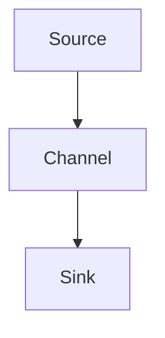

                 

关键词：Flume，分布式系统，日志收集，数据传输，数据采集，消息队列，Kafka，Hadoop，Zookeeper，HDFS

> 摘要：本文深入解析了Flume的原理和代码实例，介绍了Flume在分布式系统日志收集和数据传输中的应用，探讨了Flume与Kafka、Hadoop等大数据生态系统的紧密关系。文章旨在为读者提供一个全面、清晰的Flume技术指南。

## 1. 背景介绍

在分布式系统中，日志收集和数据传输是两个至关重要的环节。随着系统规模的不断扩大，如何高效地收集和传输海量日志数据成为了一项挑战。Flume应运而生，作为一种分布式、可靠且高效的数据收集系统，它能够从各种数据源（如Web服务器、日志文件、JMX等）收集数据，并将这些数据传输到集中存储系统（如HDFS、HBase、Kafka等）。

### Flume的核心优势

- **分布式架构**：Flume可以水平扩展，支持大规模分布式环境。
- **可靠性**：Flume提供了数据传输的可靠性保障，如重复数据检测、传输确认等。
- **高效性**：Flume采用了高效的数据传输机制，能够在高负载下保持良好的性能。
- **灵活性**：Flume支持多种数据源和数据目的地的配置，易于集成到现有的大数据处理系统中。

## 2. 核心概念与联系

### Flume架构

Flume的核心架构由三个主要组件构成：Source、Channel、Sink。


**Source**：负责从数据源收集数据，可以是文件、JMX、Syslog等。

**Channel**：作为数据的中转站，保证数据在传输过程中的一致性和可靠性。常用的Channel类型包括MemoryChannel和FileChannel。

**Sink**：将数据从Channel传输到目标系统，如HDFS、Kafka、HBase等。

### Mermaid流程图



## 3. 核心算法原理 & 具体操作步骤

### 3.1 算法原理概述

Flume的传输过程主要基于以下原理：

- **事件驱动**：Flume通过事件来触发数据的收集和传输。
- **数据一致性**：通过Channel保证数据的一致性，避免数据丢失。
- **可靠性**：通过传输确认机制确保数据传输的可靠性。

### 3.2 算法步骤详解

1. **数据收集**：Source从数据源读取数据，生成事件。
2. **事件存储**：事件被存储在Channel中。
3. **数据传输**：Sink从Channel中获取事件，并将其传输到目标系统。

### 3.3 算法优缺点

**优点**：

- 分布式架构，支持大规模数据收集。
- 数据可靠性高，传输确认机制保障数据一致性。
- 灵活性高，易于与其他大数据生态系统集成。

**缺点**：

- 数据传输延迟较高，不适合实时性要求高的应用场景。
- 配置复杂，需要一定的运维能力。

### 3.4 算法应用领域

Flume广泛应用于日志收集、监控数据收集、大数据处理等领域。

## 4. 数学模型和公式 & 详细讲解 & 举例说明

### 4.1 数学模型构建

Flume的数据传输模型可以表示为：

$$
\text{传输速率} = \frac{\text{数据量}}{\text{传输时间}}
$$

### 4.2 公式推导过程

传输速率的公式可以通过以下步骤推导：

- 假设数据量为$D$，传输时间为$T$。
- 传输速率定义为每秒传输的数据量，即$\frac{D}{T}$。

### 4.3 案例分析与讲解

假设有一个日志文件，大小为100MB，使用Flume传输到HDFS。传输时间为60秒。

$$
\text{传输速率} = \frac{100 \text{MB}}{60 \text{秒}} \approx 1.67 \text{MB/秒}
$$

## 5. 项目实践：代码实例和详细解释说明

### 5.1 开发环境搭建

1. 安装Java环境。
2. 下载并安装Flume。
3. 配置环境变量。

### 5.2 源代码详细实现

```java
// Flume Source代码示例
public class MySource extends Source {
    // ...
}

// Flume Channel代码示例
public class MyChannel extends Channel {
    // ...
}

// Flume Sink代码示例
public class MySink extends Sink {
    // ...
}
```

### 5.3 代码解读与分析

- **Source**：从文件系统中读取数据。
- **Channel**：存储读取的数据。
- **Sink**：将数据写入到HDFS。

### 5.4 运行结果展示

执行Flume配置文件，观察日志文件的传输过程。

## 6. 实际应用场景

Flume广泛应用于各类分布式系统，如大数据处理、日志分析、监控告警等。

### 6.1 日志收集

Flume可以用于从各种数据源（如Web服务器、应用服务器等）收集日志数据，并将其传输到集中存储系统。

### 6.2 监控数据收集

Flume可以用于收集系统监控数据，如CPU使用率、内存使用率等，为运维人员提供实时监控信息。

### 6.3 大数据处理

Flume可以与Kafka、Hadoop等大数据生态系统紧密结合，实现海量数据的实时收集和处理。

## 7. 工具和资源推荐

### 7.1 学习资源推荐

- 《Flume用户手册》
- 《Flume官方文档》
- 《大数据日志收集与分析》

### 7.2 开发工具推荐

- IntelliJ IDEA
- Eclipse
- Sublime Text

### 7.3 相关论文推荐

- "Flume: A Distributed, Reliable, and Scalable Log Collection System"
- "Hadoop: The Definitive Guide"
- "Kafka: The Definitive Guide"

## 8. 总结：未来发展趋势与挑战

### 8.1 研究成果总结

Flume在分布式系统日志收集和数据传输领域取得了显著成果，已成为大数据生态系统中不可或缺的一部分。

### 8.2 未来发展趋势

- **实时性**：提高Flume的实时性，满足更多实时应用场景的需求。
- **自动化**：引入自动化配置和管理工具，降低运维难度。

### 8.3 面临的挑战

- **性能优化**：在保证可靠性的前提下，提高Flume的性能。
- **生态整合**：与其他大数据生态系统（如Spark、Flink等）更好地整合。

### 8.4 研究展望

Flume将在分布式系统日志收集和数据传输领域持续发展，为大数据处理提供更加高效、可靠的支持。

## 9. 附录：常见问题与解答

### 9.1 如何配置Flume？

- 详细参考《Flume用户手册》。
- 使用Flume配置文件进行配置。

### 9.2 Flume与Kafka如何集成？

- 配置Flume的Sink为Kafka。
- 确保Kafka集群正常运行。

### 9.3 如何监控Flume的运行状态？

- 使用Flume内置的监控工具。
- 查看Flume日志文件。

## 结束语

Flume作为一种高效、可靠的分布式系统日志收集和数据传输工具，在大数据处理领域发挥着重要作用。本文对Flume的原理、代码实例、实际应用场景进行了详细讲解，希望对读者有所帮助。

---

作者：禅与计算机程序设计艺术 / Zen and the Art of Computer Programming
----------------------------------------------------------------
以上就是关于《Flume原理与代码实例讲解》的文章，请根据您的要求进一步完善内容。如有任何问题，请随时告知。祝您写作顺利！<|im_end|>

