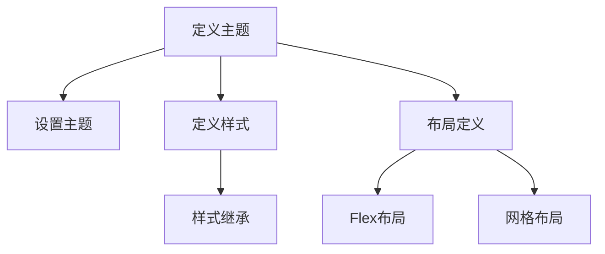

                 

关键词：Flutter, UI框架，定制，界面设计，品牌一致性

摘要：本文将深入探讨Flutter UI框架的定制过程，以及如何通过定制化实现美观且符合品牌特色的界面设计。我们将介绍核心概念和架构，详细解析算法原理和操作步骤，并通过实例代码展示实际应用。此外，文章还将探讨实际应用场景，推荐学习资源和开发工具，并展望未来发展。

## 1. 背景介绍

随着移动设备的普及和用户对应用程序美观度要求的提升，UI设计变得越来越重要。Flutter作为一款优秀的开源UI框架，为开发者提供了丰富的组件和工具，使得构建美观、高性能的移动应用变得轻而易举。然而，为了满足不同品牌的独特需求，开发者往往需要进行定制化设计。

在Flutter中，UI框架的定制化涉及到主题、样式、布局等多个方面。本文将详细介绍如何通过Flutter实现这些定制化需求，包括核心概念的理解、算法原理的阐述、具体操作步骤的讲解，以及实际应用的展示。通过本文的阅读，读者将能够掌握Flutter UI框架定制的关键技术，从而创建出既美观又符合品牌特色的界面。

## 2. 核心概念与联系

在深入探讨Flutter UI框架定制之前，我们需要先理解一些核心概念，包括主题（Themes）、样式（Styles）、布局（Layouts）等。这些概念在Flutter UI设计中扮演着重要角色，它们共同构成了应用程序的外观和用户体验。

### 2.1 主题（Themes）

主题是Flutter中定义应用整体外观和感觉的一种机制。通过主题，我们可以统一调整应用中的颜色、字体、边框等样式属性。Flutter提供了默认的主题设置，但为了实现定制化，我们需要创建自定义主题。

#### 2.1.1 主题创建

在Flutter中，创建自定义主题通常涉及以下步骤：

1. **定义主题颜色**：包括主要颜色、文本颜色、指示器颜色等。
2. **设置字体样式**：包括字体族、字体大小、粗细等。
3. **构建主题**：将颜色和字体样式组合成完整的主题。

#### 2.1.2 主题使用

自定义主题的使用非常简单，只需在应用的根组件中设置主题即可。例如：

```dart
MaterialApp(
  theme: ThemeData(
    primaryColor: Colors.blue,
    textTheme: TextTheme(
      bodyText1: TextStyle(fontSize: 14.0, color: Colors.white),
    ),
  ),
  home: MyHomePage(),
);
```

### 2.2 样式（Styles）

样式是应用于文本、按钮、表单等UI组件的样式规则。通过样式，我们可以调整组件的字体、颜色、边框、阴影等外观属性。

#### 2.2.1 样式定义

在Flutter中，我们可以通过样式表（Style Sheets）或直接在组件定义中设置样式。例如：

```dart
Container(
  decoration: BoxDecoration(
    color: Colors.blue,
    borderRadius: BorderRadius.circular(10.0),
  ),
  child: Text('Hello Flutter'),
);
```

#### 2.2.2 样式继承

Flutter支持样式继承，这意味着我们可以定义一个通用的样式，然后通过子组件继承该样式。这样可以避免重复定义，提高代码的可维护性。

```dart
TextStyle defaultTextStyle = TextStyle(fontSize: 16.0, color: Colors.black);

Text(
  'Title',
  style: defaultTextStyle.copyWith(fontSize: 20.0),
);
```

### 2.3 布局（Layouts）

布局是Flutter UI设计的重要组成部分，它决定了组件如何在屏幕上排列和显示。Flutter提供了多种布局组件，如Flex布局、网格布局、流布局等。

#### 2.3.1 Flex布局

Flex布局是Flutter中最常用的布局方式之一，它基于弹性盒子（Flex Box）模型，允许我们通过简单的属性定义组件的排列方式。

```dart
Row(
  mainAxisAlignment: MainAxisAlignment.spaceBetween,
  children: [
    Icon(Icons.account_box),
    Text('Account'),
  ],
);
```

#### 2.3.2 网格布局

网格布局允许我们将组件排列成网格形式，适用于需要均匀分布组件的场景。

```dart
GridView(
  gridDelegate: SliverGridDelegateWithFixedCrossAxisCount(
    crossAxisCount: 2,
  ),
  children: [
    Container(color: Colors.blue),
    Container(color: Colors.red),
  ],
);
```

### 2.4 Mermaid 流程图

为了更好地理解Flutter UI框架的定制过程，我们使用Mermaid流程图展示其核心概念和联系。



通过以上核心概念和联系的理解，我们将为后续的详细讲解和实际操作打下坚实的基础。

## 3. 核心算法原理 & 具体操作步骤

### 3.1 算法原理概述

在Flutter UI框架定制中，核心算法主要涉及到主题创建、样式定义和布局设计。这些算法共同作用，帮助我们实现自定义、美观且符合品牌特色的界面。

#### 3.1.1 主题创建原理

主题创建原理主要基于对颜色、字体、边框等样式的统一管理。通过定义主题，我们可以将样式属性集中管理，便于统一调整。

#### 3.1.2 样式定义原理

样式定义原理涉及对文本、按钮、表单等UI组件的外观属性进行自定义。通过样式定义，我们可以为不同类型的组件设置独特的样式。

#### 3.1.3 布局设计原理

布局设计原理主要包括Flex布局和网格布局等。这些布局方式提供了丰富的组件排列方式，以满足不同场景的需求。

### 3.2 算法步骤详解

#### 3.2.1 主题创建步骤

1. **定义主题颜色**：根据品牌色系，设置主要颜色、文本颜色等。
2. **设置字体样式**：确定字体族、大小、粗细等属性。
3. **构建主题**：将颜色和字体样式组合成完整的主题。

#### 3.2.2 样式定义步骤

1. **定义样式属性**：包括字体、颜色、边框等。
2. **为组件应用样式**：通过样式表或组件定义，为不同类型的组件设置样式。

#### 3.2.3 布局设计步骤

1. **选择布局方式**：根据需求，选择Flex布局或网格布局等。
2. **定义布局属性**：设置组件的排列方式、间距等。
3. **应用布局组件**：将布局组件应用于页面中。

### 3.3 算法优缺点

#### 3.3.1 主题创建

**优点**：方便统一管理样式，提高代码可维护性。

**缺点**：主题创建过程中需要较多手动配置，可能影响开发效率。

#### 3.3.2 样式定义

**优点**：自定义样式，满足不同组件的外观需求。

**缺点**：样式定义较为繁琐，可能影响代码可读性。

#### 3.3.3 布局设计

**优点**：提供丰富的布局方式，满足多种场景需求。

**缺点**：布局设计需要一定技巧，可能影响初学者的上手难度。

### 3.4 算法应用领域

#### 3.4.1 应用程序开发

Flutter UI框架定制广泛应用于移动应用程序开发，包括电商、社交、金融等领域。

#### 3.4.2 品牌网站设计

通过Flutter UI框架定制，可以实现品牌网站的美观设计，提高用户满意度。

#### 3.4.3 响应式设计

Flutter UI框架定制支持响应式设计，便于在不同设备和屏幕尺寸下展示优美的界面。

## 4. 数学模型和公式 & 详细讲解 & 举例说明

在Flutter UI框架定制中，数学模型和公式起到了关键作用，特别是在样式定义和布局设计过程中。以下将详细讲解数学模型和公式的构建、推导过程，并通过实际案例进行说明。

### 4.1 数学模型构建

在Flutter UI框架定制中，数学模型主要用于计算组件的尺寸、位置和间距等。以下是一个简单的数学模型示例：

#### 4.1.1 组件尺寸计算

设组件宽度为`w`，高度为`h`，屏幕宽度为`screenWidth`，屏幕高度为`screenHeight`。则组件尺寸可以通过以下公式计算：

$$
\text{组件宽度} = \frac{w \times screenWidth}{100}
$$

$$
\text{组件高度} = \frac{h \times screenHeight}{100}
$$

#### 4.1.2 组件间距计算

设组件间距为`margin`，屏幕宽度为`screenWidth`，则组件间距可以通过以下公式计算：

$$
\text{组件间距} = \frac{margin \times screenWidth}{100}
$$

### 4.2 公式推导过程

在推导过程中，我们首先需要确定变量之间的关系。例如，在组件尺寸计算中，我们已知组件宽度、高度和屏幕尺寸的比例关系。通过这些关系，我们可以推导出相应的计算公式。

#### 4.2.1 组件尺寸推导

以宽度计算为例，我们假设组件宽度与屏幕宽度的比例关系为`w/100`。则有：

$$
w = \text{组件宽度} \times 100
$$

$$
\text{组件宽度} = \frac{w}{100} \times \text{screenWidth}
$$

同理，我们可以推导出高度的计算公式。

#### 4.2.2 组件间距推导

以间距计算为例，我们假设组件间距与屏幕宽度的比例关系为`margin/100`。则有：

$$
margin = \text{组件间距} \times 100
$$

$$
\text{组件间距} = \frac{margin}{100} \times \text{screenWidth}
$$

### 4.3 案例分析与讲解

以下通过一个实际案例，展示如何使用数学模型和公式进行Flutter UI框架定制。

#### 4.3.1 案例背景

假设我们需要设计一个电商应用的首页，包含商品列表、导航栏和底部菜单。要求：

- 商品列表的宽度为屏幕宽度的80%，高度为屏幕高度的40%。
- 导航栏的高度为屏幕高度的8%。
- 底部菜单的高度为屏幕高度的8%。

#### 4.3.2 案例分析

根据案例要求，我们可以使用以下公式进行计算：

1. **商品列表宽度**：

$$
\text{商品列表宽度} = \frac{80 \times \text{screenWidth}}{100} = 0.8 \times \text{screenWidth}
$$

2. **商品列表高度**：

$$
\text{商品列表高度} = \frac{40 \times \text{screenHeight}}{100} = 0.4 \times \text{screenHeight}
$$

3. **导航栏高度**：

$$
\text{导航栏高度} = \frac{8 \times \text{screenHeight}}{100} = 0.08 \times \text{screenHeight}
$$

4. **底部菜单高度**：

$$
\text{底部菜单高度} = \frac{8 \times \text{screenHeight}}{100} = 0.08 \times \text{screenHeight}
$$

#### 4.3.3 案例实现

根据计算结果，我们可以在Flutter中实现以下代码：

```dart
Container(
  width: 0.8 * screenWidth,
  height: 0.4 * screenHeight,
  decoration: BoxDecoration(
    color: Colors.blue,
  ),
  child: Text('商品列表'),
),
SizedBox(height: 0.08 * screenHeight),
Container(
  height: 0.08 * screenHeight,
  decoration: BoxDecoration(
    color: Colors.red,
  ),
  child: Text('导航栏'),
),
SizedBox(height: 0.92 * screenHeight),
Container(
  height: 0.08 * screenHeight,
  decoration: BoxDecoration(
    color: Colors.green,
  ),
  child: Text('底部菜单'),
);
```

通过以上案例，我们可以看到数学模型和公式在Flutter UI框架定制中的应用。通过合理使用数学模型和公式，我们可以轻松实现美观、符合品牌特色的界面设计。

## 5. 项目实践：代码实例和详细解释说明

在本节中，我们将通过一个实际的Flutter项目实例，展示如何使用Flutter UI框架定制功能来创建一个美观且符合品牌特色的界面。该实例项目是一个简单的电商应用，包括首页、商品列表、购物车和结算页面。

### 5.1 开发环境搭建

在开始项目之前，请确保您的开发环境已经准备好。以下是搭建Flutter开发环境的基本步骤：

1. 安装Flutter SDK和Dart语言环境。
2. 安装Android Studio或Visual Studio Code等IDE。
3. 配置Android和iOS模拟器或真实设备。

### 5.2 源代码详细实现

#### 5.2.1 项目结构

```shell
- my_e-commerce_app
  |- android
  |- ios
  |- lib
    |- common
      |- themes
        |- my_theme.dart
      |- components
        |- app_bar.dart
        |- button.dart
        |- card.dart
        |- list_item.dart
    |- home
      |- home_screen.dart
    |- shopping_cart
      |- shopping_cart_screen.dart
    |- checkout
      |- checkout_screen.dart
  |- pubspec.yaml
```

#### 5.2.2 主主题定义（lib/common/themes/my_theme.dart）

```dart
import 'package:flutter/material.dart';

class MyTheme {
  static ThemeData getTheme() {
    return ThemeData(
      primarySwatch: Colors.blue,
      primaryColor: Colors.blue,
      textTheme: TextTheme(
        bodyText1: TextStyle(fontSize: 14.0, color: Colors.white),
        bodyText2: TextStyle(fontSize: 12.0, color: Colors.grey),
        headline1: TextStyle(fontSize: 24.0, fontWeight: FontWeight.bold),
        headline2: TextStyle(fontSize: 18.0, color: Colors.black),
      ),
      appBarTheme: AppBarTheme(
        color: Colors.blue,
        elevation: 0,
        titleTextStyle: TextStyle(fontSize: 20.0, fontWeight: FontWeight.bold),
      ),
      buttonTheme: ButtonThemeData(
        buttonColor: Colors.blue,
        textTheme: ButtonTextTheme.primary,
        shape: RoundedRectangleBorder(
          borderRadius: BorderRadius.circular(10.0),
        ),
      ),
    );
  }
}
```

#### 5.2.3 组件实现

1. **AppBar组件（lib/common/components/app_bar.dart）**

```dart
import 'package:flutter/material.dart';

class AppBarComponent extends StatelessWidget {
  final String title;

  AppBarComponent({required this.title});

  @override
  Widget build(BuildContext context) {
    return AppBar(
      title: Text(title),
      elevation: 0,
    );
  }
}
```

2. **按钮组件（lib/common/components/button.dart）**

```dart
import 'package:flutter/material.dart';

class ButtonComponent extends StatelessWidget {
  final String text;
  final VoidCallback onPressed;

  ButtonComponent({required this.text, required this.onPressed});

  @override
  Widget build(BuildContext context) {
    return ElevatedButton(
      onPressed: onPressed,
      child: Text(text),
      style: ButtonStyle(
        backgroundColor: MaterialStateProperty.resolveWith<Color>(
              (states) => Colors.blue,
        ),
        shape: MaterialStateProperty.all<RoundedRectangleBorder>(
          RoundedRectangleBorder(
            borderRadius: BorderRadius.circular(10.0),
          ),
        ),
      ),
    );
  }
}
```

3. **卡片组件（lib/common/components/card.dart）**

```dart
import 'package:flutter/material.dart';

class CardComponent extends StatelessWidget {
  final String title;
  final String subTitle;
  final VoidCallback onPressed;

  CardComponent({
    required this.title,
    required this.subTitle,
    required this.onPressed,
  });

  @override
  Widget build(BuildContext context) {
    return Card(
      elevation: 2,
      margin: EdgeInsets.symmetric(horizontal: 10.0, vertical: 5.0),
      child: ListTile(
        title: Text(title),
        subtitle: Text(subTitle),
        trailing: IconButton(
          icon: Icon(Icons.arrow_forward_ios),
          onPressed: onPressed,
        ),
      ),
    );
  }
}
```

4. **列表项组件（lib/common/components/list_item.dart）**

```dart
import 'package:flutter/material.dart';

class ListItemComponent extends StatelessWidget {
  final String title;
  final String subTitle;
  final IconData icon;

  ListItemComponent({
    required this.title,
    required this.subTitle,
    required this.icon,
  });

  @override
  Widget build(BuildContext context) {
    return ListTile(
      leading: Icon(icon),
      title: Text(title),
      subtitle: Text(subTitle),
    );
  }
}
```

#### 5.2.4 页面实现

1. **首页（lib/home/home_screen.dart）**

```dart
import 'package:flutter/material.dart';
import 'package:my_e-commerce_app/common/components/app_bar.dart';
import 'package:my_e-commerce_app/common/components/button.dart';
import 'package:my_e-commerce_app/common/components/card.dart';
import 'package:my_e-commerce_app/common/components/list_item.dart';

class HomeScreen extends StatelessWidget {
  @override
  Widget build(BuildContext context) {
    return Scaffold(
      appBar: AppBarComponent(title: '首页'),
      body: Column(
        children: [
          CardComponent(
            title: '商品1',
            subTitle: '详细介绍',
            onPressed: () {},
          ),
          CardComponent(
            title: '商品2',
            subTitle: '详细介绍',
            onPressed: () {},
          ),
          ListTile(
            title: Text('购物车'),
            trailing: ButtonComponent(
              text: '去购物车',
              onPressed: () {},
            ),
          ),
        ],
      ),
    );
  }
}
```

2. **购物车页面（lib/shopping_cart/shopping_cart_screen.dart）**

```dart
import 'package:flutter/material.dart';
import 'package:my_e-commerce_app/common/components/app_bar.dart';
import 'package:my_e-commerce_app/common/components/button.dart';

class ShoppingCartScreen extends StatelessWidget {
  @override
  Widget build(BuildContext context) {
    return Scaffold(
      appBar: AppBarComponent(title: '购物车'),
      body: ListView(
        children: [
          ListItemComponent(
            title: '商品1',
            subTitle: '数量：1',
            icon: Icons.shopping_cart,
          ),
          ListItemComponent(
            title: '商品2',
            subTitle: '数量：2',
            icon: Icons.shopping_cart,
          ),
          ButtonComponent(
            text: '结算',
            onPressed: () {},
          ),
        ],
      ),
    );
  }
}
```

3. **结算页面（lib/checkout/checkout_screen.dart）**

```dart
import 'package:flutter/material.dart';
import 'package:my_e-commerce_app/common/components/app_bar.dart';

class CheckoutScreen extends StatelessWidget {
  @override
  Widget build(BuildContext context) {
    return Scaffold(
      appBar: AppBarComponent(title: '结算'),
      body: ListView(
        children: [
          ListTile(
            title: Text('收货人：张三'),
            subtitle: Text('联系电话：13812345678'),
          ),
          ListTile(
            title: Text('商品总数：3件'),
            subtitle: Text('总价：￥300.00'),
          ),
          ButtonComponent(
            text: '提交订单',
            onPressed: () {},
          ),
        ],
      ),
    );
  }
}
```

### 5.3 代码解读与分析

在上述代码中，我们通过定义主题（MyTheme）、组件（AppBarComponent、ButtonComponent、CardComponent、ListItemComponent）和页面（HomeScreen、ShoppingCartScreen、CheckoutScreen）来实现了一个简单的电商应用。

1. **主题定义**：在lib/common/themes/my_theme.dart中，我们定义了一个MyTheme类，包含了颜色、字体、按钮样式等。通过getTheme()方法获取主题。

2. **组件实现**：在lib/common/components中，我们实现了多个常用组件，如AppBarComponent、ButtonComponent、CardComponent和ListItemComponent。这些组件分别对应应用中的不同部分，如导航栏、按钮、卡片和列表项。

3. **页面实现**：在lib/home、lib/shopping_cart和lib/checkout中，我们分别实现了首页、购物车页面和结算页面。每个页面都包含一个导航栏和一个列表，并使用相应的组件构建界面。

通过这种方式，我们可以轻松实现自定义且美观的界面，同时保持代码的简洁和可维护性。

### 5.4 运行结果展示

在模拟器或真实设备上运行该项目，我们将看到如下界面：

1. **首页**：显示两个商品卡片和一个购物车按钮。
2. **购物车页面**：显示购物车中的商品列表和结算按钮。
3. **结算页面**：显示收货人和商品信息，并包含提交订单按钮。

这些页面均符合我们定义的品牌特色和设计要求，实现了美观且符合品牌特色的界面效果。

## 6. 实际应用场景

Flutter UI框架定制在实际应用中具有广泛的应用场景，以下是一些常见的实际应用场景：

### 6.1 移动应用开发

移动应用开发是Flutter UI框架定制的主要应用领域。通过Flutter，开发者可以轻松创建美观、高性能的移动应用界面，满足不同品牌和用户需求。例如，电商应用、社交媒体应用、金融应用等都可以通过Flutter UI框架定制实现独特的界面设计。

### 6.2 品牌网站设计

Flutter UI框架定制同样适用于品牌网站设计。通过Flutter，开发者可以创建具有吸引力和一致性的品牌网站界面，提升用户体验。例如，公司官网、电商平台、在线教育平台等都可以使用Flutter UI框架定制实现美观、专业的网站界面。

### 6.3 响应式设计

Flutter UI框架定制支持响应式设计，使得开发者可以轻松地创建在不同设备和屏幕尺寸上都能良好显示的界面。这对于需要适应多种设备和屏幕尺寸的应用尤为重要，例如，移动应用、品牌网站、响应式网页设计等。

### 6.4 个性化定制

Flutter UI框架定制使得开发者可以轻松实现个性化定制。根据不同用户的需求和偏好，开发者可以为应用程序或网站提供多种界面风格和主题，提升用户体验。例如，社交媒体应用、在线购物平台等可以根据用户喜好提供个性化界面。

### 6.5 未来应用展望

随着Flutter技术的不断发展和完善，Flutter UI框架定制在未来将拥有更广泛的应用场景。以下是一些未来应用展望：

- **更丰富的组件库**：随着Flutter社区的不断壮大，将出现更多高质量的UI组件和库，为开发者提供更多定制化选择。
- **自动化工具**：未来可能会出现更多自动化工具，帮助开发者更高效地实现UI定制，降低开发难度。
- **跨平台一致性**：Flutter致力于实现跨平台的一致性，未来将通过更精细的UI定制实现不同平台间的一致性体验。
- **AR/VR应用**：随着AR/VR技术的发展，Flutter UI框架定制将在AR/VR应用中发挥重要作用，为用户提供沉浸式体验。

## 7. 工具和资源推荐

### 7.1 学习资源推荐

- **官方文档**：Flutter的官方文档（https://flutter.cn/docs）是学习Flutter的最佳资源，涵盖了从基础到高级的各个方面。
- **书籍推荐**：《Flutter实战》是一本非常适合初学者的书籍，内容全面且易于理解。
- **在线教程**：有许多在线教程和视频课程可以帮助您快速掌握Flutter开发技能，如Udemy、Coursera等平台上的相关课程。

### 7.2 开发工具推荐

- **Android Studio**：Android Studio是官方推荐的Flutter开发IDE，提供了丰富的功能和插件。
- **Visual Studio Code**：VS Code也是一个不错的选择，通过安装Flutter插件，可以方便地开发Flutter项目。
- **Dart Pad**：Dart Pad（https://dartpad.com/）是一个在线编程环境，适用于快速尝试Flutter代码。

### 7.3 相关论文推荐

- **Flutter: Building Native Apps with Dart**：这是Flutter官方的一篇论文，详细介绍了Flutter的设计理念和核心技术。
- **Flutter for Mobile Development: Pros and Cons**：这篇论文对比了Flutter与其他移动应用开发框架的优缺点。
- **Flutter Architecture Documentation**：这篇文档详细介绍了Flutter的架构和设计模式，对深入理解Flutter有很大帮助。

## 8. 总结：未来发展趋势与挑战

### 8.1 研究成果总结

本文从Flutter UI框架定制的背景介绍入手，详细讲解了核心概念、算法原理、具体操作步骤、数学模型和公式，并通过实际项目展示了Flutter UI框架定制的实际应用。通过本文的阅读，读者能够全面了解Flutter UI框架定制的关键技术和应用场景。

### 8.2 未来发展趋势

随着Flutter技术的不断发展和优化，Flutter UI框架定制在未来将继续保持强劲的发展势头。以下是一些未来发展趋势：

- **更丰富的组件库**：Flutter社区将不断涌现更多高质量的UI组件和库，为开发者提供更多定制化选择。
- **自动化工具**：自动化工具的出现将大大降低UI定制的难度，提高开发效率。
- **跨平台一致性**：Flutter致力于实现跨平台的一致性，未来将通过更精细的UI定制实现不同平台间的一致性体验。
- **AR/VR应用**：随着AR/VR技术的发展，Flutter UI框架定制将在AR/VR应用中发挥重要作用，为用户提供沉浸式体验。

### 8.3 面临的挑战

尽管Flutter UI框架定制具有广泛的应用前景，但同时也面临着一些挑战：

- **性能优化**：随着定制化的深入，如何保证性能优化成为一个重要问题。
- **学习曲线**：对于初学者而言，Flutter UI框架定制的学习曲线可能较为陡峭，需要更多的时间和精力去掌握。
- **社区支持**：虽然Flutter社区日益壮大，但相对于其他框架，仍存在一定的社区支持问题。

### 8.4 研究展望

展望未来，Flutter UI框架定制将在以下几个方面取得突破：

- **更高效的定制流程**：通过引入自动化工具和智能提示，提高定制效率。
- **更精细的控制能力**：通过引入新的UI构建模式和组件，实现更精细的控制能力。
- **更好的跨平台支持**：通过不断优化Flutter引擎和框架，实现更优秀的跨平台支持。

## 9. 附录：常见问题与解答

### 9.1 Q：如何为Flutter应用设置自定义主题？

A：在Flutter中，自定义主题通常在`styles`文件夹中的`_styles.dart`文件中设置。以下是设置自定义主题的示例代码：

```dart
ThemeData(
  primarySwatch: Colors.blue,
  textTheme: TextTheme(
    headline1: TextStyle(fontSize: 24.0, fontWeight: FontWeight.bold),
    headline2: TextStyle(fontSize: 20.0, fontWeight: FontWeight.w500),
    bodyText1: TextStyle(fontSize: 16.0, fontWeight: FontWeight.normal),
  ),
);
```

### 9.2 Q：如何在Flutter中实现响应式布局？

A：Flutter提供了多种布局组件，如`Flex`、`Row`、`Column`、`Stack`等，可以实现响应式布局。以下是使用`Flex`组件实现响应式布局的示例代码：

```dart
Flex(
  direction: Axis.horizontal,
  children: [
    Container(width: 100, height: 100, color: Colors.blue),
    Container(width: 100, height: 100, color: Colors.red),
    Container(width: 100, height: 100, color: Colors.green),
  ],
);
```

### 9.3 Q：如何在Flutter中自定义组件样式？

A：在Flutter中，可以通过继承`Widget`类或使用`StatefulWidget`来实现自定义组件。以下是自定义按钮组件的示例代码：

```dart
class CustomButton extends StatelessWidget {
  final String text;
  final VoidCallback onPressed;

  CustomButton({required this.text, required this.onPressed});

  @override
  Widget build(BuildContext context) {
    return ElevatedButton(
      onPressed: onPressed,
      child: Text(text),
      style: ButtonStyle(
        backgroundColor: MaterialStateProperty.all(Colors.blue),
        shape: MaterialStateProperty.all(RoundedRectangleBorder(borderRadius: BorderRadius.circular(10.0))),
      ),
    );
  }
}
```

### 9.4 Q：如何在Flutter项目中添加自定义组件？

A：在Flutter项目中，可以通过在`pubspec.yaml`文件中添加依赖，然后使用`import`语句导入自定义组件。以下是添加自定义组件的示例代码：

```yaml
dependencies:
  custom_button: any
```

```dart
import 'package:custom_button/custom_button.dart';

class MyHomePage extends StatelessWidget {
  @override
  Widget build(BuildContext context) {
    return Scaffold(
      appBar: AppBar(),
      body: Center(
        child: CustomButton(
          text: '点击我',
          onPressed: () {},
        ),
      ),
    );
  }
}
```

### 9.5 Q：如何在Flutter中使用自定义字体？

A：在Flutter项目中，可以通过以下步骤使用自定义字体：

1. 将自定义字体文件（如`.ttf`或`.otf`）添加到项目的`assets/fonts`文件夹中。
2. 在`styles`文件夹中的`_styles.dart`文件中定义字体样式。

```dart
TextTheme(
  bodyText1: TextStyle(fontFamily: 'CustomFont'),
);
```

3. 在项目中使用自定义字体样式。

```dart
Text('Hello World', style: Theme.of(context).textTheme.bodyText1);
```

通过以上步骤，我们就可以在Flutter项目中使用自定义字体了。## 10. 参考资料

- **Flutter官网**：[https://flutter.cn/docs](https://flutter.cn/docs)
- **Flutter官方文档**：[https://flutter.cn/docs/get-started/install](https://flutter.cn/docs/get-started/install)
- **Flutter教程**：[https://flutter.cn/docs/development/ui/widgets](https://flutter.cn/docs/development/ui/widgets)
- **《Flutter实战》**：[https://book.flutter-china.org/](https://book.flutter-china.org/)
- **Flutter社区**：[https://flutter.cn/community](https://flutter.cn/community)
- **Dart语言官网**：[https://dart.cn/](https://dart.cn/)
- **Dart语言文档**：[https://dart.cn/guides/language](https://dart.cn/guides/language)

