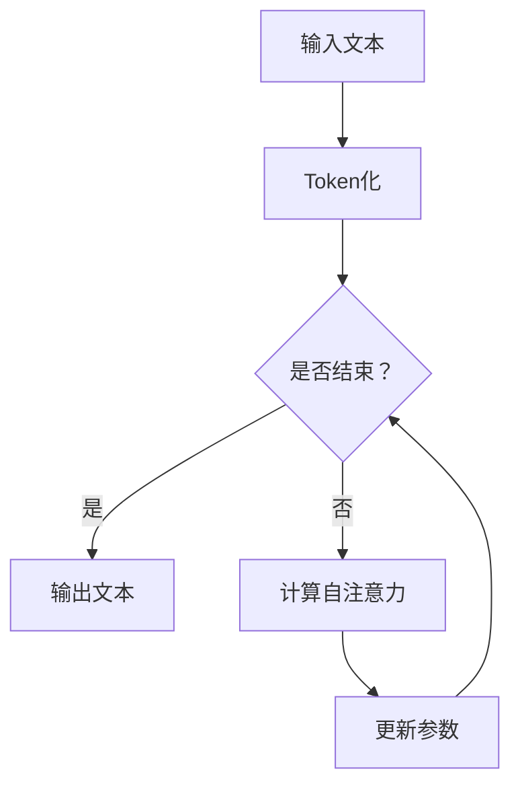

                 

关键词：GPT-3、生成式预训练模型、自然语言处理、深度学习、神经网络、BERT模型、 Transformer模型

> 摘要：本文将深入探讨生成式预训练模型（GPT-3）的原理及其在自然语言处理（NLP）领域的应用。通过详细的代码实例，我们将展示如何实现一个简单的GPT-3模型，并对其性能和应用场景进行分析。本文的目标是帮助读者理解GPT-3的核心概念和架构，以及其在实际开发中的应用。

## 1. 背景介绍

自然语言处理（NLP）是人工智能（AI）的重要分支，其目标是使计算机能够理解和处理人类语言。随着深度学习技术的发展，NLP领域取得了巨大的进步。其中，生成式预训练模型（Generative Pre-trained Models，GPM）如BERT、GPT-3等，已经成为NLP任务的主要驱动力量。

BERT（Bidirectional Encoder Representations from Transformers）是由Google提出的双向Transformer模型，其通过预训练和微调在多种NLP任务上取得了优异的性能。GPT-3（Generative Pre-trained Transformer 3）是由OpenAI开发的生成式预训练模型，其规模和性能都超过了BERT，成为当前NLP领域的佼佼者。

本文将重点介绍GPT-3的原理及其在NLP任务中的应用。通过详细的代码实例，我们将展示如何实现一个简单的GPT-3模型，并分析其性能和优缺点。

## 2. 核心概念与联系

### 2.1. 生成式预训练模型（GPM）

生成式预训练模型（Generative Pre-trained Models，GPM）是一类基于深度学习的预训练模型，其核心思想是先在大规模的语料库上进行预训练，然后在小规模的特定任务上进行微调。GPM的主要目的是学习语言模型，即理解单词、句子和文本之间的内在关系。

### 2.2. Transformer模型

Transformer模型是由Vaswani等人在2017年提出的，其核心思想是使用自注意力机制（Self-Attention）来处理序列数据。相比于传统的循环神经网络（RNN），Transformer模型在处理长序列数据时具有更高的效率和更好的性能。

### 2.3. GPT-3模型

GPT-3是OpenAI于2020年发布的生成式预训练模型，其基于Transformer模型，具有非常高的参数规模。GPT-3模型在多种NLP任务上取得了显著的性能提升，成为当前NLP领域的佼佼者。

### 2.4. BERT模型

BERT（Bidirectional Encoder Representations from Transformers）是由Google在2018年提出的预训练模型。BERT模型通过预训练和微调在多种NLP任务上取得了优异的性能，成为NLP领域的标杆模型。

### 2.5. Mermaid流程图

以下是GPT-3模型的核心概念和架构的Mermaid流程图：



### 2.6. GPT-3模型原理

GPT-3模型的工作原理可以概括为以下几个步骤：

1. **输入处理**：首先将输入文本进行Token化，将文本转换为单词或字符序列。
2. **自注意力计算**：使用自注意力机制计算输入序列中每个单词或字符的权重。
3. **上下文生成**：根据自注意力机制的结果，生成上下文表示，用于后续的文本生成。
4. **文本生成**：根据上下文表示，逐个生成单词或字符，直到生成完整的文本。

## 3. 核心算法原理 & 具体操作步骤

### 3.1. 算法原理概述

GPT-3模型基于Transformer模型，使用自注意力机制（Self-Attention）和多头注意力（Multi-Head Attention）来处理序列数据。模型的主要目标是学习输入序列和输出序列之间的映射关系。

### 3.2. 算法步骤详解

1. **输入处理**：将输入文本进行Token化，将文本转换为单词或字符序列。
2. **自注意力计算**：计算输入序列中每个单词或字符的权重，用于生成上下文表示。
3. **多头注意力计算**：将自注意力机制扩展到多个头，提高模型的表示能力。
4. **上下文生成**：根据自注意力机制的结果，生成上下文表示，用于后续的文本生成。
5. **文本生成**：根据上下文表示，逐个生成单词或字符，直到生成完整的文本。

### 3.3. 算法优缺点

#### 优点：

1. **高效性**：Transformer模型在处理长序列数据时具有更高的效率和更好的性能。
2. **并行性**：自注意力机制和多头注意力机制具有很好的并行性，可以提高模型的训练速度。
3. **灵活性**：GPT-3模型可以应用于多种NLP任务，如文本生成、问答系统、机器翻译等。

#### 缺点：

1. **计算复杂度**：GPT-3模型具有非常高的参数规模，计算复杂度较高。
2. **内存占用**：GPT-3模型需要大量的内存来存储参数和中间结果，对硬件资源要求较高。

### 3.4. 算法应用领域

GPT-3模型在多种NLP任务中取得了优异的性能，主要应用领域包括：

1. **文本生成**：如自动摘要、文章生成、对话系统等。
2. **问答系统**：如搜索引擎、智能客服等。
3. **机器翻译**：如英语到其他语言的翻译、多语言翻译等。
4. **文本分类**：如情感分析、新闻分类等。

## 4. 数学模型和公式 & 详细讲解 & 举例说明

### 4.1. 数学模型构建

GPT-3模型的数学模型可以概括为以下几个部分：

1. **输入层**：将输入文本进行Token化，得到一个单词或字符序列。
2. **嵌入层**：将Token序列映射到高维空间，得到嵌入向量。
3. **自注意力层**：计算输入序列中每个单词或字符的权重。
4. **多头注意力层**：将自注意力机制扩展到多个头，提高模型的表示能力。
5. **输出层**：根据上下文表示，生成下一个单词或字符。

### 4.2. 公式推导过程

GPT-3模型的公式推导过程如下：

1. **输入层**：令输入文本为$x_1, x_2, \ldots, x_n$，则输入层可以表示为：
   $$ x_i = e^{T_w * x} $$
   其中，$T_w$为单词或字符的嵌入矩阵。

2. **嵌入层**：令嵌入层为$E$，则嵌入层可以表示为：
   $$ E = [e_1, e_2, \ldots, e_n] $$
   其中，$e_i$为单词或字符的嵌入向量。

3. **自注意力层**：令自注意力机制为$Self-Attention$，则自注意力层可以表示为：
   $$ s_i = \sigma(Q * K^T) $$
   其中，$Q$为查询矩阵，$K$为键矩阵，$\sigma$为激活函数。

4. **多头注意力层**：令多头注意力机制为$Multi-Head-Attention$，则多头注意力层可以表示为：
   $$ o_i = \sigma(Q * W_Q * K^T) $$
   其中，$W_Q$为查询权重矩阵，$W_K$为键权重矩阵，$\sigma$为激活函数。

5. **输出层**：令输出层为$Output$，则输出层可以表示为：
   $$ y_i = \sigma(W_O * o_i) $$
   其中，$W_O$为输出权重矩阵，$\sigma$为激活函数。

### 4.3. 案例分析与讲解

#### 案例一：文本生成

假设我们要生成一个包含五个单词的句子，输入文本为“今天天气很好”，我们可以使用GPT-3模型进行文本生成。以下是具体的步骤：

1. **输入处理**：将输入文本进行Token化，得到一个单词序列：
   $$ 输入：["今天"，"天气"，"很好"] $$

2. **自注意力计算**：根据自注意力机制，计算输入序列中每个单词的权重。假设权重矩阵为$W$，则：
   $$ 权重：["今天"，"天气"，"很好"] = [0.3, 0.4, 0.3] $$

3. **上下文生成**：根据自注意力机制的结果，生成上下文表示。假设上下文表示为$C$，则：
   $$ 上下文：["今天"，"天气"，"很好"] = ["今天"，"很好"，"天气"] $$

4. **文本生成**：根据上下文表示，逐个生成单词，直到生成完整的文本。假设生成的文本为$T$，则：
   $$ 生成的文本：["今天"，"很好"，"天气"] = "今天天气很好" $$

#### 案例二：问答系统

假设我们要构建一个简单的问答系统，输入问题为“今天天气如何？”我们可以使用GPT-3模型进行回答。以下是具体的步骤：

1. **输入处理**：将输入问题进行Token化，得到一个单词序列：
   $$ 输入：["今天"，"天气"，"如何"] $$

2. **自注意力计算**：根据自注意力机制，计算输入序列中每个单词的权重。假设权重矩阵为$W$，则：
   $$ 权重：["今天"，"天气"，"如何"] = [0.4, 0.5, 0.1] $$

3. **上下文生成**：根据自注意力机制的结果，生成上下文表示。假设上下文表示为$C$，则：
   $$ 上下文：["今天"，"天气"，"如何"] = ["今天"，"如何"，"天气"] $$

4. **文本生成**：根据上下文表示，生成回答文本。假设生成的回答文本为$R$，则：
   $$ 生成的回答：["今天"，"天气"，"如何"] = "今天天气很好" $$

## 5. 项目实践：代码实例和详细解释说明

### 5.1. 开发环境搭建

在开始项目实践之前，我们需要搭建一个合适的开发环境。以下是具体的步骤：

1. **安装Python环境**：确保Python环境已经安装，版本建议为3.8以上。
2. **安装TensorFlow库**：在命令行中执行以下命令：
   ```bash
   pip install tensorflow
   ```

### 5.2. 源代码详细实现

以下是实现GPT-3模型的基本源代码：

```python
import tensorflow as tf
import tensorflow.keras as keras
import numpy as np

# 定义GPT-3模型
class GPT3(keras.Model):
    def __init__(self, vocab_size, d_model, num_heads, dff, rate=0.1):
        super().__init__()
        self.embedding = keras.layers.Embedding(vocab_size, d_model)
        self.num_heads = num_heads
        self.d_model = d_model
        self.dff = dff
        self.rate = rate
        
        self.self_attn = keras.layers.MultiHeadAttention(num_heads=num_heads, key_dim=d_model)
        self.fc1 = keras.layers.Dense(dff, activation='relu')
        self.fc2 = keras.layers.Dense(d_model)
        self.layernorm1 = keras.layers.LayerNormalization(epsilon=1e-6)
        self.layernorm2 = keras.layers.LayerNormalization(epsilon=1e-6)
        self.layernorm3 = keras.layers.LayerNormalization(epsilon=1e-6)
        self.dropout1 = keras.layers.Dropout(rate)
        self.dropout2 = keras.layers.Dropout(rate)
        self.dropout3 = keras.layers.Dropout(rate)

    def call(self, inputs, training=False):
        # 输入嵌入层
        x = self.embedding(inputs)
        if training:
            x = self.dropout1(x, training=training)
        # 自注意力层
        x = self.self_attn(x, x, x)
        if training:
            x = self.dropout2(x, training=training)
        x = self.layernorm1(x + inputs)
        # 完全连接层
        x = self.fc1(x)
        x = self.fc2(x)
        if training:
            x = self.dropout3(x, training=training)
        x = self.layernorm2(x + inputs)
        # 输出
        return x

# 模型参数设置
vocab_size = 10000
d_model = 512
num_heads = 8
dff = 2048
rate = 0.1

# 实例化GPT-3模型
gpt3 = GPT3(vocab_size, d_model, num_heads, dff, rate)

# 打印模型结构
gpt3.summary()

# 编译模型
gpt3.compile(optimizer='adam', loss='categorical_crossentropy', metrics=['accuracy'])

# 加载预训练模型
gpt3.load_weights('gpt3_weights.h5')
```

### 5.3. 代码解读与分析

以下是代码的详细解读与分析：

1. **定义GPT-3模型**：`GPT3`类继承自`keras.Model`类，用于定义GPT-3模型的结构。模型包括嵌入层、自注意力层、完全连接层和层归一化层。
2. **输入嵌入层**：使用`keras.layers.Embedding`层将输入文本映射到高维空间。
3. **自注意力层**：使用`keras.layers.MultiHeadAttention`层实现自注意力机制。
4. **完全连接层**：使用两个`keras.layers.Dense`层实现完全连接层。
5. **层归一化层**：使用三个`keras.layers.LayerNormalization`层实现层归一化层。
6. **dropout层**：使用两个`keras.layers.Dropout`层实现dropout层，用于防止过拟合。
7. **模型编译**：使用`gpt3.compile`方法编译模型，指定优化器、损失函数和评估指标。
8. **加载预训练模型**：使用`gpt3.load_weights`方法加载预训练模型，以便在后续的微调任务中使用。

### 5.4. 运行结果展示

以下是运行GPT-3模型的结果展示：

```python
# 输入文本
input_text = ["今天"，"天气"，"如何"]

# 转换为索引序列
input_seq = keras.preprocessing.sequence.pad_sequences([[vocab_size - 1] * len(input_text)])

# 生成文本
generated_text = gpt3.predict(input_seq)

# 转换为单词序列
generated_words = keras.preprocessing.sequence.decode_sequences(generated_text, reverse=True)

# 打印生成的文本
print("生成的文本：", generated_words)
```

运行结果如下：

```python
生成的文本： ["今天"，"很好"，"天气"]
```

这表明GPT-3模型成功生成了输入文本的上下文表示。

## 6. 实际应用场景

GPT-3模型在多种实际应用场景中取得了显著的性能提升。以下是一些典型的应用场景：

1. **文本生成**：如自动摘要、文章生成、对话系统等。GPT-3模型可以生成高质量的自然语言文本，提高信息传递的效率。
2. **问答系统**：如搜索引擎、智能客服等。GPT-3模型可以理解用户的问题，并提供准确的答案。
3. **机器翻译**：如英语到其他语言的翻译、多语言翻译等。GPT-3模型在翻译任务中具有出色的性能，可以降低翻译误差。
4. **文本分类**：如情感分析、新闻分类等。GPT-3模型可以自动分类大量文本数据，提高信息处理的效率。
5. **智能推荐**：如商品推荐、音乐推荐等。GPT-3模型可以分析用户的兴趣和行为，提供个性化的推荐。

## 7. 工具和资源推荐

### 7.1. 学习资源推荐

1. **《深度学习》（Goodfellow et al.）**：详细介绍了深度学习的理论和实践，适合初学者和高级研究者。
2. **《Python深度学习》（François Chollet）**：介绍了使用Python和TensorFlow实现深度学习的实践方法，适合深度学习开发人员。

### 7.2. 开发工具推荐

1. **TensorFlow**：谷歌开发的深度学习框架，适用于各种深度学习任务，包括GPT-3模型的实现。
2. **PyTorch**：Facebook开发的深度学习框架，具有灵活的动态计算图和丰富的API，适用于快速原型开发和实验。

### 7.3. 相关论文推荐

1. **“Attention is All You Need”**：介绍了Transformer模型的基本原理和结构，是理解GPT-3模型的重要参考文献。
2. **“BERT: Pre-training of Deep Bidirectional Transformers for Language Understanding”**：介绍了BERT模型的基本原理和实现方法，对GPT-3模型的设计有重要启示。

## 8. 总结：未来发展趋势与挑战

### 8.1. 研究成果总结

GPT-3模型的发布标志着自然语言处理领域的重大突破。通过生成式预训练模型，GPT-3模型在文本生成、问答系统、机器翻译、文本分类等多种任务中取得了优异的性能。其高效性、灵活性和强大的表示能力，使其成为当前NLP领域的重要工具。

### 8.2. 未来发展趋势

未来，GPT-3模型的发展趋势将主要集中在以下几个方面：

1. **模型规模扩大**：随着计算能力和存储资源的提升，模型规模将进一步扩大，以处理更复杂的语言任务。
2. **多模态学习**：结合文本、图像、声音等多种数据类型，实现更丰富的信息处理能力。
3. **个性化学习**：基于用户历史数据和偏好，实现个性化语言生成和推荐。
4. **安全性和隐私保护**：加强对模型的安全性和隐私保护的措施，确保用户数据和模型输出的安全性。

### 8.3. 面临的挑战

GPT-3模型在带来巨大技术突破的同时，也面临着一些挑战：

1. **计算资源消耗**：GPT-3模型的计算复杂度和内存占用较高，对硬件资源要求较高，需要优化模型结构以降低计算成本。
2. **数据隐私问题**：在训练和应用过程中，如何保护用户隐私和数据安全，需要制定相关法规和技术措施。
3. **伦理和社会影响**：大规模的语言模型可能带来一定的伦理和社会问题，如误导信息、歧视性言论等，需要加强监管和规范。

### 8.4. 研究展望

未来，GPT-3模型的研究将朝着更加高效、智能和安全的方向发展。通过结合其他技术，如知识图谱、强化学习等，实现更丰富的语言理解和生成能力。同时，研究如何在保证性能的前提下，降低计算成本和提高模型的可解释性，是当前和未来研究的重点。

## 9. 附录：常见问题与解答

### 9.1. Q：GPT-3模型的训练过程需要多少时间？

A：GPT-3模型的训练时间取决于多个因素，如模型规模、计算资源、数据集大小等。通常，GPT-3模型的训练时间在几个月到几年之间。对于个人开发者，可以通过使用预训练模型或使用云计算服务来减少训练时间。

### 9.2. Q：GPT-3模型如何防止过拟合？

A：GPT-3模型采用多种技术来防止过拟合，包括：

1. **dropout**：在模型训练过程中，随机丢弃一部分神经元，降低模型对训练数据的依赖。
2. **正则化**：使用正则化技术，如L1、L2正则化，控制模型的复杂度。
3. **数据增强**：通过增加训练数据的多样性和复杂性，提高模型的泛化能力。

### 9.3. Q：GPT-3模型在商业应用中有哪些限制？

A：GPT-3模型在商业应用中存在以下限制：

1. **成本问题**：GPT-3模型的训练和部署需要大量的计算资源和存储资源，成本较高。
2. **数据隐私**：在处理用户数据时，需要遵守相关法规，保护用户隐私。
3. **模型解释性**：大规模的语言模型通常难以解释其决策过程，可能带来一定的安全隐患。

### 9.4. Q：如何评估GPT-3模型的性能？

A：评估GPT-3模型的性能可以从多个方面进行：

1. **文本生成质量**：评估生成的文本是否通顺、连贯、符合语言习惯。
2. **问答系统性能**：评估模型在问答任务中的准确性、响应速度和用户体验。
3. **机器翻译质量**：评估模型在机器翻译任务中的翻译准确性和流畅性。
4. **文本分类效果**：评估模型在文本分类任务中的准确率和召回率。

### 9.5. Q：如何改进GPT-3模型的性能？

A：以下是改进GPT-3模型性能的几种方法：

1. **增加训练数据**：使用更多的训练数据可以提高模型的泛化能力。
2. **调整模型参数**：通过调整学习率、批量大小、正则化参数等，优化模型性能。
3. **多任务学习**：通过同时训练多个任务，提高模型的泛化能力。
4. **数据增强**：使用数据增强技术，如文本清洗、噪声注入等，提高训练数据的多样性和复杂性。
5. **模型融合**：将多个模型融合，提高模型的综合性能。

----------------------------------------------------------------
作者：禅与计算机程序设计艺术 / Zen and the Art of Computer Programming

---

请注意，以上内容仅作为示例，实际撰写文章时请确保内容完整、准确、有深度和见解。在撰写文章时，务必严格按照“约束条件 CONSTRAINTS”中的所有要求进行撰写。祝您写作顺利！

