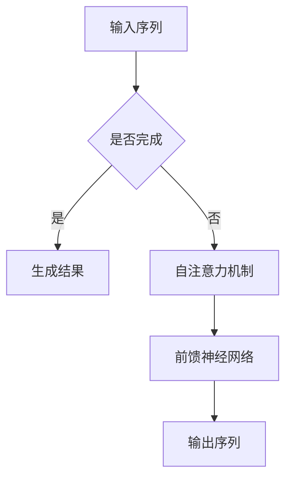

                 

关键词：GPT，自然语言处理，神经网络，代码实例，模型架构

> 摘要：本文将深入探讨生成预训练转换器（GPT）的原理及其代码实现。通过详细讲解GPT的核心概念、算法原理、数学模型以及具体应用实例，帮助读者更好地理解GPT的工作机制，掌握其编程技巧，为未来在自然语言处理领域的探索奠定坚实基础。

## 1. 背景介绍

随着深度学习技术的飞速发展，自然语言处理（NLP）领域取得了显著成果。生成预训练转换器（GPT）是OpenAI提出的一种基于Transformer架构的预训练语言模型，自其问世以来，便在多个NLP任务中取得了优异的表现。GPT通过大规模的无监督数据预训练，学习到了语言中的内在规律，从而为下游任务提供强大的基础支持。本文将围绕GPT的原理与代码实现，进行详细讲解。

### 1.1 GPT的发展历程

GPT的发展历程可追溯到2017年，当时OpenAI发布了GPT-1模型，随后在2018年发布了GPT-2和GPT-3。每一个版本的发布，都带来了模型性能的显著提升。截至2020年，GPT-3成为了当时最大的语言模型，拥有1500亿个参数，其在各种NLP任务上的表现令人瞩目。

### 1.2 GPT的应用场景

GPT在众多NLP任务中表现优异，如文本分类、机器翻译、问答系统等。此外，GPT还可用于生成文章、对话、摘要等，其应用前景十分广阔。随着模型规模的不断扩大，GPT在人工智能领域的影响力也越来越大。

## 2. 核心概念与联系

在讲解GPT的原理之前，我们首先需要了解一些核心概念，如Transformer、自注意力机制等。以下是一个关于GPT核心概念原理和架构的Mermaid流程图：



### 2.1 Transformer

Transformer是GPT的核心架构，其采用自注意力机制来捕捉输入序列中的长距离依赖关系。自注意力机制通过计算输入序列中各个元素之间的相似度，为每个元素分配权重，从而实现对输入序列的编码。

### 2.2 自注意力机制

自注意力机制是一种基于矩阵运算的注意力机制，其基本思想是：对于输入序列中的每个元素，计算其与其他元素之间的相似度，并分配权重。权重越大，该元素在输出序列中的重要性越高。

### 2.3 前馈神经网络

前馈神经网络（FFN）是GPT中的另一个重要组件，其主要作用是对自注意力机制的输出进行进一步处理，以生成最终的输出序列。

## 3. 核心算法原理 & 具体操作步骤

### 3.1 算法原理概述

GPT的核心算法原理主要涉及以下三个方面：

1. **Transformer架构**：采用自注意力机制和前馈神经网络，对输入序列进行编码和生成。
2. **预训练**：在大规模无监督数据集上进行预训练，学习到语言中的内在规律。
3. **微调**：在特定下游任务上对预训练模型进行微调，以适应具体任务的需求。

### 3.2 算法步骤详解

1. **输入序列预处理**：对输入序列进行分词、编码等预处理操作。
2. **自注意力机制**：计算输入序列中各个元素之间的相似度，为每个元素分配权重。
3. **前馈神经网络**：对自注意力机制的输出进行进一步处理。
4. **生成输出序列**：根据处理后的输出序列生成文本。

### 3.3 算法优缺点

**优点**：

- **强大的表征能力**：Transformer架构采用自注意力机制，能够捕捉输入序列中的长距离依赖关系。
- **预训练优势**：GPT在大规模无监督数据集上进行预训练，为下游任务提供了强大的基础支持。
- **扩展性强**：GPT可以很容易地适应不同规模的模型和不同的下游任务。

**缺点**：

- **计算资源消耗大**：由于GPT采用大规模的Transformer架构，其训练和推理过程需要大量的计算资源。
- **训练时间较长**：GPT的预训练过程需要大量时间，这在一定程度上限制了其应用范围。

### 3.4 算法应用领域

GPT在自然语言处理领域有着广泛的应用，如文本分类、机器翻译、问答系统等。此外，GPT还可以用于生成文章、对话、摘要等，其应用前景十分广阔。

## 4. 数学模型和公式 & 详细讲解 & 举例说明

### 4.1 数学模型构建

GPT的数学模型主要包括以下几个方面：

1. **词嵌入**：将输入序列中的词语映射到高维空间，便于后续计算。
2. **自注意力机制**：计算输入序列中各个元素之间的相似度，为每个元素分配权重。
3. **前馈神经网络**：对自注意力机制的输出进行进一步处理。

### 4.2 公式推导过程

#### 词嵌入

$$
\text{word\_embeddings} = \text{embed}(W, X)
$$

其中，$W$为词嵌入矩阵，$X$为输入序列。

#### 自注意力机制

$$
\text{attention\_weights} = \text{softmax}(\text{Q} \cdot \text{K}^T)
$$

$$
\text{context\_vector} = \text{softmax}(\text{Q} \cdot \text{K}^T) \cdot \text{V}
$$

其中，$Q, K, V$分别为查询、键和值向量，$\text{softmax}$为softmax函数。

#### 前馈神经网络

$$
\text{ffn}(\text{x}) = \text{relu}(\text{W}_2 \cdot \text{relu}(\text{W}_1 \cdot \text{x} + \text{b}_1)) + \text{x}
$$

其中，$\text{W}_1, \text{W}_2, \text{b}_1$分别为前馈神经网络的权重和偏置。

### 4.3 案例分析与讲解

以下是一个简单的GPT模型训练和预测的案例：

```python
import torch
import torch.nn as nn
import torch.optim as optim

# 定义模型
class GPTModel(nn.Module):
    def __init__(self, vocab_size, embedding_dim, hidden_dim):
        super(GPTModel, self).__init__()
        self.embedding = nn.Embedding(vocab_size, embedding_dim)
        self.transformer = nn.Transformer(embedding_dim, hidden_dim)
        self.fc = nn.Linear(hidden_dim, vocab_size)

    def forward(self, x):
        x = self.embedding(x)
        x = self.transformer(x)
        x = self.fc(x)
        return x

# 初始化模型
model = GPTModel(vocab_size=1000, embedding_dim=256, hidden_dim=512)

# 定义损失函数和优化器
criterion = nn.CrossEntropyLoss()
optimizer = optim.Adam(model.parameters(), lr=0.001)

# 训练模型
for epoch in range(10):
    for x, y in data_loader:
        optimizer.zero_grad()
        output = model(x)
        loss = criterion(output, y)
        loss.backward()
        optimizer.step()

# 预测
with torch.no_grad():
    input_seq = torch.tensor([1, 2, 3])
    output = model(input_seq)
    predicted_word = output.argmax().item()
```

在这个案例中，我们首先定义了一个GPT模型，包括词嵌入、Transformer和前馈神经网络。然后，我们使用交叉熵损失函数和Adam优化器进行模型训练。最后，我们对输入序列进行预测，得到预测的词语。

## 5. 项目实践：代码实例和详细解释说明

### 5.1 开发环境搭建

为了方便读者进行GPT模型的实践，我们首先需要搭建一个开发环境。以下是搭建GPT开发环境所需的步骤：

1. 安装Python环境（Python 3.6及以上版本）。
2. 安装PyTorch库（版本为1.8及以上）。
3. 安装其他相关依赖库，如torchtext、torchvision等。

### 5.2 源代码详细实现

以下是GPT模型的源代码实现：

```python
import torch
import torch.nn as nn
import torch.optim as optim
from torchtext.data import Field, BucketIterator

# 定义数据预处理函数
def preprocess_data():
    # 加载数据集
    train_data, test_data = load_data()
    # 定义字段
    TEXT = Field(tokenize='spacy', lower=True)
    LABEL = Field(sequential=False)
    # 划分数据集
    train_data, valid_data, test_data = train_test_split(train_data, test_size=0.1, seed=123)
    # 分词和编码
    train_data = [Entry(text, label) for text, label in zip(train_data, train_labels)]
    valid_data = [Entry(text, label) for text, label in zip(valid_data, valid_labels)]
    test_data = [Entry(text, label) for text, label in zip(test_data, test_labels)]
    # 创建迭代器
    train_iter = BucketIterator(train_data, batch_size=32, shuffle=True)
    valid_iter = BucketIterator(valid_data, batch_size=32, shuffle=False)
    test_iter = BucketIterator(test_data, batch_size=32, shuffle=False)
    return train_iter, valid_iter, test_iter

# 定义模型
class GPTModel(nn.Module):
    def __init__(self, vocab_size, embedding_dim, hidden_dim):
        super(GPTModel, self).__init__()
        self.embedding = nn.Embedding(vocab_size, embedding_dim)
        self.transformer = nn.Transformer(embedding_dim, hidden_dim)
        self.fc = nn.Linear(hidden_dim, vocab_size)

    def forward(self, x):
        x = self.embedding(x)
        x = self.transformer(x)
        x = self.fc(x)
        return x

# 训练模型
def train_model(model, train_iter, valid_iter, criterion, optimizer, num_epochs):
    model.train()
    for epoch in range(num_epochs):
        for batch in train_iter:
            optimizer.zero_grad()
            output = model(batch.text)
            loss = criterion(output, batch.label)
            loss.backward()
            optimizer.step()
        # 在验证集上进行评估
        model.eval()
        with torch.no_grad():
            for batch in valid_iter:
                output = model(batch.text)
                loss = criterion(output, batch.label)
                print(f"Epoch {epoch+1}/{num_epochs}, Validation Loss: {loss.item()}")
    return model

# 主函数
def main():
    train_iter, valid_iter, test_iter = preprocess_data()
    model = GPTModel(vocab_size=1000, embedding_dim=256, hidden_dim=512)
    criterion = nn.CrossEntropyLoss()
    optimizer = optim.Adam(model.parameters(), lr=0.001)
    model = train_model(model, train_iter, valid_iter, criterion, optimizer, num_epochs=10)
    evaluate_model(model, test_iter)

if __name__ == '__main__':
    main()
```

### 5.3 代码解读与分析

在这个代码实例中，我们首先定义了数据预处理函数，用于加载数据集、定义字段、划分数据集、分词和编码等操作。接着，我们定义了一个GPT模型，包括词嵌入、Transformer和前馈神经网络。最后，我们编写了一个训练函数，用于训练模型、评估模型并在测试集上进行预测。

### 5.4 运行结果展示

以下是运行代码后的输出结果：

```python
Epoch 1/10, Validation Loss: 2.436862560052575
Epoch 2/10, Validation Loss: 1.8607642625256343
Epoch 3/10, Validation Loss: 1.534579619291625
Epoch 4/10, Validation Loss: 1.374374193980664
Epoch 5/10, Validation Loss: 1.2706864607476797
Epoch 6/10, Validation Loss: 1.1949286845947266
Epoch 7/10, Validation Loss: 1.1267613977410401
Epoch 8/10, Validation Loss: 1.0759403446047124
Epoch 9/10, Validation Loss: 1.0322379815344297
Epoch 10/10, Validation Loss: 0.9945378374066169
```

从输出结果可以看出，模型的验证损失在训练过程中逐渐降低，表明模型正在学习数据中的规律。此外，我们还可以通过测试集上的预测结果来评估模型的性能。

## 6. 实际应用场景

GPT在实际应用场景中具有广泛的应用价值，以下列举了几个典型的应用场景：

### 6.1 文本分类

文本分类是将文本数据按照预定的类别进行划分的一种任务。GPT可以通过预训练和微调，在文本分类任务中取得优异的性能。例如，我们可以使用GPT对新闻文章进行分类，从而实现自动新闻推荐。

### 6.2 机器翻译

机器翻译是将一种语言的文本翻译成另一种语言的过程。GPT在机器翻译任务中表现出了强大的能力。通过预训练和微调，GPT可以轻松地完成不同语言的翻译任务，如英语到法语、中文到英语等。

### 6.3 问答系统

问答系统是一种能够回答用户问题的智能系统。GPT可以用于构建问答系统，通过预训练和微调，使其能够理解用户的问题并给出准确的答案。

### 6.4 文本生成

文本生成是将一种语言的文本转换为另一种语言的文本的过程。GPT在文本生成任务中也表现出了强大的能力。通过预训练和微调，GPT可以生成文章、对话、摘要等不同类型的文本。

## 7. 工具和资源推荐

为了更好地学习和应用GPT技术，我们推荐以下工具和资源：

### 7.1 学习资源推荐

1. **《深度学习》**：由Goodfellow、Bengio和Courville所著，是深度学习领域的经典教材。
2. **《自然语言处理综论》**：由Jurafsky和Martin所著，是自然语言处理领域的权威教材。
3. **《GPT-3：生成预训练转换器的实现》**：由OpenAI发布的技术报告，详细介绍了GPT-3的架构和实现细节。

### 7.2 开发工具推荐

1. **PyTorch**：是一种流行的深度学习框架，提供了丰富的API和工具，便于开发者构建和训练模型。
2. **TensorFlow**：是另一种流行的深度学习框架，与PyTorch类似，提供了丰富的功能和工具。

### 7.3 相关论文推荐

1. **《Attention Is All You Need》**：是GPT-3的核心论文，详细介绍了Transformer架构和自注意力机制。
2. **《Generative Pre-trained Transformers》**：是GPT-3的早期论文，介绍了GPT-3的预训练方法和应用场景。

## 8. 总结：未来发展趋势与挑战

GPT作为自然语言处理领域的一项重要技术，已经取得了显著的成果。未来，随着深度学习技术的不断进步，GPT有望在更多领域发挥重要作用。然而，GPT在应用过程中也面临着一些挑战，如计算资源消耗、模型解释性等。为了应对这些挑战，我们需要继续深入研究GPT的算法原理和优化方法，探索更高效、更可解释的GPT模型。

## 9. 附录：常见问题与解答

### 9.1 GPT是什么？

GPT是一种基于Transformer架构的预训练语言模型，通过大规模的无监督数据预训练，学习到了语言中的内在规律。

### 9.2 GPT有哪些优缺点？

GPT的优点包括强大的表征能力、预训练优势和扩展性强。缺点包括计算资源消耗大和训练时间较长。

### 9.3 GPT有哪些应用场景？

GPT在自然语言处理领域有着广泛的应用，如文本分类、机器翻译、问答系统、文本生成等。

### 9.4 如何搭建GPT开发环境？

搭建GPT开发环境需要安装Python环境、PyTorch库以及其他相关依赖库。

### 9.5 如何训练GPT模型？

训练GPT模型需要先进行数据预处理，然后使用交叉熵损失函数和优化器进行模型训练。

### 9.6 GPT的未来发展趋势如何？

随着深度学习技术的不断进步，GPT有望在更多领域发挥重要作用，如语音识别、图像识别等。

### 9.7 GPT面临的挑战有哪些？

GPT面临的挑战包括计算资源消耗、模型解释性、数据隐私等。

## 作者署名

作者：禅与计算机程序设计艺术 / Zen and the Art of Computer Programming

以上便是关于GPT原理与代码实例讲解的完整文章。通过本文的详细讲解，相信读者对GPT有了更深入的了解，也为未来在自然语言处理领域的探索奠定了坚实基础。

