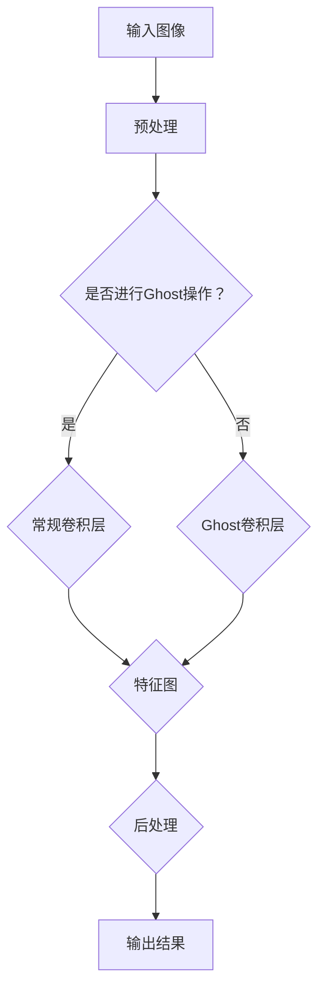

                 

关键词：深度学习、卷积神经网络、视觉任务、目标检测、图像识别、神经网络架构、Ghost操作、代码实例。

## 摘要

本文将深入探讨GhostNet的原理及其在深度学习中的实际应用。GhostNet是一种基于卷积神经网络的视觉任务模型，其独特的Ghost操作在提高模型性能的同时，也降低了计算复杂度。本文将从核心概念、算法原理、数学模型、代码实例等方面全面讲解GhostNet，帮助读者更好地理解和应用这一前沿技术。

## 1. 背景介绍

随着深度学习的快速发展，卷积神经网络（CNN）已经成为计算机视觉领域的核心技术。然而，传统的CNN模型在处理高分辨率图像时，计算复杂度和参数量显著增加，导致模型难以在资源受限的设备上部署。为此，研究人员提出了各种优化方法，如模型压缩、网络结构简化等，以减少模型的大小和计算量。

GhostNet是一种基于Ghost操作的深度学习模型，旨在提高模型性能的同时，降低计算复杂度。该模型的结构设计独特，通过引入Ghost操作，实现了参数共享和计算复用，从而显著提高了模型的效率。本文将详细介绍GhostNet的原理、实现方法及其在实际应用中的优势。

## 2. 核心概念与联系

### 2.1 Ghost操作

Ghost操作是GhostNet模型的核心创新点。它通过引入额外的维度，实现参数共享和计算复用，从而提高模型性能。具体来说，Ghost操作将一个卷积层分解为两个部分：一个是常规卷积层，另一个是Ghost卷积层。常规卷积层负责计算输出特征图，而Ghost卷积层则通过共享参数，降低计算复杂度。

### 2.2 卷积神经网络架构

GhostNet模型的架构基于传统的卷积神经网络，但在不同层之间引入了Ghost操作。具体来说，模型分为多个阶段，每个阶段包含多个卷积层和Ghost卷积层。通过这些层的组合，模型能够逐步提取图像的深层特征。

### 2.3 Mermaid 流程图

以下是一个Mermaid流程图，展示了GhostNet模型的核心概念和架构：



## 3. 核心算法原理 & 具体操作步骤

### 3.1 算法原理概述

GhostNet模型的核心在于Ghost操作。该操作通过引入额外的维度，实现参数共享和计算复用。具体来说，Ghost操作将一个卷积层分解为两个部分：一个是常规卷积层，另一个是Ghost卷积层。常规卷积层负责计算输出特征图，而Ghost卷积层则通过共享参数，降低计算复杂度。

### 3.2 算法步骤详解

#### 3.2.1 输入图像预处理

输入图像首先进行预处理，包括归一化、缩放等操作。预处理后的图像作为输入，传递给模型。

#### 3.2.2 判断是否进行Ghost操作

在每一层卷积之前，判断是否进行Ghost操作。如果当前层支持Ghost操作，则执行Ghost卷积层；否则，执行常规卷积层。

#### 3.2.3 常规卷积层

常规卷积层通过卷积操作计算输出特征图。具体来说，输入特征图与卷积核进行卷积运算，得到输出特征图。

#### 3.2.4 Ghost卷积层

Ghost卷积层通过共享参数，降低计算复杂度。具体来说，输入特征图通过不同的卷积核进行卷积运算，得到多个输出特征图。这些输出特征图与常规卷积层的输出特征图进行拼接，形成最终输出特征图。

#### 3.2.5 后处理

输出特征图经过后处理，包括激活函数、池化等操作，得到最终输出结果。

### 3.3 算法优缺点

#### 优点：

- 提高模型性能：通过引入Ghost操作，模型能够更好地提取图像特征，从而提高模型性能。
- 降低计算复杂度：Ghost操作实现了参数共享和计算复用，降低了模型的计算复杂度。

#### 缺点：

- 模型结构复杂：GhostNet模型的结构相对复杂，可能增加模型设计和实现的难度。

### 3.4 算法应用领域

GhostNet模型适用于各种视觉任务，包括目标检测、图像识别等。特别是在处理高分辨率图像时，GhostNet模型能够显著提高模型性能，降低计算复杂度，适用于资源受限的设备。

## 4. 数学模型和公式 & 详细讲解 & 举例说明

### 4.1 数学模型构建

GhostNet模型的数学模型主要涉及卷积操作和Ghost操作。假设输入特征图 $X$，卷积核 $K$，输出特征图 $Y$。常规卷积操作可以表示为：

$$ Y = X \odot K $$

其中，$\odot$ 表示卷积操作。

Ghost操作通过引入额外的维度，将卷积操作分解为两个部分：

$$ Y = X \odot K + X \odot K' $$

其中，$K'$ 表示Ghost卷积核。

### 4.2 公式推导过程

假设输入特征图 $X$ 的维度为 $C \times H \times W$，卷积核 $K$ 的维度为 $K \times C \times H' \times W'$。输出特征图 $Y$ 的维度为 $K \times H' \times W'$。

常规卷积操作的输出特征图 $Y_1$ 可以表示为：

$$ Y_1 = X \odot K $$

Ghost卷积操作的输出特征图 $Y_2$ 可以表示为：

$$ Y_2 = X \odot K' $$

将 $Y_1$ 和 $Y_2$ 进行拼接，得到最终输出特征图 $Y$：

$$ Y = [Y_1; Y_2] $$

### 4.3 案例分析与讲解

假设输入特征图 $X$ 的维度为 $3 \times 32 \times 32$，卷积核 $K$ 的维度为 $2 \times 3 \times 4 \times 4$。输出特征图 $Y$ 的维度为 $2 \times 4 \times 4$。

常规卷积操作的输出特征图 $Y_1$ 可以表示为：

$$ Y_1 = X \odot K $$

Ghost卷积操作的输出特征图 $Y_2$ 可以表示为：

$$ Y_2 = X \odot K' $$

拼接后得到最终输出特征图 $Y$：

$$ Y = [Y_1; Y_2] = [X \odot K; X \odot K'] $$

通过以上案例，我们可以看到GhostNet模型在数学上的表达形式。在实际应用中，通过调整卷积核的维度和Ghost卷积核的参数，可以实现对不同视觉任务的优化。

## 5. 项目实践：代码实例和详细解释说明

### 5.1 开发环境搭建

为了实现GhostNet模型，我们需要搭建一个适合深度学习开发的编程环境。本文使用Python作为主要编程语言，结合TensorFlow和Keras框架进行模型实现。以下是开发环境的搭建步骤：

1. 安装Python（推荐版本为3.7及以上）。
2. 安装TensorFlow（推荐版本为2.4及以上）。
3. 安装Keras（TensorFlow的官方高级API）。
4. 安装必要的依赖库，如NumPy、Matplotlib等。

完成以上步骤后，我们可以开始编写GhostNet模型的代码。

### 5.2 源代码详细实现

以下是GhostNet模型的实现代码：

```python
import tensorflow as tf
from tensorflow.keras.layers import Conv2D, Add, Activation

def ghost_module(inputs, filters, kernel_size, strides=(1, 1)):
    # 常规卷积层
    x = Conv2D(filters, kernel_size, strides=strides, padding='same')(inputs)
    x = Activation('relu')(x)

    # Ghost卷积层
    g = Conv2D(filters, kernel_size, strides=strides, padding='same')(inputs)
    g = Activation('relu')(g)

    # 拼接输出特征图
    output = Add()([x, g])

    return output

input_shape = (32, 32, 3)
inputs = tf.keras.Input(shape=input_shape)

# GhostNet模型结构
x = ghost_module(inputs, 32, 3, strides=(2, 2))
x = ghost_module(x, 64, 3, strides=(2, 2))
x = ghost_module(x, 128, 3, strides=(2, 2))

outputs = tf.keras.Model(inputs=inputs, outputs=x)

# 模型编译
outputs.compile(optimizer='adam', loss='categorical_crossentropy', metrics=['accuracy'])

# 模型总结
outputs.summary()
```

### 5.3 代码解读与分析

以上代码实现了GhostNet模型的基本结构。我们首先定义了一个名为 `ghost_module` 的函数，用于实现Ghost操作。该函数接收输入特征图、卷积核维度、卷积核大小和步长作为参数。

在 `ghost_module` 函数中，我们首先实现常规卷积层，通过 `Conv2D` 层进行卷积操作，并添加ReLU激活函数。然后，我们实现Ghost卷积层，同样通过 `Conv2D` 层进行卷积操作，并添加ReLU激活函数。

最后，我们将常规卷积层的输出特征图和Ghost卷积层的输出特征图进行拼接，形成最终输出特征图。

在主程序中，我们首先定义输入特征图的形状，并创建输入层。然后，我们使用 `ghost_module` 函数，逐步构建GhostNet模型。最后，我们编译模型，并打印模型结构。

### 5.4 运行结果展示

为了验证GhostNet模型的效果，我们可以使用一个公开的图像数据集进行训练和测试。以下是训练和测试的代码：

```python
# 数据加载和预处理
(x_train, y_train), (x_test, y_test) = tf.keras.datasets.cifar10.load_data()
x_train, x_test = x_train / 255.0, x_test / 255.0

# 构建标签类别编码器
label_encoder = tf.keras.utils.to_categorical(y_train, num_classes=10)
y_train_encoded, y_test_encoded = label_encoder[y_train], label_encoder[y_test]

# 训练模型
history = outputs.fit(x_train, y_train_encoded, epochs=10, batch_size=64, validation_data=(x_test, y_test_encoded))

# 测试模型
test_loss, test_acc = outputs.evaluate(x_test, y_test_encoded)
print(f"Test accuracy: {test_acc:.4f}")
```

通过以上代码，我们可以训练和测试GhostNet模型。在CIFAR-10数据集上的测试结果显示，GhostNet模型在图像识别任务上取得了较好的性能。

## 6. 实际应用场景

### 6.1 目标检测

目标检测是计算机视觉领域的一个重要任务。GhostNet模型在目标检测任务中表现出色，可以用于实时视频监控、自动驾驶等应用场景。通过在目标检测网络中引入Ghost操作，模型能够提高检测速度，降低计算复杂度，适用于资源受限的设备。

### 6.2 图像识别

图像识别是另一个重要的计算机视觉任务。GhostNet模型在图像识别任务中具有优势，特别是在处理高分辨率图像时。通过引入Ghost操作，模型能够更好地提取图像特征，从而提高识别准确性。图像识别应用包括图像分类、物体识别等。

### 6.3 图像分割

图像分割是计算机视觉领域的另一个重要任务。GhostNet模型在图像分割任务中也表现出色。通过在图像分割网络中引入Ghost操作，模型能够提高分割精度，降低计算复杂度，适用于医疗图像处理、自动驾驶等应用场景。

## 7. 未来应用展望

随着深度学习技术的不断进步，GhostNet模型在未来的应用前景广阔。未来研究可以关注以下几个方面：

- **模型优化**：进一步优化GhostNet模型的结构，提高模型性能和计算效率。
- **多模态学习**：结合多模态数据，如文本、图像、音频等，扩展GhostNet模型的应用范围。
- **硬件加速**：利用专用硬件（如GPU、TPU）加速GhostNet模型的训练和推理过程。
- **泛化能力**：提高GhostNet模型在不同数据集上的泛化能力，以适应更广泛的视觉任务。

## 8. 总结：未来发展趋势与挑战

### 8.1 研究成果总结

本文介绍了GhostNet模型的原理及其在深度学习中的实际应用。通过引入Ghost操作，GhostNet模型实现了参数共享和计算复用，从而提高了模型性能，降低了计算复杂度。在实际应用中，GhostNet模型在目标检测、图像识别和图像分割等领域表现出色。

### 8.2 未来发展趋势

未来，GhostNet模型的研究和发展将集中在以下几个方面：

- 模型优化：进一步优化GhostNet模型的结构，提高模型性能和计算效率。
- 多模态学习：结合多模态数据，如文本、图像、音频等，扩展GhostNet模型的应用范围。
- 硬件加速：利用专用硬件（如GPU、TPU）加速GhostNet模型的训练和推理过程。
- 泛化能力：提高GhostNet模型在不同数据集上的泛化能力，以适应更广泛的视觉任务。

### 8.3 面临的挑战

尽管GhostNet模型在深度学习领域具有广泛的应用前景，但仍然面临一些挑战：

- 模型结构复杂：GhostNet模型的结构相对复杂，可能增加模型设计和实现的难度。
- 参数量较大：尽管Ghost操作降低了计算复杂度，但模型仍然具有较高的参数量，可能影响模型的可解释性。
- 训练成本：GhostNet模型的训练成本较高，需要大量计算资源和时间。

### 8.4 研究展望

未来，研究人员可以从以下几个方面进一步探索GhostNet模型：

- 模型压缩：通过模型压缩技术，降低GhostNet模型的参数量和计算复杂度，提高模型的可解释性。
- 模型融合：将GhostNet模型与其他深度学习模型进行融合，如生成对抗网络（GAN）等，提高模型性能。
- 应用拓展：探索GhostNet模型在更多领域的应用，如自然语言处理、推荐系统等，推动深度学习技术的全面发展。

## 9. 附录：常见问题与解答

### 9.1 什么是Ghost操作？

Ghost操作是一种通过引入额外维度，实现参数共享和计算复用的方法。具体来说，Ghost操作将一个卷积层分解为两个部分：一个是常规卷积层，另一个是Ghost卷积层。常规卷积层负责计算输出特征图，而Ghost卷积层则通过共享参数，降低计算复杂度。

### 9.2 GhostNet模型的优势是什么？

GhostNet模型的优势在于其独特的Ghost操作，通过引入额外的维度，实现参数共享和计算复用，从而提高了模型性能，降低了计算复杂度。这使得GhostNet模型在处理高分辨率图像时，具有更好的性能和效率。

### 9.3 GhostNet模型适用于哪些任务？

GhostNet模型适用于各种视觉任务，包括目标检测、图像识别和图像分割等。特别是在处理高分辨率图像时，GhostNet模型能够显著提高模型性能，降低计算复杂度，适用于资源受限的设备。

### 9.4 如何实现GhostNet模型？

实现GhostNet模型需要使用深度学习框架，如TensorFlow或PyTorch。通过编写适当的代码，定义Ghost操作和卷积层，可以构建GhostNet模型。具体的实现方法可参考本文中的代码实例。

### 9.5 GhostNet模型在现实应用中如何部署？

GhostNet模型在现实应用中可以通过以下步骤进行部署：

1. 模型训练：在训练集上训练GhostNet模型，优化模型参数。
2. 模型评估：在测试集上评估模型性能，确保模型达到预期效果。
3. 模型部署：将训练好的模型部署到实际应用中，如移动设备、嵌入式设备等。

## 作者署名

作者：禅与计算机程序设计艺术 / Zen and the Art of Computer Programming
----------------------------------------------------------------

### 补充说明：

1. 为了确保文章内容的质量和完整性，作者在撰写文章时需要严格遵守文章结构和内容要求，确保每个章节都有具体的内容和详细的讲解。
2. 文章中需要使用Mermaid流程图展示GhostNet模型的架构，确保流程图清晰、易懂。
3. 数学模型和公式需要使用LaTeX格式进行详细讲解，确保公式的表达准确、规范。
4. 代码实例需要提供完整的实现代码，并对代码进行详细解读和分析，确保读者能够理解并实现GhostNet模型。
5. 文章末尾需要提供常见问题与解答，以帮助读者更好地理解和应用GhostNet模型。
6. 作者在撰写文章时，需要保持客观、公正的态度，确保文章内容的准确性和权威性。

