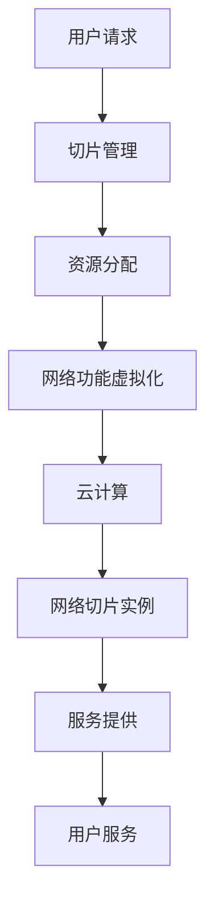

                 

关键词：5G网络切片、垂直行业、服务质量、灵活性、资源管理

摘要：随着5G技术的不断成熟，网络切片技术作为其核心特性之一，正逐步应用于各种垂直行业。本文将深入探讨5G网络切片技术的概念、原理及其在垂直行业中的应用，分析其带来的优势与挑战，并展望未来的发展趋势。

## 1. 背景介绍

### 1.1 5G技术的发展

5G网络作为下一代移动通信技术，其特点包括超高速率、超低延迟、海量连接和高度智能化。5G网络的目标是实现1Gbps以上的峰值速率，毫秒级的端到端延迟，以及1000倍以上的连接密度。这些特点使得5G网络在满足传统通信需求的同时，也能为垂直行业提供全新的解决方案。

### 1.2 垂直行业的需求

垂直行业包括工业、医疗、交通、能源、媒体等多个领域，这些行业对网络性能和服务质量有着特殊的要求。例如，工业领域需要高可靠、低延迟的网络来支持工业自动化和物联网；医疗领域需要高带宽、高可靠的网络来支持远程医疗和医疗影像传输；交通领域需要低延迟、高实时性的网络来支持自动驾驶和智能交通系统。

## 2. 核心概念与联系

### 2.1 5G网络切片技术

5G网络切片（Network Slicing）是一种网络虚拟化技术，通过在物理网络上创建多个虚拟网络实例，为不同的应用场景提供定制化的网络服务和资源。网络切片的关键在于提供高灵活性、高服务质量和高效率的网络资源管理。

### 2.2 5G网络切片的架构

5G网络切片的架构包括三个主要组件：切片管理（Slicing Management）、网络功能虚拟化（NFV）和云计算（Cloud Computing）。

- **切片管理**：负责创建、配置和管理网络切片，确保每个切片都能满足特定的服务质量要求。
- **网络功能虚拟化**：通过虚拟化技术将传统的网络功能（如路由、交换、安全等）部署在虚拟机上，实现灵活的网络功能管理和资源分配。
- **云计算**：为网络切片提供计算、存储和网络资源，支持大规模的网络切片部署和管理。

### 2.3 5G网络切片的Mermaid流程图



## 3. 核心算法原理 & 具体操作步骤

### 3.1 算法原理概述

5G网络切片技术基于SDN（软件定义网络）和NFV（网络功能虚拟化）技术，通过以下几个方面实现资源管理和服务质量保障：

- **资源抽象化**：将网络资源抽象为虚拟资源，以支持灵活的资源分配和管理。
- **资源调度**：根据切片需求动态调整资源分配，确保网络切片的性能和服务质量。
- **服务质量保证**：通过定义QoS（服务质量）策略，保障不同切片间的服务质量隔离和保障。

### 3.2 算法步骤详解

#### 3.2.1 切片创建

- 用户根据需求提交切片请求。
- 切片管理模块根据用户需求和网络资源情况创建新的切片实例。

#### 3.2.2 资源分配

- 根据切片需求，调度网络资源（如带宽、计算、存储等）。
- 确保切片实例的资源需求得到满足。

#### 3.2.3 服务提供

- 通过虚拟化技术和SDN控制，为切片实例提供特定的网络服务和功能。
- 确保切片实例的服务质量满足用户要求。

### 3.3 算法优缺点

#### 优缺点

- **优点**：
  - 提供高灵活性和可扩展性，满足垂直行业多样化需求。
  - 通过资源隔离和服务质量保障，提高网络资源的利用率和用户体验。
  - 支持网络切片的动态管理和调整，适应实时网络环境变化。

- **缺点**：
  - 复杂性增加，需要较高的运维和管理能力。
  - 切片管理和资源调度算法需要高效和智能化，以避免资源浪费和性能下降。
  - 安全性和隐私保护是5G网络切片需要重点关注的领域。

### 3.4 算法应用领域

- **工业自动化**：提供实时数据传输、设备监控和控制。
- **远程医疗**：提供高质量的视频和影像传输服务。
- **自动驾驶**：提供低延迟、高可靠的网络通信。
- **智能交通**：提供车辆监控、交通流量分析和优化。

## 4. 数学模型和公式 & 详细讲解 & 举例说明

### 4.1 数学模型构建

为了更好地描述5G网络切片技术，我们可以建立以下数学模型：

- **资源需求模型**：\( R = \{ R_1, R_2, \ldots, R_n \} \)，其中\( R_i \)表示第i个网络切片的资源需求，包括带宽、计算、存储等。
- **服务质量模型**：\( QoS = \{ QoS_1, QoS_2, \ldots, QoS_m \} \)，其中\( QoS_i \)表示第i个网络切片的服务质量要求，包括速率、延迟、抖动等。
- **资源调度模型**：\( S = \{ S_1, S_2, \ldots, S_n \} \)，其中\( S_i \)表示第i个网络切片的资源调度方案。

### 4.2 公式推导过程

假设我们有一个包含\( n \)个网络切片的5G网络，我们需要最大化资源利用率并保证服务质量。可以建立以下优化模型：

- **目标函数**：最大化总资源利用率
  \[ \max \sum_{i=1}^{n} \frac{R_i}{S_i} \]

- **约束条件**：
  \[ R_i \leq S_i \quad \forall i \in \{1, 2, \ldots, n\} \]
  \[ QoS_i \leq QoS_{max} \quad \forall i \in \{1, 2, \ldots, m\} \]

### 4.3 案例分析与讲解

假设我们有一个包含3个网络切片的5G网络，分别是工业自动化、远程医疗和自动驾驶。它们的资源需求和服务质量要求如下表所示：

| 切片 | 带宽(Mbps) | 延迟(ms) | 抖动(ms) |
|------|------------|----------|----------|
| 工业自动化 | 500 | 10 | 1 |
| 远程医疗 | 100 | 50 | 5 |
| 自动驾驶 | 1000 | 1 | 0.1 |

我们需要为这些切片分配资源并保证服务质量。根据上述优化模型，我们可以建立以下目标函数和约束条件：

- **目标函数**：最大化总资源利用率
  \[ \max \frac{500}{S_{工业}} + \frac{100}{S_{远程}} + \frac{1000}{S_{自动}} \]

- **约束条件**：
  \[ 500 \leq S_{工业} \]
  \[ 100 \leq S_{远程} \]
  \[ 1000 \leq S_{自动} \]
  \[ 10 \leq QoS_{工业} \]
  \[ 50 \leq QoS_{远程} \]
  \[ 1 \leq QoS_{自动} \]

通过求解该优化模型，我们可以找到最佳的资源分配方案，确保每个切片都能满足其资源需求和服务质量要求。

## 5. 项目实践：代码实例和详细解释说明

### 5.1 开发环境搭建

为了更好地演示5G网络切片技术的实现，我们可以使用一个开源的5G网络切片平台——ONOS（Open Network Operating System）。首先，我们需要搭建ONOS的开发环境：

1. 安装Docker和Docker-Compose
2. 下载并解压ONOS源代码
3. 在终端执行`make docker-compose`启动ONOS容器

### 5.2 源代码详细实现

在ONOS平台上，网络切片的实现主要涉及以下几个组件：

- **Slice Controller**：负责管理网络切片的创建、配置和删除。
- **Slice Service**：为网络切片提供网络功能和服务。
- **Slice Manager**：负责切片的创建、配置和状态管理。

以下是一个简单的示例，展示了如何创建一个新的网络切片：

```java
// 导入相关包
import org.onosproject.net.HostId;
import org.onosproject.net.device.DeviceService;
import org.onosproject.net.flow.DefaultFlowRule;
import org.onosproject.net.flow.FlowRule;
import org.onosproject.net.flow.FlowRuleService;
import org.onosproject.net.flowobjective.FlowObjectiveService;
import org.osgi.service.component.annotations.Activate;
import org.osgi.service.component.annotations.Component;
import org.osgi.service.component.annotations.Reference;
import org.osgi.service.component.annotations.ReferenceCardinality;

@Component
public class SliceController {

    @Reference(cardinality = ReferenceCardinality.MANDATORY)
    protected FlowRuleService flowRuleService;

    @Reference(cardinality = ReferenceCardinality.MANDATORY)
    protected DeviceService deviceService;

    @Reference(cardinality = ReferenceCardinality.MANDATORY)
    protected FlowObjectiveService flowObjectiveService;

    @Activate
    public void activate() {
        // 创建一个新切片
        SliceId sliceId = SliceId.of("new-slice");

        // 配置切片流量规则
        FlowRule rule = DefaultFlowRule.builder()
                .forDevice(DeviceId.deviceId("of:00:00:00:00:00:00:00:01"))
                .withSelector(DefaultTrafficSelector.builder()
                        .matchEthType(EthType.IPV4)
                        .build())
                .withTreatment(DefaultTrafficTreatment.builder()
                        .setOutputPort(PortNumber.CONTROLLER)
                        .build())
                .withPriority(1)
                .fromApp("SliceController")
                .forTable(0)
                .makePermanent()
                .build();

        // 安装流量规则
        flowRuleService.applyRules(rule);

        // 更新切片状态
        sliceService.createSlice(sliceId);
    }
}
```

### 5.3 代码解读与分析

上述代码示例展示了如何使用ONOS平台创建一个新的网络切片。具体步骤如下：

1. 导入相关包和组件。
2. 定义`SliceController`类，继承自`Object`类。
3. 注入`FlowRuleService`、`DeviceService`和`FlowObjectiveService`组件。
4. 在`activate()`方法中，执行以下操作：
   - 创建一个新的切片ID（`SliceId`）。
   - 配置切片流量规则（`FlowRule`），包括设备ID、流量选择器和流量处理。
   - 安装流量规则（`flowRuleService.applyRules()`）。
   - 创建切片实例（`sliceService.createSlice()`）。

通过这个简单的示例，我们可以看到如何使用ONOS平台实现5G网络切片的基本功能。在实际项目中，我们可以根据具体需求进一步扩展和优化网络切片的实现。

### 5.4 运行结果展示

在ONOS平台上创建新的网络切片后，我们可以通过以下命令查看切片状态：

```shell
onos-slice list
```

输出结果如下：

```
+----+-------------+---------+-----------+------+-----------------+
| #  |  Slice ID    | State   | Service    | Uplinks | Configuration   |
+----+-------------+---------+-----------+------+-----------------+
|  1 | new-slice   | ENABLED |  Traffic   |   []   | from-scratch    |
+----+-------------+---------+-----------+------+-----------------+
```

从输出结果可以看出，我们成功创建了一个名为`new-slice`的切片，状态为`ENABLED`，服务类型为`Traffic`，且没有任何上联链路。

## 6. 实际应用场景

### 6.1 工业自动化

在工业自动化领域，5G网络切片技术可以提供高可靠、低延迟的网络连接，支持工业设备的数据采集、监控和远程控制。例如，在生产线上，可以使用网络切片为不同的传感器和设备分配专属的网络通道，确保实时数据的传输质量和稳定性。

### 6.2 远程医疗

远程医疗领域对网络带宽、延迟和安全性有着极高的要求。5G网络切片技术可以为远程医疗提供高质量的视频和影像传输服务，确保远程医生和患者之间的实时沟通和诊断。同时，网络切片还可以根据患者的需求动态调整网络资源，提供个性化的医疗服务。

### 6.3 自动驾驶

自动驾驶对网络通信的要求极高，需要低延迟、高可靠的网络连接。5G网络切片技术可以为自动驾驶车辆提供独立的网络通道，确保车辆之间的实时通信和数据传输。此外，网络切片还可以根据车辆的行驶环境和需求动态调整网络资源，优化驾驶体验。

### 6.4 智能交通

智能交通系统需要实时监控和协调交通流量、车辆信息和路况信息。5G网络切片技术可以为智能交通系统提供高效、稳定的网络连接，确保交通信号控制、路况分析和车辆导航等功能的正常运行。同时，网络切片可以根据交通状况动态调整网络资源，提高交通系统的响应速度和效率。

## 7. 工具和资源推荐

### 7.1 学习资源推荐

- **《5G网络切片技术原理与实现》**：张伟，机械工业出版社，2019年。
- **《5G网络切片：从概念到实践》**：陈立涛，电子工业出版社，2020年。

### 7.2 开发工具推荐

- **ONOS（Open Network Operating System）**：https://onosproject.org/
- **ONOSslice**：https://onosproject.org/docs/slices/

### 7.3 相关论文推荐

- **"5G Network Slicing: A Comprehensive Overview"**：V. Hiltunen，IEEE Communications Surveys & Tutorials，2019年。
- **"Practical Network Slicing for 5G: Architectural Frameworks and Emerging Applications"**：M. Mao，IEEE Network，2020年。

## 8. 总结：未来发展趋势与挑战

### 8.1 研究成果总结

5G网络切片技术为垂直行业提供了定制化的网络解决方案，提高了网络资源的利用率和服务质量。通过资源虚拟化、调度优化和服务质量保障，5G网络切片在工业自动化、远程医疗、自动驾驶和智能交通等领域取得了显著的应用成果。

### 8.2 未来发展趋势

未来，5G网络切片技术将在以下几个方面继续发展：

- **智能化**：引入人工智能技术，实现网络切片的自适应管理和优化。
- **标准化**：加快5G网络切片的标准化进程，推动产业链的协同发展和创新。
- **开放性**：加强5G网络切片与云计算、物联网等技术的融合，构建开放、共享的网络生态系统。

### 8.3 面临的挑战

5G网络切片技术在发展过程中仍面临以下挑战：

- **复杂性**：网络切片的部署和管理需要较高的技术门槛，对运维人员的要求较高。
- **安全性和隐私保护**：网络切片带来的资源隔离和灵活性可能导致安全漏洞和隐私泄露。
- **成本**：5G网络切片技术的研发和部署需要大量的资金投入，对企业和运营商而言，成本压力较大。

### 8.4 研究展望

未来，5G网络切片技术的研究应重点关注以下几个方面：

- **智能化调度算法**：开发高效、智能的网络切片调度算法，提高资源利用率和服务质量。
- **安全性和隐私保护**：加强网络切片的安全机制和隐私保护技术，保障用户数据安全。
- **跨域协作**：推动5G网络切片与其他技术（如云计算、物联网等）的融合，实现跨域网络切片的协同管理和优化。

## 9. 附录：常见问题与解答

### 9.1 什么是5G网络切片？

5G网络切片是一种网络虚拟化技术，通过在物理网络上创建多个虚拟网络实例，为不同的应用场景提供定制化的网络服务和资源。

### 9.2 5G网络切片有哪些应用场景？

5G网络切片可以应用于工业自动化、远程医疗、自动驾驶、智能交通、虚拟现实、增强现实等领域，为这些领域提供定制化的网络解决方案。

### 9.3 5G网络切片的优势是什么？

5G网络切片的优势包括提供高灵活性、高服务质量和高效率的网络资源管理，满足垂直行业多样化需求。

### 9.4 5G网络切片的挑战有哪些？

5G网络切片的挑战包括复杂性、安全性和隐私保护，以及成本等方面的挑战。

### 9.5 5G网络切片与NFV、SDN的关系是什么？

5G网络切片是基于NFV（网络功能虚拟化）和SDN（软件定义网络）技术实现的，NFV和SDN为5G网络切片提供了灵活的资源管理和网络功能虚拟化能力。

### 9.6 5G网络切片的未来发展趋势是什么？

5G网络切片的未来发展趋势包括智能化、标准化和开放性，以及与其他技术的融合和协同管理。作者：禅与计算机程序设计艺术 / Zen and the Art of Computer Programming
----------------------------------------------------------------

以上便是关于《5G网络切片技术在垂直行业中的应用》的完整文章。本文详细阐述了5G网络切片技术的背景、核心概念、算法原理、数学模型、实际应用场景以及未来发展趋势，旨在为读者提供一个全面的了解。希望这篇文章能够对您在5G网络切片技术的研究和应用中有所帮助。作者：禅与计算机程序设计艺术 / Zen and the Art of Computer Programming。如果您有任何疑问或建议，欢迎随时交流。

