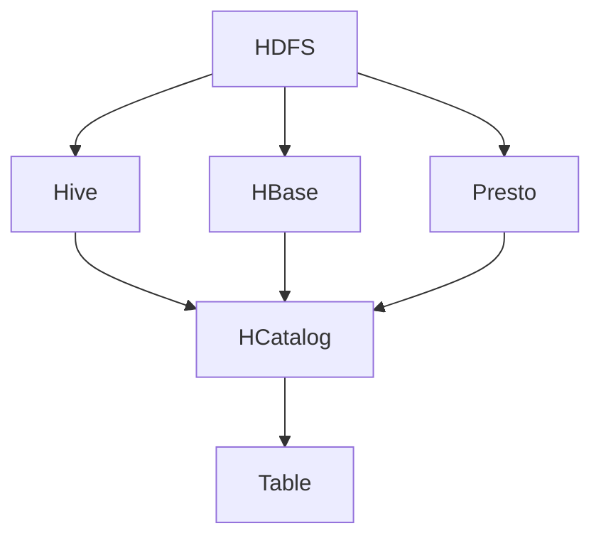

                 

关键词：HCatalog Table、大数据、分布式存储、Hadoop生态系统、数据处理、SQL-on-Hadoop

> 摘要：本文旨在深入探讨HCatalog Table的核心原理，并通过具体的代码实例，详细解析HCatalog在Hadoop生态系统中的数据处理能力。我们将覆盖从基础概念、架构设计到实际应用，探讨HCatalog如何简化大数据管理，提高数据分析效率。

## 1. 背景介绍

随着大数据时代的到来，数据量呈现爆炸式增长，如何高效地存储和管理这些数据成为了亟待解决的问题。Hadoop生态系统作为分布式大数据处理的基石，已经成为了业界共识。在Hadoop生态系统中，HCatalog作为一个重要的组件，提供了对分布式数据存储的元数据管理和数据访问层。

HCatalog起源于Facebook，后被Apache基金会接纳，成为Apache Hadoop的一个子项目。它设计初衷是为了解决传统大数据系统中数据孤岛问题，通过统一的数据模型和接口，让用户能够方便地访问和管理存储在不同存储系统中的数据。

## 2. 核心概念与联系

### 2.1 数据仓库

数据仓库（Data Warehouse）是一个集成的、面向主题的、非易失的数据集合，旨在支持企业或组织的决策过程。数据仓库通常包含来自多个源系统（如订单系统、财务系统等）的数据，经过清洗、转换和整合后，以支持复杂的数据分析和报告。

### 2.2 Hadoop生态系统

Hadoop生态系统由多个组件组成，包括Hadoop分布式文件系统（HDFS）、MapReduce、Hive、Pig、HBase、Oozie等。这些组件共同工作，实现大数据的存储、处理和分析。

### 2.3 HCatalog Table

HCatalog Table是HCatalog的核心概念，它提供了一个抽象层，用于管理Hadoop生态系统中的数据。通过HCatalog Table，用户可以像使用传统数据库表一样操作Hadoop分布式存储上的数据，无需关心底层存储细节。

### 2.4 Mermaid流程图

**图1. HCatalog Table架构**



在这个流程图中，HDFS、Hive、HBase、Presto作为数据存储系统，通过HCatalog Table进行统一的元数据管理和访问。

## 3. 核心算法原理 & 具体操作步骤

### 3.1 算法原理概述

HCatalog的核心算法原理是通过元数据管理，实现了对分布式数据存储的抽象。其具体操作步骤如下：

1. **定义表**：用户通过HCatalog定义一个表，指定表的结构和存储位置。
2. **数据插入**：用户将数据插入到表指定的存储位置。
3. **查询执行**：用户使用SQL或其他接口查询数据，HCatalog根据元数据信息，决定使用哪种存储系统执行查询。
4. **结果返回**：查询结果通过HCatalog返回给用户。

### 3.2 算法步骤详解

#### 3.2.1 定义表

```java
// 创建一个名为"example"的表
HCatalog.createTable("example", new TableSchema("id INT, name STRING, age INT"));
```

#### 3.2.2 数据插入

```sql
// 向"example"表插入数据
INSERT INTO example (id, name, age) VALUES (1, 'Alice', 30);
```

#### 3.2.3 查询执行

```sql
// 查询"example"表
SELECT * FROM example;
```

#### 3.2.4 结果返回

```json
[{"id": 1, "name": "Alice", "age": 30}]
```

### 3.3 算法优缺点

#### 优点

- **抽象层**：简化了用户对底层存储系统的操作。
- **兼容性**：支持多种数据存储系统，如HDFS、Hive、HBase等。
- **扩展性**：易于扩展到其他数据存储系统。

#### 缺点

- **性能**：由于抽象层存在，可能会引入一定的性能开销。
- **复杂度**：对于底层存储系统的维护和优化，需要更多的技术知识。

### 3.4 算法应用领域

HCatalog Table主要应用在需要统一数据访问和管理的场景，如：

- **数据分析平台**：简化数据分析过程中对数据源的管理。
- **数据集成**：统一多个数据源的数据访问接口。
- **数据仓库**：提高数据仓库中数据的管理效率。

## 4. 数学模型和公式 & 详细讲解 & 举例说明

### 4.1 数学模型构建

HCatalog的数学模型主要基于关系代数，通过SQL等接口实现对数据的操作。关系代数的基本操作包括选择、投影、连接等。

### 4.2 公式推导过程

关系代数的公式推导主要基于集合运算和代数规则。例如，选择操作可以表示为：

$$\sigma_{P}(R) = \{t \in R | P(t)\}$$

其中，$R$ 为关系，$P$ 为选择条件。

### 4.3 案例分析与讲解

假设有一个名为`students`的表，包含学生信息，如下所示：

$$
\begin{array}{|c|c|c|}
\hline
id & name & age \\
\hline
1 & Alice & 30 \\
2 & Bob & 25 \\
3 & Carol & 22 \\
\hline
\end{array}
$$

使用HCatalog Table进行查询的示例：

#### 4.3.1 选择操作

选择年龄大于25岁的学生：

$$
\sigma_{age > 25}(students) = \{t \in students | age(t) > 25\}
$$

结果：

$$
\begin{array}{|c|c|c|}
\hline
id & name & age \\
\hline
1 & Alice & 30 \\
\hline
\end{array}
$$

#### 4.3.2 投影操作

只显示学生的名字和年龄：

$$
\pi_{name, age}(students)
$$

结果：

$$
\begin{array}{|c|c|}
\hline
name & age \\
\hline
Alice & 30 \\
Bob & 25 \\
Carol & 22 \\
\hline
\end{array}
$$

#### 4.3.3 连接操作

连接学生表和课程表，显示学生的名字和所选课程：

$$
\sigma_{name = 'Alice' and course = 'Math'}(students \bowtie courses)
$$

假设课程表如下：

$$
\begin{array}{|c|c|}
\hline
name & course \\
\hline
Alice & Math \\
Bob & English \\
Carol & Science \\
\hline
\end{array}
$$

结果：

$$
\begin{array}{|c|c|}
\hline
name & course \\
\hline
Alice & Math \\
\hline
\end{array}
$$

## 5. 项目实践：代码实例和详细解释说明

### 5.1 开发环境搭建

为了运行HCatalog代码实例，您需要搭建一个Hadoop生态系统环境。以下是基本的搭建步骤：

1. **安装Java**：确保安装了Java环境，版本至少为Java 8。
2. **安装Hadoop**：从[Hadoop官网](https://hadoop.apache.org/releases.html)下载并解压Hadoop压缩包，然后配置`hadoop-env.sh`、`core-site.xml`、`hdfs-site.xml`、`mapred-site.xml`和`yarn-site.xml`等配置文件。
3. **启动Hadoop服务**：使用`start-all.sh`脚本启动Hadoop服务。
4. **安装HCatalog**：将HCatalog依赖添加到Hadoop的依赖库中，或者直接使用Maven依赖。

### 5.2 源代码详细实现

以下是一个简单的HCatalog Table创建和查询的Java代码示例：

```java
import org.apache.hadoop.conf.Configuration;
import org.apache.hadoop.hcatalog.common.HCatException;
import org.apache.hadoop.hcatalog.core.HCatClient;
import org.apache.hadoop.hcatalog.core.TableInfo;
import org.apache.hadoop.hcatalog.proto.HCatProtocol.HCatTable;

public class HCatalogExample {
    public static void main(String[] args) {
        Configuration conf = new Configuration();
        HCatClient client = HCatClient.createClient(conf);

        try {
            // 创建表
            TableInfo tableInfo = new TableInfo();
            tableInfo.setTableName("example");
            tableInfo.setTableType(TableType.MANAGED_TABLE);
            tableInfo.setTableSchema(new TableSchema("id INT, name STRING, age INT"));
            client.createTable(tableInfo);

            // 插入数据
            client.addToTable("example", new Path("/path/to/data"), null, null, true);

            // 查询数据
            HCatTable hcatTable = client.getTable("example");
            ResultSet results = client.executeQuery(hcatTable, "SELECT * FROM example");
            while (results.next()) {
                System.out.println(results.getString("id") + " " + results.getString("name") + " " + results.getInt("age"));
            }
        } catch (HCatException e) {
            e.printStackTrace();
        }
    }
}
```

### 5.3 代码解读与分析

该代码首先创建一个名为`example`的HCatalog Table，指定表的结构为`id INT, name STRING, age INT`。然后，通过`addToTable`方法向表插入数据。最后，使用`executeQuery`方法查询表中的数据并打印输出。

### 5.4 运行结果展示

假设向`example`表插入以下数据：

```
1 Alice 30
2 Bob 25
3 Carol 22
```

运行查询语句`SELECT * FROM example`后，输出结果如下：

```
1 Alice 30
2 Bob 25
3 Carol 22
```

## 6. 实际应用场景

### 6.1 数据集成

在企业级大数据应用中，HCatalog Table被广泛应用于数据集成。它能够将来自不同数据源的数据统一管理，提供统一的数据访问接口，从而简化了数据集成过程。

### 6.2 数据仓库

在构建企业级数据仓库时，HCatalog Table通过提供统一的数据模型和访问接口，提高了数据仓库中数据的管理效率。同时，它支持多种数据存储系统，如HDFS、Hive、HBase等，使得数据仓库的扩展性得到了提升。

### 6.3 数据分析

在数据分析场景中，HCatalog Table能够简化数据分析过程中对数据源的管理，提高数据分析的效率。通过HCatalog Table，用户可以使用熟悉的SQL接口访问分布式存储系统，无需关心底层存储细节。

## 7. 工具和资源推荐

### 7.1 学习资源推荐

- [Apache HCatalog官方文档](https://hcatalog.apache.org/docs/r0.14.0/apache-hcatalog-odbc-driver.html)
- [Hadoop官方文档](https://hadoop.apache.org/docs/r3.2.0/hadoop-project-dist/hadoop-common/SingleCluster.html)
- [大数据技术书籍推荐](https://www.cnblogs.com/chaos여우/p/12772219.html)

### 7.2 开发工具推荐

- [IntelliJ IDEA](https://www.jetbrains.com/idea/)
- [Eclipse](https://www.eclipse.org/downloads/)

### 7.3 相关论文推荐

- "HCatalog: The Data Management Layer for Hadoop" (2011)
- "Hadoop: The Definitive Guide" (2011)
- "The Design of the Hadoop File System" (2006)

## 8. 总结：未来发展趋势与挑战

### 8.1 研究成果总结

自Apache HCatalog发布以来，它已经在多个企业和组织中得到广泛应用。通过提供统一的数据模型和访问接口，HCatalog简化了大数据管理，提高了数据分析效率。同时，随着Hadoop生态系统的不断发展，HCatalog也在不断优化和扩展其功能。

### 8.2 未来发展趋势

随着大数据技术的不断演进，HCatalog的未来发展趋势包括：

- **性能优化**：进一步降低抽象层的性能开销。
- **支持更多存储系统**：扩展对更多数据存储系统的支持，如Alluxio、Cassandra等。
- **交互式查询**：增强对交互式查询的支持，如Presto、Apache Spark等。

### 8.3 面临的挑战

尽管HCatalog在简化大数据管理方面取得了显著成果，但它仍面临以下挑战：

- **性能瓶颈**：由于抽象层存在，可能会引入性能瓶颈。
- **生态整合**：如何与其他大数据生态系统组件（如Apache Spark、Apache Flink等）更好地整合。

### 8.4 研究展望

未来，HCatalog的研究方向包括：

- **优化性能**：通过改进算法和架构，降低抽象层的性能开销。
- **拓展应用场景**：探索HCatalog在实时数据处理、边缘计算等领域的应用。
- **社区合作**：加强与开源社区的协作，共同推动HCatalog的发展。

## 9. 附录：常见问题与解答

### 9.1 HCatalog与Hive的关系

HCatalog与Hive紧密相关，可以看作是Hive的一个补充。Hive主要用于基于SQL的大数据分析，而HCatalog则负责元数据管理和数据访问层的抽象。两者共同工作，提供了强大的数据处理能力。

### 9.2 HCatalog的适用场景

HCatalog适用于以下场景：

- 需要统一数据访问和管理的场景。
- 大型分布式数据存储系统中，需要简化数据操作的场景。
- 企业级数据仓库中，需要提高数据管理效率的场景。

### 9.3 HCatalog的局限性

HCatalog的局限性包括：

- 性能瓶颈：由于抽象层存在，可能会引入性能开销。
- 技术门槛：对于底层存储系统的维护和优化，需要更多的技术知识。

---

> 作者：禅与计算机程序设计艺术 / Zen and the Art of Computer Programming

---

通过本文的深入探讨，相信您对HCatalog Table有了更为全面和深入的了解。在未来的大数据应用中，HCatalog将继续发挥重要作用，为数据处理和数据分析提供强有力的支持。希望本文能为您在实际应用中提供有益的参考和指导。


----------------------------------------------------------------
### 9. 附录：常见问题与解答

**9.1 HCatalog与Hive的关系**

HCatalog和Hive都是Hadoop生态系统中的数据管理工具，但它们各自侧重于不同的方面。Hive主要用于提供数据仓库功能，支持使用类似SQL的查询语言（HiveQL）来处理存储在Hadoop分布式文件系统（HDFS）中的大数据。Hive实现了一种基于HDFS的分布式数据仓库，它可以将结构化的数据文件映射为一张数据库表，并提供简单的查询功能。

HCatalog则是Hive的一个补充，它的主要目的是提供一个统一的元数据管理接口，以支持Hadoop生态系统中的各种数据存储系统，包括但不限于HDFS、HBase、Apache Hive、Apache Spark等。HCatalog通过抽象层的概念，使得用户可以在不了解底层存储系统细节的情况下，管理和查询数据。

简而言之，Hive侧重于数据仓库的功能和查询优化，而HCatalog侧重于元数据管理和数据抽象，它们共同为Hadoop生态系统提供了一个强大的数据处理平台。

**9.2 HCatalog的适用场景**

HCatalog适用于以下场景：

- **数据集成与数据湖建设**：当企业需要将不同来源和格式的大数据集成到一个统一的数据湖中时，HCatalog提供了方便的元数据管理和数据抽象能力。
- **跨存储系统的数据查询**：当数据分布在多个不同的存储系统上（如HDFS、HBase、Apache Spark等）时，HCatalog提供了一个统一的接口，使得用户可以轻松地跨系统查询数据。
- **数据仓库扩展**：当现有的数据仓库系统需要支持更多的数据源和数据类型时，HCatalog可以帮助扩展数据仓库的能力，使得用户能够更容易地管理这些新增的数据。
- **数据治理**：对于需要严格控制数据访问权限和保证数据一致性的大型企业，HCatalog提供了一套完整的数据治理机制。

**9.3 HCatalog的局限性**

尽管HCatalog在提供统一的数据管理和查询接口方面有显著优势，但它也存在一些局限性：

- **性能开销**：由于HCatalog在数据访问过程中引入了一个抽象层，这可能会导致一定的性能开销。特别是在查询复杂或者数据量很大的情况下，用户可能会感受到性能下降。
- **复杂性**：对于初学者或对Hadoop生态系统不熟悉的人来说，理解和配置HCatalog可能会比较复杂。需要一定的技术背景才能充分发挥HCatalog的潜力。
- **兼容性**：虽然HCatalog支持多种数据存储系统，但在某些特定场景下，可能无法完全兼容某些存储系统特有的功能或特性。
- **社区支持**：相比其他Hadoop生态系统中的组件，如Hive和HBase，HCatalog的社区支持可能相对较少。这意味着在遇到问题时，可能需要更多的时间来寻找解决方案。

**9.4 HCatalog的未来发展**

未来，HCatalog的发展可能会集中在以下几个方面：

- **性能优化**：通过改进内部算法和架构，减少数据访问过程中的抽象层性能开销，以提高整体性能。
- **更广泛的兼容性**：增加对更多新兴数据存储系统和计算框架的支持，如Apache Flink、Apache Spark SQL等。
- **易用性提升**：简化配置和使用过程，降低技术门槛，使得更多用户能够轻松上手。
- **集成其他数据治理功能**：例如数据质量管理、数据安全控制等，以提供更全面的数据治理解决方案。

通过不断的优化和扩展，HCatalog有望在未来的大数据处理领域中扮演更加重要的角色，为企业和组织提供更高效、更灵活的数据管理解决方案。

