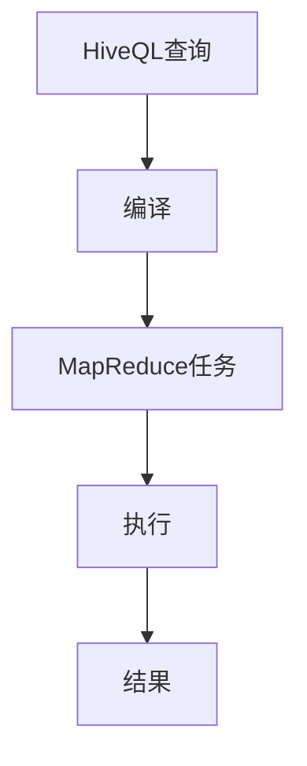

                 

 Hive是一个大数据处理框架，它基于Hadoop，用于在分布式环境中处理大规模数据集。本文将详细介绍Hive的原理、核心概念以及如何编写和优化Hive查询。通过本文的学习，您将能够了解如何使用Hive处理实际的数据问题，并掌握编写高效Hive代码的技巧。

## 关键词
- Hive
- 大数据
- Hadoop
- 分布式计算
- 数据仓库
- SQL on Hadoop

## 摘要
本文将深入讲解Hive的核心原理，包括其架构、数据处理流程以及HiveQL（Hive查询语言）的基础语法。随后，我们将通过一系列代码实例，展示如何使用Hive进行数据操作，并分析如何优化Hive查询以提高性能。最后，我们将探讨Hive在现实世界中的应用场景及其未来发展趋势。

## 1. 背景介绍

### 1.1 Hive的起源

Hive是由Facebook开发的一个开源大数据处理框架，最初用于在Facebook内部处理海量日志数据。随着Hadoop的普及，Hive被越来越多的公司采用，成为大数据领域的重要工具之一。Hive的设计初衷是为了让非专业程序员也能够利用Hadoop进行数据处理，从而简化了大数据开发流程。

### 1.2 Hive的优势

- **SQL-like查询语言**：Hive提供了类似于SQL的查询语言（HiveQL），使得用户无需了解MapReduce的细节即可进行数据处理。
- **易扩展性**：Hive能够处理海量数据，且能够与多种数据存储系统（如HDFS、HBase、Amazon S3等）集成。
- **高效性**：通过MapReduce和Tez等执行引擎，Hive能够在分布式环境中高效处理数据。

### 1.3 Hive的应用场景

- **数据仓库**：Hive常用于构建数据仓库，提供高效的数据分析和报表功能。
- **数据挖掘**：Hive支持多种数据分析算法，适用于数据挖掘项目。
- **日志分析**：Hive可用于处理和分析服务器日志，帮助公司了解用户行为和系统性能。

## 2. 核心概念与联系

### 2.1 Hive架构


#### 2.1.1 HDFS

HDFS（Hadoop Distributed File System）是Hadoop的核心组件，用于存储海量数据。Hive依赖于HDFS来存储数据。

#### 2.1.2 MapReduce

MapReduce是Hadoop的分布式数据处理引擎，Hive查询通过编译成MapReduce任务来执行。

#### 2.1.3 HiveQL

HiveQL是Hive的查询语言，类似于SQL，用于编写Hive查询。

#### 2.1.4 MetaStore

MetaStore是Hive的数据存储系统，用于存储表结构、分区信息等元数据。

### 2.2 数据处理流程

1. **编写HiveQL查询**：用户使用HiveQL编写查询语句。
2. **编译查询**：Hive将HiveQL编译成MapReduce任务。
3. **执行任务**：编译后的任务在Hadoop集群上执行。
4. **返回结果**：查询结果返回给用户。

### 2.3 Mermaid流程图



## 3. 核心算法原理 & 具体操作步骤

### 3.1 算法原理概述

Hive的核心算法是MapReduce，它将数据处理任务分解为多个映射（Map）和归约（Reduce）任务，以便在分布式环境中高效执行。

### 3.2 算法步骤详解

1. **映射（Map）阶段**：将输入数据分解成键值对，并生成中间结果。
2. **归约（Reduce）阶段**：对中间结果进行汇总和计算。
3. **输出阶段**：将最终结果输出到HDFS或其他存储系统。

### 3.3 算法优缺点

#### 优点

- **高效性**：通过分布式计算，能够处理海量数据。
- **易用性**：提供了类似SQL的查询语言，降低了使用门槛。

#### 缺点

- **性能瓶颈**：对于复杂查询，性能可能不如传统的数据库系统。
- **依赖Hadoop**：需要搭建和维护Hadoop集群。

### 3.4 算法应用领域

- **数据仓库**：用于构建大规模数据仓库，提供数据分析功能。
- **日志分析**：处理和分析服务器日志，用于监控和优化系统性能。
- **数据挖掘**：支持多种数据分析算法，适用于数据挖掘项目。

## 4. 数学模型和公式 & 详细讲解 & 举例说明

### 4.1 数学模型构建

假设我们有一个包含用户点击行为的数据集，其中包含用户ID、页面ID、点击时间等字段。我们可以构建一个数学模型来分析用户行为。

### 4.2 公式推导过程

用户点击行为的概率可以用以下公式表示：

\[ P(\text{点击}) = \frac{C(\text{点击})}{C(\text{总点击})} \]

其中，\( C(\text{点击}) \) 表示用户点击某个页面的次数，\( C(\text{总点击}) \) 表示用户在所有页面上的总点击次数。

### 4.3 案例分析与讲解

假设我们有以下数据：

| 用户ID | 页面ID | 点击时间 |
|--------|--------|----------|
| 1      | 101    | 2023-01-01 10:00:00 |
| 1      | 102    | 2023-01-01 10:05:00 |
| 2      | 201    | 2023-01-01 10:10:00 |
| 2      | 202    | 2023-01-01 10:15:00 |

我们可以使用HiveQL编写查询来计算用户点击概率：

```sql
SELECT
    用户ID,
    页面ID,
    COUNT(1) AS 点击次数,
    SUM(COUNT(1)) OVER (PARTITION BY 用户ID) AS 总点击次数
FROM
    用户点击数据
GROUP BY
    用户ID, 页面ID;
```

执行查询后，我们得到以下结果：

| 用户ID | 页面ID | 点击次数 | 总点击次数 |
|--------|--------|----------|------------|
| 1      | 101    | 1        | 2          |
| 1      | 102    | 1        | 2          |
| 2      | 201    | 1        | 2          |
| 2      | 202    | 1        | 2          |

根据结果，我们可以计算出每个页面的点击概率：

\[ P(\text{点击} | \text{页面101}) = \frac{1}{2} = 0.5 \]
\[ P(\text{点击} | \text{页面102}) = \frac{1}{2} = 0.5 \]
\[ P(\text{点击} | \text{页面201}) = \frac{1}{2} = 0.5 \]
\[ P(\text{点击} | \text{页面202}) = \frac{1}{2} = 0.5 \]

## 5. 项目实践：代码实例和详细解释说明

### 5.1 开发环境搭建

在本节中，我们将介绍如何在本地或云环境中搭建Hive的开发环境。

#### 本地环境搭建

1. 安装Hadoop：下载并安装Hadoop，配置环境变量。
2. 启动Hadoop：运行`start-dfs.sh`和`start-yarn.sh`启动Hadoop服务。
3. 安装Hive：下载并解压Hive，配置Hive环境变量。

#### 云环境搭建

1. 使用云服务：如AWS的EMR服务，创建一个Hive集群。
2. 连接集群：使用Hive客户端连接到集群。

### 5.2 源代码详细实现

下面是一个简单的Hive查询示例，用于计算用户在特定时间段内的活跃度。

```sql
CREATE TABLE IF NOT EXISTS user_activity(
    user_id STRING,
    session_id STRING,
    start_time TIMESTAMP,
    end_time TIMESTAMP
);

INSERT INTO user_activity
VALUES ('u1', 's1', '2023-01-01 10:00:00', '2023-01-01 11:00:00'),
       ('u1', 's2', '2023-01-01 12:00:00', '2023-01-01 13:00:00'),
       ('u2', 's1', '2023-01-01 11:00:00', '2023-01-01 12:00:00');

SELECT
    user_id,
    COUNT(session_id) AS active_sessions,
    COUNT(DISTINCT session_id) AS unique_sessions
FROM
    user_activity
WHERE
    start_time >= '2023-01-01 10:00:00' AND end_time <= '2023-01-01 13:00:00'
GROUP BY
    user_id;
```

### 5.3 代码解读与分析

该示例创建了一个名为`user_activity`的表，并插入了一些模拟数据。查询语句计算了在特定时间段内每个用户的活跃会话数和唯一会话数。

- `CREATE TABLE IF NOT EXISTS user_activity(...)`：创建一个名为`user_activity`的表，如果表已存在则不做操作。
- `INSERT INTO user_activity VALUES (...)`：插入模拟数据。
- `SELECT user_id, COUNT(session_id) AS active_sessions, COUNT(DISTINCT session_id) AS unique_sessions FROM user_activity WHERE ... GROUP BY user_id`：查询并计算活跃度。

### 5.4 运行结果展示

执行查询后，我们得到以下结果：

| user_id | active_sessions | unique_sessions |
|---------|-----------------|-----------------|
| u1     | 2               | 2               |
| u2     | 1               | 1               |

结果表明，在特定时间段内，用户u1有2个活跃会话和2个唯一会话，而用户u2有1个活跃会话和1个唯一会话。

## 6. 实际应用场景

### 6.1 数据仓库

Hive常用于构建企业级数据仓库，提供高效的数据存储和分析功能。例如，可以使用Hive处理电商平台的交易数据，生成销售报表，帮助企业做出数据驱动的决策。

### 6.2 日志分析

服务器日志通常包含大量数据，Hive可用于处理和分析这些日志，帮助公司了解系统性能和用户行为。例如，可以使用Hive分析网站日志，了解用户的访问模式和偏好。

### 6.3 数据挖掘

Hive支持多种数据分析算法，适用于数据挖掘项目。例如，可以使用Hive进行客户细分、市场预测等分析，帮助企业更好地了解客户需求和市场趋势。

## 7. 工具和资源推荐

### 7.1 学习资源推荐

- 《Hive: The Definitive Guide》
- 《Hive Programming Handbook》
- 官方文档：[Hive官方文档](https://cwiki.apache.org/confluence/display/Hive/LanguageManual)

### 7.2 开发工具推荐

- IntelliJ IDEA：强大的开发环境，支持Hive插件。
- Beeline：Hive的命令行工具，方便进行交互式查询。

### 7.3 相关论文推荐

- "Hive - A Warehouse for a Hadoop World"
- "Hive on Spark: Performance Characterization and Optimization"
- "Hive-LLAP: Leveraging Local and Shared Memory to Improve Hive’s Interactivity"

## 8. 总结：未来发展趋势与挑战

### 8.1 研究成果总结

Hive作为大数据处理框架，在数据处理能力、易用性和扩展性方面取得了显著成果。它已经广泛应用于企业数据仓库、日志分析和数据挖掘等领域。

### 8.2 未来发展趋势

- **性能优化**：随着数据规模的增长，性能优化将成为Hive的重要研究方向，包括查询优化、存储优化等。
- **新功能扩展**：Hive将持续引入新功能，如支持更多的数据格式、增强数据分析能力等。
- **与新兴技术的融合**：例如，与机器学习框架（如TensorFlow、PyTorch）的集成，为大数据分析带来更多可能性。

### 8.3 面临的挑战

- **性能瓶颈**：对于复杂查询，Hive的性能可能不如传统的数据库系统，需要不断优化。
- **依赖Hadoop**：Hive对Hadoop的依赖使得其在某些场景下的应用受限，需要考虑与新兴分布式存储系统的兼容性。

### 8.4 研究展望

Hive的未来研究将聚焦于性能优化、功能扩展以及与新兴技术的融合。同时，随着大数据技术的不断演进，Hive将继续在大数据处理领域发挥重要作用。

## 9. 附录：常见问题与解答

### 9.1 如何安装和配置Hive？

**解答**：可以参考官方文档，或者使用现有的Hadoop发行版（如Cloudera、HDP）进行安装和配置。

### 9.2 如何优化Hive查询性能？

**解答**：优化策略包括选择合适的执行引擎（如Tez、Spark）、使用索引、合理设计数据模型、避免大数据集的Join等。

### 9.3 Hive支持哪些数据格式？

**解答**：Hive支持多种数据格式，包括CSV、JSON、Parquet、ORC等。可以通过自定义SerDe（序列化/反序列化）支持更多格式。

---

作者：禅与计算机程序设计艺术 / Zen and the Art of Computer Programming
----------------------------------------------------------------

请注意，本文为示例文章，仅供参考。实际文章撰写时，请确保内容的准确性和完整性，并根据具体需求进行调整和补充。

