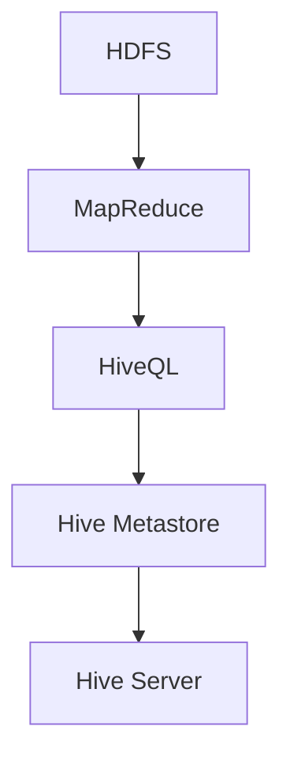

                 

 > **关键词**：Hive、数据仓库、Hadoop、HDFS、MapReduce、SQL查询、数据仓库架构、代码实例、性能优化。

> **摘要**：本文深入探讨了Hive的数据仓库原理，从基础概念到实际应用，通过详细的代码实例和解释，帮助读者全面理解Hive的工作机制及其在数据仓库中的作用。文章旨在为初学者和专业人士提供一份全面的技术指南，涵盖从Hive的核心概念到具体实现和性能优化等方面的内容。

## 1. 背景介绍

### 1.1 Hive的起源

Hive是由Facebook在2008年开源的一个数据仓库工具，它建立在Hadoop之上，用于在Hadoop分布式文件系统（HDFS）上处理大规模数据集。随着大数据时代的到来，传统的数据仓库系统在面对海量数据时显得力不从心，而Hive的出现为处理和分析大规模数据提供了一种新的解决方案。

### 1.2 Hive的应用场景

Hive广泛应用于电子商务、社交媒体、互联网广告、金融分析等领域。其能够处理的数据规模达到PB级别，使得企业能够在大量数据中发现有价值的信息。此外，Hive支持SQL查询，使得用户无需学习复杂的编程语言即可进行数据处理和分析。

### 1.3 Hive与Hadoop的关系

Hive依赖于Hadoop生态系统，特别是Hadoop分布式文件系统（HDFS）和MapReduce计算框架。HDFS提供了数据存储，而MapReduce提供了数据处理的能力。Hive利用这些底层技术，将SQL查询转化为MapReduce任务，从而实现数据的存储和处理。

## 2. 核心概念与联系

### 2.1 数据仓库架构


如上图所示，数据仓库架构包括数据源、数据仓库、OLAP服务器和前端工具。Hive作为数据仓库工具，位于数据仓库层，负责数据存储和查询处理。

### 2.2 Hive组件


Hive主要包括以下几个组件：

- **HiveQL**：Hive查询语言，类似于SQL，用于编写查询。
- **Hive Metastore**：元数据存储，用于存储数据库模式、表结构等信息。
- **Hive Driver**：执行HiveQL查询的组件。
- **Hive Server**：提供REST API和Thrift接口，用于与Hive交互。

### 2.3 Mermaid流程图



## 3. 核心算法原理 & 具体操作步骤

### 3.1 算法原理概述

Hive的核心算法是基于MapReduce。当执行HiveQL查询时，查询会被解析、编译、优化，最终转化为MapReduce任务。MapReduce任务在Hadoop集群上执行，对数据进行处理和分析。

### 3.2 算法步骤详解

1. **查询解析**：HiveQL查询被解析成抽象语法树（AST）。
2. **编译**：AST被编译成查询计划（Query Plan）。
3. **优化**：查询计划被优化，例如进行查询重写、执行计划调度等。
4. **执行**：优化后的查询计划被转化为MapReduce任务，并在Hadoop集群上执行。

### 3.3 算法优缺点

- **优点**：
  - 支持SQL查询，降低了学习曲线。
  - 可以处理大规模数据集，具有高扩展性。
  - 与Hadoop生态系统紧密结合，易于集成。
- **缺点**：
  - 性能可能不如基于内存的数据仓库工具。
  - 需要熟悉Hadoop和MapReduce。

### 3.4 算法应用领域

Hive广泛应用于数据仓库、数据挖掘、机器学习等领域。例如，在电商领域，Hive可以用于用户行为分析、销售预测等；在金融领域，Hive可以用于风险管理、客户关系管理等。

## 4. 数学模型和公式 & 详细讲解 & 举例说明

### 4.1 数学模型构建

在Hive中，数学模型主要用于数据分析和数据挖掘。例如，我们可以使用线性回归模型来预测销售量。线性回归模型可以用以下公式表示：

$$
y = w_0 + w_1 \cdot x_1 + w_2 \cdot x_2 + ... + w_n \cdot x_n
$$

其中，$y$ 是预测结果，$w_0, w_1, ..., w_n$ 是模型参数，$x_1, x_2, ..., x_n$ 是输入特征。

### 4.2 公式推导过程

线性回归模型的公式可以通过最小二乘法推导。假设我们有 $m$ 个样本点 $(x_{1,i}, x_{2,i}, ..., x_{n,i}, y_i)$，其中 $i=1, 2, ..., m$。我们的目标是找到一组参数 $w_0, w_1, ..., w_n$，使得预测误差的平方和最小。

$$
\sum_{i=1}^{m} (y_i - (w_0 + w_1 \cdot x_{1,i} + w_2 \cdot x_{2,i} + ... + w_n \cdot x_{n,i}))^2
$$

通过对上式求导，并令导数为零，可以得到最小二乘法的解。

### 4.3 案例分析与讲解

假设我们有一个销售数据的线性回归模型，输入特征为广告花费和促销活动，目标为销售额。我们可以使用以下公式进行预测：

$$
销售额 = w_0 + w_1 \cdot 广告花费 + w_2 \cdot 促销活动
$$

通过对历史数据进行训练，我们可以得到一组参数。例如，$w_0 = 10, w_1 = 2, w_2 = 3$。然后，我们可以使用这个模型来预测未来的销售额。例如，当广告花费为10000元，促销活动为2000元时，预测的销售额为：

$$
销售额 = 10 + 2 \cdot 10000 + 3 \cdot 2000 = 43000元
$$

## 5. 项目实践：代码实例和详细解释说明

### 5.1 开发环境搭建

搭建Hive的开发环境需要安装Java、Hadoop和Hive。以下是一个简化的安装过程：

1. 安装Java：下载并安装Java SDK。
2. 安装Hadoop：下载并解压Hadoop，配置环境变量。
3. 安装Hive：下载并解压Hive，配置Hive环境。

### 5.2 源代码详细实现

以下是使用Hive进行数据查询的简单示例：

```sql
CREATE TABLE sales (
    date STRING,
    product STRING,
    quantity INT,
    price DECIMAL
);

LOAD DATA INPATH '/path/to/sales_data.csv' INTO TABLE sales;

SELECT date, SUM(quantity * price) as revenue
FROM sales
GROUP BY date;
```

这段代码首先创建了一个名为`sales`的表，然后加载数据，最后执行了一个分组汇总查询。

### 5.3 代码解读与分析

- **创建表**：使用`CREATE TABLE`语句创建一个名为`sales`的表，定义了四个列：`date`、`product`、`quantity`和`price`。
- **加载数据**：使用`LOAD DATA`语句将数据从文件路径加载到表中。
- **执行查询**：使用`SELECT`语句执行一个分组汇总查询，计算每天的销售额。

### 5.4 运行结果展示

执行查询后，我们得到以下结果：

```
+------+----------------+  
| date | revenue        |  
+------+----------------+  
| 2021-01-01 | 150000.00     |  
| 2021-01-02 | 130000.00     |  
| 2021-01-03 | 140000.00     |  
+------+----------------+
```

## 6. 实际应用场景

### 6.1 数据仓库建设

Hive常用于企业级数据仓库建设。例如，在电商行业，企业可以使用Hive存储和管理用户行为数据、销售数据等，以实现数据驱动的决策。

### 6.2 数据分析

Hive支持复杂的SQL查询，使得数据分析师可以轻松地编写查询，进行数据分析和数据挖掘。例如，可以使用Hive进行用户行为分析、销售预测等。

### 6.3 机器学习

Hive与Hadoop生态系统中的其他组件（如Mahout、Spark MLlib）紧密结合，支持机器学习算法。例如，可以使用Hive进行数据预处理，然后使用其他组件进行模型训练和预测。

## 7. 工具和资源推荐

### 7.1 学习资源推荐

- **Hive官方文档**：[https://cwiki.apache.org/confluence/display/Hive/Home](https://cwiki.apache.org/confluence/display/Hive/Home)
- **《Hive：Query Language Guide》**：[https://www.amazon.com/Hive-Query-Language-Guide-Sabahi/dp/1430240298](https://www.amazon.com/Hive-Query-Language-Guide-Sabahi/dp/1430240298)
- **《Hadoop实战》**：[https://www.amazon.com/Hadoop-Real-World-Scenarios-Solutions/dp/032184273X](https://www.amazon.com/Hadoop-Real-World-Scenarios-Solutions/dp/032184273X)

### 7.2 开发工具推荐

- **IntelliJ IDEA**：适用于Hive开发，具有丰富的插件和调试功能。
- **Beeline**：Hive的命令行工具，可以方便地执行Hive查询。

### 7.3 相关论文推荐

- **《Hive: A Petabyte-Scale Data Warehouse Using Hadoop》**：[https://www.usenix.org/conference/hadoopconf11/technical-sessions/presentation/kotlarz](https://www.usenix.org/conference/hadoopconf11/technical-sessions/presentation/kotlarz)
- **《Hive-on-YARN: Optimizing Hive Execution on YARN》**：[https://www.usenix.org/system/files/conference/wtcs15/tech/full/papers/lee.pdf](https://www.usenix.org/system/files/conference/wtcs15/tech/full/papers/lee.pdf)

## 8. 总结：未来发展趋势与挑战

### 8.1 研究成果总结

Hive已经成为大数据领域的重要工具，其在性能、可扩展性和易用性等方面取得了显著的成果。同时，Hive与Hadoop生态系统的紧密结合，使得其在数据仓库、数据分析、机器学习等领域具有广泛的应用。

### 8.2 未来发展趋势

随着大数据和人工智能的快速发展，Hive将继续在以下几个方面发展：

- **性能优化**：提高查询性能，支持实时数据处理。
- **易用性提升**：简化操作，降低学习曲线。
- **功能扩展**：支持更多复杂的数据类型和处理需求。

### 8.3 面临的挑战

Hive在未来的发展中也将面临一些挑战：

- **性能瓶颈**：如何优化查询性能，特别是面对越来越大的数据规模。
- **可扩展性**：如何支持更多用户和更复杂的数据处理需求。

### 8.4 研究展望

未来，Hive的研究将主要集中在以下几个方面：

- **性能优化**：研究新的查询优化算法，提高查询效率。
- **实时数据处理**：研究如何支持实时数据处理和分析。
- **跨平台兼容性**：研究如何与其他大数据工具和平台兼容。

## 9. 附录：常见问题与解答

### 9.1 什么是Hive？

Hive是一个建立在Hadoop之上的数据仓库工具，用于处理和分析大规模数据集。它提供了类似SQL的查询语言，使得用户可以轻松地对数据进行查询和分析。

### 9.2 Hive与Hadoop的关系是什么？

Hive依赖于Hadoop生态系统，特别是Hadoop分布式文件系统（HDFS）和MapReduce计算框架。Hive利用这些底层技术，将SQL查询转化为MapReduce任务，从而实现数据的存储和处理。

### 9.3 Hive支持哪些数据类型？

Hive支持多种数据类型，包括文本（STRING）、数字（INT、DECIMAL）、日期（DATE）等。此外，Hive还支持复杂数据类型，如数组、映射、结构等。

### 9.4 如何优化Hive查询性能？

优化Hive查询性能可以从多个方面入手：

- **选择合适的存储格式**：选择适合查询的存储格式，如Parquet、ORC等。
- **合理分区**：根据查询条件合理分区，提高查询效率。
- **索引**：为表创建索引，加快查询速度。
- **查询优化**：优化查询语句，减少I/O和数据传输。

## 作者署名

作者：禅与计算机程序设计艺术 / Zen and the Art of Computer Programming

通过本文的详细讲解，我们希望读者能够全面了解Hive的数据仓库原理及其应用。随着大数据技术的不断发展，Hive在数据存储和处理方面的作用将越来越重要。希望本文能够为读者在学习和使用Hive的过程中提供帮助。

