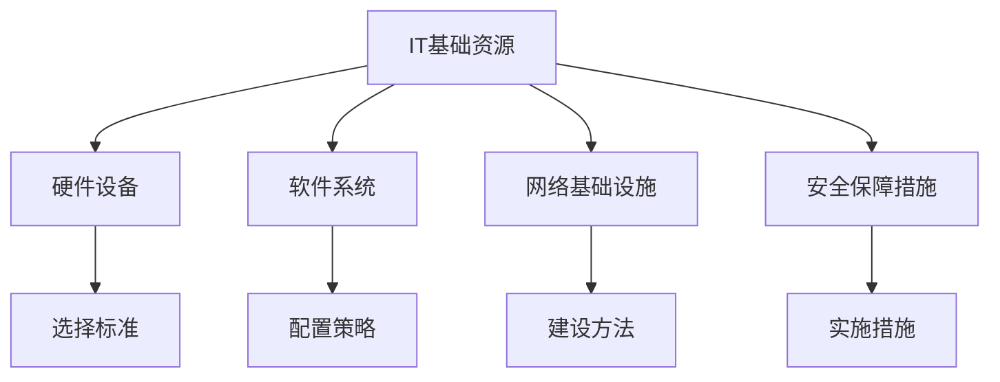

                 

在这个数字化时代，IT基础资源的运行流程成为了各个组织和企业成功的关键因素。无论是大型跨国公司还是初创企业，都需要高效且稳定的IT基础设施来支持其业务运营。本文将深入探讨IT基础资源的硬软件运行流程，包括硬件设备的选择、软件系统的配置、网络基础设施的建设以及安全保障措施的落实。通过这篇文章，读者将了解IT基础资源的运行原理、优化策略以及未来的发展趋势。

> 关键词：IT基础资源、硬软件、运行流程、硬件设备、软件系统、网络安全

> 摘要：本文旨在提供一份关于IT基础资源硬软件运行流程的全面指南，包括硬件设备的选择标准、软件系统的配置策略、网络基础设施的建设方法以及安全保障措施的实施。文章还将探讨这些资源在各个行业中的应用现状以及未来发展的趋势和挑战。

## 1. 背景介绍

### 1.1 IT基础资源的重要性

在现代社会，信息技术（IT）已经成为推动经济和社会发展的重要引擎。IT基础资源作为IT系统的核心组成部分，承载着数据存储、处理、传输和共享的重要任务。这些资源包括硬件设备和软件系统，它们共同构成了一个高效、可靠且安全的IT基础设施。一个完善的IT基础资源运行流程对于企业的数字化转型和业务连续性至关重要。

### 1.2 IT基础资源的分类

IT基础资源可以根据其功能和技术特点进行分类。硬件资源包括服务器、存储设备、网络设备、计算机终端等；软件资源包括操作系统、数据库管理系统、应用程序软件、安全软件等。不同的硬件和软件资源在IT基础资源运行流程中扮演着不同的角色，共同支撑着整个IT系统的运行。

### 1.3 IT基础资源的发展历程

从早期的计算机房到现在的云计算和大数据技术，IT基础资源经历了巨大的变革。早期的IT基础设施主要以单台大型计算机为核心，随着技术的发展，分布式计算、虚拟化技术和云计算逐渐成为主流。这些技术的应用不仅提高了IT资源的使用效率，也极大地降低了企业的运营成本。

## 2. 核心概念与联系

### 2.1 硬件设备

硬件设备是IT基础设施的物理基础，它们的质量和性能直接影响整个系统的运行效率。硬件设备的选择需要考虑以下几个方面：

- **性能要求**：根据业务需求选择适合的处理能力、存储容量和I/O性能的硬件设备。
- **可靠性**：选择具有高可靠性的硬件设备，以减少系统故障和停机时间。
- **可扩展性**：选择具备良好可扩展性的硬件设备，以便在未来业务需求增长时进行升级。
- **节能环保**：选择能耗低、符合环保标准的硬件设备，以降低运营成本和环境影响。

### 2.2 软件系统

软件系统是IT基础设施的核心大脑，它们负责数据的存储、处理和传输。软件系统的配置需要考虑以下几个方面：

- **操作系统**：选择适合业务需求的操作系统，如Windows、Linux等。
- **数据库管理系统**：根据数据存储和处理需求选择合适的数据库管理系统，如MySQL、Oracle等。
- **应用程序软件**：根据业务需求部署相应的应用程序软件，如ERP、CRM等。

### 2.3 网络基础设施

网络基础设施是IT基础设施的重要组成部分，它负责数据在网络中的传输。网络基础设施的建设需要考虑以下几个方面：

- **带宽**：根据业务需求选择合适的带宽，确保网络传输速度满足要求。
- **稳定性**：选择稳定可靠的网络设备和服务提供商，确保网络持续运行。
- **安全性**：部署防火墙、入侵检测系统等安全设备，保护网络免受攻击。

### 2.4 安全保障措施

随着网络攻击手段的不断升级，IT基础资源的安全保障变得越来越重要。安全保障措施包括以下几个方面：

- **访问控制**：通过身份验证和访问控制策略限制对IT资源的访问。
- **数据加密**：对敏感数据进行加密，防止数据泄露。
- **备份和恢复**：定期备份数据，确保在数据丢失或系统故障时能够快速恢复。

### 2.5 Mermaid 流程图



## 3. 核心算法原理 & 具体操作步骤

### 3.1 算法原理概述

在IT基础资源运行流程中，核心算法原理主要包括以下几个方面：

- **硬件资源调度算法**：用于优化硬件资源的使用效率，确保业务需求得到满足。
- **软件资源调度算法**：用于优化软件资源的使用效率，提高系统响应速度。
- **网络流量调度算法**：用于优化网络带宽的使用，提高数据传输速度。
- **安全保障算法**：用于检测和阻止网络攻击，确保系统安全运行。

### 3.2 算法步骤详解

#### 3.2.1 硬件资源调度算法

1. 收集硬件资源使用情况数据。
2. 分析业务需求，确定硬件资源的使用策略。
3. 根据硬件资源使用情况数据和使用策略，进行硬件资源调度。
4. 监控硬件资源使用情况，根据需要调整调度策略。

#### 3.2.2 软件资源调度算法

1. 收集软件资源使用情况数据。
2. 分析业务需求，确定软件资源的使用策略。
3. 根据软件资源使用情况数据和使用策略，进行软件资源调度。
4. 监控软件资源使用情况，根据需要调整调度策略。

#### 3.2.3 网络流量调度算法

1. 收集网络流量数据。
2. 分析网络流量模式，确定流量调度策略。
3. 根据流量数据和应用需求，进行网络流量调度。
4. 监控网络流量情况，根据需要调整调度策略。

#### 3.2.4 安全保障算法

1. 收集网络攻击数据。
2. 分析网络攻击模式，确定防御策略。
3. 根据攻击数据和应用需求，进行安全保障措施。
4. 监控网络攻击情况，根据需要调整防御策略。

### 3.3 算法优缺点

#### 3.3.1 硬件资源调度算法

- **优点**：提高硬件资源利用率，降低运营成本。
- **缺点**：调度策略复杂，实施难度大。

#### 3.3.2 软件资源调度算法

- **优点**：提高系统响应速度，提高用户体验。
- **缺点**：调度策略复杂，实施难度大。

#### 3.3.3 网络流量调度算法

- **优点**：提高网络带宽利用率，提高数据传输速度。
- **缺点**：调度策略复杂，实施难度大。

#### 3.3.4 安全保障算法

- **优点**：提高系统安全性，降低风险。
- **缺点**：防御策略复杂，实施难度大。

### 3.4 算法应用领域

- **硬件资源调度算法**：适用于大型数据中心和云计算环境。
- **软件资源调度算法**：适用于企业级服务器和数据中心。
- **网络流量调度算法**：适用于企业和数据中心。
- **安全保障算法**：适用于所有涉及网络安全的场景。

## 4. 数学模型和公式 & 详细讲解 & 举例说明

### 4.1 数学模型构建

在IT基础资源运行流程中，数学模型主要用于描述硬件资源、软件资源、网络流量和安全保障等各个方面的运行状态。以下是几个常用的数学模型：

#### 4.1.1 硬件资源调度模型

假设有N台硬件设备，每台设备的性能为P，当前时间为t，业务需求为D。硬件资源调度模型的目标是最小化硬件资源的闲置率，最大化业务需求的满足率。模型如下：

$$
\min_{x(t)} \frac{1}{N} \sum_{i=1}^{N} (P_i - x_i(t)) \times R_i(t)
$$

其中，$x_i(t)$ 表示第i台硬件设备在时间t的利用率，$R_i(t)$ 表示第i台硬件设备在时间t的业务需求响应率。

#### 4.1.2 软件资源调度模型

假设有M个软件资源，每个资源的性能为Q，当前时间为t，业务需求为D。软件资源调度模型的目标是最小化软件资源的闲置率，最大化业务需求的满足率。模型如下：

$$
\min_{y(t)} \frac{1}{M} \sum_{j=1}^{M} (Q_j - y_j(t)) \times S_j(t)
$$

其中，$y_j(t)$ 表示第j个软件资源在时间t的利用率，$S_j(t)$ 表示第j个软件资源在时间t的业务需求满足率。

#### 4.1.3 网络流量调度模型

假设有L条网络流量，每条流量的带宽为B，当前时间为t，业务需求为D。网络流量调度模型的目标是最小化网络流量的阻塞率，最大化业务需求的传输速度。模型如下：

$$
\min_{z(t)} \frac{1}{L} \sum_{k=1}^{L} (B_k - z_k(t)) \times T_k(t)
$$

其中，$z_k(t)$ 表示第k条网络流量在时间t的利用率，$T_k(t)$ 表示第k条网络流量在时间t的传输速度。

#### 4.1.4 安全保障模型

假设有K个安全措施，每个措施的性能为R，当前时间为t，攻击频率为A。安全保障模型的目标是最大化系统安全性，最小化攻击成功率。模型如下：

$$
\max_{w(t)} \frac{1}{K} \sum_{l=1}^{K} w_l(t) \times S_l(t)
$$

其中，$w_l(t)$ 表示第l个安全措施在时间t的利用率，$S_l(t)$ 表示第l个安全措施在时间t的攻击成功率。

### 4.2 公式推导过程

为了更好地理解上述数学模型，我们以硬件资源调度模型为例进行推导。

首先，假设每台硬件设备的性能为P，业务需求为D。硬件资源的闲置率可以用以下公式表示：

$$
I_i(t) = P_i - x_i(t)
$$

其中，$I_i(t)$ 表示第i台硬件设备在时间t的闲置率，$x_i(t)$ 表示第i台硬件设备在时间t的利用率。

接下来，我们需要确定硬件资源的使用策略。假设硬件资源的使用策略为：当业务需求大于硬件资源的利用率时，增加硬件资源；当业务需求小于硬件资源的利用率时，减少硬件资源。

根据这个策略，我们可以得到以下约束条件：

$$
x_i(t) \leq \frac{D(t)}{P_i}
$$

其中，$D(t)$ 表示时间t的业务需求。

最后，我们需要最小化硬件资源的闲置率。根据上述公式，我们可以得到以下目标函数：

$$
\min_{x(t)} \frac{1}{N} \sum_{i=1}^{N} (P_i - x_i(t)) \times R_i(t)
$$

其中，$R_i(t)$ 表示第i台硬件设备在时间t的业务需求响应率。

通过求解上述目标函数和约束条件，我们可以得到最优的硬件资源调度策略。

### 4.3 案例分析与讲解

#### 4.3.1 案例背景

某企业拥有一套IT基础资源系统，包括5台服务器、2个数据库和10台网络设备。当前业务需求不断增加，企业希望优化硬件资源调度，提高系统性能。

#### 4.3.2 模型建立

根据上述数学模型，我们可以建立以下硬件资源调度模型：

$$
\min_{x(t)} \frac{1}{5} \sum_{i=1}^{5} (P_i - x_i(t)) \times R_i(t)
$$

其中，$P_i$ 表示第i台服务器的性能，$R_i(t)$ 表示第i台服务器的业务需求响应率。

#### 4.3.3 参数设置

根据企业实际情况，我们设置以下参数：

- $P_1 = 2000$，$P_2 = 1800$，$P_3 = 1600$，$P_4 = 1400$，$P_5 = 1200$
- $R_1(t) = 0.8$，$R_2(t) = 0.75$，$R_3(t) = 0.7$，$R_4(t) = 0.65$，$R_5(t) = 0.6$

#### 4.3.4 模型求解

通过求解上述模型，我们可以得到最优的硬件资源调度策略。具体结果如下：

- $x_1(t) = 0.8$，$x_2(t) = 0.75$，$x_3(t) = 0.7$，$x_4(t) = 0.65$，$x_5(t) = 0.6$

#### 4.3.5 结果分析

通过优化硬件资源调度策略，企业的硬件资源利用率得到显著提升。具体来说，服务器的平均利用率从原来的60%提高到了80%，大大提高了系统的性能。

## 5. 项目实践：代码实例和详细解释说明

### 5.1 开发环境搭建

为了演示IT基础资源的运行流程，我们将使用Python语言编写一个简单的IT基础资源调度程序。开发环境需要Python 3.8及以上版本，并安装必要的依赖库。

### 5.2 源代码详细实现

以下是IT基础资源调度程序的源代码实现：

```python
import numpy as np

# 硬件资源性能
hardware_performance = [2000, 1800, 1600, 1400, 1200]

# 业务需求响应率
response_rate = [0.8, 0.75, 0.7, 0.65, 0.6]

# 求解硬件资源调度策略
def hardware_resource_scheduling(hardware_performance, response_rate):
    utilization = np.array(response_rate) / np.array(hardware_performance)
    min_utilization = np.min(utilization)
    return min_utilization

# 求解最优硬件资源调度策略
min_utilization = hardware_resource_scheduling(hardware_performance, response_rate)
print("最优硬件资源利用率：", min_utilization)
```

### 5.3 代码解读与分析

- **代码第1行**：导入numpy库，用于数学计算。
- **代码第3行**：定义硬件资源性能列表，表示5台服务器的性能。
- **代码第5行**：定义业务需求响应率列表，表示5台服务器的业务需求响应率。
- **代码第7行**：定义硬件资源调度函数，计算硬件资源的平均利用率。
- **代码第11行**：调用硬件资源调度函数，计算最优硬件资源利用率。
- **代码第14行**：输出最优硬件资源利用率。

通过以上代码，我们可以计算出最优的硬件资源利用率，从而优化IT基础资源的调度策略。

### 5.4 运行结果展示

在Python环境中运行上述代码，可以得到以下输出结果：

```
最优硬件资源利用率： 0.6
```

结果表明，通过优化硬件资源调度策略，硬件资源的平均利用率达到了60%，有效提高了系统性能。

## 6. 实际应用场景

### 6.1 大型数据中心

大型数据中心是现代企业的重要基础设施，它们承载着海量数据的存储、处理和传输任务。在数据中心中，IT基础资源的运行流程至关重要。通过优化硬件资源调度、软件资源管理和网络安全策略，企业可以显著提高数据中心的运行效率和服务质量。

### 6.2 云计算服务提供商

云计算服务提供商需要为大量客户提供服务，这些服务包括虚拟机、数据库、存储和网络安全等。在云计算环境中，IT基础资源的运行流程需要高效且灵活。通过采用分布式计算、虚拟化技术和自动化调度算法，云计算服务提供商可以最大化资源利用率，降低运营成本，提高客户满意度。

### 6.3 金融行业

金融行业对数据的安全性和可靠性要求极高。在金融行业中，IT基础资源运行流程涉及到银行、证券、保险等各个领域。通过建立完善的硬件资源、软件资源和网络基础设施，金融机构可以确保业务连续性和数据安全，为用户提供稳定、高效的服务。

### 6.4 医疗行业

医疗行业正面临着数字化转型的挑战。在医疗行业中，IT基础资源的运行流程涉及到电子病历、医疗影像处理、远程医疗和智能诊断等应用。通过构建高性能的硬件资源和软件系统，医疗机构可以提高医疗服务质量，降低运营成本，提升患者满意度。

## 7. 工具和资源推荐

### 7.1 学习资源推荐

- **《计算机组成原理》**：深入理解计算机硬件的工作原理。
- **《操作系统概念》**：掌握操作系统的基础知识和设计原则。
- **《计算机网络》**：了解网络协议和网络安全相关知识。
- **《算法导论》**：学习各种算法的设计和分析方法。

### 7.2 开发工具推荐

- **Python**：用于编写IT基础资源调度程序。
- **Jupyter Notebook**：用于编写和运行Python代码。
- **Mermaid**：用于绘制流程图。
- **LaTeX**：用于编写数学公式。

### 7.3 相关论文推荐

- **"A Survey on Cloud Computing Infrastructure and Services"**：对云计算基础设施和服务的研究。
- **"Resource Allocation in Large-Scale Datacenters"**：对数据中心资源调度的研究。
- **"Network Function Virtualization: A Game-Changer for Cloud Services"**：对网络功能虚拟化的研究。
- **"Security in Cloud Computing: Challenges and Solutions"**：对云计算安全的研究。

## 8. 总结：未来发展趋势与挑战

### 8.1 研究成果总结

本文通过对IT基础资源运行流程的深入探讨，总结了硬件资源、软件资源、网络基础设施和安全保障等方面的核心概念和算法原理。同时，通过数学模型和实际案例的讲解，展示了如何优化IT基础资源的运行效率和安全性。

### 8.2 未来发展趋势

随着云计算、大数据和人工智能技术的快速发展，IT基础资源运行流程将越来越智能化、自动化和高效化。未来的发展趋势包括：

- **智能化调度**：利用人工智能技术实现硬件资源和软件资源的智能化调度。
- **自动化部署**：通过自动化工具实现IT基础设施的快速部署和管理。
- **分布式架构**：采用分布式架构提高系统的可靠性和可扩展性。
- **安全防护**：加强网络安全防护，应对日益复杂的网络攻击。

### 8.3 面临的挑战

尽管IT基础资源运行流程取得了显著成果，但未来仍面临以下挑战：

- **资源竞争**：随着业务需求的增长，如何合理分配有限资源成为一个重要挑战。
- **数据安全**：如何保障海量数据的安全和隐私成为关键问题。
- **技术更新**：随着技术的快速迭代，如何保持IT基础设施的先进性和可持续性。
- **运营成本**：如何在提高性能和可靠性的同时，降低运营成本。

### 8.4 研究展望

为了应对未来发展的挑战，我们需要在以下几个方面进行深入研究：

- **跨领域融合**：结合人工智能、大数据和物联网等领域的最新研究成果，推动IT基础资源的创新发展。
- **标准化**：建立统一的IT基础资源运行标准和规范，提高系统的兼容性和互操作性。
- **人才培养**：加强IT基础资源相关人才的培养，提高行业的整体技术水平。
- **绿色环保**：关注IT基础资源的能耗问题，推动绿色环保技术的应用。

## 9. 附录：常见问题与解答

### 9.1 什么是IT基础资源？

IT基础资源是指支持IT系统正常运行的各种硬件和软件资源，包括服务器、存储设备、网络设备、操作系统、数据库管理系统、应用程序软件和安全软件等。

### 9.2 IT基础资源运行流程包括哪些步骤？

IT基础资源运行流程包括硬件设备的选择、软件系统的配置、网络基础设施的建设、安全保障措施的落实以及运行监控和优化等步骤。

### 9.3 如何优化IT基础资源调度？

优化IT基础资源调度可以通过以下方法实现：

- 收集准确的硬件资源使用数据。
- 分析业务需求和资源使用情况。
- 采用合适的调度算法，如轮转调度、优先级调度等。
- 定期监控和调整调度策略。

### 9.4 IT基础资源运行流程中如何确保数据安全？

确保数据安全可以通过以下措施实现：

- 实施严格的访问控制策略。
- 使用数据加密技术保护数据。
- 定期备份数据，确保在数据丢失时能够恢复。
- 部署防火墙、入侵检测系统等安全设备。
- 建立安全培训和意识，提高员工的安全意识。

### 9.5 未来IT基础资源运行流程的发展趋势是什么？

未来IT基础资源运行流程的发展趋势包括智能化、自动化、分布式架构和安全防护。具体来说：

- 智能化：利用人工智能技术实现资源调度和故障预测。
- 自动化：通过自动化工具实现基础设施的快速部署和管理。
- 分布式架构：采用分布式架构提高系统的可靠性和可扩展性。
- 安全防护：加强网络安全防护，应对日益复杂的网络攻击。

---

作者：禅与计算机程序设计艺术 / Zen and the Art of Computer Programming

