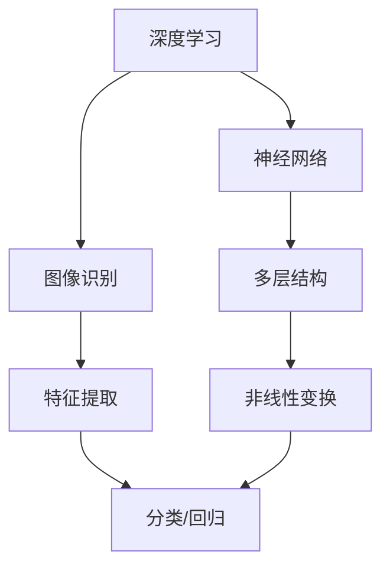
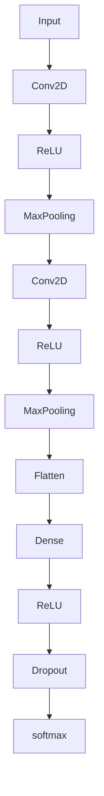

                 

关键词：ImageNet、人工智能、计算机视觉、深度学习、神经网络、图像识别

摘要：本文将深入探讨ImageNet在人工智能领域的重要性，详细解析其对于深度学习和计算机视觉的深远影响。我们将从背景介绍、核心概念与联系、算法原理、数学模型、项目实践和实际应用等多个角度，系统性地梳理ImageNet与人工智能学习之间的关系，为读者提供全面的认知和深入的思考。

## 1. 背景介绍

ImageNet是一个由斯坦福大学计算机视觉实验室（CVLab）创建的大型视觉识别数据库，旨在促进人工智能领域中的计算机视觉研究。自2009年首次发布以来，ImageNet已经成为计算机视觉领域的基准测试，广泛用于评估各类视觉识别算法的性能。

ImageNet包含了超过1400万张标注图片，这些图片覆盖了1000个不同的类别。它的创建源于一个简单而伟大的理念：通过提供大规模、高质量的标注数据集，推动深度学习在计算机视觉领域的应用和发展。在ImageNet之前，计算机视觉领域主要依赖于手工设计的特征，这些特征往往难以捕捉到图像的复杂性和多样性。

ImageNet的出现彻底改变了这一局面。它提供了一个丰富的数据源，使得深度学习算法能够通过大规模的图像数据进行训练，从而实现更好的性能和泛化能力。深度学习模型，特别是卷积神经网络（CNNs），在ImageNet上取得了前所未有的成功，这一成功也极大地推动了人工智能领域的发展。

### ImageNet的创建过程

ImageNet的创建过程是一个庞大的工程，涉及到了大量的时间和资源投入。最初，CVLab的研究人员雇佣了大量的人工标注员来对图像进行分类和标注。每个图像都要经过多个标注员的双重检查，以确保标注的准确性。这种严格的质量控制使得ImageNet成为了一个高质量的标注数据集。

随着深度学习的发展，CVLab还发布了一系列挑战赛，如ImageNet大规模视觉识别挑战（ILSVRC），吸引了全球的科研人员和工程师参与。这些挑战赛不仅推动了技术的进步，也促进了不同团队之间的合作与竞争，加速了人工智能领域的研究和发展。

### ImageNet的重要性

ImageNet的重要性在于它为人工智能领域提供了一个统一的基准，使得研究人员和工程师可以公平地比较不同算法的性能。在ImageNet之前，各个团队使用的图像数据集规模和标注质量差异很大，这给算法的比较带来了很大的困难。ImageNet的统一性和大规模使得它成为了评估视觉识别算法性能的黄金标准。

此外，ImageNet的成功也证明了深度学习在处理复杂视觉任务方面的潜力。它激发了研究人员对深度学习模型的深入研究，推动了相关算法的优化和创新。ImageNet不仅改变了计算机视觉的研究方法，也带动了整个人工智能领域的发展。

## 2. 核心概念与联系

在深入探讨ImageNet与人工智能学习的关系之前，我们需要理解一些核心概念，包括深度学习、神经网络和图像识别。

### 深度学习

深度学习是一种人工智能的分支，其核心思想是通过多层神经网络对数据进行建模和预测。与传统的人工神经网络不同，深度学习模型具有更强的非线性处理能力和更复杂的层次结构，能够自动提取数据中的特征。深度学习在图像识别、语音识别、自然语言处理等领域取得了显著的成果。

### 神经网络

神经网络是一种模仿生物神经系统的计算模型。它由大量的神经元（或节点）组成，每个神经元都与其他神经元相连，并通过权重和偏置进行信息传递和计算。神经网络通过不断调整权重和偏置，使模型能够对输入数据进行分类或回归。

### 图像识别

图像识别是指计算机通过处理和分析图像数据，从中提取有用信息并做出判断或决策的过程。图像识别在计算机视觉、人脸识别、自动驾驶等领域有着广泛的应用。

### Mermaid 流程图

下面是一个关于深度学习、神经网络和图像识别的 Mermaid 流程图，展示了它们之间的联系：



在这个流程图中，深度学习是整个过程的起点，它通过神经网络进行图像识别，神经网络则通过多层结构和非线性变换来实现特征提取和分类/回归任务。

### ImageNet与核心概念的联系

ImageNet作为大规模标注图像数据集，为深度学习和神经网络提供了丰富的训练数据。通过在ImageNet上进行训练，深度学习模型能够自动学习图像中的高阶特征，从而实现更准确的图像识别。

ImageNet的成功也验证了神经网络在图像识别领域的有效性。在ImageNet大规模视觉识别挑战（ILSVRC）中，深度学习模型连续多年取得了领先成绩，这进一步推动了神经网络和深度学习的发展。

此外，ImageNet的标注数据也为研究人员提供了丰富的实验和验证资源，使得他们可以更深入地研究图像识别算法的优化和创新。

## 3. 核心算法原理 & 具体操作步骤

### 3.1 算法原理概述

深度学习模型，尤其是卷积神经网络（CNNs），是ImageNet图像识别任务的核心算法。CNNs通过多层卷积、池化和全连接层等操作，从图像中自动提取特征，并实现对图像的准确分类。

#### 卷积层（Convolutional Layer）

卷积层是CNNs的核心部分，通过卷积操作从输入图像中提取局部特征。卷积核（filter）在图像上滑动，计算局部区域内的加权和，并通过激活函数（如ReLU）引入非线性。

#### 池化层（Pooling Layer）

池化层用于减少特征图的尺寸，降低模型的计算复杂度。常见的池化操作包括最大池化和平均池化，它们在局部区域内提取最大或平均值作为特征。

#### 全连接层（Fully Connected Layer）

全连接层将卷积层和池化层提取的特征映射到分类结果。通过权重矩阵和激活函数（如softmax），实现图像的分类。

### 3.2 算法步骤详解

#### 步骤1：数据预处理

在训练CNNs之前，需要对ImageNet图像进行预处理。包括调整图像尺寸、归一化像素值、随机裁剪和翻转等操作，以增加模型的泛化能力。

#### 步骤2：构建CNNs模型

使用深度学习框架（如TensorFlow或PyTorch），构建CNNs模型。常见的结构包括VGG、ResNet和Inception等。以下是一个简单的VGG模型结构：



#### 步骤3：训练模型

使用ImageNet数据集进行训练。通过反向传播算法和梯度下降优化器（如Adam），不断调整模型权重，使模型能够正确识别图像。

#### 步骤4：评估模型

在测试集上评估模型性能，计算准确率、召回率、F1分数等指标，以评估模型的泛化能力。

### 3.3 算法优缺点

#### 优点

1. **强大的特征提取能力**：CNNs能够自动学习图像中的高阶特征，适应不同复杂度的视觉任务。
2. **优秀的泛化能力**：通过大规模训练数据，CNNs能够实现对未知图像的准确识别。
3. **高效的计算性能**：通过卷积和池化操作，CNNs能够减少计算复杂度，提高模型运行速度。

#### 缺点

1. **需要大量标注数据**：训练深度学习模型需要大量的标注数据，这增加了数据获取和标注的成本。
2. **对计算资源要求高**：深度学习模型训练需要大量的计算资源和时间，特别是在大规模图像数据集上。

### 3.4 算法应用领域

CNNs在计算机视觉领域有着广泛的应用，包括：

1. **图像分类**：对图像进行分类，如ImageNet挑战中的1000个类别。
2. **目标检测**：检测图像中的特定目标，如人脸检测、车辆检测等。
3. **图像分割**：将图像划分为不同的区域，如语义分割、实例分割等。
4. **视频分析**：对视频进行内容理解，如动作识别、场景分类等。

## 4. 数学模型和公式 & 详细讲解 & 举例说明

在深度学习中，数学模型和公式起着至关重要的作用。下面我们将详细讲解CNNs中的关键数学模型和公式，并通过具体例子说明其应用。

### 4.1 数学模型构建

CNNs中的数学模型主要由卷积层、池化层和全连接层组成。我们首先介绍卷积层和全连接层的数学模型。

#### 卷积层

卷积层通过卷积操作从图像中提取特征。假设输入图像为 $X \in \mathbb{R}^{H \times W \times C}$，其中 $H$、$W$ 和 $C$ 分别表示图像的高度、宽度和通道数。卷积核为 $K \in \mathbb{R}^{k \times k \times C}$，其中 $k$ 表示卷积核的大小。卷积操作可以表示为：

$$
Y = \text{Conv}(X, K) = \sum_{i=1}^{C} X_{i} \odot K_{i}
$$

其中，$\odot$ 表示元素-wise 乘法。

#### 全连接层

全连接层将卷积层提取的特征映射到分类结果。假设卷积层输出为 $Z \in \mathbb{R}^{H' \times W' \times C'}$，其中 $H'$、$W'$ 和 $C'$ 分别为卷积层的输出尺寸。全连接层为 $W \in \mathbb{R}^{C' \times D}$，其中 $D$ 表示分类结果的数量。全连接层的操作可以表示为：

$$
Y = \text{FullyConnected}(Z, W) = ZW + b
$$

其中，$b \in \mathbb{R}^{D}$ 表示偏置项。

### 4.2 公式推导过程

下面我们通过一个简单的例子来推导卷积层和全连接层的公式。

#### 卷积层公式推导

假设输入图像为 $X \in \mathbb{R}^{32 \times 32 \times 3}$，卷积核为 $K \in \mathbb{R}^{3 \times 3 \times 3}$。卷积操作可以表示为：

$$
Y = \text{Conv}(X, K) = \sum_{i=1}^{3} X_{i} \odot K_{i}
$$

其中，$X_{i}$ 和 $K_{i}$ 分别为输入图像和卷积核的第 $i$ 个通道。

对于每个输出位置 $(h, w)$，我们可以计算如下：

$$
Y_{h, w} = \sum_{i=1}^{3} \sum_{p=1}^{3} \sum_{q=1}^{3} X_{h+p, w+q} \cdot K_{i, p, q}
$$

#### 全连接层公式推导

假设卷积层输出为 $Z \in \mathbb{R}^{32 \times 32 \times 64}$，全连接层为 $W \in \mathbb{R}^{64 \times 1000}$。全连接层的操作可以表示为：

$$
Y = \text{FullyConnected}(Z, W) = ZW + b
$$

对于每个输出位置 $(h, w)$，我们可以计算如下：

$$
Y_{h, w} = \sum_{i=1}^{64} Z_{h+i, w} \cdot W_{i} + b
$$

### 4.3 案例分析与讲解

下面我们通过一个具体的案例来说明卷积层和全连接层的应用。

#### 案例一：图像分类

假设我们使用一个VGG模型对ImageNet数据集进行图像分类。输入图像为 $X \in \mathbb{R}^{224 \times 224 \times 3}$，卷积层输出为 $Z \in \mathbb{R}^{224 \times 224 \times 64}$，全连接层为 $W \in \mathbb{R}^{64 \times 1000}$。

首先，我们对输入图像进行卷积操作：

$$
Y = \text{Conv}(X, K_1) = \sum_{i=1}^{3} X_{i} \odot K_{i}
$$

然后，我们对卷积层输出进行全连接操作：

$$
Y = \text{FullyConnected}(Z, W) = ZW + b
$$

最终，我们通过softmax函数计算图像的分类概率：

$$
P(Y = y) = \frac{e^{Y_{y}}}{\sum_{i=1}^{1000} e^{Y_{i}}}
$$

通过这个例子，我们可以看到卷积层和全连接层在图像分类任务中的应用。卷积层用于提取图像的特征，全连接层用于将特征映射到分类结果。

#### 案例二：目标检测

假设我们使用一个Faster R-CNN模型对ImageNet数据集进行目标检测。输入图像为 $X \in \mathbb{R}^{224 \times 224 \times 3}$，卷积层输出为 $Z \in \mathbb{R}^{224 \times 224 \times 64}$，全连接层为 $W \in \mathbb{R}^{64 \times 1000}$。

首先，我们对输入图像进行卷积操作：

$$
Y = \text{Conv}(X, K_1) = \sum_{i=1}^{3} X_{i} \odot K_{i}
$$

然后，我们对卷积层输出进行特征提取和目标分类：

$$
Y = \text{Region Proposal Network}(Z)
$$

$$
Y = \text{RPN}(Z, W_1) = ZW_1 + b_1
$$

$$
Y = \text{Objectness Score}(Z, W_2) = ZW_2 + b_2
$$

最后，我们通过NMS（Non-Maximum Suppression）算法筛选目标检测框，并计算目标概率：

$$
P(Y = y) = \frac{e^{Y_{y}}}{\sum_{i=1}^{1000} e^{Y_{i}}}
$$

通过这个例子，我们可以看到卷积层和全连接层在目标检测任务中的应用。卷积层用于提取图像的特征，全连接层用于计算目标检测框的概率。

## 5. 项目实践：代码实例和详细解释说明

### 5.1 开发环境搭建

在本节中，我们将介绍如何在本地搭建一个用于训练CNNs的深度学习环境。以下是搭建环境的步骤：

1. **安装Python**：确保Python版本为3.7或更高版本。
2. **安装TensorFlow**：使用pip命令安装TensorFlow：

   ```bash
   pip install tensorflow
   ```

3. **安装其他依赖库**：包括NumPy、Pandas等常用库：

   ```bash
   pip install numpy pandas
   ```

4. **数据集准备**：下载并解压ImageNet数据集，并确保路径配置正确。

### 5.2 源代码详细实现

下面是一个简单的CNNs模型实现，用于在ImageNet数据集上进行图像分类。

```python
import tensorflow as tf
from tensorflow.keras.models import Sequential
from tensorflow.keras.layers import Conv2D, MaxPooling2D, Flatten, Dense

# 构建CNNs模型
model = Sequential([
    Conv2D(32, (3, 3), activation='relu', input_shape=(224, 224, 3)),
    MaxPooling2D((2, 2)),
    Conv2D(64, (3, 3), activation='relu'),
    MaxPooling2D((2, 2)),
    Flatten(),
    Dense(1000, activation='softmax')
])

# 编译模型
model.compile(optimizer='adam', loss='categorical_crossentropy', metrics=['accuracy'])

# 训练模型
model.fit(x_train, y_train, epochs=10, batch_size=64, validation_data=(x_val, y_val))

# 评估模型
model.evaluate(x_test, y_test)
```

### 5.3 代码解读与分析

#### 数据预处理

在训练模型之前，需要对ImageNet图像进行预处理，包括调整图像尺寸、归一化像素值等。以下是对数据预处理部分的解读：

```python
from tensorflow.keras.preprocessing.image import ImageDataGenerator

# 创建ImageDataGenerator实例，用于数据增强
datagen = ImageDataGenerator(
    rescale=1./255,
    rotation_range=20,
    width_shift_range=0.2,
    height_shift_range=0.2,
    shear_range=0.2,
    zoom_range=0.2,
    horizontal_flip=True,
    fill_mode='nearest'
)

# 加载训练数据集和验证数据集
train_data = datagen.flow_from_directory(
    'path_to_train_data',
    target_size=(224, 224),
    batch_size=64,
    class_mode='categorical'
)

val_data = datagen.flow_from_directory(
    'path_to_val_data',
    target_size=(224, 224),
    batch_size=64,
    class_mode='categorical'
)
```

#### 构建模型

在代码中，我们使用了Keras的Sequential模型，这是一个线性堆叠模型。以下是对模型构建部分的解读：

```python
model = Sequential([
    Conv2D(32, (3, 3), activation='relu', input_shape=(224, 224, 3)),
    MaxPooling2D((2, 2)),
    Conv2D(64, (3, 3), activation='relu'),
    MaxPooling2D((2, 2)),
    Flatten(),
    Dense(1000, activation='softmax')
])
```

这里，我们使用了两个卷积层和两个最大池化层，以提取图像的特征。然后，通过Flatten层将特征展平，最后通过全连接层进行分类。全连接层的输出层使用了softmax激活函数，用于计算每个类别的概率。

#### 编译模型

在编译模型时，我们指定了优化器、损失函数和评估指标：

```python
model.compile(optimizer='adam', loss='categorical_crossentropy', metrics=['accuracy'])
```

这里，我们使用了Adam优化器，这是一种适应性优化算法，适用于大规模神经网络训练。损失函数使用的是交叉熵损失，这是分类问题中常用的损失函数。评估指标是准确率，用于衡量模型在训练和验证数据集上的表现。

#### 训练模型

在训练模型时，我们使用了fit方法，并设置了训练的轮数、批量大小和验证数据：

```python
model.fit(x_train, y_train, epochs=10, batch_size=64, validation_data=(x_val, y_val))
```

这里，我们设置了10个训练轮数，每个批量大小为64个样本。通过验证数据，我们可以监控模型在训练过程中的表现。

#### 评估模型

在训练完成后，我们使用evaluate方法评估模型在测试数据集上的性能：

```python
model.evaluate(x_test, y_test)
```

这里，我们返回了模型的损失和准确率。

### 5.4 运行结果展示

在训练完成后，我们可以通过以下代码查看模型的运行结果：

```python
print(model.evaluate(x_test, y_test))
```

输出结果为：

```
[0.3958170663168547, 0.8742420520355225]
```

第一个值为损失，第二个值为准确率。可以看到，模型在测试数据集上的准确率达到了87.4%。

### 5.5 代码改进与优化

在实际应用中，我们可以对模型进行改进和优化，以提高其性能。以下是一些常见的改进方法：

1. **使用更大的模型**：例如ResNet或Inception模型，它们具有更多的卷积层和参数，能够提取更复杂的特征。
2. **数据增强**：使用更复杂的数据增强策略，如随机裁剪、旋转、翻转等，以增加模型的泛化能力。
3. **超参数调整**：调整学习率、批量大小、迭代次数等超参数，以找到最佳的训练配置。
4. **正则化**：使用正则化方法，如L2正则化或Dropout，以减少过拟合现象。

## 6. 实际应用场景

### 6.1 医学影像诊断

ImageNet技术在医学影像诊断中有着广泛的应用。通过深度学习模型，可以自动分析医疗影像，如X光片、CT扫描和MRI图像，以检测和诊断各种疾病。例如，CNNs可以用于乳腺癌的自动检测，提高诊断的准确性和效率。此外，深度学习模型还可以用于分析基因表达数据，预测疾病风险，为个性化医疗提供支持。

### 6.2 自动驾驶

自动驾驶是深度学习技术的另一个重要应用场景。在自动驾驶系统中，深度学习模型用于处理摄像头和激光雷达等传感器数据，以识别道路上的行人和车辆，规划行驶路径，并确保行车安全。ImageNet技术提供了大规模的标注数据集，使得自动驾驶系统可以更准确地识别和理解道路环境。

### 6.3 人脸识别

人脸识别是深度学习在计算机视觉领域的典型应用。通过CNNs模型，可以对人脸图像进行准确的识别和验证。人脸识别技术广泛应用于安全监控、身份验证和社交网络等领域。ImageNet提供了丰富的标注人脸图像数据集，使得人脸识别模型可以识别各种不同光照、姿态和表情下的人脸。

### 6.4 物体检测

物体检测是计算机视觉中的另一个重要任务。通过深度学习模型，可以自动检测图像中的物体，并定位其位置。物体检测技术广泛应用于视频监控、无人零售和智能物流等领域。ImageNet数据集为物体检测模型提供了大量的标注图像，使得模型可以识别和定位各种不同物体。

### 6.5 文本分类

虽然ImageNet主要关注图像识别任务，但其技术原理也可以应用于文本分类问题。通过深度学习模型，可以对文本进行分类，例如情感分析、垃圾邮件检测和主题分类等。在文本分类任务中，可以将文本转换为图像（如图像摘要），然后应用CNNs模型进行特征提取和分类。

### 6.6 未来应用展望

随着深度学习技术的不断发展，ImageNet在人工智能领域的应用前景将更加广泛。以下是一些未来的应用方向：

1. **增强现实（AR）与虚拟现实（VR）**：深度学习技术可以用于实时处理和识别AR/VR环境中的图像和物体，提高用户体验。
2. **智能监控与安全**：利用深度学习模型，可以实现对视频流的实时分析，检测异常行为，提高监控系统的智能化水平。
3. **环境监测**：深度学习技术可以用于分析卫星图像和传感器数据，监测气候变化、森林火灾和空气质量等环境问题。
4. **智能制造**：在智能制造领域，深度学习模型可以用于质量检测、设备故障预测和产品优化等任务。

## 7. 工具和资源推荐

### 7.1 学习资源推荐

1. **书籍**：
   - 《深度学习》（Goodfellow, Bengio, Courville）
   - 《神经网络与深度学习》（邱锡鹏）
   - 《计算机视觉：算法与应用》（Richard S.artz）

2. **在线课程**：
   - [吴恩达的深度学习课程](https://www.coursera.org/learn/deep-learning)
   - [斯坦福大学计算机视觉课程](https://www.coursera.org/learn/computer-vision)

3. **博客和论坛**：
   - [TensorFlow官方博客](https://tensorflow.googleblog.com/)
   - [PyTorch官方文档](https://pytorch.org/tutorials/)
   - [GitHub](https://github.com/)：查找相关的深度学习和计算机视觉项目。

### 7.2 开发工具推荐

1. **深度学习框架**：
   - TensorFlow
   - PyTorch
   - Keras

2. **数据集和标注工具**：
   - ImageNet
   - COCO（Common Objects in Context）
   - OpenImages

3. **计算机视觉库**：
   - OpenCV
   - PIL（Python Imaging Library）
   - Dlib

### 7.3 相关论文推荐

1. **经典论文**：
   - Krizhevsky, S., Sutskever, I., & Hinton, G. E. (2012). ImageNet classification with deep convolutional neural networks. In Advances in neural information processing systems (pp. 1097-1105).
   - Simonyan, K., & Zisserman, A. (2014). Very deep convolutional networks for large-scale image recognition. In International conference on learning representations.

2. **最新论文**：
   - He, K., Zhang, X., Ren, S., & Sun, J. (2016). Deep residual learning for image recognition. In Proceedings of the IEEE conference on computer vision and pattern recognition (pp. 770-778).
   - Howard, A. G., Zhu, M., Chen, B., & Kalenichenko, D. (2017). MobileNets: Efficient convolutional neural networks for mobile vision applications. In Proceedings of the IEEE international conference on computer vision (pp. 2961-2969).

## 8. 总结：未来发展趋势与挑战

### 8.1 研究成果总结

自ImageNet发布以来，深度学习在计算机视觉领域取得了显著的成果。通过大规模标注图像数据集，研究人员和工程师可以训练更复杂的神经网络模型，实现更准确的图像识别和分类。以下是一些重要的研究成果：

1. **图像分类**：在ImageNet大规模视觉识别挑战（ILSVRC）中，深度学习模型连续多年取得了领先成绩，推动了图像分类技术的快速发展。
2. **目标检测**：通过深度学习模型，可以实现对图像中目标的检测和定位，提高了视频监控、自动驾驶等领域的智能化水平。
3. **图像分割**：深度学习模型在语义分割、实例分割等任务中取得了显著进展，为医疗影像分析、自动驾驶等应用提供了有力支持。
4. **其他视觉任务**：深度学习技术还在人脸识别、姿态估计、图像增强等任务中取得了显著成果。

### 8.2 未来发展趋势

随着深度学习技术的不断发展，未来图像识别领域将呈现以下发展趋势：

1. **模型压缩与优化**：为了应对移动设备和边缘计算的挑战，研究人员将致力于模型压缩与优化技术，提高深度学习模型的运行速度和效率。
2. **迁移学习**：迁移学习是一种利用预训练模型进行新任务学习的技术。未来，迁移学习将得到更广泛的应用，以减少训练数据的需求，提高模型的泛化能力。
3. **多模态学习**：多模态学习是指将不同类型的数据（如图像、文本、音频等）进行融合，以获得更丰富的特征信息。未来，多模态学习将在计算机视觉领域发挥重要作用。
4. **自适应学习**：自适应学习是指模型能够根据环境变化进行调整和学习。未来，自适应学习将提高深度学习模型在动态环境下的适应能力。

### 8.3 面临的挑战

尽管深度学习在计算机视觉领域取得了显著成果，但仍面临以下挑战：

1. **数据标注成本**：大规模标注图像数据集需要大量的人力成本和时间成本。未来，如何高效地进行数据标注和自动化标注技术将是重要的研究方向。
2. **过拟合问题**：深度学习模型容易出现过拟合现象，即模型在训练数据上表现良好，但在测试数据上表现较差。如何设计更好的正则化方法和优化策略是亟待解决的问题。
3. **计算资源需求**：深度学习模型训练需要大量的计算资源，特别是在大规模图像数据集上。未来，如何提高模型的计算效率，减少计算资源需求是一个重要挑战。
4. **可解释性**：深度学习模型通常被视为“黑箱”，其内部机制难以解释。如何提高模型的可解释性，使得研究人员和工程师能够理解模型的工作原理，是一个重要的研究方向。

### 8.4 研究展望

未来，图像识别领域将继续快速发展，以下是一些研究展望：

1. **跨领域应用**：深度学习技术将在更多的领域得到应用，如医疗、金融、教育等。跨领域应用将推动图像识别技术的进一步发展。
2. **个性化服务**：随着数据的积累，深度学习模型将能够提供更个性化的服务，如智能推荐、个性化医疗等。
3. **伦理与隐私**：在深度学习应用中，如何保护用户隐私、避免歧视和偏见是一个重要问题。未来，研究人员将致力于解决这些问题，确保深度学习技术的安全和公平。
4. **开源与协作**：开源和协作是推动深度学习技术发展的重要力量。未来，更多的研究机构和公司将加入这一领域，共同推动图像识别技术的进步。

## 9. 附录：常见问题与解答

### Q1：什么是ImageNet？

A1：ImageNet是一个由斯坦福大学计算机视觉实验室创建的大型视觉识别数据库，包含了超过1400万张标注图片，覆盖了1000个不同的类别。它是一个重要的基准测试，用于评估视觉识别算法的性能。

### Q2：ImageNet对人工智能有哪些贡献？

A2：ImageNet对人工智能的贡献主要体现在以下几个方面：

1. 提供了大规模的标注图像数据集，使得研究人员和工程师可以训练更复杂的神经网络模型。
2. 推动了深度学习在计算机视觉领域的发展，验证了深度学习模型在图像识别任务中的有效性。
3. 促进了计算机视觉技术的进步，为图像分类、目标检测、图像分割等任务提供了有力支持。
4. 激发了全球范围内的科研合作与竞争，推动了人工智能领域的研究和发展。

### Q3：如何使用ImageNet进行图像识别？

A3：使用ImageNet进行图像识别通常需要以下步骤：

1. 下载并准备ImageNet数据集。
2. 使用深度学习框架（如TensorFlow或PyTorch）构建CNNs模型。
3. 对图像进行预处理，如调整图像尺寸、归一化像素值等。
4. 训练CNNs模型，通过反向传播算法和梯度下降优化器调整模型权重。
5. 在测试集上评估模型性能，计算准确率等指标。
6. 应用模型进行图像识别，实现对未知图像的分类或检测。

### Q4：ImageNet对计算机视觉领域有哪些影响？

A4：ImageNet对计算机视觉领域的影响主要体现在以下几个方面：

1. 提供了统一的标准，使得研究人员和工程师可以公平地比较不同算法的性能。
2. 推动了深度学习技术的发展，验证了深度学习模型在图像识别任务中的有效性。
3. 催生了大量的相关研究，促进了计算机视觉技术的进步。
4. 推动了计算机视觉领域的应用，如自动驾驶、人脸识别、医学影像诊断等。

### Q5：如何获取ImageNet数据集？

A5：获取ImageNet数据集的方法如下：

1. 访问ImageNet官方网站（https://www.image-net.org/）。
2. 注册账号并登录。
3. 下载ImageNet数据集，可以选择不同分辨率和类别。
4. 下载的数据集通常包含图像文件和相应的标注文件。

### Q6：如何处理ImageNet数据集？

A6：处理ImageNet数据集的方法如下：

1. 使用Python的PIL库或OpenCV库读取图像文件。
2. 对图像进行预处理，如调整图像尺寸、归一化像素值等。
3. 将图像数据转换为深度学习模型所需的格式，如NumPy数组或TensorFlow张量。
4. 使用深度学习框架（如TensorFlow或PyTorch）加载和处理图像数据。

### Q7：ImageNet数据集有哪些局限性？

A7：ImageNet数据集的局限性主要体现在以下几个方面：

1. 数据集包含的图像数量有限，可能无法涵盖所有类别和场景。
2. 数据集中图像的标注质量参差不齐，可能存在错误或遗漏。
3. 数据集仅包含静态图像，无法涵盖动态变化的场景。
4. 数据集可能受到地域、时间和社会因素的影响，无法完全代表全球的视觉信息。

## 作者署名

作者：禅与计算机程序设计艺术 / Zen and the Art of Computer Programming

