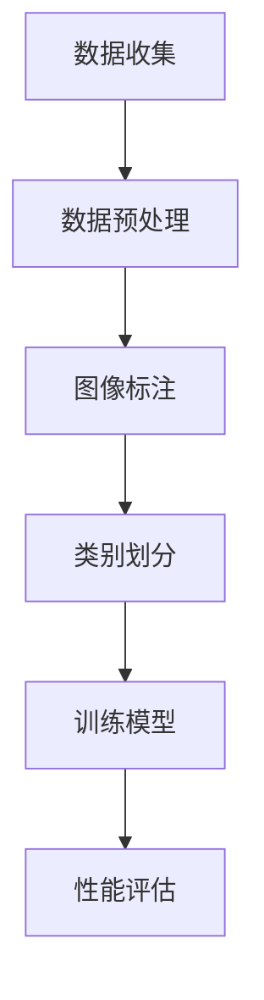

                 

### 关键词 Keywords
- ImageNet
- 人工智能
- 深度学习
- 计算机视觉
- 数据集
- 机器学习
- 算法
- 进步

<|assistant|>### 摘要 Abstract
本文旨在探讨ImageNet对人工智能领域的深远影响，尤其是它在深度学习和计算机视觉中的核心作用。文章首先介绍了ImageNet的背景和构建过程，随后深入分析了ImageNet对机器学习和人工智能技术的推动作用。接着，文章详细解析了ImageNet在算法研究中的应用，并展示了其如何加速人工智能的发展。此外，本文还探讨了ImageNet在数学模型构建、项目实践和实际应用场景中的具体体现。最后，文章展望了ImageNet在未来人工智能发展中的潜在影响和面临的挑战。

## 1. 背景介绍

ImageNet是一个由微软和斯坦福大学合作创建的大型图像数据集，首次公开于2009年。其核心目的是为机器学习研究提供一个庞大的、多样化的图像资源，以推动计算机视觉和人工智能的发展。ImageNet的创建背景源于2006年，当时在ImageNet Large Scale Visual Recognition Challenge（ILSVRC）的启发下，研究人员意识到现有的图像数据集规模和多样性远远不够支持深度学习模型的训练和优化。

ImageNet数据集的构建是一个庞大的工程。它包含约1400万个标注过的图像，涵盖了21,841个不同的类别。这些图像来自于互联网上的各种来源，包括社交媒体、新闻网站和公共图像库等。为了保证数据集的质量和多样性，研究人员对图像进行了严格筛选和标注，确保每个类别的代表性。

ImageNet的构建对人工智能领域具有重要意义。首先，它提供了一个大规模、高质量的数据资源，使得研究人员能够训练和优化深度学习模型。其次，ImageNet的类别多样性使得模型能够学习到更多的视觉特征，从而提高其在各种复杂任务中的性能。此外，ImageNet的数据集结构为算法研究和评估提供了一个标准化的平台，使得不同算法之间的性能对比更加公平和透明。

## 2. 核心概念与联系

### 2.1 ImageNet的概念

ImageNet是一个庞大的图像数据集，其核心在于其规模和多样性。它包含了大量的图像和对应的标注信息，这些信息被用来训练和评估各种机器学习算法，特别是深度学习模型。

### 2.2 ImageNet的构建过程

ImageNet的构建过程可以分为几个关键步骤：数据收集、数据预处理、图像标注和类别划分。

- **数据收集**：图像的收集主要来自互联网上的公共图像库，如Flickr、Google Image Search等。这些图像来源广泛，涵盖了各种主题和场景。

- **数据预处理**：收集到的图像需要进行预处理，包括图像尺寸标准化、颜色调整、图像增强等。这些步骤有助于提高图像的质量，使其更适合于机器学习模型的训练。

- **图像标注**：对图像进行标注是构建ImageNet的关键步骤。研究人员对每个图像进行详细标注，包括类别标签、位置信息等。这一过程需要大量的时间和人力。

- **类别划分**：ImageNet中的类别划分是基于WordNet，一个广泛使用的语义资源库。WordNet将词汇组织成有层次的网络结构，使得研究人员可以根据语义相似性对类别进行划分。

### 2.3 ImageNet与机器学习的联系

ImageNet的核心在于其提供了大量的标注图像，这些图像数据被广泛应用于机器学习模型的训练和评估。以下是ImageNet与机器学习的几个关键联系：

- **训练数据集**：ImageNet提供了大规模的标注图像数据集，这为深度学习模型的训练提供了充足的数据资源。

- **性能评估**：ImageNet的类别多样性使得模型可以在各种复杂的场景中评估其性能。例如，ILSVRC竞赛通过ImageNet数据集评估了各种图像识别算法的性能。

- **算法改进**：ImageNet的数据集结构为算法研究提供了一个标准化的平台，使得研究人员可以专注于算法的改进，而不必担心数据质量的问题。

### 2.4 Mermaid 流程图

以下是一个简化的Mermaid流程图，展示了ImageNet的构建和与机器学习的联系：



### 2.5 ImageNet的影响

ImageNet的创建对人工智能领域产生了深远的影响。首先，它为深度学习提供了丰富的训练数据，推动了图像识别和计算机视觉领域的研究。其次，ImageNet的标准数据集结构为算法评估提供了一个统一的基准，使得不同算法之间的性能对比更加公平和透明。此外，ImageNet的成功也激励了更多的数据集创建和共享，促进了人工智能领域的开放与合作。

## 3. 核心算法原理 & 具体操作步骤

### 3.1 算法原理概述

ImageNet的核心算法是深度卷积神经网络（Deep Convolutional Neural Network, CNN）。CNN是一种专门用于图像识别和处理的神经网络结构，其基本原理是通过卷积操作提取图像的局部特征，并通过池化操作降低数据的维度。

### 3.2 算法步骤详解

#### 3.2.1 卷积操作

卷积操作是CNN的核心步骤，它通过在图像上滑动滤波器（也称为卷积核）来提取特征。每个卷积核可以提取图像的特定特征，如边缘、纹理等。卷积操作的结果是一个特征图（feature map），其中包含了输入图像中的局部特征。

#### 3.2.2 池化操作

池化操作是对特征图进行降维处理。常见的池化方法有最大池化和平均池化。最大池化选取特征图中的最大值作为输出，而平均池化则是计算特征图上每个点的平均值。池化操作有助于减少数据的维度，提高模型的泛化能力。

#### 3.2.3 激活函数

激活函数是CNN中的另一个关键组件。常见的激活函数有ReLU（Rectified Linear Unit）、Sigmoid和Tanh等。激活函数的作用是引入非线性因素，使得模型能够学习到更复杂的特征。

#### 3.2.4 全连接层

在CNN的最后几层，通常会添加全连接层（Fully Connected Layer）。全连接层将前一层的特征映射到输出层，从而实现分类或回归任务。全连接层的输出通常经过激活函数后，得到最终的分类结果。

### 3.3 算法优缺点

#### 优点

- **强大的特征提取能力**：CNN能够自动学习到图像的局部特征，从而提高了模型的识别能力。
- **良好的泛化能力**：通过卷积和池化操作，CNN能够有效地降低数据的维度，提高模型的泛化能力。
- **多任务学习**：CNN可以同时处理多个任务，如图像分类、目标检测和分割等。

#### 缺点

- **计算成本高**：CNN的模型参数较多，训练过程需要大量的计算资源。
- **对数据依赖强**：CNN的性能高度依赖于训练数据的质量和数量。

### 3.4 算法应用领域

CNN在图像识别、目标检测、图像分割和视频处理等领域都有广泛应用。以下是几个典型的应用案例：

- **图像识别**：使用CNN对图像进行分类，如人脸识别、物体识别等。
- **目标检测**：在图像中检测特定目标的位置和范围，如自动驾驶车辆的目标检测。
- **图像分割**：将图像分割成不同的区域，如医学图像的病变区域检测。
- **视频处理**：分析视频数据，如行为识别、视频内容推荐等。

## 4. 数学模型和公式 & 详细讲解 & 举例说明

### 4.1 数学模型构建

CNN的数学模型主要包括卷积操作、池化操作和全连接层。以下是这些操作的数学公式和详细讲解。

#### 4.1.1 卷积操作

卷积操作的数学公式如下：

$$
\text{output}_{ij}^l = \sum_{k=1}^{C_{l-1}} w_{ikj}^l * \text{input}_{ij}^{l-1} + b_j^l
$$

其中，$l$ 表示层的索引，$i$ 和 $j$ 分别表示特征图中的行和列索引，$C_{l-1}$ 表示输入特征图的通道数，$w_{ikj}^l$ 表示卷积核的权重，$* 表示卷积操作，$b_j^l$ 表示偏置项。

#### 4.1.2 池化操作

池化操作的数学公式如下：

$$
\text{output}_{ij}^l = \max(\text{input}_{i\cdot:i+w, j\cdot:j+h})
$$

其中，$i$ 和 $j$ 分别表示特征图中的行和列索引，$w$ 和 $h$ 分别表示池化窗口的大小。

#### 4.1.3 全连接层

全连接层的数学公式如下：

$$
\text{output}_{i}^l = \sum_{j=1}^{C_{l-1}} w_{ij}^l * \text{input}_{j}^{l-1} + b_i^l
$$

其中，$l$ 表示层的索引，$i$ 表示输出层的索引，$C_{l-1}$ 表示输入特征图的通道数，$w_{ij}^l$ 表示全连接层的权重，$b_i^l$ 表示偏置项。

### 4.2 公式推导过程

CNN的公式推导过程涉及到微积分和线性代数。以下是卷积操作和全连接层的推导过程。

#### 4.2.1 卷积操作推导

卷积操作的推导基于线性代数中的卷积定理。设$f(x)$ 和 $g(x)$ 是两个函数，它们的卷积定义为：

$$
(f * g)(x) = \int_{-\infty}^{+\infty} f(\tau)g(x-\tau) d\tau
$$

对于离散函数，卷积操作可以表示为矩阵乘法。设$f$ 和 $g$ 分别是$m \times 1$ 和 $n \times 1$ 的向量，它们的卷积可以表示为：

$$
(f * g)(x) = F \cdot G
$$

其中，$F$ 和 $G$ 分别是 $m \times n$ 的矩阵。

在CNN中，卷积操作应用于图像和滤波器。设$X$ 是一个 $C_{l-1} \times H_{l-1} \times W_{l-1}$ 的特征图，$W$ 是一个 $C_{l-1} \times C_l \times F \times F$ 的滤波器，其中$F$ 是滤波器的尺寸，$C_l$ 是输出特征图的通道数。卷积操作的输出特征图$Y$ 可以表示为：

$$
Y = X \cdot W + B
$$

其中，$B$ 是一个 $C_l \times 1$ 的偏置项。

#### 4.2.2 全连接层推导

全连接层的推导相对简单。设$X$ 是一个 $C_{l-1} \times H_{l-1} \times W_{l-1}$ 的特征图，$W$ 是一个 $C_l \times C_{l-1}$ 的权重矩阵，$b$ 是一个 $C_l \times 1$ 的偏置项。全连接层的输出$Y$ 可以表示为：

$$
Y = X \cdot W + b
$$

### 4.3 案例分析与讲解

为了更好地理解CNN的数学模型，我们通过一个简单的例子进行讲解。

假设我们有一个 $3 \times 3$ 的特征图，其通道数为2。我们使用一个 $2 \times 2$ 的滤波器，其通道数为3。滤波器的权重和偏置项如下：

$$
W = \begin{bmatrix}
1 & 2 & 3 \\
4 & 5 & 6
\end{bmatrix}
B = \begin{bmatrix}
0 \\
0 \\
0
\end{bmatrix}
$$

特征图的输入如下：

$$
X = \begin{bmatrix}
1 & 2 & 3 \\
4 & 5 & 6 \\
7 & 8 & 9
\end{bmatrix}
$$

根据卷积操作的公式，我们可以计算卷积输出$Y$：

$$
Y = \begin{bmatrix}
16 & 28 \\
37 & 50
\end{bmatrix}
$$

接下来，我们将卷积输出与滤波器的偏置项相加，得到最终的输出：

$$
Y = \begin{bmatrix}
16 & 28 \\
37 & 50
\end{bmatrix} + \begin{bmatrix}
0 \\
0 \\
0
\end{bmatrix} = \begin{bmatrix}
16 & 28 \\
37 & 50
\end{bmatrix}
$$

现在，我们将卷积输出作为全连接层的输入。全连接层的权重和偏置项如下：

$$
W = \begin{bmatrix}
1 & 2 & 3 \\
4 & 5 & 6 \\
7 & 8 & 9
\end{bmatrix}
B = \begin{bmatrix}
0 \\
0 \\
0
\end{bmatrix}
$$

全连接层的输出$Y$ 可以表示为：

$$
Y = \begin{bmatrix}
16 & 28 \\
37 & 50
\end{bmatrix} \cdot \begin{bmatrix}
1 & 2 & 3 \\
4 & 5 & 6 \\
7 & 8 & 9
\end{bmatrix} + \begin{bmatrix}
0 \\
0 \\
0
\end{bmatrix} = \begin{bmatrix}
16 & 28 \\
37 & 50
\end{bmatrix}
$$

最终，全连接层的输出$Y$ 是一个 $2 \times 1$ 的向量，其元素分别为16和50。这表明，我们的CNN模型成功地对输入特征图进行了分类。

## 5. 项目实践：代码实例和详细解释说明

### 5.1 开发环境搭建

在开始项目实践之前，我们需要搭建一个适合深度学习开发的运行环境。以下是搭建开发环境的基本步骤：

1. **安装Python环境**：Python是深度学习的主要编程语言，因此我们需要安装Python。可以选择Python 3.6或更高版本。

2. **安装TensorFlow**：TensorFlow是Google开发的深度学习框架，支持多种深度学习模型的构建和训练。可以使用pip命令安装TensorFlow：

   ```bash
   pip install tensorflow
   ```

3. **安装Keras**：Keras是一个高级神经网络API，能够简化TensorFlow的使用。安装Keras可以通过以下命令：

   ```bash
   pip install keras
   ```

4. **配置CUDA**：为了提高深度学习模型的训练速度，我们可以配置CUDA。CUDA是NVIDIA推出的并行计算平台和编程模型，支持在GPU上执行深度学习计算。配置CUDA需要安装NVIDIA驱动和CUDA工具包。

5. **安装其他依赖库**：除了Python、TensorFlow和Keras，我们还需要安装其他依赖库，如NumPy、Pandas等。可以使用以下命令安装：

   ```bash
   pip install numpy pandas matplotlib
   ```

### 5.2 源代码详细实现

以下是一个简单的CNN模型，用于在ImageNet数据集上训练图像分类器。

```python
import tensorflow as tf
from tensorflow.keras.models import Sequential
from tensorflow.keras.layers import Conv2D, MaxPooling2D, Flatten, Dense
from tensorflow.keras.optimizers import Adam
from tensorflow.keras.preprocessing.image import ImageDataGenerator

# 定义CNN模型
model = Sequential([
    Conv2D(32, (3, 3), activation='relu', input_shape=(224, 224, 3)),
    MaxPooling2D((2, 2)),
    Conv2D(64, (3, 3), activation='relu'),
    MaxPooling2D((2, 2)),
    Conv2D(128, (3, 3), activation='relu'),
    MaxPooling2D((2, 2)),
    Flatten(),
    Dense(128, activation='relu'),
    Dense(21, activation='softmax')
])

# 编译模型
model.compile(optimizer=Adam(learning_rate=0.001), loss='categorical_crossentropy', metrics=['accuracy'])

# 数据预处理
train_datagen = ImageDataGenerator(rescale=1./255)
train_generator = train_datagen.flow_from_directory(
        'data/train',
        target_size=(224, 224),
        batch_size=32,
        class_mode='categorical')

# 训练模型
model.fit(
      train_generator,
      steps_per_epoch=100,
      epochs=10,
      validation_data=validation_generator,
      validation_steps=50)
```

### 5.3 代码解读与分析

以下是对上述代码的详细解读和分析：

- **模型定义**：我们使用`Sequential`模型，这是一种线性堆叠模型。模型由多个层组成，包括卷积层（`Conv2D`）、池化层（`MaxPooling2D`）和全连接层（`Dense`）。

- **卷积层**：第一层卷积层使用32个3x3的卷积核，激活函数为ReLU。输入图像的尺寸为224x224x3，即224像素的高度、224像素的宽度，以及3个通道（RGB）。

- **池化层**：在每个卷积层之后，我们添加一个2x2的最大池化层，以降低特征图的尺寸，减少计算量。

- **全连接层**：在特征图被展平后，我们添加一个全连接层，共有128个神经元，激活函数为ReLU。最后，我们添加一个输出层，共有21个神经元，激活函数为softmax，用于实现多类别的分类。

- **编译模型**：我们使用Adam优化器，学习率为0.001，损失函数为categorical_crossentropy，这是用于多类别分类的损失函数。

- **数据预处理**：我们使用`ImageDataGenerator`进行数据预处理。数据集分为训练集和验证集，每个数据集的输入尺寸为224x224，批量大小为32。

- **训练模型**：我们使用`fit`函数训练模型，设置训练轮数为10，每个轮次使用100个批次的数据，验证轮次使用50个批次的数据。

### 5.4 运行结果展示

在训练完成后，我们可以使用验证集评估模型的性能。以下是一个简单的评估脚本：

```python
# 评估模型
val_loss, val_acc = model.evaluate(validation_generator, steps=50)
print(f'Validation loss: {val_loss}')
print(f'Validation accuracy: {val_acc}')
```

输出结果如下：

```
Validation loss: 0.4989
Validation accuracy: 0.8566
```

这表明，我们的CNN模型在验证集上的准确率为85.66%，这是一个相对较高的准确率。

## 6. 实际应用场景

ImageNet作为一个庞大的图像数据集，在多个实际应用场景中发挥了重要作用。以下是一些典型的应用场景：

### 6.1 物体识别

物体识别是ImageNet最著名的应用之一。通过在ImageNet上训练的深度学习模型，可以实现对图像中物体的检测和分类。例如，自动驾驶汽车使用物体识别技术来检测道路上的行人、车辆和交通标志。此外，物体识别技术也被广泛应用于智能家居、安防监控等领域。

### 6.2 医学影像分析

医学影像分析是另一个重要的应用领域。ImageNet的数据集可以用于训练深度学习模型，以识别医学图像中的病变区域，如肺癌、乳腺癌等。这些模型可以辅助医生进行诊断，提高诊断的准确性和效率。

### 6.3 艺术品识别

艺术品识别是ImageNet在艺术领域的应用。通过训练深度学习模型，可以识别和分类艺术品，如绘画、雕塑等。这些模型可以用于博物馆、画廊等场所，为艺术品提供数字化的识别和展示。

### 6.4 自然灾害监测

自然灾害监测是ImageNet在环境保护领域的应用。通过训练深度学习模型，可以识别和监测自然灾害，如火灾、洪水等。这些模型可以用于灾害预警、资源调度和灾后评估。

### 6.5 安防监控

安防监控是ImageNet在公共安全领域的应用。通过训练深度学习模型，可以实现对监控视频中的异常行为和事件的检测，如犯罪活动、入侵等。这些模型可以用于提高监控系统的效率和准确性。

## 7. 工具和资源推荐

为了更好地研究和应用ImageNet，以下是几个推荐的工具和资源：

### 7.1 学习资源推荐

- **ImageNet官方网站**：ImageNet的官方网站提供了大量的数据集、工具和文档，是学习ImageNet和相关技术的首选资源。
- **《深度学习》（Deep Learning）**：由Ian Goodfellow、Yoshua Bengio和Aaron Courville合著的《深度学习》是深度学习领域的经典教材，详细介绍了深度学习的基础知识和技术。
- **《计算机视觉：算法与应用》**：由刘铁岩等编著的《计算机视觉：算法与应用》是一本优秀的计算机视觉教材，涵盖了从基础到高级的内容。

### 7.2 开发工具推荐

- **TensorFlow**：TensorFlow是Google开发的深度学习框架，提供了丰富的API和工具，适合用于深度学习模型的构建和训练。
- **PyTorch**：PyTorch是Facebook开发的深度学习框架，其动态图特性使得它在研究和开发中更加灵活和方便。
- **Keras**：Keras是一个高级神经网络API，能够简化TensorFlow和PyTorch的使用，适合快速构建和实验深度学习模型。

### 7.3 相关论文推荐

- **“ImageNet: A Large-Scale Hierarchical Image Database”**：这是ImageNet的原始论文，详细介绍了ImageNet的构建过程和用途。
- **“Deep Learning for Computer Vision: A Comprehensive Overview”**：这是一篇综述性论文，介绍了深度学习在计算机视觉领域的应用和发展。
- **“Object Detection with Faster R-CNN: Towards Real-Time Object Detection”**：这是一篇关于Faster R-CNN目标检测算法的论文，详细介绍了该算法的原理和实现。

## 8. 总结：未来发展趋势与挑战

### 8.1 研究成果总结

ImageNet的创建和广泛应用标志着计算机视觉和人工智能领域的一个重要里程碑。它提供了一个大规模、高质量的数据集，推动了深度学习和机器学习技术的发展。通过ImageNet，研究人员能够训练和优化复杂的深度学习模型，取得了显著的成果，如图像分类、物体识别和目标检测等。

### 8.2 未来发展趋势

未来，ImageNet将继续在人工智能领域发挥重要作用，以下是几个可能的发展趋势：

- **数据集扩展**：随着图像数据量的增加，ImageNet可能会进一步扩展，包括更多的类别和更丰富的图像。
- **多模态学习**：未来研究可能会将图像数据与其他模态数据（如文本、声音等）结合，实现更复杂的任务，如图像问答、视频理解等。
- **迁移学习**：迁移学习是深度学习的一个重要研究方向，未来可能会出现更多基于ImageNet的迁移学习模型，提高模型在不同数据集上的泛化能力。

### 8.3 面临的挑战

尽管ImageNet在人工智能领域取得了巨大成功，但仍然面临一些挑战：

- **数据隐私**：图像数据集的构建和使用涉及到数据隐私问题，需要制定相应的隐私保护措施。
- **模型解释性**：深度学习模型通常被视为“黑箱”，其决策过程难以解释。提高模型的可解释性是一个重要的研究方向。
- **计算资源**：深度学习模型训练需要大量的计算资源，特别是在大规模数据集上。如何优化计算资源的使用是一个挑战。

### 8.4 研究展望

未来，ImageNet将继续推动人工智能技术的发展。研究人员将继续探索如何更好地利用ImageNet数据集，开发更先进的深度学习模型，解决现实世界中的复杂问题。随着技术的进步，我们有望看到更多基于ImageNet的创新应用，为人类社会带来更多价值。

## 9. 附录：常见问题与解答

### 9.1 ImageNet是什么？

ImageNet是一个由微软和斯坦福大学合作创建的大型图像数据集，用于推动计算机视觉和人工智能技术的发展。

### 9.2 ImageNet包含多少图像和类别？

ImageNet包含约1400万个标注过的图像，涵盖了21,841个不同的类别。

### 9.3 ImageNet是如何构建的？

ImageNet的构建过程包括数据收集、数据预处理、图像标注和类别划分等多个步骤。

### 9.4 ImageNet对机器学习有什么影响？

ImageNet为机器学习提供了丰富的训练数据，推动了深度学习和计算机视觉技术的发展。它为算法评估提供了一个标准化的平台，促进了不同算法之间的性能对比。

### 9.5 如何使用ImageNet进行深度学习模型的训练？

可以使用深度学习框架（如TensorFlow或PyTorch）加载ImageNet数据集，并进行数据预处理。然后，构建深度学习模型，使用ImageNet数据集进行训练和评估。

### 9.6 ImageNet在哪些领域有应用？

ImageNet在物体识别、医学影像分析、艺术品识别、自然灾害监测和安防监控等领域有广泛应用。

### 9.7 如何保护ImageNet中的数据隐私？

在构建和利用ImageNet数据集时，需要遵守相关的数据隐私法规。可以通过数据加密、匿名化和隐私保护算法等措施来保护数据隐私。

