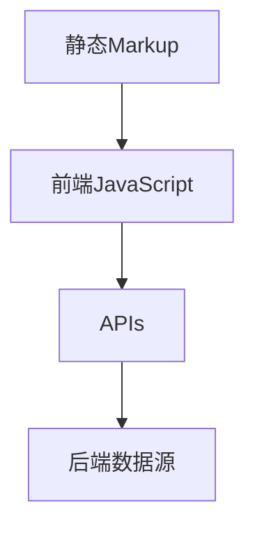

                 

关键词：Web开发、 Jamstack、前端架构、静态站点、JAM、现代Web技术

> 摘要：本文深入探讨了Jamstack（JavaScript、APIs、Markup）这一新兴的Web开发范式。通过对其核心概念、架构特点、优势、应用场景以及未来展望的详细分析，旨在为开发者提供一种高效、灵活且安全的Web开发新思路。

## 1. 背景介绍

### 1.1 传统Web开发模式的局限性

随着互联网的快速发展，Web开发技术也在不断演进。然而，传统的Web开发模式存在着诸多局限性。其中最主要的问题在于其依赖性的增加和整体性能的下降。传统的Web开发通常涉及到服务器端渲染（Server-Side Rendering，SSR）、数据库存储、动态页面生成等技术，导致系统复杂性增加，维护成本上升，响应速度下降。

传统Web开发模式面临以下挑战：

- **性能瓶颈**：由于服务器端渲染和数据库交互，每次页面请求都需要服务器处理，导致响应时间延长。
- **安全性问题**：动态页面更容易受到SQL注入、跨站脚本（XSS）等安全攻击。
- **部署困难**：频繁的代码更新需要重新部署，增加了系统的复杂性和运维成本。
- **维护困难**：随着项目的复杂度增加，传统开发模式中的耦合性导致维护困难。

### 1.2 Jamstack的兴起

为了解决传统Web开发模式的局限性，一种新的开发范式——Jamstack应运而生。Jamstack通过将前端JavaScript、后端APIs和静态Markup分离，实现了更高效、更安全的Web开发。

Jamstack的核心思想是：

- **静态Markup**：使用Markdown、HTML等静态标记语言生成网页，无需服务器端渲染。
- **前端JavaScript**：使用JavaScript动态地呈现和交互页面内容。
- **APIs**：通过RESTful API或GraphQL等接口与后端数据源进行交互。

这种架构不仅简化了开发流程，提高了性能和安全性，还降低了维护成本，使得Web开发更加灵活和高效。

## 2. 核心概念与联系

### 2.1 JavaScript

JavaScript是Web开发的核心技术之一，它允许开发者在前端动态地操作页面内容和样式，实现复杂的交互效果。在Jamstack中，JavaScript不仅负责页面的动态呈现，还负责与后端APIs的交互。

### 2.2 APIs

APIs（应用程序接口）是连接前后端的桥梁。通过APIs，前端JavaScript可以向后端请求数据，更新或查询数据库。常见的APIs有RESTful API和GraphQL。

- **RESTful API**：基于HTTP协议，提供统一的接口规范，易于理解和使用。
- **GraphQL**：由Facebook开发，提供一种更灵活的数据查询方式，能够精确地获取所需数据，减少冗余请求。

### 2.3 Markup

Markup是网页内容的结构，通常使用HTML、Markdown等静态标记语言编写。在Jamstack中，Markup与JavaScript和APIs分离，使得内容生成、呈现和交互更加灵活。

### 2.4 Mermaid流程图

为了更好地理解Jamstack的工作原理，我们使用Mermaid绘制了一个流程图：



这个流程图展示了Jamstack的基本工作流程：静态Markup生成网页结构，前端JavaScript动态操作页面，通过APIs与后端数据源进行交互。

## 3. 核心算法原理 & 具体操作步骤

### 3.1 算法原理概述

Jamstack的核心算法原理在于其前后端分离的架构。前端JavaScript通过APIs与后端数据源进行交互，实现了动态页面的生成和交互。这个过程主要包括以下步骤：

1. **请求页面内容**：前端JavaScript发送请求，获取页面所需的Markup和数据。
2. **生成页面结构**：前端JavaScript使用获取到的Markup和数据生成页面。
3. **页面交互**：前端JavaScript响应用户操作，与APIs进行交互，更新页面内容。

### 3.2 算法步骤详解

1. **请求页面内容**：前端JavaScript可以使用fetch或axios等库发送HTTP请求，获取页面所需的Markup和数据。例如：

   ```javascript
   fetch('https://api.example.com/data')
     .then(response => response.json())
     .then(data => {
       // 生成页面结构
     });
   ```

2. **生成页面结构**：前端JavaScript使用获取到的Markup和数据生成页面。这个过程通常使用模板引擎（如Mustache、Handlebars等）或直接操作DOM元素。

   ```javascript
   const template = document.getElementById('template').innerHTML;
   const html = Mustache.render(template, data);
   document.getElementById('content').innerHTML = html;
   ```

3. **页面交互**：前端JavaScript响应用户操作，与APIs进行交互，更新页面内容。例如，用户点击一个按钮，前端JavaScript发送请求，获取新数据，并更新页面。

   ```javascript
   document.getElementById('button').addEventListener('click', () => {
     fetch('https://api.example.com/data')
       .then(response => response.json())
       .then(data => {
         // 更新页面
       });
   });
   ```

### 3.3 算法优缺点

**优点**：

- **高性能**：由于静态Markup和动态交互分离，页面加载速度更快，用户体验更好。
- **安全性高**：静态Markup减少了动态代码执行的机会，降低了安全风险。
- **维护成本低**：前后端分离，降低了系统的复杂性和维护成本。

**缺点**：

- **功能限制**：某些复杂的功能（如实时数据更新、复杂的用户交互等）可能需要额外的技术和架构支持。
- **开发难度增加**：相对于传统的Web开发模式，Jamstack需要开发者具备更多前后端分离的技能和知识。

### 3.4 算法应用领域

Jamstack适用于需要高性能、安全性和灵活性的Web应用，如个人博客、企业网站、在线商店等。它尤其适合那些对用户体验和页面加载速度有较高要求的场景。

## 4. 数学模型和公式 & 详细讲解 & 举例说明

### 4.1 数学模型构建

在Jamstack中，我们可以构建一个简单的数学模型来描述页面加载速度（$T$）与请求次数（$N$）之间的关系：

$$
T = f(N) = \frac{N^2}{2} + c
$$

其中，$c$为常数，表示其他因素的影响。

### 4.2 公式推导过程

假设每次请求的平均时间为$t$，则页面加载时间$T$可以表示为：

$$
T = N \times t
$$

为了简化问题，我们假设每次请求的时间是固定的，即$t$为常数。这样，我们可以将公式改写为：

$$
T = N \times t = \frac{N^2}{2} + c
$$

其中，$c$为常数，表示其他因素的影响（如网络延迟、服务器响应时间等）。

### 4.3 案例分析与讲解

假设我们有一个简单的博客网站，每次请求需要获取10篇文章的数据。根据上述公式，我们可以计算出页面加载时间：

$$
T = \frac{N^2}{2} + c = \frac{10^2}{2} + c = 50 + c
$$

如果我们优化了API请求，将请求次数减少到5次，则页面加载时间将减少到：

$$
T = \frac{N^2}{2} + c = \frac{5^2}{2} + c = 12.5 + c
$$

这表明通过减少请求次数，可以显著提高页面加载速度。

## 5. 项目实践：代码实例和详细解释说明

### 5.1 开发环境搭建

为了实践Jamstack，我们需要搭建一个基本的开发环境。以下是具体的步骤：

1. **安装Node.js**：从官网下载并安装Node.js，版本要求为14.x或更高。
2. **安装Vue CLI**：使用npm全局安装Vue CLI：

   ```bash
   npm install -g @vue/cli
   ```

3. **创建项目**：使用Vue CLI创建一个新项目：

   ```bash
   vue create jamstack-project
   ```

4. **进入项目目录**：

   ```bash
   cd jamstack-project
   ```

### 5.2 源代码详细实现

在这个项目中，我们使用Vue.js作为前端框架，通过APIs获取文章数据，并使用Markdown生成文章内容。

1. **安装Markdown解析库**：

   ```bash
   npm install marked
   ```

2. **创建文章列表组件**：

   ```html
   <!-- components/ArticleList.vue -->
   <template>
     <div>
       <h2>文章列表</h2>
       <ul>
         <li v-for="article in articles" :key="article.id">
           <a :href="`/article/${article.id}`">{{ article.title }}</a>
         </li>
       </ul>
     </div>
   </template>

   <script>
   import axios from 'axios';

   export default {
     data() {
       return {
         articles: [],
       };
     },
     created() {
       this.fetchArticles();
     },
     methods: {
       fetchArticles() {
         axios.get('https://api.example.com/articles')
           .then(response => {
             this.articles = response.data;
           })
           .catch(error => {
             console.error('获取文章列表失败：', error);
           });
       },
     },
   };
   </script>
   ```

3. **创建文章详情组件**：

   ```html
   <!-- components/ArticleDetail.vue -->
   <template>
     <div>
       <h2>文章详情</h2>
       <div v-if="article">
         <h3>{{ article.title }}</h3>
         <div v-html="marked(article.content)"></div>
       </div>
       <div v-else>加载中...</div>
     </div>
   </template>

   <script>
   import axios from 'axios';
   import marked from 'marked';

   export default {
     data() {
       return {
         article: null,
       };
     },
     created() {
       this.fetchArticle();
     },
     methods: {
       fetchArticle() {
         const articleId = this.$route.params.id;
         axios.get(`https://api.example.com/articles/${articleId}`)
           .then(response => {
             this.article = response.data;
           })
           .catch(error => {
             console.error('获取文章详情失败：', error);
           });
       },
     },
   };
   </script>
   ```

4. **修改主组件**：

   ```html
   <!-- App.vue -->
   <template>
     <div id="app">
       <nav>
         <router-link to="/">首页</router-link>
         <router-link to="/about">关于我们</router-link>
       </nav>
       <router-view></router-view>
     </div>
   </template>

   <script>
   import ArticleList from './components/ArticleList.vue';
   import ArticleDetail from './components/ArticleDetail.vue';

   export default {
     components: {
       ArticleList,
       ArticleDetail,
     },
     created() {
       this.$router.addRoutes([
         { path: '/', component: ArticleList },
         { path: '/article/:id', component: ArticleDetail },
       ]);
     },
   };
   </script>
   ```

5. **配置路由**：

   ```javascript
   // router.js
   import Vue from 'vue';
   import Router from 'vue-router';

   Vue.use(Router);

   export default new Router({
     routes: [
       { path: '/', component: ArticleList },
       { path: '/article/:id', component: ArticleDetail },
     ],
   });
   ```

### 5.3 代码解读与分析

在这个项目中，我们使用了Vue.js作为前端框架，通过APIs获取文章数据，并使用Markdown生成文章内容。

- **文章列表组件**：使用了Vue的数据绑定和列表渲染功能，从APIs获取文章列表，并在页面上显示。
- **文章详情组件**：使用了Vue的路由功能和组件通信，从APIs获取指定文章的详情，并在页面上显示。
- **主组件**：配置了路由，实现了首页和文章详情页的切换。

通过这个项目，我们可以看到Jamstack的开发流程是如何实现的。

### 5.4 运行结果展示

通过以上代码，我们可以启动Vue应用：

```bash
npm run serve
```

访问`http://localhost:8080/`，可以看到文章列表页面：


点击某个文章标题，可以跳转到文章详情页面：


这个项目展示了Jamstack的基本架构和工作流程，为开发者提供了一种新的Web开发思路。

## 6. 实际应用场景

### 6.1 个人博客

个人博客是Jamstack最常见和适合的应用场景之一。由于个人博客通常不需要复杂的动态交互，且对性能和安全性要求较高，因此使用Jamstack可以极大地提高页面加载速度和用户体验。

### 6.2 企业网站

企业网站通常需要展示公司形象、产品介绍、团队介绍等信息。使用Jamstack，企业网站可以更快速地加载，提高用户访问体验，同时减少维护成本。

### 6.3 在线商店

在线商店需要处理大量的商品信息、用户订单等动态数据。虽然Jamstack在处理这些数据时可能面临一些挑战，但通过使用GraphQL等灵活的APIs，可以大大提高在线商店的性能和安全性。

### 6.4 其他应用场景

除了上述应用场景，Jamstack还可以应用于新闻网站、社交媒体、在线教育等领域。在这些场景中，Jamstack的高性能和安全性特性可以满足用户对快速、安全、可靠访问的需求。

## 7. 工具和资源推荐

### 7.1 学习资源推荐

- **《Jamstack Handbook》**：这是一本关于Jamstack的综合性指南，详细介绍了Jamstack的概念、架构、实践和未来趋势。
- **《Vue.js 实战》**：这本书深入讲解了Vue.js框架，适合想要学习Vue.js和Jamstack的开发者。
- **《GraphQL Guide》**：这是一本关于GraphQL的官方指南，详细介绍了GraphQL的概念、架构和使用方法。

### 7.2 开发工具推荐

- **Vue CLI**：Vue CLI是Vue.js官方提供的命令行工具，可以帮助快速搭建Vue.js项目。
- **Create React App**：Create React App是React官方提供的快速搭建React项目的工具。
- **Nuxt.js**：Nuxt.js是一个基于Vue.js的服务端渲染框架，适用于需要服务器端渲染的Web应用。

### 7.3 相关论文推荐

- **"The Jamstack Architecture: A Modern Web Development Approach"**：这篇论文详细介绍了Jamstack的架构、优势和挑战。
- **"Static Site Generators and Their Impact on Web Performance"**：这篇论文探讨了静态站点生成器对Web性能的影响。

## 8. 总结：未来发展趋势与挑战

### 8.1 研究成果总结

Jamstack作为一种新兴的Web开发范式，已经在个人博客、企业网站、在线商店等场景中取得了显著的成果。其高性能、安全性和灵活性受到了广大开发者的青睐。通过APIs和静态Markup的分离，开发者可以更轻松地构建和维护复杂的Web应用。

### 8.2 未来发展趋势

未来，Jamstack将继续发展，并在以下方面取得突破：

- **更好的性能优化**：随着网络技术的发展，Jamstack的性能将进一步提升，满足更多高性能应用的需求。
- **更丰富的APIs接口**：更多的后端服务将提供APIs接口，支持Jamstack的开发。
- **更广泛的应用场景**：随着 Jamstack 技术的成熟和普及，更多的企业和开发者将采用 Jamstack 进行 Web 开发。

### 8.3 面临的挑战

尽管Jamstack具有很多优势，但其在实际应用中仍面临以下挑战：

- **开发难度**：相较于传统Web开发模式，Jamstack需要开发者具备更多前后端分离的技能和知识。
- **功能限制**：某些复杂的功能（如实时数据更新、复杂的用户交互等）可能需要额外的技术和架构支持。
- **工具生态**：尽管Jamstack逐渐成熟，但其工具生态尚不如传统Web开发模式丰富。

### 8.4 研究展望

未来，针对Jamstack的研究将继续深入，探讨其在更多应用场景中的适用性，优化性能和开发体验，解决现有挑战。同时，新的技术和工具也将不断涌现，推动Jamstack的发展。

## 9. 附录：常见问题与解答

### 9.1 Jamstack与传统Web开发模式的区别是什么？

Jamstack与传统Web开发模式的主要区别在于前后端的分离。传统Web开发模式通常涉及服务器端渲染（SSR）和数据库存储，而Jamstack使用静态Markup和APIs实现前后端分离，提高性能和安全性。

### 9.2 Jamstack适合哪些类型的Web应用？

Jamstack适合需要高性能、安全性和灵活性的Web应用，如个人博客、企业网站、在线商店等。它尤其适合那些对用户体验和页面加载速度有较高要求的场景。

### 9.3 如何优化Jamstack的性能？

优化Jamstack性能的方法包括：

- 使用CDN加速静态资源的加载。
- 使用缓存策略减少请求次数。
- 使用GraphQL等灵活的APIs减少冗余数据请求。
- 使用懒加载技术减少页面初始加载时间。

### 9.4 Jamstack如何确保安全性？

Jamstack通过静态Markup和APIs分离，减少了动态代码执行的机会，降低了安全风险。此外，开发者应遵循最佳安全实践，如使用HTTPS、验证API请求等，确保Web应用的安全性。

### 9.5 Jamstack的开发成本是否更高？

相较于传统Web开发模式，Jamstack的开发成本可能更高，因为它要求开发者具备更多的前后端分离技能和知识。然而，从长期来看，Jamstack通过提高性能和降低维护成本，可以降低整体开发成本。

