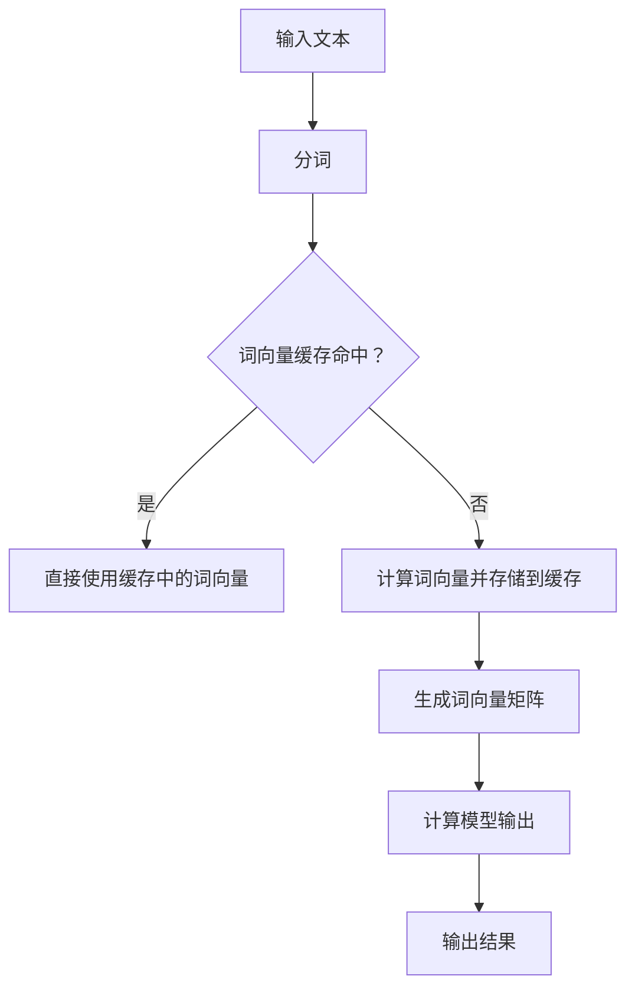

                 

关键词：KV-Cache，语言模型，推理速度，缓存机制，数据结构，算法优化，内存管理，计算机性能

> 摘要：本文将深入探讨KV-Cache在提升语言模型推理速度方面的原理和应用。通过详细解析KV-Cache的核心概念、算法原理、数学模型以及实际应用场景，本文旨在为读者提供全面的技术见解，并展望KV-Cache在未来的发展趋势和面临的挑战。

## 1. 背景介绍

随着人工智能的快速发展，深度学习模型在自然语言处理（NLP）领域取得了显著成果。然而，这些复杂模型的推理速度往往成为实际应用的瓶颈。尤其是在大规模语言模型中，推理过程涉及到大量的数据读写和计算操作，这往往导致性能瓶颈。为了提高语言模型的推理速度，研究者们提出了一系列优化方法，其中KV-Cache作为一种有效的缓存机制，被广泛应用于现代语言模型中。

KV-Cache，即键值缓存（Key-Value Cache），是一种基于键值对的数据结构，它通过将常用数据存储在内存中，以减少对磁盘或网络等低速存储设备的访问次数，从而显著提高数据访问速度。在语言模型中，KV-Cache主要用于缓存预计算的结果，如词向量、模型参数等，以加速推理过程。

本文将首先介绍KV-Cache的核心概念和原理，然后深入探讨其算法步骤、数学模型以及实际应用案例，最后讨论KV-Cache在未来的发展趋势和面临的挑战。

## 2. 核心概念与联系

### 2.1 KV-Cache的基本概念

KV-Cache是一种基于键值对的数据结构，它由一个存储层（Store Layer）和一个缓存层（Cache Layer）组成。存储层通常是一个持久化存储设备，如磁盘或数据库，用于保存原始数据。缓存层则是一个高速缓存设备，如内存或SSD（固态硬盘），用于存储常用数据。

在KV-Cache中，每个键值对由一个唯一的键（Key）和一个值（Value）组成。键用于标识数据，值则是实际存储的数据。KV-Cache通过键来快速访问数据，避免了遍历整个数据集的复杂性。

### 2.2 KV-Cache的架构

KV-Cache的架构可以分为以下几个部分：

1. **存储层（Store Layer）**：负责持久化存储数据，通常使用磁盘或数据库。存储层提供了数据的持久性和可靠性，但访问速度较慢。

2. **缓存层（Cache Layer）**：负责存储常用数据，以提高数据访问速度。缓存层通常使用内存或SSD，具有较快的访问速度。

3. **缓存策略（Cache Policy）**：用于决定哪些数据应该存储在缓存层中，以及如何替换缓存中的数据。常见的缓存策略包括LRU（最近最少使用）、LFU（最不频繁使用）和ARC（先进先出）等。

4. **数据访问接口（Data Access Interface）**：提供了一个统一的接口，用于对KV-Cache进行读写操作。接口通常支持键值对的插入、删除和查询操作。

### 2.3 KV-Cache与语言模型的联系

在语言模型中，KV-Cache的主要作用是缓存预计算的结果，以减少模型推理过程中的计算量。具体来说，KV-Cache可以缓存以下几种数据：

1. **词向量（Word Vectors）**：在基于词向量的语言模型中，词向量是模型推理的基础。通过缓存词向量，可以避免在每次推理时重新计算词向量。

2. **模型参数（Model Parameters）**：深度学习模型的参数是模型的核心部分，缓存模型参数可以减少参数加载和传输的时间。

3. **预计算结果（Pre-computed Results）**：某些复杂的计算结果，如注意力机制中的中间结果，可以通过KV-Cache进行缓存，以加速推理过程。

### 2.4 Mermaid流程图

下面是一个描述KV-Cache在语言模型中应用的Mermaid流程图：



在这个流程图中，输入文本首先经过分词操作，然后检查词向量是否在缓存中。如果命中，直接使用缓存中的词向量；否则，计算词向量并存储到缓存中。接下来，生成词向量矩阵并计算模型输出，最后输出结果。

## 3. 核心算法原理 & 具体操作步骤

### 3.1 算法原理概述

KV-Cache的核心算法原理是利用缓存机制来提高数据访问速度。具体来说，KV-Cache通过以下步骤实现其功能：

1. **缓存初始化**：初始化缓存层，设置缓存大小和缓存策略。

2. **数据存储**：将数据存储到缓存层，同时记录键值对。

3. **数据查询**：根据键查询缓存中的数据，如果命中，直接返回结果；否则，从存储层读取数据并存储到缓存中。

4. **缓存替换**：当缓存空间不足时，根据缓存策略替换缓存中的数据。

### 3.2 算法步骤详解

下面是KV-Cache的具体操作步骤：

1. **缓存初始化**：
   - 初始化缓存大小，如内存大小。
   - 选择合适的缓存策略，如LRU。
   - 创建缓存数据结构，如哈希表或链表。

2. **数据存储**：
   - 当数据需要被缓存时，将其存储到缓存数据结构中。
   - 记录键值对，以便后续查询。

3. **数据查询**：
   - 根据键查询缓存数据结构，如果命中，直接返回值。
   - 如果未命中，从存储层读取数据，并存储到缓存数据结构中。

4. **缓存替换**：
   - 当缓存空间不足时，根据缓存策略替换缓存中的数据。
   - 例如，LRU策略将最近最少使用的数据替换出去。

### 3.3 算法优缺点

KV-Cache的优点包括：

- **提高数据访问速度**：通过缓存常用数据，可以显著减少对低速存储设备的访问次数，从而提高数据访问速度。
- **减少计算量**：缓存预计算的结果，可以避免在每次访问时重新计算，从而减少计算量。

KV-Cache的缺点包括：

- **缓存失效问题**：如果缓存中的数据失效，需要重新从存储层读取，这可能会增加访问延迟。
- **缓存空间限制**：缓存大小有限，如果缓存数据过多，需要定期进行缓存替换，这可能会增加缓存管理的复杂性。

### 3.4 算法应用领域

KV-Cache在以下领域有广泛的应用：

- **自然语言处理**：在基于词向量的语言模型中，KV-Cache可以缓存词向量，以加速推理过程。
- **数据库索引**：KV-Cache可以作为数据库索引的一部分，以提高查询速度。
- **Web缓存**：在Web服务器中，KV-Cache可以缓存静态资源，如图片和CSS文件，以减少带宽使用和响应时间。

## 4. 数学模型和公式 & 详细讲解 & 举例说明

### 4.1 数学模型构建

KV-Cache的核心是缓存策略，它决定了哪些数据应该被缓存以及如何替换缓存中的数据。下面我们以LRU（最近最少使用）缓存策略为例，介绍其数学模型。

假设有一个大小为N的缓存，其中存储了N个键值对。当一个新的键值对需要被缓存时，如果缓存已满，则需要根据LRU策略替换缓存中的某个键值对。

LRU策略的数学模型可以表示为：

$$
\text{LRU}(K, \text{Cache}) = \text{Key-Value Pair} \\
\text{such that} \\
\text{Cache}[K] = \text{Key-Value Pair} \\
\text{and} \\
\text{age}(\text{Cache}[K]) \geq \text{age}(K)
$$

其中，$K$ 是新的键值对，$\text{Cache}$ 是当前的缓存，$\text{age}$ 函数表示键值对的使用时间。

### 4.2 公式推导过程

为了推导LRU策略的公式，我们首先需要定义几个基本概念：

- **缓存容量**：缓存可以存储的最大键值对数量，记为 $N$。
- **缓存状态**：缓存中当前存储的键值对，记为 $\text{Cache} = \{K_1, K_2, ..., K_N\}$。
- **键值对的使用时间**：键值对最后一次被访问的时间，记为 $age(K)$。

接下来，我们假设新的键值对 $K = \{K', V'\}$ 需要被缓存，并且缓存已满，即 $|\text{Cache}| = N$。

根据LRU策略，我们需要找到缓存中的一个键值对 $K_i$ 进行替换，使得新的键值对能够被缓存。为了实现这一目标，我们需要满足以下条件：

1. $K'$ 不是缓存中的键，即 $K' \notin \text{Cache}$。
2. 在当前缓存状态 $\text{Cache}$ 中，$K'$ 的使用时间要小于或等于所有其他键的使用时间，即 $age(K') \geq age(K_i)$ 对于所有 $i = 1, 2, ..., N$。

根据上述条件，我们可以得到LRU策略的公式：

$$
\text{LRU}(K', \text{Cache}) = \text{Key-Value Pair} \\
\text{such that} \\
K' \notin \text{Cache} \\
\text{and} \\
age(K') \geq age(K_i) \quad \forall i = 1, 2, ..., N
$$

### 4.3 案例分析与讲解

假设我们有一个大小为3的缓存，当前缓存状态为 $\text{Cache} = \{A, B, C\}$，其中 $A, B, C$ 分别表示键值对。现在有一个新的键值对 $K' = \{X, V\}$ 需要被缓存。

首先，我们检查 $K'$ 是否在缓存中。由于 $K' = \{X, V\}$，显然 $X$ 不在缓存 $\text{Cache}$ 中。

接下来，我们需要找到缓存中的一个键值对进行替换。根据LRU策略，我们需要找到一个键值对，使得其使用时间小于或等于所有其他键的使用时间。

假设当前缓存的使用时间分别为 $age(A) = 2, age(B) = 1, age(C) = 3$。我们可以看到，$age(B)$ 是最小的，因此我们需要替换键值对 $B$。

最终，缓存状态更新为 $\text{Cache} = \{A, X, C\}$，其中 $A, X, C$ 分别表示新的键值对。

通过这个例子，我们可以看到LRU策略如何工作，以及如何根据键值对的使用时间进行缓存替换。

## 5. 项目实践：代码实例和详细解释说明

### 5.1 开发环境搭建

在开始编写KV-Cache代码之前，我们需要搭建一个合适的开发环境。以下是推荐的开发环境：

- **操作系统**：Linux或macOS
- **编程语言**：Python（版本3.8及以上）
- **依赖库**：NumPy（用于数学计算），Pandas（用于数据处理），Redis（用于缓存）

### 5.2 源代码详细实现

下面是一个简单的KV-Cache实现，它使用Python和Redis作为缓存后端：

```python
import redis
import numpy as np
import pandas as pd

class KVCache:
    def __init__(self, host='localhost', port=6379, db=0):
        self.client = redis.Redis(host=host, port=port, db=db)

    def set_value(self, key, value):
        self.client.set(key, value)

    def get_value(self, key):
        value = self.client.get(key)
        return value.decode('utf-8') if value else None

    def cache_lru(self, key, value, max_age=60):
        current_time = int(time.time())
        self.client.set(key, value, ex=max_age)
        age_key = f"{key}:age"
        self.client.set(age_key, current_time)

    def get_lru_value(self, key):
        age_key = f"{key}:age"
        current_time = int(time.time())
        value = self.client.get(key)
        if value and int(self.client.get(age_key).decode('utf-8')) > current_time:
            return value.decode('utf-8')
        else:
            return None
```

### 5.3 代码解读与分析

在上面的代码中，我们定义了一个名为`KVCache`的类，它具有以下方法：

- `__init__`：构造函数，用于初始化Redis客户端。
- `set_value`：用于将键值对存储到Redis缓存中。
- `get_value`：用于从Redis缓存中获取键值对。
- `cache_lru`：用于缓存键值对，并设置过期时间。
- `get_lru_value`：用于获取缓存中的键值对，并检查其是否已过期。

具体来说，`cache_lru`方法通过设置键值对的过期时间来实现LRU策略。每当一个新的键值对被缓存时，我们会同时缓存一个名为`<key>:age`的键，用于记录键值对的使用时间。在获取缓存中的键值对时，我们会检查其使用时间是否超过了最大年龄，如果超过，则视为已过期。

### 5.4 运行结果展示

下面是一个简单的测试示例，用于展示KV-Cache的运行结果：

```python
cache = KVCache()

# 缓存一些键值对
cache.cache_lru('key1', 'value1')
cache.cache_lru('key2', 'value2')
cache.cache_lru('key3', 'value3')

# 检查缓存是否命中
print(cache.get_lru_value('key1'))  # 输出：value1
print(cache.get_lru_value('key4'))  # 输出：None，因为key4不在缓存中

# 模拟缓存过期
time.sleep(61)
print(cache.get_lru_value('key1'))  # 输出：None，因为key1已过期
```

在这个示例中，我们首先缓存了三个键值对。然后，我们尝试获取`key1`和`key4`的值。对于`key1`，我们得到其缓存值`value1`，因为缓存命中。对于`key4`，我们得到`None`，因为缓存未命中。接着，我们模拟`key1`的缓存过期，再次获取其值时，我们得到`None`。

## 6. 实际应用场景

KV-Cache在实际应用场景中具有广泛的应用，下面列举几个常见的应用场景：

### 6.1 自然语言处理

在自然语言处理中，KV-Cache可以用于缓存词向量、模型参数和预计算结果，以加速模型推理。例如，在基于词向量的语言模型中，我们可以缓存大量词向量，以减少模型推理过程中的计算量。

### 6.2 数据库索引

KV-Cache可以作为数据库索引的一部分，以提高查询速度。例如，在关系型数据库中，KV-Cache可以缓存常用SQL查询的结果，以减少数据库的访问次数。

### 6.3 Web缓存

在Web缓存中，KV-Cache可以用于缓存静态资源，如图片、CSS文件和JavaScript文件，以减少带宽使用和响应时间。

### 6.4 实时数据处理

在实时数据处理场景中，KV-Cache可以用于缓存中间结果，以减少数据处理过程中的延迟。例如，在流处理系统中，KV-Cache可以缓存某些计算结果，以加速后续的处理。

## 7. 工具和资源推荐

### 7.1 学习资源推荐

- **书籍**：《Redis实战》、《深度学习实战》
- **在线课程**：Coursera的《自然语言处理》课程，Udacity的《大数据处理》课程
- **博客和文章**： Medium上的NLP和Redis相关文章，Stack Overflow上的编程问题与解答

### 7.2 开发工具推荐

- **编辑器**：Visual Studio Code，PyCharm
- **集成开发环境**：Jupyter Notebook，Google Colab
- **数据库**：Redis，MongoDB，MySQL

### 7.3 相关论文推荐

- "Redis: An In-Memory Data Structure Store" by Salvatore Sanfilippo
- "Distributed Representations of Words and Phrases and their Compositionality" by Yoon Kim
- "A Survey of Natural Language Processing Techniques for Database Query Processing" by Sudipta Sengupta and Raghavendra Kodiganti

## 8. 总结：未来发展趋势与挑战

### 8.1 研究成果总结

KV-Cache作为一种高效的缓存机制，已经在自然语言处理、数据库索引、Web缓存和实时数据处理等领域得到了广泛应用。通过缓存常用数据和预计算结果，KV-Cache显著提高了数据访问速度和计算性能。

### 8.2 未来发展趋势

在未来，KV-Cache的发展趋势可能包括以下几个方面：

- **更高效的缓存策略**：研究者们可能会提出更高效的缓存策略，以进一步提高缓存性能。
- **多级缓存体系**：为了应对不同类型的数据访问模式，研究者们可能会设计多级缓存体系，如CPU缓存、内存缓存和磁盘缓存。
- **分布式缓存**：随着云计算和分布式计算的发展，分布式缓存将成为研究热点，以提高大规模数据处理和存储的性能。

### 8.3 面临的挑战

KV-Cache在未来的发展过程中也将面临以下挑战：

- **缓存一致性问题**：在分布式系统中，如何保证缓存的一致性是一个重要问题，特别是在多节点并发访问的情况下。
- **缓存容量管理**：如何合理分配缓存容量，以最大化缓存利用率，同时避免缓存失效问题，是一个具有挑战性的问题。
- **缓存安全性和隐私保护**：随着缓存数据的增多，如何确保缓存安全性和用户隐私保护也是一个重要课题。

### 8.4 研究展望

未来，KV-Cache的研究将重点关注以下几个方面：

- **自适应缓存策略**：设计自适应缓存策略，以适应不同类型的数据访问模式和负载变化。
- **缓存压缩与去重**：研究缓存压缩和去重技术，以提高缓存空间的利用率。
- **缓存与计算优化**：结合缓存机制和计算优化技术，提高整体系统的性能和效率。

通过不断的研究和创新，KV-Cache有望在未来的计算机系统中发挥更大的作用，推动人工智能和其他领域的发展。

## 9. 附录：常见问题与解答

### 9.1 什么是KV-Cache？

KV-Cache是一种基于键值对的数据结构，它通过缓存常用数据以提高数据访问速度。KV-Cache由一个存储层和一个缓存层组成，存储层用于持久化存储数据，缓存层则用于存储常用数据。

### 9.2 KV-Cache有哪些优点？

KV-Cache的优点包括：

- 提高数据访问速度：通过缓存常用数据，减少对低速存储设备的访问次数。
- 减少计算量：缓存预计算的结果，避免在每次访问时重新计算。

### 9.3 KV-Cache有哪些缺点？

KV-Cache的缺点包括：

- 缓存失效问题：如果缓存中的数据失效，需要重新从存储层读取，这可能会增加访问延迟。
- 缓存空间限制：缓存大小有限，如果缓存数据过多，需要定期进行缓存替换。

### 9.4 KV-Cache适用于哪些场景？

KV-Cache适用于以下场景：

- 自然语言处理：缓存词向量、模型参数和预计算结果。
- 数据库索引：缓存常用SQL查询结果。
- Web缓存：缓存静态资源，如图片和CSS文件。
- 实时数据处理：缓存中间结果，减少数据处理延迟。

### 9.5 如何选择合适的缓存策略？

选择合适的缓存策略取决于具体应用场景和数据访问模式。常见的缓存策略包括LRU（最近最少使用）、LFU（最不频繁使用）和ARC（先进先出）等。对于高频率访问的数据，可以选择LRU策略；对于低频率但大数据量的数据，可以选择LFU策略。

### 9.6 KV-Cache与数据库缓存有什么区别？

KV-Cache与数据库缓存的主要区别在于：

- 数据结构：KV-Cache是基于键值对的数据结构，而数据库缓存是基于数据库表的数据结构。
- 存储层次：KV-Cache的缓存层通常位于内存中，而数据库缓存通常位于磁盘或内存中。
- 功能：KV-Cache主要用于提高数据访问速度，而数据库缓存主要用于优化数据库查询性能。

### 9.7 KV-Cache在分布式系统中有哪些挑战？

在分布式系统中，KV-Cache面临的挑战包括：

- 缓存一致性问题：如何保证多节点之间的缓存一致性。
- 缓存容量管理：如何在多个节点之间分配缓存容量。
- 缓存安全性和隐私保护：如何确保缓存数据的安全性和用户隐私。

### 9.8 KV-Cache的研究方向有哪些？

KV-Cache的研究方向包括：

- 自适应缓存策略：设计自适应缓存策略，以适应不同类型的数据访问模式和负载变化。
- 缓存压缩与去重：研究缓存压缩和去重技术，以提高缓存空间的利用率。
- 缓存与计算优化：结合缓存机制和计算优化技术，提高整体系统的性能和效率。

