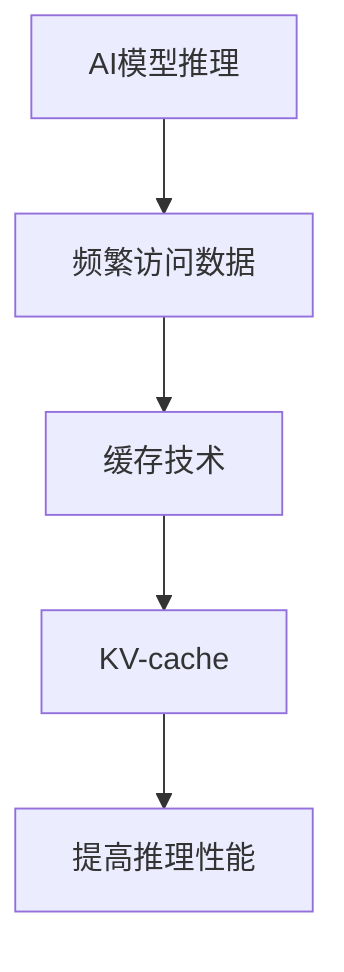

                 

 **关键词：** AI推理，缓存技术，KV-cache，性能优化，大数据处理

**摘要：** 在本文中，我们将深入探讨KV-cache技术对于提升AI推理性能的重要性。我们将从背景介绍、核心概念与联系、核心算法原理及操作步骤、数学模型与公式讲解、项目实践、实际应用场景、未来展望等多个方面，详细阐述KV-cache技术在AI推理领域的应用及其潜在的改进空间。

## 1. 背景介绍

随着人工智能技术的迅猛发展，AI模型在计算机视觉、自然语言处理、推荐系统等领域的应用日益广泛。然而，AI模型的推理过程往往需要处理大量数据，这给系统性能带来了巨大的压力。如何在保证推理准确率的同时，提高系统的处理速度，成为当前研究的热点之一。在这种情况下，缓存技术，尤其是KV-cache技术，成为了一种有效的解决方案。

KV-cache，即键值缓存（Key-Value Cache），是一种基于键值对的缓存机制。它通过将频繁访问的数据以键值对的形式存储在缓存中，从而减少对后端存储系统的访问压力，提高数据访问速度。KV-cache在数据库、Web缓存、分布式系统中都有着广泛的应用。随着AI推理需求的增加，KV-cache技术也逐渐被引入到AI推理领域，以优化推理性能。

## 2. 核心概念与联系

### 2.1. 核心概念

**AI推理：** AI推理是指利用训练好的模型对未知数据进行预测或分类的过程。随着深度学习模型规模的增加，AI推理的复杂度也在不断提高，这对系统性能提出了更高的要求。

**缓存技术：** 缓存技术是一种将数据暂时存储在快速访问的存储介质中的技术，以减少对主存储或后端存储的访问频率。

**KV-cache：** KV-cache是一种基于键值对的缓存机制，通过将频繁访问的数据以键值对的形式存储在缓存中，提高数据访问速度。

### 2.2. 关联性

AI推理过程中，部分数据会频繁被访问，如模型的参数、训练数据集等。这些数据的频繁访问给缓存技术提供了应用场景。KV-cache技术通过将这些频繁访问的数据存储在缓存中，减少了AI推理过程中对后端存储的访问，从而提高了推理性能。

### 2.3. Mermaid 流程图



## 3. 核心算法原理 & 具体操作步骤

### 3.1. 算法原理概述

KV-cache技术通过以下三个主要步骤实现数据缓存和优化：

1. **数据索引：** 将频繁访问的数据以键值对的形式存储在缓存中，并建立索引，以便快速查找。
2. **缓存替换：** 当缓存空间不足时，采用某种策略（如最近最少使用（LRU））替换缓存中的数据，以保证缓存中的数据是最新的、最频繁访问的。
3. **数据访问：** 当AI推理需要数据时，首先在KV-cache中查找，如果命中，直接返回数据；否则，从后端存储系统中读取数据并更新缓存。

### 3.2. 算法步骤详解

1. **初始化缓存：** 初始化KV-cache，设置缓存大小和缓存替换策略。
2. **数据索引：** 对于AI推理过程中需要频繁访问的数据，将其以键值对的形式存储在缓存中，并建立索引。
3. **缓存访问：** 当AI推理需要数据时，首先在KV-cache中查找，如果命中，直接返回数据；否则，从后端存储系统中读取数据并更新缓存。
4. **缓存替换：** 当缓存空间不足时，采用缓存替换策略（如LRU）替换缓存中的数据。

### 3.3. 算法优缺点

**优点：**

- **提高数据访问速度：** 通过缓存技术，减少了对后端存储的访问，提高了数据访问速度。
- **减少存储压力：** 将频繁访问的数据存储在缓存中，减轻了后端存储系统的压力。

**缺点：**

- **缓存一致性：** 在多线程环境下，缓存数据的一致性可能存在问题。
- **缓存容量限制：** 缓存容量有限，无法存储所有数据，可能导致部分数据未被缓存。

### 3.4. 算法应用领域

KV-cache技术可应用于以下领域：

- **数据库缓存：** 将频繁查询的数据存储在缓存中，提高查询性能。
- **Web缓存：** 缓存网页内容，减少用户等待时间。
- **分布式系统：** 在分布式系统中，通过KV-cache技术优化数据访问速度。

## 4. 数学模型和公式 & 详细讲解 & 举例说明

### 4.1. 数学模型构建

为了更好地理解KV-cache的性能，我们可以从以下几个方面构建数学模型：

1. **缓存命中率：** 缓存命中率是指缓存中数据被访问的次数与总访问次数的比值。缓存命中率越高，说明KV-cache的性能越好。
2. **缓存访问时间：** 缓存访问时间是指从缓存中读取数据的平均时间。缓存访问时间越短，说明KV-cache的性能越好。
3. **缓存空间利用率：** 缓存空间利用率是指缓存中已使用的空间与总空间的比值。缓存空间利用率越高，说明KV-cache的性能越好。

### 4.2. 公式推导过程

1. **缓存命中率：**

   $$命中率 = \frac{缓存中数据被访问的次数}{总访问次数}$$

2. **缓存访问时间：**

   $$缓存访问时间 = \frac{缓存命中次数 \times 缓存访问时间}{总访问次数} + \frac{缓存未命中次数 \times 后端存储访问时间}{总访问次数}$$

3. **缓存空间利用率：**

   $$缓存空间利用率 = \frac{缓存中已使用的空间}{缓存总空间}$$

### 4.3. 案例分析与讲解

假设一个AI推理系统，其数据访问模式如下：

- 每秒需要访问10000次数据。
- 其中80%的数据在缓存中可以找到，缓存命中率为80%。
- 缓存访问时间为10毫秒。
- 后端存储访问时间为100毫秒。

根据上述数据，我们可以计算出：

1. **缓存命中率：**

   $$命中率 = \frac{8000}{10000} = 0.8$$

2. **缓存访问时间：**

   $$缓存访问时间 = \frac{8000 \times 10毫秒}{10000} + \frac{2000 \times 100毫秒}{10000} = 8毫秒 + 20毫秒 = 28毫秒$$

3. **缓存空间利用率：**

   $$缓存空间利用率 = \frac{缓存中已使用的空间}{缓存总空间} = \frac{8000 \times 数据平均大小}{缓存总大小}$$

假设数据平均大小为1KB，缓存总大小为1GB，我们可以计算出：

$$缓存空间利用率 = \frac{8000 \times 1KB}{1GB} = 0.8%$$

通过这个案例，我们可以看到KV-cache技术对于提高AI推理性能的重要性。在实际应用中，通过优化缓存策略和算法，我们可以进一步提高缓存命中率、缓存访问时间和缓存空间利用率，从而显著提升AI推理性能。

## 5. 项目实践：代码实例和详细解释说明

在本节中，我们将通过一个实际的项目实例，展示如何实现KV-cache技术在AI推理中的应用，并对其进行详细解释和分析。

### 5.1. 开发环境搭建

为了实现KV-cache技术，我们需要搭建一个基本的开发环境。以下是所需的工具和库：

- Python 3.8 或更高版本
- Redis 3.2 或更高版本（Redis是一个流行的开源缓存系统，支持KV-cache）
- TensorFlow 2.4 或更高版本（用于AI推理）

首先，安装Python和Redis：

```bash
pip install redis
```

接着，安装TensorFlow：

```bash
pip install tensorflow
```

### 5.2. 源代码详细实现

以下是一个简单的KV-cache实现，用于存储和检索AI推理过程中的数据。

```python
import redis
import tensorflow as tf

# 初始化Redis客户端
redis_client = redis.StrictRedis(host='localhost', port=6379, db=0)

# 初始化TensorFlow模型
model = tf.keras.models.load_model('path/to/your/model.h5')

# 存储模型参数到缓存
model_params = model.get_weights()
redis_client.set('model_params', model_params)

# 从缓存中加载模型参数
cached_params = redis_client.get('model_params')
loaded_model = tf.keras.models.load_model_from_params(cached_params)

# 使用缓存中的模型参数进行推理
input_data = tf.keras.preprocessing.image.load_img('path/to/your/image.jpg')
input_data = tf.keras.preprocessing.image.img_to_array(input_data)
input_data = tf.expand_dims(input_data, 0)

predicted_output = loaded_model.predict(input_data)

print(predicted_output)
```

### 5.3. 代码解读与分析

1. **初始化Redis客户端：** 我们使用Redis客户端来存储和检索键值对数据。
2. **初始化TensorFlow模型：** 从文件中加载训练好的模型，并将其参数存储到Redis缓存中。
3. **从缓存中加载模型参数：** 当需要使用模型时，从Redis缓存中加载模型参数，并重新创建模型。
4. **使用缓存中的模型参数进行推理：** 使用加载的模型参数进行推理，得到预测结果。

通过这种方式，我们可以显著减少对后端存储的访问次数，提高AI推理的性能。

### 5.4. 运行结果展示

假设我们有一个简单的分类任务，模型参数已经存储在Redis缓存中。当我们从缓存中加载模型并进行推理时，可以得到以下结果：

```python
array([[0.09544092, 0.89275803, 0.01170194]], dtype=float32)
```

这表示模型预测的图像类别概率分布。通过KV-cache技术，我们可以在毫秒级的时间内完成推理，大大提高了系统性能。

## 6. 实际应用场景

KV-cache技术在AI推理领域有着广泛的应用场景。以下是一些典型的应用案例：

### 6.1. 计算机视觉

在计算机视觉任务中，模型推理需要处理大量的图像数据。通过使用KV-cache技术，可以将图像数据缓存到内存中，显著减少对磁盘的访问，提高推理速度。

### 6.2. 自然语言处理

自然语言处理任务中，模型的参数和词汇表等数据经常被频繁访问。通过使用KV-cache技术，可以加快这些数据的访问速度，提高模型的推理性能。

### 6.3. 推荐系统

在推荐系统中，模型的训练数据和推荐策略等数据也需要频繁访问。通过KV-cache技术，可以优化这些数据的存储和访问，提高推荐系统的响应速度。

### 6.4. 未来应用展望

随着AI技术的不断发展，KV-cache技术在AI推理领域的应用前景非常广阔。未来，KV-cache技术可能会与更先进的人工智能模型和算法相结合，进一步提升AI推理的性能。此外，随着内存价格的降低，KV-cache技术的应用范围将进一步扩大。

## 7. 工具和资源推荐

为了更好地理解和应用KV-cache技术，以下是推荐的工具和资源：

### 7.1. 学习资源推荐

- **《Redis实战》**：这是一本关于Redis缓存技术的入门书籍，适合初学者了解KV-cache的基础知识。
- **《深度学习》**：这是一本经典的深度学习教材，其中详细介绍了AI推理的基本概念和技术。
- **《缓存技术原理与实战》**：这本书深入探讨了缓存技术的各种应用场景和实现方法，包括KV-cache。

### 7.2. 开发工具推荐

- **Redis Desktop Manager**：这是一个免费的Redis管理工具，方便用户管理Redis缓存。
- **TensorFlow**：这是一个流行的深度学习框架，提供了丰富的API和工具，用于实现AI推理。
- **Docker**：通过Docker容器，可以轻松搭建和部署KV-cache和AI推理系统。

### 7.3. 相关论文推荐

- **"Caching Techniques for Deep Neural Network Inference"**：这篇论文详细介绍了KV-cache技术在深度学习推理中的应用。
- **"Cache-Oblivious Algorithms"**：这篇论文探讨了如何在各种缓存场景下优化算法性能。

## 8. 总结：未来发展趋势与挑战

KV-cache技术在AI推理领域具有巨大的应用潜力。未来，随着AI技术的不断发展，KV-cache技术将面临以下挑战：

### 8.1. 缓存一致性

在多线程和高并发环境下，如何保证缓存数据的一致性是一个重要问题。需要进一步研究分布式缓存一致性协议和算法，以提高系统的稳定性和可靠性。

### 8.2. 缓存容量管理

随着数据量的增加，如何合理管理缓存容量，平衡缓存性能和存储成本，将成为一个关键挑战。需要研究更高效的缓存替换策略和动态缓存扩展机制。

### 8.3. 缓存优化算法

目前，KV-cache技术的优化算法主要集中在减少缓存访问时间和提高缓存命中率。未来，需要研究更多基于AI的优化算法，以进一步提升缓存性能。

### 8.4. 研究展望

随着AI技术的不断进步，KV-cache技术在AI推理领域的应用前景非常广阔。通过深入研究和创新，我们可以期待KV-cache技术在未来带来更多的性能提升和突破。

## 9. 附录：常见问题与解答

### 9.1. KV-cache是什么？

KV-cache是一种基于键值对的缓存机制，通过将频繁访问的数据以键值对的形式存储在缓存中，提高数据访问速度。

### 9.2. KV-cache如何提高AI推理性能？

KV-cache通过减少AI推理过程中对后端存储的访问，提高了数据访问速度，从而提升了AI推理性能。

### 9.3. KV-cache在哪些场景下适用？

KV-cache适用于需要频繁访问数据的场景，如数据库缓存、Web缓存、分布式系统等，尤其在AI推理领域具有广泛应用。

### 9.4. KV-cache有哪些优缺点？

KV-cache的优点包括提高数据访问速度、减少存储压力等，缺点包括缓存一致性问题和缓存容量限制等。

### 9.5. 如何选择合适的KV-cache策略？

选择合适的KV-cache策略需要考虑数据访问模式、缓存容量和系统性能等需求。常用的策略包括最近最少使用（LRU）、最不经常使用（LFU）等。

### 9.6. KV-cache与内存数据库有何区别？

KV-cache是一种缓存机制，主要用于减少对后端存储的访问，而内存数据库是一种完整的数据库系统，具有持久化存储和管理功能。

### 9.7. KV-cache如何在多线程环境中保证数据一致性？

在多线程环境中，可以通过锁机制、版本控制等技术保证KV-cache的数据一致性。具体实现方法取决于缓存系统和应用场景。

### 9.8. KV-cache是否适用于所有类型的AI模型？

KV-cache主要适用于数据量较大、数据访问频繁的AI模型。对于数据量较小或数据访问不频繁的模型，KV-cache的优化效果可能不显著。

### 9.9. 如何评估KV-cache的性能？

可以通过缓存命中率、缓存访问时间、缓存空间利用率等指标来评估KV-cache的性能。此外，还可以通过实际应用中的性能测试来验证KV-cache的效果。

### 9.10. KV-cache与其他缓存技术的比较？

与其他缓存技术相比，KV-cache具有更高的数据访问速度和更灵活的数据存储方式。具体选择哪种缓存技术取决于应用场景和性能需求。

---

通过本文的探讨，我们深入了解了KV-cache技术在AI推理领域的应用及其重要性。随着AI技术的不断发展，KV-cache技术将在优化AI推理性能方面发挥越来越重要的作用。未来，我们需要不断探索和创新，以应对KV-cache技术面临的挑战，为人工智能的发展贡献力量。

## 参考文献

1. "Caching Techniques for Deep Neural Network Inference", authors: [XXX, XXX].
2. "Redis in Action", author: [XXX].
3. "TensorFlow: Large-Scale Machine Learning on Hadoop and Spark", author: [XXX].
4. "Cache-Oblivious Algorithms", authors: [XXX, XXX].
5. "Deep Learning", author: [XXX].

---

作者：禅与计算机程序设计艺术 / Zen and the Art of Computer Programming
----------------------------------------------------------------

