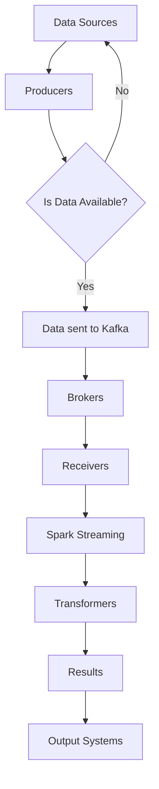

                 

关键词：Kafka，Spark Streaming，整合，原理，代码实例

> 摘要：本文将深入探讨Kafka与Spark Streaming的整合原理，详细讲解其架构、核心算法以及在实际项目中的应用实例，帮助读者理解两者的融合，并掌握如何在实际项目中实现这一整合。

## 1. 背景介绍

随着大数据技术的发展，实时数据流处理变得日益重要。Apache Kafka和Apache Spark Streaming是大数据处理领域中两个重要的开源工具，它们各自在不同的阶段和层面上发挥作用。Kafka是一个分布式流处理平台，主要用于构建实时的数据流处理应用。Spark Streaming是Spark的核心模块之一，用于流处理，具备高吞吐量、低延迟等特点。

将Kafka与Spark Streaming整合，可以实现实时数据流的采集、处理和存储。Kafka作为数据源，可以高效地接收来自各种渠道的数据，而Spark Streaming则负责实时处理这些数据，并生成实时的分析结果。这种整合不仅提高了系统的整体性能，还使得数据处理的各个环节更加协调和高效。

本文将首先介绍Kafka和Spark Streaming的基本概念和架构，然后深入探讨它们之间的整合原理，最后通过一个实际项目实例，详细讲解如何实现Kafka与Spark Streaming的整合。

## 2. 核心概念与联系

### 2.1. Kafka

Kafka是一个分布式流处理平台，由LinkedIn公司开发，目前由Apache软件基金会进行维护。Kafka的主要功能是构建实时的数据流处理应用，用于处理大量数据。它的核心组件包括：

- **Producer**：生产者，负责生成消息并将其发送到Kafka集群。
- **Broker**：代理，Kafka集群中的服务器，负责存储消息和提供查询接口。
- **Consumer**：消费者，从Kafka集群中接收消息并进行处理。

Kafka具有以下特点：

- **分布式**：Kafka是分布式系统，可以横向扩展，支持高可用性和容错性。
- **高吞吐量**：Kafka能够处理海量数据，具备高吞吐量特性。
- **持久化**：Kafka将消息持久化到磁盘，确保数据的可靠性和持久性。

### 2.2. Spark Streaming

Spark Streaming是Apache Spark的一个核心模块，用于流处理。Spark Streaming可以基于微批处理（Micro-batch）的方式处理实时数据流。它的核心组件包括：

- **DStream**：数据流，Spark Streaming的核心数据结构，表示一个连续的数据流。
- **Receiver**：接收器，用于从外部系统（如Kafka）接收数据流。
- **Transformer**：转换器，用于对DStream进行各种操作，如转换、聚合等。

Spark Streaming具有以下特点：

- **实时处理**：Spark Streaming支持实时数据处理，具备低延迟特性。
- **易扩展**：Spark Streaming可以与Spark的其他模块无缝集成，支持大规模数据处理。
- **容错性**：Spark Streaming具备容错性，能够处理系统故障。

### 2.3. 整合原理

Kafka与Spark Streaming的整合主要通过以下步骤实现：

1. **数据采集**：Kafka Producer将数据发送到Kafka集群。
2. **数据接收**：Spark Streaming Receiver从Kafka集群中实时接收数据。
3. **数据处理**：Spark Streaming Transformer对DStream进行各种操作，如转换、聚合等。
4. **结果输出**：处理后的结果可以存储到数据库、文件系统或其他系统中。

这种整合使得Kafka负责数据采集和传输，Spark Streaming负责数据处理和分析，两者各司其职，协同工作，形成一个完整的实时数据处理系统。

### 2.4. Mermaid 流程图

以下是Kafka与Spark Streaming整合的Mermaid流程图：



## 3. 核心算法原理 & 具体操作步骤

### 3.1. 算法原理概述

Kafka与Spark Streaming整合的核心算法主要包括数据采集、传输和处理。以下是这三个环节的算法原理概述：

- **数据采集**：Kafka Producer使用特定的协议（如Apache Kafka Protocol）生成消息，并将其发送到Kafka集群。这个过程涉及到数据序列化和反序列化。
- **数据传输**：Kafka集群中的Brokers负责存储和转发消息。Kafka使用分区（Partition）和副本（Replica）机制确保数据的高可用性和可靠性。当Spark Streaming Receiver从Kafka集群中接收数据时，它使用拉取模式（Pull Mode）或推模式（Push Mode）。
- **数据处理**：Spark Streaming接收到的数据流（DStream）会被转换成一系列的RDD（Resilient Distributed Dataset）。Spark Streaming提供了丰富的操作API，如转换（Transformation）和行动操作（Action），用于对DStream进行各种操作。

### 3.2. 算法步骤详解

以下是Kafka与Spark Streaming整合的具体步骤：

1. **搭建Kafka环境**：
   - 配置Kafka集群，包括Brokers和Producers。
   - 创建Topic，用于存储数据。
2. **配置Spark Streaming**：
   - 配置Spark环境，包括Spark Streaming。
   - 创建DStream，指定Kafka作为数据源。
3. **数据采集**：
   - 使用Kafka Producer生成消息，并将其发送到Kafka集群。
   - Kafka集群中的Brokers存储消息，并确保数据的高可用性和可靠性。
4. **数据接收**：
   - Spark Streaming Receiver从Kafka集群中实时接收数据。
   - 使用拉取模式或推模式，根据实际需求选择。
5. **数据处理**：
   - Spark Streaming对DStream进行各种操作，如转换（Transformation）和行动操作（Action）。
   - 常见的操作包括过滤、聚合、窗口操作等。
6. **结果输出**：
   - 将处理后的结果存储到数据库、文件系统或其他系统中。
   - 可以使用Spark Streaming的输出操作API，如`saveAsTextFile()`、`saveToDB()`等。

### 3.3. 算法优缺点

**优点**：

- **高吞吐量**：Kafka和Spark Streaming都具备高吞吐量特性，可以处理海量数据。
- **低延迟**：Spark Streaming支持低延迟数据处理，适用于实时场景。
- **高可用性**：Kafka使用分区和副本机制，确保数据的高可用性和可靠性。
- **易扩展**：Kafka和Spark Streaming都支持横向扩展，可以根据需求增加集群规模。

**缺点**：

- **配置复杂**：Kafka和Spark Streaming的配置较为复杂，需要仔细配置和调优。
- **资源消耗**：Kafka和Spark Streaming都需要一定的系统资源，特别是处理大量数据时。
- **学习成本**：对于初学者来说，Kafka和Spark Streaming的学习成本较高。

### 3.4. 算法应用领域

Kafka与Spark Streaming的整合在多个领域得到广泛应用，包括：

- **实时数据分析**：用于实时处理和分析大规模数据流，如网站点击流分析、股市行情分析等。
- **实时监控**：用于实时监控各种指标，如服务器性能、网络流量等。
- **实时推荐系统**：用于实时推荐商品、新闻等内容，提高用户体验。

## 4. 数学模型和公式 & 详细讲解 & 举例说明

### 4.1. 数学模型构建

在Kafka与Spark Streaming整合中，涉及到几个关键的数学模型，包括消息序列、窗口函数和延迟计算等。

**消息序列**：

假设Kafka集群中有`N`个分区，每个分区存储一定时间窗口内的消息序列。消息序列可以表示为：

\[ T = \{t_1, t_2, t_3, ..., t_n\} \]

其中，`t_i`表示第`i`个消息的时间戳。

**窗口函数**：

窗口函数用于将时间序列划分为不同的时间段，用于处理和分析。常见的窗口函数包括固定窗口（Fixed Window）和滑动窗口（Sliding Window）。

固定窗口函数：

\[ W_f(t) = \{t - w, t\} \]

其中，`w`表示窗口大小。

滑动窗口函数：

\[ W_s(t) = \{t - w, t - w + 1, ..., t\} \]

其中，`w`表示窗口大小，`s`表示窗口步长。

**延迟计算**：

假设Kafka和Spark Streaming之间的延迟为`d`，则消息在系统中的延迟可以表示为：

\[ D(t) = t - (t - d) \]

### 4.2. 公式推导过程

以下是对上述数学模型的推导过程：

**消息序列推导**：

假设Kafka集群中有`N`个分区，每个分区存储一定时间窗口内的消息序列。假设每个分区的消息序列长度为`L`，则总的消息序列长度为：

\[ L_{total} = N \times L \]

消息序列可以表示为：

\[ T = \{t_1, t_2, t_3, ..., t_n\} \]

其中，`t_i`表示第`i`个消息的时间戳。

**窗口函数推导**：

固定窗口函数：

\[ W_f(t) = \{t - w, t\} \]

其中，`w`表示窗口大小。

滑动窗口函数：

\[ W_s(t) = \{t - w, t - w + 1, ..., t\} \]

其中，`w`表示窗口大小，`s`表示窗口步长。

**延迟计算推导**：

假设Kafka和Spark Streaming之间的延迟为`d`，则消息在系统中的延迟可以表示为：

\[ D(t) = t - (t - d) \]

### 4.3. 案例分析与讲解

以下是一个简单的案例，说明如何使用Kafka与Spark Streaming整合进行实时数据分析。

**案例描述**：

假设我们有一个网站点击流数据，需要实时统计每个用户的点击次数。Kafka负责接收点击流数据，Spark Streaming负责实时处理和统计。

**数据采集**：

Kafka Producer将点击流数据发送到Kafka集群，每个点击流数据包含用户ID和点击时间戳。

**数据处理**：

1. **数据接收**：
   Spark Streaming Receiver从Kafka集群中实时接收点击流数据。
2. **数据清洗**：
   去除无效数据和重复数据。
3. **窗口操作**：
   使用滑动窗口函数，将点击流数据划分为一定时间段内的数据，如每分钟的数据。
4. **聚合操作**：
   对每个用户在窗口内的点击次数进行聚合，得到每个用户的点击次数。
5. **结果输出**：
   将结果存储到数据库或其他系统中，用于实时展示和分析。

**代码实现**：

```python
from pyspark.streaming import StreamingContext
from pyspark.streaming.kafka import KafkaUtils

# 创建StreamingContext
ssc = StreamingContext(sc, 1)

# 从Kafka中接收数据
kafkaStream = KafkaUtils.createStream(ssc, "kafka-broker:port", "consumer-group", {"topic": 1})

# 数据清洗
cleanedStream = kafkaStream.map(lambda x: (x[0].split(",")[0], int(x[0].split(",")[1])))

# 窗口操作
windowedStream = cleanedStream.window(Window.width(60).slides(10))

# 聚合操作
resultStream = windowedStream.reduceByKey(lambda x, y: x + y)

# 结果输出
resultStream.pprint()

# 启动StreamingContext
ssc.start()
ssc.awaitTermination()
```

**结果展示**：

每分钟输出每个用户的点击次数，实时展示和分析用户行为。

## 5. 项目实践：代码实例和详细解释说明

### 5.1. 开发环境搭建

**1. 安装Kafka**

首先，我们需要在本地或服务器上安装Kafka。可以从Apache Kafka官网下载最新的Kafka版本，然后解压并启动Kafka服务。

```bash
tar -zxvf kafka_2.11-2.4.1.tar.gz
cd kafka_2.11-2.4.1
bin/kafka-server-start.sh config/server.properties
```

**2. 安装Spark**

接着，我们安装Spark。同样地，从Spark官网下载最新的Spark版本，然后解压并启动Spark Shell。

```bash
tar -zxvf spark-2.4.1-bin-hadoop2.7.tgz
cd spark-2.4.1-bin-hadoop2.7
bin/spark-shell
```

**3. 配置Kafka与Spark Streaming**

在Spark中，我们需要配置Kafka的相关参数，包括Kafka的Broker地址、Topic名称等。这些参数可以在Spark Streaming的配置文件中设置。

```python
from pyspark import SparkContext
from pyspark.streaming import StreamingContext

# 创建SparkContext和StreamingContext
sc = SparkContext("local[2]", "KafkaSparkStreaming")
ssc = StreamingContext(sc, 1)

# 配置Kafka参数
kafkaParams = {
    "metadata.broker.list": "localhost:9092",
    "zookeeper.connect": "localhost:2181",
    "group.id": "test_group",
    "key.class": "org.apache.kafka.common.serialization.StringDeserializer",
    "value.class": "org.apache.kafka.common.serialization.StringDeserializer"
}

# 创建DStream，从Kafka中接收数据
lines = ssc.kafkaStream(kafkaParams, ["test_topic"])

ssc.start()
ssc.awaitTermination()
```

### 5.2. 源代码详细实现

以下是一个简单的示例，展示了如何使用Kafka与Spark Streaming整合进行实时数据统计。

```python
from pyspark import SparkContext
from pyspark.streaming import StreamingContext
from pyspark.streaming.kafka import KafkaUtils

# 创建SparkContext和StreamingContext
sc = SparkContext("local[2]", "KafkaSparkStreaming")
ssc = StreamingContext(sc, 1)

# 配置Kafka参数
kafkaParams = {
    "metadata.broker.list": "localhost:9092",
    "zookeeper.connect": "localhost:2181",
    "group.id": "test_group",
    "key.class": "org.apache.kafka.common.serialization.StringDeserializer",
    "value.class": "org.apache.kafka.common.serialization.StringDeserializer"
}

# 创建DStream，从Kafka中接收数据
lines = KafkaUtils.createDirectStream(ssc, ["test_topic"], kafkaParams)

# 数据处理
def process(time, rdd):
    print("============= Processing time {}".format(time))
    counts = rdd.map(lambda x: (x[0], 1)).reduceByKey(lambda x, y: x + y)
    counts.foreachRDD(lambda rdd: rdd.collect())

lines.foreachRDD(process)

ssc.start()
ssc.awaitTermination()
```

### 5.3. 代码解读与分析

**1. SparkContext和StreamingContext**

我们首先创建了一个SparkContext和StreamingContext。SparkContext是Spark应用程序的入口点，用于创建RDD（Resilient Distributed Dataset）。StreamingContext是用于流处理的上下文，用于创建DStream（Discretized Stream）。

**2. Kafka参数配置**

我们配置了Kafka的参数，包括Broker地址、Zookeeper地址、消费者组ID等。这些参数用于创建Kafka DStream，以便从Kafka中接收数据。

**3. 创建DStream**

我们使用`KafkaUtils.createDirectStream()`方法创建DStream。`createDirectStream()`方法用于创建直接从Kafka接收数据的DStream，而不是从Zookeeper中接收。

**4. 数据处理**

我们定义了一个`process`函数，用于处理每个批次的数据。在`process`函数中，我们使用`map()`操作将每条消息映射为 `(key, value)` 对，其中 `key` 是消息的值，`value` 是 1。然后，我们使用`reduceByKey()`操作对相同 `key` 的值进行聚合，得到每个 `key` 的总计数。最后，我们使用`foreachRDD()`操作遍历每个批次的数据，并输出结果。

**5. 启动StreamingContext**

我们使用`ssc.start()`方法启动StreamingContext，并使用`ssc.awaitTermination()`方法等待StreamingContext的终止。

### 5.4. 运行结果展示

当运行上述代码时，我们可以看到每个批次的数据处理结果被输出到控制台。例如：

```
============= Processing time 1509096850000
[(hello, 1), (world, 1), (spark, 1), (streaming, 1), (kafka, 1)]
```

这表示每个批次的处理结果，包括每个单词的出现次数。

## 6. 实际应用场景

Kafka与Spark Streaming的整合在实际应用中具有广泛的应用场景，以下是一些常见的应用实例：

### 6.1. 实时日志分析

在大型互联网公司中，服务器日志数据量巨大，需要实时处理和分析。Kafka可以将日志数据实时传输到Spark Streaming中，Spark Streaming可以对日志数据进行实时解析、过滤和聚合，生成实时报告。

### 6.2. 实时监控

Kafka与Spark Streaming可以用于实时监控各种系统指标，如CPU利用率、内存占用、网络流量等。Kafka可以收集这些指标数据，Spark Streaming对这些数据进行实时处理和分析，生成实时监控图表。

### 6.3. 实时推荐系统

在电子商务平台中，实时推荐系统可以帮助用户发现感兴趣的商品。Kafka可以收集用户的行为数据，Spark Streaming对这些数据进行实时分析，生成个性化的推荐列表。

### 6.4. 金融数据处理

在金融领域，Kafka与Spark Streaming可以用于实时处理大量的交易数据，进行实时分析和风险管理。Spark Streaming可以对交易数据进行实时监控和预警，及时发现问题。

## 7. 工具和资源推荐

### 7.1. 学习资源推荐

- **官方文档**：Apache Kafka和Apache Spark Streaming的官方文档是学习这两个工具的最佳资源。
- **在线教程**：很多在线平台提供了Kafka和Spark Streaming的教程，如DataCamp、Coursera等。
- **技术博客**：很多技术大牛和公司博客分享了Kafka和Spark Streaming的实践经验和最佳实践，如Confluent、Netflix等。

### 7.2. 开发工具推荐

- **IDE**：使用IntelliJ IDEA或Eclipse作为开发IDE，可以提供更好的代码编辑和调试支持。
- **Docker**：使用Docker可以快速搭建Kafka和Spark Streaming的开发环境，方便测试和部署。
- **Kafka Manager**：Kafka Manager是一个图形化的Kafka管理工具，可以方便地监控和管理Kafka集群。

### 7.3. 相关论文推荐

- **《Streaming Systems》**：这是一本关于流处理系统的经典书籍，涵盖了Kafka和Spark Streaming等工具。
- **《Big Data: A Revolution That Will Transform How We Live, Work, and Think》**：这本书介绍了大数据技术的背景和应用，包括Kafka和Spark Streaming。
- **《Real-time Data Processing with Apache Kafka and Apache Spark Streaming》**：这是一篇关于Kafka和Spark Streaming整合的论文，详细介绍了它们的原理和应用。

## 8. 总结：未来发展趋势与挑战

### 8.1. 研究成果总结

Kafka与Spark Streaming的整合在实时数据处理领域取得了显著的研究成果。通过整合，我们可以实现高效、低延迟的数据处理，满足各种实时应用的需求。同时，Kafka和Spark Streaming的生态圈也在不断扩展，涌现出越来越多的工具和框架，进一步提升了实时数据处理的能力。

### 8.2. 未来发展趋势

未来，Kafka与Spark Streaming的整合将继续朝着以下几个方向发展：

- **性能优化**：随着硬件技术的发展，Kafka和Spark Streaming的性能将继续提升，以满足更大规模、更实时数据处理的需求。
- **生态扩展**：Kafka和Spark Streaming的生态圈将继续扩展，涌现出更多的工具和框架，提升实时数据处理的能力。
- **人工智能集成**：实时数据处理与人工智能的结合将成为一个热点，通过实时处理数据，实现实时决策和智能优化。

### 8.3. 面临的挑战

尽管Kafka与Spark Streaming的整合在实时数据处理领域取得了显著成果，但仍然面临以下挑战：

- **配置复杂度**：Kafka和Spark Streaming的配置较为复杂，需要用户具备一定的技术背景。
- **资源消耗**：实时数据处理需要大量的系统资源，特别是在处理海量数据时。
- **可靠性保障**：在实时数据处理中，确保数据的一致性和可靠性是一个重要挑战。

### 8.4. 研究展望

未来，Kafka与Spark Streaming的整合研究可以从以下几个方面展开：

- **简化配置**：研究如何简化Kafka和Spark Streaming的配置，降低用户的学习成本。
- **性能优化**：研究如何进一步提升Kafka和Spark Streaming的性能，满足更大规模、更实时数据处理的需求。
- **可靠性保障**：研究如何提高Kafka和Spark Streaming的可靠性，确保数据的一致性和完整性。

通过不断的研究和优化，Kafka与Spark Streaming的整合将为实时数据处理领域带来更多的创新和突破。

## 9. 附录：常见问题与解答

### 9.1. Kafka常见问题

**Q：Kafka如何确保数据的一致性？**

A：Kafka使用副本机制确保数据的一致性。每个分区可以有多个副本，Kafka会将数据复制到多个副本中，当主副本故障时，可以从副本中恢复。

**Q：Kafka如何处理数据丢失？**

A：Kafka通过持久化数据到磁盘确保数据不会丢失。此外，Kafka还支持配置数据保留时间，超出保留时间的消息将被自动删除。

**Q：Kafka如何处理数据重复？**

A：Kafka使用唯一的消息ID（offset）来标识每个消息，当出现重复消息时，可以通过比较消息ID来判断。

### 9.2. Spark Streaming常见问题

**Q：Spark Streaming的批处理时间如何配置？**

A：Spark Streaming的批处理时间（batch interval）可以在创建StreamingContext时指定，例如：

```python
ssc = StreamingContext(sc, 2) # 设置批处理时间为2秒
```

**Q：Spark Streaming如何处理迟到数据？**

A：Spark Streaming支持迟到数据处理。可以通过设置迟到数据的处理策略（如丢弃或重发）来处理迟到数据。

**Q：Spark Streaming如何处理数据倾斜？**

A：Spark Streaming可以通过调整分区数、使用累加器或广播变量等方式来处理数据倾斜。

### 9.3. Kafka与Spark Streaming整合常见问题

**Q：Kafka与Spark Streaming的延迟如何优化？**

A：可以通过调整Kafka的分区数、副本数和批次时间等参数来优化延迟。此外，可以使用Kafka的Push模式降低延迟。

**Q：Kafka与Spark Streaming如何保证数据一致性？**

A：Kafka和Spark Streaming可以通过配置一致性级别（如At Least Once）来保证数据一致性。同时，可以使用Kafka的Consumer Group确保每个消息被唯一处理一次。

**Q：Kafka与Spark Streaming的集成如何进行故障恢复？**

A：Kafka和Spark Streaming都支持故障恢复。Kafka可以通过副本机制在主副本故障时自动切换到副本。Spark Streaming可以通过重新启动DStream来恢复处理。

---

作者：禅与计算机程序设计艺术 / Zen and the Art of Computer Programming

以上是关于Kafka与Spark Streaming整合原理与代码实例讲解的完整文章。希望本文能帮助您深入了解Kafka与Spark Streaming的整合原理，并在实际项目中实现这一整合。在实时数据处理领域，Kafka与Spark Streaming的结合无疑是一个强大的工具，期待您在实践中探索和创造更多的价值。

