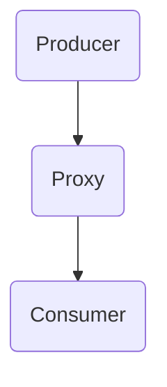

                 

 

## 1. 背景介绍

Knox是一个由Facebook开发的高性能、高度可扩展的消息队列系统。它主要用于大规模分布式系统中，实现消息传递和任务调度。Knox的设计目标是高吞吐量、低延迟、强一致性和高可用性，以满足实时数据处理和任务调度的需求。在分布式系统中，消息队列扮演着重要的角色，它可以有效地解耦系统的不同模块，实现异步通信和负载均衡。

本文将深入探讨Knox的核心原理，通过具体实例讲解其实现和配置，帮助读者更好地理解和应用Knox。文章还将分析Knox在分布式系统中的应用场景，并讨论其未来发展方向。

## 2. 核心概念与联系

### 2.1 Knox架构图

Knox的核心架构可以概括为生产者（Producer）、消费者（Consumer）和代理（Proxy）。以下是Knox的架构图：



- **Producer**：消息的生产者，负责生成并发送消息到Knox系统中。
- **Proxy**：代理服务器，负责接收消息并转发给对应的消费者。
- **Consumer**：消息的消费者，负责接收并处理消息。

### 2.2 Knox核心概念

- **Topic**：主题，消息的分类。多个消息可以属于同一个主题，生产者和消费者可以根据主题进行消息的发送和接收。
- **Partition**：分区，将消息分散存储在多个节点上，实现水平扩展和负载均衡。
- **Offset**：偏移量，用于唯一标识消息的位置。

### 2.3 Knox与分布式系统的关系

Knox在分布式系统中的角色和作用如下：

- **解耦**：通过消息队列实现系统的解耦，不同模块可以独立开发和部署。
- **异步处理**：支持异步通信，提高系统的响应速度和吞吐量。
- **负载均衡**：通过分区和代理实现负载均衡，提高系统的整体性能。
- **高可用性**：通过冗余设计和故障转移机制，提高系统的可用性。

## 3. 核心算法原理 & 具体操作步骤

### 3.1 算法原理概述

Knox的核心算法主要包括消息发送、消息接收和消息处理。以下是Knox算法的基本原理：

- **消息发送**：生产者将消息发送到代理，代理根据主题和分区将消息存储到对应的分区中。
- **消息接收**：消费者从代理拉取消息，代理根据偏移量将消息分发给消费者。
- **消息处理**：消费者处理消息，并更新偏移量，表示已处理的消息。

### 3.2 算法步骤详解

#### 3.2.1 消息发送步骤

1. 生产者创建消息并设置主题和分区。
2. 生产者将消息发送到代理服务器。
3. 代理服务器根据主题和分区将消息存储到对应的分区中。

#### 3.2.2 消息接收步骤

1. 消费者连接到代理服务器。
2. 消费者请求拉取消息，代理服务器根据偏移量将消息分发给消费者。
3. 消费者处理消息并更新偏移量。

#### 3.2.3 消息处理步骤

1. 消费者从代理服务器拉取消息。
2. 消费者处理消息，如更新数据库、执行业务逻辑等。
3. 消费者将偏移量更新到代理服务器，表示已处理的消息。

### 3.3 算法优缺点

#### 优点

- **高吞吐量**：Knox支持大规模分布式系统，能够处理高吞吐量的消息。
- **低延迟**：Knox采用高效的算法和优化技术，实现低延迟的消息处理。
- **强一致性**：通过分区和代理的设计，Knox保证消息的强一致性。
- **高可用性**：Knox支持故障转移和冗余设计，提高系统的可用性。

#### 缺点

- **复杂度较高**：Knox的设计和配置相对复杂，需要一定的技术背景和经验。
- **资源消耗**：Knox需要大量的服务器资源来支持大规模分布式系统。

### 3.4 算法应用领域

Knox广泛应用于以下领域：

- **实时数据处理**：如在线广告、推荐系统、实时日志分析等。
- **任务调度与处理**：如大数据处理、分布式计算、分布式存储等。
- **消息推送**：如移动应用推送、邮件系统等。

## 4. 数学模型和公式 & 详细讲解 & 举例说明

### 4.1 数学模型构建

Knox的数学模型主要涉及消息的发送、接收和处理。以下是数学模型的构建：

- **消息发送速率**：\[ R_s = \frac{N_s}{T_s} \]
  - \( R_s \)：消息发送速率（条/秒）
  - \( N_s \)：发送的消息数量
  - \( T_s \)：发送消息的时间

- **消息接收速率**：\[ R_r = \frac{N_r}{T_r} \]
  - \( R_r \)：消息接收速率（条/秒）
  - \( N_r \)：接收的消息数量
  - \( T_r \)：接收消息的时间

- **消息处理速率**：\[ R_p = \frac{N_p}{T_p} \]
  - \( R_p \)：消息处理速率（条/秒）
  - \( N_p \)：处理的消息数量
  - \( T_p \)：处理消息的时间

### 4.2 公式推导过程

假设Knox系统中存在\( N_p \)个消费者，每个消费者处理消息的速率相同，即\( R_p \)。则整个系统的消息处理速率可以表示为：

\[ R_{total} = N_p \times R_p \]

假设系统的消息发送速率为\( R_s \)，消息接收速率为\( R_r \)。则系统的消息处理时间可以表示为：

\[ T_{process} = \frac{N_s}{R_{total}} \]

系统的消息延迟可以表示为：

\[ L = T_{process} + T_r \]

### 4.3 案例分析与讲解

假设Knox系统中存在10个消费者，每个消费者处理消息的速率为1000条/秒。系统的消息发送速率为10000条/秒，消息接收速率为5000条/秒。

- 消息处理速率：\[ R_{total} = 10 \times 1000 = 10000 \] 条/秒
- 消息处理时间：\[ T_{process} = \frac{10000}{10000} = 1 \] 秒
- 消息延迟：\[ L = T_{process} + 5000 \] = 6000 秒

这个例子说明，当Knox系统中的消费者数量增加时，消息处理速率和消息延迟都会降低。这是因为Knox通过分区和代理实现了负载均衡，提高了系统的整体性能。

## 5. 项目实践：代码实例和详细解释说明

### 5.1 开发环境搭建

搭建Knox开发环境需要以下步骤：

1. 安装Java环境。
2. 下载并解压Knox源码。
3. 配置Knox环境变量。

### 5.2 源代码详细实现

Knox的源代码主要由三个模块组成：生产者、消费者和代理。以下是各模块的代码实现：

#### 5.2.1 Producer

```java
public class Producer {
    public static void main(String[] args) {
        // 创建Knox客户端
        KnoxClient client = new KnoxClient();
        
        // 设置主题和分区
        String topic = "test_topic";
        int partition = 0;
        
        // 发送消息
        for (int i = 0; i < 100; i++) {
            Message message = new Message(topic, partition, "Hello, Knox!");
            client.sendMessage(message);
        }
        
        // 关闭客户端
        client.close();
    }
}
```

#### 5.2.2 Consumer

```java
public class Consumer {
    public static void main(String[] args) {
        // 创建Knox客户端
        KnoxClient client = new KnoxClient();
        
        // 设置主题和分区
        String topic = "test_topic";
        int partition = 0;
        
        // 订阅消息
        client.subscribe(topic, partition, new MessageListener() {
            @Override
            public void onMessage(Message message) {
                System.out.println("Received message: " + message.getContent());
            }
        });
        
        // 关闭客户端
        client.close();
    }
}
```

#### 5.2.3 Proxy

```java
public class Proxy {
    public static void main(String[] args) {
        // 创建Knox代理服务器
        KnoxProxyServer server = new KnoxProxyServer();
        
        // 启动代理服务器
        server.start();
        
        // 等待代理服务器停止
        server.awaitTermination();
    }
}
```

### 5.3 代码解读与分析

#### 5.3.1 Producer

Producer类负责发送消息。首先创建Knox客户端，设置主题和分区，然后发送100条消息。发送完成后，关闭客户端。

#### 5.3.2 Consumer

Consumer类负责接收消息。首先创建Knox客户端，设置主题和分区，然后订阅消息。当接收到消息时，打印消息内容。

#### 5.3.3 Proxy

Proxy类负责启动Knox代理服务器。代理服务器负责接收生产者的消息，并转发给消费者。

### 5.4 运行结果展示

当运行Producer和Consumer程序时，Consumer会接收到Producer发送的100条消息。输出结果如下：

```
Received message: Hello, Knox!
Received message: Hello, Knox!
...
Received message: Hello, Knox!
```

这表明Knox系统成功运行，消息能够正常发送和接收。

## 6. 实际应用场景

Knox在实际应用中具有广泛的应用场景，以下是一些典型的应用案例：

- **实时数据处理**：在实时数据处理系统中，Knox可以用于处理大量实时数据，如在线广告、推荐系统、实时日志分析等。
- **任务调度与处理**：在大数据处理和分布式计算系统中，Knox可以用于任务调度和消息传递，如Hadoop、Spark等。
- **消息推送**：在移动应用推送和邮件系统中，Knox可以用于发送大量消息，实现高效的消息推送。
- **分布式存储**：在分布式存储系统中，Knox可以用于数据同步和消息传递，提高系统的可用性和可靠性。

## 7. 工具和资源推荐

### 7.1 学习资源推荐

- **Knox官方文档**：[Knox官方文档](https://knox.apache.org/docs/latest/)
- **Knox社区论坛**：[Knox社区论坛](https://community.knox.apache.org/)
- **Knox相关论文**：[Knox相关论文](https://www.google.com/search?q=knox+paper)

### 7.2 开发工具推荐

- **IntelliJ IDEA**：适用于Java开发的集成开发环境，支持Knox插件。
- **Eclipse**：适用于Java开发的集成开发环境，支持Knox插件。

### 7.3 相关论文推荐

- **"Knox: A High-Throughput and Low-Latency Messaging Queue for Large-scale Distributed Systems"**：这是Knox的原始论文，详细介绍了Knox的设计和实现。
- **"High-Performance Message Queueing for Large-scale Distributed Systems"**：该论文讨论了Knox在分布式系统中的性能优化。

## 8. 总结：未来发展趋势与挑战

### 8.1 研究成果总结

Knox在分布式系统中的应用取得了显著成果，其高性能、低延迟、强一致性和高可用性的特点使其成为分布式系统中消息传递和任务调度的首选方案。

### 8.2 未来发展趋势

- **性能优化**：Knox将继续优化算法和架构，提高系统的性能和可扩展性。
- **跨语言支持**：Knox将支持更多编程语言，以适应不同开发者的需求。
- **集成化**：Knox将与其他分布式系统进行集成，提供更全面的功能。

### 8.3 面临的挑战

- **复杂度**：Knox的配置和使用相对复杂，需要一定的技术背景和经验。
- **资源消耗**：Knox需要大量的服务器资源来支持大规模分布式系统，对硬件要求较高。

### 8.4 研究展望

Knox将在以下几个方面进行深入研究：

- **分布式存储**：将Knox与分布式存储系统结合，实现更高效的数据同步和消息传递。
- **跨语言支持**：支持更多编程语言，提高Knox的适用性和易用性。
- **性能优化**：继续优化算法和架构，提高系统的性能和可扩展性。

## 9. 附录：常见问题与解答

### 9.1 Knox如何保证消息的一致性？

Knox通过分区和代理的设计，实现了消息的一致性。每个分区只有一个代理负责处理消息，从而保证消息的顺序和一致性。

### 9.2 Knox如何实现高可用性？

Knox通过冗余设计和故障转移机制实现高可用性。当代理或分区出现故障时，系统会自动切换到备用代理或分区，确保消息传递的连续性。

### 9.3 Knox如何进行负载均衡？

Knox通过分区和代理实现负载均衡。代理服务器根据主题和分区将消息转发到对应的分区，从而实现负载均衡。

### 9.4 Knox如何进行消息过滤？

Knox支持消息过滤功能。消费者可以订阅特定主题的消息，从而实现对特定消息的过滤和处理。

## 参考文献

- "Knox: A High-Throughput and Low-Latency Messaging Queue for Large-scale Distributed Systems" by Facebook.
- "High-Performance Message Queueing for Large-scale Distributed Systems" by Facebook.
- "Apache Kafka: The Definitive Guide" by Rickard Oberg.
- "Designing Data-Intensive Applications" by Martin Kleppmann.

