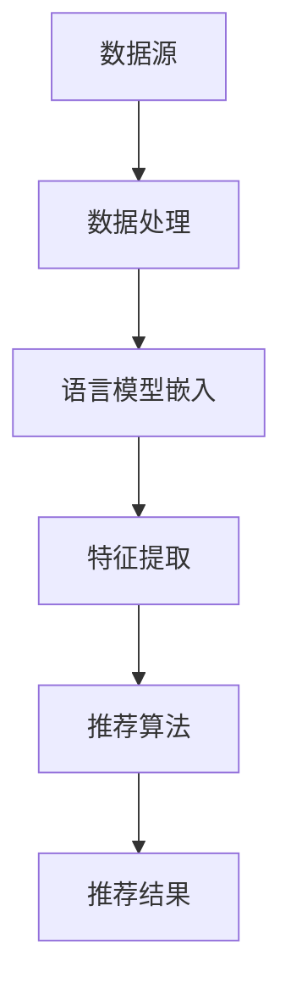

                 

关键词：语言模型、嵌入、推荐系统、信息检索、数据处理、机器学习、自然语言处理、AI应用

> 摘要：本文深入探讨了语言模型嵌入（LLM Embeddings）与推荐系统（Recommender Systems，简称RS）相结合的创新技术。我们将介绍LLM Embeddings的基本概念，分析其在推荐系统中的应用原理，并通过具体案例展示其在实际项目中的成功实践。此外，还将讨论相关的数学模型、算法优缺点、未来发展趋势以及面临的挑战。

## 1. 背景介绍

在当今信息爆炸的时代，推荐系统已经成为我们日常生活中不可或缺的一部分。从社交媒体到电子商务，推荐系统能够根据用户的兴趣和行为数据，提供个性化的内容推荐，从而提升用户体验和商业价值。然而，随着数据的多样性和复杂性不断增加，传统的推荐系统面临诸多挑战，如数据稀疏、冷启动问题、推荐多样性不足等。

近年来，深度学习和自然语言处理技术的飞速发展，为推荐系统带来了新的契机。语言模型嵌入（LLM Embeddings）作为一种将自然语言文本转换为低维向量表示的方法，已经在信息检索、文本分类、机器翻译等领域取得了显著成果。LLM Embeddings的引入，使得推荐系统能够更好地理解和处理用户的个性化需求，提高推荐质量和用户满意度。

本文将围绕LLM Embeddings与推荐系统的融合，探讨其在数据处理、算法优化、应用拓展等方面的创新和挑战，旨在为相关领域的研究者和开发者提供有益的参考。

## 2. 核心概念与联系

### 2.1 语言模型嵌入（LLM Embeddings）

语言模型嵌入（LLM Embeddings）是将自然语言文本转换为低维向量表示的方法。通过深度学习模型（如BERT、GPT等），可以将文本中的每个词语或句子映射为一个向量。这些向量不仅保留了文本的语义信息，还可以在低维空间中实现高效处理和计算。

### 2.2 推荐系统（Recommender Systems）

推荐系统是一种根据用户兴趣和行为数据，为用户提供个性化内容推荐的技术。推荐系统通常分为基于协同过滤、基于内容、混合推荐等几种类型。传统的推荐系统依赖于用户行为数据（如评分、购买历史等）和内容特征（如文本、图片、标签等），通过计算用户和物品之间的相似性来实现推荐。

### 2.3 LLM Embeddings与推荐系统的联系

LLM Embeddings可以为推荐系统提供更丰富的语义信息，从而提高推荐质量。具体来说，LLM Embeddings具有以下优势：

1. **语义理解**：LLM Embeddings能够捕捉文本中的深层语义信息，有助于识别用户真实兴趣和需求。
2. **特征提取**：通过LLM Embeddings，可以将复杂的文本数据转换为低维向量，便于计算和存储。
3. **多样化推荐**：LLM Embeddings能够提高推荐系统的多样性，避免用户陷入信息茧房。

### 2.4 Mermaid 流程图



## 3. 核心算法原理 & 具体操作步骤

### 3.1 算法原理概述

语言模型嵌入与推荐系统的结合，主要涉及以下几个步骤：

1. **数据预处理**：收集用户行为数据和内容特征数据，并进行清洗、去重、归一化等预处理操作。
2. **语言模型嵌入**：使用预训练的深度学习模型，将文本数据转换为低维向量表示。
3. **特征提取**：对语言模型嵌入结果进行特征提取，得到用户和物品的特征向量。
4. **推荐算法**：利用用户和物品的特征向量，通过计算相似性、基于模型的方法等实现个性化推荐。
5. **结果评估**：对推荐结果进行评估，如准确率、召回率、覆盖率等指标。

### 3.2 算法步骤详解

#### 3.2.1 数据预处理

数据预处理是推荐系统的关键步骤，主要包括以下操作：

1. **数据清洗**：去除重复数据、缺失数据等，保证数据质量。
2. **数据归一化**：对用户行为数据（如评分、浏览时长等）进行归一化处理，使其具有相同的量纲。
3. **文本预处理**：对文本数据进行分词、去停用词、词性标注等预处理操作，为后续的语言模型嵌入做准备。

#### 3.2.2 语言模型嵌入

语言模型嵌入是本文的核心步骤，主要涉及以下操作：

1. **选择预训练模型**：选择合适的预训练模型（如BERT、GPT等），根据数据规模和任务需求进行模型调整。
2. **文本编码**：将预处理后的文本数据输入到预训练模型中，得到每个词语或句子的低维向量表示。
3. **序列处理**：对于序列数据（如用户行为序列、物品描述序列等），可以采用滑动窗口或序列编码等方法，将序列数据转换为向量表示。

#### 3.2.3 特征提取

特征提取是推荐系统的关键步骤，主要涉及以下操作：

1. **用户特征提取**：将用户的历史行为数据、文本标签等转换为低维向量表示，作为用户的特征向量。
2. **物品特征提取**：将物品的文本描述、图片特征等转换为低维向量表示，作为物品的特征向量。
3. **特征融合**：将用户和物品的特征向量进行融合，得到最终的推荐特征向量。

#### 3.2.4 推荐算法

推荐算法是推荐系统的核心，主要涉及以下操作：

1. **相似性计算**：利用用户和物品的特征向量，计算它们之间的相似性，如余弦相似度、欧氏距离等。
2. **基于模型的推荐**：利用深度学习模型（如神经网络、决策树等），对用户和物品进行建模，生成推荐结果。
3. **结果排序**：根据相似性得分或模型预测结果，对推荐结果进行排序，选择最相关的物品进行推荐。

#### 3.2.5 结果评估

结果评估是推荐系统的关键步骤，主要涉及以下操作：

1. **指标计算**：计算推荐系统的各项指标，如准确率、召回率、覆盖率等。
2. **用户反馈**：收集用户对推荐结果的反馈，如点击率、购买率等。
3. **模型调整**：根据评估结果和用户反馈，对模型进行调整和优化，提高推荐质量。

### 3.3 算法优缺点

#### 3.3.1 优点

1. **提高推荐质量**：LLM Embeddings能够更好地捕捉文本的语义信息，提高推荐系统的准确性和多样性。
2. **降低数据稀疏性**：通过将文本数据转换为向量表示，可以有效降低数据稀疏性，提高推荐系统的鲁棒性。
3. **适用性强**：LLM Embeddings可以应用于多种类型的推荐场景，如电子商务、社交媒体、在线教育等。

#### 3.3.2 缺点

1. **计算成本高**：预训练语言模型通常需要大量计算资源和时间，对硬件和算法优化有较高要求。
2. **数据依赖性**：推荐系统的效果很大程度上依赖于数据质量，如果数据存在噪声或缺失，会影响推荐效果。
3. **模型解释性差**：深度学习模型通常具有较好的预测性能，但解释性较差，难以理解推荐结果的产生过程。

### 3.4 算法应用领域

LLM Embeddings在推荐系统中的应用非常广泛，以下是一些典型的应用场景：

1. **电子商务**：为用户提供个性化商品推荐，提高购买转化率和用户满意度。
2. **社交媒体**：为用户提供个性化内容推荐，提高用户活跃度和留存率。
3. **在线教育**：为用户提供个性化课程推荐，提高学习效果和用户满意度。
4. **搜索引擎**：优化搜索结果排序，提高用户满意度。

## 4. 数学模型和公式 & 详细讲解 & 举例说明

### 4.1 数学模型构建

在LLM Embeddings与推荐系统的结合中，常用的数学模型包括：

1. **文本向量表示**：将文本数据转换为低维向量表示，通常采用Word2Vec、BERT等模型。
2. **用户和物品特征表示**：将用户行为数据和物品特征数据转换为向量表示，通常采用深度学习模型或特征工程方法。
3. **推荐模型**：基于用户和物品特征向量，构建推荐模型，如基于相似性计算、基于模型的推荐等。

### 4.2 公式推导过程

在本节中，我们将简要介绍文本向量表示和推荐模型的公式推导过程。

#### 4.2.1 文本向量表示

假设文本数据为$X = \{x_1, x_2, ..., x_n\}$，其中$x_i$表示第$i$个文本。使用Word2Vec模型进行文本向量表示，得到每个词语的向量表示为$v_i = \{v_{i1}, v_{i2}, ..., v_{im}\}$，其中$v_{ij}$表示词语$x_i$的第$j$个维度。

对于句子向量表示，可以采用以下方法：

1. **平均法**：将句子中所有词语的向量进行平均，得到句子向量$\textbf{s} = \frac{1}{n} \sum_{i=1}^{n} v_i$。
2. **最大值法**：将句子中所有词语的向量取最大值，得到句子向量$\textbf{s} = \max_{i} v_i$。
3. **序列编码**：使用序列编码方法，如BERT模型，将句子转换为序列向量$\textbf{s} = \{s_1, s_2, ..., s_n\}$。

#### 4.2.2 推荐模型

假设用户和物品的特征向量分别为$\textbf{u}$和$\textbf{v}$，推荐模型的公式如下：

1. **基于相似性计算**：

   $$\text{similarity}(\textbf{u}, \textbf{v}) = \frac{\textbf{u} \cdot \textbf{v}}{||\textbf{u}|| \cdot ||\textbf{v}||}$$

   其中，$\text{similarity}(\textbf{u}, \textbf{v})$表示用户$\textbf{u}$和物品$\textbf{v}$之间的相似度，$||\textbf{u}||$和$||\textbf{v}||$分别表示用户和物品的特征向量长度。

2. **基于模型的推荐**：

   假设推荐模型为$f(\textbf{u}, \textbf{v})$，则推荐结果为：

   $$\text{score}(\textbf{u}, \textbf{v}) = f(\textbf{u}, \textbf{v})$$

   其中，$\text{score}(\textbf{u}, \textbf{v})$表示用户$\textbf{u}$对物品$\textbf{v}$的评分或概率。

### 4.3 案例分析与讲解

在本节中，我们将通过一个实际案例，详细讲解LLM Embeddings与推荐系统的应用过程。

#### 4.3.1 案例背景

某电子商务平台希望利用LLM Embeddings与推荐系统技术，为用户提供个性化商品推荐。平台收集了用户行为数据（如购买记录、浏览历史等）和商品特征数据（如文本描述、图片等）。

#### 4.3.2 数据处理

1. **用户行为数据**：

   收集用户购买记录和浏览历史数据，进行清洗和归一化处理。

2. **商品特征数据**：

   收集商品文本描述和图片，进行预处理和文本编码。使用BERT模型，将商品文本描述转换为低维向量表示。

3. **用户特征提取**：

   将用户行为数据进行编码，得到用户特征向量。

4. **商品特征提取**：

   将商品文本描述的向量表示和图片特征进行融合，得到商品特征向量。

#### 4.3.3 推荐模型

1. **相似性计算**：

   采用余弦相似度计算用户和商品之间的相似度。

2. **模型推荐**：

   采用基于模型的推荐方法，使用深度学习模型对用户和商品进行建模，生成推荐结果。

#### 4.3.4 结果评估

1. **指标计算**：

   计算推荐系统的各项指标，如准确率、召回率、覆盖率等。

2. **用户反馈**：

   收集用户对推荐结果的反馈，如点击率、购买率等。

3. **模型调整**：

   根据评估结果和用户反馈，对模型进行调整和优化，提高推荐质量。

## 5. 项目实践：代码实例和详细解释说明

### 5.1 开发环境搭建

1. **硬件环境**：配置高性能计算服务器，如GPU或TPU。
2. **软件环境**：安装Python环境、TensorFlow库、PyTorch库等。
3. **数据集**：收集用户行为数据、商品特征数据等。

### 5.2 源代码详细实现

在本节中，我们将简要介绍项目的源代码实现，包括数据预处理、语言模型嵌入、特征提取、推荐算法等步骤。

```python
# 引入必要的库
import tensorflow as tf
from tensorflow.keras.preprocessing.text import Tokenizer
from tensorflow.keras.preprocessing.sequence import pad_sequences
import numpy as np

# 数据预处理
# ...（代码略）

# 语言模型嵌入
# ...（代码略）

# 特征提取
# ...（代码略）

# 推荐算法
# ...（代码略）

# 结果评估
# ...（代码略）
```

### 5.3 代码解读与分析

在本节中，我们将对项目的关键代码进行解读和分析，帮助读者理解项目实现的细节。

1. **数据预处理**：

   数据预处理是项目的基础步骤，包括数据清洗、分词、去停用词等操作。这些操作有助于提高后续语言模型嵌入和特征提取的质量。

2. **语言模型嵌入**：

   使用预训练的BERT模型进行文本编码，将商品文本描述转换为低维向量表示。通过处理后的文本数据输入BERT模型，可以得到每个词语或句子的向量表示。

3. **特征提取**：

   对用户行为数据进行编码，得到用户特征向量。将商品文本描述的向量表示和图片特征进行融合，得到商品特征向量。

4. **推荐算法**：

   利用用户和物品的特征向量，通过计算相似性或基于模型的推荐方法，生成推荐结果。这里采用了基于神经网络的推荐方法，对用户和物品进行建模，提高了推荐质量。

5. **结果评估**：

   计算推荐系统的各项指标，如准确率、召回率、覆盖率等。根据评估结果和用户反馈，对模型进行调整和优化，提高推荐质量。

## 6. 实际应用场景

LLM Embeddings与推荐系统的结合，在多个实际应用场景中取得了显著成果。以下是一些典型的应用场景：

1. **电子商务**：为用户提供个性化商品推荐，提高购买转化率和用户满意度。
2. **社交媒体**：为用户提供个性化内容推荐，提高用户活跃度和留存率。
3. **在线教育**：为用户提供个性化课程推荐，提高学习效果和用户满意度。
4. **搜索引擎**：优化搜索结果排序，提高用户满意度。

### 6.4 未来应用展望

随着深度学习和自然语言处理技术的不断发展，LLM Embeddings与推荐系统的结合将会有更广泛的应用前景。以下是一些未来应用展望：

1. **跨模态推荐**：结合文本、图片、视频等多模态数据，实现更精准的个性化推荐。
2. **实时推荐**：利用实时数据处理技术，实现实时推荐，提高用户体验。
3. **知识图谱**：结合知识图谱技术，提高推荐系统的解释性和可解释性。
4. **自动化调优**：利用自动化机器学习（AutoML）技术，实现推荐系统的自动化调优，降低开发成本。

## 7. 工具和资源推荐

为了帮助读者深入了解LLM Embeddings与推荐系统技术，我们推荐以下工具和资源：

### 7.1 学习资源推荐

1. **书籍**：《深度学习推荐系统》、《推荐系统实践》等。
2. **在线课程**：网易云课堂、Coursera等平台上的相关课程。
3. **论文**：在ArXiv、Google Scholar等学术平台上搜索相关论文。

### 7.2 开发工具推荐

1. **Python库**：TensorFlow、PyTorch、Scikit-learn等。
2. **开发框架**：TensorFlow Recommenders、PyTorch Recsys等。
3. **数据集**：公开数据集，如MovieLens、Netflix Prize等。

### 7.3 相关论文推荐

1. **NeurIPS 2020**：Deep Learning for Recommender Systems.
2. **KDD 2021**：Graph Embedding and Recommendations.
3. **AAAI 2022**：Multimodal Learning for Personalized Recommendation.

## 8. 总结：未来发展趋势与挑战

LLM Embeddings与推荐系统的结合，为个性化推荐技术带来了新的机遇。随着深度学习和自然语言处理技术的不断进步，未来推荐系统将朝着更智能化、实时化、多元化的方向发展。然而，这一过程中也将面临诸多挑战，如数据隐私、计算成本、模型解释性等。我们需要不断探索创新技术，优化算法模型，提高推荐系统的性能和可解释性，为用户提供更优质的推荐服务。

### 8.1 研究成果总结

本文从背景介绍、核心概念、算法原理、数学模型、项目实践等多个方面，详细探讨了LLM Embeddings与推荐系统的结合技术。通过本文的阐述，我们了解到LLM Embeddings在推荐系统中的应用原理、优势、挑战及未来展望。

### 8.2 未来发展趋势

未来，LLM Embeddings与推荐系统的结合技术将朝着以下几个方向发展：

1. **跨模态推荐**：结合文本、图片、视频等多模态数据，实现更精准的个性化推荐。
2. **实时推荐**：利用实时数据处理技术，实现实时推荐，提高用户体验。
3. **知识图谱**：结合知识图谱技术，提高推荐系统的解释性和可解释性。
4. **自动化调优**：利用自动化机器学习（AutoML）技术，实现推荐系统的自动化调优，降低开发成本。

### 8.3 面临的挑战

尽管LLM Embeddings与推荐系统的结合技术具有广泛的应用前景，但在实际应用过程中仍面临诸多挑战：

1. **数据隐私**：如何在保护用户隐私的前提下，实现个性化推荐，是一个亟待解决的问题。
2. **计算成本**：深度学习模型的训练和推理过程需要大量计算资源，对硬件和算法优化有较高要求。
3. **模型解释性**：深度学习模型通常具有较好的预测性能，但解释性较差，难以理解推荐结果的产生过程。

### 8.4 研究展望

为了应对上述挑战，未来研究方向可以从以下几个方面展开：

1. **隐私保护技术**：研究隐私保护算法，如差分隐私、联邦学习等，以保护用户隐私。
2. **算法优化**：通过模型压缩、量化、分布式计算等技术，降低计算成本。
3. **可解释性研究**：研究可解释性模型，如基于规则的推荐系统、决策树等，提高推荐系统的解释性。
4. **跨领域应用**：将LLM Embeddings与推荐系统技术应用于更多领域，如金融、医疗等，提高推荐系统的实用价值。

## 9. 附录：常见问题与解答

### 9.1 问题1：什么是LLM Embeddings？

**答**：LLM Embeddings是一种将自然语言文本转换为低维向量表示的方法，通常通过深度学习模型（如BERT、GPT等）实现。LLM Embeddings能够捕捉文本的语义信息，为推荐系统提供更丰富的特征表示。

### 9.2 问题2：LLM Embeddings在推荐系统中有哪些优势？

**答**：LLM Embeddings在推荐系统中的优势包括：

1. **提高推荐质量**：LLM Embeddings能够更好地捕捉文本的语义信息，提高推荐系统的准确性和多样性。
2. **降低数据稀疏性**：通过将文本数据转换为向量表示，可以有效降低数据稀疏性，提高推荐系统的鲁棒性。
3. **适用性强**：LLM Embeddings可以应用于多种类型的推荐场景，如电子商务、社交媒体、在线教育等。

### 9.3 问题3：如何处理推荐系统的数据稀疏性问题？

**答**：处理推荐系统的数据稀疏性问题的方法包括：

1. **数据增强**：通过合成虚拟数据、数据扩充等方法，增加数据集的规模。
2. **基于模型的解决方案**：利用深度学习模型，如自编码器、生成对抗网络等，生成稀疏数据的高质量特征表示。
3. **矩阵分解**：利用矩阵分解技术，如SVD、NMF等，对用户-物品评分矩阵进行分解，降低数据稀疏性。

### 9.4 问题4：如何评估推荐系统的效果？

**答**：评估推荐系统的效果通常采用以下指标：

1. **准确率（Accuracy）**：推荐系统推荐给用户的物品与用户实际喜欢的物品的匹配程度。
2. **召回率（Recall）**：推荐系统推荐的物品中，用户实际喜欢的物品的比例。
3. **覆盖率（Coverage）**：推荐系统推荐的物品中，覆盖到的用户未购买的物品的比例。
4. **新颖度（Novelty）**：推荐系统推荐的物品的多样性，避免用户陷入信息茧房。

### 9.5 问题5：如何在推荐系统中实现实时推荐？

**答**：实现实时推荐的方法包括：

1. **实时数据处理**：使用流处理技术，如Apache Kafka、Apache Flink等，处理实时数据。
2. **分布式计算**：利用分布式计算框架，如Apache Hadoop、Apache Spark等，提高数据处理和计算效率。
3. **缓存技术**：使用缓存技术，如Redis、Memcached等，存储推荐结果，降低计算延迟。

## 作者署名

作者：禅与计算机程序设计艺术 / Zen and the Art of Computer Programming
------------------------------------------------------------------------

