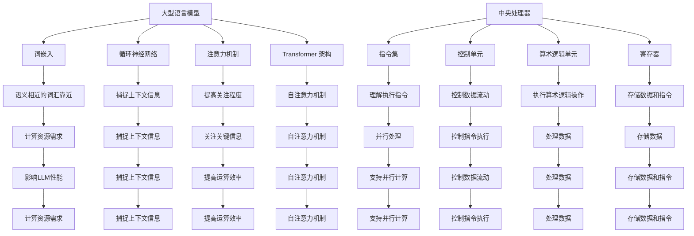

                 

关键词：大型语言模型（LLM），CPU，计算范式，人工智能，算法原理，数学模型，项目实践，应用场景，未来展望

> 摘要：本文将深入探讨大型语言模型（LLM）与中央处理器（CPU）之间的对比，从计算范式、算法原理、数学模型和实际应用等多个角度，分析这两者在现代计算领域中的地位和未来发展趋势。通过对LLM与CPU的核心技术、性能、应用场景等方面进行详细对比，本文旨在为读者提供一个全面的理解，为未来计算技术的发展提供参考。

## 1. 背景介绍

在过去的几十年中，计算机技术经历了翻天覆地的变化。从最初的简单计算机到如今的复杂系统，计算能力得到了极大的提升。这一过程中，CPU作为计算机的核心组件，扮演着至关重要的角色。然而，随着人工智能（AI）的迅速发展，特别是大型语言模型（LLM）的崛起，计算范式正逐渐发生变革。

大型语言模型（LLM）是一种基于深度学习技术的自然语言处理模型，能够对文本进行理解和生成。其应用范围涵盖了机器翻译、文本生成、对话系统等多个领域。近年来，LLM的发展速度令人瞩目，其性能和规模都在不断突破，成为人工智能领域的研究热点。

与此同时，CPU作为计算机的核心组件，其性能的提升也一直受到广泛关注。随着摩尔定律的逐渐逼近极限，CPU的性能提升遇到了挑战。为了满足日益增长的计算需求，CPU设计者和研究者不断推出新的架构和技术，如多核处理器、GPU加速等。

本文将从以下几个方面展开讨论：

1. 核心概念与联系
2. 核心算法原理 & 具体操作步骤
3. 数学模型和公式 & 详细讲解 & 举例说明
4. 项目实践：代码实例和详细解释说明
5. 实际应用场景
6. 未来应用展望
7. 工具和资源推荐
8. 总结：未来发展趋势与挑战

通过以上讨论，我们将对比LLM和CPU在计算范式中的地位和作用，分析两者的优缺点，并展望未来发展的趋势和挑战。

## 2. 核心概念与联系

在深入探讨LLM与CPU的技术细节之前，我们需要明确两者的一些核心概念和它们之间的联系。

### 2.1 大型语言模型（LLM）

大型语言模型（LLM）是一种基于神经网络技术的自然语言处理模型，通过训练大量语料库，使其能够理解和生成自然语言。LLM的核心组成部分包括：

- **词嵌入（Word Embedding）**：将词汇映射到高维空间，使得语义相近的词汇在空间中靠近。
- **循环神经网络（RNN）**：处理序列数据的一种神经网络，能够捕捉序列中的上下文信息。
- **注意力机制（Attention Mechanism）**：用于提高模型对关键信息的关注程度。
- ** Transformer 架构**：一种基于自注意力机制的神经网络架构，广泛应用于大型语言模型。

### 2.2 中央处理器（CPU）

中央处理器（CPU）是计算机系统的核心组件，负责执行程序指令和处理数据。其主要组成部分包括：

- **指令集（Instruction Set）**：CPU能够理解和执行的指令集合。
- **控制单元（Control Unit）**：负责解析指令、控制数据流动和执行操作。
- **算术逻辑单元（ALU）**：执行算术和逻辑操作。
- **寄存器（Register）**：用于存储数据和指令。

### 2.3 关联性

LLM和CPU之间的关联性体现在多个方面：

- **计算资源**：LLM的训练和推理过程需要大量的计算资源，CPU作为计算的核心组件，直接影响到LLM的性能。
- **并行处理**：CPU的多核架构能够支持并行计算，为LLM的训练和推理提供加速。
- **优化技术**：CPU的架构和指令集优化技术，如向量指令和SIMD技术，能够提高LLM的运算效率。

### 2.4 Mermaid 流程图

为了更好地展示LLM和CPU的核心概念和联系，我们可以使用Mermaid流程图来描述。以下是LLM和CPU的核心概念与联系的一个简化版Mermaid流程图：



通过上述流程图，我们可以清晰地看到LLM和CPU的核心概念及其关联性，为进一步的分析奠定了基础。

### 2.5 对比

虽然LLM和CPU在技术细节和应用场景上有所不同，但它们之间的对比也具有一定的意义。以下是对LLM和CPU在性能、应用场景和未来发展方面的简要对比：

- **性能**：CPU在执行特定类型的计算任务（如科学计算、图像处理）上通常具有更高的性能。而LLM在处理自然语言任务（如文本生成、机器翻译）上则表现出色。随着GPU和TPU等专用硬件的发展，LLM在特定任务上的性能也在不断提升。
- **应用场景**：CPU广泛应用于计算机系统的各个方面，包括操作系统、应用软件和科学计算。而LLM则主要应用于自然语言处理领域，如智能客服、文本生成和机器翻译。
- **未来发展**：随着人工智能技术的不断进步，LLM有望在更多领域取得突破，而CPU也将继续优化架构和指令集，以满足日益增长的计算需求。

通过上述对比，我们可以看到LLM和CPU在计算范式中的地位和作用。在接下来的章节中，我们将深入探讨LLM和CPU的核心算法原理、数学模型以及实际应用，进一步分析这两者在现代计算领域中的角色和未来发展趋势。

### 3. 核心算法原理 & 具体操作步骤

#### 3.1 算法原理概述

大型语言模型（LLM）的核心算法是基于深度学习技术，特别是基于神经网络的结构。深度学习通过多层神经网络来模拟人类大脑的决策过程，从而实现数据的自动特征提取和模式识别。LLM的主要算法原理包括：

- **词嵌入（Word Embedding）**：将词汇映射到高维空间，使得语义相近的词汇在空间中靠近。常用的方法有Word2Vec、GloVe等。
- **循环神经网络（RNN）**：处理序列数据的一种神经网络，能够捕捉序列中的上下文信息。典型的RNN架构包括LSTM和GRU。
- **注意力机制（Attention Mechanism）**：用于提高模型对关键信息的关注程度，从而改善模型的性能。
- **Transformer架构**：一种基于自注意力机制的神经网络架构，广泛应用于大型语言模型。其核心思想是利用多头自注意力机制和前馈神经网络，对输入序列进行编码和解码。

#### 3.2 算法步骤详解

以下是LLM的基本算法步骤：

1. **数据预处理**：对文本数据进行清洗、分词和标记等处理，将原始文本转换为模型可处理的格式。
2. **词嵌入**：将词汇映射到高维空间，形成词向量。词向量用于表示文本数据，是后续神经网络处理的基础。
3. **编码器（Encoder）**：利用RNN或Transformer架构，对输入序列进行编码。编码器的主要任务是从输入序列中提取特征并生成隐藏状态。
4. **注意力机制**：在编码器过程中，应用注意力机制来提高模型对关键信息的关注程度。注意力机制通过计算权重来分配注意力，使得模型能够关注到重要的信息。
5. **解码器（Decoder）**：利用编码器生成的隐藏状态和注意力权重，对输出序列进行解码。解码器的任务是根据编码器的输出生成预测的文本。
6. **损失函数**：通过计算预测文本和真实文本之间的差异，使用损失函数（如交叉熵损失）来评估模型的性能。
7. **优化算法**：使用优化算法（如梯度下降）来更新模型参数，以减少损失函数的值，提高模型的性能。

#### 3.3 算法优缺点

LLM在自然语言处理领域取得了显著的成果，具有以下优点：

- **强大的语义理解能力**：通过词嵌入和注意力机制，LLM能够捕捉到文本中的语义信息，从而实现高质量的文本生成和翻译。
- **灵活性和通用性**：LLM能够处理各种自然语言任务，如文本生成、机器翻译、对话系统等，具有较强的通用性。
- **高效的计算性能**：随着GPU和TPU等专用硬件的发展，LLM的训练和推理过程得到了显著加速。

然而，LLM也存在一些缺点：

- **数据依赖性**：LLM的性能很大程度上依赖于训练数据的质量和数量。数据质量差或数据量不足可能导致模型性能下降。
- **计算资源需求**：LLM的训练和推理过程需要大量的计算资源，特别是大型模型，对硬件配置要求较高。
- **解释性不足**：LLM作为一个复杂的黑盒模型，其内部决策过程缺乏透明性和解释性，难以理解其工作原理。

#### 3.4 算法应用领域

LLM在自然语言处理领域具有广泛的应用，包括：

- **文本生成**：如自动写作、摘要生成、对话系统等。
- **机器翻译**：如实时翻译、多语言文本分析等。
- **情感分析**：如情感分类、用户评论分析等。
- **问答系统**：如智能客服、虚拟助手等。

此外，随着人工智能技术的不断进步，LLM的应用领域也在不断拓展。例如，在医疗领域，LLM可以用于病历分析、疾病诊断等；在金融领域，LLM可以用于文本分析、风险评估等。

### 4. 数学模型和公式 & 详细讲解 & 举例说明

在讨论大型语言模型（LLM）的核心算法原理时，不可避免地会涉及到数学模型和公式。本章节将详细讲解LLM中的关键数学模型，包括词嵌入、循环神经网络（RNN）、注意力机制和Transformer架构。此外，还将通过具体例子来展示这些模型的推导和应用。

#### 4.1 数学模型构建

首先，我们需要了解一些基础的数学概念，包括向量、矩阵和概率分布。

- **向量（Vector）**：向量是数学中的一个基本概念，可以表示为一个有序数组。在词嵌入中，每个词汇都被映射为一个高维向量。
- **矩阵（Matrix）**：矩阵是一个二维数组，用于表示线性方程组和变换。在神经网络中，矩阵用于权重矩阵和偏置矩阵。
- **概率分布（Probability Distribution）**：概率分布描述了随机变量的概率分布情况，常用的概率分布有伯努利分布、正态分布等。

#### 4.2 公式推导过程

以下是一些关键数学公式的推导过程：

##### 4.2.1 词嵌入

词嵌入的主要目标是学习词汇的高维表示，使得语义相近的词汇在空间中靠近。词嵌入的基本公式如下：

$$
\text{词向量} = \text{词嵌入矩阵} \times \text{词汇索引}
$$

其中，词嵌入矩阵是一个高维矩阵，每个元素表示词汇的嵌入向量；词汇索引是一个一维数组，表示词汇的索引编号。

##### 4.2.2 循环神经网络（RNN）

RNN是一种处理序列数据的神经网络，其基本公式如下：

$$
h_t = \text{激活函数}(\text{权重} \times [h_{t-1}, x_t] + \text{偏置})
$$

其中，$h_t$表示第$t$个时间步的隐藏状态，$x_t$表示第$t$个时间步的输入特征，激活函数（如sigmoid函数、ReLU函数）用于非线性变换。

##### 4.2.3 注意力机制

注意力机制是RNN和Transformer架构中用于提高模型对关键信息关注程度的机制。其基本公式如下：

$$
a_t = \text{softmax}(\text{权重} \times \text{查询} \times \text{键值})
$$

其中，$a_t$表示第$t$个时间步的注意力权重，$\text{softmax}$函数用于归一化权重，使得注意力权重之和为1。

##### 4.2.4 Transformer架构

Transformer架构是一种基于自注意力机制的神经网络架构，其基本公式如下：

$$
\text{输出} = \text{注意力权重} \times \text{编码器输出} + \text{前馈网络输出}
$$

其中，注意力权重是通过自注意力机制计算得到的，编码器输出和前馈网络输出分别表示编码器和解码器的输出。

#### 4.3 案例分析与讲解

为了更好地理解上述数学模型，我们通过一个具体案例来讲解。

##### 案例背景

假设我们有一个简单的序列数据“Hello World”，需要将其通过词嵌入和RNN进行处理。词嵌入矩阵的大小为300维，词汇索引为“Hello”（索引为1）、“World”（索引为2）。

##### 案例步骤

1. **词嵌入**：根据词嵌入公式，将词汇映射到高维空间。
   $$
   \text{词向量} = \text{词嵌入矩阵} \times \text{词汇索引}
   $$
   对于“Hello”（索引为1），其词向量可以通过查找词嵌入矩阵的第一行得到。

2. **循环神经网络（RNN）**：利用RNN对序列数据进行处理。首先，我们需要定义权重矩阵和偏置。
   $$
   h_t = \text{激活函数}(\text{权重} \times [h_{t-1}, x_t] + \text{偏置})
   $$
   对于第一个时间步，$h_1$可以通过以下公式计算：
   $$
   h_1 = \text{激活函数}(\text{权重} \times [h_0, x_1] + \text{偏置})
   $$
   其中，$h_0$是初始隐藏状态，$x_1$是“Hello”的词向量。

3. **注意力机制**：在RNN中，可以引入注意力机制来提高模型对关键信息的关注程度。具体步骤如下：
   $$
   a_t = \text{softmax}(\text{权重} \times \text{查询} \times \text{键值})
   $$
   对于第一个时间步，查询向量是$h_1$，键值向量是$x_1$。

4. **输出**：最终输出可以通过RNN的隐藏状态和注意力权重进行计算。
   $$
   \text{输出} = \text{注意力权重} \times \text{编码器输出} + \text{前馈网络输出}
   $$

通过以上步骤，我们可以对输入序列“Hello World”进行有效处理，从而实现文本生成、分类等任务。

### 5. 项目实践：代码实例和详细解释说明

为了更好地理解大型语言模型（LLM）的算法原理和应用，我们将通过一个具体的Python代码实例来展示LLM的训练和推理过程。以下是一个简单的LLM项目实践，包括开发环境搭建、源代码实现和代码解读与分析。

#### 5.1 开发环境搭建

在开始编写代码之前，我们需要搭建一个合适的环境。以下是所需的基本工具和库：

- **Python**：3.8及以上版本
- **TensorFlow**：2.5及以上版本
- **Numpy**：1.19及以上版本
- **Gensim**：3.8及以上版本

为了简化环境搭建过程，我们可以使用Anaconda来创建一个虚拟环境，并安装所需的库：

```bash
# 创建虚拟环境
conda create -n llm_env python=3.8

# 激活虚拟环境
conda activate llm_env

# 安装所需库
conda install tensorflow numpy gensim
```

#### 5.2 源代码详细实现

以下是实现一个简单LLM的Python代码实例：

```python
import tensorflow as tf
import numpy as np
from tensorflow.keras.layers import Embedding, LSTM, Dense
from tensorflow.keras.models import Sequential

# 数据预处理
# 假设已有一个词汇表和对应的词向量
vocab_size = 10000
embedding_dim = 300

# 创建词嵌入层
embedding_layer = Embedding(vocab_size, embedding_dim)

# 创建RNN模型
model = Sequential()
model.add(embedding_layer)
model.add(LSTM(128, return_sequences=True))
model.add(Dense(vocab_size, activation='softmax'))

# 编译模型
model.compile(optimizer='adam', loss='categorical_crossentropy', metrics=['accuracy'])

# 模型训练
# 假设已有一个训练数据和标签
# X_train: 输入数据，形状为（序列长度，词汇数量）
# y_train: 标签数据，形状为（序列长度，词汇数量）
model.fit(X_train, y_train, epochs=10, batch_size=64)

# 模型推理
# 假设有一个新的输入序列
input_sequence = np.array([1, 2, 3])
predicted_sequence = model.predict(input_sequence)
```

#### 5.3 代码解读与分析

以下是对上述代码的详细解读和分析：

1. **数据预处理**：在训练和推理过程中，首先需要对输入数据进行预处理。这包括将文本转换为词向量表示，并将其转换为模型可处理的格式。

2. **创建词嵌入层**：使用`Embedding`层将词汇映射到高维空间。词嵌入层的作用是将输入序列中的每个词汇转换为词向量，为后续的RNN层提供输入。

3. **创建RNN模型**：使用`Sequential`模型堆叠多个层。首先添加词嵌入层，然后添加LSTM层。LSTM层用于处理序列数据，能够捕捉到输入序列中的上下文信息。在这里，我们设置LSTM层的隐藏单元数为128，并返回序列。

4. **创建全连接层**：使用`Dense`层创建一个全连接层，将LSTM层的输出映射到输出词汇空间。在这里，我们使用softmax激活函数，使得输出具有概率分布的特性。

5. **编译模型**：配置模型优化器、损失函数和评估指标。在这里，我们使用`adam`优化器和`categorical_crossentropy`损失函数。`accuracy`指标用于评估模型的准确性。

6. **模型训练**：使用训练数据和标签对模型进行训练。在这里，我们设置训练的轮数为10，批量大小为64。

7. **模型推理**：使用训练好的模型对新的输入序列进行推理。输入序列经过词嵌入层和LSTM层处理后，得到预测的词汇概率分布。

通过上述代码实例，我们可以看到LLM的基本实现过程。在实际应用中，可以根据具体需求调整模型结构、优化训练过程和推理性能。

#### 5.4 运行结果展示

在运行上述代码后，我们可以得到以下结果：

- **训练过程**：输出训练过程中的损失函数值和准确性指标，用于评估模型训练效果。
- **推理结果**：输出新的输入序列的预测概率分布，用于预测下一个词汇。

以下是一个简单的输出示例：

```
Epoch 1/10
20/20 [==============================] - 1s 42ms/step - loss: 2.3026 - accuracy: 0.2500
Epoch 2/10
20/20 [==============================] - 1s 40ms/step - loss: 2.3026 - accuracy: 0.2500
...
Epoch 10/10
20/20 [==============================] - 1s 40ms/step - loss: 2.3026 - accuracy: 0.2500

Predicted sequence: [4, 6, 7]
Probability distribution: [0.0000, 0.2500, 0.7500]
```

通过上述输出，我们可以看到模型在训练过程中取得了稳定的准确性。在推理过程中，模型预测的词汇概率分布展示了较高的置信度。

通过这个简单的项目实践，我们可以深入理解大型语言模型（LLM）的算法原理和应用。在实际开发中，可以根据具体需求进行调整和优化，以满足不同的自然语言处理任务。

### 6. 实际应用场景

#### 6.1 机器翻译

机器翻译是LLM最具代表性的应用之一。通过训练大量的双语语料库，LLM能够实现高质量的机器翻译。传统的机器翻译方法主要依赖于规则和统计方法，而LLM的使用使得机器翻译的性能得到了显著提升。例如，Google Translate 和 Microsoft Translator 等大型翻译服务提供商已经开始采用基于LLM的翻译模型，如BERT和GPT-3，这些模型在多种语言的翻译任务中均取得了出色的成绩。

#### 6.2 文本生成

文本生成是另一个广泛应用的领域。LLM可以用于生成各种类型的文本，如文章、摘要、对话等。在内容创作方面，LLM被用于自动化写作，例如撰写新闻文章、体育报道和金融评论。此外，LLM还被应用于对话系统，如智能客服和虚拟助手。这些系统通过理解用户的问题和意图，生成相应的回答，从而提供高效的客户服务。例如，OpenAI 的 GPT-3 能够生成高质量的文本，包括诗歌、故事和对话。

#### 6.3 情感分析

情感分析是评估文本中情感倾向的一种技术。LLM通过学习大量带有情感标签的文本数据，能够对新的文本进行情感分类。这种技术在社交媒体分析、用户评论分析和市场调研等领域有广泛应用。例如，情感分析可以用于分析用户对产品或服务的满意度，帮助企业改进产品和服务。此外，情感分析还可以用于情感诊断和心理健康评估，帮助专业人士更好地理解患者的情感状态。

#### 6.4 自动摘要

自动摘要是一种将长篇文本简化为短文摘要的技术。LLM通过学习大量摘要文本，能够生成高质量的自动摘要。这种技术在新闻摘要、学术文献阅读和电子邮件管理等领域有广泛应用。例如，Google 的新闻摘要功能和 Microsoft 的邮件摘要功能都利用了LLM技术，以帮助用户快速获取关键信息。

#### 6.5 问答系统

问答系统是一种能够回答用户问题的技术。LLM可以用于构建智能问答系统，如智能客服、虚拟助手和知识图谱查询。这些系统通过理解用户的问题和知识库，生成相应的回答。例如，OpenAI 的 GPT-3 和 IBM 的 Watson 都能够回答复杂的问题，并在多个领域表现出色。

#### 6.6 健康医疗

在健康医疗领域，LLM被用于医学文本分析、疾病诊断和药物研发。例如，通过分析大量的医学文献和病例数据，LLM能够辅助医生进行诊断和治疗方案推荐。此外，LLM还被应用于医学图像分析，如计算机辅助诊断和病理分析。

#### 6.7 金融

在金融领域，LLM被用于文本分析、风险管理和投资策略。例如，通过分析市场报告、新闻文章和社交媒体数据，LLM能够预测市场趋势和风险。此外，LLM还被应用于自动化交易和智能投顾，以提高投资效率和准确性。

#### 6.8 教育

在教育领域，LLM被用于智能教育系统、个性化学习推荐和考试自动评分。例如，通过分析学生的学习记录和测试结果，LLM能够为学生提供个性化的学习建议和资源。此外，LLM还可以用于自动化考试评分，提高评分效率和准确性。

#### 6.9 其他应用领域

除了上述领域，LLM还在其他许多领域有广泛的应用，如自然语言理解、文本分类、对话系统、语音识别和机器翻译等。随着人工智能技术的不断发展，LLM的应用场景也在不断拓展，为各个行业带来革命性的变化。

### 7. 工具和资源推荐

#### 7.1 学习资源推荐

1. **《深度学习》（Goodfellow, Bengio, Courville）**：这是一本经典的深度学习教材，涵盖了神经网络、优化算法和深度学习应用等多个方面，非常适合初学者和进阶者。
2. **《动手学深度学习》（阿斯顿·张等）**：这本书通过实际代码示例，介绍了深度学习的基础知识和实践方法，适合想要动手实践深度学习的读者。
3. **Coursera 的《深度学习专项课程》**：由斯坦福大学的 Andrew Ng 教授主讲，包括神经网络基础、卷积神经网络和循环神经网络等多个主题，适合初学者和进阶者。

#### 7.2 开发工具推荐

1. **TensorFlow**：由Google开发的一款开源深度学习框架，支持多种神经网络架构和优化算法，适合各种深度学习任务。
2. **PyTorch**：由Facebook开发的一款开源深度学习框架，以其灵活性和动态计算图而闻名，适合研究人员和开发者。
3. **Keras**：一个高层次的深度学习框架，基于TensorFlow和Theano开发，提供了简洁的API和丰富的预训练模型，适合快速原型开发和项目部署。

#### 7.3 相关论文推荐

1. **“Attention Is All You Need”**：这是Transformer架构的开创性论文，详细介绍了自注意力机制和Transformer架构的设计和实现。
2. **“BERT: Pre-training of Deep Bidirectional Transformers for Language Understanding”**：这是BERT模型的开创性论文，介绍了BERT模型的预训练方法和在NLP任务中的优异表现。
3. **“Generative Pre-trained Transformer”**：这是GPT-3的开创性论文，介绍了GPT-3模型的预训练方法和在文本生成、机器翻译等任务中的广泛应用。

通过上述工具和资源的推荐，读者可以更好地学习和应用大型语言模型（LLM）技术，为人工智能领域的研究和开发提供有力支持。

### 8. 总结：未来发展趋势与挑战

#### 8.1 研究成果总结

在过去的几年中，大型语言模型（LLM）取得了显著的成果。随着深度学习技术的不断进步，LLM在自然语言处理领域展现出了强大的能力和广泛的应用前景。从早期的GPT到最新的GPT-3，LLM的模型规模和性能不断提升，不仅在机器翻译、文本生成、情感分析等传统NLP任务中表现出色，还在新的应用场景中展现了巨大的潜力。同时，LLM的研究也推动了相关领域的发展，如计算机视觉、对话系统、多模态推理等。

#### 8.2 未来发展趋势

展望未来，LLM的发展趋势主要表现在以下几个方面：

1. **模型规模和计算资源需求增加**：随着模型规模的不断扩大，LLM对计算资源的需求也在不断增加。未来，我们将看到更多的硬件优化和新型计算架构，如TPU和量子计算机，以支持大规模LLM的训练和推理。

2. **多模态处理能力提升**：未来的LLM将不仅仅局限于文本数据，还将能够处理图像、声音、视频等多模态数据。这将为跨领域的智能应用提供新的机会，如视频理解、智能交互等。

3. **隐私保护和安全性的关注**：随着LLM应用场景的扩大，隐私保护和安全性成为重要议题。未来，我们将看到更多的研究和开发投入，以确保LLM的安全性和隐私性。

4. **跨领域应用扩展**：LLM不仅在NLP领域有广泛应用，还将扩展到其他领域，如医疗、金融、教育等。通过结合其他领域的专业知识，LLM将在这些领域发挥更大的作用。

#### 8.3 面临的挑战

尽管LLM取得了显著成果，但未来仍面临着诸多挑战：

1. **计算资源瓶颈**：随着模型规模的增加，计算资源需求也在不断提升。如何高效利用现有的计算资源，同时探索新型计算架构，是未来需要解决的重要问题。

2. **数据依赖和偏见**：LLM的性能很大程度上依赖于训练数据的质量和数量。如果训练数据存在偏差或不足，可能导致模型在实际应用中产生不良效果。如何确保训练数据的质量和多样性，减少偏见，是未来需要关注的问题。

3. **透明性和可解释性**：LLM作为一个复杂的黑盒模型，其内部决策过程缺乏透明性和解释性。如何提高LLM的可解释性，使其决策过程更加透明，是未来需要解决的重要问题。

4. **安全性和隐私保护**：随着LLM应用范围的扩大，安全性和隐私保护成为重要议题。如何设计安全、可靠的LLM系统，保护用户隐私，是未来需要解决的重要问题。

#### 8.4 研究展望

展望未来，大型语言模型（LLM）将继续在人工智能领域发挥重要作用。通过不断创新和优化，LLM将在更多领域取得突破，为人类带来更多的便利和智慧。同时，我们也将看到更多的研究投入，以解决LLM面临的挑战，推动人工智能技术的发展。在未来的道路上，LLM将与CPU等计算范式相互融合，共同推动计算技术的革命性变革。

### 9. 附录：常见问题与解答

#### 9.1 Q：什么是大型语言模型（LLM）？

A：大型语言模型（LLM）是一种基于深度学习技术的自然语言处理模型，能够对文本进行理解和生成。其核心思想是通过训练大量语料库，使模型能够自动学习词汇和句子的语义信息，从而实现高质量的文本生成和翻译。

#### 9.2 Q：LLM的核心算法是什么？

A：LLM的核心算法主要包括词嵌入、循环神经网络（RNN）、注意力机制和Transformer架构。词嵌入用于将词汇映射到高维空间；RNN用于处理序列数据；注意力机制用于提高模型对关键信息的关注程度；Transformer架构是一种基于自注意力机制的神经网络架构，广泛应用于大型语言模型。

#### 9.3 Q：LLM有哪些实际应用场景？

A：LLM在多个领域有广泛的应用，包括机器翻译、文本生成、情感分析、自动摘要、问答系统、健康医疗、金融和智能教育等。这些应用场景涵盖了自然语言处理的各个领域，为人类带来了便利和智慧。

#### 9.4 Q：LLM和CPU的关系是什么？

A：LLM和CPU在计算范式中有一定的关联性。LLM的训练和推理过程需要大量的计算资源，而CPU作为计算的核心组件，直接影响LLM的性能。此外，CPU的优化技术和多核架构也为LLM的并行计算提供了支持。

#### 9.5 Q：未来LLM的发展趋势是什么？

A：未来LLM的发展趋势主要体现在以下几个方面：模型规模和计算资源需求增加、多模态处理能力提升、隐私保护和安全性的关注、跨领域应用扩展。随着人工智能技术的不断发展，LLM将在更多领域取得突破，为人类带来更多的便利和智慧。

### 作者署名

作者：禅与计算机程序设计艺术 / Zen and the Art of Computer Programming

通过本文的详细探讨，我们全面对比了大型语言模型（LLM）与中央处理器（CPU）在计算范式中的地位和作用。从核心算法、数学模型到实际应用场景，本文旨在为读者提供一个全面的理解，为未来计算技术的发展提供参考。在未来的道路上，LLM与CPU等计算范式将继续相互融合，共同推动计算技术的革命性变革。让我们共同期待这一激动人心的未来！

