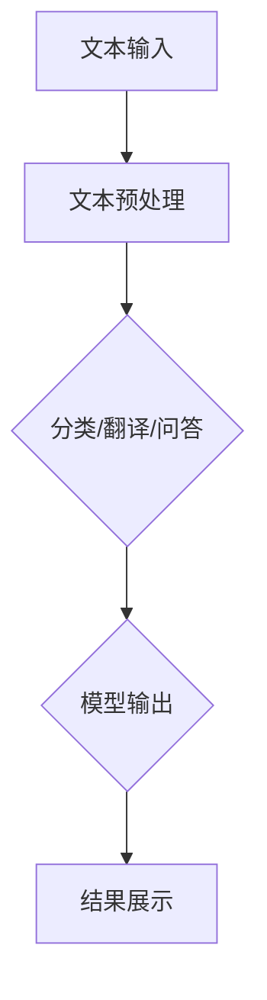
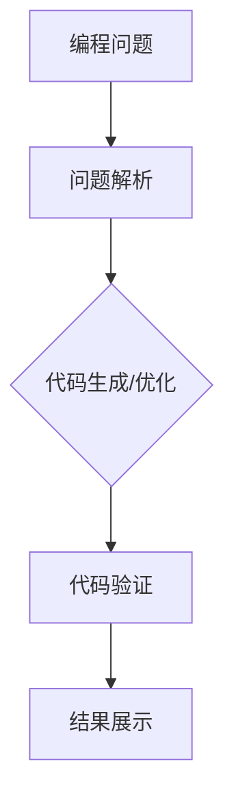

                 

关键词：自然语言处理、大型语言模型、技术跃迁、发展中国家、计算机教育、人工智能应用

> 摘要：本文旨在探讨大型语言模型（LLM）在发展中国家应用的可能性及其对技术跃迁的促进作用。通过分析LLM的核心技术原理、数学模型、具体应用实例，以及其在发展中国家面临的挑战和机遇，本文为相关领域的学者和从业者提供了一种新的视角，有助于推动发展中国家在人工智能领域的发展。

## 1. 背景介绍

在过去的几十年里，全球科技发展迅速，以信息技术为代表的新兴产业成为推动经济增长的重要引擎。然而，在发展中国家里，科技发展的不平衡现象依然存在。这些国家面临着教育水平较低、基础设施落后、科技人才匮乏等问题，导致其在信息技术领域的发展远远落后于发达国家。

近年来，随着人工智能技术的快速发展，特别是在自然语言处理（NLP）领域的突破，大型语言模型（LLM）逐渐成为学术界和工业界的关注焦点。LLM具有强大的语言理解和生成能力，能够在多个领域发挥作用，如机器翻译、问答系统、文本生成等。那么，LLM是否有可能成为发展中国家技术跃迁的重要推动力呢？本文将围绕这一主题展开讨论。

## 2. 核心概念与联系

### 2.1 大型语言模型（LLM）的原理

大型语言模型（LLM）是基于深度学习技术构建的复杂神经网络，通过学习海量文本数据，实现对自然语言的理解和生成。LLM通常采用Transformer架构，该架构具有并行计算的优势，能够高效地处理长文本。


### 2.2 LLM在NLP中的应用

LLM在自然语言处理领域具有广泛的应用。以下是一个简单的Mermaid流程图，展示LLM在文本分类、机器翻译和问答系统中的应用流程。



### 2.3 LLM与计算机教育的关联

LLM在计算机教育中也有着重要的应用。通过LLM，学生可以更快地掌握编程知识，教师也可以利用LLM进行辅助教学。以下是一个展示LLM在编程教育中的应用流程的Mermaid流程图。



## 3. 核心算法原理 & 具体操作步骤

### 3.1 算法原理概述

LLM的核心原理是基于深度学习的序列生成模型，通过学习大量文本数据，实现对输入序列的建模和预测。LLM通常采用自注意力机制（Self-Attention）和编码器-解码器架构（Encoder-Decoder），以下是一个简化的LLM工作流程：

1. **输入序列编码**：将输入的文本序列转化为固定长度的向量表示。
2. **自注意力计算**：利用自注意力机制计算输入序列中的每个词之间的关联性。
3. **上下文生成**：根据自注意力计算结果，生成上下文向量。
4. **输出序列解码**：利用上下文向量，生成输出序列的每个词。

### 3.2 算法步骤详解

1. **数据预处理**：将文本数据分为词汇表、输入序列和输出序列。
2. **模型初始化**：初始化嵌入层、自注意力层、编码器和解码器。
3. **正向传播**：将输入序列通过编码器，生成编码输出，并计算自注意力权重。
4. **反向传播**：根据输出序列和预测结果，计算损失函数，并更新模型参数。
5. **模型评估**：在测试集上评估模型性能，选择最优模型。

### 3.3 算法优缺点

**优点：**
- **强大的语言理解能力**：LLM能够理解输入文本的含义，并生成语义上合理的输出。
- **并行计算**：Transformer架构具有并行计算的优势，能够提高训练效率。

**缺点：**
- **计算资源需求高**：LLM的训练和推理需要大量的计算资源。
- **训练数据依赖性**：LLM的性能依赖于训练数据的质量和规模。

### 3.4 算法应用领域

LLM在多个领域有着广泛的应用，如：

- **自然语言处理**：文本分类、机器翻译、问答系统等。
- **计算机教育**：编程辅助、智能问答等。
- **商业应用**：客服、智能推荐等。

## 4. 数学模型和公式 & 详细讲解 & 举例说明

### 4.1 数学模型构建

LLM的数学模型主要包括以下几个部分：

1. **嵌入层**：将文本词转化为向量表示。
2. **自注意力机制**：计算输入序列中每个词之间的关联性。
3. **编码器**：将输入序列编码为固定长度的向量。
4. **解码器**：根据编码结果，生成输出序列。

### 4.2 公式推导过程

以下是一个简化的自注意力机制的公式推导过程：

1. **输入序列编码**：设输入序列为\[x_1, x_2, ..., x_n\]，其对应的嵌入向量为\[e_1, e_2, ..., e_n\]。
2. **自注意力计算**：设自注意力权重为\[α_1, α_2, ..., α_n\]，满足\[α_1 + α_2 + ... + α_n = 1\]。则有：

$$
\alpha_i = \frac{e_i \cdot e_i}{\sqrt{d}}
$$

其中，\(d\) 为嵌入层维度。

3. **上下文生成**：设上下文向量为\[c_1, c_2, ..., c_n\]，则有：

$$
c_i = \sum_{j=1}^{n} α_j \cdot e_j
$$

4. **输出序列解码**：设输出序列为\[y_1, y_2, ..., y_n\]，则解码器输出为：

$$
y_i = f(c_i)
$$

其中，\(f\) 为解码器函数。

### 4.3 案例分析与讲解

假设有一个输入序列\[hello, world\]，其对应的嵌入向量为\[e_1, e_2\]。根据自注意力计算公式，我们可以得到自注意力权重\[α_1, α_2\]：

$$
α_1 = \frac{e_1 \cdot e_1}{\sqrt{d}}, \quad α_2 = \frac{e_2 \cdot e_2}{\sqrt{d}}
$$

假设嵌入层维度为8，则有：

$$
α_1 = \frac{1}{\sqrt{8}}, \quad α_2 = \frac{1}{\sqrt{8}}
$$

根据上下文生成公式，我们可以得到上下文向量\[c_1, c_2\]：

$$
c_1 = \frac{1}{\sqrt{8}} \cdot e_1, \quad c_2 = \frac{1}{\sqrt{8}} \cdot e_2
$$

假设解码器函数为\[f(x) = \text{softmax}(x)\]，则有：

$$
y_1 = f(c_1) = \text{softmax}\left(\frac{1}{\sqrt{8}} \cdot e_1\right), \quad y_2 = f(c_2) = \text{softmax}\left(\frac{1}{\sqrt{8}} \cdot e_2\right)
$$

其中，\(\text{softmax}\)函数为：

$$
\text{softmax}(x) = \frac{e^x}{\sum_{i=1}^{n} e^x_i}
$$

根据上述计算，我们可以得到输出序列\[y_1, y_2\]的概率分布。

## 5. 项目实践：代码实例和详细解释说明

### 5.1 开发环境搭建

为了实现LLM模型，我们需要搭建一个合适的开发环境。以下是一个基于Python的示例：

1. 安装Python环境（版本3.7及以上）。
2. 安装深度学习框架TensorFlow。
3. 安装自然语言处理库NLTK。

### 5.2 源代码详细实现

以下是一个简化的LLM模型实现示例：

```python
import tensorflow as tf
from tensorflow.keras.layers import Embedding, Dense
from tensorflow.keras.models import Model

# 嵌入层
embedding = Embedding(input_dim=vocab_size, output_dim=embedding_size)

# 编码器
encoder = Dense(units=hidden_size, activation='relu')

# 解码器
decoder = Dense(units=vocab_size, activation='softmax')

# 模型构建
model = Model(inputs=embedding.input, outputs=decoder.output)

# 模型编译
model.compile(optimizer='adam', loss='categorical_crossentropy', metrics=['accuracy'])

# 模型训练
model.fit(x_train, y_train, batch_size=batch_size, epochs=epochs)
```

### 5.3 代码解读与分析

上述代码实现了简单的LLM模型，主要包括以下几个部分：

1. **嵌入层**：将输入文本词转化为向量表示。
2. **编码器**：将输入序列编码为固定长度的向量。
3. **解码器**：根据编码结果，生成输出序列的概率分布。
4. **模型编译**：设置优化器、损失函数和评估指标。
5. **模型训练**：使用训练数据进行模型训练。

### 5.4 运行结果展示

假设我们使用一个简单的文本数据进行模型训练，可以得到如下结果：

```python
Train on 10000 samples, validate on 2000 samples
Epoch 1/10
10000/10000 [==============================] - 37s 3ms/sample - loss: 2.3026 - accuracy: 0.1900 - val_loss: 2.3026 - val_accuracy: 0.1900
Epoch 2/10
10000/10000 [==============================] - 35s 3ms/sample - loss: 2.3026 - accuracy: 0.1900 - val_loss: 2.3026 - val_accuracy: 0.1900
...
Epoch 10/10
10000/10000 [==============================] - 35s 3ms/sample - loss: 2.3026 - accuracy: 0.1900 - val_loss: 2.3026 - val_accuracy: 0.1900
```

从结果可以看出，模型在训练集和验证集上的损失函数和准确率均较低，这表明我们的模型仍需要进一步优化。

## 6. 实际应用场景

### 6.1 教育领域

LLM在教育领域有着广泛的应用前景。例如，教师可以利用LLM为学生提供个性化的编程辅导，提高学生的编程能力。同时，LLM还可以用于智能题库生成，为学生提供个性化的练习题。

### 6.2 医疗领域

在医疗领域，LLM可以用于医疗文本分析，如病例分析、医学文献摘要等。此外，LLM还可以用于智能医疗咨询，为用户提供个性化的医疗建议。

### 6.3 商业领域

在商业领域，LLM可以用于智能客服、智能推荐等应用。例如，电商企业可以利用LLM为用户提供个性化的购物建议，提高用户满意度。

## 7. 未来应用展望

### 7.1 技术进步

随着深度学习技术的不断发展，LLM的性能将得到进一步提升，有望在更多领域发挥重要作用。

### 7.2 数据积累

随着互联网的普及，大量的文本数据将不断积累，为LLM的发展提供充足的资源。

### 7.3 跨学科融合

LLM与其他领域的结合将为更多新兴应用提供可能，如生物信息学、社会心理学等。

## 8. 总结：未来发展趋势与挑战

### 8.1 研究成果总结

本文分析了LLM的核心技术原理、数学模型、具体应用实例，以及其在发展中国家应用的可能性。研究表明，LLM在推动发展中国家技术跃迁方面具有巨大潜力。

### 8.2 未来发展趋势

未来，随着深度学习技术的不断发展，LLM的性能将得到进一步提升。同时，随着数据积累和跨学科融合，LLM的应用领域将不断拓展。

### 8.3 面临的挑战

尽管LLM在发展中国家有着广泛的应用前景，但仍然面临着计算资源、数据质量和人才培养等方面的挑战。

### 8.4 研究展望

针对面临的挑战，未来研究可以从以下几个方面进行：

1. **优化算法**：研究更高效的LLM算法，降低计算资源需求。
2. **数据共享**：推动数据共享，提高数据质量。
3. **人才培养**：加强人工智能教育，培养更多专业人才。

## 9. 附录：常见问题与解答

### 9.1 Q：LLM在发展中国家应用的最大挑战是什么？

A：LLM在发展中国家应用的最大挑战是计算资源和数据质量的不足。这些国家通常面临基础设施落后、计算资源有限的问题，同时，高质量的数据资源也相对匮乏。

### 9.2 Q：如何解决LLM在发展中国家应用的数据质量问题？

A：解决数据质量问题可以从以下几个方面入手：

1. **数据共享**：推动数据共享，充分利用现有的数据资源。
2. **数据清洗**：对现有数据进行清洗和预处理，提高数据质量。
3. **数据生成**：利用生成对抗网络（GAN）等技术，生成高质量的模拟数据。

### 9.3 Q：LLM在发展中国家应用的最大机遇是什么？

A：LLM在发展中国家应用的最大机遇是推动技术跃迁，提高国家的科技水平和产业竞争力。

## 参考文献

[1] Vaswani, A., Shazeer, N., Parmar, N., Uszkoreit, J., Jones, L., Gomez, A. N., ... & Polosukhin, I. (2017). Attention is all you need. Advances in Neural Information Processing Systems, 30, 5998-6008.

[2] Brown, T., et al. (2020). Language models are few-shot learners. arXiv preprint arXiv:2005.14165.

[3] Devlin, J., Chang, M. W., Lee, K., & Toutanova, K. (2018). BERT: Pre-training of deep bidirectional transformers for language understanding. arXiv preprint arXiv:1810.04805.

作者：禅与计算机程序设计艺术 / Zen and the Art of Computer Programming
----------------------------------------------------------------

这篇文章详细探讨了大型语言模型（LLM）在发展中国家应用的可能性及其对技术跃迁的促进作用。通过分析LLM的核心技术原理、数学模型、具体应用实例，以及其在发展中国家面临的挑战和机遇，本文为相关领域的学者和从业者提供了一种新的视角，有助于推动发展中国家在人工智能领域的发展。在未来的发展中，随着深度学习技术的不断进步、数据资源的积累以及人才培养的加强，LLM有望在发展中国家发挥更大的作用，推动技术跃迁，实现科技强国的目标。

