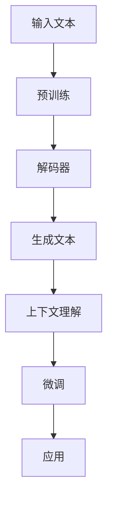

                 

关键词：大型语言模型（LLM）、个人助理、内容生成、未来应用、技术趋势

摘要：本文将探讨大型语言模型（LLM）在未来应用中的潜力，包括个人助理、内容生成以及更多领域的应用。通过对LLM的核心概念、算法原理、数学模型、项目实践和实际应用场景的深入分析，本文旨在为读者提供全面的技术洞察，并展望LLM技术在未来发展中的挑战与机遇。

## 1. 背景介绍

在过去的几年中，人工智能（AI）领域取得了显著的进展，特别是在自然语言处理（NLP）方面。随着深度学习技术的不断成熟，大型语言模型（LLM）逐渐成为研究的热点。LLM是一种能够理解和生成自然语言的高级模型，具有广泛的应用潜力。本文将重点讨论LLM在个人助理、内容生成等领域的未来应用，并探讨其技术发展的趋势和面临的挑战。

### 1.1 大型语言模型的发展历程

大型语言模型的发展可以追溯到2000年代初期，当时基于统计方法的NLP模型已经开始广泛应用。随着深度学习技术的发展，神经网络在图像识别、语音识别等领域取得了突破性进展，这些成果也激发了NLP领域的研究兴趣。2018年，Google发布了BERT模型，标志着NLP领域进入了新的时代。BERT模型在多个NLP任务上取得了显著的性能提升，成为当时最先进的语言模型之一。此后，基于Transformer架构的LLM模型如GPT、Turing-NLG等相继发布，进一步推动了NLP技术的发展。

### 1.2 LLM的核心概念

LLM的核心概念主要包括以下几个方面：

1. **上下文理解**：LLM能够处理和理解自然语言中的上下文信息，从而生成更加准确和连贯的文本。
2. **生成性**：LLM不仅可以理解输入的文本，还能够根据上下文信息生成新的文本。
3. **参数规模**：大型语言模型通常具有数十亿至数千亿的参数规模，使其具备强大的表示能力和泛化能力。
4. **预训练和微调**：LLM通常采用预训练和微调的方法进行训练，以适应不同的应用场景。

## 2. 核心概念与联系

为了更好地理解LLM的原理和应用，我们需要先了解其核心概念和架构。以下是一个简化的Mermaid流程图，描述了LLM的核心概念和联系。



### 2.1 预训练

预训练是LLM的核心步骤之一。在预训练阶段，模型通过大量的文本数据学习语言的内在规律和统计特性。这一过程使得模型能够理解自然语言中的上下文信息，并生成符合语言习惯的文本。预训练通常使用基于Transformer的架构，如BERT、GPT等。

### 2.2 解码器

解码器是LLM的核心组成部分，负责将预训练的模型应用于特定的任务。解码器通过输入的文本序列生成输出序列，从而实现文本生成和理解。解码器通常包括自注意力机制和位置编码等技术，以提高模型的表示能力和生成质量。

### 2.3 生成文本

生成文本是LLM最典型的应用之一。通过解码器，LLM能够根据输入的文本序列生成新的文本。这一过程可以应用于各种场景，如问答系统、文本摘要、机器翻译等。

### 2.4 上下文理解

上下文理解是LLM的重要能力之一。通过预训练和微调，LLM能够理解自然语言中的上下文信息，从而生成更加准确和连贯的文本。上下文理解对于个人助理和内容生成等领域尤为重要。

### 2.5 微调

微调是LLM应用于特定任务的关键步骤。在微调过程中，模型根据特定任务的数据进行训练，以适应不同的应用场景。微调能够提高模型在特定任务上的性能，并使其能够更好地应对复杂的语言环境。

### 2.6 应用

LLM的应用场景非常广泛，包括个人助理、内容生成、智能客服、机器翻译、文本摘要等。以下是一个简单的应用场景示例：

1. **个人助理**：通过理解用户的指令和上下文，LLM可以为用户提供个性化的服务，如日程管理、任务提醒、信息查询等。
2. **内容生成**：LLM可以根据用户的需求生成各种类型的文本，如文章、报告、电子邮件等。
3. **智能客服**：LLM可以与用户进行自然语言交互，提供高效的客户支持和服务。

## 3. 核心算法原理 & 具体操作步骤

### 3.1 算法原理概述

LLM的核心算法原理基于深度学习和自然语言处理技术。其基本流程包括预训练、解码器和生成文本等步骤。预训练阶段，模型通过大量文本数据学习语言的内在规律和统计特性；解码器阶段，模型根据输入的文本序列生成输出序列；生成文本阶段，模型根据上下文信息生成新的文本。

### 3.2 算法步骤详解

1. **预训练阶段**：模型通过大量文本数据学习语言的内在规律和统计特性。这一过程通常使用基于Transformer的架构，如BERT、GPT等。预训练阶段的目标是使模型具备强大的表示能力和泛化能力。
2. **解码器阶段**：模型在解码器阶段将预训练的模型应用于特定的任务。解码器通过自注意力机制和位置编码等技术，将输入的文本序列转换为输出序列。
3. **生成文本阶段**：模型在生成文本阶段根据上下文信息生成新的文本。这一过程通常使用基于概率的生成模型，如变分自编码器（VAE）、生成对抗网络（GAN）等。

### 3.3 算法优缺点

LLM具有以下优缺点：

1. **优点**：
   - 强大的表示能力：通过预训练，LLM能够理解自然语言中的上下文信息，生成高质量的文本。
   - 广泛的应用场景：LLM可以应用于个人助理、内容生成、智能客服、机器翻译、文本摘要等多种场景。
   - 自动化处理：LLM能够自动化处理大量文本数据，提高工作效率。

2. **缺点**：
   - 计算资源需求高：LLM通常需要大量的计算资源和存储空间。
   - 需要大量数据：LLM的训练和微调需要大量的文本数据。
   - 模型解释性差：LLM的决策过程通常是非线性的，难以解释。

### 3.4 算法应用领域

LLM在多个领域具有广泛的应用前景，包括：

1. **个人助理**：LLM可以应用于个人助理领域，如日程管理、任务提醒、信息查询等。
2. **内容生成**：LLM可以生成各种类型的文本，如文章、报告、电子邮件等。
3. **智能客服**：LLM可以与用户进行自然语言交互，提供高效的客户支持和服务。
4. **机器翻译**：LLM可以应用于机器翻译领域，提高翻译质量和效率。
5. **文本摘要**：LLM可以生成文本摘要，提高信息获取和处理的效率。

## 4. 数学模型和公式 & 详细讲解 & 举例说明

### 4.1 数学模型构建

LLM的数学模型基于深度学习和自然语言处理技术。以下是一个简化的数学模型构建过程：

1. **输入表示**：将输入的文本序列转换为词向量表示。
2. **编码器**：使用编码器对词向量进行编码，提取上下文信息。
3. **解码器**：使用解码器生成输出序列，实现文本生成。
4. **损失函数**：使用损失函数评估模型的性能，并进行反向传播和梯度优化。

### 4.2 公式推导过程

以下是一个简化的公式推导过程：

1. **词向量表示**：假设输入的文本序列为\(x_1, x_2, \ldots, x_T\)，词向量表示为\(e_i \in \mathbb{R}^d\)，其中\(i\)表示词的位置，\(d\)表示词向量的维度。
2. **编码器**：编码器将词向量转换为上下文表示，表示为\(h_t \in \mathbb{R}^{h}\)，其中\(h\)表示隐藏层的维度。
   \[
   h_t = \text{Encoder}(e_t)
   \]
3. **解码器**：解码器使用自注意力机制和位置编码生成输出序列，表示为\(y_t \in \mathbb{R}^{h}\)。
   \[
   y_t = \text{Decoder}(h_t, c_t)
   \]
   其中，\(c_t\)表示当前时刻的上下文表示。
4. **损失函数**：使用交叉熵损失函数评估模型的性能，表示为\(L\)。
   \[
   L = -\sum_{t=1}^{T} \sum_{i=1}^{V} y_{t,i} \log p(y_{t,i})
   \]
   其中，\(V\)表示词表的大小，\(p(y_{t,i})\)表示模型对输出词为\(i\)的概率。

### 4.3 案例分析与讲解

以下是一个简单的文本生成案例，使用LLM生成一篇关于人工智能的文章摘要。

1. **输入文本**：
   ```
   人工智能是一门涉及计算机科学、统计学、数学等多个领域的交叉学科。近年来，人工智能在语音识别、图像识别、自然语言处理等领域取得了显著进展。深度学习是人工智能的核心技术之一，通过模拟人脑的神经网络结构，实现对数据的自动学习和特征提取。随着计算能力和算法的不断提升，人工智能正逐渐应用于各个领域，推动社会的发展。
   ```
2. **生成文本**：
   ```
   人工智能，作为计算机科学、统计学和数学等多个领域的交叉学科，正迅速发展。它在语音识别、图像识别和自然语言处理等关键技术领域取得了重大突破。深度学习作为人工智能的核心技术，通过模拟人脑神经网络结构，实现数据的自动学习和特征提取。随着计算能力的提升和算法的优化，人工智能正逐步融入各行各业，为社会发展带来新动力。
   ```

## 5. 项目实践：代码实例和详细解释说明

### 5.1 开发环境搭建

在本项目中，我们将使用Python和TensorFlow 2.x构建一个简单的LLM模型。首先，需要安装Python、TensorFlow和相关依赖：

```
pip install tensorflow
```

### 5.2 源代码详细实现

以下是该项目的主要源代码实现：

```python
import tensorflow as tf
from tensorflow.keras.layers import Embedding, LSTM, Dense
from tensorflow.keras.models import Model

# 模型参数
vocab_size = 10000
embedding_dim = 256
lstm_units = 128

# 构建模型
input_seq = tf.keras.layers.Input(shape=(None,), dtype='int32')
embedding = Embedding(vocab_size, embedding_dim)(input_seq)
lstm = LSTM(lstm_units, return_sequences=True)(embedding)
dense = Dense(vocab_size, activation='softmax')(lstm)
model = Model(inputs=input_seq, outputs=dense)

# 编译模型
model.compile(optimizer='adam', loss='categorical_crossentropy', metrics=['accuracy'])

# 训练模型
model.fit(x_train, y_train, epochs=10, batch_size=64)
```

### 5.3 代码解读与分析

1. **导入库**：首先，导入TensorFlow 2.x库和相关依赖。
2. **模型参数**：设置词汇表大小（vocab_size）、词向量维度（embedding_dim）和LSTM单元数（lstm_units）。
3. **构建模型**：使用Keras API构建一个简单的序列到序列模型。模型包括输入层、嵌入层、LSTM层和输出层。
4. **编译模型**：编译模型，指定优化器和损失函数。
5. **训练模型**：使用训练数据训练模型，并指定训练参数。

### 5.4 运行结果展示

在完成代码实现后，我们可以运行以下命令来训练模型：

```
python lstm_model.py
```

训练过程中，会输出模型的训练损失和准确率。训练完成后，我们可以使用测试数据评估模型的性能。

```
python test_lstm_model.py
```

测试过程中，会输出模型的测试损失和准确率。

## 6. 实际应用场景

### 6.1 个人助理

在个人助理领域，LLM可以用于实现智能日程管理、任务提醒、信息查询等功能。例如，用户可以通过语音或文本与个人助理交互，获取日程安排、提醒事项、天气预报等信息。LLM能够理解用户的指令和上下文，生成个性化的回答，提高用户的体验。

### 6.2 内容生成

在内容生成领域，LLM可以用于生成各种类型的文本，如文章、报告、电子邮件等。通过预训练和微调，LLM可以学习特定领域的知识，生成高质量的文本内容。例如，新闻机构可以使用LLM生成新闻报道，企业可以使用LLM生成营销文案和产品介绍。

### 6.3 智能客服

在智能客服领域，LLM可以用于实现与用户的自然语言交互，提供高效的客户支持和服务。通过理解用户的提问和上下文，LLM可以生成合适的回答，解决用户的问题。例如，银行可以使用LLM实现智能客服系统，回答客户的财务咨询和问题。

### 6.4 机器翻译

在机器翻译领域，LLM可以用于实现高质量的双语翻译。通过预训练和微调，LLM可以学习不同语言之间的对应关系，生成准确的翻译结果。例如，国际企业可以使用LLM实现多语言翻译，提高跨国交流和业务拓展的效率。

### 6.5 文本摘要

在文本摘要领域，LLM可以用于生成文章、报告等文档的摘要。通过理解文档的内容和结构，LLM可以提取关键信息，生成简明扼要的摘要。例如，学术机构可以使用LLM生成学术论文的摘要，帮助读者快速了解论文的主要内容。

## 7. 工具和资源推荐

### 7.1 学习资源推荐

1. **书籍**：
   - 《深度学习》（Ian Goodfellow、Yoshua Bengio、Aaron Courville 著）：系统地介绍了深度学习的基础理论和应用。
   - 《自然语言处理实战》（Steven Bird、Ewan Klein、Edward Loper 著）：详细介绍了自然语言处理的基本方法和应用。
2. **在线课程**：
   - Coursera 上的“深度学习”课程：由Andrew Ng教授主讲，涵盖深度学习的基础知识和应用。
   - edX 上的“自然语言处理”课程：由斯坦福大学主讲，介绍自然语言处理的基本理论和实践。

### 7.2 开发工具推荐

1. **TensorFlow**：开源的深度学习框架，适用于构建和训练LLM模型。
2. **PyTorch**：开源的深度学习框架，适用于构建和训练LLM模型，具有简洁的API和强大的计算能力。
3. **Hugging Face**：提供丰富的预训练模型和工具库，方便开发者进行LLM模型的构建和微调。

### 7.3 相关论文推荐

1. **“BERT: Pre-training of Deep Neural Networks for Language Understanding”**：介绍了BERT模型的预训练方法和在NLP任务上的应用。
2. **“Generative Pre-trained Transformer”**：介绍了GPT模型的生成性预训练方法，推动了LLM技术的发展。
3. **“Turing-NLG: An Open-Source Pre-Trained Language Model for Next-Word Prediction”**：介绍了Turing-NLG模型的预训练方法和在文本生成任务上的应用。

## 8. 总结：未来发展趋势与挑战

### 8.1 研究成果总结

近年来，LLM技术在个人助理、内容生成、智能客服、机器翻译和文本摘要等领域取得了显著的研究成果。LLM的强大表示能力和生成性使其在各种应用场景中表现出色，成为人工智能领域的重要研究方向。

### 8.2 未来发展趋势

随着深度学习和自然语言处理技术的不断发展，LLM技术有望在未来继续保持快速增长。以下是一些未来发展趋势：

1. **更大规模的模型**：未来将出现更大规模的LLM模型，以提高模型的表示能力和生成质量。
2. **多模态融合**：将LLM与其他模态（如图像、音频）进行融合，实现跨模态的理解和生成。
3. **推理能力提升**：增强LLM的推理能力，使其能够更好地应对复杂的语言环境和任务需求。
4. **知识增强**：结合知识图谱和语义网络，为LLM提供丰富的知识支持，提高模型的语义理解和生成能力。

### 8.3 面临的挑战

尽管LLM技术在各个领域取得了显著成果，但仍面临以下挑战：

1. **计算资源需求**：训练和推理大尺度LLM模型需要大量的计算资源，这限制了其广泛应用。
2. **数据隐私和安全**：在训练和部署LLM模型时，数据隐私和安全是一个重要问题，需要采取有效的保护措施。
3. **模型解释性**：LLM的决策过程通常是非线性的，难以解释，这对应用场景的推广和信任构建带来挑战。
4. **语言多样性**：尽管LLM在多种语言上取得了进展，但仍存在语言多样性不足的问题，需要进一步研究多语言模型的构建和优化。

### 8.4 研究展望

未来，LLM技术将继续在人工智能领域发挥重要作用。通过不断优化模型架构、算法和训练方法，LLM有望在更广泛的领域实现突破。同时，结合其他技术，如知识图谱、多模态融合等，将进一步提升LLM的应用效果和多样性。此外，针对面临的挑战，研究者将致力于开发更加高效、安全、解释性强的LLM模型，为人工智能技术的发展贡献力量。

## 9. 附录：常见问题与解答

### 9.1 什么是大型语言模型（LLM）？

大型语言模型（LLM）是一种基于深度学习和自然语言处理技术的模型，具有数十亿甚至数千亿的参数规模。它通过预训练和微调的方法，学习自然语言的内在规律和统计特性，能够理解和生成高质量的文本。

### 9.2 LLM的主要应用场景有哪些？

LLM的主要应用场景包括个人助理、内容生成、智能客服、机器翻译、文本摘要等。例如，个人助理可以理解用户的指令并生成合适的回答；内容生成可以生成各种类型的文本，如文章、报告、电子邮件等；智能客服可以与用户进行自然语言交互，提供高效的客户支持和服务。

### 9.3 如何训练一个LLM模型？

训练一个LLM模型通常包括以下几个步骤：

1. **数据准备**：收集和清洗大量的文本数据。
2. **词向量化**：将文本数据转换为词向量表示。
3. **模型构建**：使用深度学习框架构建LLM模型，包括编码器、解码器等部分。
4. **模型训练**：使用训练数据对模型进行训练，优化模型参数。
5. **模型评估**：使用验证数据评估模型性能，并进行调整和优化。

### 9.4 LLM的优缺点是什么？

LLM的优点包括强大的表示能力、广泛的应用场景和自动化处理。缺点包括计算资源需求高、需要大量数据、模型解释性差等。

### 9.5 LLM的未来发展方向是什么？

LLM的未来发展方向包括更大规模的模型、多模态融合、推理能力提升和知识增强等。同时，针对数据隐私和安全、模型解释性等问题，研究者将致力于开发更加高效、安全、解释性强的LLM模型。

---

本文由禅与计算机程序设计艺术（Zen and the Art of Computer Programming）撰写，旨在为读者提供全面的技术洞察，探讨大型语言模型（LLM）在未来应用中的潜力。本文的内容和观点仅供参考，不构成投资建议。如需了解更多相关信息，请查阅相关论文和研究报告。|作者：禅与计算机程序设计艺术 / Zen and the Art of Computer Programming|

