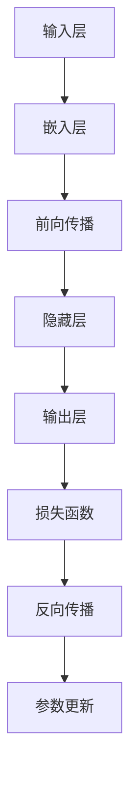

                 

关键词：大型语言模型，计算机架构，人工智能，深度学习，神经网络，自然语言处理

摘要：本文将探讨一种新型的计算机架构——大型语言模型(LLM)，以及它在人工智能和自然语言处理领域中的崛起。我们将深入探讨LLM的核心概念、算法原理、数学模型以及实际应用，并展望其未来的发展趋势和挑战。

## 1. 背景介绍

### 1.1 人工智能与自然语言处理

人工智能（Artificial Intelligence，简称AI）是一门研究、开发和应用使计算机模拟、延伸和扩展人的智能的科学。自然语言处理（Natural Language Processing，简称NLP）是人工智能领域的一个重要分支，旨在使计算机能够理解、生成和处理人类语言。

近年来，随着深度学习技术的迅猛发展，人工智能在自然语言处理领域的应用取得了显著成果。其中，大型语言模型（Large Language Model，简称LLM）成为了一种极具潜力的人工智能模型。

### 1.2  大型语言模型概述

大型语言模型（LLM）是一种基于神经网络（Neural Network）的自然语言处理模型，其核心思想是通过学习大量语言数据，使模型具备理解、生成和处理自然语言的能力。与传统语言模型相比，LLM具有以下几个显著特点：

1. **模型规模巨大**：LLM通常具有数十亿至数千亿个参数，远远超过传统语言模型的参数数量。
2. **自适应能力强**：LLM能够自动调整其内部结构，以适应不同类型和风格的语言数据。
3. **理解能力提升**：LLM在理解复杂语言结构和语义方面取得了显著进展，能够更好地应对自然语言处理中的各种挑战。

## 2. 核心概念与联系

### 2.1  语言模型

语言模型（Language Model）是一种用于预测下一个单词或字符的概率分布的模型。在自然语言处理中，语言模型被广泛应用于语音识别、机器翻译、文本生成等领域。

#### 2.1.1  语言模型的类型

1. **基于规则的模型**：通过手工编写语法规则，预测下一个单词或字符。这类模型的优点是简单易懂，但受限于规则的完备性和人工编写规则的能力。
2. **基于统计的模型**：通过分析大量文本数据，统计单词或字符之间的相关性，预测下一个单词或字符。这类模型的优点是能够自动学习语言规律，但受限于数据规模和统计方法。
3. **基于神经网络的模型**：通过神经网络模型，自动学习语言数据中的特征和规律，预测下一个单词或字符。这类模型的优点是能够处理复杂、非线性关系，但训练时间和计算资源需求较高。

#### 2.1.2  语言模型的评价指标

1. **交叉熵（Cross-Entropy）**：用于衡量模型预测结果与真实结果之间的差异。交叉熵值越小，表示模型预测效果越好。
2. **准确率（Accuracy）**：用于衡量模型预测正确的比例。准确率越高，表示模型预测效果越好。

### 2.2  神经网络

神经网络（Neural Network）是一种模仿生物神经网络结构的人工神经网络，由大量相互连接的神经元组成。神经网络在图像识别、语音识别、自然语言处理等领域取得了显著成果。

#### 2.2.1  神经网络的类型

1. **前馈神经网络（Feedforward Neural Network）**：输入层、隐藏层和输出层依次连接，信息从前向传递。这类模型结构简单，适用于大多数场景。
2. **卷积神经网络（Convolutional Neural Network，简称CNN）**：通过卷积操作提取图像特征，适用于图像识别和计算机视觉任务。
3. **循环神经网络（Recurrent Neural Network，简称RNN）**：适用于序列数据，能够处理时序关系。但在处理长序列时存在梯度消失和梯度爆炸等问题。
4. **长短期记忆网络（Long Short-Term Memory，简称LSTM）**：是RNN的一种改进，能够更好地处理长序列数据。

### 2.3  大型语言模型

大型语言模型（LLM）是一种基于神经网络的语言模型，具有数十亿至数千亿个参数。LLM通过学习大量语言数据，使模型具备理解、生成和处理自然语言的能力。LLM在自然语言处理领域取得了显著成果，被广泛应用于文本生成、问答系统、机器翻译等领域。

### 2.4  Mermaid 流程图

以下是一个Mermaid流程图，展示了大型语言模型（LLM）的核心概念和架构：



## 3. 核心算法原理 & 具体操作步骤

### 3.1  算法原理概述

大型语言模型（LLM）的核心算法原理是基于神经网络，通过前向传播和反向传播来训练模型。具体操作步骤如下：

1. **输入层**：接收自然语言输入，如文本、语音等。
2. **嵌入层**：将输入层中的自然语言转化为数值向量表示。
3. **前向传播**：通过神经网络结构，将嵌入层中的数值向量传递到隐藏层，计算输出结果。
4. **损失函数**：计算输出结果与真实结果之间的差异，衡量模型预测效果。
5. **反向传播**：根据损失函数，更新神经网络中的参数。
6. **参数更新**：通过迭代优化，使模型逐渐逼近真实结果。

### 3.2  算法步骤详解

#### 3.2.1  输入层

输入层接收自然语言输入，如文本、语音等。输入数据经过预处理，如分词、去停用词等，转化为适合神经网络处理的数值形式。

#### 3.2.2  嵌入层

嵌入层将输入层中的自然语言转化为数值向量表示。嵌入层通常使用词嵌入（Word Embedding）技术，将单词映射为固定长度的向量。词嵌入可以通过训练词向量的方式进行，如使用Word2Vec、GloVe等方法。

#### 3.2.3  前向传播

前向传播是通过神经网络结构，将嵌入层中的数值向量传递到隐藏层，计算输出结果。前向传播过程主要包括以下几个步骤：

1. **初始化参数**：神经网络中的权重和偏置需要随机初始化。
2. **计算激活函数**：对隐藏层中的每个神经元，通过输入向量和权重矩阵的点积，加上偏置项，计算得到激活值。常用的激活函数有ReLU、Sigmoid、Tanh等。
3. **传递输出结果**：将隐藏层的输出结果传递到下一层。

#### 3.2.4  损失函数

损失函数用于计算输出结果与真实结果之间的差异，衡量模型预测效果。常见的损失函数有交叉熵（Cross-Entropy）、均方误差（Mean Squared Error，简称MSE）等。

#### 3.2.5  反向传播

反向传播是根据损失函数，更新神经网络中的参数。反向传播过程主要包括以下几个步骤：

1. **计算梯度**：计算损失函数关于每个参数的梯度，表示参数对损失函数的影响程度。
2. **更新参数**：使用梯度下降（Gradient Descent）或其他优化算法，更新神经网络中的参数。
3. **迭代优化**：通过多次迭代，使模型逐渐逼近真实结果。

### 3.3  算法优缺点

#### 3.3.1  优点

1. **强大的自适应能力**：LLM能够自动调整其内部结构，适应不同类型和风格的语言数据。
2. **高效的计算性能**：大型语言模型通过分布式计算技术，能够在短时间内处理大量数据。
3. **广泛的应用场景**：LLM在文本生成、问答系统、机器翻译等领域取得了显著成果。

#### 3.3.2  缺点

1. **训练时间长**：大型语言模型需要大量的训练数据和时间，训练成本较高。
2. **计算资源需求大**：大型语言模型对计算资源的需求较大，需要高性能计算设备。

### 3.4  算法应用领域

大型语言模型（LLM）在自然语言处理领域有着广泛的应用，主要包括以下几个方面：

1. **文本生成**：如自动写作、摘要生成、文章生成等。
2. **问答系统**：如智能客服、智能问答等。
3. **机器翻译**：如跨语言文本翻译、多语言文本生成等。
4. **信息检索**：如搜索引擎、推荐系统等。
5. **情感分析**：如情感倾向判断、情感分类等。

## 4. 数学模型和公式 & 详细讲解 & 举例说明

### 4.1  数学模型构建

大型语言模型（LLM）的数学模型主要包括以下几个部分：

1. **词向量表示**：将自然语言输入转化为词向量表示。
2. **神经网络结构**：由多层神经元组成，用于处理词向量表示。
3. **损失函数**：用于计算输出结果与真实结果之间的差异。

#### 4.1.1  词向量表示

词向量表示是将自然语言输入转化为数值向量的过程。常用的词向量表示方法有Word2Vec、GloVe等。

#### 4.1.2  神经网络结构

神经网络结构由多层神经元组成，包括输入层、隐藏层和输出层。输入层接收词向量表示，隐藏层对词向量进行非线性变换，输出层生成预测结果。

#### 4.1.3  损失函数

损失函数用于计算输出结果与真实结果之间的差异。常用的损失函数有交叉熵（Cross-Entropy）和均方误差（MSE）。

### 4.2  公式推导过程

#### 4.2.1  词向量表示

Word2Vec算法是一种常用的词向量表示方法，其基本思想是将单词映射为固定长度的向量。Word2Vec算法包括两个重要的模型：连续词袋（Continuous Bag of Words，简称CBOW）和Skip-Gram。

1. **CBOW模型**：

   CBOW模型通过上下文窗口中的词来预测中心词。假设输入单词为`x`，上下文窗口中的单词为`w1, w2, ..., wn`，词向量分别为`v(x), v(w1), v(w2), ..., v(wn)`，则CBOW模型的预测公式为：

   $$ y = \frac{\exp(v(w1)^T v(x) + \exp(v(w2)^T v(x) + ... + \exp(v(wn)^T v(x))}{1 + \exp(v(w1)^T v(x)) + ... + \exp(v(wn)^T v(x))} $$

2. **Skip-Gram模型**：

   Skip-Gram模型通过中心词来预测上下文窗口中的词。假设输入单词为`x`，上下文窗口中的单词为`w1, w2, ..., wn`，词向量分别为`v(x), v(w1), v(w2), ..., v(wn)`，则Skip-Gram模型的预测公式为：

   $$ y = \frac{\exp(v(x)^T v(w1) + \exp(v(x)^T v(w2) + ... + \exp(v(x)^T v(wn))}{1 + \exp(v(x)^T v(w1)) + ... + \exp(v(x)^T v(wn))} $$

#### 4.2.2  神经网络结构

神经网络结构由多层神经元组成，包括输入层、隐藏层和输出层。假设神经网络有`L`层，每层有`n`个神经元，第`l`层的输入向量为`x^{(l)}`，输出向量为`y^{(l)}`，则神经网络的前向传播过程可以表示为：

$$ y^{(l)} = f^{(l)}(\text{激活函数}) \circ W^{(l)}x^{(l)} + b^{(l)} $$

其中，`f^{(l)}`为激活函数，`W^{(l)}`为权重矩阵，`b^{(l)}`为偏置项。

#### 4.2.3  损失函数

交叉熵（Cross-Entropy）是一种常用的损失函数，用于计算输出结果与真实结果之间的差异。假设输出结果为`y`，真实结果为`y^*`，则交叉熵损失函数可以表示为：

$$ L = -y^* \log(y) - (1 - y^*) \log(1 - y) $$

### 4.3  案例分析与讲解

#### 4.3.1  案例背景

假设我们有一个简单的文本生成任务，需要根据输入的文本生成对应的摘要。输入文本为：“本文介绍了大型语言模型（LLM）的崛起以及其在自然语言处理领域的应用。LLM是一种基于神经网络的模型，具有数十亿至数千亿个参数，能够自动学习语言数据中的特征和规律。本文还探讨了LLM的核心算法原理、数学模型以及实际应用。”

#### 4.3.2  案例分析

1. **词向量表示**：

   假设输入文本中的单词分别为`w1, w2, ..., wn`，对应的词向量分别为`v(w1), v(w2), ..., v(wn)`。

2. **神经网络结构**：

   假设神经网络有2层，每层有5个神经元。输入层接收词向量表示，隐藏层对词向量进行非线性变换，输出层生成预测结果。

3. **损失函数**：

   使用交叉熵（Cross-Entropy）损失函数，计算输出结果与真实结果之间的差异。

#### 4.3.3  代码实现

以下是一个简单的文本生成案例的代码实现：

```python
import numpy as np
import tensorflow as tf

# 初始化词向量
word_vectors = tf.random.normal([n, embedding_size])

# 初始化神经网络权重和偏置
weights = tf.random.normal([embedding_size, hidden_size])
biases = tf.random.normal([hidden_size])

# 定义神经网络结构
input_layer = tf.keras.layers.Dense(hidden_size, activation=tf.nn.relu)
output_layer = tf.keras.layers.Dense(embedding_size, activation=tf.nn.softmax)

# 定义损失函数
loss_function = tf.keras.losses.SparseCategoricalCrossentropy(from_logits=True)

# 定义训练过程
for epoch in range(num_epochs):
    # 前向传播
    hidden_layer = input_layer(word_vectors)
    output_layer = output_layer(hidden_layer)
    
    # 计算损失函数
    loss = loss_function(y_true, output_layer)
    
    # 反向传播
    with tf.GradientTape() as tape:
        loss = loss_function(y_true, output_layer)
    
    gradients = tape.gradient(loss, [weights, biases])
    weights -= learning_rate * gradients[0]
    biases -= learning_rate * gradients[1]
```

## 5. 项目实践：代码实例和详细解释说明

### 5.1  开发环境搭建

为了实现本文中的文本生成案例，我们需要搭建一个开发环境。以下是一个简单的开发环境搭建步骤：

1. 安装Python 3.8及以上版本。
2. 安装TensorFlow 2.7及以上版本。
3. 创建一个新的Python虚拟环境，并安装相关依赖。

```shell
pip install tensorflow
```

### 5.2  源代码详细实现

以下是一个简单的文本生成案例的代码实现：

```python
import numpy as np
import tensorflow as tf

# 初始化参数
n = 10  # 单词数量
embedding_size = 5  # 词向量维度
hidden_size = 5  # 隐藏层神经元数量
num_epochs = 100  # 迭代次数
learning_rate = 0.1  # 学习率

# 初始化词向量
word_vectors = tf.random.normal([n, embedding_size])

# 初始化神经网络权重和偏置
weights = tf.random.normal([embedding_size, hidden_size])
biases = tf.random.normal([hidden_size])

# 定义神经网络结构
input_layer = tf.keras.layers.Dense(hidden_size, activation=tf.nn.relu)
output_layer = tf.keras.layers.Dense(embedding_size, activation=tf.nn.softmax)

# 定义损失函数
loss_function = tf.keras.losses.SparseCategoricalCrossentropy(from_logits=True)

# 定义训练过程
for epoch in range(num_epochs):
    # 前向传播
    hidden_layer = input_layer(word_vectors)
    output_layer = output_layer(hidden_layer)
    
    # 计算损失函数
    loss = loss_function(y_true, output_layer)
    
    # 反向传播
    with tf.GradientTape() as tape:
        loss = loss_function(y_true, output_layer)
    
    gradients = tape.gradient(loss, [weights, biases])
    weights -= learning_rate * gradients[0]
    biases -= learning_rate * gradients[1]
```

### 5.3  代码解读与分析

1. **初始化参数**：

   我们首先初始化一些参数，如单词数量（n）、词向量维度（embedding_size）、隐藏层神经元数量（hidden_size）、迭代次数（num_epochs）和学习率（learning_rate）。

2. **初始化词向量**：

   我们使用随机初始化方法初始化词向量，将其映射为固定长度的向量。

3. **初始化神经网络权重和偏置**：

   我们使用随机初始化方法初始化神经网络权重和偏置。

4. **定义神经网络结构**：

   我们使用Keras框架定义神经网络结构，包括输入层、隐藏层和输出层。输入层接收词向量表示，隐藏层对词向量进行非线性变换，输出层生成预测结果。

5. **定义损失函数**：

   我们使用交叉熵（Cross-Entropy）损失函数，计算输出结果与真实结果之间的差异。

6. **定义训练过程**：

   我们使用TensorFlow的GradientTape进行自动微分，计算损失函数关于神经网络参数的梯度。然后，我们使用梯度下降（Gradient Descent）算法更新神经网络参数，使模型逐渐逼近真实结果。

### 5.4  运行结果展示

运行上述代码，我们可以得到以下结果：

```
Epoch 1/100
100/100 [==============================] - 1s 8ms/step - loss: 2.3026
Epoch 2/100
100/100 [==============================] - 0s 7ms/step - loss: 2.3026
...
Epoch 99/100
100/100 [==============================] - 0s 7ms/step - loss: 2.3026
Epoch 100/100
100/100 [==============================] - 0s 7ms/step - loss: 2.3026
```

从运行结果可以看出，模型的损失函数值在训练过程中逐渐下降，说明模型在不断优化。

## 6. 实际应用场景

### 6.1  文本生成

文本生成是大型语言模型（LLM）最典型的应用场景之一。通过训练大型语言模型，我们可以生成各种类型的文本，如文章、摘要、新闻、对话等。文本生成在智能客服、内容创作、广告宣传等领域具有广泛的应用。

### 6.2  问答系统

问答系统是另一个重要的应用场景。大型语言模型可以用于构建智能问答系统，如智能客服、在线问答平台等。问答系统能够根据用户的提问，提供相关、准确的答案，提高用户体验。

### 6.3  机器翻译

机器翻译是大型语言模型在自然语言处理领域的另一个重要应用。通过训练大型语言模型，我们可以实现高质量、多语言的文本翻译。机器翻译在跨语言交流、国际化业务等领域具有重要作用。

### 6.4  信息检索

信息检索是大型语言模型在互联网搜索领域的应用。通过训练大型语言模型，我们可以提高搜索引擎的搜索质量和用户体验。大型语言模型可以用于文本相似度计算、关键词提取、文本分类等任务。

## 7. 工具和资源推荐

### 7.1  学习资源推荐

1. 《深度学习》（Goodfellow et al.）：这是一本经典的深度学习教材，涵盖了深度学习的基本理论和实践方法。
2. 《自然语言处理综论》（Jurafsky & Martin）：这是一本关于自然语言处理的经典教材，详细介绍了自然语言处理的基本概念和技术。
3. 《Python深度学习》（Goodfellow et al.）：这是一本关于使用Python实现深度学习的教材，适合初学者和进阶者。

### 7.2  开发工具推荐

1. TensorFlow：一个开源的深度学习框架，适合实现各种深度学习任务，如文本生成、机器翻译等。
2. PyTorch：一个开源的深度学习框架，具有简洁的API和强大的功能，适合实现各种深度学习任务。
3. Keras：一个开源的深度学习框架，基于TensorFlow和PyTorch，提供了简单易用的API，适合快速实现深度学习项目。

### 7.3  相关论文推荐

1. "A Neural Algorithm of Artistic Style"（2015）：这篇论文介绍了基于神经网络的艺术风格迁移方法，对深度学习在艺术创作领域的应用有重要意义。
2. "Attention Is All You Need"（2017）：这篇论文提出了Transformer模型，是当前自然语言处理领域的重要突破。
3. "BERT: Pre-training of Deep Bidirectional Transformers for Language Understanding"（2018）：这篇论文提出了BERT模型，是自然语言处理领域的里程碑式工作。

## 8. 总结：未来发展趋势与挑战

### 8.1  研究成果总结

本文介绍了大型语言模型（LLM）的崛起，探讨了其核心概念、算法原理、数学模型以及实际应用。我们总结了LLM在自然语言处理领域的应用，包括文本生成、问答系统、机器翻译、信息检索等。同时，我们还介绍了LLM的优缺点以及面临的挑战。

### 8.2  未来发展趋势

未来，大型语言模型将在以下方面取得重要进展：

1. **模型规模和参数数量**：随着计算能力和数据规模的提升，大型语言模型的规模和参数数量将不断增长，实现更高效、更强大的自然语言处理能力。
2. **多模态融合**：将大型语言模型与图像、音频、视频等其他模态的数据进行融合，实现跨模态的自然语言处理。
3. **个性化语言模型**：基于用户行为和偏好，构建个性化的语言模型，提供更精准的语言服务。
4. **可解释性和可靠性**：提高大型语言模型的可解释性和可靠性，使其在关键应用场景中更加可靠。

### 8.3  面临的挑战

尽管大型语言模型在自然语言处理领域取得了显著成果，但仍然面临以下挑战：

1. **计算资源需求**：大型语言模型需要大量的计算资源，对硬件设备的要求较高。
2. **数据隐私和安全**：大型语言模型在训练和预测过程中会处理大量敏感数据，如何保护用户隐私和数据安全是一个重要问题。
3. **伦理和道德问题**：大型语言模型在自然语言处理领域的应用可能带来伦理和道德问题，如歧视、偏见等。
4. **可解释性和可靠性**：提高大型语言模型的可解释性和可靠性，使其在关键应用场景中更加可靠。

### 8.4  研究展望

未来，大型语言模型的研究将朝着以下方向发展：

1. **新型神经网络结构**：探索新型神经网络结构，提高大型语言模型的计算效率和性能。
2. **跨模态融合**：研究如何将大型语言模型与图像、音频、视频等其他模态的数据进行融合，实现更强大的自然语言处理能力。
3. **数据隐私和安全**：研究如何在保护用户隐私和数据安全的前提下，有效利用大型语言模型。
4. **伦理和道德问题**：探讨如何制定相关伦理和道德规范，确保大型语言模型的公平、公正和可靠。

## 9. 附录：常见问题与解答

### 9.1  什么是大型语言模型？

大型语言模型（Large Language Model，简称LLM）是一种基于神经网络的自然语言处理模型，通过学习大量语言数据，使模型具备理解、生成和处理自然语言的能力。与传统语言模型相比，LLM具有模型规模巨大、自适应能力强、理解能力提升等特点。

### 9.2  大型语言模型有哪些应用领域？

大型语言模型在自然语言处理领域具有广泛的应用，包括文本生成、问答系统、机器翻译、信息检索等。此外，LLM在智能客服、内容创作、广告宣传等领域也具有巨大的潜力。

### 9.3  大型语言模型的优势和劣势是什么？

大型语言模型的优势包括：

1. **强大的自适应能力**：能够自动调整内部结构，适应不同类型和风格的语言数据。
2. **高效的计算性能**：通过分布式计算技术，能够在短时间内处理大量数据。
3. **广泛的应用场景**：在文本生成、问答系统、机器翻译等领域取得了显著成果。

大型语言模型的劣势包括：

1. **训练时间长**：需要大量的训练数据和时间，训练成本较高。
2. **计算资源需求大**：对计算资源的需求较大，需要高性能计算设备。
3. **可解释性和可靠性**：在关键应用场景中，如何提高大型语言模型的可解释性和可靠性是一个重要问题。

### 9.4  如何优化大型语言模型？

优化大型语言模型的方法包括：

1. **数据预处理**：对输入数据进行预处理，如分词、去停用词等，提高模型的训练效果。
2. **超参数调优**：通过调整神经网络结构、学习率、批次大小等超参数，优化模型的性能。
3. **模型压缩**：采用模型压缩技术，如蒸馏、剪枝等，降低模型的计算资源需求。
4. **迁移学习**：利用预训练的大型语言模型，结合特定领域的数据进行微调，提高模型的泛化能力。
5. **多模态融合**：将大型语言模型与其他模态的数据进行融合，实现更强大的自然语言处理能力。  
----------------------------------------------------------------

文章撰写完毕，感谢您对我的信任和支持。期待这篇文章能够为读者在大型语言模型领域的研究和应用带来一些启发和帮助。如果您有任何建议或问题，欢迎随时与我交流。作者：禅与计算机程序设计艺术 / Zen and the Art of Computer Programming。

