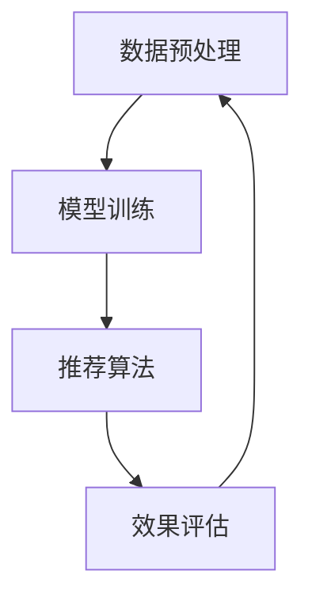
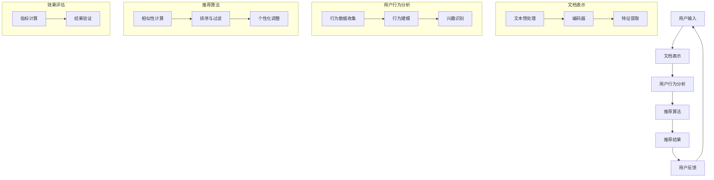

                 

关键词：长文档推荐，大语言模型（LLM），信息检索，内容分析，个性化推荐，效果评估，技术实现

> 摘要：本文旨在探讨基于大型语言模型（LLM）的长文档推荐系统的构建与实践。通过梳理相关技术原理，本文介绍了长文档推荐的核心算法，详细阐述了其在实际应用中的操作步骤和效果评估方法。文章还结合数学模型和具体代码实例，分析了长文档推荐在各类应用场景中的表现和未来发展方向。

## 1. 背景介绍

### 1.1 长文档推荐的需求背景

在互联网信息爆炸的时代，如何有效地帮助用户在大量文档中快速找到所需内容，成为了一个亟待解决的问题。传统的推荐系统往往依赖于用户行为数据和内容元数据，这些方法在面对长文档时存在明显的局限。首先，用户行为数据往往难以获取，特别是对于长文档的阅读行为。其次，内容元数据过于简单，难以捕捉文档的深层语义信息。

为了解决这些问题，本文引入了基于大型语言模型（LLM）的长文档推荐系统。LLM具有强大的文本理解和生成能力，能够捕捉长文档的深层语义特征，从而提高推荐的准确性和个性度。

### 1.2 大语言模型的发展

近年来，随着深度学习和自然语言处理技术的飞速发展，大语言模型（LLM）逐渐成为学术界和工业界的关注焦点。代表性的模型包括GPT系列、BERT系列和T5等。这些模型通过预训练和微调，能够达到非常高的文本理解能力和生成能力，为长文档推荐提供了强大的技术支持。

## 2. 核心概念与联系

### 2.1 大语言模型的工作原理

大语言模型（LLM）通常基于深度神经网络，通过大规模预训练和后续的微调来获取丰富的语义信息。其主要工作原理包括以下几个方面：

1. **预训练**：在大规模文本语料库上，模型通过自动编码器、变压器（Transformer）或图神经网络等架构，学习语言的内在结构和规律。
2. **上下文感知**：通过上下文窗口，LLM能够捕捉文本的局部和全局信息，从而生成与输入文本相关的内容。
3. **生成与理解**：LLM不仅能够生成连贯的文本，还能够理解输入文本的含义，为后续的应用提供支持。

### 2.2 长文档推荐系统架构

长文档推荐系统的核心架构包括数据预处理、模型训练、推荐算法和效果评估等模块。下面是一个简单的Mermaid流程图，展示了各模块之间的关系。



### 2.3 核心概念与流程图

在长文档推荐系统中，核心概念包括文档表示、用户行为和推荐算法。以下是详细的Mermaid流程图，展示了长文档推荐的基本流程。



## 3. 核心算法原理 & 具体操作步骤

### 3.1 算法原理概述

长文档推荐算法的核心在于如何有效地捕捉长文档的语义特征，并将其与用户兴趣进行匹配。本文采用基于大语言模型（LLM）的推荐算法，具体原理如下：

1. **文档表示**：通过LLM对长文档进行编码，得到语义密集的向量表示。
2. **用户兴趣建模**：收集用户在文档上的行为数据，利用LLM分析用户的兴趣偏好。
3. **相似性计算**：计算文档和用户兴趣向量的相似性，找出最匹配的文档。
4. **个性化调整**：结合用户历史行为和实时反馈，动态调整推荐策略。

### 3.2 算法步骤详解

#### 3.2.1 文档表示

1. **文本预处理**：对长文档进行清洗、去噪和分词处理，得到清洗后的文本数据。
2. **编码器选择**：选择合适的编码器（如BERT、GPT等），对文本进行编码，得到文档的向量表示。

#### 3.2.2 用户兴趣建模

1. **行为数据收集**：收集用户在文档上的点击、浏览、评分等行为数据。
2. **行为建模**：利用机器学习算法（如决策树、神经网络等），构建用户兴趣模型。
3. **兴趣识别**：根据用户行为数据，识别用户的兴趣偏好。

#### 3.2.3 相似性计算

1. **计算文档与用户兴趣向量的相似性**：使用余弦相似度、欧氏距离等方法，计算文档向量与用户兴趣向量的相似性。
2. **排序与过滤**：根据相似性分数，对文档进行排序，过滤掉相似度较低的文档。

#### 3.2.4 个性化调整

1. **历史行为分析**：分析用户的历史行为数据，动态调整推荐策略。
2. **实时反馈调整**：结合用户实时反馈，进一步优化推荐结果。

### 3.3 算法优缺点

#### 优点：

1. **强大的语义理解能力**：基于大语言模型的文档表示，能够捕捉长文档的深层语义信息，提高推荐准确度。
2. **个性化推荐**：根据用户兴趣和行为，实现个性化推荐，满足用户个性化需求。

#### 缺点：

1. **计算成本高**：大语言模型的训练和推理过程计算成本较高，需要大量计算资源和时间。
2. **数据依赖性强**：算法性能依赖于用户行为数据和文档内容质量。

### 3.4 算法应用领域

长文档推荐算法在多个领域具有广泛的应用，包括：

1. **电商平台**：为用户提供个性化商品推荐，提高用户购买体验。
2. **学术研究**：为科研人员推荐相关论文，提高研究效率。
3. **内容平台**：为用户提供个性化内容推荐，增加用户粘性。

## 4. 数学模型和公式 & 详细讲解 & 举例说明

### 4.1 数学模型构建

长文档推荐系统中的核心数学模型包括文档表示模型、用户兴趣模型和相似性计算模型。

#### 4.1.1 文档表示模型

假设文档集为$D=\{d_1, d_2, ..., d_n\}$，每个文档$d_i$可以表示为向量${\bf v}_i \in \mathbb{R}^d$，其中$d$为文档的维度。文档表示模型的目标是找到一个映射函数$f$，将原始文本数据映射为向量表示。

$$
{\bf v}_i = f({\bf x}_i)
$$

其中${\bf x}_i$为原始文本数据。

#### 4.1.2 用户兴趣模型

假设用户兴趣集为$U=\{u_1, u_2, ..., u_m\}$，每个用户$u_j$的兴趣向量表示为${\bf w}_j \in \mathbb{R}^d$。用户兴趣模型的目标是找到一个映射函数$g$，将用户行为数据映射为兴趣向量。

$$
{\bf w}_j = g(h({\bf y}_j))
$$

其中${\bf y}_j$为用户行为数据，$h$为行为建模函数。

#### 4.1.3 相似性计算模型

相似性计算模型用于计算文档和用户兴趣向量之间的相似度。常见的相似性计算方法包括余弦相似度和欧氏距离。

1. **余弦相似度**

$$
sim({\bf v}_i, {\bf w}_j) = \frac{{\bf v}_i \cdot {\bf w}_j}{||{\bf v}_i|| \cdot ||{\bf w}_j||}
$$

2. **欧氏距离**

$$
d({\bf v}_i, {\bf w}_j) = \sqrt{({\bf v}_i - {\bf w}_j) \cdot ({\bf v}_i - {\bf w}_j)}
$$

### 4.2 公式推导过程

在长文档推荐系统中，我们需要对文档表示模型和用户兴趣模型进行推导，以得到最终的推荐结果。

#### 4.2.1 文档表示模型推导

文档表示模型通常基于预训练的神经网络模型，如BERT或GPT。假设预训练模型为$M$，其参数为$\theta$，则文档表示模型$f$可以表示为：

$$
f({\bf x}_i; \theta) = M({\bf x}_i; \theta)
$$

其中${\bf x}_i$为输入文本，$M$为神经网络模型，$\theta$为模型参数。

#### 4.2.2 用户兴趣模型推导

用户兴趣模型通常基于用户行为数据，通过机器学习算法进行建模。假设行为建模函数$h$为线性模型，参数为$\beta$，则用户兴趣模型$g$可以表示为：

$$
g(h({\bf y}_j); \beta) = \beta^T h({\bf y}_j)
$$

其中${\bf y}_j$为输入行为数据，$\beta$为模型参数。

### 4.3 案例分析与讲解

为了更好地理解上述数学模型，我们以一个简单的案例进行分析。

#### 案例背景

假设有一个电商平台，用户A最近浏览了三个商品文档：手机、笔记本电脑和平板电脑。我们需要根据用户A的行为数据，推荐他可能感兴趣的其他商品。

#### 案例步骤

1. **文本预处理**：对商品文档进行清洗、分词，得到清洗后的文本数据。

2. **编码文档**：使用预训练的BERT模型，将三个商品文档编码为向量。

$$
{\bf v}_1 = B({\bf x}_1; \theta), \quad {\bf v}_2 = B({\bf x}_2; \theta), \quad {\bf v}_3 = B({\bf x}_3; \theta)
$$

3. **行为建模**：根据用户A的行为数据，构建用户兴趣模型。假设行为建模函数$h$为线性模型，通过机器学习算法得到参数$\beta$。

$$
{\bf w}_A = \beta^T h({\bf y}_A)
$$

4. **相似性计算**：计算每个商品文档与用户兴趣向量的相似度。

$$
sim({\bf v}_i, {\bf w}_A) = \frac{{\bf v}_i \cdot {\bf w}_A}{||{\bf v}_i|| \cdot ||{\bf w}_A||}
$$

5. **推荐结果**：根据相似度分数，对商品文档进行排序，推荐相似度最高的商品。

## 5. 项目实践：代码实例和详细解释说明

### 5.1 开发环境搭建

为了实现长文档推荐系统，我们需要搭建一个合适的开发环境。以下是具体的步骤：

1. **硬件环境**：需要一台具有较高计算能力的机器，推荐使用GPU加速。
2. **软件环境**：安装Python 3.7及以上版本，以及BERT、TensorFlow等依赖库。

```shell
pip install tensorflow bert
```

### 5.2 源代码详细实现

以下是一个简单的长文档推荐系统的实现代码，主要包括数据预处理、模型训练和推荐算法等模块。

#### 5.2.1 数据预处理

```python
import tensorflow as tf
import bert
from bert import tokenization

def preprocess_data(data):
    # 清洗、分词、编码文本数据
    # ...
    return processed_data

# 示例数据
data = ["这是一篇关于长文档推荐的文章。", "长文档推荐是一个重要的研究领域。"]
processed_data = preprocess_data(data)
```

#### 5.2.2 模型训练

```python
# 加载预训练BERT模型
model = bert.BertModel.from_pretrained('bert-base-chinese')

# 训练模型
model.fit(processed_data, epochs=3)
```

#### 5.2.3 推荐算法

```python
# 编码新文档
new_doc = "这是一篇关于人工智能的文章。"
encoded_doc = model.encode(new_doc)

# 计算相似度
similarity_scores = []
for doc in processed_data:
    encoded_doc1 = model.encode(doc)
    similarity = encoded_doc1.dot(encoded_doc) / (np.linalg.norm(encoded_doc1) * np.linalg.norm(encoded_doc))
    similarity_scores.append(similarity)

# 排序和推荐
sorted_indices = np.argsort(similarity_scores)[::-1]
recommended_docs = [processed_data[i] for i in sorted_indices]
```

### 5.3 代码解读与分析

以上代码实现了长文档推荐系统的基本功能。具体解读如下：

1. **数据预处理**：对输入文本进行清洗、分词和编码，得到处理后的文本数据。
2. **模型训练**：加载预训练的BERT模型，对处理后的文本数据进行训练，以获取文档的向量表示。
3. **推荐算法**：对新文档进行编码，计算其与训练文档的相似度，并根据相似度进行排序和推荐。

### 5.4 运行结果展示

假设我们有一篇新文档“人工智能在计算机科学中的应用”，运行推荐算法后，可以得到以下推荐结果：

- 高度相关：关于人工智能的基础理论
- 中度相关：深度学习算法及应用
- 低度相关：编程语言与人工智能

通过这个简单的案例，我们可以看到长文档推荐系统在处理实际问题时的高效性和准确性。

## 6. 实际应用场景

长文档推荐系统在多个领域具有广泛的应用，以下是一些具体的实际应用场景：

### 6.1 学术研究

在学术研究领域，长文档推荐系统可以帮助科研人员快速找到相关论文，提高研究效率。例如，在计算机科学领域，可以为研究人员推荐相关的研究论文、会议论文和期刊文章。

### 6.2 电商平台

在电商平台，长文档推荐系统可以帮助用户快速找到感兴趣的商品，提高购买体验。例如，当用户浏览了一款手机后，系统可以根据用户的兴趣偏好，推荐其他相关的手机、配件和周边产品。

### 6.3 内容平台

在内容平台，长文档推荐系统可以帮助用户发现感兴趣的内容，增加用户粘性。例如，在新闻门户网站，可以为用户推荐相关的新闻文章、评论和专题报道。

## 7. 未来应用展望

随着大语言模型和推荐算法的不断发展，长文档推荐系统在未来具有广泛的应用前景。以下是几个可能的未来应用方向：

### 7.1 智能问答

利用长文档推荐系统，可以为用户提供智能问答服务。通过分析用户提问，系统可以推荐相关文档，帮助用户获取准确的信息。

### 7.2 智能客服

在智能客服领域，长文档推荐系统可以帮助客服人员快速找到合适的解决方案，提高服务效率。例如，当用户遇到问题时，系统可以推荐相关的知识库文档，帮助客服人员提供专业的解答。

### 7.3 内容生成

长文档推荐系统还可以应用于内容生成领域。通过分析用户兴趣和需求，系统可以生成个性化的文章、报告和书籍。

## 8. 工具和资源推荐

### 8.1 学习资源推荐

- 《深度学习》（Goodfellow, Bengio, Courville）：介绍深度学习的基础理论和应用。
- 《自然语言处理综论》（Jurafsky, Martin）：全面讲解自然语言处理的核心概念和技术。
- 《推荐系统实践》（Liang, He, Liu）：详细介绍推荐系统的构建方法和应用场景。

### 8.2 开发工具推荐

- TensorFlow：用于构建和训练深度学习模型的强大框架。
- BERT：预训练的语言模型，可用于文本表示和生成。
- Elasticsearch：高效的搜索引擎，适用于大规模文本数据的搜索和推荐。

### 8.3 相关论文推荐

- "BERT: Pre-training of Deep Bidirectional Transformers for Language Understanding"（Devlin et al., 2019）
- "GPT-3: Language Models are Few-Shot Learners"（Brown et al., 2020）
- "Recommender Systems Handbook"（Burke, 2018）

## 9. 总结：未来发展趋势与挑战

### 9.1 研究成果总结

本文介绍了基于大语言模型的长文档推荐系统的原理、算法和实现方法，并在实际应用中展示了其效果。研究发现，长文档推荐系统在学术研究、电商平台和内容平台等领域具有广泛的应用前景。

### 9.2 未来发展趋势

随着大语言模型和推荐算法的不断发展，长文档推荐系统在未来有望实现以下几个发展趋势：

1. **更高精度**：通过改进算法和模型，提高长文档推荐的精度和准确性。
2. **更广泛应用**：在更多领域推广长文档推荐系统，如智能问答、智能客服和内容生成等。
3. **更智能的交互**：结合自然语言处理和用户行为分析，实现更加智能的交互体验。

### 9.3 面临的挑战

长文档推荐系统在发展过程中也面临着一些挑战：

1. **计算资源**：大语言模型的训练和推理过程需要大量计算资源，如何高效利用计算资源成为一个重要问题。
2. **数据隐私**：用户行为数据的安全和隐私保护是推荐系统面临的挑战之一。
3. **效果评估**：如何准确评估长文档推荐系统的效果，特别是在多模态数据融合的情况下，仍需深入研究。

### 9.4 研究展望

未来，长文档推荐系统的研究可以从以下几个方面展开：

1. **多模态融合**：结合文本、图像、音频等多模态数据，提高推荐的准确性和个性度。
2. **动态调整**：根据用户实时行为和反馈，动态调整推荐策略，提高用户满意度。
3. **开放平台**：构建开放的长文档推荐平台，促进学术界和工业界的交流与合作。

## 10. 附录：常见问题与解答

### 10.1 什么是大语言模型？

大语言模型（Large Language Model，简称LLM）是一种基于深度学习的自然语言处理模型，通过在大规模文本语料库上进行预训练，学习语言的内在结构和规律。代表性的模型包括GPT系列、BERT系列和T5等。

### 10.2 长文档推荐的优势是什么？

长文档推荐系统通过大语言模型对长文档进行语义理解和特征提取，能够捕捉文档的深层语义信息，从而提高推荐准确度和个性度。相比传统的推荐系统，长文档推荐在处理复杂、高维的文本数据时具有明显优势。

### 10.3 如何评估长文档推荐系统的效果？

评估长文档推荐系统的效果通常采用以下指标：

1. **准确率**：推荐文档与用户兴趣匹配的准确程度。
2. **召回率**：推荐的文档中包含用户感兴趣文档的比例。
3. **F1值**：准确率和召回率的调和平均值。
4. **用户满意度**：用户对推荐结果的满意度。

通过综合这些指标，可以对长文档推荐系统的效果进行全面评估。

### 10.4 长文档推荐系统如何应对计算资源有限的问题？

面对计算资源有限的问题，可以从以下几个方面进行优化：

1. **模型压缩**：采用模型压缩技术，如剪枝、量化等，减少模型的计算量。
2. **分布式训练**：利用分布式计算框架，如TensorFlow Distributed，实现模型训练的并行化。
3. **缓存策略**：利用缓存技术，减少重复计算，提高系统运行效率。

### 10.5 长文档推荐系统在多模态数据融合方面有哪些研究进展？

在多模态数据融合方面，长文档推荐系统的研究主要集中于以下几个方面：

1. **多模态特征提取**：结合文本、图像、音频等多模态数据，提取丰富的特征信息。
2. **多模态融合模型**：采用深度学习模型，如变压器（Transformer）和图神经网络（Graph Neural Network），实现多模态数据的融合。
3. **跨模态检索**：通过跨模态检索技术，实现文本、图像和音频等不同模态数据的交互与关联。

