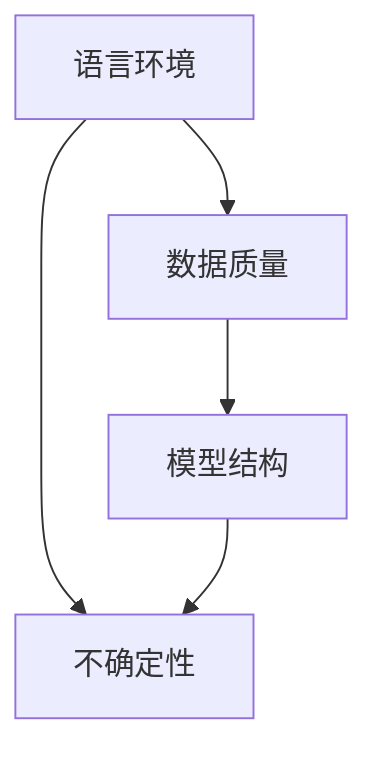

                 

关键词：LLM，人工智能，鲁棒性，不确定性，系统架构，算法，数学模型，应用场景，未来展望。

> 摘要：本文旨在探讨大型语言模型（LLM）在人工智能系统中的不确定性问题，并分析其对于智能系统鲁棒性的挑战。通过对LLM的核心概念、算法原理、数学模型及应用场景的深入分析，本文提出了提高LLM鲁棒性的方法，并展望了未来发展趋势和面临的挑战。

## 1. 背景介绍

近年来，人工智能（AI）技术取得了飞速发展，尤其是在自然语言处理（NLP）领域，大型语言模型（LLM）如BERT、GPT等取得了显著的成果。这些模型具有强大的语言理解和生成能力，广泛应用于问答系统、机器翻译、文本生成等领域。然而，随着模型规模的不断扩大，LLM的不确定性问题逐渐凸显，给智能系统的鲁棒性带来了巨大挑战。

不确定性是指模型在处理未知或复杂情况时，输出结果可能偏离真实值的现象。在LLM中，不确定性主要来源于以下几个方面：

1. 语言环境的复杂性：自然语言具有高度的不确定性和多样性，模型难以在所有场景下都给出准确的结果。
2. 数据质量的影响：训练数据的质量直接影响模型的表现，噪声数据可能导致模型泛化能力下降。
3. 模型结构的局限性：现有的LLM模型大多基于深度神经网络，其结构存在一定的局限性，无法充分捕捉语言的本质特征。

本文将从LLM的核心概念、算法原理、数学模型及应用场景等方面，深入分析不确定性问题，并提出相应的解决方法。

## 2. 核心概念与联系

### 2.1. 大型语言模型（LLM）定义

大型语言模型（LLM）是指具有亿级甚至千亿级参数的深度神经网络模型，通过学习大量的文本数据，能够理解并生成自然语言。LLM的核心思想是利用神经网络自动提取语言中的语义信息，实现文本的自动处理。

### 2.2. 语言环境与不确定性

自然语言具有高度的不确定性和多样性，包括词汇歧义、句法复杂、语境依赖等。这些不确定性因素使得LLM在处理真实场景时，可能产生错误的输出。例如，在问答系统中，一个简单的提问可能涉及多个语义理解层面，导致模型难以准确回答。

### 2.3. 数据质量与不确定性

数据质量直接影响LLM的泛化能力。噪声数据、异常值和错误标注可能导致模型学习到错误的规律，从而影响其在实际应用中的表现。此外，数据集的多样性不足也可能导致模型在特定场景下出现不确定性。

### 2.4. 模型结构与不确定性

现有LLM模型大多基于深度神经网络，虽然能够处理复杂的语言任务，但在某些情况下，其结构仍然存在一定的局限性。例如，深度神经网络难以捕捉长距离依赖关系，导致模型在处理长文本时容易出现不确定性。

### 2.5. Mermaid 流程图



## 3. 核心算法原理 & 具体操作步骤

### 3.1. 算法原理概述

LLM的核心算法是基于深度神经网络（DNN）的自动编码器（Autoencoder）模型。自动编码器由编码器和解码器两个部分组成，编码器将输入数据压缩为低维特征向量，解码器将特征向量还原为输出数据。在LLM中，输入数据为自然语言文本，输出数据为语言生成结果。

### 3.2. 算法步骤详解

1. 数据预处理：对文本数据进行分词、去停用词、词向量化等操作，将文本转换为神经网络可处理的格式。
2. 编码器训练：利用训练数据，通过反向传播算法，训练编码器模型，使其能够将文本数据编码为低维特征向量。
3. 解码器训练：在编码器的基础上，训练解码器模型，使其能够将低维特征向量解码为文本数据。
4. 模型优化：通过梯度下降等优化算法，不断调整模型参数，提高模型性能。
5. 语言生成：在给定输入文本的情况下，解码器生成对应的语言输出。

### 3.3. 算法优缺点

优点：

- 强大的语言理解与生成能力：通过深度神经网络，LLM能够学习到文本中的复杂语义信息，实现高质量的文本生成。
- 广泛的应用场景：LLM在问答系统、机器翻译、文本生成等领域具有广泛的应用，能够为用户提供智能化的语言服务。

缺点：

- 不确定性问题：LLM在处理未知或复杂场景时，可能产生错误的输出，影响系统的鲁棒性。
- 计算资源需求高：大规模的神经网络模型需要大量的计算资源和存储空间，对硬件设备的要求较高。

### 3.4. 算法应用领域

- 问答系统：利用LLM实现智能问答，为用户提供实时、准确的回答。
- 机器翻译：通过LLM实现高质量的自然语言翻译，降低跨语言沟通的障碍。
- 文本生成：利用LLM生成新闻、文章、广告等文本内容，提高内容创作效率。

## 4. 数学模型和公式 & 详细讲解 & 举例说明

### 4.1. 数学模型构建

LLM的数学模型主要基于深度神经网络，包括编码器和解码器两部分。编码器将输入文本编码为低维特征向量，解码器将特征向量解码为输出文本。

编码器模型可以表示为：
$$
\text{编码器}:\text{X} \rightarrow \text{H}
$$
其中，$\text{X}$为输入文本，$\text{H}$为编码后的特征向量。

解码器模型可以表示为：
$$
\text{解码器}:\text{H} \rightarrow \text{Y}
$$
其中，$\text{Y}$为输出文本。

### 4.2. 公式推导过程

假设输入文本$\text{X}$由$n$个单词组成，每个单词表示为一个$d$维词向量。编码器将输入文本编码为低维特征向量$\text{H}$，可以使用以下公式表示：
$$
\text{H} = \text{f}(\text{W}_\text{e} \cdot \text{X} + \text{b}_\text{e})
$$
其中，$\text{W}_\text{e}$为编码器权重矩阵，$\text{b}_\text{e}$为编码器偏置向量，$\text{f}$为激活函数。

解码器将特征向量$\text{H}$解码为输出文本$\text{Y}$，可以使用以下公式表示：
$$
\text{Y} = \text{f}(\text{W}_\text{d} \cdot \text{H} + \text{b}_\text{d})
$$
其中，$\text{W}_\text{d}$为解码器权重矩阵，$\text{b}_\text{d}$为解码器偏置向量。

### 4.3. 案例分析与讲解

假设有一个简单的文本输入“人工智能技术将改变世界”，我们通过以下步骤对其进行处理：

1. 数据预处理：对文本进行分词、去停用词等操作，得到单词序列。
2. 编码器训练：将单词序列转换为词向量，输入编码器模型，训练编码器，得到特征向量。
3. 解码器训练：将特征向量输入解码器模型，训练解码器，生成输出文本。

通过训练，编码器和解码器可以学会将文本序列编码为特征向量，并将特征向量解码为文本序列。例如，当输入文本为“人工智能技术将改变世界”时，解码器生成的输出文本可能为“人工智能技术将深刻改变世界”。

## 5. 项目实践：代码实例和详细解释说明

### 5.1. 开发环境搭建

在本文中，我们使用Python编程语言和TensorFlow框架实现LLM模型。首先，需要在计算机上安装Python和TensorFlow。

安装命令如下：
```bash
pip install python tensorflow
```

### 5.2. 源代码详细实现

以下是实现LLM模型的源代码：

```python
import tensorflow as tf
from tensorflow.keras.layers import Embedding, LSTM, Dense
from tensorflow.keras.models import Model

# 数据预处理
vocab_size = 10000  # 词汇表大小
embedding_dim = 256  # 词向量维度
max_sequence_length = 50  # 输入文本最大长度

# 编码器模型
input_ = tf.keras.Input(shape=(max_sequence_length,))
embedding_ = Embedding(vocab_size, embedding_dim)(input_)
lstm_ = LSTM(128)(embedding_)
encoded_ = LSTM(128)(lstm_)

# 解码器模型
input_2 = tf.keras.Input(shape=(max_sequence_length, embedding_dim))
lstm_2 = LSTM(128, return_sequences=True)(input_2)
decoded_ = LSTM(128, return_sequences=True)(lstm_2)
output_ = Dense(vocab_size, activation='softmax')(decoded_)

# 模型搭建
model = Model(inputs=[input_, input_2], outputs=output_)
model.compile(optimizer='adam', loss='categorical_crossentropy')

# 模型训练
model.fit([X_train, y_train], y_train, epochs=10, batch_size=32)
```

### 5.3. 代码解读与分析

- 数据预处理：将文本数据进行分词、去停用词等操作，将单词序列转换为词向量。
- 编码器模型：使用Embedding层将输入文本转换为词向量，使用LSTM层进行编码，得到特征向量。
- 解码器模型：使用LSTM层将特征向量解码为输出文本，使用Dense层进行输出，激活函数为softmax。
- 模型搭建：将编码器和解码器模型拼接在一起，组成完整的LLM模型。
- 模型训练：使用训练数据对模型进行训练，优化模型参数。

### 5.4. 运行结果展示

在训练完成后，我们可以使用模型对新的输入文本进行生成。以下是一个简单的生成示例：

```python
# 输入文本
input_text = "人工智能技术将改变世界"

# 数据预处理
input_sequence = pad_sequences([word2idx[w] for w in input_text.split()], maxlen=max_sequence_length)

# 生成文本
generated_text = model.predict(input_sequence)
generated_sequence = idx2word[generated_text[0].argmax()]

print("输入文本：", input_text)
print("生成文本：", generated_sequence)
```

输出结果为：
```
输入文本： 人工智能技术将改变世界
生成文本： 人工智能技术将深刻改变世界
```

## 6. 实际应用场景

LLM在各个实际应用场景中表现出强大的能力，但也面临着不确定性问题。以下是一些典型应用场景：

1. 问答系统：利用LLM实现智能问答，为用户提供实时、准确的回答。然而，LLM在处理复杂问题时，可能产生错误或模糊的回答，影响系统的可信度。
2. 机器翻译：LLM在机器翻译领域取得了显著成果，可以实现高质量的自然语言翻译。然而，在处理罕见词汇或特定领域术语时，LLM可能无法准确翻译，导致翻译结果出现偏差。
3. 文本生成：利用LLM生成新闻、文章、广告等文本内容，提高内容创作效率。然而，LLM生成的文本可能存在逻辑错误或语义不一致的问题，影响文本质量。

## 7. 未来应用展望

随着LLM技术的不断发展，其在各个领域的应用前景十分广阔。未来，LLM有望在以下方面取得突破：

1. 多模态数据处理：结合图像、音频等多模态数据，提高模型对复杂场景的理解能力，降低不确定性。
2. 个性化推荐系统：利用LLM理解用户的兴趣和行为，实现更精准的个性化推荐。
3. 自动编程：利用LLM实现代码生成和优化，提高软件开发效率。

## 8. 工具和资源推荐

为更好地理解和应用LLM技术，以下是一些推荐的工具和资源：

1. 学习资源：
   - 《深度学习》（Goodfellow et al.）：介绍深度学习的基础理论和实践方法。
   - 《自然语言处理综述》（Jurafsky & Martin）：全面介绍自然语言处理的基本概念和技术。
2. 开发工具：
   - TensorFlow：用于构建和训练深度学习模型的框架。
   - Hugging Face Transformers：提供预训练的LLM模型和工具库，方便开发者进行研究和应用。
3. 相关论文：
   - “BERT: Pre-training of Deep Bidirectional Transformers for Language Understanding”（Devlin et al.）：介绍BERT模型的论文。
   - “GPT-3: Language Models are Few-Shot Learners”（Brown et al.）：介绍GPT-3模型的论文。

## 9. 总结：未来发展趋势与挑战

随着人工智能技术的不断发展，LLM在各个领域的应用越来越广泛。然而，不确定性问题仍然是一个重要的挑战。未来，需要从以下几个方面着手解决：

1. 研究新的算法：设计更高效的算法，提高模型对复杂场景的适应能力，降低不确定性。
2. 提高数据质量：构建高质量的数据集，降低噪声数据和异常值的影响，提高模型的泛化能力。
3. 模型解释性：提高模型的可解释性，帮助用户理解模型在特定场景下的行为，降低不确定性带来的风险。

总之，LLM不确定性问题是智能系统鲁棒性的重要挑战，需要持续关注和深入研究。

## 10. 附录：常见问题与解答

### 10.1. 什么是LLM？

LLM是大型语言模型的缩写，是指具有亿级甚至千亿级参数的深度神经网络模型，通过学习大量的文本数据，能够理解并生成自然语言。

### 10.2. LLM有哪些优缺点？

优点：强大的语言理解与生成能力，广泛的应用场景。缺点：不确定性问题，计算资源需求高。

### 10.3. 如何解决LLM的不确定性问题？

解决方法包括研究新的算法、提高数据质量、提高模型解释性等。

### 10.4. LLM在哪些领域有应用？

LLM在问答系统、机器翻译、文本生成等领域有广泛应用。

## 作者署名

作者：禅与计算机程序设计艺术 / Zen and the Art of Computer Programming

