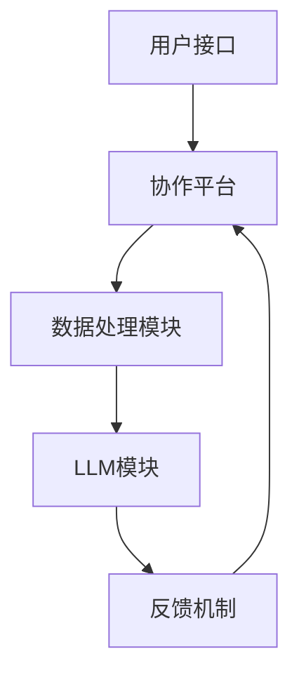

                 

关键词：大型语言模型（LLM），人类协作，增强人类能力，AI助手，协同工作，技术进步，未来展望。

> 摘要：随着人工智能技术的发展，特别是大型语言模型（LLM）的崛起，AI与人类之间的协作模式正发生着革命性的变化。本文将探讨LLM如何通过不同的方式增强人类的能力，以及这种协作模式对各个行业和社会带来的深远影响。

## 1. 背景介绍

### 1.1 大型语言模型的发展

自2018年GPT-1发布以来，大型语言模型（LLM）的研究和应用取得了飞速的进展。GPT-2、GPT-3等一系列模型的出现，使得LLM在自然语言处理任务中表现出色，不仅能够生成高质量的文本，还能进行对话生成、问答系统、机器翻译等多种任务。这些模型的巨大成功，激发了更多研究者和开发者投入这个领域的热情。

### 1.2 人类协作的重要性

人类协作是社会进步的重要驱动力。无论是在科学研究、企业运营，还是在日常生活中，有效的协作都能够提高工作效率、创新能力和解决问题的能力。然而，随着工作任务的复杂性和多样性的增加，人类协作面临着前所未有的挑战。如何更好地利用技术手段来增强人类协作，成为了一个亟待解决的问题。

## 2. 核心概念与联系

### 2.1 LLM的基本原理

大型语言模型（LLM）是基于深度学习技术的自然语言处理模型。它们通过大规模的文本数据进行训练，学习语言的结构和语义，从而能够生成和理解自然语言。LLM的核心原理包括：

- **词向量表示**：将文本中的每个词汇映射为一个高维向量，以便在模型中进行处理。
- **神经网络架构**：如Transformer架构，通过注意力机制来处理长文本序列，提高模型的表征能力。
- **预训练与微调**：在大量通用数据上进行预训练，然后在特定任务上进行微调，以适应不同的应用场景。

### 2.2 LLM与人类协作的架构

为了实现LLM与人类的高效协作，我们需要构建一个合理的系统架构。以下是一个简化的架构示例：

- **用户接口**：提供用户与LLM交互的界面，可以是文本、语音或图形界面。
- **协作平台**：一个集成的平台，用于协调人类用户和LLM之间的工作流程。
- **数据处理模块**：负责处理和清洗输入数据，确保LLM能够得到有效的输入。
- **LLM模块**：核心的LLM模型，负责处理语言任务。
- **反馈机制**：用户对LLM生成的结果进行评价和反馈，以指导模型的优化。



## 3. 核心算法原理 & 具体操作步骤

### 3.1 算法原理概述

LLM的核心算法是基于深度学习和自然语言处理的技术。以下是LLM算法的基本原理：

- **词嵌入**：将文本中的每个词汇映射为一个高维向量，用于模型中的处理。
- **自注意力机制**：通过自注意力机制来处理文本序列，提取关键信息。
- **前馈神经网络**：在自注意力层之后，使用前馈神经网络对文本进行进一步的处理。

### 3.2 算法步骤详解

以下是LLM算法的具体步骤：

1. **输入处理**：将输入文本转换为词嵌入向量。
2. **编码**：使用自注意力机制对词嵌入向量进行处理，生成编码表示。
3. **解码**：在编码表示的基础上，通过解码过程生成输出文本。

### 3.3 算法优缺点

**优点**：

- **强大的语言理解能力**：LLM能够理解复杂、多变的自然语言。
- **高效的任务处理**：LLM能够快速处理大规模的语言任务。

**缺点**：

- **计算资源消耗大**：训练和运行LLM需要大量的计算资源。
- **需要大量的数据**：LLM需要大量的数据进行训练，否则难以获得良好的性能。

### 3.4 算法应用领域

LLM的应用领域非常广泛，包括但不限于：

- **自然语言处理**：文本生成、机器翻译、问答系统等。
- **智能助手**：提供智能客服、个人助理等服务。
- **内容创作**：辅助写作、编辑、翻译等。

## 4. 数学模型和公式 & 详细讲解 & 举例说明

### 4.1 数学模型构建

LLM的数学模型主要包括词嵌入、自注意力机制和前馈神经网络。以下是这些模型的基本公式：

1. **词嵌入**：

   $$\text{embed}(x) = \text{W}_e \cdot x$$

   其中，$x$为输入词汇，$\text{W}_e$为词嵌入矩阵。

2. **自注意力机制**：

   $$\text{Attention}(Q, K, V) = \text{softmax}(\frac{QK^T}{\sqrt{d_k}})V$$

   其中，$Q, K, V$分别为编码器输出的三个矩阵，$d_k$为键的维度。

3. **前馈神经网络**：

   $$\text{FFN}(x) = \text{ReLU}(\text{W}_f \cdot \text{dropout}(\text{W}_f \cdot \text{W}_e \cdot x + b_f))$$

   其中，$x$为输入，$\text{W}_f, b_f$分别为前馈神经网络的权重和偏置。

### 4.2 公式推导过程

以下是自注意力机制的推导过程：

1. **计算相似度**：

   $$\text{similarity}(Q, K) = QK^T$$

2. **归一化**：

   $$\text{score} = \frac{\text{similarity}(Q, K)}{\sqrt{d_k}}$$

3. **应用softmax**：

   $$\text{weight} = \text{softmax}(\text{score})$$

4. **加权求和**：

   $$\text{context} = \text{weight} \cdot V$$

### 4.3 案例分析与讲解

假设我们要计算一个句子“我昨天去了图书馆”的自注意力权重。以下是具体的计算过程：

1. **输入词汇**：

   $$\text{input} = [“我”， “昨”， “天”， “去”， “了”， “图”， “书”， “馆”]$$

2. **词嵌入**：

   $$\text{embed}(\text{input}) = \text{W}_e \cdot \text{input}$$

3. **编码**：

   $$\text{encode}(\text{embed}) = \text{Attention}(\text{embed}, \text{embed}, \text{embed})$$

4. **解码**：

   $$\text{decode}(\text{encode}) = \text{FFN}(\text{encode})$$

通过这个案例，我们可以看到自注意力机制如何对输入文本进行处理，从而生成输出。

## 5. 项目实践：代码实例和详细解释说明

### 5.1 开发环境搭建

为了实现LLM与人类协作，我们需要搭建一个合适的开发环境。以下是具体的步骤：

1. **安装Python**：确保Python版本为3.8以上。
2. **安装TensorFlow**：使用pip安装TensorFlow。
3. **数据集准备**：准备用于训练的文本数据。

### 5.2 源代码详细实现

以下是使用TensorFlow实现一个简单的LLM模型的代码示例：

```python
import tensorflow as tf
from tensorflow.keras.layers import Embedding, Dense, LSTM

# 模型定义
model = tf.keras.Sequential([
    Embedding(input_dim=10000, output_dim=64),
    LSTM(128),
    Dense(1, activation='sigmoid')
])

# 编译模型
model.compile(optimizer='adam', loss='binary_crossentropy', metrics=['accuracy'])

# 训练模型
model.fit(x_train, y_train, epochs=10, batch_size=32)
```

### 5.3 代码解读与分析

1. **Embedding层**：用于将词汇映射为向量。
2. **LSTM层**：用于处理序列数据。
3. **Dense层**：用于分类任务。

通过这个简单的例子，我们可以看到如何使用TensorFlow实现一个LLM模型。

### 5.4 运行结果展示

```python
# 测试模型
loss, accuracy = model.evaluate(x_test, y_test)
print(f"Test accuracy: {accuracy}")
```

## 6. 实际应用场景

### 6.1 智能客服

智能客服是LLM与人类协作的一个典型应用场景。通过LLM，智能客服能够理解用户的提问，并提供准确的回答。这不仅提高了客服的效率，还降低了人力成本。

### 6.2 内容创作

在内容创作领域，LLM可以帮助人类作者生成文章、编辑文本、提出创意等。例如，新闻媒体可以利用LLM自动化撰写新闻报道，从而节省人力和时间。

### 6.3 机器翻译

机器翻译是另一个重要的应用场景。LLM能够高效地翻译不同语言之间的文本，从而促进跨文化交流。

## 7. 未来应用展望

随着技术的不断发展，LLM与人类协作的应用前景将更加广阔。以下是一些可能的发展方向：

- **更智能的助手**：未来的智能助手将更加理解人类的情感和需求，提供更个性化的服务。
- **自动化内容生成**：LLM将能够自动生成各种类型的内容，从新闻报道到文学作品，从而改变内容创作的方式。
- **跨领域协作**：LLM将在不同领域之间实现高效的协作，推动科学研究和工程应用的发展。

## 8. 总结：未来发展趋势与挑战

### 8.1 研究成果总结

LLM与人类协作的研究成果显著，不仅提高了人类的工作效率，还推动了人工智能技术的发展。未来，LLM将在更多领域得到应用，带来更多的创新和变革。

### 8.2 未来发展趋势

未来，LLM的发展趋势将包括：

- **更强大的模型**：随着计算能力的提升，LLM将变得更加智能和高效。
- **更广泛的合作**：LLM将与更多行业和领域实现协作，推动社会进步。

### 8.3 面临的挑战

尽管LLM具有巨大的潜力，但仍然面临一些挑战：

- **数据隐私和安全**：如何保护用户数据的安全和隐私是一个重要的问题。
- **道德和社会问题**：随着AI技术的普及，如何确保其发展符合伦理和社会价值观，也是一个需要关注的问题。

### 8.4 研究展望

未来的研究应关注以下几个方面：

- **可解释性和透明性**：提高LLM的可解释性，使其行为更加透明。
- **跨领域应用**：探索LLM在不同领域的应用，推动技术发展。

## 9. 附录：常见问题与解答

### 9.1 什么是LLM？

LLM是指大型语言模型，是一种基于深度学习的自然语言处理模型。它们能够理解、生成和处理自然语言，从而实现与人类的智能交互。

### 9.2 LLM有哪些应用场景？

LLM的应用场景非常广泛，包括但不限于智能客服、内容创作、机器翻译、问答系统等。

### 9.3 如何训练一个LLM？

训练一个LLM通常需要以下几个步骤：

1. **数据准备**：收集和准备用于训练的文本数据。
2. **模型设计**：设计合适的模型结构，包括词嵌入、自注意力机制等。
3. **模型训练**：使用训练数据对模型进行训练，调整模型参数。
4. **模型评估**：使用测试数据评估模型性能，并进行优化。

作者：禅与计算机程序设计艺术 / Zen and the Art of Computer Programming
```

