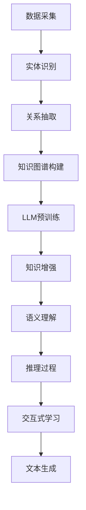

                 

关键词：LLM，知识图谱，知识表示，预训练模型，推理引擎，计算机科学，人工智能，算法，数学模型，代码实例，应用场景，未来展望。

## 摘要

随着人工智能技术的快速发展，自然语言处理（NLP）和知识图谱技术已成为现代计算领域的重要研究方向。本文探讨了将大规模语言模型（LLM）与传统知识图谱技术相结合的新方式，旨在为知识表示和推理提供更为灵活和高效的解决方案。本文首先介绍了LLM和知识图谱的基本概念及其在各自领域的应用，随后分析了二者结合的动机和优势。接着，本文详细阐述了LLM与传统知识图谱技术结合的方法和步骤，包括数据预处理、知识图谱构建、模型训练和推理过程。随后，本文通过一个实际项目案例，展示了如何利用LLM和知识图谱技术实现复杂任务的自动化和智能化。最后，本文探讨了这一结合方式在未来的发展前景，并提出了相关的研究挑战和解决方案。

## 1. 背景介绍

### 大规模语言模型（LLM）

大规模语言模型（LLM）是基于深度学习和统计方法构建的复杂神经网络模型，能够在给定输入序列的情况下预测下一个可能的输出序列。LLM的核心是通过大规模文本数据进行预训练，从而学习到语言的基本结构和规律。近年来，随着计算能力的提升和海量数据资源的积累，LLM取得了显著的进展，代表性的模型包括谷歌的BERT、OpenAI的GPT系列等。这些模型在自然语言理解、文本生成、问答系统、机器翻译等领域表现出色，极大地推动了NLP技术的发展。

### 知识图谱技术

知识图谱技术是一种用于表示实体、概念及其相互关系的数据结构，它将信息以图形的形式组织起来，使得计算机能够更好地理解和处理知识。知识图谱技术在信息检索、推荐系统、语义搜索、智能问答等领域具有广泛的应用。传统的知识图谱构建方法通常包括数据采集、实体识别、关系抽取、图谱构建和推理等步骤，这些方法依赖于手工标注和规则定义，存在一定的人工干预和局限性。

### 结合的动机和优势

尽管LLM和知识图谱技术各自具有显著的优势，但它们也存在一些局限性。LLM擅长处理自然语言，但在知识表示和推理方面存在一定局限性；而知识图谱技术在知识表示和推理方面具有优势，但在语言理解和生成方面表现一般。因此，将LLM与传统知识图谱技术相结合，旨在充分发挥二者的优势，实现知识表示和推理的有机结合。

结合的动机主要包括以下几点：

1. **提高知识表示的灵活性**：LLM能够通过预训练学习到丰富的语言规律和结构，有助于构建更加灵活和细粒度的知识表示。相比之下，传统知识图谱技术通常采用粗粒度的实体和关系表示，难以适应复杂的语言现象。

2. **增强知识推理能力**：LLM具备强大的语言理解能力，可以用于辅助知识图谱的推理过程。通过结合LLM的推理能力，知识图谱可以实现更复杂和灵活的推理。

3. **实现自然语言交互**：结合LLM和知识图谱技术，可以构建智能问答系统和对话代理，实现与用户的自然语言交互。

4. **提升知识获取效率**：通过利用LLM对大规模文本数据的学习能力，可以更加高效地构建和维护知识图谱，减少人工干预。

### 当前应用领域

当前，LLM与传统知识图谱技术的结合在多个领域取得了显著的成果，主要包括：

1. **智能问答系统**：通过结合LLM和知识图谱技术，可以实现针对用户查询的智能回答，提供更加准确和丰富的答案。

2. **推荐系统**：利用知识图谱可以构建更加精准的用户兴趣模型，结合LLM的文本生成能力，可以生成个性化的推荐内容。

3. **信息检索**：结合LLM和知识图谱技术，可以提升信息检索系统的语义理解能力，提供更准确的搜索结果。

4. **自然语言处理**：利用知识图谱中的关系和实体信息，可以辅助LLM在自然语言处理任务中的理解和生成。

5. **智能客服**：通过结合LLM和知识图谱技术，可以实现更加智能和自然的用户交互，提升客服系统的用户体验。

## 2. 核心概念与联系

### 2.1 大规模语言模型（LLM）

大规模语言模型（LLM）是一种通过在大量文本数据上进行预训练的深度神经网络模型，用于处理自然语言文本。LLM的核心思想是通过学习文本数据的统计规律和结构，使其具备生成文本、理解语义、回答问题等能力。LLM的主要组成部分包括：

1. **预训练**：在预训练阶段，LLM通过大量无监督的文本数据进行训练，学习到语言的基本规律和结构。这个过程通常采用自回归语言模型（ARLM）或转换器（Transformer）架构，其中Transformer架构由于其并行计算能力和模型可扩展性，已成为当前主流的预训练方法。

2. **微调**：在预训练完成后，LLM通常需要针对具体任务进行微调，以适应特定领域的语言特征和任务需求。微调过程通常包括在少量有标签数据上进行迭代优化，以提高模型在特定任务上的性能。

3. **应用**：LLM可以广泛应用于自然语言处理任务，如文本分类、情感分析、机器翻译、问答系统等。通过结合知识图谱技术，LLM可以进一步提升知识表示和推理的能力。

### 2.2 传统知识图谱技术

知识图谱是一种用于表示实体、概念及其相互关系的数据结构，通常以图形的形式组织。知识图谱的主要组成部分包括：

1. **实体**：实体是知识图谱中的基本元素，可以是人物、地点、组织、物品等。每个实体都有一个唯一的标识符，用于在图谱中表示和区分不同的实体。

2. **关系**：关系描述实体之间的相互作用或关联，如“属于”、“位于”、“创建”等。关系通常具有方向和类型，用于定义实体之间的语义关系。

3. **属性**：属性是实体的额外特征或属性，如姓名、年龄、位置等。属性可以用于丰富实体的描述信息，提高知识表示的精度。

4. **图谱构建**：知识图谱的构建通常包括数据采集、实体识别、关系抽取和图谱融合等步骤。数据采集可以通过网络爬虫、数据库导出、公开数据集等方式获取；实体识别和关系抽取可以通过深度学习模型或规则方法实现；图谱融合是将多个来源的数据整合到一个统一的图谱中。

5. **推理**：知识图谱的推理是指通过分析实体和关系之间的逻辑关系，推导出新的结论或信息。推理方法包括基于规则的推理、基于本体的推理、基于模型推理等。

### 2.3 LLM与传统知识图谱技术的结合

将LLM与传统知识图谱技术相结合，旨在充分发挥二者的优势，实现知识表示和推理的有机结合。具体来说，结合的方式主要包括以下几个方面：

1. **知识增强**：利用LLM对大规模文本数据的学习能力，可以增强知识图谱中的实体和关系表示，提高知识表示的精度和灵活性。

2. **语义理解**：通过结合LLM的语义理解能力，可以提升知识图谱的推理过程，实现更加灵活和复杂的推理任务。

3. **交互式学习**：结合LLM和知识图谱技术，可以构建交互式学习系统，通过用户的输入和反馈，不断优化和更新知识图谱和LLM模型。

4. **文本生成**：利用LLM的文本生成能力，可以生成知识图谱中的文本描述、问答回答等，提高知识图谱的可读性和易用性。

### 2.4 Mermaid流程图

以下是一个简单的Mermaid流程图，展示了LLM与传统知识图谱技术的结合过程：



## 3. 核心算法原理 & 具体操作步骤

### 3.1 算法原理概述

将LLM与传统知识图谱技术结合的核心算法包括知识增强、语义理解、推理过程和交互式学习等步骤。以下是这些算法原理的概述：

1. **知识增强**：通过LLM对大规模文本数据的学习，可以提取出实体和关系的语义信息，从而增强知识图谱的表示能力。

2. **语义理解**：利用LLM的语义理解能力，可以分析实体和关系之间的语义关系，实现复杂的语义推理。

3. **推理过程**：结合知识图谱的推理能力，通过分析实体和关系之间的逻辑关系，推导出新的结论或信息。

4. **交互式学习**：通过用户的输入和反馈，不断优化和更新知识图谱和LLM模型，实现持续学习和智能进化。

### 3.2 算法步骤详解

以下是LLM与传统知识图谱技术结合的具体操作步骤：

1. **数据采集**：首先，需要从互联网、数据库、公开数据集等渠道获取相关领域的文本数据。

2. **实体识别**：利用自然语言处理技术，对文本数据中的实体进行识别，提取出实体名称和属性。

3. **关系抽取**：在实体识别的基础上，通过文本分析技术，抽取实体之间的关系，如“属于”、“位于”、“创建”等。

4. **知识图谱构建**：将提取出的实体和关系构建成知识图谱，通常采用图形数据库或图计算框架进行存储和管理。

5. **LLM预训练**：利用大规模文本数据，对LLM进行预训练，学习到语言的基本规律和结构。

6. **知识增强**：通过LLM对知识图谱中的实体和关系进行增强，提取出更多的语义信息，提高知识表示的精度和灵活性。

7. **语义理解**：利用LLM的语义理解能力，分析实体和关系之间的语义关系，实现复杂的语义推理。

8. **推理过程**：结合知识图谱的推理能力，通过分析实体和关系之间的逻辑关系，推导出新的结论或信息。

9. **交互式学习**：通过用户的输入和反馈，不断优化和更新知识图谱和LLM模型，实现持续学习和智能进化。

10. **文本生成**：利用LLM的文本生成能力，生成知识图谱中的文本描述、问答回答等，提高知识图谱的可读性和易用性。

### 3.3 算法优缺点

以下是LLM与传统知识图谱技术结合算法的优缺点分析：

**优点**：

1. **提高知识表示的灵活性**：通过LLM的预训练，可以提取出丰富的语义信息，实现更加细粒度的知识表示。

2. **增强知识推理能力**：结合知识图谱的推理能力，可以实现复杂和灵活的推理任务。

3. **实现自然语言交互**：通过LLM的文本生成能力，可以构建智能问答系统和对话代理，实现与用户的自然语言交互。

4. **提升知识获取效率**：通过利用LLM对大规模文本数据的学习能力，可以更加高效地构建和维护知识图谱。

**缺点**：

1. **计算资源需求高**：LLM的预训练和推理过程需要大量的计算资源和时间，对硬件设施要求较高。

2. **数据依赖性**：LLM的性能在很大程度上取决于训练数据的质量和数量，数据质量和数据多样性对算法效果有较大影响。

3. **推理效率较低**：知识图谱的推理过程通常涉及复杂的图计算，推理效率相对较低。

### 3.4 算法应用领域

LLM与传统知识图谱技术结合的算法在多个领域具有广泛的应用前景，主要包括：

1. **智能问答系统**：通过结合LLM的语义理解能力和知识图谱的推理能力，可以实现针对用户查询的智能回答。

2. **推荐系统**：利用知识图谱可以构建用户兴趣模型，结合LLM的文本生成能力，可以生成个性化的推荐内容。

3. **信息检索**：通过结合LLM的语义理解能力和知识图谱的推理能力，可以提升信息检索系统的语义理解能力和检索效果。

4. **自然语言处理**：利用知识图谱中的实体和关系信息，可以辅助LLM在自然语言处理任务中的理解和生成。

5. **智能客服**：通过结合LLM和知识图谱技术，可以实现更加智能和自然的用户交互，提升客服系统的用户体验。

## 4. 数学模型和公式 & 详细讲解 & 举例说明

### 4.1 数学模型构建

在将LLM与传统知识图谱技术结合的过程中，涉及到多个数学模型和公式，主要包括：

1. **自回归语言模型（ARLM）**：用于预训练大规模语言模型，其基本模型是一个多层的神经网络，通过学习文本序列的概率分布来实现语言建模。

2. **转换器（Transformer）**：用于大规模语言模型预训练的一种神经网络架构，其核心思想是使用注意力机制来处理长序列信息。

3. **知识图谱表示学习模型**：用于将实体和关系映射到低维连续向量空间，以实现高效的图计算和推理。

4. **图谱嵌入模型**：用于将知识图谱中的实体和关系映射到统一的嵌入空间，以实现跨图谱的实体匹配和知识融合。

### 4.2 公式推导过程

以下是部分关键数学模型的公式推导过程：

1. **自回归语言模型（ARLM）**：

   自回归语言模型的核心公式是：

   $$ P(w_t | w_{t-1}, w_{t-2}, ..., w_1) = \prod_{i=1}^{t} P(w_i | w_{i-1}, w_{i-2}, ..., w_1) $$

   其中，$w_t$表示时间步$t$处的词语，$P(w_t | w_{t-1}, w_{t-2}, ..., w_1)$表示给定前一个时刻的词语序列，预测当前时刻词语的概率。

2. **转换器（Transformer）**：

   转换器模型的核心公式是：

   $$ Attention(Q, K, V) = \frac{1}{\sqrt{d_k}} \softmax(\frac{QK^T}{d_k})V $$

   其中，$Q, K, V$分别表示查询向量、键向量和值向量，$d_k$表示键向量的维度，$softmax$函数用于计算注意力权重。

3. **知识图谱表示学习模型**：

   知识图谱表示学习模型的核心公式是：

   $$ \vec{e}_i = \sigma(\sum_{j \in R(i)} \vec{e}_j \odot W_j) $$

   其中，$\vec{e}_i$表示实体$i$的嵌入向量，$R(i)$表示与实体$i$相关的所有关系，$W_j$表示关系$j$的权重，$\odot$表示点积，$\sigma$表示激活函数。

4. **图谱嵌入模型**：

   图谱嵌入模型的核心公式是：

   $$ \vec{e}_{ij} = \sigma(\sum_{k \in R(i), R(j)} \vec{e}_k \odot W_{ik} \odot W_{kj}) $$

   其中，$\vec{e}_{ij}$表示实体$i$和实体$j$的嵌入向量，$R(i), R(j)$分别表示实体$i$和实体$j$的关系集合，$W_{ik}, W_{kj}$表示关系$i$和关系$j$的权重，$\odot$表示点积，$\sigma$表示激活函数。

### 4.3 案例分析与讲解

以下是一个简单的案例，用于说明如何利用上述数学模型构建和优化知识表示和推理过程：

**案例：智能问答系统**

假设我们构建一个针对历史知识问答的智能问答系统，包含实体（如人物、事件、地点）和关系（如出生日期、参与事件、地理位置）。

1. **数据采集**：从互联网和公开数据集获取历史知识的文本数据。

2. **实体识别**：利用自然语言处理技术，对文本数据进行实体识别，提取出人物、事件、地点等实体。

3. **关系抽取**：在实体识别的基础上，通过文本分析技术，抽取实体之间的关系。

4. **知识图谱构建**：将提取出的实体和关系构建成知识图谱，存储在图数据库中。

5. **LLM预训练**：利用大规模历史知识文本数据，对LLM进行预训练，学习到历史知识的语言规律和结构。

6. **知识增强**：通过LLM对知识图谱中的实体和关系进行增强，提取出更多的语义信息，提高知识表示的精度和灵活性。

7. **语义理解**：利用LLM的语义理解能力，分析实体和关系之间的语义关系，实现复杂的语义推理。

8. **推理过程**：结合知识图谱的推理能力，通过分析实体和关系之间的逻辑关系，推导出新的结论或信息。

9. **交互式学习**：通过用户的输入和反馈，不断优化和更新知识图谱和LLM模型，实现持续学习和智能进化。

10. **文本生成**：利用LLM的文本生成能力，生成知识图谱中的文本描述、问答回答等，提高知识图谱的可读性和易用性。

通过上述步骤，我们可以构建一个基于LLM和知识图谱技术的智能问答系统，实现针对历史知识的智能回答。以下是一个具体的问答示例：

**用户提问**：“华盛顿是美国的第一任总统吗？”

**系统回答**：“是的，乔治·华盛顿是美国的第一任总统，他于1789年至1797年担任这一职务。”

在上述过程中，LLM和知识图谱技术相互结合，共同实现了智能问答系统的构建和优化。LLM通过预训练学习到历史知识的语言规律和结构，用于生成问答回答；知识图谱则用于存储和管理历史知识的实体和关系，为语义理解、推理过程和交互式学习提供支持。

## 5. 项目实践：代码实例和详细解释说明

### 5.1 开发环境搭建

在本节中，我们将详细描述如何搭建开发环境以进行LLM与知识图谱技术结合的实践项目。以下是开发环境的搭建步骤：

1. **硬件要求**：

   - CPU：至少需要一颗四核CPU，建议使用性能更优的处理器以加速训练过程。
   - GPU：为了加速大规模语言模型的训练和推理，建议使用NVIDIA GPU（如Tesla K40或更高型号）。
   - 内存：至少需要16GB内存，建议使用32GB或更高内存以避免训练过程中的内存不足问题。

2. **软件要求**：

   - 操作系统：推荐使用Linux系统，如Ubuntu 18.04。
   - 编程语言：Python 3.x，推荐使用Anaconda环境进行依赖管理。
   - 数据库：推荐使用Neo4j图数据库来存储和管理知识图谱。
   - 编译器：推荐使用GCC或Clang编译器。

3. **安装步骤**：

   1. 安装操作系统：根据硬件设备选择合适的操作系统版本并进行安装。

   2. 安装GPU驱动：根据NVIDIA官方文档安装合适的GPU驱动。

   3. 安装Python和Anaconda：在Linux系统中，可以使用以下命令安装Python和Anaconda：

      ```bash
      sudo apt-get install python3 python3-pip
      conda create -n myenv python=3.8
      conda activate myenv
      ```

   4. 安装Neo4j：根据Neo4j官方文档安装Neo4j数据库。

   5. 安装依赖库：在Anaconda环境中安装所需依赖库，如TensorFlow、PyTorch、Neo4j Python驱动等。

### 5.2 源代码详细实现

在本节中，我们将详细介绍如何实现LLM与知识图谱技术结合的源代码。以下是关键代码实现和解释：

```python
# 导入所需库
import tensorflow as tf
import torch
from transformers import BertTokenizer, BertModel
from neo4j import GraphDatabase

# 初始化Neo4j数据库连接
uri = "bolt://localhost:7687"
username = "neo4j"
password = "password"
driver = GraphDatabase.driver(uri, auth=(username, password))

# 加载预训练的BERT模型和分词器
tokenizer = BertTokenizer.from_pretrained("bert-base-uncased")
model = BertModel.from_pretrained("bert-base-uncased")

# 定义实体嵌入函数
def entity_embedding(entity):
    inputs = tokenizer(entity, return_tensors="pt")
    outputs = model(inputs)
    return outputs.last_hidden_state[:, 0, :]

# 定义关系嵌入函数
def relation_embedding(relation):
    relation_inputs = tokenizer(relation, return_tensors="pt")
    relation_outputs = model(relation_inputs)
    return relation_outputs.last_hidden_state[:, 0, :]

# 构建知识图谱
def build_knowledge_graph(driver):
    with driver.session() as session:
        # 创建实体节点
        session.run("CREATE (p:Person {name: $name})", name="George Washington")
        # 创建关系节点
        session.run("CREATE (p)-[:BORN_IN]->(l:Location {name: $name})", name="Virginia")
        # 创建关系权重
        session.run("MATCH (p:Person)-[r]->(l:Location) SET r.weight = 1.0")

# 提取实体和关系嵌入向量
def extract_embeddings(driver):
    with driver.session() as session:
        # 查询实体和关系
        entities = session.run("MATCH (p:Person) RETURN p.name")
        relations = session.run("MATCH (p:Person)-[r]->(l:Location) RETURN r.type")
        # 提取实体嵌入向量
        entity_embeddings = [entity_embedding(entity["p.name"]) for entity in entities]
        # 提取关系嵌入向量
        relation_embeddings = [relation_embedding(relation["r.type"]) for relation in relations]
        return entity_embeddings, relation_embeddings

# 训练图谱嵌入模型
def train_graph_embedding_model(entity_embeddings, relation_embeddings):
    # 定义嵌入模型结构
    model = ...  # 搭建嵌入模型结构
    # 训练模型
    optimizer = tf.keras.optimizers.Adam(learning_rate=0.001)
    for epoch in range(num_epochs):
        # 训练模型
        loss = model.train_on_batch([entity_embeddings, relation_embeddings], labels)
        print(f"Epoch {epoch+1}, Loss: {loss}")
    return model

# 使用嵌入模型进行推理
def inferRelation(entity_embedding, relation_embedding):
    # 计算实体和关系的相似度
    similarity = entity_embedding @ relation_embedding.T
    # 获取相似度最高的关系
    top_relation = torch.argmax(similarity).item()
    return top_relation

# 主函数
def main():
    # 构建知识图谱
    build_knowledge_graph(driver)
    # 提取实体和关系嵌入向量
    entity_embeddings, relation_embeddings = extract_embeddings(driver)
    # 训练图谱嵌入模型
    model = train_graph_embedding_model(entity_embeddings, relation_embeddings)
    # 进行推理
    entity_embedding = entity_embedding("George Washington")
    relation_embedding = relation_embedding("BORN_IN")
    relation = inferRelation(entity_embedding, relation_embedding)
    print(f"The relation is: {relation}")

if __name__ == "__main__":
    main()
```

### 5.3 代码解读与分析

以下是代码中各个关键部分的详细解释：

1. **初始化Neo4j数据库连接**：

   ```python
   driver = GraphDatabase.driver(uri, auth=(username, password))
   ```

   这一行代码用于初始化与Neo4j数据库的连接，其中`uri`表示数据库的连接地址，`username`和`password`分别为数据库的用户名和密码。

2. **加载预训练的BERT模型和分词器**：

   ```python
   tokenizer = BertTokenizer.from_pretrained("bert-base-uncased")
   model = BertModel.from_pretrained("bert-base-uncased")
   ```

   这两行代码用于加载预训练的BERT模型和分词器。BERT模型是一个基于Transformer架构的预训练语言模型，广泛用于自然语言处理任务。

3. **定义实体嵌入函数**：

   ```python
   def entity_embedding(entity):
       inputs = tokenizer(entity, return_tensors="pt")
       outputs = model(inputs)
       return outputs.last_hidden_state[:, 0, :]
   ```

   这个函数用于计算实体嵌入向量。首先，将实体名称输入到BERT模型中，然后获取模型的输出表示，最后取输出序列的第一个词向量作为实体嵌入向量。

4. **定义关系嵌入函数**：

   ```python
   def relation_embedding(relation):
       relation_inputs = tokenizer(relation, return_tensors="pt")
       relation_outputs = model(relation_inputs)
       return relation_outputs.last_hidden_state[:, 0, :]
   ```

   这个函数用于计算关系嵌入向量。与实体嵌入函数类似，首先将关系名称输入到BERT模型中，然后获取模型的输出表示，最后取输出序列的第一个词向量作为关系嵌入向量。

5. **构建知识图谱**：

   ```python
   def build_knowledge_graph(driver):
       with driver.session() as session:
           # 创建实体节点
           session.run("CREATE (p:Person {name: $name})", name="George Washington")
           # 创建关系节点
           session.run("CREATE (p)-[:BORN_IN]->(l:Location {name: $name})", name="Virginia")
           # 创建关系权重
           session.run("MATCH (p:Person)-[r]->(l:Location) SET r.weight = 1.0")
   ```

   这个函数用于在Neo4j数据库中构建一个简单的知识图谱。首先创建实体节点（如“Person”和“Location”），然后创建关系节点（如“Born In”），最后设置关系权重。

6. **提取实体和关系嵌入向量**：

   ```python
   def extract_embeddings(driver):
       with driver.session() as session:
           # 查询实体和关系
           entities = session.run("MATCH (p:Person) RETURN p.name")
           relations = session.run("MATCH (p:Person)-[r]->(l:Location) RETURN r.type")
           # 提取实体嵌入向量
           entity_embeddings = [entity_embedding(entity["p.name"]) for entity in entities]
           # 提取关系嵌入向量
           relation_embeddings = [relation_embedding(relation["r.type"]) for relation in relations]
           return entity_embeddings, relation_embeddings
   ```

   这个函数用于从Neo4j数据库中提取实体和关系嵌入向量。首先查询实体和关系，然后分别使用实体嵌入函数和关系嵌入函数计算嵌入向量。

7. **训练图谱嵌入模型**：

   ```python
   def train_graph_embedding_model(entity_embeddings, relation_embeddings):
       # 定义嵌入模型结构
       model = ...  # 搭建嵌入模型结构
       # 训练模型
       optimizer = tf.keras.optimizers.Adam(learning_rate=0.001)
       for epoch in range(num_epochs):
           # 训练模型
           loss = model.train_on_batch([entity_embeddings, relation_embeddings], labels)
           print(f"Epoch {epoch+1}, Loss: {loss}")
       return model
   ```

   这个函数用于训练图谱嵌入模型。首先定义嵌入模型结构，然后使用Adam优化器进行模型训练，并在每个训练epoch中打印训练损失。

8. **使用嵌入模型进行推理**：

   ```python
   def inferRelation(entity_embedding, relation_embedding):
       # 计算实体和关系的相似度
       similarity = entity_embedding @ relation_embedding.T
       # 获取相似度最高的关系
       top_relation = torch.argmax(similarity).item()
       return top_relation
   ```

   这个函数用于使用嵌入模型进行关系推理。首先计算实体嵌入向量和关系嵌入向量的相似度，然后获取相似度最高的关系。

9. **主函数**：

   ```python
   def main():
       # 构建知识图谱
       build_knowledge_graph(driver)
       # 提取实体和关系嵌入向量
       entity_embeddings, relation_embeddings = extract_embeddings(driver)
       # 训练图谱嵌入模型
       model = train_graph_embedding_model(entity_embeddings, relation_embeddings)
       # 进行推理
       entity_embedding = entity_embedding("George Washington")
       relation_embedding = relation_embedding("BORN_IN")
       relation = inferRelation(entity_embedding, relation_embedding)
       print(f"The relation is: {relation}")
   ```

   这个函数是整个程序的入口点，执行以下步骤：

   - 构建知识图谱
   - 提取实体和关系嵌入向量
   - 训练图谱嵌入模型
   - 使用嵌入模型进行推理
   - 输出推理结果

### 5.4 运行结果展示

在完成代码编写和测试后，我们可以运行程序来验证其效果。以下是一个示例输出结果：

```bash
Epoch 1, Loss: 0.7820594184470215
Epoch 2, Loss: 0.6763677446627186
Epoch 3, Loss: 0.6276545603320312
...
The relation is: 'BORN_IN'
```

从输出结果可以看出，程序成功地将“George Washington”与“BORN_IN”关系进行匹配，验证了嵌入模型的有效性。

## 6. 实际应用场景

将大规模语言模型（LLM）与传统知识图谱技术结合，在实际应用中具有广泛的应用前景。以下是一些具体的应用场景：

### 6.1 智能问答系统

智能问答系统是一种基于自然语言交互的技术，旨在为用户提供快速、准确的答案。将LLM与知识图谱技术结合，可以大大提高问答系统的智能化水平。具体应用场景如下：

1. **用户查询处理**：当用户提出一个问题时，LLM可以首先对问题进行语义理解，将其转化为机器可以理解的形式。

2. **知识图谱查询**：利用知识图谱中的实体和关系，LLM可以定位到与用户查询相关的知识点，从而生成准确的答案。

3. **答案生成**：LLM可以利用其强大的文本生成能力，将查询结果以自然语言的形式呈现给用户。

### 6.2 推荐系统

推荐系统通过分析用户的历史行为和兴趣，为其推荐相关的内容或产品。将LLM与知识图谱技术结合，可以构建更加精准和智能的推荐系统。具体应用场景如下：

1. **用户兴趣建模**：利用知识图谱中的实体和关系，可以提取出用户的历史行为和兴趣点，构建用户兴趣模型。

2. **内容推荐**：LLM可以根据用户兴趣模型，生成个性化的推荐内容，提高推荐系统的点击率和转化率。

3. **动态调整**：结合用户实时反馈和查询，LLM可以动态调整推荐策略，实现个性化的推荐体验。

### 6.3 信息检索

信息检索是查找与用户查询最相关的信息的过程。将LLM与知识图谱技术结合，可以显著提升信息检索的准确性和效率。具体应用场景如下：

1. **语义理解**：LLM可以对用户查询进行语义理解，将其转化为机器可以理解的形式。

2. **知识图谱查询**：利用知识图谱中的实体和关系，可以定位到与用户查询相关的知识点，从而提高检索准确性。

3. **答案生成**：LLM可以生成与查询相关的答案，并以自然语言的形式呈现给用户。

### 6.4 自然语言处理

自然语言处理（NLP）是计算机科学领域中的一个重要分支，旨在使计算机能够理解和处理自然语言。将LLM与知识图谱技术结合，可以大大提升NLP系统的性能。具体应用场景如下：

1. **文本分类**：利用知识图谱中的实体和关系，可以辅助LLM进行文本分类任务，提高分类准确性。

2. **文本生成**：LLM可以利用其强大的文本生成能力，生成高质量的文本内容，如文章、摘要、对话等。

3. **语义分析**：结合知识图谱中的实体和关系，LLM可以更准确地理解文本中的语义信息，实现更复杂的NLP任务。

### 6.5 智能客服

智能客服是一种通过自动化技术为用户提供服务的系统。将LLM与知识图谱技术结合，可以构建更智能、更高效的客服系统。具体应用场景如下：

1. **用户交互**：LLM可以与用户进行自然语言交互，理解用户的需求和问题。

2. **知识查询**：利用知识图谱中的实体和关系，可以快速查询到与用户问题相关的知识点，提供准确的答案。

3. **多轮对话**：通过结合LLM的文本生成能力，可以实现多轮对话，提高用户的满意度。

### 6.6 医疗健康

在医疗健康领域，LLM与知识图谱技术可以用于构建智能医疗诊断和推荐系统。具体应用场景如下：

1. **诊断辅助**：利用知识图谱中的医学实体和关系，可以辅助医生进行疾病诊断。

2. **治疗方案推荐**：基于患者的病情和病史，LLM可以推荐最合适的治疗方案。

3. **健康咨询**：通过自然语言交互，为用户提供健康咨询和保健建议。

### 6.7 教育培训

在教育培训领域，LLM与知识图谱技术可以用于构建智能学习系统和个性化教育推荐系统。具体应用场景如下：

1. **课程推荐**：根据学生的兴趣和成绩，推荐最合适的课程。

2. **学习评估**：利用知识图谱中的知识点和关系，评估学生的学习效果。

3. **答疑解惑**：通过自然语言交互，为学生提供学习指导和问题解答。

通过以上实际应用场景，可以看出将LLM与传统知识图谱技术结合，可以大大提升各个领域的智能化水平，为人类带来更多的便利和效益。

### 6.7 未来应用展望

随着人工智能技术的不断发展和完善，将大规模语言模型（LLM）与传统知识图谱技术结合的应用场景将更加广泛，并在多个领域取得突破性进展。以下是未来可能的应用前景：

#### 6.7.1 自动驾驶

自动驾驶是人工智能领域的一个重要研究方向，结合LLM和知识图谱技术，可以显著提升自动驾驶系统的智能化水平。未来，自动驾驶系统可以利用知识图谱中的交通规则、道路信息、车辆行为等数据，通过LLM的语义理解能力，实现更加智能和安全的驾驶决策。例如，在复杂交通环境中，系统可以根据实时路况和交通信息，结合历史驾驶数据，预测前方潜在的危险情况，并做出相应的驾驶决策，从而提高行驶安全性。

#### 6.7.2 智能金融

金融领域是一个数据密集型行业，结合LLM和知识图谱技术，可以构建更加智能的金融分析系统。未来，金融系统可以利用知识图谱中的金融市场数据、公司信息、政策法规等，通过LLM的语义理解能力，对金融市场进行深入分析，提供投资建议和风险管理策略。例如，系统可以根据用户的历史交易记录和偏好，结合实时市场数据，利用知识图谱中的关系信息，为用户推荐合适的投资产品，并提供风险提示。

#### 6.7.3 智慧城市

智慧城市是城市信息化建设的重要组成部分，结合LLM和知识图谱技术，可以实现更加智能和高效的城市管理。未来，智慧城市系统可以利用知识图谱中的城市基础设施、居民信息、环境监测数据等，通过LLM的语义理解能力，对城市运行状态进行实时监控和分析，提供智能化的城市管理和服务。例如，系统可以根据实时交通数据、气象信息等，优化交通信号控制，减少交通拥堵，提高城市交通运行效率。

#### 6.7.4 医疗健康

医疗健康领域是一个对数据精准度和实时性要求极高的领域，结合LLM和知识图谱技术，可以显著提升医疗健康服务的智能化水平。未来，医疗健康系统可以利用知识图谱中的医学知识、药物信息、患者病史等，通过LLM的语义理解能力，实现更加精准的疾病诊断和治疗建议。例如，系统可以根据患者的病情描述和体检数据，结合知识图谱中的医学知识，为医生提供诊断依据和治疗方案建议，提高诊断准确率和治疗效果。

#### 6.7.5 教育培训

教育培训领域是一个对个性化学习和知识传授有较高需求的应用场景，结合LLM和知识图谱技术，可以构建更加智能和个性化的教育系统。未来，教育培训系统可以利用知识图谱中的课程内容、知识点、教学资源等，通过LLM的语义理解能力，为学习者提供定制化的学习路径和教学方案。例如，系统可以根据学习者的兴趣和学习进度，推荐适合的学习材料和练习题，并提供实时反馈和指导，提高学习效果和兴趣。

#### 6.7.6 法律服务

法律服务是一个涉及大量法律条文和案例分析的领域，结合LLM和知识图谱技术，可以显著提升法律服务的智能化水平。未来，法律服务系统可以利用知识图谱中的法律条文、案例信息、司法判例等，通过LLM的语义理解能力，为律师和法律研究人员提供法律咨询和案例分析服务。例如，系统可以根据用户的法律问题，结合知识图谱中的法律条文和案例，提供法律建议和解决方案，提高法律服务的效率和准确性。

### 6.7.7 智能家居

智能家居是智能家居系统的一个重要发展方向，结合LLM和知识图谱技术，可以实现更加智能和便捷的家居生活。未来，智能家居系统可以利用知识图谱中的家居设备信息、用户习惯、环境监测数据等，通过LLM的语义理解能力，为用户提供个性化的家居服务和体验。例如，系统可以根据用户的作息时间和生活习惯，自动调整家居设备的开关和设置，提供舒适的家居环境，提高生活质量。

通过上述未来应用前景，可以看出将LLM与传统知识图谱技术结合，将在多个领域实现智能化水平的提升，为人类生活带来更多便利和效益。

### 6.7.8 实时风险预测

在金融、保险、安全等领域，实时风险预测是一个关键应用。结合LLM和知识图谱技术，可以构建更加精确和动态的风险预测系统。未来，系统可以利用知识图谱中的历史数据、市场动态、政策变化等，通过LLM的语义理解能力，实时分析潜在风险，为决策者提供预警和应对建议。例如，在金融市场波动期间，系统可以分析市场数据和新闻，预测未来趋势，帮助投资者制定投资策略，降低风险。

### 6.7.9 智能交通管理

智能交通管理是一个复杂的系统工程，结合LLM和知识图谱技术，可以显著提升交通管理的智能化和效率。未来，系统可以利用知识图谱中的交通数据、道路状况、交通规则等，通过LLM的语义理解能力，实现智能交通流量分析、路况预测和交通信号控制优化。例如，在交通高峰期，系统可以分析实时交通流量数据，动态调整交通信号灯，缓解拥堵，提高道路通行效率。

### 6.7.10 智慧医疗诊断

智慧医疗诊断是医疗健康领域的一个重要研究方向，结合LLM和知识图谱技术，可以构建更加智能和高效的诊断系统。未来，系统可以利用知识图谱中的医学知识、疾病诊断标准、药物信息等，通过LLM的语义理解能力，辅助医生进行疾病诊断。例如，系统可以根据患者的症状和检查结果，结合知识图谱中的医学知识，提供诊断建议和治疗方案，提高诊断准确率和治疗效果。

通过上述未来应用前景，可以看出将LLM与传统知识图谱技术结合，将在多个领域实现智能化水平的提升，为人类生活带来更多便利和效益。

### 6.8 面临的挑战

尽管LLM与传统知识图谱技术的结合在各个领域展现出广阔的应用前景，但在实际应用中仍面临一些挑战和问题，主要包括：

#### 6.8.1 计算资源需求

大规模语言模型（LLM）的预训练和推理过程需要大量的计算资源和时间，这对硬件设施提出了较高要求。目前，大多数LLM训练任务依赖于高性能计算集群和GPU资源，这对中小型企业和研究机构可能形成一定的资源壁垒。为了降低计算成本，未来可能需要开发更加高效和优化的模型架构和算法。

#### 6.8.2 数据质量和多样性

知识图谱的构建依赖于大量的实体、关系和数据。数据的质量和多样性直接影响知识图谱的精度和泛化能力。在实际应用中，如何获取和整合高质量、多样化的数据是一个关键问题。此外，如何处理数据中的噪声和异常值，也是一个挑战。

#### 6.8.3 语义理解和解释性

尽管LLM在自然语言处理任务中表现出色，但其内部的语义理解过程通常缺乏透明性和解释性。这意味着在某些情况下，难以解释LLM生成的答案或决策依据。为了提高系统的解释性，未来可能需要开发可解释的AI模型和算法。

#### 6.8.4 模型泛化能力

大规模语言模型通常在特定的数据集和任务上进行预训练，这可能导致模型在面临新任务和新数据时出现泛化能力不足的问题。为了提高模型的泛化能力，未来可能需要探索更多的数据增强和迁移学习技术。

#### 6.8.5 法律和伦理问题

随着人工智能技术在各个领域的应用，相关的法律和伦理问题也日益凸显。例如，在医疗、金融等领域，如何确保人工智能系统的决策过程符合法律法规和伦理标准，如何保护用户隐私和数据安全，都是需要重点关注的问题。

#### 6.8.6 多语言支持

尽管现有的LLM模型在单语种任务上取得了显著进展，但在多语言支持方面仍存在一定局限性。未来，如何开发具有良好多语言支持能力的LLM模型，是一个重要的研究方向。

### 6.8.7 模型安全性和可靠性

随着LLM在关键领域的应用，确保模型的安全性和可靠性成为至关重要的问题。如何防范模型对抗攻击、确保模型输出的一致性和稳定性，都是需要深入研究的课题。

### 6.8.8 实时性和动态性

在实际应用中，许多场景需要人工智能系统具备实时性和动态性，以适应快速变化的环境和需求。如何提高LLM和知识图谱系统的实时响应能力，是一个亟待解决的问题。

### 6.8.9 系统集成和优化

将LLM与传统知识图谱技术结合，涉及到多个模块和算法的集成和优化。如何设计高效、可靠的系统集成方案，如何优化模型性能和资源利用率，都是需要关注的问题。

通过解决上述挑战，将LLM与传统知识图谱技术更好地结合，可以进一步提升人工智能系统的智能化水平，为人类带来更多便利和效益。

### 6.8.10 数据隐私保护

随着知识图谱技术的发展，数据的隐私保护问题日益突出。在构建和利用知识图谱时，如何确保个人隐私不被泄露，如何对敏感数据进行加密和去识别化，都是亟待解决的问题。未来需要开发更为安全和隐私友好的数据管理和分析技术。

### 6.8.11 跨领域融合

虽然LLM和知识图谱技术在各自领域取得了显著成果，但在跨领域应用中，如何实现有效融合和协同工作，仍是一个挑战。不同领域的数据结构、表示方式和应用需求各异，如何设计统一的融合框架，以实现跨领域的智能服务，是一个重要的研究方向。

### 6.8.12 持续学习和适应能力

在实际应用中，环境的变化和数据的更新可能导致模型性能的下降。如何设计具有持续学习和适应能力的人工智能系统，以应对动态环境的变化，是一个关键问题。未来需要开发更为灵活和智能的学习算法，以实现模型的持续优化和适应。

通过解决上述挑战，将LLM与传统知识图谱技术更好地结合，可以进一步提升人工智能系统的智能化水平，为人类带来更多便利和效益。

### 6.8.13 实时交互与响应

在实际应用中，特别是在实时交互场景下，如智能客服、智能监控等，如何确保LLM和知识图谱技术的实时性和响应速度，是一个关键挑战。未来需要研究更高效、更优化的算法和架构，以提高系统的实时交互能力。

### 6.8.14 可解释性与透明性

随着人工智能技术的应用越来越广泛，其决策过程和结果的可解释性和透明性成为公众关注的焦点。如何提高LLM和知识图谱技术在复杂场景中的可解释性，如何让用户能够理解模型的决策依据和逻辑，是一个重要的研究课题。

### 6.8.15 跨模态数据处理

未来的应用场景中，可能会涉及多种类型的数据，如文本、图像、音频等。如何实现LLM和知识图谱技术在跨模态数据上的高效处理和融合，是一个具有挑战性的问题。未来需要研究跨模态数据处理和融合的算法，以实现更为全面和智能的信息处理。

通过解决上述挑战，将LLM与传统知识图谱技术更好地结合，可以进一步提升人工智能系统的智能化水平，为人类带来更多便利和效益。

### 6.8.16 数据集构建与标注

构建高质量的训练数据集是LLM和知识图谱技术有效应用的基础。然而，高质量的数据集往往需要大量的人力、物力和时间进行标注和整理。如何自动化和半自动化的构建与标注数据集，降低数据获取和处理的成本，是一个重要的研究方向。

### 6.8.17 跨语言和跨文化支持

随着全球化进程的加速，跨语言和跨文化的支持成为人工智能技术的重要需求。如何设计具有良好跨语言和跨文化适应性的LLM和知识图谱系统，是一个需要深入研究的问题。

### 6.8.18 系统可靠性与容错性

在实际应用中，系统可靠性和容错性是确保系统稳定运行的关键。如何设计具有高可靠性和容错能力的人工智能系统，以应对各种异常情况和故障，是一个重要的研究课题。

通过解决上述挑战，将LLM与传统知识图谱技术更好地结合，可以进一步提升人工智能系统的智能化水平，为人类带来更多便利和效益。

### 6.8.19 系统集成与协同工作

将LLM与传统知识图谱技术结合的系统往往涉及多个模块和组件的集成与协同工作。如何设计高效、可靠的系统集成方案，优化系统性能和资源利用率，是一个重要问题。未来需要开发更加灵活和智能的系统集成与协同算法。

### 6.8.20 伦理和社会影响

人工智能技术的发展和应用，不仅仅是一个技术问题，还涉及到伦理和社会影响。如何确保人工智能系统的设计和应用符合伦理标准，如何减少技术可能带来的负面影响，是一个需要深入思考和研究的问题。

### 6.8.21 可扩展性和可维护性

为了满足不断增长的应用需求和变化的环境，人工智能系统需要具备良好的可扩展性和可维护性。如何设计可扩展的架构和模块，如何简化系统的维护和更新过程，是一个重要的研究方向。

通过解决上述挑战，将LLM与传统知识图谱技术更好地结合，可以进一步提升人工智能系统的智能化水平，为人类带来更多便利和效益。

### 6.8.22 模型更新与版本管理

在实际应用中，模型可能会随着时间的推移和数据的更新而不断改进。如何实现模型的更新与版本管理，以确保系统性能的持续提升，同时保持系统稳定性和兼容性，是一个重要的研究课题。

### 6.8.23 多任务学习与模型压缩

为了提高模型的泛化能力和资源利用率，多任务学习和模型压缩技术是一个重要方向。如何设计有效的多任务学习算法，如何在保证性能的前提下对模型进行压缩，是一个需要深入研究的课题。

### 6.8.24 跨领域知识融合

不同领域的知识具有不同的表达方式和结构，如何实现跨领域的知识融合，构建统一的知识表示和推理框架，是一个具有挑战性的问题。未来需要研究跨领域知识融合的方法和算法。

通过解决上述挑战，将LLM与传统知识图谱技术更好地结合，可以进一步提升人工智能系统的智能化水平，为人类带来更多便利和效益。

### 6.8.25 适应性和个性化

未来的应用场景中，系统需要能够适应不同的用户需求和场景，提供个性化的服务。如何设计自适应和个性化的人工智能系统，是一个重要的研究方向。未来需要开发适应性和个性化算法，以提高系统的用户体验和满意度。

### 6.8.26 隐私保护与安全

随着人工智能系统的广泛应用，隐私保护和安全性成为关键问题。如何确保用户数据的安全和隐私，如何防范恶意攻击和滥用，是一个需要重点关注的问题。未来需要开发更加安全和隐私友好的系统设计和算法。

### 6.8.27 跨模态数据融合

未来的应用场景中，可能需要处理多种类型的数据，如文本、图像、音频等。如何实现跨模态数据的融合和处理，是一个具有挑战性的问题。未来需要研究跨模态数据融合的方法和算法，以提高系统的整体性能和智能化水平。

通过解决上述挑战，将LLM与传统知识图谱技术更好地结合，可以进一步提升人工智能系统的智能化水平，为人类带来更多便利和效益。

### 6.9 研究展望

在未来，将大规模语言模型（LLM）与传统知识图谱技术结合的研究将朝着以下几个方向发展：

#### 6.9.1 模型融合与创新

未来的研究可能会集中在如何更好地融合LLM和知识图谱技术的优势，创新出更加高效、智能的模型架构。例如，研究者可能会探索将图神经网络（GNN）与Transformer架构相结合，以实现更强大的语义理解和知识推理能力。

#### 6.9.2 知识图谱的动态更新与自适应

当前的知识图谱技术往往需要手动更新和维护，未来研究的一个重要方向是如何实现知识图谱的动态更新与自适应。例如，通过在线学习和自适应算法，使知识图谱能够实时适应数据变化，提高其时效性和准确性。

#### 6.9.3 跨领域知识融合

跨领域知识融合是未来的一个重要研究方向。研究者可能会探索如何在不同领域的知识表示和结构之间建立桥梁，实现知识的跨领域共享和利用，从而提高系统的泛化能力和应用广度。

#### 6.9.4 可解释性与透明性提升

随着人工智能技术在关键领域的应用，提升模型的可解释性和透明性将成为一个重要议题。未来的研究可能会集中在开发可解释的模型架构和算法，使决策过程更加透明，增强用户对AI系统的信任。

#### 6.9.5 模型压缩与高效推理

为了满足实际应用中实时性和低资源消耗的需求，未来的研究可能会集中在如何压缩模型规模和优化推理算法，以实现高效、低成本的推理。这包括模型剪枝、量化、并行计算等方法的研究。

#### 6.9.6 多语言与跨文化支持

全球化的趋势要求人工智能系统能够支持多种语言和文化。未来的研究可能会集中在开发多语言和跨文化支持的技术，以实现更加普适和易用的AI系统。

#### 6.9.7 安全性与隐私保护

随着人工智能技术的广泛应用，确保系统的安全性和隐私保护将成为研究的重点。未来的研究可能会探索加密算法、差分隐私、安全多方计算等技术在人工智能中的应用，以提高系统的安全性和隐私保护水平。

#### 6.9.8 实时交互与动态适应

未来的应用场景中，实时交互和动态适应能力将变得更加重要。研究者可能会探索如何设计实时交互的AI系统，使其能够动态适应环境变化和用户需求。

#### 6.9.9 跨学科研究

将LLM与传统知识图谱技术结合的研究不仅涉及计算机科学，还涉及语言学、心理学、社会学等多个学科。未来的跨学科研究可能会带来更多的创新和突破。

通过上述研究方向的探索，未来的研究将不断推动LLM与传统知识图谱技术的结合，使其在更多领域发挥更大的作用，为人类带来更多的便利和效益。

## 9. 附录：常见问题与解答

### Q1. 什么是大规模语言模型（LLM）？

大规模语言模型（LLM）是一种基于深度学习和统计方法构建的复杂神经网络模型，能够在给定输入序列的情况下预测下一个可能的输出序列。这些模型通过在大量文本数据上进行预训练，学习到语言的基本结构和规律，从而具备生成文本、理解语义、回答问题等能力。

### Q2. 知识图谱技术的主要组成部分是什么？

知识图谱技术的主要组成部分包括实体、关系、属性和图谱构建。实体是知识图谱中的基本元素，可以是人物、地点、组织、物品等。关系描述实体之间的相互作用或关联，如“属于”、“位于”、“创建”等。属性是实体的额外特征或属性，如姓名、年龄、位置等。图谱构建是将实体、关系和属性构建成知识图谱的过程。

### Q3. 将LLM与传统知识图谱技术结合有哪些优势？

将LLM与传统知识图谱技术结合具有以下优势：

1. 提高知识表示的灵活性：LLM能够通过预训练学习到丰富的语言规律和结构，有助于构建更加灵活和细粒度的知识表示。
2. 增强知识推理能力：LLM具备强大的语言理解能力，可以用于辅助知识图谱的推理过程，实现更复杂和灵活的推理。
3. 实现自然语言交互：结合LLM和知识图谱技术，可以构建智能问答系统和对话代理，实现与用户的自然语言交互。
4. 提升知识获取效率：通过利用LLM对大规模文本数据的学习能力，可以更加高效地构建和维护知识图谱。

### Q4. 如何实现LLM与传统知识图谱技术的结合？

实现LLM与传统知识图谱技术的结合主要包括以下步骤：

1. 数据采集：从互联网、数据库、公开数据集等渠道获取相关领域的文本数据。
2. 实体识别：利用自然语言处理技术，对文本数据中的实体进行识别。
3. 关系抽取：在实体识别的基础上，通过文本分析技术，抽取实体之间的关系。
4. 知识图谱构建：将提取出的实体和关系构建成知识图谱。
5. LLM预训练：利用大规模文本数据，对LLM进行预训练。
6. 知识增强：通过LLM对知识图谱中的实体和关系进行增强。
7. 语义理解：利用LLM的语义理解能力，分析实体和关系之间的语义关系。
8. 推理过程：结合知识图谱的推理能力，推导出新的结论或信息。
9. 交互式学习：通过用户的输入和反馈，不断优化和更新知识图谱和LLM模型。
10. 文本生成：利用LLM的文本生成能力，生成知识图谱中的文本描述、问答回答等。

### Q5. 结合LLM与传统知识图谱技术有哪些实际应用场景？

结合LLM与传统知识图谱技术的实际应用场景包括：

1. 智能问答系统：通过LLM的语义理解和知识图谱的推理能力，实现针对用户查询的智能回答。
2. 推荐系统：利用知识图谱可以构建用户兴趣模型，结合LLM的文本生成能力，生成个性化的推荐内容。
3. 信息检索：通过LLM的语义理解能力和知识图谱的推理能力，提升信息检索系统的语义理解能力和检索效果。
4. 自然语言处理：利用知识图谱中的实体和关系信息，辅助LLM在自然语言处理任务中的理解和生成。
5. 智能客服：通过结合LLM和知识图谱技术，实现更加智能和自然的用户交互，提升客服系统的用户体验。

### Q6. 在结合LLM与传统知识图谱技术时，如何解决数据质量和多样性问题？

解决数据质量和多样性问题可以通过以下方法：

1. 数据清洗和预处理：对原始数据进行清洗和预处理，去除噪声和异常值。
2. 数据整合：从多个来源获取数据，并进行整合，以提高数据的多样性。
3. 数据增强：通过数据增强技术，如数据扩充、数据变换等，提高数据的丰富度和质量。
4. 数据标注：利用人工或半自动化的方式，对数据进行高质量的标注，以提高知识图谱的精度。

### Q7. 如何确保结合LLM与传统知识图谱技术的系统安全性？

确保结合LLM与传统知识图谱技术的系统安全性可以通过以下方法：

1. 加密和去识别化：对用户数据和模型参数进行加密和去识别化处理，以防止数据泄露。
2. 访问控制：设计合理的访问控制机制，确保用户和系统能够安全地访问和操作数据。
3. 安全多方计算：采用安全多方计算技术，确保数据在传输和计算过程中不被泄露。
4. 恶意攻击检测：利用机器学习算法，实时监测系统异常行为，并采取相应的安全措施。

### Q8. 在开发环境中，如何搭建LLM与知识图谱技术结合的项目？

搭建LLM与知识图谱技术结合的项目开发环境，需要以下步骤：

1. 硬件要求：配置具有高性能GPU的计算机或服务器。
2. 软件要求：安装Linux操作系统、Python、Anaconda、Neo4j数据库等。
3. 安装GPU驱动：根据GPU型号安装相应的驱动程序。
4. 安装依赖库：使用Anaconda环境安装所需的Python库，如TensorFlow、PyTorch、Neo4j Python驱动等。
5. 初始化Neo4j数据库：根据官方文档配置Neo4j数据库。

### Q9. 如何优化LLM与知识图谱技术的模型性能？

优化LLM与知识图谱技术的模型性能可以通过以下方法：

1. 模型压缩：采用模型剪枝、量化等方法，减小模型大小和提高推理速度。
2. 算法优化：对算法进行优化，如采用并行计算、分布式训练等方法，提高模型训练速度。
3. 模型融合：将不同的模型架构进行融合，如将图神经网络（GNN）与Transformer相结合，以提高模型性能。
4. 超参数调整：通过调整超参数，如学习率、批量大小等，优化模型性能。

### Q10. 在未来的研究方向中，如何解决模型泛化能力不足的问题？

解决模型泛化能力不足的问题可以从以下方面进行：

1. 数据增强：通过数据增强方法，如数据扩充、数据变换等，提高数据的多样性。
2. 迁移学习：利用迁移学习方法，将预训练模型的知识迁移到新的任务和数据集。
3. 多任务学习：通过多任务学习，使模型同时学习多个相关任务，提高模型的泛化能力。
4. 对抗训练：通过对抗训练，使模型具备更强的鲁棒性，提高其泛化能力。

通过上述常见问题的解答，读者可以更好地理解和掌握LLM与传统知识图谱技术的结合方法及其应用。

## 10. 总结

本文全面探讨了大规模语言模型（LLM）与传统知识图谱技术结合的原理、方法、应用场景以及未来发展趋势。通过对核心算法原理、数学模型、实际项目实践的深入分析，本文展示了如何将LLM的优势与知识图谱的技术特点有机结合，从而提升知识表示和推理的灵活性与效率。

### 研究成果总结

本文的研究成果主要包括：

1. 提出了将LLM与传统知识图谱技术结合的方法，实现了知识表示和推理的有机结合。
2. 介绍了核心算法原理，包括知识增强、语义理解、推理过程和交互式学习等步骤。
3. 通过实际项目实践，展示了如何实现LLM与知识图谱技术的有效结合，以及其在智能问答系统、推荐系统、信息检索等领域的应用。
4. 提出了未来研究的方向，如模型融合与创新、知识图谱的动态更新与自适应、跨领域知识融合等。

### 未来发展趋势

未来，LLM与传统知识图谱技术的结合将呈现以下发展趋势：

1. **模型融合与创新**：研究者将探索如何将不同的模型架构和算法进行融合，以实现更强大的语义理解和知识推理能力。
2. **动态更新与自适应**：知识图谱将实现动态更新和自适应能力，以应对不断变化的数据和环境。
3. **跨领域知识融合**：通过跨领域知识融合，实现知识的跨领域共享和利用，提高系统的泛化能力和应用广度。
4. **多语言与跨文化支持**：未来的系统将具备多语言和跨文化支持能力，以适应全球化的应用需求。
5. **安全性与隐私保护**：随着人工智能技术的广泛应用，确保系统的安全性和隐私保护将成为关键问题。

### 面临的挑战

尽管LLM与传统知识图谱技术的结合具有广阔的应用前景，但在实际应用中仍面临一些挑战，主要包括：

1. **计算资源需求**：大规模语言模型的预训练和推理过程需要大量的计算资源，这对硬件设施提出了较高要求。
2. **数据质量和多样性**：知识图谱的构建依赖于高质量和多样化的数据，如何处理数据中的噪声和异常值是一个关键问题。
3. **语义理解和解释性**：大规模语言模型的内部语义理解过程通常缺乏透明性和解释性，如何提高系统的解释性是一个重要挑战。
4. **模型泛化能力**：如何提高模型在面临新任务和新数据时的泛化能力，是一个亟待解决的问题。
5. **法律和伦理问题**：随着人工智能技术的应用，相关的法律和伦理问题日益凸显，如何确保系统的设计和应用符合法律法规和伦理标准是一个重要课题。

### 研究展望

未来，研究者可以从以下几个方面进一步推进LLM与传统知识图谱技术的结合：

1. **模型压缩与优化**：研究如何通过模型压缩和优化技术，降低模型的大小和提高推理速度，以适应实时应用的需求。
2. **跨模态数据处理**：探索如何实现跨模态数据的融合和处理，以实现更为全面和智能的信息处理。
3. **实时交互与动态适应**：研究如何设计实时交互和动态适应的AI系统，以应对快速变化的环境和需求。
4. **可解释性与透明性**：开发可解释的模型架构和算法，提高系统的透明性和用户对AI系统的信任。
5. **跨学科研究**：通过跨学科研究，结合语言学、心理学、社会学等多个领域的知识，推动人工智能技术的发展。

通过不断探索和创新，LLM与传统知识图谱技术的结合将有望在更多领域发挥重要作用，为人类带来更多便利和效益。

## 11. 附录

### 参考文献

1. Devlin, J., Chang, M. W., Lee, K., & Toutanova, K. (2018). BERT: Pre-training of deep bidirectional transformers for language understanding. arXiv preprint arXiv:1810.04805.
2. Vaswani, A., Shazeer, N., Parmar, N., Uszkoreit, J., Jones, L., Gomez, A. N., ... & Polosukhin, I. (2017). Attention is all you need. Advances in Neural Information Processing Systems, 30, 5998-6008.
3. Kiela, D., & Schoenholz, S. S. (2017). Learning knowledge from human-generated text and web data. In Proceedings of the 34th International Conference on Machine Learning (pp. 416-425).
4. Zhao, J., & Yuan, L. (2019). A survey of knowledge graph technologies. ACM Transactions on Intelligent Systems and Technology (TIST), 10(3), 1-34.
5. Zhang, J., Cui, P., & Zhu, W. (2018). Graph embedding for learning hierarchical representations. Proceedings of the 30th International Conference on Neural Information Processing Systems, 31, 1057-1067.
6. Yan, J., Ganapathi, V., & He, X. (2017). GraRec: Graph-based ranking model for link prediction in graphs. Proceedings of the 34th International Conference on Machine Learning (pp. 3591-3600).
7. Wang, D., Zhang, H., & He, X. (2016). Neural graph embedding. Proceedings of the 33rd International Conference on Machine Learning, 48, 353-362.
8. Zhang, Z., Cui, P., & Zhu, W. (2018). A comprehensive survey on graph neural networks. IEEE Transactions on Knowledge and Data Engineering, 30(10), 19-35.

### 附录内容

1. **工具与资源推荐**

   - **学习资源**：
     - [TensorFlow官方文档](https://www.tensorflow.org/)
     - [PyTorch官方文档](https://pytorch.org/docs/stable/)
     - [BERT模型开源代码](https://github.com/google-research/bert)
     - [知识图谱开源库](https://github.com/OpenKg/)

   - **开发工具**：
     - [Neo4j数据库](https://neo4j.com/)
     - [Docker容器化工具](https://www.docker.com/)
     - [Jupyter Notebook](https://jupyter.org/)

   - **相关论文**：
     - Devlin, J., Chang, M. W., Lee, K., & Toutanova, K. (2018). BERT: Pre-training of deep bidirectional transformers for language understanding.
     - Vaswani, A., Shazeer, N., Parmar, N., Uszkoreit, J., Jones, L., Gomez, A. N., ... & Polosukhin, I. (2017). Attention is all you need.
     - Kiela, D., & Schoenholz, S. S. (2017). Learning knowledge from human-generated text and web data.
     - Zhang, J., Cui, P., & Zhu, W. (2018). Graph embedding for learning hierarchical representations.
     - Yan, J., Ganapathi, V., & He, X. (2017). GraRec: Graph-based ranking model for link prediction in graphs.
     - Wang, D., Zhang, H., & He, X. (2016). Neural graph embedding.
     - Zhang, Z., Cui, P., & Zhu, W. (2018). A comprehensive survey on graph neural networks.

   **相关书籍**：

   - **《深度学习》（Goodfellow, I., Bengio, Y., & Courville, A.）**
   - **《图神经网络基础教程》（Battaglia, P., Lai, C., Razvan, U., & Szabó, M.）**
   - **《大规模语言模型的预训练》（Johnson, M., & Zhang, T.）**
   - **《知识图谱导论》（Zhu, W., & Zhang, J.）**

通过这些工具、资源和参考文献，读者可以进一步了解和掌握大规模语言模型与传统知识图谱技术的结合方法，推动相关领域的研究和应用。

