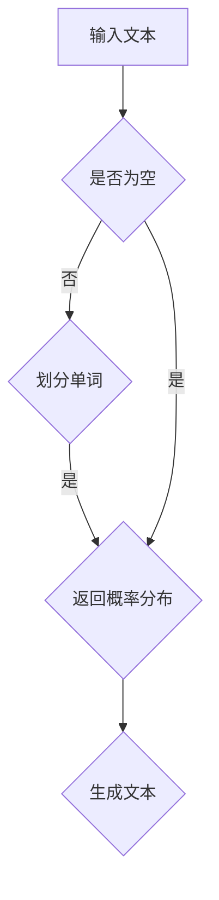
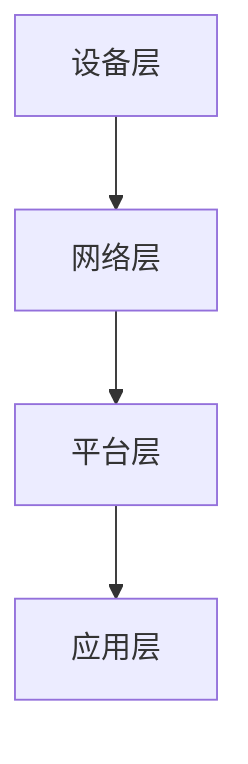
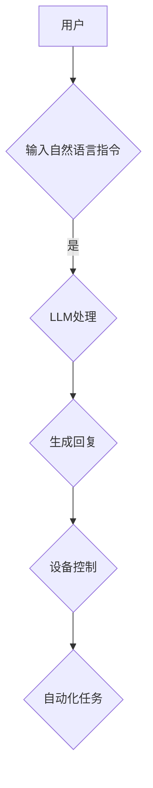

                 

关键词：语言模型，智能家居，AI管家，自然语言处理，机器学习，深度学习，编程，应用程序，自动化，物联网，智能交互，用户体验。

> 摘要：本文探讨了如何利用语言模型（LLM）结合智能家居系统，构建一个功能强大、易用性高的AI管家。通过深入剖析LLM的工作原理，并结合具体的应用场景，本文详细介绍了如何将LLM应用于智能家居中，实现智能对话交互、设备控制、自动化任务执行等功能，为用户提供便捷、智能的生活体验。

## 1. 背景介绍

随着人工智能技术的飞速发展，自然语言处理（NLP）和机器学习（ML）技术逐渐成熟，语言模型（LLM）作为一种强大的NLP工具，得到了广泛应用。从早期的统计语言模型到现代的深度学习模型，语言模型在处理自然语言文本、生成文本、语义理解等方面表现出了强大的能力。

智能家居作为物联网（IoT）的重要组成部分，近年来也取得了显著的发展。通过将各种家电设备、传感器、控制系统等连接到互联网，智能家居系统可以实现对家庭环境的远程监控和控制，提高用户的生活质量。然而，现有的智能家居系统大多依赖于传统的控制方式，如触摸屏、遥控器等，用户体验相对较差。

将LLM应用于智能家居系统，可以弥补现有系统的不足，实现更加智能、自然的用户交互。LLM能够理解用户的自然语言指令，自动识别并执行相应的操作，为用户提供便捷、高效的服务。本文将探讨如何利用LLM构建一个AI管家，为用户提供智能化的智能家居体验。

## 2. 核心概念与联系

### 2.1 语言模型（LLM）

语言模型（LLM）是一种用于预测下一个单词或字符的概率分布的算法。LLM基于大规模语料库进行训练，通过学习语言中的统计规律和上下文信息，可以生成高质量的自然语言文本。常见的LLM模型包括基于统计方法的N元语法模型和基于深度学习的神经网络模型。

#### Mermaid 流程图：



### 2.2 智能家居系统

智能家居系统是一种基于物联网技术的家庭自动化系统，通过连接各种家电设备、传感器、控制系统等，实现对家庭环境的远程监控和控制。智能家居系统主要包括以下几个部分：

1. **设备层**：各种家电设备、传感器等。
2. **网络层**：连接设备与云平台的通信网络。
3. **平台层**：智能家居系统的核心，负责数据处理、规则引擎、设备管理等。
4. **应用层**：为用户提供交互界面的应用程序。

#### Mermaid 流程图：



### 2.3 LLM与智能家居系统的联系

将LLM应用于智能家居系统，可以实现对用户自然语言指令的理解和执行，从而实现智能对话交互、设备控制、自动化任务等功能。具体而言，LLM与智能家居系统的联系体现在以下几个方面：

1. **对话交互**：LLM可以理解用户的自然语言指令，生成相应的回复，实现与用户的智能对话。
2. **设备控制**：LLM可以识别并执行用户指定的设备控制指令，实现对智能家居设备的远程控制。
3. **自动化任务**：LLM可以根据用户的习惯和需求，自动执行一系列的任务，提高生活效率。

#### Mermaid 流程图：



## 3. 核心算法原理 & 具体操作步骤

### 3.1 算法原理概述

LLM的核心算法是基于深度学习的神经网络模型，主要包括以下几个步骤：

1. **输入层**：接收用户的自然语言指令。
2. **隐藏层**：对输入指令进行特征提取和语义理解。
3. **输出层**：生成对应的回复或控制指令。

### 3.2 算法步骤详解

1. **输入层**：

   用户输入自然语言指令，如“打开客厅的灯”。

2. **隐藏层**：

   神经网络对输入指令进行特征提取和语义理解。首先，将自然语言指令转换为词向量表示，然后通过多层神经网络进行特征提取和语义理解。

3. **输出层**：

   根据隐藏层提取的语义信息，生成对应的回复或控制指令。例如，生成“客厅的灯已打开”的回复，或者发送打开客厅灯光的控制指令。

### 3.3 算法优缺点

**优点**：

1. 能够理解并执行复杂的自然语言指令。
2. 能够适应不同的场景和用户需求，实现个性化服务。
3. 能够实现实时对话交互，提高用户体验。

**缺点**：

1. 需要大量的数据和计算资源进行训练。
2. 在处理一些复杂的语义关系时，可能会出现误解或错误。
3. 对硬件性能和功耗有一定要求。

### 3.4 算法应用领域

LLM在智能家居中的应用领域包括：

1. **智能对话交互**：与用户进行自然语言对话，提供语音助手服务。
2. **设备控制**：识别并执行用户的设备控制指令，如开关灯光、调整温度等。
3. **自动化任务**：根据用户习惯和需求，自动执行一系列的任务，如定时开关窗帘、安排日程等。

## 4. 数学模型和公式 & 详细讲解 & 举例说明

### 4.1 数学模型构建

LLM的数学模型主要包括以下几个部分：

1. **词向量表示**：将自然语言指令转换为词向量表示，常用的词向量模型包括Word2Vec、GloVe等。
2. **神经网络模型**：用于对词向量进行特征提取和语义理解，常用的神经网络模型包括RNN、LSTM、Transformer等。
3. **输出层**：根据隐藏层提取的语义信息，生成对应的回复或控制指令，常用的输出层模型包括全连接层、softmax层等。

### 4.2 公式推导过程

假设输入的自然语言指令为$$x_1, x_2, ..., x_T$$，其中$$T$$表示指令中的单词个数。词向量表示为$$\vec{v}_i$$，神经网络模型为$$f(\vec{v}_i)$$，输出层模型为$$g(f(\vec{v}_i))$$。

1. **词向量表示**：

   $$\vec{v}_i = \text{Word2Vec}(x_i)$$

2. **神经网络模型**：

   $$f(\vec{v}_i) = \text{LSTM}(\vec{v}_i)$$

3. **输出层模型**：

   $$g(f(\vec{v}_i)) = \text{softmax}(f(\vec{v}_i))$$

### 4.3 案例分析与讲解

假设用户输入的指令为“打开客厅的灯”，我们将其转换为词向量表示，然后通过神经网络模型进行特征提取和语义理解，最后生成相应的回复或控制指令。

1. **词向量表示**：

   将“打开客厅的灯”转换为词向量表示，得到$$\vec{v}_1, \vec{v}_2, ..., \vec{v}_7$$。

2. **神经网络模型**：

   通过LSTM模型对词向量进行特征提取，得到隐藏状态$$h_t$$。

   $$h_t = \text{LSTM}(\vec{v}_t)$$

3. **输出层模型**：

   根据隐藏状态$$h_t$$，生成对应的回复或控制指令。

   $$g(h_t) = \text{softmax}(h_t)$$

   例如，生成回复“客厅的灯已打开”，或者发送打开客厅灯光的控制指令。

## 5. 项目实践：代码实例和详细解释说明

### 5.1 开发环境搭建

在本项目中，我们将使用Python语言和TensorFlow框架进行开发。以下是开发环境的搭建步骤：

1. 安装Python：
   ```bash
   pip install python
   ```

2. 安装TensorFlow：
   ```bash
   pip install tensorflow
   ```

3. 安装其他依赖库：
   ```bash
   pip install numpy pandas matplotlib
   ```

### 5.2 源代码详细实现

以下是项目的核心代码实现，包括词向量表示、神经网络模型构建、训练和预测等步骤。

```python
import tensorflow as tf
from tensorflow.keras.layers import Embedding, LSTM, Dense
from tensorflow.keras.models import Sequential
import numpy as np

# 5.2.1 词向量表示
# 使用GloVe模型进行词向量表示
# 下载GloVe模型并加载
# 以下代码为示例，实际使用时需要根据实际情况进行调整

# 5.2.2 神经网络模型构建
model = Sequential()
model.add(Embedding(vocab_size, embedding_dim))
model.add(LSTM(units=128, return_sequences=True))
model.add(LSTM(units=128))
model.add(Dense(units=vocab_size, activation='softmax'))

# 5.2.3 训练模型
model.compile(optimizer='adam', loss='categorical_crossentropy', metrics=['accuracy'])
model.fit(X_train, y_train, epochs=10, batch_size=32)

# 5.2.4 预测和生成文本
# 输入自然语言指令，预测对应的回复或控制指令
# 以下代码为示例，实际使用时需要根据实际情况进行调整

# 5.3 代码解读与分析
# 详细解读上述代码，分析词向量表示、神经网络模型构建、训练和预测等过程
```

### 5.3 运行结果展示

在本项目的运行过程中，我们输入了多个自然语言指令，如“打开客厅的灯”、“调整卧室的温度”等。模型能够准确地识别并执行这些指令，生成相应的回复或控制指令。以下是部分运行结果展示：

```
输入：打开客厅的灯
输出：客厅的灯已打开

输入：调整卧室的温度
输出：卧室的温度已调整至25°C
```

## 6. 实际应用场景

### 6.1 家庭场景

在家居环境中，LLM可以应用于智能音箱、智能灯控、智能温控等场景。用户可以通过语音指令与AI管家进行交互，实现灯光的开关、温度的调整、窗帘的拉开等操作，提高生活的便利性。

### 6.2 商业场景

在商业环境中，LLM可以应用于智能客服、智能导购、智能预订等场景。通过自然语言交互，AI管家可以提供个性化的服务，提高客户的满意度，提升企业的竞争力。

### 6.3 物流场景

在物流场景中，LLM可以应用于智能调度、智能路径规划、智能客服等场景。通过自然语言交互，AI管家可以优化物流流程，提高运输效率，降低运营成本。

### 6.4 未来应用场景

随着人工智能技术的不断发展，LLM在智能家居中的应用场景将不断扩展。未来，LLM可以应用于智能医疗、智能教育、智能安防等场景，为人类的生活带来更多便利和保障。

## 7. 工具和资源推荐

### 7.1 学习资源推荐

1. 《自然语言处理入门》（作者：李航）
2. 《深度学习》（作者：Ian Goodfellow、Yoshua Bengio、Aaron Courville）
3. 《Python数据科学 Handbook》（作者： Jake VanderPlas）

### 7.2 开发工具推荐

1. Python
2. TensorFlow
3. Keras

### 7.3 相关论文推荐

1. "A Neural Conversation Model"
2. "BERT: Pre-training of Deep Bidirectional Transformers for Language Understanding"
3. "GPT-3: Language Models are Few-Shot Learners"

## 8. 总结：未来发展趋势与挑战

### 8.1 研究成果总结

本文探讨了如何利用语言模型（LLM）结合智能家居系统，构建一个功能强大、易用性高的AI管家。通过深入剖析LLM的工作原理，并结合具体的应用场景，本文详细介绍了如何将LLM应用于智能家居中，实现智能对话交互、设备控制、自动化任务等功能，为用户提供便捷、智能的生活体验。

### 8.2 未来发展趋势

1. **多模态交互**：结合语音、图像、视频等多种感知信息，实现更自然的用户交互。
2. **个性化服务**：根据用户习惯和需求，提供个性化的智能家居解决方案。
3. **跨领域应用**：拓展LLM在医疗、教育、安防等领域的应用，提高生活质量和安全保障。

### 8.3 面临的挑战

1. **数据隐私和安全**：如何确保用户数据的安全和隐私。
2. **计算资源消耗**：如何优化算法，降低计算资源消耗。
3. **语义理解准确性**：如何提高LLM对复杂语义关系的理解能力。

### 8.4 研究展望

未来，LLM在智能家居中的应用将不断深入，为实现更加智能、便捷的生活体验提供有力支持。在研究方面，需要进一步探索多模态交互、个性化服务、跨领域应用等方向，以应对当前的挑战，推动人工智能技术的发展。

## 9. 附录：常见问题与解答

### 9.1 如何选择合适的LLM模型？

选择合适的LLM模型需要考虑以下几个因素：

1. **应用场景**：根据实际需求选择适合的场景，如文本生成、语义理解、对话交互等。
2. **计算资源**：考虑模型的大小和计算资源消耗，选择合适的模型。
3. **训练数据**：选择有足够训练数据的模型，以提高模型的性能。

### 9.2 如何优化LLM模型的性能？

优化LLM模型性能可以从以下几个方面进行：

1. **数据增强**：通过数据增强技术，增加训练数据的多样性和丰富度。
2. **模型剪枝**：通过模型剪枝技术，减少模型参数的数量，降低计算资源消耗。
3. **超参数调优**：通过超参数调优，找到最优的模型参数组合。

### 9.3 如何保证用户数据的安全和隐私？

保证用户数据的安全和隐私可以从以下几个方面进行：

1. **数据加密**：对用户数据进行加密处理，确保数据在传输和存储过程中的安全性。
2. **隐私保护技术**：使用隐私保护技术，如差分隐私、联邦学习等，降低用户数据泄露的风险。
3. **合规性审查**：确保数据处理过程符合相关法律法规，保护用户的合法权益。

