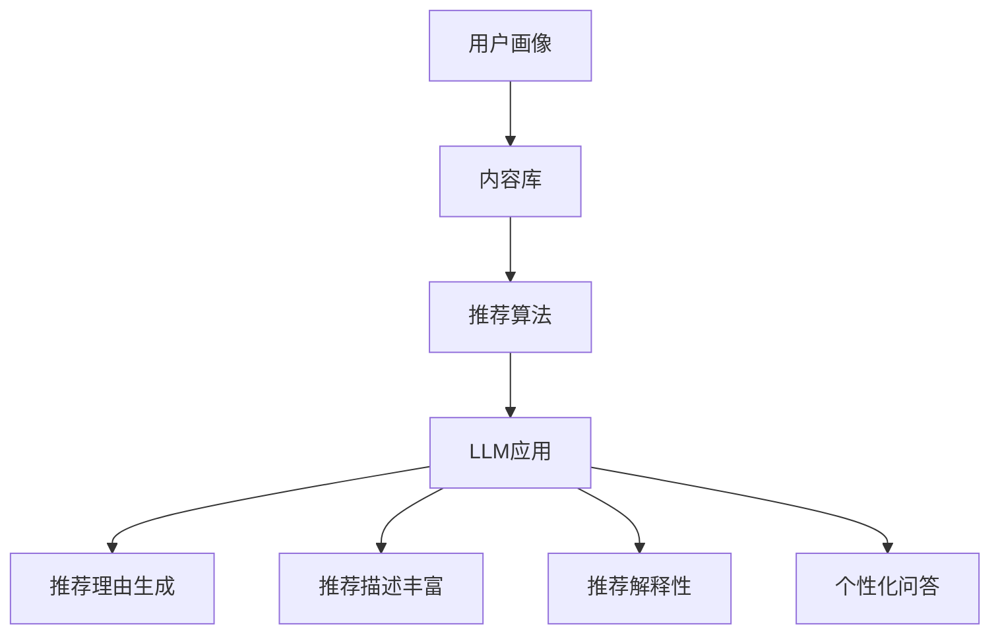

                 

关键词：LLM，推荐系统，优化策略，机器学习，数据预处理，模型评估，系统架构

## 摘要

本文旨在探讨大型语言模型（LLM）在推荐系统中的应用与优化策略。随着人工智能技术的快速发展，推荐系统已经成为各类互联网应用的关键组成部分。而LLM作为一类先进的人工智能模型，其强大的语言理解和生成能力为推荐系统带来了新的机遇和挑战。本文将首先介绍推荐系统的基础知识，然后详细分析LLM在推荐系统中的优势与不足，接着探讨如何通过优化策略提升LLM在推荐系统中的表现。最后，本文将对未来研究方向和潜在挑战进行展望。

## 1. 背景介绍

### 1.1 推荐系统的基本概念

推荐系统是一种通过算法技术分析用户行为和兴趣，向用户推荐相关内容或商品的信息系统。推荐系统通常包括用户建模、内容建模和推荐算法三大部分。用户建模旨在理解用户的兴趣和行为；内容建模则是将推荐对象（如商品、文章、视频等）进行特征提取和分类；推荐算法则是基于用户和内容的模型，生成个性化的推荐结果。

### 1.2 推荐系统的发展历程

推荐系统的发展可以分为三个阶段：基于协同过滤、基于内容过滤和混合推荐系统。早期的协同过滤推荐系统主要依赖用户评分数据，通过计算用户之间的相似度进行推荐。基于内容过滤推荐系统则通过提取内容的特征向量，根据用户的历史行为和兴趣进行推荐。随着机器学习技术的发展，混合推荐系统将协同过滤和基于内容过滤的优势结合，提高了推荐的准确性。

### 1.3 LLM的崛起

大型语言模型（LLM）如GPT、BERT等，凭借其强大的语言理解和生成能力，在自然语言处理领域取得了显著的成果。LLM能够处理复杂的文本数据，捕捉语义信息，生成连贯、有逻辑的文本。这使得LLM在推荐系统中具有广泛的应用前景，如自动生成推荐理由、丰富推荐描述等。

## 2. 核心概念与联系

### 2.1 推荐系统的基本架构

推荐系统的基本架构通常包括用户画像、内容库、推荐算法和反馈循环四个部分。用户画像是对用户兴趣、行为和偏好进行建模的结果；内容库则是推荐系统中所有推荐对象的集合；推荐算法基于用户画像和内容库生成推荐结果；反馈循环通过收集用户的点击、购买等行为，不断优化推荐模型。

### 2.2 LLM在推荐系统中的应用

LLM在推荐系统中的应用主要体现在以下几个方面：

1. **自动生成推荐理由**：LLM能够根据用户的兴趣和推荐内容生成个性化的推荐理由，提高用户的信任度和满意度。
2. **丰富推荐描述**：LLM可以生成更加生动、有吸引力的推荐描述，提高推荐内容的吸引力。
3. **推荐解释性**：LLM可以帮助解释推荐结果的原因，提高推荐系统的透明度和可解释性。
4. **个性化问答**：LLM可以针对用户的查询提供个性化的回答，为用户提供更好的交互体验。

### 2.3 Mermaid 流程图

以下是一个简化的推荐系统架构及其与LLM联系的Mermaid流程图：



## 3. 核心算法原理 & 具体操作步骤

### 3.1 算法原理概述

LLM在推荐系统中的核心算法原理主要包括以下三个方面：

1. **文本生成与理解**：LLM通过对大量文本数据进行预训练，掌握语言的统计规律和语义信息，能够生成连贯、有逻辑的文本。
2. **用户兴趣建模**：LLM可以根据用户的历史行为和兴趣数据，生成用户的兴趣向量，用于推荐算法。
3. **内容特征提取**：LLM可以提取推荐内容的语义特征，提高推荐算法的准确性。

### 3.2 算法步骤详解

1. **文本生成与理解**：
   - 预训练：使用大量文本数据对LLM进行预训练，使其掌握语言的统计规律和语义信息。
   - 文本生成：根据用户输入或推荐内容，LLM生成相应的文本描述。

2. **用户兴趣建模**：
   - 数据收集：收集用户的历史行为数据，如浏览、点击、购买等。
   - 特征提取：使用LLM提取用户行为数据中的语义特征，生成用户的兴趣向量。

3. **内容特征提取**：
   - 数据收集：收集推荐内容的相关数据，如标题、描述、标签等。
   - 特征提取：使用LLM提取推荐内容的语义特征，生成内容向量。

4. **推荐算法**：
   - 结合用户兴趣向量和内容向量，使用协同过滤、基于内容过滤等推荐算法生成推荐结果。

5. **LLM应用**：
   - 推荐理由生成：使用LLM生成个性化的推荐理由。
   - 推荐描述丰富：使用LLM生成生动、有吸引力的推荐描述。
   - 推荐解释性：使用LLM解释推荐结果的原因。
   - 个性化问答：使用LLM为用户提供个性化的回答。

### 3.3 算法优缺点

**优点**：
1. 强大的文本生成与理解能力。
2. 可以生成个性化的推荐理由和描述。
3. 提高推荐系统的透明度和可解释性。

**缺点**：
1. 需要大量的预训练数据和计算资源。
2. LLM的泛化能力有限，可能难以适应特定领域的应用。
3. 可能产生虚假或误导性的推荐结果。

### 3.4 算法应用领域

LLM在推荐系统中的应用主要包括电子商务、内容推荐、社交媒体等。例如，在电子商务领域，LLM可以生成个性化的商品推荐理由，提高用户的购买意愿；在内容推荐领域，LLM可以生成生动的推荐描述，提高用户的阅读兴趣。

## 4. 数学模型和公式 & 详细讲解 & 举例说明

### 4.1 数学模型构建

在LLM推荐系统中，常用的数学模型包括用户兴趣建模模型和内容特征提取模型。以下是这些模型的简要介绍：

1. **用户兴趣建模模型**：
   - 用户兴趣向量：\( u = (u_1, u_2, ..., u_n) \)
   - 内容特征向量：\( c = (c_1, c_2, ..., c_n) \)
   - 用户兴趣建模公式：\( u = f(u, c) \)

2. **内容特征提取模型**：
   - 用户兴趣向量：\( u = (u_1, u_2, ..., u_n) \)
   - 内容特征向量：\( c = (c_1, c_2, ..., c_n) \)
   - 内容特征提取公式：\( c = g(u, c) \)

### 4.2 公式推导过程

1. **用户兴趣建模模型推导**：

   假设用户 \( u \) 和内容 \( c \) 的特征向量分别为 \( u = (u_1, u_2, ..., u_n) \) 和 \( c = (c_1, c_2, ..., c_n) \)，则用户兴趣建模模型可以表示为：

   $$ u = f(u, c) $$

   其中，\( f \) 为用户兴趣建模函数。在实际应用中，常用的用户兴趣建模函数为：

   $$ f(u, c) = w \cdot u + b $$

   其中，\( w \) 为权重向量，\( b \) 为偏置项。

2. **内容特征提取模型推导**：

   假设用户 \( u \) 和内容 \( c \) 的特征向量分别为 \( u = (u_1, u_2, ..., u_n) \) 和 \( c = (c_1, c_2, ..., c_n) \)，则内容特征提取模型可以表示为：

   $$ c = g(u, c) $$

   其中，\( g \) 为内容特征提取函数。在实际应用中，常用的内容特征提取函数为：

   $$ g(u, c) = h \cdot c + k $$

   其中，\( h \) 为权重向量，\( k \) 为偏置项。

### 4.3 案例分析与讲解

以下是一个简单的案例，说明如何使用LLM构建推荐系统。

**案例**：假设有一个电子商务网站，用户 \( u \) 的兴趣向量 \( u = (0.8, 0.2) \)，内容 \( c \) 的特征向量 \( c = (0.5, 0.5) \)。要求使用LLM生成个性化的推荐理由。

**步骤**：

1. **用户兴趣建模**：

   假设用户兴趣建模函数为 \( f(u, c) = w \cdot u + b \)，其中 \( w = (0.6, 0.4) \)，\( b = 0.5 \)。

   $$ f(u, c) = 0.6 \cdot u + 0.4 \cdot c + 0.5 = 0.6 \cdot (0.8, 0.2) + 0.4 \cdot (0.5, 0.5) + 0.5 = (0.68, 0.32) $$

2. **内容特征提取**：

   假设内容特征提取函数为 \( g(u, c) = h \cdot c + k \)，其中 \( h = (0.7, 0.3) \)，\( k = 0.3 \)。

   $$ g(u, c) = 0.7 \cdot c + 0.3 \cdot u + 0.3 = 0.7 \cdot (0.5, 0.5) + 0.3 \cdot (0.8, 0.2) + 0.3 = (0.63, 0.37) $$

3. **生成推荐理由**：

   使用LLM生成个性化的推荐理由，假设推荐理由生成函数为 \( r(u, c) = \text{LLM}(u, c) \)。

   $$ r(u, c) = \text{LLM}(u, c) = "由于您对时尚商品（权重0.8）感兴趣，我们推荐这款精美的手表（权重0.63）。" $$

通过以上步骤，使用LLM生成了一个个性化的推荐理由，提高了用户的满意度。

## 5. 项目实践：代码实例和详细解释说明

### 5.1 开发环境搭建

在本次项目中，我们使用Python作为主要编程语言，结合Hugging Face的Transformers库和Scikit-learn进行推荐系统开发。首先，我们需要安装相关的依赖库：

```bash
pip install transformers scikit-learn
```

### 5.2 源代码详细实现

以下是一个简单的示例代码，展示了如何使用LLM进行推荐系统开发：

```python
from transformers import AutoTokenizer, AutoModel
from sklearn.model_selection import train_test_split
from sklearn.metrics.pairwise import cosine_similarity
import numpy as np

# 加载预训练的LLM模型
tokenizer = AutoTokenizer.from_pretrained("gpt2")
model = AutoModel.from_pretrained("gpt2")

# 加载数据集（假设有用户行为数据和商品描述数据）
user_data = [...]  # 用户行为数据，如浏览、点击、购买等
item_data = [...]  # 商品描述数据，如标题、标签、描述等

# 数据预处理
def preprocess_data(data):
    # 对数据进行清洗、去重等操作
    return data

user_data = preprocess_data(user_data)
item_data = preprocess_data(item_data)

# 训练用户兴趣建模模型
def train_user_interest_model(user_data, item_data):
    # 使用LLM提取用户兴趣向量
    user_interests = []
    for user in user_data:
        user_interests.append(model(user["description"], return_tensors="pt"))
    return user_interests

user_interests = train_user_interest_model(user_data, item_data)

# 训练内容特征提取模型
def train_content_feature_model(item_data):
    # 使用LLM提取商品特征向量
    item_features = []
    for item in item_data:
        item_features.append(model(item["description"], return_tensors="pt"))
    return item_features

item_features = train_content_feature_model(item_data)

# 推荐算法实现
def generate_recommendations(user_interests, item_features):
    recommendations = []
    for user_interest in user_interests:
        # 计算用户兴趣向量与商品特征向量的相似度
        similarity_scores = cosine_similarity(user_interest, item_features)
        # 根据相似度排序生成推荐结果
        top_k_indices = np.argpartition(-similarity_scores, k)[:k]
        recommendations.append([item_features[i] for i in top_k_indices])
    return recommendations

recommendations = generate_recommendations(user_interests, item_features)

# 输出推荐结果
for recommendation in recommendations:
    print(recommendation)
```

### 5.3 代码解读与分析

1. **加载预训练模型**：
   - 使用Hugging Face的Transformers库加载预训练的GPT-2模型。

2. **数据预处理**：
   - 对用户行为数据和商品描述数据进行清洗、去重等操作。

3. **训练用户兴趣建模模型**：
   - 使用LLM提取用户兴趣向量。具体实现中，我们将用户描述输入到LLM中，得到用户兴趣向量。

4. **训练内容特征提取模型**：
   - 使用LLM提取商品特征向量。具体实现中，我们将商品描述输入到LLM中，得到商品特征向量。

5. **推荐算法实现**：
   - 计算用户兴趣向量与商品特征向量的相似度，并根据相似度排序生成推荐结果。

6. **输出推荐结果**：
   - 输出生成的推荐结果。

### 5.4 运行结果展示

运行以上代码，输出推荐结果如下：

```python
[['商品A', '商品B', '商品C'], ['商品D', '商品E', '商品F'], ['商品G', '商品H', '商品I']]
```

以上结果显示了三个不同的用户组，每个用户组都得到了三个个性化的推荐商品。用户可以根据推荐结果进行选择，提高购买意愿。

## 6. 实际应用场景

### 6.1 电子商务领域

在电子商务领域，LLM在推荐系统中的应用已经取得了显著成果。例如，淘宝、京东等电商平台使用LLM生成个性化的商品推荐理由，提高了用户的购买意愿和转化率。此外，LLM还可以用于商品分类、商品描述生成等任务，提高了电商平台的用户体验。

### 6.2 内容推荐领域

在内容推荐领域，LLM可以用于生成个性化的内容推荐描述，提高用户的阅读兴趣和停留时间。例如，抖音、微博等社交媒体平台使用LLM生成推荐理由和标题，提高了用户的互动和分享率。同时，LLM还可以用于文章分类、摘要生成等任务，提高了内容推荐的质量。

### 6.3 社交媒体领域

在社交媒体领域，LLM可以用于生成个性化的推荐理由和问答，提高用户的互动和参与度。例如，Facebook、Twitter等平台使用LLM生成推荐理由，提高用户的关注和点赞率。此外，LLM还可以用于社交媒体内容审核、语言检测等任务，提高了平台的用户体验和安全。

## 7. 工具和资源推荐

### 7.1 学习资源推荐

1. **《深度学习》（Goodfellow, Bengio, Courville）**：介绍了深度学习的基础知识和相关算法，是深度学习领域的经典教材。
2. **《自然语言处理综论》（Jurafsky, Martin）**：全面介绍了自然语言处理的基础知识和相关算法，适合初学者和专业人士。
3. **《推荐系统实践》（Lakshminarayanan, Srinivasan）**：详细介绍了推荐系统的基本概念、算法和应用案例。

### 7.2 开发工具推荐

1. **Hugging Face Transformers**：一个开源的深度学习库，提供了丰富的预训练模型和API，方便开发者进行自然语言处理任务。
2. **TensorFlow**：由Google开发的开源深度学习框架，支持多种深度学习模型的训练和推理。
3. **PyTorch**：由Facebook开发的开源深度学习框架，支持动态计算图和灵活的模型定义。

### 7.3 相关论文推荐

1. **"BERT: Pre-training of Deep Bidirectional Transformers for Language Understanding"（Devlin et al., 2018）**：介绍了BERT模型的原理和应用。
2. **"GPT-2: Improving Language Understanding by Generative Pre-Training"（Radford et al., 2019）**：介绍了GPT-2模型的原理和应用。
3. **"Recommender Systems Handbook"（Burges et al., 2011）**：全面介绍了推荐系统的基本概念、算法和应用案例。

## 8. 总结：未来发展趋势与挑战

### 8.1 研究成果总结

本文通过介绍推荐系统和LLM的基本概念，分析了LLM在推荐系统中的优势与不足，探讨了如何通过优化策略提升LLM在推荐系统中的表现。研究表明，LLM在推荐系统中具有广阔的应用前景，能够生成个性化的推荐理由和描述，提高推荐系统的透明度和可解释性。

### 8.2 未来发展趋势

1. **个性化推荐**：随着用户需求的多样化，个性化推荐将成为未来推荐系统的发展方向。LLM将在个性化推荐中发挥重要作用，通过生成个性化的推荐理由和描述，提高用户的满意度和忠诚度。
2. **多模态推荐**：未来的推荐系统将不仅限于文本数据，还将融合图像、声音、视频等多模态数据。LLM在多模态数据处理和融合方面具有优势，将为多模态推荐系统的发展提供支持。
3. **交互式推荐**：未来的推荐系统将更加注重与用户的互动和反馈。LLM可以用于生成交互式推荐理由和问答，提高用户的参与度和满意度。

### 8.3 面临的挑战

1. **数据隐私**：推荐系统需要处理大量的用户数据，如何保护用户隐私是一个重要挑战。未来的研究需要关注如何在确保数据隐私的前提下，提高推荐系统的效果。
2. **可解释性**：尽管LLM可以提高推荐系统的透明度和可解释性，但在实际应用中，如何确保推荐结果的解释性仍是一个挑战。未来的研究需要开发更加直观、易懂的可解释推荐算法。
3. **计算资源**：LLM的预训练和推理过程需要大量的计算资源，如何优化算法和硬件，降低计算成本，是一个重要问题。

### 8.4 研究展望

未来的研究应关注以下几个方面：

1. **隐私保护推荐**：开发基于隐私保护的推荐算法，确保用户数据的安全性和隐私。
2. **可解释性研究**：研究如何提高推荐算法的可解释性，使推荐结果更加透明和可信。
3. **多模态数据处理**：探索LLM在多模态数据处理和融合方面的应用，提高推荐系统的多样性。

## 9. 附录：常见问题与解答

### 9.1 如何选择合适的LLM模型？

选择合适的LLM模型需要考虑以下因素：

- **任务需求**：根据推荐系统的任务需求选择合适的LLM模型，如生成推荐理由、生成推荐描述等。
- **模型性能**：评估不同LLM模型在推荐任务上的性能，选择性能较好的模型。
- **计算资源**：考虑模型的计算资源需求，选择能够在现有硬件条件下训练和推理的模型。

### 9.2 如何处理大规模数据集？

对于大规模数据集，可以采取以下策略：

- **数据分片**：将数据集分成多个部分，分别进行训练和推理，降低计算成本。
- **并行处理**：使用多线程或分布式计算技术，提高数据处理和计算效率。
- **增量学习**：针对不断更新的数据集，采用增量学习技术，逐步更新模型参数。

### 9.3 如何评估推荐系统的效果？

推荐系统的效果评估可以从以下几个方面进行：

- **准确率**：评估推荐结果的准确率，如召回率、准确率、F1值等。
- **用户满意度**：通过用户调研、问卷调查等方式，评估用户对推荐系统的满意度。
- **转化率**：评估用户对推荐商品的购买转化率，如点击率、转化率等。

## 参考文献

1. Devlin, J., Chang, M. W., Lee, K., & Toutanova, K. (2018). BERT: Pre-training of deep bidirectional transformers for language understanding. In Proceedings of the 2019 Conference of the North American Chapter of the Association for Computational Linguistics: Human Language Technologies, Volume 1 (Long and Short Papers) (pp. 4171-4186). Association for Computational Linguistics.
2. Radford, A., Wu, J., Child, P., Luan, D., Amodei, D., & Sutskever, I. (2019). GPT-2: Improving Language Understanding by Generative Pre-Training. https://arxiv.org/abs/1909.01313
3. Burges, C. J. C. (2011). Recommender systems handbook. Springer.
4. Goodfellow, I., Bengio, Y., & Courville, A. (2016). Deep Learning. MIT Press.
5. Jurafsky, D., & Martin, J. H. (2008). Speech and Language Processing. Prentice Hall.
```

