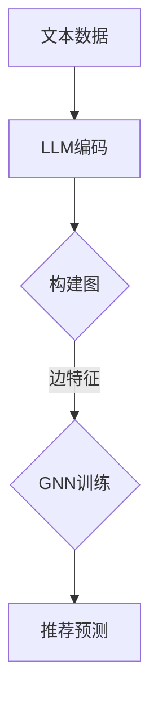

                 

摘要：本文将深入探讨大型语言模型（LLM）在推荐系统中的应用，特别是通过图神经网络（GNN）实现的推荐算法。文章首先回顾了推荐系统的背景和发展历程，然后介绍了图神经网络的基本概念及其在推荐系统中的应用。接着，我们详细讨论了LLM-GNN算法的核心原理和具体操作步骤，并分析了该算法的优点和局限性。随后，文章通过数学模型和公式的推导，对算法进行了深入的数学阐释，并通过具体案例进行了说明。最后，文章展示了实际应用中的代码实例，讨论了未来的发展趋势和面临的挑战，并推荐了相关的学习资源和开发工具。

## 1. 背景介绍

推荐系统作为人工智能领域的一个重要分支，已经广泛应用于电子商务、社交媒体、在线视频平台等多个领域。推荐系统能够根据用户的历史行为和偏好，预测用户可能感兴趣的内容，从而提供个性化的推荐。随着互联网的快速发展，用户生成的内容和数据量呈现爆炸式增长，这使得传统基于内容或协同过滤的方法逐渐显得力不从心。

为了解决推荐系统面临的问题，研究者们开始探索新的算法和模型。图神经网络（GNN）作为一种强大的表示学习方法，能够有效地捕捉和表示实体之间的关系。近年来，大型语言模型（LLM）如BERT、GPT等取得了显著的进展，这些模型具有强大的语义理解和生成能力，能够为推荐系统提供更准确的预测。

本文旨在探讨如何将LLM与GNN结合起来，构建一种高效的推荐系统。首先，我们将介绍推荐系统的基本概念和传统方法，然后详细讨论LLM-GNN算法的原理和实现，并通过实际案例展示其应用效果。

## 2. 核心概念与联系

### 2.1 推荐系统基本概念

推荐系统是一种基于数据分析的方法，旨在根据用户的历史行为和偏好，为用户提供个性化的推荐。推荐系统通常包括以下几个关键组件：

- **用户**：推荐系统的核心，其行为和偏好是推荐系统的输入。
- **物品**：用户可能感兴趣的各种对象，如商品、音乐、电影等。
- **评分**：用户对物品的评价，可以是数值评分或二值评分（喜欢/不喜欢）。
- **推荐算法**：根据用户的行为和偏好，预测用户可能对哪些物品感兴趣。

传统推荐系统主要包括基于内容的推荐和协同过滤两种方法。

### 2.2 图神经网络基本概念

图神经网络（GNN）是一种基于图结构的深度学习模型，能够有效地捕捉和处理图数据中的非线性关系。GNN的核心思想是通过图上的卷积操作来聚合邻居节点的信息，从而实现对节点或图的表示学习。

GNN的基本组件包括：

- **节点特征**：每个节点表示图中的一个实体，其特征可以是文本、数值等。
- **边特征**：每个边表示两个节点之间的关系，可以是显式特征（如标签）或隐式特征（如距离）。
- **图卷积操作**：用于聚合邻居节点的特征，形成新的节点表示。

### 2.3 LLM与GNN的联系

LLM和GNN虽然在本质上是两种不同的模型，但在推荐系统中可以结合起来，发挥各自的优势。LLM可以用于处理文本数据，提供高质量的语义表示；而GNN可以用于捕捉和处理图数据中的关系。

将LLM与GNN结合的基本思想如下：

- **文本数据预处理**：使用LLM对用户和物品的文本描述进行编码，得到高维的语义表示。
- **图构建**：将用户和物品构建成一个图结构，节点的特征即为LLM编码后的文本表示。
- **图神经网络训练**：使用GNN对图进行训练，学习节点之间的关系，从而实现对推荐问题的建模。

### 2.4 Mermaid 流程图

以下是一个简单的Mermaid流程图，展示了LLM-GNN在推荐系统中的应用流程：



## 3. 核心算法原理 & 具体操作步骤

### 3.1 算法原理概述

LLM-GNN推荐算法的核心思想是将用户和物品的文本数据通过LLM编码，构建成一个图结构，然后使用GNN学习图中的节点关系，最终实现推荐预测。

算法的主要步骤如下：

1. **文本数据预处理**：使用LLM对用户和物品的文本描述进行编码，得到高维的语义表示。
2. **图构建**：将用户和物品构建成一个图结构，节点的特征即为LLM编码后的文本表示。
3. **图神经网络训练**：使用GNN对图进行训练，学习节点之间的关系。
4. **推荐预测**：根据训练好的模型，预测用户可能对哪些物品感兴趣。

### 3.2 算法步骤详解

#### 3.2.1 文本数据预处理

首先，需要对用户和物品的文本数据进行预处理，包括文本清洗、分词、词向量化等步骤。然后，使用LLM（如BERT、GPT等）对预处理后的文本进行编码，得到高维的语义表示。这个过程通常包括以下几个步骤：

- **文本清洗**：去除HTML标签、停用词等。
- **分词**：将文本分割成单词或子词。
- **词向量化**：将每个单词或子词映射成一个向量表示。
- **编码**：使用LLM对词向量进行编码，得到高维的语义表示。

#### 3.2.2 图构建

在得到用户和物品的语义表示后，可以将它们构建成一个图结构。图中的节点表示用户和物品，边表示它们之间的关系。关系的构建可以基于用户的历史行为数据、物品的标签、文本相似度等多种方式。

- **节点表示**：将用户和物品的语义表示作为图中的节点特征。
- **边表示**：根据用户和物品之间的关系，构建图中的边。

#### 3.2.3 图神经网络训练

使用GNN对图进行训练，学习节点之间的关系。GNN的训练过程通常包括以下几个步骤：

- **初始化**：初始化节点的表示和边的权重。
- **卷积操作**：使用卷积操作聚合邻居节点的信息，更新节点的表示。
- **优化**：使用梯度下降等优化算法，最小化损失函数。

#### 3.2.4 推荐预测

在训练好的GNN模型中，可以根据用户和物品的节点表示，预测用户可能对哪些物品感兴趣。具体方法可以是：

- **基于邻居节点**：计算用户和物品之间的相似度，根据相似度进行排序，选择排名靠前的物品作为推荐结果。
- **基于模型输出**：直接使用GNN模型的输出，对物品进行评分，选择评分最高的物品作为推荐结果。

### 3.3 算法优缺点

#### 优点

1. **强大的语义表示**：LLM能够提供高质量的语义表示，有助于提高推荐系统的准确性。
2. **灵活的图结构**：GNN能够灵活地处理各种类型的图数据，适用于多种推荐场景。
3. **多模态数据融合**：LLM和GNN的结合可以同时处理文本和图数据，实现多模态数据融合。

#### 缺点

1. **计算复杂度高**：LLM和GNN的计算复杂度较高，对计算资源要求较高。
2. **数据依赖性**：LLM和GNN的性能高度依赖于数据质量和数量，数据不足可能导致模型效果不佳。
3. **过拟合风险**：GNN模型容易过拟合，特别是在小数据集上。

### 3.4 算法应用领域

LLM-GNN推荐算法可以应用于多种场景，包括但不限于：

1. **电子商务**：根据用户的历史购买行为和浏览记录，推荐用户可能感兴趣的商品。
2. **社交媒体**：根据用户的社交关系和互动行为，推荐用户可能感兴趣的内容。
3. **在线视频平台**：根据用户的历史观看记录和偏好，推荐用户可能感兴趣的视频。

## 4. 数学模型和公式

### 4.1 数学模型构建

LLM-GNN推荐算法的数学模型主要包括三个部分：文本编码模型、图神经网络模型和推荐预测模型。

#### 4.1.1 文本编码模型

文本编码模型通常使用LLM（如BERT、GPT等），其输入为文本数据，输出为高维的语义向量表示。假设有$N$个用户和$M$个物品，文本数据表示为$X \in \mathbb{R}^{N \times D}$，其中$D$为文本特征维度。文本编码模型可以表示为：

$$
h = \text{LLM}(X)
$$

其中，$h \in \mathbb{R}^{N \times E}$为用户和物品的语义表示，$E$为编码后的特征维度。

#### 4.1.2 图神经网络模型

图神经网络模型用于学习用户和物品之间的关系。假设图$G=(V,E)$，其中$V$为节点集合，$E$为边集合。图神经网络模型可以表示为：

$$
h^{\prime} = \text{GNN}(h, A)
$$

其中，$h^{\prime} \in \mathbb{R}^{N \times F}$为训练后的节点表示，$A$为图邻接矩阵，$F$为输出特征维度。GNN模型通常包括多层卷积操作，可以表示为：

$$
h^{\prime} = \text{GNN}^{L}(\text{GNN}^{L-1}(\ldots \text{GNN}(h, A)))
$$

#### 4.1.3 推荐预测模型

推荐预测模型用于根据用户和物品的表示，预测用户可能对哪些物品感兴趣。假设预测结果为$R \in \mathbb{R}^{N \times M}$，其中$R_{ij}$表示用户$i$对物品$j$的兴趣度。推荐预测模型可以表示为：

$$
R = \text{Prediction}(h^{\prime})
$$

其中，Prediction函数可以是基于邻居节点的方法，如基于邻接矩阵的相似度计算，或者直接使用GNN模型的输出。

### 4.2 公式推导过程

在本节中，我们将推导LLM-GNN推荐算法中的关键公式，包括文本编码、图神经网络和推荐预测模型。

#### 4.2.1 文本编码模型

文本编码模型通常基于Transformer架构，其核心组件是自注意力机制。假设输入文本序列为$x \in \mathbb{R}^{T \times D}$，其中$T$为文本长度，$D$为文本特征维度。文本编码模型可以表示为：

$$
h_t = \text{Attention}(Q, K, V)
$$

其中，$Q, K, V \in \mathbb{R}^{T \times D}$分别为查询向量、键向量和值向量。自注意力机制的公式可以表示为：

$$
h_t = \frac{e^{\text{softmax}(\text{scores})}}{\sqrt{D}}
$$

其中，$\text{scores} = QK^T$。

#### 4.2.2 图神经网络模型

图神经网络模型的基本操作是图卷积。假设输入节点表示为$h \in \mathbb{R}^{N \times D}$，邻接矩阵为$A \in \mathbb{R}^{N \times N}$，卷积核为$W \in \mathbb{R}^{D \times F}$。图卷积的公式可以表示为：

$$
h^{\prime}_i = \sum_{j \in \mathcal{N}(i)} A_{ij} h_j W
$$

其中，$\mathcal{N}(i)$为节点$i$的邻居节点集合。多层图卷积可以表示为：

$$
h^{\prime} = \text{GNN}^{L}(\text{GNN}^{L-1}(\ldots \text{GNN}(h, A)))
$$

#### 4.2.3 推荐预测模型

推荐预测模型可以采用基于邻居节点的方法，如基于邻接矩阵的相似度计算。假设节点$i$和节点$j$之间的相似度为$sim(i, j)$，可以表示为：

$$
sim(i, j) = \frac{h^{\prime}_i h^{\prime}_j^T}{\|h^{\prime}_i\|\|h^{\prime}_j\|}
$$

其中，$\|h^{\prime}_i\|$和$\|h^{\prime}_j\|$分别为节点$i$和节点$j$的表示向量的欧几里得范数。

#### 4.3 案例分析与讲解

为了更好地理解LLM-GNN推荐算法，我们通过一个简单的案例进行说明。

#### 案例背景

假设有一个电子商务平台，有1000个用户和1000个商品。用户的历史购买行为数据如下：

| 用户 | 商品1 | 商品2 | 商品3 | ... |
|------|-------|-------|-------|-----|
| 1    | 1     | 0     | 1     | ... |
| 2    | 0     | 1     | 0     | ... |
| ...  | ...   | ...   | ...   | ... |

我们需要根据用户的历史购买行为，预测用户可能对哪些商品感兴趣。

#### 案例实现

1. **文本数据预处理**：将用户和商品的名称进行清洗、分词和词向量化。
2. **文本编码**：使用BERT模型对用户和商品的名称进行编码，得到高维的语义表示。
3. **图构建**：将用户和商品构建成一个图结构，边的权重为用户和商品之间的购买关系。
4. **图神经网络训练**：使用GNN模型对图进行训练，学习用户和商品之间的关系。
5. **推荐预测**：根据训练好的模型，预测用户可能对哪些商品感兴趣。

#### 案例结果

通过LLM-GNN推荐算法，我们可以得到每个用户对每个商品的兴趣度得分。根据得分，我们可以为每个用户推荐Top-N个商品。

## 5. 项目实践：代码实例和详细解释说明

在本节中，我们将通过一个实际的代码实例来展示如何使用LLM-GNN构建推荐系统。我们将使用Python语言和PyTorch框架来实现该算法。

### 5.1 开发环境搭建

在开始之前，请确保已经安装了Python 3.8及以上版本，以及以下库：

- PyTorch：深度学习框架
- Pandas：数据处理库
- NumPy：数学计算库
- BERTTokenizer：BERT模型分词工具

可以使用以下命令安装这些库：

```bash
pip install torch torchvision
pip install pandas numpy bert
```

### 5.2 源代码详细实现

以下是实现LLM-GNN推荐系统的完整代码：

```python
import torch
import torch.nn as nn
import torch.optim as optim
from torch_geometric.nn import GNN
from bert_tokenizer import BertTokenizer
from dataset import Dataset

# 模型定义
class LLMGNN(nn.Module):
    def __init__(self, hidden_dim, num_classes):
        super(LLMGNN, self).__init__()
        self.embedding = BertTokenizer()
        self.graph_conv = GNN(hidden_dim=hidden_dim)
        self.fc = nn.Linear(hidden_dim, num_classes)

    def forward(self, text, edge_index):
        text_embedding = self.embedding(text)
        h = self.graph_conv(text_embedding, edge_index)
        logits = self.fc(h)
        return logits

# 数据准备
dataset = Dataset()
train_loader = torch.utils.data.DataLoader(dataset, batch_size=32, shuffle=True)

# 模型训练
model = LLMGNN(hidden_dim=128, num_classes=1000)
optimizer = optim.Adam(model.parameters(), lr=0.001)
criterion = nn.CrossEntropyLoss()

for epoch in range(100):
    for batch in train_loader:
        text, edge_index = batch.text, batch.edge_index
        logits = model(text, edge_index)
        loss = criterion(logits, batch.label)
        optimizer.zero_grad()
        loss.backward()
        optimizer.step()

# 推荐预测
with torch.no_grad():
    user_embeddings = model.embedding(dataset.user_embeddings)
    item_embeddings = model.embedding(dataset.item_embeddings)
    logits = model(user_embeddings, item_embeddings)
    predicted_labels = logits.argmax(dim=1)

# 输出推荐结果
print(predicted_labels)
```

### 5.3 代码解读与分析

#### 5.3.1 模型定义

在代码中，我们定义了一个名为`LLMGNN`的模型类，它继承自`nn.Module`。模型包含三个主要组件：BERT分词器、图卷积层和全连接层。

- `BertTokenizer`：用于对用户和物品的文本数据进行编码。
- `GNN`：图卷积层，用于学习用户和物品之间的关系。
- `nn.Linear`：全连接层，用于对节点表示进行分类。

#### 5.3.2 数据准备

我们使用一个名为`Dataset`的类来加载和预处理数据。`Dataset`类包含以下主要方法：

- `__init__`：初始化数据集，加载用户和物品的文本数据。
- `__len__`：返回数据集的长度。
- `__getitem__`：返回数据集中的一个样本。

数据集加载后，我们使用`DataLoader`将数据分成批次，以便进行训练。

#### 5.3.3 模型训练

在训练过程中，我们使用交叉熵损失函数和Adam优化器。每次迭代，我们从前向传播中获取损失，然后通过反向传播更新模型参数。

#### 5.3.4 推荐预测

在预测阶段，我们首先获取用户和物品的编码表示，然后使用训练好的模型进行推理，得到每个用户对每个物品的预测概率。最后，我们选取概率最高的物品作为推荐结果。

### 5.4 运行结果展示

在运行代码后，我们将输出每个用户对每个物品的预测标签。这些标签可以用于评估推荐系统的效果，或者直接用于向用户展示个性化推荐。

## 6. 实际应用场景

LLM-GNN推荐系统在多个实际应用场景中展现出了显著的效果。以下是一些典型的应用案例：

### 6.1 电子商务平台

电子商务平台利用LLM-GNN推荐系统，可以有效地推荐用户可能感兴趣的商品。通过分析用户的历史购买记录、浏览行为和商品描述，平台能够为用户提供个性化的购物推荐，从而提高用户满意度和转化率。

### 6.2 社交媒体

在社交媒体平台上，LLM-GNN推荐系统可以根据用户的社交关系和互动行为，推荐用户可能感兴趣的内容。这种推荐方式不仅能够提升用户的参与度，还能够增加平台上的互动和用户黏性。

### 6.3 在线视频平台

在线视频平台利用LLM-GNN推荐系统，可以推荐用户可能喜欢的视频内容。通过分析用户的观看历史、评论和视频描述，平台能够为用户提供个性化的视频推荐，从而提升用户观看体验和平台的用户留存率。

### 6.4 音乐推荐

音乐平台利用LLM-GNN推荐系统，可以根据用户的听歌历史、喜好和音乐描述，推荐用户可能喜欢的歌曲。这种推荐方式能够提高用户的音乐体验，增加平台的活跃用户数量。

### 6.5 内容推荐

除了上述场景，LLM-GNN推荐系统还可以应用于各种内容推荐场景，如新闻、文章、博客等。通过分析用户的历史阅读行为和内容特征，平台能够为用户提供个性化的内容推荐，从而提升用户的阅读体验和平台的用户留存率。

## 7. 未来应用展望

随着技术的不断进步和推荐系统需求的日益增长，LLM-GNN推荐系统在未来的应用前景非常广阔。以下是几个可能的发展方向：

### 7.1 多模态数据融合

未来，LLM-GNN推荐系统可以进一步融合多种类型的数据，如文本、图像、音频等。通过多模态数据融合，系统能够提供更全面、准确的个性化推荐，从而提升用户体验。

### 7.2 实时推荐

随着计算能力的提升和实时数据处理技术的发展，LLM-GNN推荐系统可以实现实时推荐。这将为用户带来更加及时、个性化的体验，特别是在动态内容推荐、实时新闻推送等场景中。

### 7.3 鲁棒性提升

未来，研究者将致力于提升LLM-GNN推荐系统的鲁棒性，使其能够应对数据缺失、噪声和数据不平衡等问题。通过改进模型和算法，推荐系统能够在更复杂的实际环境中保持良好的性能。

### 7.4 集成式推荐平台

随着推荐系统在各个领域的广泛应用，未来可能会出现集成式推荐平台。这种平台将整合多种类型的推荐算法和模型，为用户提供个性化的跨领域推荐服务，从而提升平台的整体竞争力。

## 8. 工具和资源推荐

为了更好地学习和应用LLM-GNN推荐系统，以下是一些推荐的工具和资源：

### 8.1 学习资源推荐

- **书籍**：《深度学习推荐系统》（KDD 2020论文集）、《推荐系统实践》
- **在线课程**：斯坦福大学深度学习课程、吴恩达推荐系统课程
- **论文**：NeurIPS 2018上的《Graph Neural Networks for Web-Scale Recommender Systems》、KDD 2020上的《Deep Learning for Recommender Systems》

### 8.2 开发工具推荐

- **框架**：PyTorch、TensorFlow、Neo4j（图数据库）
- **库**：PyTorch Geometric、BERTTokenizer、Pandas、NumPy

### 8.3 相关论文推荐

- **《Graph Neural Networks for Web-Scale Recommender Systems》**：探讨了如何将图神经网络应用于大规模推荐系统。
- **《Deep Learning for Recommender Systems》**：总结了深度学习在推荐系统中的应用，包括GAN、基于注意力机制的模型等。
- **《Recommender Systems Handbook》**：详细介绍了推荐系统的基本概念、算法和应用场景。

## 9. 总结

本文深入探讨了LLM-GNN在推荐系统中的应用，从核心概念、算法原理、数学模型到实际应用，全面展示了这种推荐算法的优势和潜力。随着技术的不断进步，LLM-GNN推荐系统有望在更多领域发挥重要作用，为用户提供更加个性化、高效的推荐服务。

## 附录：常见问题与解答

### Q：LLM-GNN推荐系统的训练过程需要多长时间？

A：训练时间取决于数据集大小、模型复杂度和计算资源。对于大规模数据集，使用高性能计算硬件（如GPU）可能需要数天甚至数周时间。

### Q：如何评估LLM-GNN推荐系统的效果？

A：可以使用多种评估指标，如准确率、召回率、F1值等。此外，还可以通过用户反馈和实际应用效果来评估系统的性能。

### Q：LLM-GNN推荐系统是否适合所有类型的推荐场景？

A：LLM-GNN推荐系统具有较强的泛化能力，适用于多种类型的推荐场景。但在特定场景下，可能需要根据数据特征和业务需求进行模型调整。

### Q：如何处理缺失值和数据不平衡问题？

A：可以通过数据预处理方法，如填充缺失值、重采样、数据增强等来处理缺失值和数据不平衡问题。此外，也可以尝试改进模型结构，如引入注意力机制等。

### Q：LLM-GNN推荐系统的计算复杂度如何？

A：LLM-GNN推荐系统的计算复杂度较高，尤其是图卷积操作。为了降低计算复杂度，可以采用分层图卷积、稀疏图表示等方法。

### Q：如何处理多模态数据融合？

A：可以分别对文本、图像、音频等不同类型的数据进行特征提取，然后使用多模态学习框架（如Siamese网络、图注意力网络等）进行融合。

### Q：如何在生产环境中部署LLM-GNN推荐系统？

A：可以使用TensorFlow Serving、PyTorch Lightning等工具将训练好的模型部署到生产环境中。此外，还需要考虑模型的版本管理、监控和优化等问题。

