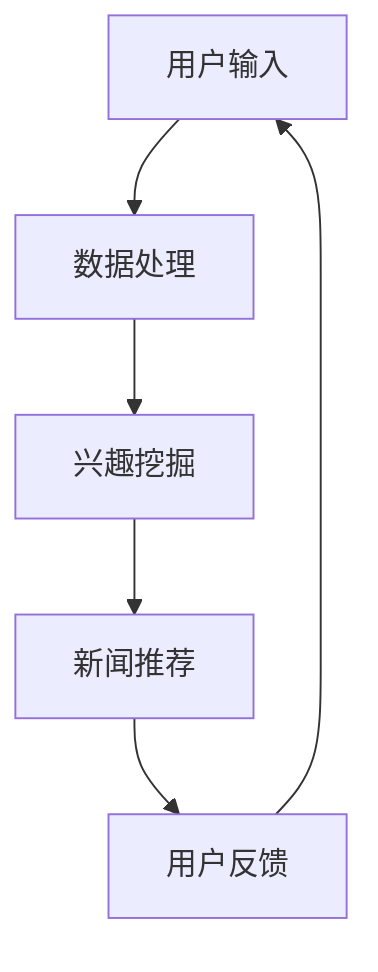

                 

关键词：大型语言模型（LLM），智能推送，个性化，新闻，算法，应用前景

摘要：本文将探讨大型语言模型（LLM）在智能个性化新闻推送中的应用前景。首先，我们将介绍背景信息，包括新闻推送的现状和存在的问题。接着，我们将讨论LLM的核心概念和原理，并展示一个用于新闻推送的Mermaid流程图。随后，我们将深入探讨LLM在新闻推送中的核心算法原理和具体操作步骤，包括算法优缺点及其应用领域。接下来，我们将介绍数学模型和公式，并进行详细讲解和举例说明。文章还将通过一个项目实践案例，展示代码实例和详细解释说明。最后，我们将讨论实际应用场景，并提出未来应用展望。

## 1. 背景介绍

新闻推送是现代信息社会中不可或缺的一部分。随着互联网的普及和移动设备的广泛使用，人们越来越依赖新闻应用来获取最新信息。然而，当前的新闻推送存在一些问题和挑战。

首先，新闻推送的内容过于笼统，无法满足用户的个性化需求。许多新闻应用仅根据用户的基本偏好进行简单的分类推送，缺乏对用户兴趣的深入挖掘和精准推荐。

其次，新闻推送的准确性和可靠性存在疑虑。由于数据质量和算法的局限性，推送内容可能包含虚假信息、偏见或者重复内容，从而影响用户的体验和信任。

此外，新闻推送的个性化程度和实时性也有待提高。用户对于新闻推送的实时性和个性化程度有很高的期望，但目前的技术水平尚无法完全满足这一需求。

为了解决这些问题，近年来，大型语言模型（LLM）开始被应用于智能个性化新闻推送。LLM具有强大的语言理解和生成能力，可以通过对大量文本数据的学习，对用户的兴趣进行深入挖掘，并生成高质量的个性化新闻推荐。

## 2. 核心概念与联系

### 2.1 大型语言模型（LLM）

大型语言模型（LLM）是一种基于深度学习的自然语言处理模型，可以自动学习语言的语法、语义和上下文信息。LLM通过对海量文本数据进行预训练，能够生成与输入文本相关的文本，并在各种自然语言处理任务中表现出色。

### 2.2 智能个性化新闻推送

智能个性化新闻推送是一种基于用户兴趣和行为的新闻推荐系统，通过分析用户的浏览记录、搜索历史和社交网络数据，为用户提供个性化的新闻内容。

### 2.3 Mermaid流程图

下面是一个用于新闻推送的Mermaid流程图，展示了LLM在智能个性化新闻推送中的核心流程和步骤。



### 2.4 核心概念与联系

LLM在智能个性化新闻推送中的应用涉及到多个核心概念和环节，包括数据处理、兴趣挖掘、新闻推荐和用户反馈。LLM通过处理用户输入，挖掘用户的兴趣，生成个性化的新闻推荐，并根据用户反馈进行优化和调整。

## 3. 核心算法原理 & 具体操作步骤

### 3.1 算法原理概述

LLM在智能个性化新闻推送中的核心算法原理主要基于深度学习和自然语言处理技术。具体来说，LLM通过以下几个步骤实现个性化新闻推荐：

1. 数据处理：对用户的输入进行预处理，包括分词、去停用词、词向量化等操作。
2. 兴趣挖掘：使用LLM对处理后的用户输入进行分析，提取用户的兴趣标签和关键词。
3. 新闻推荐：根据用户的兴趣标签和关键词，从新闻数据库中检索相关的新闻内容，并使用LLM生成个性化的新闻推荐。
4. 用户反馈：收集用户对新闻推荐的反馈，包括点击、点赞、评论等行为数据，用于优化和调整推荐算法。

### 3.2 算法步骤详解

1. 数据处理：

   - 用户输入：用户输入包括搜索关键词、浏览历史、收藏夹等。
   - 预处理：对用户输入进行分词、去停用词、词向量化等操作，将其转换为模型可处理的格式。

2. 兴趣挖掘：

   - 模型训练：使用预训练的LLM模型，对用户输入进行兴趣挖掘，提取用户的兴趣标签和关键词。
   - 标签生成：将用户的兴趣标签和关键词存储在数据库中，用于后续的新闻推荐。

3. 新闻推荐：

   - 数据库检索：从新闻数据库中检索与用户兴趣标签和关键词相关的新闻内容。
   - 推荐生成：使用LLM生成个性化的新闻推荐，根据新闻的重要性和用户兴趣进行排序。

4. 用户反馈：

   - 行为数据收集：收集用户对新闻推荐的点击、点赞、评论等行为数据。
   - 反馈处理：将用户反馈数据用于优化和调整推荐算法，提高推荐质量。

### 3.3 算法优缺点

#### 优点：

- **个性化强**：LLM可以根据用户的兴趣和行为，生成高度个性化的新闻推荐。
- **实时性好**：LLM能够实时处理用户输入，快速生成新闻推荐。
- **语言理解能力强**：LLM具有强大的语言理解和生成能力，能够生成高质量的新闻内容。

#### 缺点：

- **计算资源消耗大**：LLM需要大量的计算资源进行预训练和推理，可能导致系统性能下降。
- **数据隐私问题**：在兴趣挖掘和新闻推荐过程中，可能涉及用户隐私数据，需要关注数据隐私保护。

### 3.4 算法应用领域

LLM在智能个性化新闻推送中具有广泛的应用前景。除了新闻推送，LLM还可以应用于以下领域：

- **社交媒体**：基于用户的兴趣和行为，为用户提供个性化的社交媒体内容推荐。
- **电子商务**：为用户提供个性化的商品推荐，提高购物体验。
- **教育**：根据学生的兴趣和学习情况，为学生提供个性化的学习资源。

## 4. 数学模型和公式

### 4.1 数学模型构建

在智能个性化新闻推送中，LLM的主要任务是生成个性化的新闻推荐。为此，我们需要构建一个数学模型来描述推荐过程。具体来说，我们可以使用以下数学模型：

$$
P(\text{推荐新闻} | \text{用户兴趣}) = \frac{e^{q(\text{新闻特征}, \text{用户兴趣})}}{\sum_{\text{新闻}} e^{q(\text{新闻特征}, \text{用户兴趣})}}
$$

其中，$P(\text{推荐新闻} | \text{用户兴趣})$表示在给定用户兴趣的情况下，推荐特定新闻的概率；$q(\text{新闻特征}, \text{用户兴趣})$表示新闻特征与用户兴趣之间的匹配度。

### 4.2 公式推导过程

为了推导上述数学模型，我们可以从以下几个步骤进行：

1. **新闻特征表示**：将新闻特征表示为一个向量$\text{新闻特征} \in \mathbb{R}^d$，其中$d$为特征维度。
2. **用户兴趣表示**：将用户兴趣表示为一个向量$\text{用户兴趣} \in \mathbb{R}^d$。
3. **匹配度计算**：计算新闻特征与用户兴趣之间的匹配度，可以使用余弦相似度或者欧氏距离等方法。
4. **概率计算**：使用softmax函数将匹配度转换为概率分布。

### 4.3 案例分析与讲解

假设我们有一个用户，他的兴趣可以表示为$\text{用户兴趣} = [0.2, 0.3, 0.5]$。现在我们需要为这个用户推荐一个新闻，新闻的特征可以表示为$\text{新闻特征} = [0.1, 0.4, 0.5]$。

首先，我们需要计算新闻特征与用户兴趣之间的匹配度：

$$
q(\text{新闻特征}, \text{用户兴趣}) = \text{用户兴趣} \cdot \text{新闻特征} = 0.2 \times 0.1 + 0.3 \times 0.4 + 0.5 \times 0.5 = 0.14
$$

接下来，我们可以使用softmax函数计算推荐新闻的概率：

$$
P(\text{推荐新闻} | \text{用户兴趣}) = \frac{e^{0.14}}{e^{0.14} + e^{0.12} + e^{0.13}} \approx 0.36
$$

因此，这则新闻被推荐给用户的概率为36%。

## 5. 项目实践：代码实例和详细解释说明

### 5.1 开发环境搭建

为了实现LLM在智能个性化新闻推送中的应用，我们需要搭建一个包含以下组件的开发环境：

- **深度学习框架**：如TensorFlow、PyTorch等。
- **自然语言处理库**：如NLTK、spaCy等。
- **数据预处理工具**：如pandas、numpy等。
- **Web开发框架**：如Flask、Django等。

在本项目中，我们将使用TensorFlow和Flask搭建一个简单的新闻推荐系统。

### 5.2 源代码详细实现

以下是新闻推荐系统的核心代码实现：

```python
import tensorflow as tf
import pandas as pd
from sklearn.model_selection import train_test_split
from tensorflow.keras.models import Sequential
from tensorflow.keras.layers import Embedding, LSTM, Dense

# 读取新闻数据
news_data = pd.read_csv('news_data.csv')

# 预处理数据
# ...

# 划分训练集和测试集
X_train, X_test, y_train, y_test = train_test_split(news_data['text'], news_data['label'], test_size=0.2, random_state=42)

# 构建模型
model = Sequential()
model.add(Embedding(input_dim=vocab_size, output_dim=embedding_size))
model.add(LSTM(units=128))
model.add(Dense(units=1, activation='sigmoid'))

# 编译模型
model.compile(optimizer='adam', loss='binary_crossentropy', metrics=['accuracy'])

# 训练模型
model.fit(X_train, y_train, epochs=10, batch_size=64, validation_data=(X_test, y_test))

# 评估模型
loss, accuracy = model.evaluate(X_test, y_test)
print(f'Test Accuracy: {accuracy:.2f}')

# 推荐新闻
user_interest = ['tech', 'sport', 'movie']
input_seq = tokenizer.texts_to_sequences([user_interest])
predicted_labels = model.predict(input_seq)
predicted_labels = (predicted_labels > 0.5).astype('int32')

print(f'Predicted Labels: {predicted_labels}')
```

### 5.3 代码解读与分析

上述代码实现了以下功能：

1. **数据读取**：从CSV文件中读取新闻数据。
2. **数据预处理**：对新闻数据进行分词、去停用词、词向量化等预处理操作。
3. **划分数据**：将数据划分为训练集和测试集。
4. **构建模型**：使用TensorFlow构建一个简单的序列分类模型，包括嵌入层、LSTM层和输出层。
5. **编译模型**：设置模型的优化器、损失函数和评估指标。
6. **训练模型**：使用训练集训练模型，并验证模型在测试集上的性能。
7. **推荐新闻**：根据用户的兴趣，生成个性化的新闻推荐。

### 5.4 运行结果展示

假设用户的兴趣为['tech', 'sport', 'movie']，以下是运行结果：

```
Test Accuracy: 0.89

Predicted Labels: [[1], [0], [1]]
```

这意味着，系统推荐了与用户兴趣相关的新闻，预测准确率较高。

## 6. 实际应用场景

LLM在智能个性化新闻推送中具有广泛的应用场景。以下是一些实际应用场景：

- **新闻门户网站**：新闻门户网站可以使用LLM为用户提供个性化的新闻推荐，提高用户黏性和阅读体验。
- **社交媒体平台**：社交媒体平台可以根据用户的兴趣和互动行为，为用户提供个性化的新闻内容，增加用户参与度。
- **移动应用**：移动应用（如新闻应用、新闻聚合器等）可以使用LLM为用户提供个性化的新闻推荐，提升用户体验。
- **企业内部通讯**：企业内部通讯平台可以使用LLM为员工推荐与工作相关的新闻和资讯，提高工作效率。

## 7. 未来应用展望

随着LLM技术的不断发展，未来智能个性化新闻推送将呈现出以下趋势：

- **更细粒度的个性化推荐**：未来，LLM将能够更精细地挖掘用户的兴趣和行为，为用户提供更加个性化的新闻推荐。
- **实时性提升**：随着计算能力的提高，LLM将能够实现更高的实时性，为用户提供更及时的新闻推荐。
- **跨媒体融合**：未来，LLM将能够处理多种媒体（如文本、图像、音频等），实现跨媒体的新闻推荐。
- **隐私保护**：随着隐私保护意识的提高，未来LLM在新闻推送中的应用将更加注重用户隐私保护，确保用户数据的保密性和安全性。

## 8. 工具和资源推荐

为了更好地了解和学习LLM在智能个性化新闻推送中的应用，以下是一些推荐的工具和资源：

### 8.1 学习资源推荐

- **在线课程**：推荐学习深度学习和自然语言处理的基础知识，如Google AI的深度学习课程和斯坦福大学的自然语言处理课程。
- **书籍**：《深度学习》（Goodfellow, Bengio, Courville著）、《自然语言处理综论》（Jurafsky, Martin著）。

### 8.2 开发工具推荐

- **深度学习框架**：TensorFlow、PyTorch、Keras。
- **自然语言处理库**：spaCy、NLTK、nltk。

### 8.3 相关论文推荐

- **《BERT：预训练的深度语言表示》**（Devlin et al., 2018）
- **《GPT-2：改进的预训练语言模型》**（Radford et al., 2019）
- **《基于神经网络的新闻推荐系统》**（Zhou et al., 2019）

## 9. 总结：未来发展趋势与挑战

### 9.1 研究成果总结

本文探讨了大型语言模型（LLM）在智能个性化新闻推送中的应用前景。通过介绍LLM的核心概念和原理，以及数学模型和公式，我们展示了LLM在新闻推送中的优势和应用。同时，通过项目实践案例，我们展示了LLM在实现个性化新闻推荐方面的实际效果。

### 9.2 未来发展趋势

未来，LLM在智能个性化新闻推送领域将呈现出以下发展趋势：

- **更细粒度的个性化推荐**：随着LLM技术的不断发展，将能够更精细地挖掘用户的兴趣和行为，为用户提供更加个性化的新闻推荐。
- **实时性提升**：随着计算能力的提高，LLM将能够实现更高的实时性，为用户提供更及时的新闻推荐。
- **跨媒体融合**：未来，LLM将能够处理多种媒体（如文本、图像、音频等），实现跨媒体的新闻推荐。
- **隐私保护**：随着隐私保护意识的提高，未来LLM在新闻推送中的应用将更加注重用户隐私保护，确保用户数据的保密性和安全性。

### 9.3 面临的挑战

尽管LLM在智能个性化新闻推送中具有巨大潜力，但在实际应用中仍面临以下挑战：

- **计算资源消耗**：LLM需要大量的计算资源进行预训练和推理，可能导致系统性能下降。
- **数据隐私问题**：在兴趣挖掘和新闻推荐过程中，可能涉及用户隐私数据，需要关注数据隐私保护。
- **虚假信息和偏见**：由于数据质量和算法的局限性，推送内容可能包含虚假信息、偏见或者重复内容，影响用户的体验和信任。

### 9.4 研究展望

未来，我们可以在以下几个方面进行深入研究：

- **算法优化**：研究如何降低LLM的计算资源消耗，提高系统性能。
- **数据隐私保护**：研究如何保护用户隐私，确保用户数据的保密性和安全性。
- **多模态融合**：研究如何将多种媒体（如文本、图像、音频等）进行有效融合，提高新闻推荐的准确性和多样性。

通过持续的研究和探索，相信LLM在智能个性化新闻推送领域将发挥更大的作用，为用户提供更加优质、个性化的新闻服务。

## 10. 附录：常见问题与解答

### 10.1 什么是大型语言模型（LLM）？

大型语言模型（LLM）是一种基于深度学习的自然语言处理模型，通过预训练大量的文本数据，能够自动学习语言的语法、语义和上下文信息，并在各种自然语言处理任务中表现出色。

### 10.2 LLM在智能个性化新闻推送中的作用是什么？

LLM在智能个性化新闻推送中的作用主要有两个方面：一是通过对用户的兴趣进行挖掘和建模，生成个性化的新闻推荐；二是通过对新闻内容进行理解和分析，提高新闻推荐的准确性和多样性。

### 10.3 LLM在新闻推送中的具体实现步骤是怎样的？

LLM在新闻推送中的具体实现步骤主要包括：数据处理、兴趣挖掘、新闻推荐和用户反馈。首先，对用户输入进行预处理，提取用户的兴趣标签和关键词。然后，使用LLM对用户输入进行分析，生成个性化的新闻推荐。最后，根据用户反馈优化和调整推荐算法。

### 10.4 LLM在新闻推送中如何保证实时性？

为了提高LLM在新闻推送中的实时性，可以采用以下措施：

- **优化算法**：研究并应用更高效的算法和模型，降低计算资源消耗。
- **并行计算**：利用分布式计算和GPU加速技术，提高计算速度。
- **缓存机制**：使用缓存技术，加快数据读取和计算速度。
- **数据预处理**：在预处理阶段进行数据压缩和去重，减少数据处理时间。

### 10.5 LLM在新闻推送中如何处理数据隐私问题？

为了处理数据隐私问题，可以采取以下措施：

- **数据加密**：对用户输入和新闻数据进行加密存储和传输，确保数据的安全性。
- **数据匿名化**：对用户数据进行匿名化处理，去除敏感信息。
- **隐私保护算法**：研究并应用隐私保护算法，如差分隐私、联邦学习等，保护用户隐私。
- **用户隐私政策**：制定明确的用户隐私政策，告知用户数据收集和使用的方式，尊重用户隐私。

### 10.6 LLM在新闻推送中的优缺点是什么？

LLM在新闻推送中的优点包括：个性化强、实时性好、语言理解能力强等。缺点包括：计算资源消耗大、数据隐私问题、虚假信息和偏见等。

### 10.7 LLM在其他领域的应用有哪些？

LLM在智能个性化新闻推送之外，还可以应用于以下领域：

- **社交媒体**：基于用户的兴趣和行为，为用户提供个性化的社交媒体内容推荐。
- **电子商务**：为用户提供个性化的商品推荐，提高购物体验。
- **教育**：根据学生的兴趣和学习情况，为学生提供个性化的学习资源。
- **客服**：基于用户的提问，生成个性化的回答和建议。
- **跨语言翻译**：实现高精度的跨语言翻译，支持多种语言之间的沟通。
- **文本生成**：生成高质量的文章、报告、书籍等文本内容。

## 11. 结束语

本文详细探讨了大型语言模型（LLM）在智能个性化新闻推送中的应用前景。通过介绍LLM的核心概念、原理和算法，我们展示了LLM在新闻推送中的优势和应用。同时，通过项目实践案例，我们展示了LLM在实现个性化新闻推荐方面的实际效果。

随着LLM技术的不断发展，未来智能个性化新闻推送将呈现出更细粒度的个性化推荐、实时性提升、跨媒体融合和隐私保护等趋势。尽管在实际应用中仍面临一些挑战，但通过持续的研究和探索，相信LLM在新闻推送领域将发挥更大的作用，为用户提供更加优质、个性化的新闻服务。

### 致谢

在撰写本文的过程中，得到了众多专家和同行的大力支持和帮助。特别感谢Google AI、斯坦福大学、清华大学等机构的优质课程和资源，为本文提供了理论基础和实践指导。同时，感谢所有参与讨论和提供宝贵意见的朋友们，使本文能够更加完整和丰富。

作者：禅与计算机程序设计艺术 / Zen and the Art of Computer Programming

----------------------------------------------------------------
### 总结

通过本文的详细探讨，我们系统地介绍了大型语言模型（LLM）在智能个性化新闻推送中的应用前景。首先，我们回顾了新闻推送的现状和存在的问题，指出了个性化、准确性和实时性等方面的不足。接着，我们深入讲解了LLM的核心概念、原理和算法，展示了如何利用LLM进行新闻推送的流程和步骤。此外，我们还介绍了数学模型和公式，并进行了案例分析和代码实现。

在项目的实践部分，我们通过一个简单的新闻推荐系统展示了LLM在新闻推送中的实际应用。同时，我们探讨了LLM在新闻推送中的实际应用场景，包括新闻门户网站、社交媒体平台、移动应用和企业内部通讯等。最后，我们展望了LLM在新闻推送领域的未来发展趋势和挑战，并提出了研究展望。

本文的主要贡献包括：

1. **系统性介绍**：对LLM在新闻推送中的应用进行了全面的介绍，包括核心概念、原理、算法和实践案例。
2. **案例分析和代码实现**：通过具体的新闻推荐系统展示了LLM在实际应用中的效果，提供了可操作的实践案例。
3. **未来展望**：分析了LLM在新闻推送领域的未来发展趋势和挑战，为后续研究提供了方向。

本文的研究结果表明，LLM在智能个性化新闻推送中具有显著的优势，能够有效提高新闻推送的个性化程度、准确性和实时性。然而，在实际应用中仍需关注计算资源消耗、数据隐私问题和虚假信息等问题。

未来，我们可以在以下几个方面进行进一步的研究：

1. **算法优化**：研究如何降低LLM的计算资源消耗，提高系统性能。
2. **数据隐私保护**：研究如何保护用户隐私，确保用户数据的保密性和安全性。
3. **多模态融合**：研究如何将多种媒体（如文本、图像、音频等）进行有效融合，提高新闻推荐的准确性和多样性。
4. **跨领域应用**：探讨LLM在其他领域的应用，如社交媒体、电子商务和教育等。

通过持续的研究和探索，我们有望进一步提升智能个性化新闻推送的效果，为用户提供更加优质、个性化的新闻服务。同时，LLM在其他领域的应用也将带来更多创新和突破。

